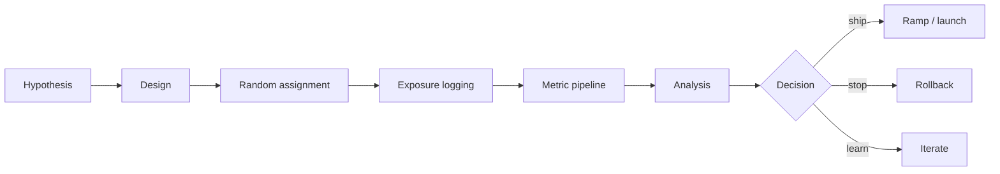
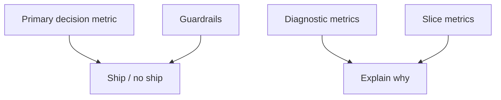
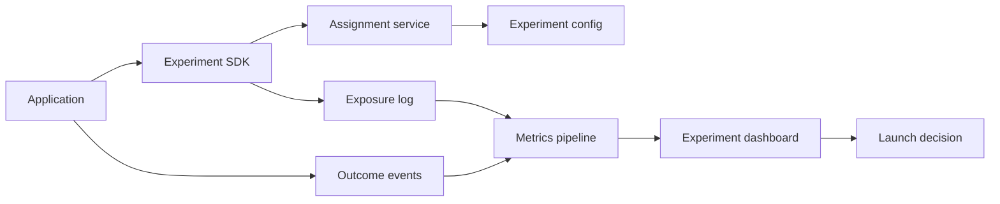

# Online Experiments

## TL;DR

Online experiments measure causal impact under live traffic. They are the bridge between offline ML metrics and real product outcomes. A good experimentation platform controls assignment, exposure logging, metric computation, guardrails, sample ratio checks, segmentation, and rollout decisions. Without this discipline, teams mistake correlation, novelty effects, or broken logging for model improvement.

---

## Experiment Lifecycle

An experiment is not just a traffic split. It is a measurement system with a decision rule.

---

## A/B Test, Canary, Shadow, or Bandit?

| Technique | Primary question | Traffic impact | Best for |
|---|---|---|---|
| Shadow | Can it run safely? | No user decision impact | Runtime validation |
| Canary | Is it safe enough to continue? | Small impact | Release safety |
| A/B test | Is it better? | Controlled user/entity impact | Product and model quality |
| Interleaving | Which ranker wins per query/session? | Mixed results in one surface | Search/recommendation rankers |
| Bandit | Which variant should get more traffic while learning? | Adaptive impact | Fast optimization with clear reward |

Use the weakest technique that answers the decision. Do not use a bandit when you need an unbiased product readout.

---

## Randomization Unit

The unit of randomization must match the interference pattern.

| Unit | Use when | Risk |
|---|---|---|
| Request | Stateless prediction | Same user sees inconsistent behavior |
| User | Personalized product surface | Household/team effects ignored |
| Session | Short-lived experience | Cross-session learning contamination |
| Entity | Marketplace item, merchant, creator | User experience mixes treatment/control |
| Cluster/region | Network or marketplace interference | Needs more traffic and longer duration |

For recommender systems, user-level assignment is common, but marketplace and social systems often have interference: one user's treatment changes another user's inventory or content exposure.

---

## Metric Hierarchy

Examples:

- Primary: conversion, retention, fraud loss, successful task completion.
- Guardrails: latency, error rate, complaint rate, refund rate, manual review volume.
- Diagnostics: feature miss rate, score distribution, ranking depth, cache hit rate.
- Slices: new users, geography, device, language, high-risk tenants, cold-start items.

If the primary metric wins but guardrails fail, the experiment should not ship.

---

## Exposure Logging

Correct exposure logging is the foundation of experiment analysis.

Log:

- Experiment ID and variant.
- Assignment unit and stable identifier.
- Exposure timestamp.
- Model and policy version.
- Surface or placement.
- Candidate set and rank when relevant.
- Eligibility reason and filters.
- Downstream outcomes with event time.

Assignment without exposure can overcount users who were eligible but never saw the treatment.

---

## Common Statistical Checks

### Sample Ratio Mismatch

Expected split is 50/50 but observed exposure is 60/40. This usually indicates assignment, eligibility, logging, or caching bugs.

### Novelty Effects

Users react strongly because a feature is new, not because it is better long term.

### Carryover Effects

Treatment changes user behavior after the experiment ends or contaminates later sessions.

### Multiple Comparisons

If teams inspect many metrics and slices, some will look significant by chance.

### Peeking and Early Stopping

Stopping the first time a metric looks good inflates false positives unless the test is designed for sequential analysis.

---

## Experiment Platform Architecture

The SDK should make assignment and exposure logging hard to separate. Broken logging creates more bad launches than weak statistical tests.

---

## ML-Specific Experiment Issues

### Delayed Labels

Fraud, credit, churn, and abuse outcomes may arrive days or weeks later. Use short-term proxies for monitoring, but wait for delayed labels before declaring long-term quality.

### Training Contamination

If treatment traffic enters the next training dataset, it can contaminate future control comparisons.

### Feedback Loop Changes

Recommendation and ranking models change what data the system collects. Holdout traffic and exploration logs help measure whether the model is learning from its own bias.

### Segment-Specific Regressions

Aggregate wins can hide regressions in important groups. Require slice review before full launch.

---

## Decision Matrix

| Result | Decision |
|---|---|
| Primary wins, guardrails pass, slices pass | Ramp or launch |
| Primary wins, guardrail fails | Do not launch; fix safety or cost |
| Primary neutral, diagnostics improve | Keep learning; maybe ship only if operational benefit matters |
| Primary loses, one slice wins | Consider targeted rollout only if policy and sample size support it |
| SRM detected | Invalidate result until root cause is fixed |
| Delayed labels unavailable | Continue canary or limit authority until labels mature |

---

## Failure Modes

### Metric Mismatch

The experiment optimizes clicks, but the business needs retention or trust.

Mitigation: define metric hierarchy before launch and include long-term guardrails.

### Interference

Control and treatment users affect each other through shared inventory, social graphs, or marketplaces.

Mitigation: cluster randomization, marketplace-level analysis, or experiments isolated by segment.

### Logging Drift

The treatment changes what events are logged, making outcomes incomparable.

Mitigation: event contract tests, invariant metrics, and preflight validation with shadow traffic.

### Experiment Debt

Old experiments keep running, flags stack up, and assignment behavior becomes unreadable.

Mitigation: expiration dates, ownership, cleanup automation, and experiment registry review.

---

## Key Takeaways

1. Online experiments measure causal impact; canaries measure rollout safety.
2. Randomization unit must match the system's interference pattern.
3. Exposure logging is part of the product surface, not an analytics afterthought.
4. Guardrails and slice metrics prevent aggregate wins from becoming production regressions.
5. Delayed labels and feedback loops make ML experiments slower and more operationally complex than ordinary UI tests.

---

## References

1. [Trustworthy Online Controlled Experiments](https://www.cambridge.org/core/books/trustworthy-online-controlled-experiments/6A3B263E7114E81B95669A95B219C1D8)
2. [Controlled Experiments on the Web: Survey and Practical Guide](https://ai.stanford.edu/~ronnyk/2009controlledExperimentsOnTheWebSurvey.pdf)
3. [Overlapping Experiment Infrastructure: More, Better, Faster Experimentation](https://research.google/pubs/overlapping-experiment-infrastructure-more-better-faster-experimentation/)
4. [Improving the Sensitivity of Online Controlled Experiments by Utilizing Pre-Experiment Data](https://www.exp-platform.com/Documents/2013-02-CUPED-ImprovingSensitivityOfControlledExperiments.pdf)
