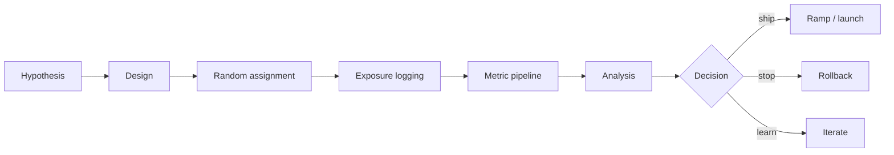
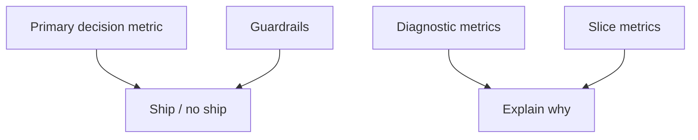
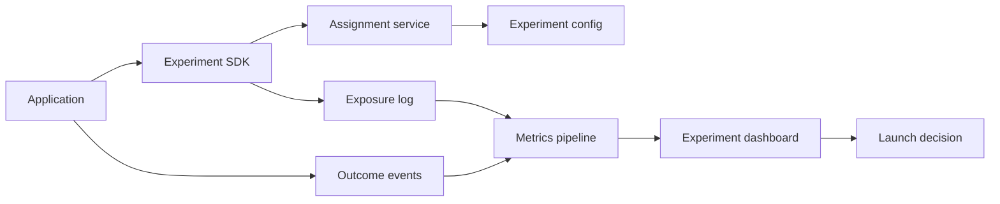

# Online Experiments

## TL;DR

Online experiments measure causal impact under live traffic. They are the bridge between offline ML metrics and real product outcomes. A good experimentation platform controls assignment, exposure logging, metric computation, guardrails, sample ratio checks, segmentation, and rollout decisions. Without this discipline, teams mistake correlation, novelty effects, or broken logging for model improvement.

---

## Experiment Lifecycle



An experiment is not just a traffic split. It is a measurement system with a decision rule.

---

## A/B Test, Canary, Shadow, or Bandit?

| Technique | Primary question | Traffic impact | Best for |
|---|---|---|---|
| Shadow | Can it run safely? | No user decision impact | Runtime validation |
| Canary | Is it safe enough to continue? | Small impact | Release safety |
| A/B test | Is it better? | Controlled user/entity impact | Product and model quality |
| Interleaving | Which ranker wins per query/session? | Mixed results in one surface | Search/recommendation rankers |
| Bandit | Which variant should get more traffic while learning? | Adaptive impact | Fast optimization with clear reward |

Use the weakest technique that answers the decision. Do not use a bandit when you need an unbiased product readout.

---

## Randomization Unit

The unit of randomization must match the interference pattern.

| Unit | Use when | Risk |
|---|---|---|
| Request | Stateless prediction | Same user sees inconsistent behavior |
| User | Personalized product surface | Household/team effects ignored |
| Session | Short-lived experience | Cross-session learning contamination |
| Entity | Marketplace item, merchant, creator | User experience mixes treatment/control |
| Cluster/region | Network or marketplace interference | Needs more traffic and longer duration |

For recommender systems, user-level assignment is common, but marketplace and social systems often have interference: one user's treatment changes another user's inventory or content exposure.

### Consistent Hashing for Stable Assignment

```python
import hashlib

def assign_variant(user_id: str, experiment_id: str, variants: list[str],
                   salt: str = "") -> str:
    """
    Deterministic assignment using consistent hashing.
    Same user + experiment → same variant every time.
    Adding salt allows re-randomization for new experiments.
    """
    key = f"{experiment_id}:{user_id}:{salt}"
    hash_val = int(hashlib.md5(key.encode()).hexdigest(), 16)
    return variants[hash_val % len(variants)]

# Usage
variant = assign_variant("user_456", "exp_rank_v42", ["control", "treatment"])
# Always returns the same variant for user_456 in exp_rank_v42

# To re-randomize for a new experiment: change salt
variant = assign_variant("user_456", "exp_rank_v43", ["control", "treatment"],
                         salt="rerand_2026")
```

---

## Sample Size and Power Analysis

Running an underpowered experiment wastes traffic and produces false negatives.

```python
from scipy import stats
import numpy as np

def required_sample_size(baseline_rate: float, minimum_detectable_effect: float,
                          alpha: float = 0.05, power: float = 0.80,
                          two_sided: bool = True) -> int:
    """
    Compute required sample size per variant for a two-proportion z-test.

    baseline_rate: current conversion/click rate (e.g., 0.10 for 10%)
    minimum_detectable_effect: smallest absolute lift worth detecting (e.g., 0.01)
    alpha: false positive rate (significance level)
    power: true positive rate (1 - β)
    """
    z_alpha = stats.norm.ppf(1 - alpha / 2) if two_sided else stats.norm.ppf(1 - alpha)
    z_beta = stats.norm.ppf(power)

    p1 = baseline_rate
    p2 = baseline_rate + minimum_detectable_effect
    p_pooled = (p1 + p2) / 2

    n = ((z_alpha * np.sqrt(2 * p_pooled * (1 - p_pooled)) +
          z_beta * np.sqrt(p1 * (1 - p1) + p2 * (1 - p2))) ** 2) / \
        (minimum_detectable_effect ** 2)

    return int(np.ceil(n))

# Example: baseline conversion 10%, want to detect 1% absolute lift
n = required_sample_size(baseline_rate=0.10, minimum_detectable_effect=0.01)
print(f"Required per variant: {n:,}")  # ~14,000 per variant

# Total traffic needed: n × 2 variants = ~28,000
# At 1,000 users/day: need ~28 days
# At 10,000 users/day: need ~3 days
```

### When Experiments Are Infeasible

```text
An experiment is infeasible when:

1. (required_users_per_variant × num_variants) / daily_active_users > max_experiment_days
2. Minimum detectable effect is too small for the user base to detect
3. Interference between variants is unavoidable (marketplace, social graph)
4. Ethical constraint: cannot withhold treatment from control (e.g., abuse detection)

Alternatives when experimentation is infeasible:
  - Observational causal methods (difference-in-differences, instrumental variables)
  - Pre/post analysis with holdout baseline
  - Staged rollout (geo by geo, segment by segment) with synthetic control
  - Human evaluation panels
```

---

## Metric Hierarchy



Examples:

- Primary: conversion, retention, fraud loss, successful task completion.
- Guardrails: latency, error rate, complaint rate, refund rate, manual review volume.
- Diagnostics: feature miss rate, score distribution, ranking depth, cache hit rate.
- Slices: new users, geography, device, language, high-risk tenants, cold-start items.

If the primary metric wins but guardrails fail, the experiment should not ship.

---

## Exposure Logging

Correct exposure logging is the foundation of experiment analysis.

Log:

- Experiment ID and variant.
- Assignment unit and stable identifier.
- Exposure timestamp.
- Model and policy version.
- Surface or placement.
- Candidate set and rank when relevant.
- Eligibility reason and filters.
- Downstream outcomes with event time.

Assignment without exposure can overcount users who were eligible but never saw the treatment.

### Intent-to-Treat vs Treatment-on-the-Treated

```python
# Intent-to-Treat (ITT): analyze everyone assigned, regardless of exposure.
# Conservative but unbiased. The right default.

def itt_analysis(assignments, outcomes):
    """Compare outcomes by assignment, ignoring whether treatment was received."""
    treatment_outcomes = [o for a, o in zip(assignments, outcomes) if a == "treatment"]
    control_outcomes = [o for a, o in zip(assignments, outcomes) if a == "control"]
    return compute_lift(treatment_outcomes, control_outcomes)

# Treatment-on-the-Treated (TOT): analyze only users who actually received treatment.
# Higher measured effect but introduces selection bias.
# Only use when non-exposure is a different mechanism from non-response.
```

---

## Common Statistical Checks

### Sample Ratio Mismatch (SRM)

Expected split is 50/50 but observed exposure is 60/40. This usually indicates assignment, eligibility, logging, or caching bugs.

```python
from scipy.stats import chi2_contingency

def check_srm(observed_counts: dict[str, int], expected_ratios: dict[str, float],
              alpha: float = 0.001) -> dict:
    """
    Check for Sample Ratio Mismatch using a chi-squared test.
    Low p-value (< 0.001) means the observed split is unlikely under the design.
    """
    variants = list(expected_ratios.keys())
    observed = [observed_counts.get(v, 0) for v in variants]
    total = sum(observed)
    expected = [total * expected_ratios[v] for v in variants]

    chi2, p_value, dof, _ = chi2_contingency([observed, expected])

    srm_detected = p_value < alpha
    if srm_detected:
        print(f"SRM DETECTED: p={p_value:.6f}")
        for v, o, e in zip(variants, observed, expected):
            print(f"  {v}: observed={o}, expected={e:.0f}, "
                  f"ratio={o/total:.2%} vs {expected_ratios[v]:.0%}")
    return {"srm_detected": srm_detected, "p_value": p_value, "chi2": chi2}
```

SRM invalidates the experiment. Do not ship on an SRM-failing result until the root cause (assignment bug, logging bug, eligibility filter drift) is fixed.

### Peeking and Sequential Testing

Stopping the first time a metric looks good inflates false positives unless the test is designed for sequential analysis.

```python
# The peeking problem: checking daily and stopping when p < 0.05
# With 10 daily peeks, the actual false positive rate rises from 5% to ~20%

# Solution: use sequential testing with adjusted boundaries
# Alpha-spending: allocate your total alpha budget across interim looks

def sequential_boundaries(num_looks: int, total_alpha: float = 0.05):
    """
    Pocock boundaries: equal alpha spent at each look.
    More conservative than fixed-horizon, but allows early stopping.
    """
    alpha_per_look = total_alpha / num_looks
    z_critical = stats.norm.ppf(1 - alpha_per_look / 2)
    return z_critical  # e.g., 2.41 for 5 looks, vs 1.96 for one look

# Rule: never stop an experiment before the pre-registered duration
# unless a sequential testing boundary is defined before the experiment starts
```

### CUPED: Variance Reduction with Pre-Experiment Data

```python
def cuped_adjust(metric_values, pre_experiment_covariate):
    """
    CUPED (Controlled-experiment Using Pre-Experiment Data).
    Reduces variance by regressing out pre-experiment behavior.
    Can reduce required sample size by 30-50%.
    """
    import numpy as np
    from scipy import stats

    # Compute θ: covariance / variance of covariate
    theta = np.cov(metric_values, pre_experiment_covariate)[0, 1] / \
            np.var(pre_experiment_covariate)

    # Adjusted metric: Y_cuped = Y - θ * (X - X̄)
    adjusted = metric_values - theta * (pre_experiment_covariate -
                                         np.mean(pre_experiment_covariate))

    variance_reduction = 1 - np.var(adjusted) / np.var(metric_values)
    print(f"CUPED variance reduction: {variance_reduction:.1%}")

    return adjusted

# Example: metric = 30-day retention, covariate = 7-day retention before experiment
# Users with high pre-experiment retention have higher baseline → variance shrinks
```

### Multiple Comparisons

If teams inspect many metrics and slices, some will look significant by chance.

```python
def bonferroni_correction(p_values: list[float], alpha: float = 0.05) -> list[bool]:
    """Adjust for multiple comparisons. p_i < alpha / n to reject."""
    n = len(p_values)
    return [p < alpha / n for p in p_values]

def benjamini_hochberg(p_values: list[float], alpha: float = 0.05) -> list[bool]:
    """
    Control false discovery rate (FDR) instead of family-wise error rate.
    Less conservative than Bonferroni; better for exploratory analysis.
    """
    n = len(p_values)
    sorted_idx = np.argsort(p_values)
    sorted_p = np.array(p_values)[sorted_idx]
    thresholds = [(i + 1) / n * alpha for i in range(n)]
    k = max((i for i in range(n) if sorted_p[i] <= thresholds[i]), default=-1)
    return [p_values[i] <= (sorted_p[k] if k >= 0 else 0) for i in range(n)]
```

---

## Experiment Platform Architecture



The SDK should make assignment and exposure logging hard to separate. Broken logging creates more bad launches than weak statistical tests.

### Experiment SDK Pattern

```python
class ExperimentClient:
    """
    Thin SDK: assignment, exposure logging, and variant retrieval.
    Separating these is a common source of bugs.
    """
    def __init__(self, config_service, log_sink):
        self.config = config_service
        self.log = log_sink

    def get_variant(self, experiment_id: str, unit_id: str,
                    attributes: dict = None) -> str:
        """Returns variant AND logs exposure atomically."""
        # 1. Assignment
        variant = assign_variant(unit_id, experiment_id,
                                 self.config.get_variants(experiment_id))

        # 2. Exposure log — synchronous, fire-and-forget, or buffered
        self.log.exposure(
            experiment_id=experiment_id,
            unit_id=unit_id,
            variant=variant,
            timestamp_ms=time_ms(),
            attributes=attributes or {},
        )

        return variant

# Anti-pattern: application gets variant, then separately logs exposure.
# Invariably, some code path calls get_variant() without logging.
```

---

## ML-Specific Experiment Issues

### Delayed Labels

Fraud, credit, churn, and abuse outcomes may arrive days or weeks later. Use short-term proxies for monitoring, but wait for delayed labels before declaring long-term quality.

### Training Contamination

If treatment traffic enters the next training dataset, it can contaminate future control comparisons.

### Feedback Loop Changes

Recommendation and ranking models change what data the system collects. Holdout traffic and exploration logs help measure whether the model is learning from its own bias.

### Segment-Specific Regressions

Aggregate wins can hide regressions in important groups. Require slice review before full launch.

### Interleaving for Ranking Experiments

```python
def interleaved_ranking(ranking_a, ranking_b, query):
    """
    Team-draft interleaving: alternate items from each ranker.
    More sensitive than A/B testing for ranking quality comparisons.
    Requires 10-100x fewer users to detect the same effect.
    """
    interleaved = []
    seen = set()
    a_idx, b_idx = 0, 0

    # Alternate: ranker A picks first (randomized), then B, then A, ...
    # Skip items already selected by the other ranker
    while len(interleaved) < 20:
        # Ranker A's turn
        while a_idx < len(ranking_a) and ranking_a[a_idx] in seen:
            a_idx += 1
        if a_idx < len(ranking_a):
            item = ranking_a[a_idx]
            interleaved.append({"item": item, "source": "ranker_a"})
            seen.add(item)
            a_idx += 1

        # Ranker B's turn
        while b_idx < len(ranking_b) and ranking_b[b_idx] in seen:
            b_idx += 1
        if b_idx < len(ranking_b):
            item = ranking_b[b_idx]
            interleaved.append({"item": item, "source": "ranker_b"})
            seen.add(item)
            b_idx += 1

        if a_idx >= len(ranking_a) and b_idx >= len(ranking_b):
            break

    # Metric: clicks attributed to each ranker based on source
    clicks_a = sum(1 for slot in interleaved if slot["source"] == "ranker_a" and slot.get("clicked"))
    clicks_b = sum(1 for slot in interleaved if slot["source"] == "ranker_b" and slot.get("clicked"))
    return interleaved, {"clicks_a": clicks_a, "clicks_b": clicks_b}
```

---

## Decision Matrix

| Result | Decision |
|---|---|
| Primary wins, guardrails pass, slices pass | Ramp or launch |
| Primary wins, guardrail fails | Do not launch; fix safety or cost |
| Primary neutral, diagnostics improve | Keep learning; ship only if operational benefit matters |
| Primary loses, one slice wins | Consider targeted rollout only if policy and sample size support it |
| SRM detected | Invalidate result until root cause is fixed |
| Delayed labels unavailable | Continue canary or limit authority until labels mature |

---

## Failure Modes

### Metric Mismatch

The experiment optimizes clicks, but the business needs retention or trust.

Mitigation: define metric hierarchy before launch and include long-term guardrails.

### Interference

Control and treatment users affect each other through shared inventory, social graphs, or marketplaces.

Mitigation: cluster randomization, marketplace-level analysis, or experiments isolated by segment.

### Logging Drift

The treatment changes what events are logged, making outcomes incomparable.

Mitigation: event contract tests, invariant metrics, and preflight validation with shadow traffic.

### Experiment Debt

Old experiments keep running, flags stack up, and assignment behavior becomes unreadable.

Mitigation: expiration dates, ownership, cleanup automation, and experiment registry review.

### Peeking-Induced False Positives

Team checks dashboard daily, stops when p < 0.05. Actual false positive rate is ~20%, not 5%.

Mitigation: pre-register experiment duration and analysis plan. Use sequential testing boundaries if early stopping is required.

---

## Key Takeaways

1. Online experiments measure causal impact; canaries measure rollout safety.
2. Randomization unit must match the system's interference pattern.
3. Exposure logging is part of the product surface, not an analytics afterthought.
4. Guardrails and slice metrics prevent aggregate wins from becoming production regressions.
5. Delayed labels and feedback loops make ML experiments slower and more operationally complex than ordinary UI tests.
6. Sample ratio mismatch invalidates the experiment — fix the root cause before interpreting results.
7. Use CUPED to reduce variance by 30-50% and run experiments faster.
8. Never peek at results and stop early without pre-registered sequential testing boundaries.

---

## References

1. [Trustworthy Online Controlled Experiments](https://www.cambridge.org/core/books/trustworthy-online-controlled-experiments/6A3B263E7114E81B95669A95B219C1D8)
2. [Controlled Experiments on the Web: Survey and Practical Guide](https://ai.stanford.edu/~ronnyk/2009controlledExperimentsOnTheWebSurvey.pdf)
3. [Overlapping Experiment Infrastructure: More, Better, Faster Experimentation](https://research.google/pubs/overlapping-experiment-infrastructure-more-better-faster-experimentation/)
4. [Improving the Sensitivity of Online Controlled Experiments by Utilizing Pre-Experiment Data](https://www.exp-platform.com/Documents/2013-02-CUPED-ImprovingSensitivityOfControlledExperiments.pdf)
5. [Sequential Testing for A/B Experiments](https://www.evanmiller.org/sequential-ab-testing.html)
6. [Interleaving for Ranking Evaluation](https://www.cs.cornell.edu/people/tj/publications/chapelle_etal_12a.pdf)
