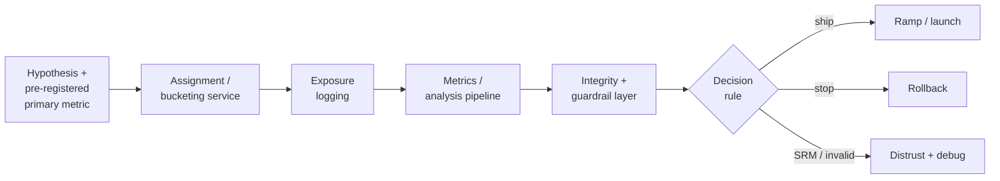

# Online Experiments

## TL;DR

An online experiment is the causal-inference infrastructure that answers the only question that ultimately matters in production ML: *did this change actually help?* Offline metrics, canary health, and dashboards full of correlations cannot answer it, because none of them observe the counterfactual — what would have happened to the same users under the old system at the same moment. A randomized controlled experiment manufactures that counterfactual by splitting traffic and comparing concurrent, comparable populations. The platform that does this well is a measurement system with a decision rule: deterministic assignment, exposure logging, a metrics pipeline, guardrails, and integrity checks. The hard parts are not the statistics; they are treating assignment as a distributed-systems correctness problem, trusting the data before trusting the result, and resisting the temptation to read a number before the experiment has earned it.

---

## Why Experiments Exist: The Counterfactual Offline Metrics Cannot See

Every other measurement an ML system produces is confounded. The model's offline AUC improved, but the holdout set is a frozen snapshot of a world the model will now change. Engagement went up after launch, but engagement also went up because it was December, because a competitor had an outage, because a marketing campaign ran the same week. Logs are a record of what happened under one policy; they contain no information about what *would* have happened under a different one. Correlation in observational data is the rule, not the exception, and almost none of it is causal.

The defining property of a controlled experiment is that randomization breaks confounding *by construction*. When you assign users to control and treatment by a coin flip, the two groups are statistically identical in every respect — known and unknown, measured and unmeasured — except the one thing you changed. Any difference in outcomes that exceeds noise must therefore be *caused* by the change. This is the entire reason experiments are the gold standard: they are the only mechanism that isolates causation from the tangle of correlation that production data is made of.

This matters acutely for ML because offline and online success are only loosely coupled. A model can post a better validation metric and lose money, because the offline metric measured ranking accuracy on logged data while the business cares about long-term retention. It can pass a canary — healthy latency, no error spike, stable score distribution — and still degrade the product, because [deployment rollouts](./06-model-deployment-rollouts.md) verify *operational* safety, not *business* impact. The canary tells you the new model will not fall over; the experiment tells you whether anyone is better off for it. The engineering implication is that experimentation is not a data-science nicety bolted onto the side of an ML platform. It is the feedback channel that makes the entire training-and-deployment loop honest, and the discipline that prevents a team from shipping a year of "improvements" that, measured properly, net to zero.

The payoff, when this is done well, is enormous and well documented. The most cited example is from Microsoft's Bing: a single engineer's change to how ad headlines were displayed sat in the backlog for months because it looked trivial; when finally tested it increased revenue by roughly 12% — over one hundred million dollars a year — with no measurable harm to user experience. No human judged it important; only the experiment did. The same body of work shows the inverse just as forcefully. Ron Kohavi reports that across Microsoft, Google, and Bing, only about a third of well-designed ideas actually improve the metric they were built to improve; another third are flat, and a third are negative. Without experiments, an organization ships all three kinds and calls all of them wins.

---

## The Experiment Is a Measurement System, Not a Traffic Split

It is tempting to think an experiment is "send 50% of traffic to the new model." That is one component of one stage. The system is the chain that turns a hypothesis into a trustworthy decision, and every stage can silently invalidate the result.



Four properties make this a system rather than a flowchart. Assignment must be *deterministic and independent*, so a user's bucket is stable and uncorrelated with anything else. Exposure logging must be *faithful*, recording who actually saw the treatment, not merely who was eligible. The metrics pipeline must be *reproducible*, computing the same numbers from the same logs every time. And an *integrity layer* must sit in front of the decision, refusing to let a corrupted experiment reach a human who will read it as truth. Mature platforms — Microsoft's ExP, Google's overlapping-experiment infrastructure, Airbnb's ERF, Netflix's XP, LinkedIn's T-REX, Booking.com's platform that runs over a thousand concurrent experiments — are mostly investment in those four properties, not in statistical tests, which are the easy and well-understood part.

---

## Choosing the Right Instrument

The A/B test is the canonical experiment, but it is one of several instruments, and the discipline is to use the *weakest* one that answers the question being asked — because each stronger instrument costs more traffic, more time, or more risk. The instruments form a ladder distinguished by the question they answer, not merely by how they split traffic.

A **shadow** deployment runs the new model on live traffic but discards its output, so it answers "can this run safely at production load?" without ever affecting a user. A **canary** routes a small slice of real traffic to the new system and watches operational health, answering "is this safe enough to keep ramping?" — it is a [rollout safety](./06-model-deployment-rollouts.md) mechanism, not a measurement of value. An **A/B test** is the first instrument that answers "is this *better*?", because it holds a concurrent control group and measures the causal difference in outcomes. **Interleaving** is a specialized, high-sensitivity instrument for ranking: instead of showing different users different rankers, it blends two rankers' results into one list per query and attributes clicks to their source, which can detect a ranking difference with one to two orders of magnitude less traffic than a user-split A/B test — at the cost of only answering the narrow question "which ranker wins per query?" A **bandit** continuously shifts traffic toward whichever variant is performing best, answering "how do I maximize reward while still learning?" — ideal for fast optimization against a clear, short-term reward, but the wrong tool when you need an unbiased, stable readout of product impact, because its adaptive allocation deliberately breaks the fixed, balanced split that clean measurement depends on.

The engineering implication is that these are not interchangeable. A canary that looks healthy is not evidence the change helped; a bandit that converged is not an unbiased estimate of effect size. Reach for the A/B test when the decision is "ship or not," for interleaving when the decision is purely about ranking quality, and for the bandit only when continuous optimization matters more than a trustworthy one-time verdict.

---

## Assignment Is a Distributed-Systems Correctness Problem

The bucketing service decides which variant each unit sees, and its correctness requirements are those of a distributed system, not a statistics package. Three invariants must hold simultaneously across every server, region, and request that touches the experiment.

Assignment must be **deterministic**: the same user must land in the same bucket on every request, on every machine, with no shared state and no network call. The standard solution is a pure function — hash the unit identifier together with the experiment identifier, and map the hash to a bucket. Because the function is deterministic, a thousand stateless servers compute the same assignment for a given user without coordinating, which is exactly the property a high-traffic serving path needs.

Assignment must be **independent across experiments**. If experiment A and experiment B both hash on the raw user ID, a user in A's treatment is also, deterministically, in B's treatment — the two experiments become correlated, and each one's effect leaks into the other's measurement. The fix is a *per-experiment salt* mixed into the hash, so each experiment induces a statistically independent shuffle of the population. The same salt mechanism lets you *re-randomize* a follow-up experiment so it is not contaminated by which bucket a user happened to be in last time.

Assignment must produce **no leakage across variants**. A user must never be exposed to both control and treatment, because a user who sees both is comparable to neither. This is harder than it sounds in practice: shared caches keyed without the variant, CDN responses that serve a control-rendered page to a treatment user, and assignment computed inconsistently on client and server all leak treatment across the boundary. The conceptual core of correct assignment fits in a few lines, and the discipline is that this function — and only this function — decides buckets, everywhere.

```python
def assign(unit_id, experiment_id, salt, num_buckets=1000):
    h = stable_hash(f"{experiment_id}:{salt}:{unit_id}")   # consistent, no shared state
    return h % num_buckets                                  # bucket → variant via config
```

The choice of *what* to hash — the randomization unit — is a modeling decision disguised as a configuration value. Randomizing per request maximizes statistical power but shows one user inconsistent behavior and is only valid for stateless predictions. Randomizing per user gives a coherent experience and is the default for personalized surfaces. Randomizing per session, per entity (a merchant, a creator, a listing), or per cluster trades power for correctness when the smaller unit would let treatment and control interfere. The rule is to randomize at the *coarsest unit at which interference still occurs* — the smallest unit that keeps the groups genuinely independent, because finer units buy power and coarser units buy validity.

---

## Exposure Logging: Measuring Who Was Actually Treated

Assignment says which bucket a user is in; exposure logging says whether the user actually *experienced* the treatment. The gap between the two is where a large fraction of experiment bugs live. A user assigned to a new ranking model who never issued a query was assigned but never exposed; counting them dilutes the measured effect toward zero and can hide a real win. The exposure log must record, at the moment of treatment, the experiment and variant, the stable unit identifier, the timestamp, the model and policy version, the surface, and — for ranking systems — the candidate set and positions shown. This is the same exposure log that [recommendation systems](./07-recommendation-systems.md) depend on for unbiased training data; the experiment and the model share it, which is why faithful logging is load-bearing twice over. When outcomes arrive later, the exposure ID becomes the join anchor for the label system, which is why label correctness and experiment correctness are coupled (see [Label and Ground-Truth Systems](./10-label-ground-truth-systems.md)).

The analysis convention that keeps this honest is **intent-to-treat**: analyze every unit by the bucket it was *assigned* to, regardless of whether it was exposed or complied. Intent-to-treat is conservative — it includes never-exposed users — but it is unbiased, because the assignment was random while exposure is not. Filtering down to "users who actually received treatment" feels more precise and is a classic trap: exposure is itself an outcome influenced by the treatment, so conditioning on it reintroduces exactly the selection bias randomization was meant to destroy. The safe default is to analyze by assignment and treat any deviation as a deliberate, justified exception.

---

## Sample Ratio Mismatch: The Canonical Integrity Alarm

Before any result is interpreted, one check overrides all others: did the traffic actually split the way it was supposed to? If an experiment was configured 50/50 but the observed exposure is 50.2/49.8 on millions of users, something is broken. This is **Sample Ratio Mismatch**, and it is the single most important data-integrity alarm in experimentation because it is a *system* failure, not a statistical subtlety. The intended ratio is a known constant; a significant deviation from it means the pipeline that produced the data is faulty, and a faulty pipeline can produce any result, including a falsely positive one.

The reason SRM is so diagnostic is that the split ratio has *no business reason to drift*. When it does, the cause is almost always a mechanical bug that also biases the metric: a treatment that loads more slowly loses more users before they are logged, so the treatment bucket under-counts exactly the impatient users who would have dragged its metric down — the experiment then "wins" because its weakest users silently vanished. Other classic causes are redirect loss (a treatment that bounces through an extra redirect loses traffic that control keeps), asymmetric bot filtering, caching that serves one variant disproportionately, and a logging path present in one arm but not the other. Fabijan et al.'s KDD 2019 work at Microsoft showed SRM is common enough — appearing in a meaningful fraction of experiments — that automated SRM detection is now table stakes on any serious platform.

The operational rule is absolute: **an experiment that fails the SRM check is invalid, and its metrics must not be read.** A team that "eyeballs the SRM but ships anyway because the win is large" has learned nothing, because the same bug that broke the ratio likely manufactured the win. A trustworthy platform surfaces SRM before it surfaces the primary metric, so the integrity verdict is reached before anyone forms an opinion about the result. SRM is the experimentation analog of a checksum failure: you do not interpret corrupted data, you fix the corruption.

SRM triage runbook:

```text
Alert: expected 50/50 split, observed 48.7/51.3, p < 1e-6
1. Freeze decision: hide effect metrics and mark experiment invalid.
2. Check assignment logs: bucket function, salt, config rollout, client/server mismatch.
3. Check exposure logs: is one arm logging later, less often, or after an extra redirect?
4. Check filtering: bots, fraud filters, geography, app versions, privacy consent by arm.
5. Check caching: CDN/app cache keys include experiment and variant?
6. Backfill only if the missingness mechanism is proven random; otherwise restart experiment.
```

Most SRMs are not fixable by reweighting because the missing users are usually missing for a reason correlated with the treatment.

---

## Statistical Concepts as Design Constraints

The statistics an experimentation system needs are not a textbook of derivations; they are a handful of constraints that shape how the system is built and operated. Each one, gotten wrong, quietly converts the platform from a truth-teller into a random-number generator.

**Statistical power and minimum detectable effect** govern how much traffic an experiment needs. Power is the probability of detecting a real effect of a given size; the convention is 80%. The smaller the effect you want to detect — the *minimum detectable effect* — the more samples you need, and the relationship is steep: halving the detectable effect roughly quadruples the required sample size. The engineering implication is that an underpowered experiment is worse than no experiment, because it consumes traffic and produces a confident-looking "no significant difference" that is actually a failure to measure. Before running, a platform should compute the required sample size from the baseline rate and the smallest effect worth shipping, and refuse experiments that cannot reach it in a reasonable window. Variance-reduction techniques like CUPED — which regresses out each user's pre-experiment behavior — buy back power without more traffic, often cutting required sample size by a third to a half, and are pure efficiency: same answer, less traffic.

A rough binary-metric sample-size estimate makes the trade-off visible:

```text
n_per_arm ≈ 16 × p(1-p) / δ²      # 80% power, 5% alpha, rule-of-thumb

baseline conversion p = 0.10
minimum detectable absolute lift δ = 0.002  (10.0% → 10.2%)

n_per_arm ≈ 16 × 0.10 × 0.90 / 0.002² ≈ 360,000 users per arm
```

Halving the MDE to 0.1 percentage points requires roughly four times the users. This is why "just run it for a day" is not an experiment plan; it is a traffic allocation with unknown sensitivity.

**Peeking** is the most common way honest teams fool themselves. A fixed-horizon significance test is only valid if you look *once*, at the pre-committed end. If you check the dashboard every day and stop the first time `p < 0.05`, you are running many tests and reporting the luckiest one; the true false-positive rate inflates from the nominal 5% to 20% or more. This is not a statistical nuance to wave away — it is the difference between a platform that ships real wins and one that ships noise. There are only two correct designs: fix the horizon in advance and do not stop early, or adopt a *sequential testing* method (always-valid p-values, group-sequential boundaries) that is mathematically built to permit continuous monitoring. What you cannot do is use a fixed-horizon test and peek; the system should enforce this by hiding the verdict until the pre-registered duration or by computing sequential boundaries natively.

**Multiple comparisons** are peeking across metrics instead of across time. Examine fifty metrics and twenty slices and, at a 5% threshold, several will look significant by pure chance. A platform that lets analysts hunt through hundreds of numbers for a green cell manufactures false discoveries by design. The defenses are to *pre-register the primary metric* so that one number carries the decision, and to apply a correction (Bonferroni for strict control, Benjamini-Hochberg for exploratory false-discovery-rate control) to everything else, treating secondary findings as hypotheses to confirm, not conclusions to ship.

**Novelty and primacy effects** are why duration is a validity constraint, not a convenience. A new UI or recommendation behavior can spike engagement simply because it is different — users click the unfamiliar thing — and the effect decays within days as novelty wears off. The mirror image, primacy, is when users initially resist a change they later prefer. An experiment stopped at its early peak measures the transient, not the steady state. The system implication is a *minimum duration* (typically capturing at least one or two full weekly cycles) so that the measured effect reflects sustained behavior rather than a reaction to change.

---

## Metric Design: One Primary Metric, Guarded

A trustworthy experiment commits to its metrics *before* it sees data, and structures them in a hierarchy. At the top is a single **primary metric**, the Overall Evaluation Criterion (OEC): the one number that, by prior agreement, decides ship-or-not. Pre-registering it is what makes the decision honest — it removes the freedom to go looking for whichever metric happened to move. Beneath it sit **guardrail metrics**: things that must not get worse even if the primary improves, such as latency, error rate, crash rate, complaint and refund rates, and revenue. Below those are **diagnostic metrics** that explain *why* a result happened — score distributions, candidate-set sizes, cache hit rates — but never decide on their own.

The guardrail layer encodes a hard-won principle: a win on the primary metric is not a license to ship if a guardrail breaks. This is the same *guarded primary metric* discipline that governs [recommendation systems](./07-recommendation-systems.md) — promote on engagement only when the metrics you refuse to sacrifice confirm you are not buying short-term clicks with long-term harm. Guardrails also catch the most direct attack on the system: metric hacking. A model can almost always move a narrow proxy (immediate clicks) by sacrificing the real goal (satisfaction, retention) — clickbait is the canonical example. Guardrails and a carefully chosen OEC are the structural defense against optimizing a number into the ground.

The cost of guardrails is itself measurable. Bing's performance experiments famously quantified that a 100-millisecond server slowdown reduced revenue by about 0.6%, and Amazon's early work found every 100 milliseconds of latency cost roughly 1% of sales — which is precisely why latency is a near-universal guardrail. The experiment that improves relevance but adds 200 milliseconds may well be a net loss, and only a guardrail makes that trade-off visible before launch.

---

## Network Effects and Interference: When Randomization Breaks

User-level randomization rests on a hidden assumption from causal inference called SUTVA — the *stable unit treatment value assumption* — which says one unit's outcome depends only on its own treatment, not on anyone else's. In many of the most valuable systems, this assumption is simply false, and ignoring it produces confidently wrong results.

Interference appears wherever units share a resource or influence each other. In a two-sided **marketplace**, a treatment that makes treated buyers more aggressive consumes inventory that control buyers can no longer book — the treatment effect bleeds into control through the shared supply, and the measured difference understates or distorts the true effect. In a **social network**, a feature that makes treated users post more changes the feed of their control friends. In **ride-sharing or ads**, treatment and control bid for the same finite drivers or ad slots. In every case, randomizing by user violates SUTVA because the control group is no longer an untouched counterfactual; it has been contaminated by the treatment it was supposed to be compared against.

The architectural responses change the unit of randomization to restore independence. **Cluster randomization** assigns whole groups — geographic regions, social communities, supply markets — to a single arm, so interference happens *within* a cluster (where everyone shares a treatment) rather than *across* the experimental boundary. **Switchback experiments** randomize over *time* instead of users, flipping an entire market between control and treatment in alternating windows, which is the standard design for marketplaces where spatial clusters still leak. Both buy validity at a steep cost in power, because the effective sample size is the number of clusters or time-blocks, not the number of users — a few dozen regions, not a few million people. The engineering judgment is to detect when interference is plausible and accept the power penalty, because a high-powered measurement of the wrong quantity is worthless.

---

## Heterogeneous Effects: A Positive Average Can Hide a Harmed Segment

The headline of an experiment is an average treatment effect, and an average is a summary that can conceal as much as it reveals. A model change that improves the aggregate metric by 1% may be improving the experience for the majority while actively harming a minority — new users, a particular locale, a specific device class, a high-risk tenant, cold-start items with little history. The average ships; the harmed segment is discovered in a support escalation weeks later.

This is why slice analysis is a required stage, not an optional drill-down: the system must routinely break results down across the segments the business cares about and surface segments where the effect is significantly negative even when the overall effect is positive. The discipline connects directly to [ML risk and governance](./09-ml-risk-governance.md) — a disparate harm across a protected or vulnerable group is not just a metrics curiosity, it is a fairness and compliance obligation, and an aggregate win is not a defense against it. Slice analysis must be balanced against multiple comparisons (enough slices and one will look harmed by chance), so the correct posture is to pre-register the slices that matter, apply a false-discovery correction, and treat a consistent, plausible regression in an important segment as a reason to scope or block the launch rather than to celebrate the average.

---

## The Organizational Discipline: Trustworthiness Is a Culture

The deepest lesson from the literature — Kohavi, Tang, and Xu's *Trustworthy Online Controlled Experiments* (2020) distilling two decades at Amazon, Microsoft, and beyond — is that an experimentation platform is as much an institution as a piece of software. Its product is *trust*: when a result says treatment is better, the organization must be able to act on it without re-litigating whether the pipeline was broken, whether someone peeked, or whether the metric was chosen after the fact. That trust is fragile and is destroyed faster by one celebrated false win than it is built by a hundred honest ones.

This is the practical meaning of **Twyman's law** — "any figure that looks interesting or different is usually wrong" — which is the experimenter's first reflex. A result that is too good to be true (a 25% lift from a button color) is far more likely to be a logging bug, an SRM, or a leak than a genuine discovery, and the trustworthy response is to distrust it until the integrity checks pass. The cultural apparatus that protects trust includes pre-registration of the primary metric and duration, automated SRM and data-quality gates that the analyst cannot bypass, an institutional review of consequential launches, and a maintained registry so that experiments expire, flags are cleaned up, and assignment logic stays legible. An experiment platform without this discipline does not produce weaker results; it produces *untrustworthy* ones, which is worse, because the organization acts on them anyway.

A production experiment registry should make the decision auditable:

```yaml
experiment: feed_ranker_2026q2
owner: recommendations-platform
hypothesis: "new ranker improves long-term satisfied sessions"
unit: user_id
assignment: { hash: murmur3, salt: exp_8f21, allocation: { control: 50, treatment: 50 } }
primary_metric: satisfied_sessions_per_user_7d
guardrails:
  - p99_latency_ms
  - hide_report_rate
  - creator_diversity
  - new_user_retention
minimum_duration_days: 14
power: { baseline: 0.42, mde_relative: 0.01, required_users_per_arm: 1_200_000 }
analysis: { method: fixed_horizon, cuped: true, peeking_allowed: false }
status: running
expires_at: 2026-07-31
```

The registry prevents two common long-term failures: orphaned experiments that keep assigning users forever, and undocumented metric changes after a team has seen the result.

---

## Failure Modes

The characteristic ways experiments mislead recur across organizations, and naming them is most of preventing them.

**Sample ratio mismatch** is the broken pipeline masquerading as a result. The traffic split deviated from the design, which means a mechanical bug shaped the data and very likely the conclusion. The defense is automated SRM detection that gates the result before it is read, and a hard rule never to ship on an SRM-failing experiment.

**Peeking-induced false positives** come from stopping a fixed-horizon test the first time it looks significant, inflating the false-positive rate from 5% to 20% or more. The defense is to pre-register the duration and hide the verdict until it elapses, or to adopt a sequential test designed for continuous monitoring.

**Underpowered experiments** consume traffic and return an inconclusive "no difference" that is really a failure to measure. The defense is an up-front power calculation, variance reduction like CUPED, and refusing experiments that cannot reach adequate sample size in a reasonable window.

**Interference** breaks the control group's role as a clean counterfactual when treatment and control share inventory, a social graph, or a supply pool. The defense is cluster or switchback randomization, chosen by recognizing when SUTVA fails.

**Novelty and primacy effects** let a transient reaction to change masquerade as a durable effect. The defense is a minimum duration spanning full behavioral cycles so the steady state, not the spike, is measured.

**Twyman's law violations** are the too-good results shipped without scrutiny. A spectacular lift is usually a bug — a leak, a logging asymmetry, an SRM. The defense is institutional skepticism: extraordinary results require extraordinary verification before they are believed.

---

## Decision Framework: When an Experiment Is the Right Tool

A controlled experiment is the gold standard for measuring impact, but it is not always available or appropriate, and forcing one where it does not fit produces false confidence. A small set of questions decides whether an A/B test is the right instrument.

*Is there enough traffic to reach adequate power on the smallest effect worth shipping?* If the user base is too small or the effect too subtle, the experiment will be underpowered and its "no difference" verdict meaningless; a staged geo rollout with a synthetic-control comparison, or a longer aggregation window, may be the only honest option.

*Can treatment and control be kept independent?* If interference is unavoidable and even cluster or switchback designs cannot isolate the arms, a user-level A/B test will measure the wrong quantity, and a marketplace-level or time-based design is required instead.

*Is withholding the treatment ethical and safe?* For some changes — a fix to an abuse or fraud detector, a security patch, a safety guardrail — denying the improvement to a control group is unacceptable, and the right move is a staged rollout with monitoring rather than a holdout.

*Does the outcome that matters arrive within the experiment's horizon?* When the true outcome is long-horizon — multi-year retention, credit default, lifetime value — and labels arrive weeks or months late, a short experiment can only measure proxies. The discipline is to use short-term proxies for the ramp decision while reserving long-running holdbacks and observational causal methods (difference-in-differences, instrumental variables, synthetic control) for the slow truth.

When the answers line up — sufficient traffic, separable arms, ethical to withhold, an outcome observable in time — a randomized experiment is the most reliable evidence a system can produce, and should be the default gate on any consequential ML change. When they do not, the right response is not to run a broken experiment and trust it anyway; it is to reach for the next-best causal method and be explicit about its weaker guarantees.

---

## Key Takeaways

1. Experiments exist to expose causation: randomization breaks confounding by construction, which is the only honest way to know whether a change helped. Offline metrics and canary health cannot answer the business question.
2. The platform is a measurement system — assignment, exposure logging, metrics pipeline, integrity layer, decision rule — not a traffic split. Each stage can silently invalidate the result.
3. Treat assignment as a distributed-systems problem: deterministic hashing for stable, coordination-free buckets; a per-experiment salt for independence; and zero leakage of treatment across variants.
4. Randomize at the coarsest unit where interference still occurs — fine units buy power, coarse units buy validity.
5. Sample ratio mismatch is a system bug, not a stats nuance: a split that drifts from its design means the pipeline is broken, and a broken pipeline can manufacture any result. SRM-failing experiments are invalid, full stop.
6. Statistics are design constraints: size for adequate power, never peek at a fixed-horizon test, correct for multiple comparisons, and run long enough to outlast novelty effects.
7. Pre-register one guarded primary metric; guardrails block wins that break latency, revenue, or trust, and defend against metric hacking.
8. Interference breaks SUTVA in marketplaces and social systems; cluster and switchback designs restore validity at a real cost in power.
9. A positive average can hide a harmed segment — slice analysis is a required stage and a governance obligation, not an optional drill-down.
10. The platform's product is trust; Twyman's law and institutional review exist because one celebrated false win destroys more credibility than a hundred honest results build.

---

## References

1. [Trustworthy Online Controlled Experiments: A Practical Guide to A/B Testing](https://www.cambridge.org/core/books/trustworthy-online-controlled-experiments/6A3B263E7114E81B95669A95B219C1D8) — Kohavi, Tang & Xu, 2020
2. [Controlled Experiments on the Web: Survey and Practical Guide](https://ai.stanford.edu/~ronnyk/2009controlledExperimentsOnTheWebSurvey.pdf) — Kohavi et al., 2009
3. [Diagnosing Sample Ratio Mismatch in Online Controlled Experiments](https://www.exp-platform.com/Documents/2019_KDD_SampleRatioMismatch.pdf) — Fabijan et al., KDD 2019
4. [Overlapping Experiment Infrastructure: More, Better, Faster Experimentation](https://research.google/pubs/overlapping-experiment-infrastructure-more-better-faster-experimentation/) — Tang et al., Google, 2010
5. [Improving the Sensitivity of Online Controlled Experiments by Utilizing Pre-Experiment Data (CUPED)](https://www.exp-platform.com/Documents/2013-02-CUPED-ImprovingSensitivityOfControlledExperiments.pdf) — Deng et al., 2013
6. [Sequential Testing for A/B Experiments](https://www.evanmiller.org/sequential-ab-testing.html) — Evan Miller
7. [Detecting Network Effects: Randomizing Over Randomized Experiments](https://www.kdd.org/kdd2017/papers/view/detecting-network-effects-randomizing-over-randomized-experiments) — Saint-Jacques et al., LinkedIn, KDD 2017
8. [It's All A/Bout Testing: The Netflix Experimentation Platform](https://netflixtechblog.com/its-all-a-bout-testing-the-netflix-experimentation-platform-4e1ca458c15) — Netflix, 2016
9. [Experiments at Airbnb](https://medium.com/airbnb-engineering/experiments-at-airbnb-e2db3abf39e7) — Airbnb Engineering
