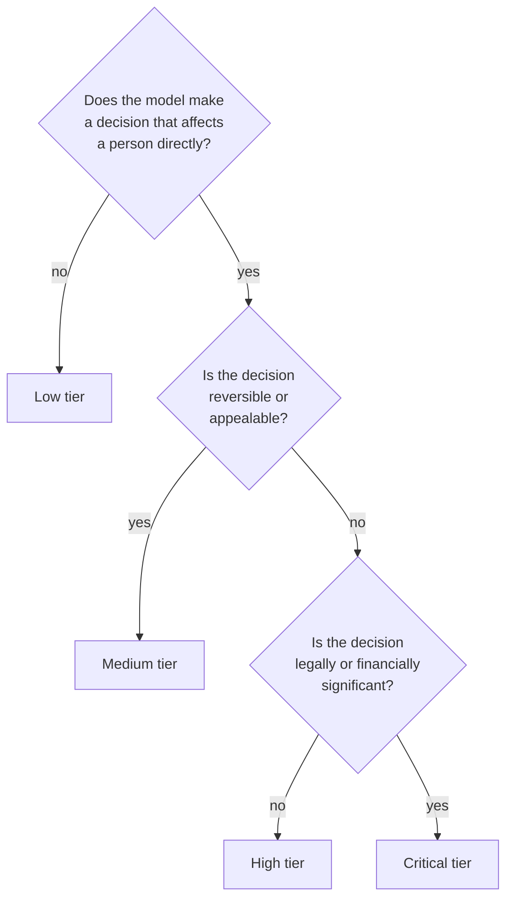
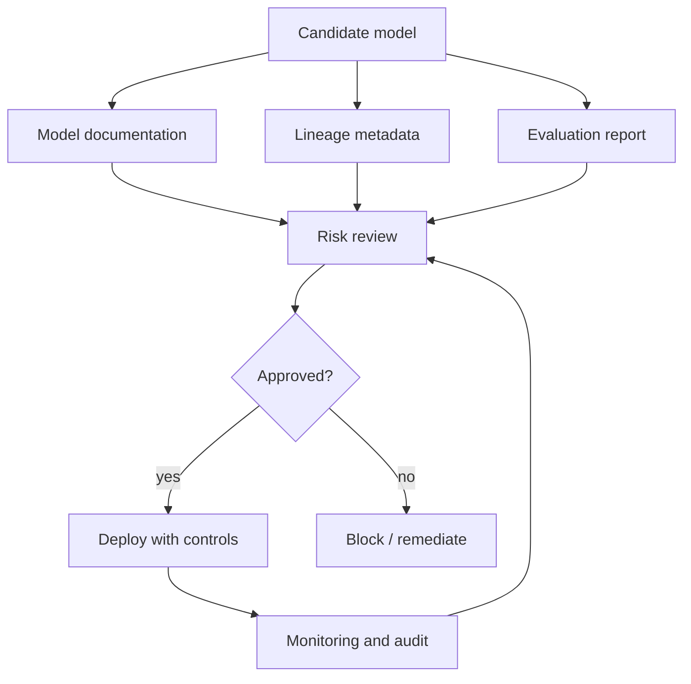

# ML Risk and Governance

## TL;DR

ML governance is the operational system that keeps model decisions accountable. It is not only compliance paperwork. It includes risk tiering, model documentation, lineage, approval gates, access control, audit logs, slice monitoring, human override, incident response, and retirement. The higher the consequence of a wrong prediction, the more the system needs explicit controls outside the model.

---

## Risk Tiers

Not every model needs the same process.

| Tier | Example | Required controls |
|---|---|---|
| Low | Internal recommendation, developer productivity ranking | Basic lineage, owner, monitoring |
| Medium | Marketing personalization, support routing | Experiment review, guardrails, slice monitoring |
| High | Fraud holds, pricing, abuse enforcement | Human override, audit logs, rollback, policy approval |
| Critical | Credit, employment, health, legal access decisions | Formal review, explainability, strict data governance, periodic audit |

Risk tiering prevents low-risk models from being buried in bureaucracy while ensuring high-impact models do not ship as ordinary code changes.

### Risk Tier Classification Flow



### Risk Tier Registry

```python
@dataclass
class ModelRiskProfile:
    model_name: str
    risk_tier: str  # "low", "medium", "high", "critical"
    decision_type: str  # "recommendation", "hold", "block", "price", "deny"
    reversibility: str  # "reversible", "appealable", "irreversible"
    affected_population: str  # "internal", "all_users", "protected_class"
    financial_impact: str  # "none", "user_level", "life_altering"
    regulatory_domain: list[str]  # e.g., ["GDPR", "FCRA", "EU_AI_Act"]

    required_controls: list[str] = field(default_factory=list)

    def __post_init__(self):
        controls = {
            "low": ["lineage", "owner", "basic_monitoring"],
            "medium": ["lineage", "owner", "monitoring", "experiment_review",
                       "guardrails", "slice_monitoring"],
            "high": ["lineage", "owner", "monitoring", "experiment_review",
                     "guardrails", "slice_monitoring", "human_override",
                     "audit_logs", "rollback", "policy_approval"],
            "critical": ["lineage", "owner", "monitoring", "experiment_review",
                         "guardrails", "slice_monitoring", "human_override",
                         "audit_logs", "rollback", "policy_approval",
                         "explainability", "data_governance", "periodic_audit",
                         "retirement_plan", "incident_response_plan"],
        }
        self.required_controls = controls[self.risk_tier]
```

---

## Governance Control Plane



Governance should be encoded into the platform where possible: required metadata, promotion gates, audit logs, and model registry states.

---

## Model Documentation

Model documentation should answer engineering and accountability questions.

| Section | Questions |
|---|---|
| Intended use | What decision does this model support? Who uses it? |
| Not intended use | Where should it not be used? |
| Training data | What data, time range, labels, and exclusions were used? |
| Features | What feature groups and sensitive proxies are involved? |
| Evaluation | Which metrics, slices, and guardrails were checked? |
| Limitations | Known failure cases and low-confidence domains |
| Human controls | Review, override, escalation, appeal |
| Monitoring | Drift, quality, fairness/slice checks, business guardrails |
| Owner | Team, on-call, review cadence |

Documentation should be versioned with the model artifact, not kept in an unowned wiki page.

### Model Card Template

```yaml
# Model Card — versioned with the artifact, not a wiki page
model_card:
  model_name: "fraud_classifier"
  version: "v42"
  risk_tier: "high"
  owner:
    team: "identity-risk"
    on_call: "identity-risk-oncall@example.com"
    review_cadence: "quarterly"

  intended_use:
    description: "Predicts likelihood of fraudulent transaction at authorization time"
    users: "Payment authorization system"
    decision: "Block, manual review, or allow based on score and policy thresholds"

  out_of_scope_use:
    - "Not for credit decisions"
    - "Not for employment screening"
    - "Not for insurance underwriting"
    - "Not for use outside supported geographies"

  training_data:
    source: "warehouse.ml.fraud_training_examples"
    time_range: "2025-01-01 to 2026-06-10"
    label_definition: "Chargeback confirmed within 30 days of transaction"
    label_delay_days: [7, 45]
    exclusions: "Test accounts, internal employees, transactions < $1"
    positive_rate: 0.023
    train_examples: 12_345_678
    test_examples: 3_086_419

  features:
    sensitive_proxies_reviewed: true
    feature_groups:
      - name: "account_risk"
        version: "v12"
        contains_sensitive: false
      - name: "device_velocity"
        version: "v7"
        contains_sensitive: false
    excluded_features: ["precise_location", "device_contacts"]

  evaluation:
    overall_auc_roc: 0.942
    false_positive_rate_at_recall_80: 0.018
    slices:
      - name: "geography_us"
        auc_roc: 0.948
      - name: "geography_eu"
        auc_roc: 0.935
      - name: "new_accounts"
        auc_roc: 0.891
        note: "Lower performance expected; falls back to rules for very new accounts"
    guardrails:
      - "FPR < 2% overall"
      - "No slice below AUC 0.85"
      - "Calibration error < 0.05"

  limitations:
    - "Not calibrated for transactions above $50,000 (insufficient training data)"
    - "May underperform during major shopping events (seasonal distribution shift)"
    - "Does not use real-time merchant reputation signals"
    - "Delayed labels mean quality can only be fully assessed after 30+ days"

  human_controls:
    review_queue: "Transactions with score 0.70-0.95 → manual review"
    override: "Review agent can override block to allow"
    appeal: "Users can appeal blocked transactions via support"
    escalation: "Review agent can escalate to risk team for ambiguous cases"

  monitoring:
    drift_checks: ["PSI on input features", "prediction distribution KL divergence"]
    quality_checks: ["FPR on mature labels", "AUC on 30-day labels"]
    fairness_checks: ["FPR by geography", "approval rate by account age"]
    business_guardrails: ["manual review queue depth < 500", "block rate < 5%"]

  regulatory:
    jurisdictions: ["US", "EU"]
    gdpr_article_22: "Automated decision with human review as safeguard"
    eu_ai_act_risk_category: "Limited risk (with human review)"
    data_retention: "Prediction logs retained 13 months; appeal data retained 3 years"

  retirement:
    plan: "Deprecate when successor model v43 achieves lower FPR on mature labels"
    rollback_target: "v41"
    minimum_retention: "12 months after deprecation for audit purposes"
```

---

## Data and Feature Risk

Risk often enters through data, not model code.

| Risk | Example | Control |
|---|---|---|
| Sensitive attribute use | Age, health, precise location | Data classification and feature allowlists |
| Proxy feature | ZIP code as proxy for protected class | Slice evaluation and review |
| Label bias | Historical enforcement labels reflect past policy | Label audit and human review |
| Consent mismatch | Data collected for one purpose used for another | Data usage contracts |
| Retention violation | Training set keeps data beyond allowed window | Dataset expiration and deletion workflow |

Feature stores and training pipelines should enforce data classification, ownership, and retention metadata.

### Proxy Feature Detection

```python
def detect_proxy_features(model, feature_names, protected_attribute,
                          threshold: float = 0.1):
    """
    Identify features that may act as proxies for a protected attribute.
    A proxy is a feature that predicts the protected attribute well but
    is not itself the protected attribute.
    """
    from sklearn.ensemble import RandomForestClassifier
    from sklearn.metrics import roc_auc_score

    proxies = []
    for i, feat in enumerate(feature_names):
        # Can this feature alone predict the protected attribute?
        X = model.training_data[:, i].reshape(-1, 1)
        clf = RandomForestClassifier(n_estimators=50, max_depth=3)
        scores = cross_val_score(clf, X, protected_attribute, cv=5, scoring="roc_auc")
        auc = scores.mean()

        if auc > 0.5 + threshold:
            proxies.append({
                "feature": feat,
                "auc_predicting_protected": auc,
                "risk": "high" if auc > 0.8 else "medium",
            })

    return proxies

# Example output:
# [
#   {"feature": "zip_code", "auc": 0.72, "risk": "medium"},
#   {"feature": "browser_language", "auc": 0.65, "risk": "medium"},
# ]
# These features should be reviewed: are they legitimate business signals
# or proxies for protected attributes?
```

---

## Human-in-the-Loop Patterns

| Pattern | Use when | Failure mode |
|---|---|---|
| Human review queue | Model confidence is low or action is high-impact | Reviewers rubber-stamp under load |
| Human override | Operators need emergency control | Overrides are not logged or audited |
| Appeal path | Users can contest decision | Appeal data never reaches model owners |
| Two-stage action | Model recommends, human decides | Latency and staffing cost |
| Auto-decision with audit | Low-risk high-volume action | Silent bias or quality drift |

Human review is a system with capacity, quality, and latency constraints. It needs metrics like any other service.

### Review Queue SLOs

```python
@dataclass
class ReviewQueueSLO:
    """SLAs for human review — it's a service, not a safety valve."""
    p95_queue_time_minutes: int = 15    # time from submission to first review
    p95_decision_time_minutes: int = 5  # time from review start to decision
    reviewer_accuracy: float = 0.95     # agreement rate with expert adjudication
    queue_depth_limit: int = 500        # alert if queue exceeds this
    reviewer_capacity_per_hour: int = 20

    def check_health(self, queue_metrics):
        alerts = []
        if queue_metrics.p95_queue_time > self.p95_queue_time_minutes:
            alerts.append(f"Review queue p95 time: {queue_metrics.p95_queue_time}min")
        if queue_metrics.depth > self.queue_depth_limit:
            alerts.append(f"Review queue depth: {queue_metrics.depth}")
        if queue_metrics.reviewer_accuracy < self.reviewer_accuracy:
            alerts.append(f"Reviewer accuracy: {queue_metrics.reviewer_accuracy:.1%}")
        return alerts

# When the review queue exceeds its SLO:
# 1. Alert the on-call
# 2. Auto-adjust model threshold to reduce review volume (temporary)
# 3. Escalate to risk team for capacity planning
```

---

## Explainability as an Operational Tool

Explainability should be tied to an action:

- Debugging a production incident.
- Helping reviewers make consistent decisions.
- Supporting user-facing explanations.
- Auditing model behavior on slices.
- Detecting suspicious proxy features.

Explanations can be misleading if treated as truth. Use them as diagnostic artifacts alongside logs, feature values, and counterfactual tests.

### SHAP for Incident Debugging

```python
import shap

def explain_incident_prediction(model, prediction_log_entry):
    """
    When a model makes a surprising decision, use SHAP to identify
    which features drove the prediction. This is diagnostic, not the truth.
    """
    # Load the feature values from the prediction log
    features = prediction_log_entry["feature_values"]

    # Compute SHAP values for this single prediction
    explainer = shap.TreeExplainer(model)
    shap_values = explainer.shap_values(features)

    # Identify top contributing features
    contributions = sorted(
        zip(feature_names, shap_values[0]),
        key=lambda x: abs(x[1]), reverse=True
    )

    print(f"Prediction: {prediction_log_entry['score']:.3f}")
    print(f"Decision: {prediction_log_entry['decision']}")
    print("Top feature contributions:")
    for feat, contrib in contributions[:5]:
        direction = "↑" if contrib > 0 else "↓"
        print(f"  {feat}: {contrib:+.4f} {direction}")

    return contributions

# Caveats:
# - SHAP values are local approximations, not causal explanations
# - Feature importance depends on the reference distribution
# - Use alongside logs, counterfactuals, and slice analysis
# - Never present SHAP as "the reason" to an end user without human review
```

---

## Audit Log

High-impact decisions need an audit trail:

- Request and decision timestamp.
- Model version and policy version.
- Input feature values or approved references.
- Prediction, threshold, and final action.
- Human reviewer and override reason when applicable.
- Experiment or rollout assignment.
- Downstream outcome and appeal result.

The audit log is also the raw material for incident analysis and retraining.

### Audit Log Schema

```python
# Immutable audit log entry for every high-impact decision
audit_log_entry = {
    "event_id": "evt_abc123",
    "timestamp": "2026-06-24T14:30:00Z",
    "decision_type": "fraud_block",

    # Model context
    "model_name": "fraud_classifier",
    "model_version": "v42",
    "policy_version": "policy_v9",
    "experiment_id": None,  # not in experiment during this decision

    # Entity
    "entity_type": "transaction",
    "entity_id": "txn_789",
    "user_id": "user_456",  # hashed or pseudonymized per policy

    # Decision
    "score": 0.973,
    "threshold": 0.95,
    "decision": "block",
    "confidence": 0.97,

    # Human review (if applicable)
    "reviewed_by": None,
    "review_decision": None,
    "review_reason": None,
    "override": False,

    # Feature snapshot (approved references only, not raw sensitive data)
    "feature_refs": {
        "account_risk": "v12",
        "device_velocity": "v7",
        "transaction_history": "v3",
    },

    # Outcome (joined later)
    "outcome": None,  # "chargeback" or "legitimate" — joined when label arrives
    "outcome_timestamp": None,

    # Appeal (if any)
    "appeal_id": None,
    "appeal_result": None,
    "appeal_timestamp": None,
}
```

---

## Incident Response

ML incidents need a different playbook from service incidents. A model can be healthy (low latency, low errors) while causing harm.

### ML Incident Severity

| Severity | Definition | Example | Response |
|---|---|---|---|
| Sev1 | Irreversible harm or legal violation | Model blocks life-saving service | Kill switch + exec escalation + regulatory notification |
| Sev2 | Significant financial or user harm | FPR spike blocks 10% of legitimate users | Rollback + incident review within 24h |
| Sev3 | Quality degradation detectable | Slice quality drops 5% | Investigate + canary rollback |
| Sev4 | Drift or anomaly detected | PSI exceeds threshold | Triage during business hours |

### Incident Response Checklist

```text
ML Incident Response Checklist

Detect:
  [ ] Alert fired (automated or manual report)
  [ ] Incident declared in incident management system
  [ ] Severity assigned

Contain:
  [ ] Kill switch flipped if Sev1/Sev2 (config change, < 1 min)
  [ ] Traffic routed to rollback target or fallback
  [ ] Affected decisions logged and preserved for analysis

Investigate:
  [ ] Prediction logs from incident window preserved
  [ ] Feature values at time of incident snapshotted
  [ ] Upstream data sources checked for anomalies
  [ ] Recent pipeline changes reviewed (code, data, features, thresholds)
  [ ] Root cause identified: model, data, feature, threshold, or upstream?

Resolve:
  [ ] Root cause fixed or mitigated
  [ ] Model retrained or thresholds adjusted if needed
  [ ] Canary validated before re-enabling
  [ ] Traffic restored gradually

Learn:
  [ ] Post-incident review within 24h (Sev1/2) or 5 days (Sev3)
  [ ] Prevention: what gate or check would have caught this?
  [ ] Detection: was time-to-detect acceptable? Improve monitoring if not.
  [ ] Playbook updated with lessons learned
```

---

## Model Lifecycle and Retirement

| State | Description | Actions allowed |
|---|---|---|
| Experimental | In development, not in production | Train, evaluate, register |
| Shadow | Running on production traffic, no user impact | Logging, comparison |
| Canary | Small live traffic | Limited rollout, guardrail monitoring |
| Production | Full traffic | Monitoring, audit, support |
| Deprecated | Still serving but replacement available | Serve existing traffic, no new deployments |
| Retired | No longer serving | Audit logs retained, artifact archived |

```python
class ModelLifecycle:
    VALID_TRANSITIONS = {
        "experimental": ["shadow"],
        "shadow": ["canary", "experimental"],
        "canary": ["production", "shadow", "experimental"],
        "production": ["deprecated"],
        "deprecated": ["retired"],
        "retired": [],  # terminal state
    }

    def transition(self, model, new_state):
        if new_state not in self.VALID_TRANSITIONS.get(model.state, []):
            raise InvalidTransitionError(
                f"Cannot transition {model.name} from {model.state} to {new_state}"
            )
        model.state = new_state
        registry.update_state(model)
        audit_log.record_transition(model, new_state)

# A model without a retirement path becomes operational debt.
# Every production model should have a documented retirement plan
# before it reaches full production traffic.
```

---

## Governance Failure Modes

### Unowned Model

The model runs in production but the original team moved on.

Mitigation: owner metadata, stale model alerts, review cadence, and retirement plan.

### Policy Hidden in Weights

Business or safety policy is learned implicitly and cannot be reviewed.

Mitigation: keep high-impact policy constraints explicit in re-ranking, thresholds, or rules.

### Metric-Only Approval

The model improves aggregate AUC but regresses a critical slice or violates a business guardrail.

Mitigation: require slice checks and guardrail approval before promotion.

### No Retirement Path

Old models keep serving because nobody wants to own the migration risk.

Mitigation: model registry lifecycle states: experimental, shadow, canary, production, deprecated, retired.

### Rubber-Stamp Review

Human reviewers approve 99% of model decisions because the queue is too deep and the SLA is too tight.

Mitigation: monitor reviewer accuracy against expert adjudication, limit queue depth, and rotate reviewers. A review queue with 99% agreement is not a review queue — it's a latency tax.

---

## Operational Metrics

| Category | Metrics |
|---|---|
| Governance | Models by risk tier, overdue reviews, missing documentation |
| Data | Sensitive feature usage, retention violations, feature owner coverage |
| Decisions | Override rate, appeal rate, review queue latency |
| Quality | Slice metrics, calibration, false positive/negative rate |
| Incidents | Time to detect, time to disable model, affected decisions |
| Lifecycle | Stale model age, retirement rate, rollback rate |
| Human review | Queue depth, p95 review time, reviewer accuracy, overturn rate |

---

## Architecture Review Checklist

- What risk tier is this model?
- Who owns the model and who is on call?
- Is model documentation versioned with the artifact?
- Are sensitive features and proxies reviewed?
- Are high-impact actions reversible or reviewable?
- Is there a human override and audit path?
- Can the model be disabled without redeploying the service?
- Are slice metrics reviewed before and after launch?
- Is there a retirement plan?
- Is there an incident response playbook that covers model-specific failures?

---

## Key Takeaways

1. Governance is a production control system, not a document folder.
2. Higher-impact decisions need stronger controls outside the model.
3. Lineage, audit logs, and ownership are reliability requirements.
4. Explicit policy layers are easier to review than policy hidden in weights.
5. A model without a retirement path becomes operational debt.
6. Human review is a service with SLOs — monitor it like any other service.
7. Incident response for ML must cover the case where the model is healthy but harmful.
8. Model cards should be versioned artifacts, not wiki pages that drift from reality.

---

## References

1. [Model Cards for Model Reporting](https://arxiv.org/abs/1810.03993)
2. [Datasheets for Datasets](https://arxiv.org/abs/1803.09010)
3. [NIST AI Risk Management Framework](https://www.nist.gov/itl/ai-risk-management-framework)
4. [Hidden Technical Debt in Machine Learning Systems](https://proceedings.neurips.cc/paper_files/paper/2015/file/86df7dcfd896fcaf2674f757a2463eba-Paper.pdf)
5. [EU AI Act: Risk Classification](https://artificialintelligenceact.eu/)
6. [A Unified Approach to Interpreting Model Predictions (SHAP)](https://arxiv.org/abs/1705.07874)