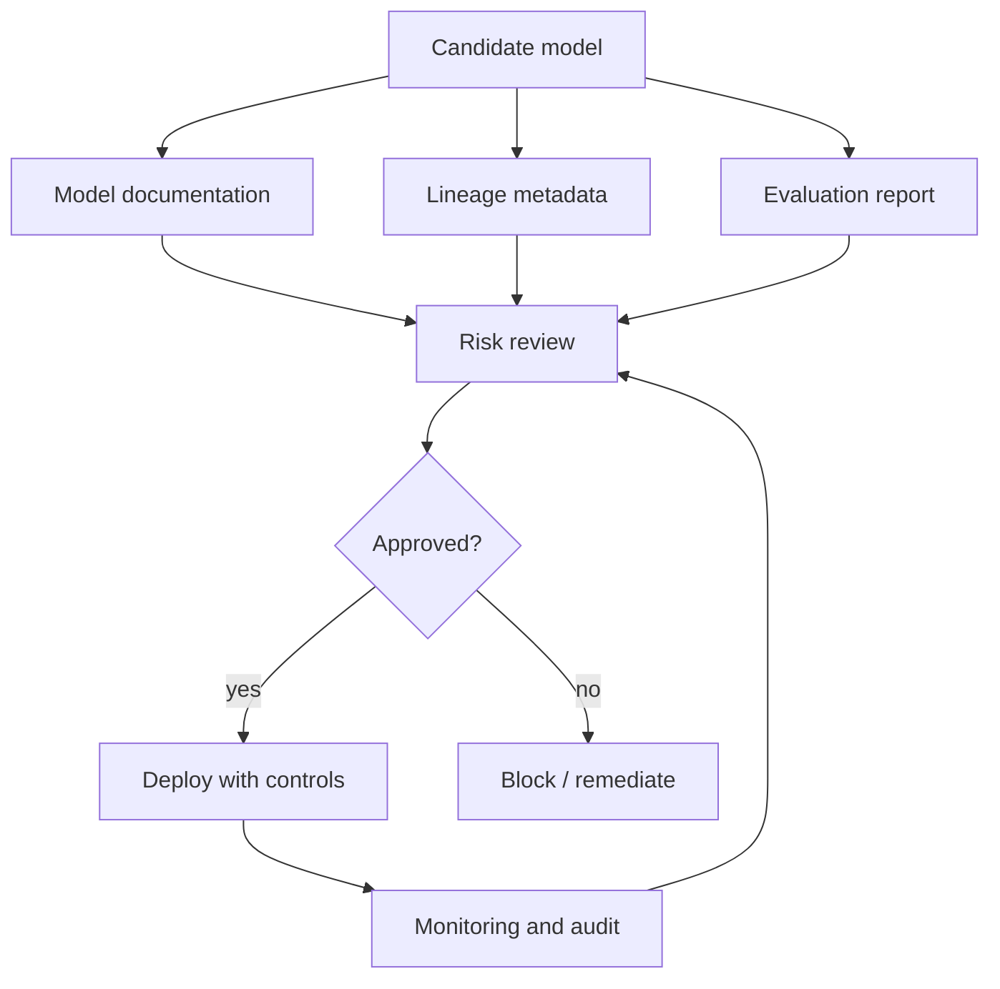

# ML Risk and Governance

## TL;DR

ML governance is the operational system that keeps model decisions accountable. It is not only compliance paperwork. It includes risk tiering, model documentation, lineage, approval gates, access control, audit logs, slice monitoring, human override, incident response, and retirement. The higher the consequence of a wrong prediction, the more the system needs explicit controls outside the model.

---

## Risk Tiers

Not every model needs the same process.

| Tier | Example | Required controls |
|---|---|---|
| Low | Internal recommendation, developer productivity ranking | Basic lineage, owner, monitoring |
| Medium | Marketing personalization, support routing | Experiment review, guardrails, slice monitoring |
| High | Fraud holds, pricing, abuse enforcement | Human override, audit logs, rollback, policy approval |
| Critical | Credit, employment, health, legal access decisions | Formal review, explainability, strict data governance, periodic audit |

Risk tiering prevents low-risk models from being buried in bureaucracy while ensuring high-impact models do not ship as ordinary code changes.

---

## Governance Control Plane

Governance should be encoded into the platform where possible: required metadata, promotion gates, audit logs, and model registry states.

---

## Model Documentation

Model documentation should answer engineering and accountability questions.

| Section | Questions |
|---|---|
| Intended use | What decision does this model support? Who uses it? |
| Not intended use | Where should it not be used? |
| Training data | What data, time range, labels, and exclusions were used? |
| Features | What feature groups and sensitive proxies are involved? |
| Evaluation | Which metrics, slices, and guardrails were checked? |
| Limitations | Known failure cases and low-confidence domains |
| Human controls | Review, override, escalation, appeal |
| Monitoring | Drift, quality, fairness/slice checks, business guardrails |
| Owner | Team, on-call, review cadence |

Documentation should be versioned with the model artifact, not kept in an unowned wiki page.

---

## Data and Feature Risk

Risk often enters through data, not model code.

| Risk | Example | Control |
|---|---|---|
| Sensitive attribute use | Age, health, precise location | Data classification and feature allowlists |
| Proxy feature | ZIP code as proxy for protected class | Slice evaluation and review |
| Label bias | Historical enforcement labels reflect past policy | Label audit and human review |
| Consent mismatch | Data collected for one purpose used for another | Data usage contracts |
| Retention violation | Training set keeps data beyond allowed window | Dataset expiration and deletion workflow |

Feature stores and training pipelines should enforce data classification, ownership, and retention metadata.

---

## Human-in-the-Loop Patterns

| Pattern | Use when | Failure mode |
|---|---|---|
| Human review queue | Model confidence is low or action is high-impact | Reviewers rubber-stamp under load |
| Human override | Operators need emergency control | Overrides are not logged or audited |
| Appeal path | Users can contest decision | Appeal data never reaches model owners |
| Two-stage action | Model recommends, human decides | Latency and staffing cost |
| Auto-decision with audit | Low-risk high-volume action | Silent bias or quality drift |

Human review is a system with capacity, quality, and latency constraints. It needs metrics like any other service.

---

## Explainability as an Operational Tool

Explainability should be tied to an action:

- Debugging a production incident.
- Helping reviewers make consistent decisions.
- Supporting user-facing explanations.
- Auditing model behavior on slices.
- Detecting suspicious proxy features.

Explanations can be misleading if treated as truth. Use them as diagnostic artifacts alongside logs, feature values, and counterfactual tests.

---

## Audit Log

High-impact decisions need an audit trail:

- Request and decision timestamp.
- Model version and policy version.
- Input feature values or approved references.
- Prediction, threshold, and final action.
- Human reviewer and override reason when applicable.
- Experiment or rollout assignment.
- Downstream outcome and appeal result.

The audit log is also the raw material for incident analysis and retraining.

---

## Governance Failure Modes

### Unowned Model

The model runs in production but the original team moved on.

Mitigation: owner metadata, stale model alerts, review cadence, and retirement plan.

### Policy Hidden in Weights

Business or safety policy is learned implicitly and cannot be reviewed.

Mitigation: keep high-impact policy constraints explicit in re-ranking, thresholds, or rules.

### Metric-Only Approval

The model improves aggregate AUC but regresses a critical slice or violates a business guardrail.

Mitigation: require slice checks and guardrail approval before promotion.

### No Retirement Path

Old models keep serving because nobody wants to own the migration risk.

Mitigation: model registry lifecycle states: experimental, shadow, canary, production, deprecated, retired.

---

## Operational Metrics

| Category | Metrics |
|---|---|
| Governance | Models by risk tier, overdue reviews, missing documentation |
| Data | Sensitive feature usage, retention violations, feature owner coverage |
| Decisions | Override rate, appeal rate, review queue latency |
| Quality | Slice metrics, calibration, false positive/negative rate |
| Incidents | Time to detect, time to disable model, affected decisions |
| Lifecycle | Stale model age, retirement rate, rollback rate |

---

## Architecture Review Checklist

- What risk tier is this model?
- Who owns the model and who is on call?
- Is model documentation versioned with the artifact?
- Are sensitive features and proxies reviewed?
- Are high-impact actions reversible or reviewable?
- Is there a human override and audit path?
- Can the model be disabled without redeploying the service?
- Are slice metrics reviewed before and after launch?
- Is there a retirement plan?

---

## Key Takeaways

1. Governance is a production control system, not a document folder.
2. Higher-impact decisions need stronger controls outside the model.
3. Lineage, audit logs, and ownership are reliability requirements.
4. Explicit policy layers are easier to review than policy hidden in weights.
5. A model without a retirement path becomes operational debt.

---

## References

1. [Model Cards for Model Reporting](https://arxiv.org/abs/1810.03993)
2. [Datasheets for Datasets](https://arxiv.org/abs/1803.09010)
3. [NIST AI Risk Management Framework](https://www.nist.gov/itl/ai-risk-management-framework)
4. [Hidden Technical Debt in Machine Learning Systems](https://proceedings.neurips.cc/paper_files/paper/2015/file/86df7dcfd896fcaf2674f757a2463eba-Paper.pdf)
