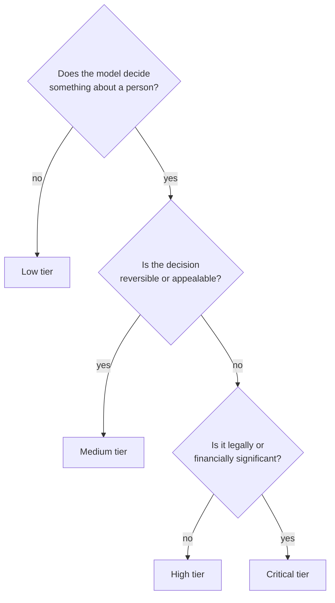
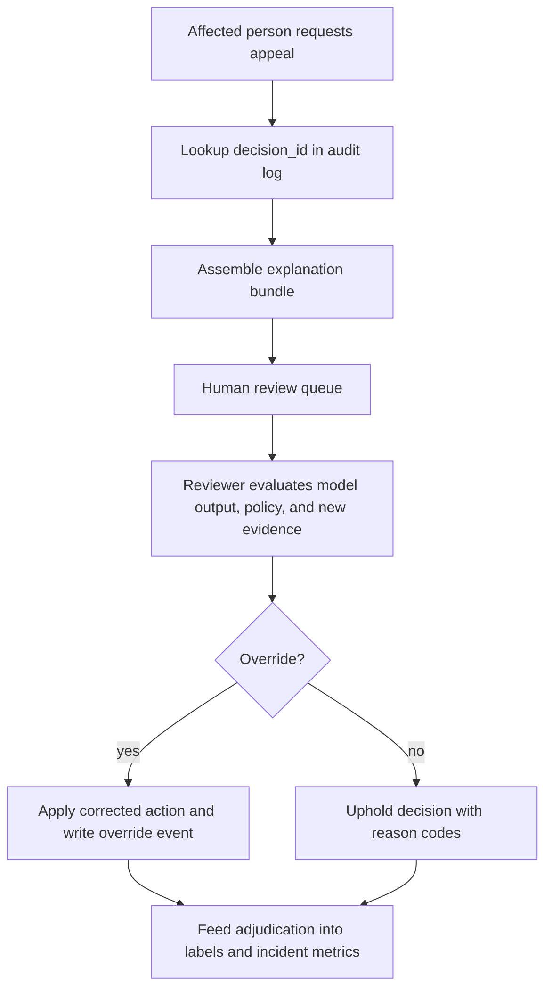

# ML Risk and Governance

## TL;DR

ML governance is the system of *enforced controls* that makes a model's decisions auditable, accountable, and reversible. The central failure of governance is treating it as documentation — a model card in a wiki, a policy PDF, a one-time fairness review — rather than as machinery wired into the deployment path. A control that does not block something is theater: a fairness threshold nobody gates on, a lineage requirement the registry does not enforce, an approval that happens after the model already serves traffic. Effective governance is the set of controls the *system* enforces automatically — a registry that refuses an unlineaged artifact, a promotion gate that blocks an unreviewed high-risk model, an audit log dense enough to reconstruct any decision after the fact. Everything in this file follows from one principle: **govern through infrastructure, not intention.**

---

## Governance Fails When It Is Documentation, Not Enforcement

The defining mistake in ML governance is the same one [training pipelines](./05-training-pipelines.md) make with reproducibility — treating a property the organization *wants* as a property the system *guarantees*. A governance program built on documents produces an impressive binder and no actual control. The model card describes intended use, but nothing stops the model from being repurposed. The policy says high-risk models require sign-off, but the deploy script does not check. The fairness review happened once, at launch, and the world moved on without it.

The engineering implication is sharp: **a control that is not on the critical path of deployment is not a control.** If the only thing standing between a model and production is a human remembering to follow a process, the process will be skipped under deadline pressure, forgotten after reorgs, and quietly abandoned as the team that wrote it disperses. The controls that survive are the ones the system enforces whether or not anyone remembers them — exactly like the training-pipeline rule that *no artifact enters the registry without a complete lineage contract*. Governance inherits that rule and extends it: no model reaches a regulated tier without its required controls satisfied, and "satisfied" is a state the registry stores and the gate checks, not a checkbox a human ticked.

A useful test mirrors the reproducibility test from training pipelines. If every engineer who knows the governance process left tomorrow, would the system still refuse to deploy an unreviewed credit model? If the answer depends on human memory, you have documentation. If the answer is "yes, the gate blocks it," you have governance.

---

## Risk Tiering: Not Every Model Needs the Same Scrutiny

A model that recommends songs and a model that approves loans are both "ML in production," but governing them identically is a category error. Apply the loan model's controls to the song recommender and you bury low-risk work in bureaucracy until teams route around governance entirely. Apply the recommender's controls to the loan model and you ship a life-altering decision system as an ordinary code change. **Risk tiering is the decision framework that allocates scrutiny in proportion to consequence**, and it is the single most important design choice in a governance system because every other control derives from it.

The dimensions that determine a tier are not technical accuracy but *impact*: **who is affected** (an internal dashboard versus the general public versus a protected class), **reversibility** (can the affected person appeal, or is the decision final), and **regulatory exposure** (does the decision fall under credit, employment, health, or housing law). A high-accuracy model that denies someone a mortgage with no appeal path is higher-risk than a mediocre model suggesting playlists, regardless of which has the better AUC.

| Tier | Example | Controls the system must enforce |
|---|---|---|
| Low | Internal ranking, dev-productivity tooling | Owner, lineage, basic monitoring |
| Medium | Marketing personalization, support routing | + experiment review, guardrails, slice monitoring |
| High | Fraud holds, dynamic pricing, abuse enforcement | + human override, audit log, rollback, policy approval |
| Critical | Credit, hiring, health, legal-access decisions | + explainability, contestability, strict data governance, periodic audit |

The tier is not advisory metadata; it is the input that *parameterizes the deployment path*. The engineering implication is that tiering must be assigned early and stored where the gate can read it, because the tier decides which gates run.



---

## Auditability and Lineage: You Cannot Govern What You Cannot Reconstruct

Every governance question — *why was this person denied? was this model reviewed? what data did it learn from? can we roll it back?* — reduces to a reconstruction problem. If the system cannot reconstruct the conditions of a past decision, no amount of policy can govern it. **Lineage is therefore the foundation on which every other control rests**, the same way reproducibility is the foundation of the training pipeline.

The governance requirement extends the training pipeline's [reproducibility contract](./05-training-pipelines.md) from "what produced this model" to "what produced this *decision*." A production decision must be traceable along three axes: the **model version** that made it, the **training data and features** that shaped that version, and the **specific inputs** present at decision time. Pin all three and an auditor — internal, regulatory, or a court — can answer "why" months later. Drop any one and the decision is unreconstructable, which under regimes like GDPR or the EU AI Act is itself a violation, not merely an inconvenience.

The enforcement point is an append-only **audit log** for every high-impact decision, recording at minimum the timestamp, the model and policy versions, the feature references consumed (by version, not raw sensitive values), the score and threshold, the final action, and any human override and its reason. The log is immutable by design — you cannot govern an audit trail that the system being audited can edit — and it doubles as the raw material for incident analysis and the labels for the next retraining cycle. The discipline that makes this work is the same one that makes lineage work in training: the metadata is captured *automatically at decision time*, not reconstructed afterward from memory or scattered logs, because reconstruction after the fact is exactly the capability whose absence defines an ungovernable system.

---

## Governance Artifacts: Inventory, Decision Log, and Evidence Bundle

A mature governance system has three first-class artifacts. They are not documents attached after the fact; they are database records and immutable objects the platform writes, validates, and queries.

| Artifact | Written by | Used for | Must be immutable? |
|---|---|---|---|
| Model inventory record | Registry / owner onboarding | Scope, tier, owner, required controls | Mutable by versioned updates |
| Per-decision audit log | Serving path | Reconstruction, appeals, incident impact | Append-only |
| Promotion evidence bundle | Evaluation + registry gate | Deployment approval and rollback proof | Immutable once approved |

A model inventory entry should be structured enough for policy evaluation:

```yaml
model_inventory:
  model_id: credit_limit_decision
  version: inventory_schema:v3
  owner:
    team: credit_platform
    accountable_person: user:alice
    oncall: credit-ml-primary
  risk:
    tier: critical
    domain: credit
    affected_population: external_customers
    decision_effect: legal_or_financial_significance
    reversible: true
    appeal_sla_days: 14
  intended_use:
    allowed:
      - initial_credit_limit_assignment
      - periodic_limit_review
    prohibited:
      - employment_screening
      - insurance_pricing
  data_governance:
    training_datasets:
      - credit_applications:2026-05-31.2
    label_definitions:
      - ninety_day_default:v4
    sensitive_features:
      direct_use: []
      proxy_review_required:
        - postal_code_region:v6
        - employment_tenure_bucket:v2
    retention_policy: regulated_decision_7y
  required_controls:
    lineage: required
    independent_validation: required
    fairness_slices: required
    explanation_artifact: required
    human_appeal_path: required
    kill_switch: required
  production:
    endpoints:
      - credit-api/prod/us/limit_decision
    fallback_policy: manual_review_policy:v8
    rollback_target: credit_limit_model:v41
```

A per-decision audit log should be dense enough to reconstruct the decision without exposing raw sensitive values unnecessarily:

```yaml
decision_audit_event:
  decision_id: dec_01J2Z7K5T4Q6
  request_id: req_8db6a1
  subject_ref: customer_hash:7b3c...       # pseudonymous, not raw PII
  occurred_at: 2026-06-24T10:15:33.481Z
  endpoint: credit-api/prod/us/limit_decision
  model:
    model_id: credit_limit_decision
    model_version: credit_limit_model:v42
    artifact_hash: sha256:9f86d08...
  policy:
    threshold_policy: credit_limit_policy:v12
    decision_policy: credit_limit_assignment:v5
  inputs:
    feature_vector_id: fv_01J2Z7...
    feature_versions:
      income_band: income_band:v3
      delinquency_count_12m: delinquency_count_12m:v9
      utilization_ratio: utilization_ratio:v7
    missing_features: []
  output:
    score: 0.73
    calibrated_probability: 0.19
    action: approve_limit_2500
    counterfactual_reason_codes:
      - high_utilization_ratio
      - short_credit_history
  human_override:
    applied: false
    reviewer: null
    reason_code: null
  experiment:
    assignment_id: exp_none
  retention:
    policy: regulated_decision_7y
    legal_hold: false
```

The promotion evidence bundle ties the inventory and audit requirements back to the deployment path. It should contain the exact evaluation report, slice metrics, signed approvals, serving contract validation, rollback proof, and kill-switch test result. The bundle's hash is what the registry should store on the model version. If a later incident asks why the model was allowed into production, the answer should be one object, not a scavenger hunt through dashboards and tickets.

---

## Approval Gates and Separation of Duties

For tiers above "low," the question *who is allowed to put this in front of real people?* must have an enforced answer. An approval gate is the control that makes promotion to a regulated tier conditional on a sign-off from someone who is not the model's author — **separation of duties**, the principle that the person who builds a system should not be the only person who approves it. The author optimizes for shipping; the reviewer optimizes for not harming users. Collapsing the two roles removes the only check on "ship it, the metric went up."

The enforcement point is the **model registry**, the same component that anchors [deployment and rollouts](./06-model-deployment-rollouts.md). The registry stores each model's lifecycle state — experimental, shadow, canary, production, deprecated, retired — and the promotion gate refuses to advance a high-tier model to production unless the registry records the required approval, complete lineage, and a passing evaluation against the tier's guardrails. This is the governance analogue of the training pipeline's promotion gate: the registry is the source of truth, and a model whose approval is "someone said yes in Slack" is not approved, because the gate cannot read Slack.

The engineering implication is that approval must be a *state in the registry*, queryable and enforced, not an event in a human's memory. A small declarative policy, evaluated by the gate, is enough:

```yaml
# Evaluated by the promotion gate before any tier>=high model serves traffic
promote_to_production:
  require_lineage_contract: complete      # else: refuse (no contract, no registry entry)
  require_slice_metrics:    passing       # gated on pre-declared protected slices
  require_approval_from:     "risk-review" # a role distinct from the model's author
  require_rollback_target:   present       # a known-good version to revert to
```

---

## Policy-as-Code Governance Gate

The scalable form of governance is a policy engine over registry metadata. The policy should be declarative, versioned, testable, and evaluated on every promotion and material policy change. Human reviewers still matter, but the platform decides whether the required evidence exists.

```yaml
governance_policy: regulated_model_promotion:v6
applies_to:
  risk_tiers: [high, critical]
  target_states: [canary, production]

defaults:
  deny_unless_all_required_controls_pass: true
  approvals_expire_after_days: 90
  evidence_bundle_required: true

rules:
  lineage:
    require_training_run: true
    require_dataset_snapshot: true
    require_feature_schema_versions: true
    require_label_definition_version: true
    require_artifact_hash: true

  evaluation:
    require_baseline_comparison: current_production
    require_uncertainty: bootstrap_95_ci
    require_guardrail_slices:
      - protected_class_proxy_reviewed
      - geography
      - new_customer
    block_if_any_guardrail_regresses: true

  operational_readiness:
    require_serving_contract_validation: true
    require_load_test_p99_below_ms: 120
    require_prediction_logging: decision_audit_event:v4
    require_kill_switch_tested_within_days: 30
    require_rollback_target_loadable: true

  approvals:
    high:
      require_roles: [model_owner, independent_validator]
    critical:
      require_roles: [model_owner, independent_validator, risk_review, legal_or_policy]
      author_cannot_approve: true

  contestability:
    critical:
      require_explanation_artifact: true
      require_appeal_queue: true
      require_human_override_policy: true
```

The gate should return machine-readable denial reasons:

```json
{
  "decision": "deny",
  "model_version": "credit_limit_model:v42",
  "target_state": "production",
  "failed_controls": [
    "evaluation.guardrail_slices.new_customer.regressed",
    "operational_readiness.kill_switch_tested_within_days.expired"
  ]
}
```

This shape matters operationally. A denial reason that points to a missing registry field can be fixed. A denial reason that says "risk review incomplete" with no failing control becomes another human process.

---

## Access Control: Who Is Allowed to Change a Consequential Model

An approval gate is worthless if anyone can bypass it. Separation of duties only holds when the *permission* to promote, to edit a threshold, or to overwrite a feature definition is itself an enforced control. This is the access-control layer of governance, and it is the one teams most often leave implicit — every engineer has production credentials, and the gate is a convention rather than a constraint.

The principle is that the blast radius of a change must scale with the risk tier. Editing the threshold of a critical credit model is a higher-privilege action than editing a song recommender, and the system should treat it that way: changes to high-tier models require credentials the author alone does not hold, every such change is attributed to an identity and written to the audit log, and the production policy a model serves is itself a versioned, access-controlled artifact — not a value an on-call engineer can quietly tweak at 2 a.m. The engineering implication is that *who changed what, when, and with whose approval* must be reconstructable for every consequential model, which makes access control a precondition for the audit trail rather than a separate concern. A registry that records approvals but lets anyone flip a model's state is recording fiction.

---

## Explainability and Contestability: A System Requirement, Not a Model Property

When a regulated decision goes against someone — a denied loan, a rejected job application, a flagged account — the law in much of the world grants them a right to an explanation and a path to contest it. **GDPR Article 22** (in force since 2018) gives individuals the right not to be subject to solely automated decisions with legal or similarly significant effects, and to obtain human intervention and contest the outcome. The **EU AI Act**, adopted in 2024 and phasing its high-risk obligations into 2026–2027, hardens this into concrete requirements for human oversight, transparency, and record-keeping on high-risk systems.

The engineering implication is the part teams miss: **explainability and contestability are system requirements, not model properties.** It is not enough that a model is "interpretable" in the abstract. The system must have logged enough — the model version, the inputs, the relevant feature attributions — to *reconstruct why this specific decision was made* when the affected person asks weeks later. And contestability requires a real human-in-the-loop path: a review queue, an override mechanism, and an appeal process that can reverse the decision. A SHAP value computed at decision time and discarded explains nothing later; the same value written to the audit log makes the decision contestable. Explainability that is not persisted is not a control.

This reframes a research-flavored topic as an infrastructure one. The question is not "which interpretability method is most faithful" but "does the system retain, per decision, the artifacts needed to explain and reverse it" — and is that retention enforced, or does it depend on someone remembering to log it.

---

## Appeal and Contestability Workflow

Contestability is a workflow with state, ownership, evidence access, and deadlines. A model is not contestable because a support agent can file a ticket; it is contestable when the system can route an affected decision to a reviewer with the exact decision evidence and authority to change the outcome.



The workflow needs its own contract:

| Field | Why it matters |
|---|---|
| `decision_id` | Joins the appeal to the immutable audit event |
| `subject_ref` | Identifies the affected person without spreading raw PII |
| `explanation_bundle_id` | Freezes model, policy, features, and reason codes used for review |
| `reviewer_role` | Enforces separation from the model author |
| `appeal_sla_due_at` | Makes contestability measurable |
| `override_action` | Records whether the automated decision was changed |
| `override_reason_code` | Turns appeals into diagnosable product/model feedback |

An appeal system also needs capacity planning. If a critical model makes 1M decisions/day and 0.2% are appealed, that is 2,000 reviews/day. At 8 minutes/review, the workflow needs roughly 267 reviewer-hours/day before QA and escalation. If governance mandates a 14-day appeal SLA but staffing can handle only 500/day, the right conclusion is not "hire later"; it is that the automated decision system is not operationally ready at that decision volume.

---

## Fairness as a Continuous, Gated Operational Concern

Fairness fails most often not because a team ignored it but because they checked it *once*. A model audited for disparate impact at launch and never again will drift, because the population it serves drifts, the data drifts, and an upstream feature quietly changes meaning. **Fairness is an operational property that must be measured continuously and gated on, not a one-time certificate.**

Holding this at the system level — rather than inside the data-science fairness-metric debate — yields three concrete infrastructure requirements. First, **define the metric before deploy.** Disparate impact, equal opportunity, and calibration across groups can conflict, and which one matters is a decision to make deliberately and record, not to discover after an incident. Second, **measure it across protected slices continuously**, reusing the same [slice-monitoring](./04-model-monitoring.md) machinery that tracks quality regressions and the [experiment slice analysis](./08-online-experiments.md) that catches a launch that helps the average while harming a subgroup. Third, **gate on it**: a promotion that improves aggregate AUC while regressing a protected slice must be *blocked by the gate*, not merely noted in a dashboard nobody reads.

The cautionary cases are concrete and well documented. The **Apple Card** launch in 2019 drew a New York regulator investigation after public reports that the algorithm offered women lower credit limits than men with similar finances. **Amazon scrapped an internal recruiting tool in 2018** after discovering it penalized résumés containing the word "women's," having learned from a decade of male-dominated hiring data. The **Dutch childcare-benefits scandal** (SyRI and the related fraud-detection systems, exposed around 2019–2021) saw an automated risk system wrongly accuse tens of thousands of families of fraud, disproportionately those with dual nationality, contributing to the resignation of the Dutch government in 2021. In every case the technical fairness flaw was downstream of a *governance* flaw: no enforced, continuous, slice-level measurement gating the system's decisions.

---

## Privacy and Data Governance

A model is a function of its training data, and training data is where most regulatory and ethical exposure originates. Three governance concerns live here. **Provenance and consent**: the system must record where training data came from and whether its use is permitted for this purpose — the lineage contract from training pipelines, extended to legal basis. **PII in features**: sensitive attributes and their proxies (a ZIP code proxying race, a first name proxying gender) must be reviewed before they enter a feature set, because a model cannot be governed for fairness if no one knows it is consuming a protected proxy. **The right to deletion versus the model that memorized**: GDPR grants a right to erasure, but a model trained on a person's data may have *memorized* it, and deleting the row from the warehouse does not delete it from the weights. The engineering implication is that deletion must be a tracked, lineage-aware operation — knowing which models trained on a given record is the same forward-lineage *impact query* that training pipelines need for bad-data backfills, and a governance system without it can promise deletion it cannot deliver.

---

## Incident Response and Accountability

Every model in a regulated tier needs a named owner — not a team that has since dissolved, but an accountable individual or on-call rotation responsible for the model's harms. The **orphaned model** with no owner is one of the most common and most dangerous governance failures: it runs in production making consequential decisions, and when it goes wrong there is no one whose job it is to notice, explain, or stop it.

ML incidents demand a different playbook from service incidents because a model can be perfectly *healthy* — low latency, no errors — while causing real harm. The relevant severity scale is keyed to harm, not to system health.

| Severity | Definition | Response |
|---|---|---|
| Sev1 | Irreversible harm or legal violation | Kill switch, executive escalation, regulatory notification |
| Sev2 | Significant financial or user harm | Rollback, incident review within 24h |
| Sev3 | Detectable quality or fairness degradation | Investigate, canary rollback |
| Sev4 | Drift or anomaly detected | Triage during business hours |

The decisive governance control here is **rollback**, and it must be wired the same way [deployment and rollouts](./06-model-deployment-rollouts.md) wires it: the system must be able to disable a model or revert to a known-good version *via configuration, in under a minute, without redeploying the service*. A governance program that can detect harm but cannot quickly stop it is incomplete. After containment comes the **post-incident review**, whose governing question is not "who erred" but "what gate or check would have caught this" — because the durable output of an incident is a new enforced control, not a new line in a document.

---

## Governance Incident Workflow: Harm Signal to Enforced Control

An ML governance incident should be handled like a reliability incident, but the incident clock starts from harm detection, not service failure. A healthy model server can be a Sev1 if it is producing illegal or harmful decisions.

```text
T+00m  Harm signal detected: fairness guardrail breach, appeal spike, regulator inquiry, or incident report
T+05m  Freeze rollout and preserve evidence bundle, prediction logs, feature snapshots, and active policy
T+10m  Contain: pointer rollback, threshold fail-safe, kill switch, or route to human review
T+30m  Scope impact: affected decisions, slices, time window, regions, and downstream actions
T+2h   Notify accountable owner, risk/legal, support, and affected operations teams
T+24h  Produce preliminary harm assessment and remediation plan
T+7d   Complete post-incident review; convert finding into a new gate, monitor, or policy test
```

The impact query should be prepared before the incident. During a real event, the team should fill parameters, not design joins:

```sql
-- Example: decisions affected by a bad threshold policy in a known window.
SELECT
  decision_id,
  subject_ref,
  occurred_at,
  model_version,
  threshold_policy,
  output_action,
  score,
  slice_country,
  slice_new_customer
FROM decision_audit_log
WHERE endpoint = 'credit-api/prod/us/limit_decision'
  AND threshold_policy = 'credit_limit_policy:v12'
  AND occurred_at >= TIMESTAMP '2026-06-24 09:00:00 UTC'
  AND occurred_at <  TIMESTAMP '2026-06-24 11:30:00 UTC';
```

A complete incident review should always ask four engineering questions:

1. Which gate would have blocked this model, policy, or data state before production?
2. Which monitor should have detected it earlier, and at what severity?
3. Which rollback or fail-safe reduced harm, and was it fast enough?
4. Which registry or audit field was missing when reconstructing impact?

The postmortem output is a pull request against the governance system: a new policy rule, required metadata field, monitor, runbook, or automated test. If the output is only a memo, the same class of harm will recur.

---

## The Regulatory Landscape, Mapped to Controls

The point of surveying regulation is not legal completeness but recognition that the major regimes all map onto the controls above — they are demands for enforced infrastructure, not new categories of work.

- **SR 11-7** (US Federal Reserve / OCC, 2011) established model risk management for banking: independent validation, an inventory of models with owners, and ongoing monitoring. It is essentially a mandate for risk tiering, a model registry, and separation of duties — a decade before most ML teams adopted them.
- **GDPR Article 22** (EU, 2018) maps onto explainability, contestability, the human-in-the-loop override path, and lineage dense enough to reconstruct a decision.
- **The EU AI Act** (adopted 2024, high-risk obligations phasing in through 2026–2027) defines explicit risk tiers — prohibited, high-risk, limited, minimal — and mandates human oversight, transparency, data governance, and record-keeping for high-risk systems. Its tiering is the same impact-based framework above, given legal teeth, and its 2026 timeline is why these controls are moving from optional to mandatory for anyone serving EU users now.

The engineering takeaway: a team that has already built enforced risk tiering, lineage, approval gates, slice monitoring, and rollback is most of the way to compliance with all three. A team that has only documents is not.

---

## Failure Modes

The characteristic ways governance fails recur across organizations, and naming them is half of preventing them.

**Governance-as-theater** is the root failure: controls that exist on paper but enforce nothing — a fairness threshold no gate checks, an approval that happens after launch, a model card that drifts from the deployed reality. The defense is to wire every required control into the deployment path so the system, not a human, enforces it.

**The unreconstructable decision** is the audit that cannot answer "why." A regulator or court asks why a person was denied, and the system cannot reconstruct the model version, inputs, and reasoning. The defense is the per-decision audit log, captured automatically and stored immutably.

**Untiered, one-size-fits-all governance** either buries low-risk models in bureaucracy until teams evade it, or ships high-risk models as ordinary code changes. The defense is a tiering framework that allocates scrutiny by impact and parameterizes the gate.

**Fairness-as-a-one-time-check** certifies a model at launch and lets it drift. The defense is continuous slice monitoring with a pre-declared metric that the promotion gate enforces.

**The orphaned model** runs in production with no owner, so no one notices, explains, or stops its harms. The defense is mandatory owner metadata, stale-model alerts, and a retirement path — a model without a retirement plan becomes permanent operational debt.

**Rubber-stamp review** is the human gate that approves 99% of decisions because the queue is too deep and the SLA too tight. A review queue with 99% agreement is not a review queue; it is a latency tax. The defense is to treat human review as a service with SLOs — monitor reviewer accuracy against expert adjudication, bound queue depth, and rotate reviewers.

---

## Decision Framework: Risk Tier → Required Controls

Designing or reviewing an ML system's governance reduces to a short sequence of questions, each one a control the system must *enforce*, not a box a human ticks.

1. **What risk tier is this model**, by who is affected, reversibility, and regulatory exposure? The tier parameterizes everything below.
2. **Can every production decision be reconstructed** — model version, training data, inputs — from recorded metadata alone? If not, the system is unauditable and ungovernable.
3. **Does promotion to a regulated tier require enforced sign-off** from someone other than the author, with the registry as the source of truth? If not, there is no separation of duties.
4. **For regulated decisions, is enough logged to explain and contest them**, with a real human-override and appeal path? If not, GDPR Article 22 and the EU AI Act are violated.
5. **Is fairness measured continuously across pre-declared protected slices and gated on**, not checked once at launch?
6. **Can the model be disabled or rolled back via config in under a minute**, without redeploying the service?
7. **Can an affected person appeal a specific decision**, with a reviewer seeing the exact evidence bundle and override authority?
8. **Can impact be queried during an incident** by model, policy, slice, endpoint, and time window without ad hoc log archaeology?
9. **Does the model have a named owner and a retirement path?** An owner-less model is an incident waiting for no one to respond.

A system that answers these with enforced controls is auditable, accountable, and reversible. A system that answers them with documents has governance theater, and the cost of that gap is paid by the people the model decides about — as Apple Card, Amazon, and the Dutch families learned.

---

## Key Takeaways

1. Governance is the system of *enforced controls* that makes ML auditable, accountable, and reversible — a control not wired into the deployment path is theater.
2. Risk tiering by impact (who is affected, reversibility, regulatory exposure) is the core decision framework; it parameterizes every other control.
3. Lineage is the foundation: you cannot govern what you cannot reconstruct, so every production decision must trace to a model version, its data, and its inputs.
4. Approval gates enforce separation of duties through the model registry — approval is a queryable state, not a memory.
5. Production governance artifacts should be structured: model inventory, per-decision audit log, and immutable promotion evidence bundle.
6. Explainability and contestability are *system* requirements: persist enough to explain and reverse a decision, and provide a real human-override path (GDPR Article 22, EU AI Act).
7. Fairness is operational: declare the metric before deploy, measure it continuously across protected slices, and gate on it — never a one-time check.
8. Rollback is a governance control; a system that detects harm but cannot stop it in under a minute is incomplete.
9. Governance incidents should produce new enforced controls — policy rules, metadata requirements, monitors, or runbooks — not only narrative postmortems.
10. Every regulated model needs a named owner and a retirement path, or it becomes an unaccountable, permanent liability.
11. SR 11-7, GDPR, and the EU AI Act (phasing in through 2026–2027) all map onto the same enforced controls — build the controls and compliance largely follows.
12. Ungoverned ML has a documented cost: Apple Card (2019), Amazon's scrapped recruiting tool (2018), and the Dutch childcare-benefits scandal were governance failures before they were model failures.

---

## References

1. [SR 11-7: Guidance on Model Risk Management](https://www.federalreserve.gov/supervisionreg/srletters/sr1107.htm) — US Federal Reserve / OCC, 2011
2. [EU AI Act — Official Text and Risk Classification](https://artificialintelligenceact.eu/) — adopted 2024, phased into 2026–2027
3. [GDPR Article 22 — Automated Individual Decision-Making](https://gdpr-info.eu/art-22-gdpr/)
4. [NIST AI Risk Management Framework](https://www.nist.gov/itl/ai-risk-management-framework)
5. [Model Cards for Model Reporting](https://arxiv.org/abs/1810.03993) — Mitchell et al., 2019
6. [Datasheets for Datasets](https://arxiv.org/abs/1803.09010) — Gebru et al., 2018
7. [Hidden Technical Debt in Machine Learning Systems](https://proceedings.neurips.cc/paper_files/paper/2015/file/86df7dcfd896fcaf2674f757a2463eba-Paper.pdf) — Sculley et al., 2015
8. [Amazon scraps secret AI recruiting tool that showed bias against women](https://www.reuters.com/article/us-amazon-com-jobs-automation-insight-idUSKCN1MK08G) — Reuters, 2018
9. [Apple Card investigated after gender discrimination complaints](https://www.bloomberg.com/news/articles/2019-11-09/viral-tweet-about-apple-card-leads-to-probe-into-goldman-sachs) — Bloomberg, 2019
10. [Dutch childcare benefits scandal / SyRI ruling](https://www.amnesty.org/en/latest/news/2021/10/xenophobic-machines-dutch-child-benefit-scandal/) — Amnesty International, 2021
