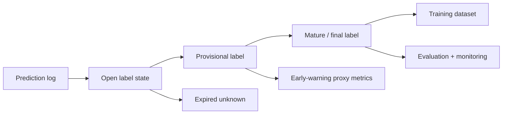
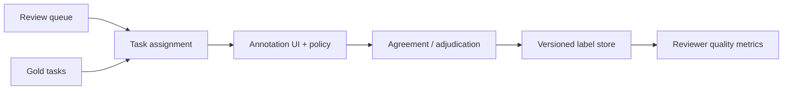

# Label and Ground-Truth Systems

## TL;DR

A label system is the part of an ML platform that turns messy real-world outcomes into the ground truth used for training, evaluation, monitoring, experimentation, and governance. It is not a CSV of labels and it is not a human annotation UI. It is a production data system with a harder correctness problem than most databases: the value it stores is a delayed, probabilistic, policy-shaped claim about what actually happened. The central design challenge is **preserving the decision context until truth arrives**. A prediction made today may receive its label seconds later, weeks later, or never; when the label finally appears, the system must join it back to the exact prediction, model version, feature values, exposure, policy, and action that produced the outcome. If that join is wrong, every downstream metric is wrong. A model trained on bad labels is not learning the world; it is learning the label pipeline's bugs.

---

## Why Labels Are a System, Not a Column

It is tempting to treat labels as ordinary data: a table with `entity_id`, `timestamp`, and `label`. That view is too small. A label is an interpretation of an outcome under a definition, collected through a process, attached to a prior prediction, and used to decide whether a model is good. Every piece of that sentence hides systems work.

A fraud transaction is not labeled fraudulent the moment the transaction occurs. It may be labeled after a chargeback, after a manual investigation, after a merchant dispute, or after a risk team's rule says the evidence is strong enough. A recommendation is not labeled positive merely because the user clicked; the click might be accidental, position-biased, or followed by immediate abandonment. A medical model may receive a diagnosis code months later, and the code itself may be incomplete because billing workflows shape what gets recorded. In each case the label is not an objective fact emitted by the universe. It is the output of a collection process with latency, bias, missingness, and policy embedded inside it.

The engineering implication is severe: **label quality bounds model quality**. Better model code cannot recover from a label pipeline that joins outcomes to the wrong prediction, silently drops hard cases, or changes the definition of the target halfway through a training window. This is the ML version of a database invariant: downstream correctness is impossible if the upstream ground truth is corrupt.

A useful test: if someone asks why `model_v42` had 8% lower recall than `model_v41` last month, can the platform reconstruct not just the predictions but the labels used to score them — their definitions, arrival times, sources, annotators or outcome events, and correction history? If not, the team has labels, but not a label system.

---

## The Label Is the Specification

In traditional software, the specification is explicit. You can read a requirement and write tests against it. In supervised ML, the label is the executable specification. If `Y = 1` means "fraud," then the model learns whatever the label-generation process calls fraud, not what the product team intended fraud to mean.

This creates a dangerous ambiguity: two models can optimize the same metric while solving different problems because their labels encode different definitions. A support-routing model trained on "ticket escalated" learns the organization's escalation behavior, not necessarily ticket difficulty. A hiring model trained on "historically hired" learns past hiring decisions, including their biases, not candidate quality. A recommender trained on "clicked" learns click propensity, not satisfaction. The model is faithful to the label; the label may be unfaithful to the business objective.

The most important artifact in a label system is therefore the **label definition contract**. It states exactly what the target means, what event or review process produces it, what observation window applies, what exclusions exist, and which version of the definition was active for each training row.

```yaml
label: transaction_fraud
version: v6
positive_definition: "confirmed unauthorized transaction"
negative_definition: "no dispute or chargeback after 90 days"
observation_window_days: 90
source_events:
  - chargeback_confirmed
  - manual_review_confirmed_fraud
exclusions:
  - test_transactions
  - transactions_reversed_before_settlement
owner: risk-data-platform
valid_from: 2026-01-01T00:00:00Z
```

The version matters because label definitions evolve. A fraud team may start treating a new dispute reason as fraud. A content moderation team may change its policy for borderline hate speech. A marketplace may redefine a successful booking after cancellation rules change. If historical labels are overwritten in place, offline evaluation becomes incomparable: a model evaluated today is graded under a different target than the model shipped six months ago. The rule is the same as feature versioning: **a semantic change to a label is a new label version, never an in-place edit**.

---

## The Prediction Log Is the Join Anchor

Every trustworthy label system starts with the prediction log. The label arrives later; the prediction context exists only now. If the system does not capture that context at decision time, it cannot be reconstructed later.

A minimal prediction record contains more than the score:

```yaml
prediction_id: 01J2F9K8...
timestamp: 2026-06-24T12:01:08Z
entity_id: txn_9821
subject_id: user_442
model: fraud_classifier
model_version: v42
feature_schema: fraud_features:v12
feature_refs:
  account_risk: account_17@2026-06-24T12:01:00Z
  device_velocity: device_91@2026-06-24T12:00:58Z
score: 0.973
threshold_policy: fraud_policy_v9
action: manual_review
experiment: fraud_model_rollout_2026q2:treatment
request_context:
  country: JP
  amount_bucket: high
```

The prediction ID is the primary key for all future truth. Labels should join to predictions through a stable decision identifier where possible, not through a fuzzy combination of `user_id` and time. Fuzzy joins are one of the most common ways label systems corrupt metrics: a later outcome is attached to the wrong prediction, duplicate predictions race to claim one outcome, or a single outcome labels multiple decisions.

The deeper reason the prediction log matters is that model quality is a property of *decisions under context*, not of entities in isolation. If a fraud model scored the same transaction twice under two different model versions, and only one score caused a manual review, the eventual label must be attributable to the right decision path. If a recommender showed an item in position 1 under one ranker and position 10 under another, the click label has different meaning in each context. The log is the only place where that context exists.

This is why prediction logging links label systems to [model monitoring](./04-model-monitoring.md), [online experiments](./08-online-experiments.md), [recommendation systems](./07-recommendation-systems.md), and [ML risk governance](./09-ml-risk-governance.md). They all need the same thing: a durable record of what the system believed, what it did, and under which version.

---

## Label Delay: The Truth Arrives After the Decision

Label delay is not an inconvenience; it determines the whole architecture. The moment a prediction is made, the system enters an **open-label interval**: the outcome is not yet known, but the decision has already affected the world.

Different domains have radically different delay profiles:

| Domain | Prediction | Label source | Typical delay | Monitoring consequence |
|---|---|---|---|---|
| Ads / recommendations | Show item | Click, dwell, conversion | Seconds to days | Fast but biased labels |
| Fraud authorization | Approve / review / block transaction | Chargeback, investigation | Days to 90+ days | Proxies required for early warning |
| Credit underwriting | Approve loan | Delinquency / default | Months to years | Long holdbacks and vintage analysis |
| Abuse detection | Allow / remove content | User report, moderator review | Minutes to weeks | Strong human-review pipeline needed |
| Healthcare | Risk prediction | Diagnosis / outcome | Weeks to years | Label incompleteness is structural |

The system consequence is a **label-maturation pipeline**. Predictions start as unlabeled. Some receive provisional labels quickly. Some provisional labels are corrected later. Some remain permanently unknown. Training and evaluation jobs must declare which maturity window they require: a click model may train on 24-hour labels; a fraud model may require 90-day maturity for final evaluation but use 7-day proxy labels for early monitoring.



The failure mode is reading immature labels as final truth. A fraud canary that looks safe after two hours has not measured fraud loss; it has measured operational health and perhaps early proxies. A credit model that improves 30-day delinquency may still worsen one-year default. The label system must make maturity explicit in the data model so that every metric says which truth horizon it represents.

---

## Negative Labels Are Harder Than Positive Labels

Positive labels often announce themselves: a click happens, a chargeback posts, a moderator confirms abuse. Negative labels are usually defined by the absence of a positive event over a window. That makes them more fragile.

A transaction is not non-fraudulent because no chargeback has appeared after one day. It is non-fraudulent because no chargeback appeared after the full dispute window, perhaps 90 days. A user did not dislike a recommendation merely because they did not click; they may not have seen it, may have been interrupted, or may have clicked a different acceptable item. An applicant who was not hired is not necessarily a bad candidate; they may never have been interviewed.

This creates a common training bug: **premature negatives**. The pipeline labels examples negative before the observation window closes, flooding training with false negatives. The model then learns that risky-but-slow-to-reveal examples are safe. In delayed-label domains, premature negatives are often worse than missing positives because they teach the model the opposite of truth with high confidence.

The defense is a label state machine:

```text
UNLABELED
  ├─ positive event observed before deadline → POSITIVE
  ├─ deadline passed with no positive event   → NEGATIVE
  └─ insufficient observation / data missing  → UNKNOWN
```

`UNKNOWN` is not the same as `NEGATIVE`. Treating unknowns as negatives is one of the oldest and most damaging shortcuts in ML systems. The training pipeline should either exclude unknowns, model censoring explicitly, or use domain-specific weak labels with clear weighting. What it must not do is silently coerce uncertainty into a confident zero.

---

## Selection Bias: You Only Label What You Chose to Observe

A label system does not observe the whole world. It observes the world after the model and product have already filtered it. This is the most important connection between labels and feedback loops.

A fraud model blocks high-risk transactions. Because the transaction never completes, the system may never observe whether it would have become a chargeback. The riskiest population becomes unlabeled precisely because the model intervened. A content moderation model removes content before users report it, so the label distribution of allowed content changes. A recommender logs clicks only for items it showed, so it has no direct label for items it suppressed. A loan model observes repayment only for applicants it approved; rejected applicants have no default outcome.

This is **selective labels**: labels are missing not at random, but because of the decision policy. Naively training on observed labels then reinforces the incumbent policy. The model learns from approved loans and knows nothing about rejected borrowers; learns from shown recommendations and knows nothing about hidden items; learns from allowed transactions and knows less about blocked ones.

The defenses are structural, not cosmetic:

1. **Log the action and policy** with every prediction, so training can distinguish observed outcomes under different decision paths.
2. **Reserve exploration or audit traffic** where safe, so some uncertain cases are allowed or reviewed specifically to learn their outcomes.
3. **Use human review queues** for high-risk ambiguous cases, creating labels where automated action would otherwise erase them.
4. **Model missingness explicitly** instead of pretending observed labels are representative.
5. **Evaluate with randomized or quasi-random holdbacks** when the business can tolerate them, because only randomization breaks the selection mechanism cleanly.

This is the same reason [online experiments](./08-online-experiments.md) are load-bearing: they manufacture a counterfactual the ordinary logs cannot contain. A label system that ignores selection bias becomes a machine for validating yesterday's policy with yesterday's blind spots.

---

## Human Labeling Is a Distributed Consensus Problem

When labels come from human annotators or reviewers, the system design problem becomes less like data ingestion and more like consensus under noisy voters. Humans disagree. Policies are ambiguous. Reviewers fatigue. Some examples are genuinely borderline. The label platform's job is not to pretend this noise does not exist, but to measure and control it.

The basic architecture separates four roles:



The review queue chooses what needs human judgment. Task assignment balances load, expertise, language, conflict of interest, and privacy restrictions. The annotation UI presents the policy and captures the decision. Agreement and adjudication turn one or more human judgments into a label. Quality metrics monitor whether the reviewers themselves are drifting.

The key design choice is the **aggregation policy**. For low-risk tasks, one reviewer may be enough. For ambiguous or high-impact tasks, require two or three independent reviewers and escalate disagreements to an expert adjudicator. This is a quorum system in miniature: more votes increase reliability but cost more and add latency. The right quorum depends on consequence.

| Task type | Review policy | Why |
|---|---|---|
| Low-risk categorization | Single reviewer + sampling audit | Cheap throughput matters |
| Content safety borderline case | 2-of-3 majority + expert tie-break | Policy ambiguity is high |
| Regulated adverse decision | Expert review + persisted rationale | Contestability and audit required |
| Training-set cleanup | Redundant labels on a stratified sample | Estimate noise before scaling |

Gold-standard tasks — examples with known labels — are the calibration mechanism. They detect reviewers who misunderstand policy, bots or low-quality vendors, and policy drift over time. Inter-annotator agreement metrics such as Cohen's kappa or Krippendorff's alpha are not academic decoration; they tell you whether the target is learnable from the labeling process. If trained humans cannot agree, expecting a model to learn a stable boundary is wishful thinking.

Kappa is worth computing by hand once, because the naive alternative — raw percent agreement — systematically flatters the labeling process. Two reviewers label 200 items for "policy violation," where violations are rare:

```text
                    Reviewer B: yes   Reviewer B: no
Reviewer A: yes            12                8
Reviewer A: no              6              174

Raw agreement:      p_o = (12 + 174) / 200 = 0.93     ← looks excellent

Chance agreement:   A says yes 10% of the time, B says yes 9%.
                    p_e = (0.10 × 0.09) + (0.90 × 0.91) = 0.828

Cohen's kappa:      κ = (p_o − p_e) / (1 − p_e) = (0.93 − 0.828) / 0.172 ≈ 0.59
```

Ninety-three percent agreement collapses to κ ≈ 0.59 — "moderate" agreement — because with a 90% negative base rate, two reviewers who mostly say "no" agree constantly by chance. On the minority class, where the model's decisions actually matter, these reviewers agree barely more than half the time beyond chance. This is the number that predicts whether the boundary is learnable, and it is routinely 30 points below the raw agreement a vendor reports. The working thresholds: κ above 0.8 supports automated training targets; 0.6–0.8 supports training with adjudication of disagreements; below 0.6 means the *policy* is the problem, and spending labeling budget before rewriting the policy document buys noise.

When more than two reviewers vote, majority vote weights a careless reviewer equally with a careful one. The standard upgrade is Dawid-Skene-style aggregation, which jointly estimates each reviewer's confusion matrix and each item's true label with EM — reviewers who agree with the consensus on gold tasks earn more weight, and the label store records the posterior (`confidence_weight`) rather than a bare vote count. Open implementations exist (e.g., `crowd-kit`); the systems requirement is only that the label event schema carries per-reviewer votes rather than pre-collapsed majorities, so the aggregation policy can improve without re-labeling anything.

---

## Active Learning: Spend Labeling Budget Where It Buys Information

Labels are expensive, so a mature label system does not label randomly forever. It allocates human attention where the expected information gain is highest.

The simplest strategy is **uncertainty sampling**: send examples near the model's decision boundary to reviewers because those examples teach the model the most. If a classifier scores an example at 0.50, the label is more informative than an example scored 0.999. A second strategy is **disagreement sampling**: send examples where the champion and challenger models disagree, because those are exactly the cases deciding whether the new model is meaningfully different. A third is **slice-targeted labeling**: oversample segments where monitoring shows drift, sparse labels, or fairness risk.

Active learning has a subtle systems trap: if all labels come from uncertain examples, the training set no longer represents production traffic. The label system must record the sampling policy and either reweight examples during training or maintain a background random sample as an unbiased reference. Otherwise active learning improves the model near yesterday's boundary while corrupting calibration across the full distribution.

A good pattern is two streams:

```text
1. Random audit sample: small, unbiased, stable over time
   Purpose: monitoring, calibration, trend detection

2. Targeted active-learning sample: larger, adaptive, model-driven
   Purpose: improve the model where it is uncertain or weak
```

The random stream is the measuring stick. The active stream is the improvement engine. Conflating them is a category error: an adaptive sample is useful for learning but dangerous for measuring.

---

## Weak Labels, Proxy Labels, and Label Debt

Many production systems do not start with clean ground truth. They start with weak labels: heuristics, rules, user reports, distant supervision, search clicks, or labels produced by an older model. Weak labels are often the right bootstrap, but they create **label debt** when the team forgets that the target is approximate.

A weak label has three properties that must be explicit:

1. **Coverage** — which examples it labels.
2. **Precision** — how often positive weak labels are truly positive.
3. **Bias** — which regions of the input space it over- or under-represents.

For example, user reports are useful abuse labels but biased toward content seen by many users and toward categories users recognize as reportable. Clicks are useful recommendation labels but biased by position and presentation. A legacy rule can bootstrap fraud labels but encodes the exact blind spots the new model is supposed to exceed.

The system-design rule is: weak labels may enter training only with provenance and weight. A training row should know whether its label came from a human expert, a chargeback, a heuristic, a user report, or a model-generated pseudo-label. Mixing them into one untyped `label` column destroys the ability to debug why the model learned a behavior.

```yaml
label_value: 1
label_source: user_report
label_source_version: abuse_taxonomy:v4
confidence_weight: 0.65
created_at: 2026-06-18T09:12:00Z
adjudication_state: unreviewed
```

Weak labels are not bad; unlabeled weak labels are bad. The path to maturity is to use weak labels to focus human review, estimate their error on an audited sample, and gradually replace high-impact decisions with stronger labels where the cost is justified.

---

## The Label Store: Append-Only, Versioned, and Correctable

A label store should be designed like an audit log, not like a mutable dimension table. Labels change: disputes are reversed, moderators correct decisions, policies evolve, duplicate events are discovered, fraud investigations reopen. If the store overwrites the old value, it destroys the history needed to reproduce past training runs and explain past decisions.

The correct pattern is append-only label events with versioned materialized views:

```text
label_events
  prediction_id
  label_name
  label_version
  value
  source
  confidence
  event_time
  observed_at
  supersedes_event_id
  reason

current_labels_view
  latest non-superseded label per prediction_id, label_name, label_version

mature_labels_view
  labels whose observation window has closed and whose state is final
```

The distinction between `event_time` and `observed_at` matters. `event_time` is when the real-world outcome occurred. `observed_at` is when the label system learned it. A training pipeline building a dataset as of March 1 must not use a label that occurred in February but was not observed until March 10 if that label would not have been available then. This is the label-side analogue of point-in-time correctness in [feature stores](./02-feature-stores.md).

Corrections should create new events that supersede old ones. This preserves reproducibility: a model trained last month can still be evaluated against the label state that existed last month, while new training jobs use the corrected mature view. Auditability and reproducibility require history, not just the latest truth.

---

## Joining Labels Back to Predictions

The label join is the most dangerous step because it looks like ordinary ETL and silently determines every metric. The join must answer: which prediction is this outcome evidence for?

There are three common join patterns:

| Pattern | Example | Risk |
|---|---|---|
| Direct decision ID | Chargeback references transaction scored by `prediction_id` | Best case; low ambiguity |
| Entity + time window | User churn label joins to last subscription-risk prediction before renewal | Window boundary errors |
| Exposure + outcome | Recommendation click joins to shown item and position | Position and visibility bias |

Direct IDs should be engineered wherever possible. If the product action creates an outcome later — transaction, moderation decision, loan application, recommendation impression — carry the prediction or exposure ID into downstream event streams. This is ordinary correlation-ID discipline, but for truth.

When only entity-time joins are possible, the window must be part of the label definition contract. "User churned" may label the prediction made at subscription renewal, the last prediction before cancellation, or every weekly prediction in the 30 days before cancellation. These are different targets. An implicit window is a hidden label definition, and hidden definitions become unreproducible metrics.

The correctness checks are simple and non-negotiable:

1. **Uniqueness** — one outcome should not label multiple predictions unless the definition explicitly allows it.
2. **Completeness** — expected outcomes should not disappear because of missing IDs or late events.
3. **Temporal validity** — the label must not be visible to a training row before `observed_at`.
4. **Action consistency** — labels must be interpreted in the context of the action taken.
5. **Version consistency** — the label definition version used for training must match the metric's declared target.

Most "mysterious" offline metric jumps are label-join changes in disguise.

---

## Label Quality Monitoring

If labels are data, they need data-quality monitoring. If labels are the specification, label monitoring is specification monitoring.

The useful monitors are operational and statistical:

| Signal | Catches |
|---|---|
| Label volume by source | Broken ingestion, vendor outage, missing event stream |
| Positive rate by time and slice | Policy changes, source drift, emerging attacks |
| Label delay distribution | Backlog, late source systems, review queue saturation |
| Unknown / expired-unknown rate | Observation gaps, selection bias, missing outcomes |
| Disagreement rate among reviewers | Ambiguous policy, reviewer drift, poor task design |
| Correction / supersession rate | Low initial label quality, unstable definitions |
| Label-source mix | Silent shift from strong labels to weak labels |
| Join failure rate | Broken correlation IDs, schema changes, ETL bugs |

The label delay distribution is especially important. If 90% of chargebacks normally arrive within 45 days and suddenly arrive within 70, then every 45-day fraud metric is now biased optimistic. If reviewer backlog grows from one day to seven, monitoring based on human labels now detects issues a week later than before. Label latency is part of the model-monitoring SLO because it determines how quickly truth can correct the system.

Alerting should follow the same discipline as model monitoring: page on broken ingestion for critical labels, route noisy distribution shifts to review, and tie severity to downstream impact. A label-source outage for a low-risk recommender may wait until business hours. A chargeback-feed outage for a fraud model is a production incident because it blinds monitoring, retraining, and governance simultaneously.

---

## Capacity Planning for Labeling Queues

Human labeling systems are queueing systems. If examples arrive faster than reviewers can process them, label delay grows, monitoring becomes stale, retraining slows, and active learning loses value. Little's law applies directly:

```text
queue_size = arrival_rate × time_in_system
reviewers_needed ≈ arrival_rate × average_handle_time / target_utilization
```

Suppose an abuse system sends 50,000 items per day to human review. That is roughly 0.6 items/s. If each review takes 45 seconds, the raw work is 27 reviewer-seconds per second — about 27 fully utilized reviewers. At a sane 70% utilization, plus breaks, training, and variance, the staffing target is closer to 40-50 reviewers. If policy changes double the review rate without increasing staffing, the backlog does not grow linearly in pain; the queueing delay compounds, and labels arrive too late to be useful.

Reviewer utilization has the same hockey-stick behavior as service utilization. Running a review workforce at 95% utilization looks efficient until a small surge creates a multi-day backlog. Headroom is not waste; it is what keeps truth fresh enough for monitoring and retraining.

The operational SLO should be stated as label freshness:

```text
95% of high-priority abuse labels finalized within 4 hours
99% of fraud manual-review labels finalized within 24 hours
weekly random-audit sample completed within 7 days
```

Once labels are treated as an SLO-backed service, the design choices become clear: priority queues for high-risk items, backpressure when active-learning sampling exceeds review capacity, reviewer specialization for difficult slices, and overflow vendors only when their quality is measured against gold tasks.

---

## Privacy, Security, and Governance of Labels

Labels are often more sensitive than features. A feature may say a user made a transaction; a label may say the transaction was fraudulent, the content was illegal, the patient developed a disease, or the applicant defaulted. Label stores therefore carry privacy and access-control requirements comparable to audit logs.

The minimum controls are:

1. **Purpose limitation** — labels collected for one purpose may not automatically be valid for another.
2. **Access control** — reviewers and engineers see only the fields required for their task.
3. **Audit logging** — every label read, write, correction, and adjudication is attributable.
4. **Retention policy** — label history is preserved for reproducibility but expired or anonymized when legal basis ends.
5. **Deletion impact analysis** — if a subject invokes deletion rights, lineage must identify which labels and derived models are affected.

For high-risk decisions, label governance connects directly to contestability. If a user appeals a moderation decision and the label is overturned, the correction must flow into the label store, update evaluation metrics, and potentially trigger impact analysis: which models trained on the incorrect label, and did similar cases get mislabeled? A correction that changes only the user's current state but not the training label is how systems relearn the same mistake.

---

## Failure Modes

The characteristic failures of label systems recur across organizations, and naming them is half of preventing them.

**Premature negatives** occur when examples are labeled negative before the observation window closes. A transaction with no chargeback after one day is treated as non-fraud even though the dispute window is 90 days. The defense is an explicit label state machine with `UNKNOWN` distinct from `NEGATIVE`, and maturity windows enforced by the training pipeline.

**Wrong prediction join** attaches an outcome to the wrong decision, often through fuzzy entity-time joins or missing correlation IDs. Offline metrics jump or collapse for no model reason. The defense is to carry `prediction_id` or exposure ID through downstream events and monitor join uniqueness and failure rates.

**Definition drift** changes what the label means without versioning it. A policy team updates the fraud or abuse definition, and new labels become incomparable with old labels. The defense is versioned label contracts and append-only history; semantic changes create new versions.

**Selective-label bias** trains only on outcomes the current policy allowed the system to observe. Rejected loans, blocked transactions, hidden recommendations, and removed content have missing counterfactual outcomes. The defense is exploration, audit samples, human review, and explicit modeling of missingness.

**Reviewer drift** happens when human annotators gradually apply policy differently, often after a guideline update or workforce change. The defense is gold tasks, inter-annotator agreement monitoring, adjudication, and periodic recalibration.

**Weak-label laundering** occurs when heuristic, user-report, or pseudo-label sources are mixed into training as if they were strong ground truth. The model learns the heuristic's bias and the team mistakes it for reality. The defense is source provenance, confidence weights, and audited estimates of weak-label error.

**Mutable label history** overwrites old labels and destroys reproducibility. A model cannot be reevaluated against the truth state that existed when it was trained. The defense is append-only label events with supersession, plus versioned materialized views for current and mature labels.

**Label-pipeline outage disguised as model improvement** happens when positive labels stop arriving, making precision or loss appear better. The defense is label volume, source mix, and delay monitoring that gates interpretation of quality metrics.

---

## Decision Framework

When designing or reviewing label infrastructure, ask these questions before trusting any model metric:

1. **What exactly is the label definition, and is it versioned?** If the target cannot be stated as a contract, the model is optimizing an implicit and unstable specification.
2. **What is the observation window and maturity state?** If negatives can be assigned before the window closes, the training set is contaminated.
3. **Can every label join back to the exact prediction or exposure that created its context?** If not, metrics are only as trustworthy as a fuzzy join.
4. **Which labels are missing because of the system's own actions?** If the current policy controls what can be observed, naive training is biased.
5. **What label sources exist, and how reliable is each?** Human expert, user report, chargeback, heuristic, and pseudo-label are not interchangeable truths.
6. **Is label history append-only and reproducible?** If corrections overwrite the past, old training runs and audits cannot be reconstructed.
7. **Are label volume, delay, source mix, join failure, and reviewer agreement monitored?** If not, label-pipeline failures will masquerade as model changes.
8. **Does labeling capacity meet the freshness SLO?** If queues back up, truth arrives too late for monitoring, retraining, and governance.

A label system that answers these well makes the rest of the ML platform trustworthy. One that does not turns every offline metric, experiment result, drift alert, and governance report into a number built on sand.

---

## Key Takeaways

1. Labels are not a column; they are delayed, policy-shaped claims about reality, produced by a system with latency, bias, missingness, and corrections.
2. The label is the supervised model's specification. If the label definition is vague or unstable, the model faithfully learns the wrong target.
3. The prediction log is the join anchor: capture model version, feature references, action, policy, experiment, and context at decision time or it cannot be reconstructed later.
4. Label delay determines architecture. Metrics must distinguish provisional, mature, negative, positive, unknown, and expired-unknown states.
5. Negative labels are harder than positives because they often mean "no positive event by the deadline"; premature negatives are a major source of silent training corruption.
6. Selective labels create feedback-loop bias: the system only observes outcomes for decisions its current policy allowed. Exploration, audit samples, and human review create counterfactual evidence.
7. Human labeling is a noisy consensus system. Use reviewer quorums, adjudication, gold tasks, and agreement monitoring when labels affect important decisions.
8. Active learning should be paired with an unbiased random audit stream; adaptive samples improve models but are dangerous measuring sticks.
9. Weak labels are useful only when their source, coverage, confidence, and bias are recorded. Mixing weak and strong labels into one untyped column creates label debt.
10. The label store should be append-only, versioned, and correctable through supersession, not mutable overwrites.
11. Label quality needs monitoring: volume, positive rate, delay, unknown rate, source mix, reviewer disagreement, corrections, and join failures.
12. Labeling queues need capacity planning. If truth queues up, monitoring and retraining are stale no matter how good the model platform looks.

---

## References

1. [Hidden Technical Debt in Machine Learning Systems](https://proceedings.neurips.cc/paper_files/paper/2015/file/86df7dcfd896fcaf2674f757a2463eba-Paper.pdf) — Sculley et al., 2015
2. [Data Cascades in High-Stakes AI](https://research.google/pubs/data-cascades-in-high-stakes-ai/) — Sambasivan et al., CHI 2021
3. [Datasheets for Datasets](https://arxiv.org/abs/1803.09010) — Gebru et al., 2018
4. [Model Cards for Model Reporting](https://arxiv.org/abs/1810.03993) — Mitchell et al., 2019
5. [Snorkel: Rapid Training Data Creation with Weak Supervision](https://arxiv.org/abs/1711.10160) — Ratner et al., VLDB 2017
6. [Learning from Delayed Outcomes via Proxies with Applications to Recommender Systems](https://arxiv.org/abs/2010.08942) — delayed feedback and proxy-label framing
7. [Selective Labels and Deferential Fairness](https://arxiv.org/abs/1809.05699) — selective labels in high-stakes decision systems
8. [Trustworthy Online Controlled Experiments](https://www.cambridge.org/core/books/trustworthy-online-controlled-experiments/6A3B263E7114E81B95669A95B219C1D8) — Kohavi, Tang & Xu, 2020
