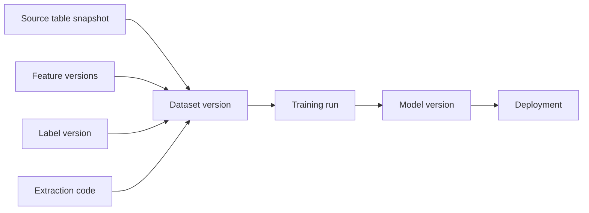
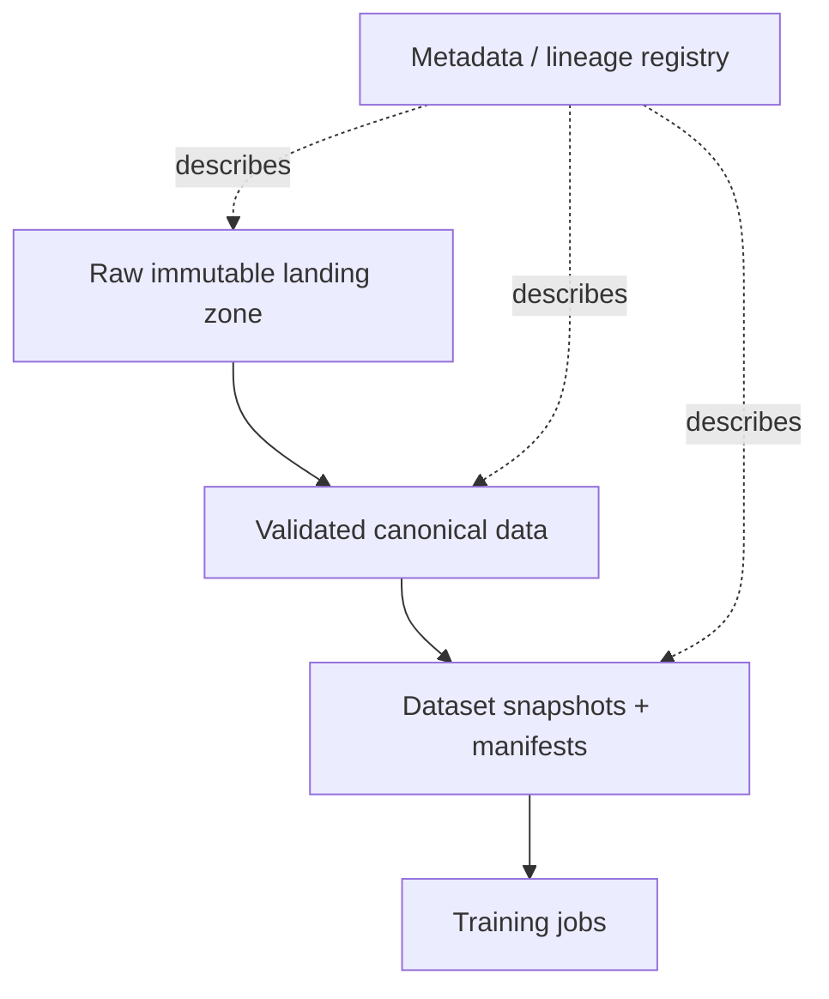

# Dataset Management and Versioning

## TL;DR

A dataset is not a file; it is a reproducible claim about a slice of the world. In production ML, the dataset is the model's specification, so dataset management plays the same role that source control plays for code: it makes behavior traceable, reviewable, and rebuildable. The hard parts are not storing terabytes cheaply. The hard parts are immutability, point-in-time reconstruction, split reproducibility, lineage, privacy deletion, and detecting when a dataset changed meaning without changing schema. A training run that says "trained on June data" is not reproducible; a training run that pins source versions, extraction time, feature versions, label definition, observation windows, split assignment, and content hashes is. The core invariant is simple: **every model must be traceable to an immutable dataset snapshot, and every dataset snapshot must be reconstructable or explicitly retained.**

---

## Why Dataset Management Is the Root of ML Reproducibility

Traditional software can usually be rebuilt from source code, dependencies, and compiler settings. ML cannot. The source code is only a recipe; the dataset is one of the ingredients, and often the dominant one. Change the dataset while holding code fixed and the learned behavior changes. That means dataset versioning is not a convenience for data scientists. It is a reliability primitive.

The failure mode is familiar. A team trains a model in March and deploys it. In June, quality regresses. Someone tries to reproduce the March model to compare behavior, but the warehouse tables have been backfilled, late events have arrived, deleted rows are gone, a label policy changed, and a feature definition was updated in place. The query still runs, but it no longer returns the dataset the March model saw. The team can rebuild *a* model, but not *the* model. Rollback, audit, and debugging are now guesswork.

The engineering lesson is that a dataset used for training is a release artifact. It needs identity, ownership, lineage, retention, and compatibility rules. A model artifact without a dataset contract is like a binary without source control: it may run, but it cannot be explained.

---

## Dataset Identity: What Exactly Are You Versioning?

A dataset version must identify more than a storage path. A path like `s3://bucket/train/2026-06` is only a location. It does not state what logical data is represented, which code produced it, which label definition was used, whether late events were included, or whether two readers will see the same bytes tomorrow.

A production dataset version should record at least:

```yaml
dataset: fraud_training_set
version: 2026-06-24.3
purpose: train
created_at: 2026-06-24T03:12:00Z
sources:
  transactions: { table: warehouse.transactions, snapshot: 881204 }
  chargebacks:  { table: warehouse.chargebacks, snapshot: 881198 }
features:
  - account_risk:v12
  - device_velocity:v7
labels:
  name: transaction_fraud
  version: v6
  observation_window_days: 90
extraction_code:
  repo: org/ml-pipelines
  commit: 441c720
split_policy:
  type: time_based
  train_until: 2026-04-01T00:00:00Z
  validation_until: 2026-05-01T00:00:00Z
content_hash: sha256:9f86d08...
row_count: 128941337
schema_hash: sha256:44aa91...
owner: fraud-ml
retention_until: 2031-06-24
```

The identity has three layers. **Logical identity** says what the dataset means: target, population, time range, label definition. **Provenance identity** says what produced it: source snapshots, code commit, feature versions. **Physical identity** says what bytes were materialized: content hash, schema hash, storage location. All three are necessary. Logical identity without physical immutability is a promise. Physical bytes without logical meaning are a pile of Parquet files.

---

## Snapshots, Not Queries

The most common reproducibility mistake is treating a SQL query as a dataset version. A query is not a snapshot. It is a program that returns whatever the underlying tables mean when it runs.

```sql
SELECT *
FROM transactions t
JOIN chargebacks c USING (transaction_id)
WHERE t.created_at >= '2026-01-01'
```

This query is mutable even if the text never changes. Late events arrive. Backfills rewrite history. Chargeback status changes. Rows are deleted for privacy. Source schemas add enum values. The query is stable; the result is not.

The fix is snapshotting: bind every source read to an immutable version. Warehouses and lakehouse table formats offer different mechanisms — BigQuery snapshots, Snowflake time travel, Iceberg/Delta/Hudi table versions, object-store manifests — but the invariant is the same: the training dataset must be a function of immutable inputs.

```text
dataset_snapshot = extraction_code(commit)
                 + source_table_versions
                 + feature_versions
                 + label_version
                 + split_policy
```

If any term is unpinned, reproducibility is broken. `latest` is the enemy. `current_features` is the enemy. `main` is the enemy. The dataset contract must name exact versions, not moving aliases.

### How Time Travel Actually Works — and When It Silently Stops

Lakehouse table formats make snapshotting nearly free, and understanding the mechanism explains both why it is cheap and where it breaks. An Iceberg table is a tree of immutable metadata: a table pointer names a metadata file, which lists *snapshots*; each snapshot points to a manifest list; each manifest names data files with statistics. A commit writes new data files and a new metadata tree — it never modifies old files:

```text
table pointer → metadata.json
                 ├─ snapshot 881198  → manifest-list → [file1, file2, ...]
                 ├─ snapshot 881204  → manifest-list → [file1, file3, ...]   (file2 replaced)
                 └─ snapshot 881219  → manifest-list → [...]
```

Reading an old snapshot is just reading an old tree — which is why pinning `snapshot: 881204` in the dataset contract costs nothing at write time:

```sql
-- Iceberg (Spark SQL)
SELECT * FROM warehouse.transactions VERSION AS OF 881204;
SELECT * FROM warehouse.transactions TIMESTAMP AS OF '2026-06-24 03:00:00';

-- Delta Lake
SELECT * FROM transactions VERSION AS OF 812;
DESCRIBE HISTORY transactions;   -- maps versions to commits, jobs, and operations

-- Snowflake
SELECT * FROM transactions AT (TIMESTAMP => '2026-06-24 03:00:00'::timestamp_tz);
```

The trap is that **time travel has a garbage collector, and its defaults are much shorter than a model's lifetime.** Delta's `VACUUM` removes unreferenced files after a retention window that defaults to 7 days; Iceberg's `expire_snapshots` maintenance does the same; Snowflake time travel is 1 day by default and 90 at most. A training run that records `VERSION AS OF 812` has recorded a pointer into a tree the janitor will delete next week. Snapshot pinning is only reproducibility if the pinned snapshot is *retained*, which means dataset management must either (a) register training-consumed snapshots with the table's maintenance policy so they are exempt from expiry, or (b) materialize the training view out to its own content-addressed manifest — the pattern in the next section — and let the source table expire freely. Most mature platforms do (b) for training sets and (a) only for short-lived experimentation, because exempting snapshots forever turns every source table into an unbounded archive.

Git-style tools occupy the same design space with different mechanics: **DVC** stores content-hashed data objects in a remote and commits small `.dvc` pointer files to git, so `git checkout && dvc checkout` restores the exact bytes of any historical dataset; **lakeFS** puts git semantics (branches, commits, merges) over an entire object-store namespace, so a training job can run against a commit ID and a backfill can be staged on a branch and reviewed before merge. The mechanism differs from Iceberg's, but the invariant purchased is identical: dataset identity is a hash-addressed, immutable reference, never a path.

---

## Immutability and the Backfill Trap

Backfills are necessary. They correct bugs, load late data, and repair historical gaps. They are also dangerous because they rewrite the apparent past.

Suppose a feature pipeline undercounted failed logins for two weeks. A data engineer fixes the bug and backfills the feature table. Future training should use corrected values. But a model trained last month used the incorrect values because those were what production actually served. If the backfill overwrites history in place, the platform loses the ability to reconstruct the model's real training data and the served-time world it corresponded to.

The correct pattern is **append correction, do not overwrite meaning**:

```text
feature_values_v7_original
  account_id, feature_time, value, observed_at

feature_values_v7_correction_2026_06_24
  account_id, feature_time, corrected_value, observed_at, correction_reason

feature_values_v8
  new canonical definition after correction
```

For training, the pipeline must choose which truth it wants. To reproduce a historical model, use the view as it existed then. To train a new model after the bug fix, use the corrected version or a new feature version. Both are legitimate; conflating them is not.

This mirrors database temporal modeling. There is **valid time** — when a fact was true in the domain — and **transaction time** — when the system learned or stored it. ML datasets often need both. A label may be valid for a transaction in January but observed in March. A feature may describe an event at 10:00 but become available at 10:10. Reproducible datasets must respect what was available to the model at the time of decision or training.

---

## Split Reproducibility: The Hidden Source of Metric Drift

Train/validation/test splits are part of the dataset version. If they are not pinned, offline metrics are not comparable.

Random splits are common because they are easy, but random without a recorded seed and assignment table is not reproducible. Worse, random row splits are often semantically wrong. A future-prediction model should use time-based splits. A model that must generalize to new users, merchants, documents, or patients should use entity-disjoint splits. A recommender may need user-level splits to prevent interactions from the same user leaking across train and test.

| Split type | Correct when | Leakage it prevents |
|---|---|---|
| Random row | IID examples, no temporal or entity dependency | Minimal; often too weak |
| Time-based | Predicting future behavior | Training on the future |
| Entity-disjoint | Generalizing to unseen entities | Memorizing entity history |
| Group / cluster | Examples within group are correlated | Cross-group contamination |
| Policy-era split | Evaluating under new serving policy | Old policy logs contaminating new-policy readout |

A split should be materialized as assignment, not recomputed ad hoc:

```text
split_assignments
  example_id
  dataset_version
  split: train | validation | test | holdback
  assignment_reason
  assignment_seed
```

This seems bureaucratic until a metric changes because someone reran the split with a different seed. If the validation set is part of the measurement instrument, changing it changes the instrument. Treat it accordingly.

For entity-disjoint splits, the strongest implementation is *stateless hashing* rather than a seeded shuffle, because it stays stable as the dataset grows — an entity keeps its assignment forever, even across dataset versions, without storing or coordinating anything:

```python
import hashlib

def split_of(entity_id: str, salt: str = "fraud_v6") -> str:
    h = int(hashlib.sha256(f"{salt}:{entity_id}".encode()).hexdigest(), 16) % 100
    if h < 80:  return "train"
    if h < 90:  return "validation"
    return "test"
```

The salt plays the same role as an experiment salt in [online experiments](./08-online-experiments.md): changing it re-shuffles the population, so it is part of the dataset contract and must never change silently. A seeded `random.shuffle` gives a different answer the moment a row is added or the library version changes its RNG stream; a hash gives the same answer on any machine, in any language, in any year — the properties a measurement instrument needs. The materialized `split_assignments` table is still worth writing (it is what auditors and debuggers read), but with hashing it becomes a *record* of assignments rather than the *source* of them, and the two can be cross-checked.

---

## Dataset Manifests: Content Addressing for ML Data

A large dataset is usually many files or partitions. The dataset version should be represented by a manifest: a list of immutable objects and their hashes.

```text
manifest fraud_training_set@2026-06-24.3
  part-00001.parquet sha256:aaa... rows=1048576 bytes=88MB
  part-00002.parquet sha256:bbb... rows=1048576 bytes=91MB
  ...
manifest_hash sha256:ccc...
```

The manifest gives three properties:

1. **Reproducible reads** — a training job reads the files named in the manifest, not whatever files happen to match a prefix.
2. **Integrity checking** — corrupted or replaced files are detected by hash mismatch.
3. **Cacheability** — pipeline steps can key on manifest hash, not path or timestamp.

Content addressing also prevents a subtle cache bug. If a dataset path is reused for new contents, a pipeline cache keyed on path may return stale features or stale evaluation results. If the key includes the manifest hash, new bytes create a new cache key automatically.

---

## Schema Is Not Semantics

Dataset validation usually starts with schema checks: required columns, types, nullability. These are necessary and insufficient. Most dangerous dataset changes are schema-compatible semantic changes.

Examples:

- `amount` changes from dollars to cents.
- `country` switches from billing country to IP-derived country.
- `active_user` changes from 7-day active to 30-day active.
- `label=1` changes from confirmed fraud to suspected fraud.
- rows now include test accounts that were previously excluded.

Every one of these can pass type checks. A dataset contract therefore needs **semantic validation**: distribution checks, known invariants, source-population counts, and owner-reviewed definition changes.

```yaml
expectations:
  amount:
    min: 0
    p99_max_change_vs_baseline: 0.25
    unit: USD_cents
  country:
    allowed_values_source: iso_3166
    max_unknown_rate: 0.001
  population:
    exclude_test_accounts: true
    expected_daily_volume_change: [-0.20, 0.20]
```

The unit field is not decorative. It is a semantic assertion. The system cannot prove every semantic property, but it can force the team to state the ones that matter and alert when observable proxies move.

---

## Dataset Lineage: Provenance and Impact

Dataset lineage answers two questions:

1. **Provenance** — what produced this dataset?
2. **Impact** — what depends on this dataset or source?

Provenance is needed for debugging and audit. Impact is needed during incidents. If a source table double-counted transactions for a week, the platform must answer which datasets included that source version, which models trained on those datasets, and which deployments served those models.



The lineage store can begin as relational tables. A graph database is rarely necessary at first. What matters is that every edge is written automatically by the pipeline, not manually in a wiki. Manual lineage is stale lineage.

---

## Privacy Deletion and the Reproducibility Conflict

Dataset retention collides with privacy. Reproducibility says keep immutable snapshots. Privacy law may require deleting or anonymizing a subject's data. This is not a documentation problem; it is a system-design trade-off.

There are three common approaches:

**Hard deletion** removes records from retained datasets. This satisfies deletion strongly but breaks bit-for-bit reproducibility. The platform must record that older models can no longer be exactly rebuilt.

**Tombstoning with rebuild** marks deleted subjects and excludes them from future materialized views. Historical manifests remain encrypted or access-restricted until retention expires. This preserves audit under strict access but may not satisfy all deletion requirements.

**Aggregated or anonymized retention** stores derived statistics or irreversibly anonymized rows for reproducibility of aggregate behavior, while deleting direct identifiers. This reduces privacy risk but may not support exact retraining.

The important property is honesty. A registry should record whether a dataset is **rebuildable**, **retained**, **privacy-redacted**, or **expired**. A rollback plan that depends on an expired dataset is not a plan.

---

## Dataset Storage Architecture

A practical dataset platform has four stores:



**Raw immutable landing** preserves what arrived from sources. It is append-only and used for replay.

**Canonical validated data** applies parsing, deduplication, schema normalization, and quality gates.

**Dataset snapshots** are purpose-built training/evaluation datasets with manifests, split assignments, and label/feature versions.

**Metadata registry** records ownership, lineage, quality reports, retention, and usage.

The anti-pattern is training directly from mutable production tables. It is fast for the first model and expensive forever after, because every future debugging session must reverse-engineer what the data meant at training time.

---

## Failure Modes

**Query-as-version** is the root reproducibility failure: the team stores SQL text but not immutable source snapshots or output manifests. Rerunning the query returns a different dataset. Defense: snapshot source versions and materialize content-addressed manifests.

**Backfill rewrites history** occurs when corrected data overwrites what older models actually saw. Defense: append corrections, version semantic changes, and preserve transaction-time history.

**Split drift** happens when validation/test membership changes between runs, making metric comparisons meaningless. Defense: materialized split assignments with seeds and policies recorded.

**Schema-compatible semantic drift** changes units, definitions, populations, or label meaning while types stay valid. Defense: semantic contracts, distribution checks, and owner-reviewed version changes.

**Lineage gaps** leave the team unable to answer which models used a corrupted source. Defense: automatic pipeline-written lineage edges from sources to datasets to training runs to models.

**Privacy deletion breaks rollback** when a retained model depends on a dataset that can no longer be reconstructed. Defense: dataset state tracking — retained, redacted, expired — and rollback validation that checks data availability.

**Manifest/path mismatch** occurs when files under a path change but the dataset version name does not. Defense: content hashes and manifest hashes as the actual identity.

---

## Decision Framework

When designing dataset management for ML, ask:

1. Can every production model name the exact dataset snapshot it trained on?
2. Is that snapshot a query, or immutable source versions plus a content-addressed manifest?
3. Are label definitions, feature versions, split assignments, and extraction code pinned?
4. Can the platform reproduce both the corrected current truth and the historical truth a model actually saw?
5. Are semantic changes versioned, or only schema changes?
6. Can you answer impact queries from bad source data to affected deployed models?
7. Does the retention/privacy policy state whether a dataset remains rebuildable?

If the answer to any of these is no, model metrics may still exist, but they are not audit-grade. The dataset is the model's specification; manage it with the same seriousness as code.

---

## Key Takeaways

1. A dataset is a reproducible claim about a slice of the world, not a file path or SQL query.
2. Dataset versioning is the ML equivalent of source control because changing data changes model behavior.
3. Pin immutable source snapshots, feature versions, label definitions, extraction code, split assignments, schema, and content hashes.
4. Backfills must not erase the historical data older models actually saw; append corrections and version semantic changes.
5. Splits are part of the measurement instrument and must be materialized, not casually recomputed.
6. Content-addressed manifests make large datasets reproducible, integrity-checkable, and cacheable.
7. Schema checks catch only shallow failures; semantic drift requires distribution checks, invariants, and owner-reviewed contracts.
8. Lineage must answer both provenance and impact, automatically.
9. Privacy deletion and reproducibility conflict; track whether snapshots are retained, redacted, expired, or rebuildable.
10. Training directly from mutable production tables is the dataset-management equivalent of deploying unversioned code.

---

## References

1. [Hidden Technical Debt in Machine Learning Systems](https://proceedings.neurips.cc/paper_files/paper/2015/file/86df7dcfd896fcaf2674f757a2463eba-Paper.pdf) — Sculley et al., 2015
2. [Data Validation for Machine Learning](https://mlsys.org/Conferences/2019/doc/2019/167.pdf) — Breck et al., 2019
3. [Datasheets for Datasets](https://arxiv.org/abs/1803.09010) — Gebru et al., 2018
4. [Delta Lake: High-Performance ACID Table Storage over Cloud Object Stores](https://www.vldb.org/pvldb/vol13/p3411-armbrust.pdf) — Armbrust et al., VLDB 2020
5. [Apache Iceberg Table Format](https://iceberg.apache.org/spec/) — snapshot and manifest-based lakehouse tables
6. [DVC Documentation](https://dvc.org/doc) — data and model versioning concepts
7. [Lakehouse and Open Table Formats](../13-data-pipelines/05-lakehouse-table-formats.md)
