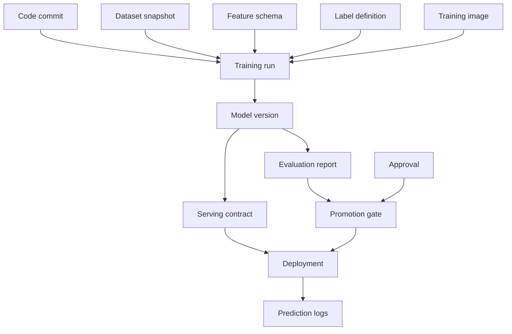

# Model Registry and ML Metadata

## TL;DR

A model registry is not a folder of model files. It is the control plane for ML releases: the system of record that says which artifacts exist, what produced them, what they depend on, which lifecycle state they are in, which gates they passed, who approved them, where they are deployed, and how to roll them back. The model binary is only one object in a graph of metadata — dataset snapshot, feature schema, label definition, training code, runtime image, evaluation report, threshold policy, approvals, deployments, and prediction logs. If that graph is incomplete, the platform cannot answer the questions that matter during incidents: what is serving, why was it promoted, what changed, who approved it, what can we roll back to, and which decisions did it affect? The core invariant is **no model reaches production unless the registry can reconstruct its provenance, validate its serving contract, and name a loadable rollback target.**

---

## The Registry Is the ML Control Plane

In ordinary software, the release artifact is usually a container image or binary, and CI/CD metadata records source commit, tests, and deployment state. In ML, the release artifact is a decision system. The model file is necessary but insufficient. A serving decision also depends on feature definitions, preprocessing, runtime libraries, thresholds, calibration, label definitions, and rollout policy.

The registry exists because those dependencies need a durable, queryable control plane. Without one, teams store model files in object storage, track versions in spreadsheets, approve releases in Slack, and rely on tribal memory for rollback. That works until the first serious incident. Then the questions arrive faster than humans can answer:

- Which model version is serving this endpoint right now?
- What dataset and label definition trained it?
- Which feature schema does it require?
- Which evaluation report justified promotion?
- Who approved the high-risk rollout?
- What version can be rolled back to, and is it still loadable?
- Which users or decisions did this model affect?

A registry turns these from investigations into queries.

---

## The Metadata Graph

A model version should be represented as a node in a metadata graph, not as a row with a path.



The useful property of this graph is bidirectionality. From a deployed model, traverse backward to provenance. From a bad dataset, traverse forward to impacted models. From a user decision, traverse to model version and policy. From a model version, traverse to deployments and prediction logs.

This is the same provenance/impact split that appears in dataset lineage and training pipelines. The registry is where those edges become operational.

A production registry usually stores the graph as relational tables plus immutable object references, not as a literal graph database. The critical part is the edges:

```yaml
model_version_record:
  model_id: fraud_classifier
  version: v42
  artifact:
    uri: s3://ml-artifacts/fraud/v42/model.onnx
    hash: sha256:9f86d08...
    format: onnx
  provenance:
    training_run_id: train_run_01J2
    code_commit: 4f3c9ab
    training_image: registry.example.com/train@sha256:91aa...
    dataset_snapshots:
      - fraud_train:2026-05-31.7
    feature_schema: fraud_features:v18
    label_definition: confirmed_chargeback:v6
  evaluation:
    report_id: eval_report_01J2
    primary_metric_delta: 0.014
    guardrails_passed: true
    uncertainty: bootstrap_95_ci
  serving_contract:
    contract_id: fraud_serving_contract:v42
    runtime_image: registry.example.com/serve@sha256:44aa...
    threshold_policy: fraud_policy:v10
    rollback_target: fraud_classifier:v41
  governance:
    risk_tier: high
    approvals:
      - role: model_owner
        actor: user:alice
        approved_at: 2026-06-24T08:10:00Z
      - role: independent_validator
        actor: user:bob
        approved_at: 2026-06-24T09:02:00Z
  lifecycle_state: approved
```

This record is the join point for release engineering, monitoring, governance, and incident response. The model file can be stored anywhere durable; the registry record is what makes it operable.

---

## Model Identity: Artifact Hash Beats Version Name

Human-readable versions are useful but not sufficient. `fraud_model_v42` is a name; it is not proof of bytes. The registry should identify artifacts by cryptographic hash and immutable storage URI.

```yaml
model: fraud_classifier
version: v42
artifact_uri: s3://ml-artifacts/fraud/v42/model.onnx
artifact_hash: sha256:9f86d08...
format: onnx
created_by_run: train_run_01J2...
created_at: 2026-06-24T03:12:00Z
```

The artifact hash protects against accidental overwrite, corrupted upload, and ambiguous rollback. If a model at the same path changes bytes, it is a different artifact and must be a different model version. Mutable artifact paths are the model equivalent of editing a database row without a transaction log.

The registry should also store environment identity by digest, not tag:

```yaml
runtime_image: registry.example.com/ml-serving/fraud@sha256:44aa...
```

`ml-serving:latest` is not a reproducible runtime. A model that loads today and fails tomorrow after a base-image rebuild was never properly versioned.

---

## The Serving Contract

A model artifact is promotable only if it declares the contract it expects at serving time. The contract is what lets the platform validate compatibility before traffic reaches the model.

```yaml
serving_contract:
  input_schema:
    account_risk:   { type: float32, feature_version: account_risk:v12, required: true }
    device_velocity:{ type: float32, feature_version: device_velocity:v7, required: true }
  preprocessing: fraud_preprocess:v5
  output_schema:
    score: { type: float32, range: [0, 1], meaning: calibrated_probability }
  threshold_policy: fraud_policy:v9
  latency_budget_ms: 45
  fallback: fraud_rules_policy:v3
  rollback_target: fraud_classifier:v41
```

This contract turns deployment from hope into validation. The gate can check whether online features exist, whether the serving runtime supports the model format, whether the threshold policy matches the score semantics, whether the fallback exists, and whether rollback is loadable.

The most common production failure this prevents is a feature/version mismatch: the model expects `device_velocity:v7`, but serving provides `v6`. Every component is individually healthy, yet the decision is wrong. The registry should make such a deployment impossible.

---

## Lifecycle States Are Guardrails

A model version moves through states. Those states should be enforced by the registry, not implied by naming conventions.

```text
created → evaluated → approved → shadow → canary → production → deprecated → retired
              │           │          │        │
              └─ failed    └─ blocked └─ rolled_back
```

Each transition has required evidence:

| Transition | Required evidence |
|---|---|
| created → evaluated | training run complete, artifact hash, lineage complete |
| evaluated → approved | evaluation report, baseline comparison, guardrails pass |
| approved → shadow | serving contract valid, artifact loads, feature schema compatible |
| shadow → canary | latency and score-distribution checks pass |
| canary → production | guardrails hold, risk-tier approvals satisfied |
| production → deprecated | replacement exists, rollback window satisfied |
| deprecated → retired | no active deployments, retention policy satisfied |

A stronger state table includes who may trigger the transition and what must be atomically written:

| From → To | Actor | Gate | Atomic writes |
|---|---|---|---|
| created → evaluated | training pipeline | lineage + artifact validation | evaluation report edge, metrics summary, state event |
| evaluated → approved | model owner + approver | promotion policy | approval records, evidence bundle hash, state event |
| approved → shadow | deployment controller | contract validation | deployment record, shadow traffic config, state event |
| shadow → canary | rollout controller | runtime safety | traffic split, canary monitor config, state event |
| canary → production | rollout controller | guardrails + approvals | active pointer or traffic split, rollback target, state event |
| production → rolled_back | on-call / automation | rollback target loadable | active pointer flip, incident link, state event |
| deprecated → retired | owner / lifecycle job | no active deployments | tombstone, retention schedule, state event |

A registry state is a safety boundary. If engineers can directly mark a model production without satisfying required metadata, the registry is just documentation. The value comes from making invalid transitions unrepresentable.

---

## Promotion Gates as Policy Evaluation

A promotion gate is a policy engine over registry metadata. It should not be custom logic buried in a deploy script. Declarative policy makes requirements reviewable and consistent across models.

```yaml
policies:
  production_promotion:
    all:
      - lineage.complete == true
      - evaluation.primary_metric_delta >= 0
      - evaluation.guardrails.all_pass == true
      - serving_contract.validated == true
      - rollback_target.load_tested == true
      - risk.required_approvals_present == true
      - owner.oncall_rotation_present == true
```

The gate can be stricter by risk tier. A playlist recommender may require lineage, evaluation, and rollback. A credit model may additionally require independent validation, fairness slice metrics, explainability artifacts, legal approval, and contestability paths.

The important property is that the gate reads registry state. If approval happened in Slack but not in the registry, it did not happen for deployment purposes.

---

## Rollback Metadata

Rollback is only real if the registry can name and validate the rollback target. For model systems, this is harder than code rollback because the previous model's dependencies may have rotted.

A rollback target must include:

- artifact hash and storage URI,
- runtime image digest,
- feature schema versions,
- preprocessing version,
- threshold policy,
- fallback policy,
- last load-test result,
- capacity status if it must stay warm.

```yaml
rollback:
  target_model: fraud_classifier:v41
  validated_at: 2026-06-24T02:00:00Z
  load_test: pass
  feature_schema_available: true
  runtime_image_available: true
  warm_replicas: 3
  rollback_method: registry_pointer_flip
  expected_recovery_time_seconds: 10
```

A registry that stores only the current production pointer cannot guarantee rollback. It must continuously validate that rollback remains possible, especially when feature schemas and runtime images are deprecated.

---

## Registry Versus Artifact Store

The artifact store holds bytes. The registry holds meaning.

| Component | Stores | Optimized for |
|---|---|---|
| Artifact store | model binaries, preprocessors, explainability artifacts | durability, large object storage |
| Metadata store | lineage, states, contracts, approvals, metrics | consistency, queryability |
| Deployment control plane | active version pointers, traffic splits | fast safe changes |
| Prediction log | served decisions and contexts | append-only audit and monitoring |

These can be implemented by one product or multiple systems. The boundary matters conceptually: object storage cannot answer whether a model passed fairness review; a registry cannot serve a 5GB artifact efficiently; a deployment control plane should not depend on scanning evaluation reports during a rollback.

---

## Consistency Requirements

The registry is a control plane, so its consistency requirements are stronger than many data-plane systems. Two operators must not be able to concurrently promote different versions to production for the same endpoint without a deterministic result. A rollback pointer flip must be atomic. A model state transition must either record all required metadata or not happen.

This suggests ordinary transactional storage for the registry core. Use a relational database or strongly consistent metadata store for lifecycle state, approvals, and active deployment pointers. Large artifacts and logs can live elsewhere. The registry should not be eventually consistent for production state unless the serving system can tolerate conflicting reads of active version.

The active-model pointer is especially sensitive:

```text
endpoint fraud_authorization → active_model fraud_classifier:v42
```

Changing it should be an atomic compare-and-swap with audit logging:

```text
if active_model == v42:
    set active_model = v41
    append audit event rollback(v42 → v41, actor, reason)
```

In database terms, the pointer flip should look like a small transaction:

```sql
BEGIN;

SELECT active_model_version
FROM endpoint_active_model
WHERE endpoint = 'fraud_authorization'
FOR UPDATE;

-- compare-and-swap guard prevents overwriting a concurrent deploy
UPDATE endpoint_active_model
SET active_model_version = 'fraud_classifier:v41',
    updated_at = CURRENT_TIMESTAMP,
    updated_by = 'user:oncall'
WHERE endpoint = 'fraud_authorization'
  AND active_model_version = 'fraud_classifier:v42';

INSERT INTO registry_audit_log(
  event_type, endpoint, previous_model_version, new_model_version, actor, reason
) VALUES (
  'rollback', 'fraud_authorization', 'fraud_classifier:v42', 'fraud_classifier:v41',
  'user:oncall', 'canary false_positive_rate guardrail breach'
);

COMMIT;
```

Serving nodes should observe the new pointer through a watch/cache protocol with bounded staleness. If the pointer cache TTL is 60 seconds, a "10 second rollback" claim is false no matter how fast the registry transaction is. The serving contract should state pointer propagation SLO, cache invalidation behavior, and what happens if the registry is unavailable.

This is the same reason feature flags and deployment control planes require careful consistency: they decide what users experience.

---

## Audit Log: Who Changed What, When, and Why

Every registry mutation that affects production must be audited:

- model registered,
- evaluation attached,
- approval granted,
- lifecycle state changed,
- traffic percentage changed,
- active version changed,
- threshold policy changed,
- rollback executed,
- model retired.

The audit event should record actor, timestamp, previous state, new state, reason, and request ID. For regulated systems, threshold changes are as important as model changes. A score cutoff can alter thousands of decisions without changing the model artifact at all.

```yaml
registry_audit_event:
  event_id: reg_evt_01J2Z
  occurred_at: 2026-06-24T11:04:19Z
  actor: user:oncall
  request_id: req_deploy_7781
  event_type: traffic_split_changed
  endpoint: fraud_authorization
  previous:
    model_version: fraud_classifier:v41
    traffic_percent: 100
    threshold_policy: fraud_policy:v9
  new:
    model_version: fraud_classifier:v42
    traffic_percent: 5
    threshold_policy: fraud_policy:v10
  gate_result: promotion_gate_run_01J2Y
  reason: canary_ramp_step_1
  rollback_target: fraud_classifier:v41
```

An append-only audit log also helps incident review. The question after a bad rollout is not only "which model caused this?" but "which gate failed to catch it, and who had the information when the decision was made?"

---

## Multi-Environment Promotion

Models often move across environments: dev, staging, shadow, canary, production, and sometimes region-specific production. The registry should track environment-specific deployments separately from model lifecycle.

```text
model fraud_classifier:v42
  lifecycle_state: approved
  deployments:
    staging: active 100%
    shadow-prod-us: active 5% shadow
    canary-prod-us: active 1% user traffic
    prod-eu: not deployed
```

This prevents a common ambiguity: a model can be approved but not deployed, deployed in shadow but not production, production in one region but blocked in another. Lifecycle state is about eligibility. Deployment state is about where traffic actually flows.

---

## Model Registry API Shape

A minimal registry API exposes operations around state transitions and queries, not raw database writes.

```text
register_model(training_run_id, artifact_uri, artifact_hash)
attach_evaluation(model_version, evaluation_report_id)
validate_serving_contract(model_version, endpoint)
request_promotion(model_version, target_state)
approve(model_version, approver, role, justification)
promote(model_version, target_state)
set_traffic(endpoint, model_version, percent)
rollback(endpoint, target_model_version, reason)
retire(model_version)
```

Queries matter just as much:

```text
get_active_model(endpoint)
get_lineage(model_version)
get_impacted_models(dataset_version)
get_deployments(model_version)
get_decisions(model_version, time_range)
get_rollback_target(endpoint)
```

If impact queries require ad hoc SQL written during an incident, the registry has not done its job.

A useful API property is idempotency. Deployment controllers retry, CI jobs retry, and on-call engineers double-submit under stress. Registry mutations should accept request IDs and make repeated calls safe:

```text
promote(model_version=v42, target_state=canary, request_id=req_123)
```

If the first call succeeds and the client times out, the retry should return the existing state transition, not create a duplicate approval or repeat a traffic change. The registry is a control plane; idempotency is part of safety.

---

## Failure Modes

**Artifact folder masquerading as registry** stores model files but not lineage, state, approvals, contracts, or deployments. Defense: metadata graph with enforced lifecycle transitions.

**Mutable artifact path** lets bytes change under the same version name. Defense: artifact hashes and immutable URIs; version identity follows content.

**Approval outside the control plane** records sign-off in Slack or a ticket but not in registry state. Defense: promotion gates read only registry approvals.

**Feature contract mismatch** deploys a model against incompatible online features. Defense: serving contracts validated before promotion.

**Rollback amnesia** discovers during an incident that the previous artifact, image, feature schema, or threshold policy is gone. Defense: rollback metadata and continuous load validation.

**Split-brain production pointer** occurs when concurrent deploy operations leave different serving nodes reading different active versions unintentionally. Defense: strongly consistent active pointers and atomic traffic changes.

**Orphaned model** remains in production after the owning team disappears. Defense: owner metadata, on-call validation, stale ownership alerts, and retirement policy.

**Threshold-only incident** changes a policy value without registry audit because the model artifact did not change. Defense: threshold policies are versioned production artifacts governed like models.

---

## Decision Framework

A model registry is production-grade when it can answer these questions programmatically:

1. What model version is active for each endpoint, region, and traffic segment?
2. What exact artifact bytes and runtime image are serving?
3. What training run, dataset, features, labels, and code produced the model?
4. What evaluation report and guardrails justified promotion?
5. Which risk tier and approvals applied?
6. What feature and output contract does the model require?
7. What rollback target is valid right now, and how fast can it be activated?
8. Which deployments and prediction logs used this model?
9. Who changed lifecycle state, traffic, thresholds, or active version?
10. Which models are impacted by a bad dataset, feature, or label definition?

If these are manual investigations, the registry is incomplete. If they are queries, the registry is a real control plane.

---

## Key Takeaways

1. A model registry is the ML release control plane, not a file catalog.
2. The core object is a metadata graph connecting code, data, features, labels, training runs, model artifacts, evaluation, approvals, deployments, and prediction logs.
3. Identify artifacts by immutable URI and cryptographic hash; names are not proof of bytes.
4. A serving contract declares required features, preprocessing, output semantics, thresholds, fallback, latency budget, and rollback target.
5. Lifecycle states should be enforced guardrails, not naming conventions.
6. Promotion gates are policy evaluation over registry metadata; approvals outside registry state do not count.
7. Rollback requires validated metadata for the previous artifact and all dependencies.
8. The registry core needs strong consistency for production pointers and state transitions; active pointer flips should be atomic and audited.
9. Serving nodes need bounded pointer-propagation behavior, or rollback-time claims are fiction.
10. Threshold and policy changes are production changes and must be versioned and audited.
11. Registry mutation APIs should be idempotent because deploy controllers and humans retry.
12. The registry is successful when provenance, impact, active deployment, approval, and rollback questions are all queries.

---

## References

1. [MLflow Model Registry](https://mlflow.org/docs/latest/ml/model-registry/)
2. [TFX: A TensorFlow-Based Production-Scale Machine Learning Platform](https://dl.acm.org/doi/10.1145/3097983.3098021) — Baylor et al., 2017
3. [Hidden Technical Debt in Machine Learning Systems](https://proceedings.neurips.cc/paper_files/paper/2015/file/86df7dcfd896fcaf2674f757a2463eba-Paper.pdf) — Sculley et al., 2015
4. [Uber Michelangelo: Machine Learning Platform](https://www.uber.com/blog/michelangelo-machine-learning-platform/)
5. [Model Cards for Model Reporting](https://arxiv.org/abs/1810.03993) — Mitchell et al., 2019
6. [ML Metadata](https://www.tensorflow.org/tfx/guide/mlmd) — TensorFlow Extended metadata system
7. [Deployment Strategies](../15-deployment/01-deployment-strategies.md)
