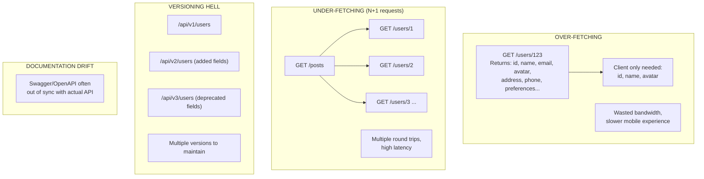
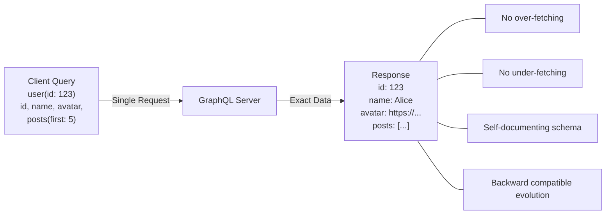
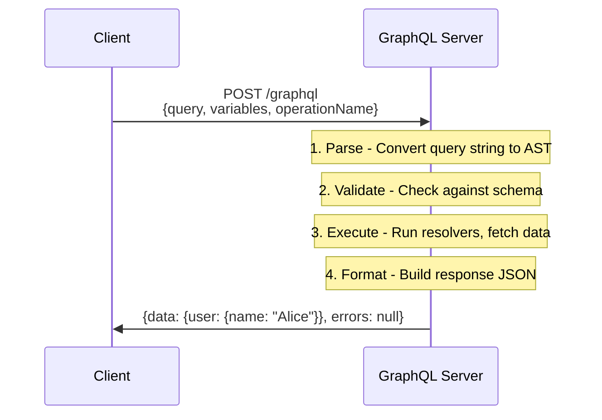

# GraphQL Fundamentals

## TL;DR

GraphQL is a query language and runtime for APIs that lets clients request exactly the data they need. Unlike REST, which exposes fixed endpoints, GraphQL uses a single endpoint with a strongly-typed schema. Clients specify their data requirements, reducing over-fetching and under-fetching. Key concepts include schemas, types, queries, mutations, and subscriptions.

---

## The Problem GraphQL Solves

### REST API Challenges



### GraphQL Solution



---

## Core Concepts

### Schema Definition Language (SDL)

```graphql
# Type definitions using SDL
type User {
  id: ID!                    # Non-nullable ID
  name: String!              # Non-nullable String
  email: String!
  avatar: String             # Nullable String
  posts: [Post!]!            # Non-nullable array of non-nullable Posts
  followers: [User!]!
  createdAt: DateTime!
}

type Post {
  id: ID!
  title: String!
  content: String!
  author: User!
  comments: [Comment!]!
  tags: [String!]
  publishedAt: DateTime
  viewCount: Int!
}

type Comment {
  id: ID!
  text: String!
  author: User!
  post: Post!
  createdAt: DateTime!
}

# Custom scalar types
scalar DateTime
scalar JSON

# Enum types
enum PostStatus {
  DRAFT
  PUBLISHED
  ARCHIVED
}

# Input types for mutations
input CreatePostInput {
  title: String!
  content: String!
  tags: [String!]
  status: PostStatus = DRAFT
}

# Query type - entry point for reads
type Query {
  user(id: ID!): User
  users(first: Int, after: String): UserConnection!
  post(id: ID!): Post
  posts(filter: PostFilter): [Post!]!
  me: User
}

# Mutation type - entry point for writes
type Mutation {
  createPost(input: CreatePostInput!): Post!
  updatePost(id: ID!, input: UpdatePostInput!): Post!
  deletePost(id: ID!): Boolean!
  followUser(userId: ID!): User!
}

# Subscription type - entry point for real-time
type Subscription {
  postCreated: Post!
  commentAdded(postId: ID!): Comment!
}
```

### Type System

```mermaid
graph TD
    TS["GraphQL Type System"]
    TS --> SCALAR["SCALAR TYPES<br/>(leaf nodes)"]
    TS --> OBJ["OBJECT TYPES"]
    TS --> ABS["ABSTRACT TYPES"]
    TS --> MOD["MODIFIERS"]
    TS --> INP["INPUT TYPES"]

    SCALAR --> S1["Int - 32-bit signed integer"]
    SCALAR --> S2["Float - Double-precision"]
    SCALAR --> S3["String - UTF-8"]
    SCALAR --> S4["Boolean - true/false"]
    SCALAR --> S5["ID - Unique identifier"]
    SCALAR --> S6["Custom - DateTime, JSON, URL"]

    OBJ --> O1["User, Post, Comment, etc."]
    OBJ --> O2["Query, Mutation, Subscription<br/>(root types)"]

    ABS --> A1["Interface - Shared fields,<br/>multiple implementations"]
    ABS --> A2["Union - One of several types,<br/>no shared fields"]

    MOD --> M1["Type - List of Type"]
    MOD --> M2["Type! - Non-null Type"]
    MOD --> M3["Type!! - Non-null list<br/>of non-null Types"]

    INP --> I1["input TypeInput -<br/>For mutation arguments"]
```



### Interfaces and Unions

```graphql
# Interface - shared fields with multiple implementations
interface Node {
  id: ID!
}

interface Timestamped {
  createdAt: DateTime!
  updatedAt: DateTime!
}

type User implements Node & Timestamped {
  id: ID!
  createdAt: DateTime!
  updatedAt: DateTime!
  name: String!
  email: String!
}

type Post implements Node & Timestamped {
  id: ID!
  createdAt: DateTime!
  updatedAt: DateTime!
  title: String!
  content: String!
}

# Union - one of several types (no shared fields required)
union SearchResult = User | Post | Comment

type Query {
  node(id: ID!): Node
  search(query: String!): [SearchResult!]!
}

# Querying interfaces/unions requires inline fragments
query {
  search(query: "graphql") {
    ... on User {
      name
      email
    }
    ... on Post {
      title
      content
    }
    ... on Comment {
      text
    }
  }
}
```

---

## Operations

### Queries

```graphql
# Basic query
query GetUser {
  user(id: "123") {
    name
    email
  }
}

# Query with variables
query GetUser($userId: ID!) {
  user(id: $userId) {
    name
    email
    posts(first: 10) {
      title
    }
  }
}

# Variables passed separately:
# { "userId": "123" }

# Aliases - query same field with different arguments
query GetUsers {
  alice: user(id: "1") {
    name
  }
  bob: user(id: "2") {
    name
  }
}

# Fragments - reusable field selections
fragment UserFields on User {
  id
  name
  email
  avatar
}

query GetUsersWithFragments {
  alice: user(id: "1") {
    ...UserFields
    posts {
      title
    }
  }
  bob: user(id: "2") {
    ...UserFields
  }
}

# Directives - conditional inclusion
query GetUser($includeEmail: Boolean!, $skipPosts: Boolean!) {
  user(id: "123") {
    name
    email @include(if: $includeEmail)
    posts @skip(if: $skipPosts) {
      title
    }
  }
}
```

### Mutations

```graphql
# Create mutation
mutation CreatePost($input: CreatePostInput!) {
  createPost(input: $input) {
    id
    title
    content
    author {
      name
    }
  }
}

# Variables:
# {
#   "input": {
#     "title": "Hello GraphQL",
#     "content": "This is my first post",
#     "tags": ["graphql", "api"]
#   }
# }

# Update mutation
mutation UpdatePost($id: ID!, $input: UpdatePostInput!) {
  updatePost(id: $id, input: $input) {
    id
    title
    updatedAt
  }
}

# Delete mutation
mutation DeletePost($id: ID!) {
  deletePost(id: $id)
}

# Multiple mutations in one request (executed sequentially)
mutation CreateAndPublish {
  createPost(input: { title: "Draft", content: "..." }) {
    id
  }
  publishPost(id: "123") {
    status
  }
}
```

### Subscriptions

```graphql
# Subscribe to new posts
subscription OnPostCreated {
  postCreated {
    id
    title
    author {
      name
    }
  }
}

# Subscribe with filter
subscription OnCommentAdded($postId: ID!) {
  commentAdded(postId: $postId) {
    id
    text
    author {
      name
    }
  }
}
```

---

## Architecture

### Request/Response Flow



### Server Implementation

```python
from ariadne import QueryType, MutationType, make_executable_schema
from ariadne.asgi import GraphQL

# Type definitions
type_defs = """
type Query {
    user(id: ID!): User
    users: [User!]!
}

type Mutation {
    createUser(name: String!, email: String!): User!
}

type User {
    id: ID!
    name: String!
    email: String!
    posts: [Post!]!
}

type Post {
    id: ID!
    title: String!
}
"""

# Resolvers
query = QueryType()
mutation = MutationType()

@query.field("user")
async def resolve_user(_, info, id):
    # Fetch user from database
    return await db.users.find_one({"id": id})

@query.field("users")
async def resolve_users(_, info):
    return await db.users.find().to_list(100)

@mutation.field("createUser")
async def resolve_create_user(_, info, name, email):
    user = {"id": str(uuid4()), "name": name, "email": email}
    await db.users.insert_one(user)
    return user

# Field resolver for nested data
@query.field("posts")  # Resolver for User.posts
async def resolve_user_posts(user, info):
    return await db.posts.find({"author_id": user["id"]}).to_list(100)

# Create executable schema
schema = make_executable_schema(type_defs, query, mutation)

# ASGI application
app = GraphQL(schema, debug=True)
```

### Node.js Implementation

```javascript
const { ApolloServer } = require('@apollo/server');
const { startStandaloneServer } = require('@apollo/server/standalone');

// Type definitions
const typeDefs = `#graphql
  type Query {
    user(id: ID!): User
    users: [User!]!
  }

  type Mutation {
    createUser(name: String!, email: String!): User!
  }

  type User {
    id: ID!
    name: String!
    email: String!
    posts: [Post!]!
  }

  type Post {
    id: ID!
    title: String!
  }
`;

// Resolvers
const resolvers = {
  Query: {
    user: async (_, { id }, context) => {
      return context.db.users.findById(id);
    },
    users: async (_, __, context) => {
      return context.db.users.findAll();
    },
  },
  
  Mutation: {
    createUser: async (_, { name, email }, context) => {
      return context.db.users.create({ name, email });
    },
  },
  
  // Field resolvers
  User: {
    posts: async (user, _, context) => {
      return context.db.posts.findByAuthorId(user.id);
    },
  },
};

// Create server
const server = new ApolloServer({
  typeDefs,
  resolvers,
});

// Start server
const { url } = await startStandaloneServer(server, {
  context: async ({ req }) => ({
    db: database,
    user: await authenticateUser(req),
  }),
  listen: { port: 4000 },
});
```

---

## GraphQL vs REST

### Comparison

| Aspect | REST | GraphQL |
|--------|------|---------|
| Endpoints | Multiple | Single (/graphql) |
| Data fetching | Fixed structure | Client-specified |
| Over-fetching | Common | Eliminated |
| Under-fetching | Common (N+1) | Eliminated |
| Versioning | URL-based (/v1) | Schema evolution |
| Caching | HTTP caching | Custom solutions |
| File uploads | Native support | Spec extension |
| Error handling | HTTP status codes | errors array |
| Documentation | External (Swagger) | Introspection |
| Learning curve | Lower | Higher |
| Tooling | Mature | Growing rapidly |

**REST best for:** Simple CRUD APIs, public APIs with diverse clients, file-heavy operations, when HTTP caching is critical

**GraphQL best for:** Complex data requirements, mobile apps (bandwidth sensitive), rapid frontend iteration, aggregating multiple services, real-time features needed

### When NOT to Use GraphQL

```
1. Simple CRUD without nested data
   → REST is simpler and sufficient

2. File uploads as primary use case
   → REST handles multipart better

3. Public API with diverse unknown clients
   → REST is more universally understood

4. Aggressive HTTP caching requirements
   → REST + CDN is more straightforward

5. Small team without GraphQL experience
   → Learning curve may not be worth it

6. Existing REST API working well
   → Don't rewrite just for GraphQL
```

---

## Error Handling

### Error Response Structure

```json
{
  "data": {
    "user": null
  },
  "errors": [
    {
      "message": "User not found",
      "locations": [{ "line": 2, "column": 3 }],
      "path": ["user"],
      "extensions": {
        "code": "NOT_FOUND",
        "timestamp": "2024-01-15T10:30:00Z"
      }
    }
  ]
}
```

### Error Handling Patterns

```python
from graphql import GraphQLError

class UserNotFoundError(GraphQLError):
    def __init__(self, user_id):
        super().__init__(
            message=f"User {user_id} not found",
            extensions={"code": "USER_NOT_FOUND", "userId": user_id}
        )

class ValidationError(GraphQLError):
    def __init__(self, field, message):
        super().__init__(
            message=message,
            extensions={"code": "VALIDATION_ERROR", "field": field}
        )

@query.field("user")
async def resolve_user(_, info, id):
    user = await db.users.find_one({"id": id})
    if not user:
        raise UserNotFoundError(id)
    return user

@mutation.field("createUser")
async def resolve_create_user(_, info, email, name):
    # Validation
    if not is_valid_email(email):
        raise ValidationError("email", "Invalid email format")
    
    if len(name) < 2:
        raise ValidationError("name", "Name must be at least 2 characters")
    
    try:
        return await db.users.create({"email": email, "name": name})
    except DuplicateKeyError:
        raise GraphQLError(
            "Email already exists",
            extensions={"code": "DUPLICATE_EMAIL"}
        )
```

### Union-Based Errors (Recommended)

```graphql
# Error as part of the type system
type Query {
  user(id: ID!): UserResult!
}

union UserResult = User | UserNotFoundError | PermissionDeniedError

type UserNotFoundError {
  message: String!
  userId: ID!
}

type PermissionDeniedError {
  message: String!
  requiredRole: String!
}

# Client handles errors explicitly
query GetUser($id: ID!) {
  user(id: $id) {
    ... on User {
      id
      name
      email
    }
    ... on UserNotFoundError {
      message
      userId
    }
    ... on PermissionDeniedError {
      message
      requiredRole
    }
  }
}
```

---

## Security Considerations

### Query Complexity Analysis

```python
from graphql import GraphQLError

def calculate_complexity(info, max_complexity=1000):
    """
    Prevent expensive queries by limiting complexity
    """
    complexity = 0
    
    def visit_field(field, multiplier=1):
        nonlocal complexity
        
        # Base cost per field
        cost = 1
        
        # List fields multiply complexity
        if is_list_field(field):
            first = get_argument(field, "first") or 10
            cost *= first
        
        complexity += cost * multiplier
        
        # Recursively visit sub-selections
        for sub_field in field.selection_set.selections:
            visit_field(sub_field, cost)
    
    for field in info.field_nodes:
        visit_field(field)
    
    if complexity > max_complexity:
        raise GraphQLError(
            f"Query complexity {complexity} exceeds maximum {max_complexity}"
        )
    
    return complexity

# Usage in resolver
@query.field("users")
async def resolve_users(_, info, first=10):
    calculate_complexity(info, max_complexity=1000)
    return await db.users.find().limit(first)
```

### Query Depth Limiting

```python
from graphql import GraphQLError

def check_depth(info, max_depth=10):
    """
    Prevent deeply nested queries
    """
    def get_depth(selections, current_depth=0):
        if current_depth > max_depth:
            raise GraphQLError(
                f"Query depth {current_depth} exceeds maximum {max_depth}"
            )
        
        max_child_depth = current_depth
        for selection in selections:
            if hasattr(selection, 'selection_set') and selection.selection_set:
                child_depth = get_depth(
                    selection.selection_set.selections,
                    current_depth + 1
                )
                max_child_depth = max(max_child_depth, child_depth)
        
        return max_child_depth
    
    return get_depth(info.field_nodes)
```

### Rate Limiting

```python
from functools import wraps
import time

# Simple token bucket rate limiter
class RateLimiter:
    def __init__(self, tokens_per_second=10, bucket_size=100):
        self.tokens_per_second = tokens_per_second
        self.bucket_size = bucket_size
        self.buckets = {}  # user_id -> (tokens, last_update)
    
    def consume(self, user_id, tokens=1):
        now = time.time()
        
        if user_id not in self.buckets:
            self.buckets[user_id] = (self.bucket_size, now)
        
        current_tokens, last_update = self.buckets[user_id]
        
        # Refill tokens
        elapsed = now - last_update
        current_tokens = min(
            self.bucket_size,
            current_tokens + elapsed * self.tokens_per_second
        )
        
        if current_tokens < tokens:
            raise GraphQLError(
                "Rate limit exceeded",
                extensions={"code": "RATE_LIMITED", "retryAfter": 1}
            )
        
        self.buckets[user_id] = (current_tokens - tokens, now)

rate_limiter = RateLimiter()

def rate_limited(cost=1):
    def decorator(resolver):
        @wraps(resolver)
        async def wrapper(obj, info, **kwargs):
            user_id = info.context.get("user_id", "anonymous")
            rate_limiter.consume(user_id, cost)
            return await resolver(obj, info, **kwargs)
        return wrapper
    return decorator

@query.field("users")
@rate_limited(cost=10)  # Expensive query costs more
async def resolve_users(_, info):
    return await db.users.find().to_list(100)
```

### Authentication & Authorization

```python
from functools import wraps
from graphql import GraphQLError

def authenticated(resolver):
    """Require authenticated user"""
    @wraps(resolver)
    async def wrapper(obj, info, **kwargs):
        user = info.context.get("user")
        if not user:
            raise GraphQLError(
                "Authentication required",
                extensions={"code": "UNAUTHENTICATED"}
            )
        return await resolver(obj, info, **kwargs)
    return wrapper

def authorized(*roles):
    """Require specific roles"""
    def decorator(resolver):
        @wraps(resolver)
        async def wrapper(obj, info, **kwargs):
            user = info.context.get("user")
            if not user:
                raise GraphQLError("Authentication required")
            
            if not any(role in user.roles for role in roles):
                raise GraphQLError(
                    f"Requires one of roles: {roles}",
                    extensions={"code": "FORBIDDEN"}
                )
            return await resolver(obj, info, **kwargs)
        return wrapper
    return decorator

@mutation.field("deleteUser")
@authenticated
@authorized("admin")
async def resolve_delete_user(_, info, id):
    return await db.users.delete(id)

# Field-level authorization
@query.field("email")  # User.email resolver
@authenticated
async def resolve_user_email(user, info):
    current_user = info.context.get("user")
    
    # Users can only see their own email
    if current_user.id != user["id"] and "admin" not in current_user.roles:
        return None  # Or raise error
    
    return user["email"]
```

---

## Best Practices

### Schema Design

```
□ Use clear, descriptive type and field names
□ Make fields non-null (!) by default, nullable only when needed
□ Use ID type for identifiers, not String or Int
□ Prefix input types with the operation name (CreateUserInput)
□ Use enums for fixed sets of values
□ Add descriptions to types and fields for documentation
□ Follow Relay connection spec for pagination
□ Design mutations to return the modified object
```

### Performance

```
□ Implement DataLoader for batching (N+1 problem)
□ Use persisted queries for production
□ Set query complexity limits
□ Set query depth limits
□ Implement response caching where appropriate
□ Use @defer and @stream for large responses
□ Monitor resolver performance
```

### Security

```
□ Always validate and sanitize inputs
□ Implement authentication at the context level
□ Use field-level authorization for sensitive data
□ Rate limit by user and query complexity
□ Disable introspection in production
□ Log and monitor unusual query patterns
□ Use HTTPS only
```

---

## References

- [GraphQL Specification](https://spec.graphql.org/)
- [GraphQL Best Practices](https://graphql.org/learn/best-practices/)
- [Apollo GraphQL Documentation](https://www.apollographql.com/docs/)
- [How to GraphQL](https://www.howtographql.com/)
- [Production Ready GraphQL](https://productionreadygraphql.com/)
- [GraphQL at Scale (Netflix)](https://netflixtechblog.com/our-learnings-from-adopting-graphql-f099de39ae5f)
