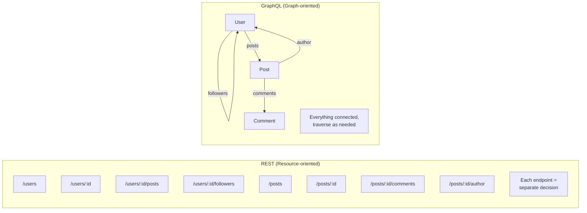
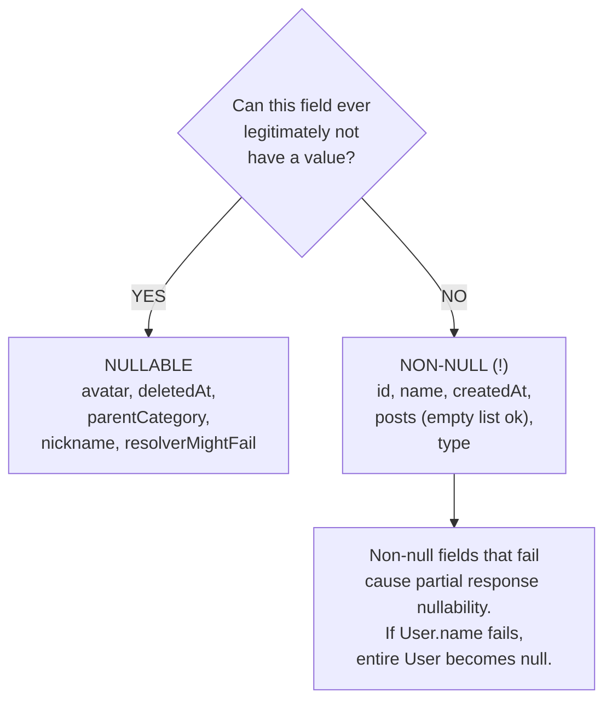
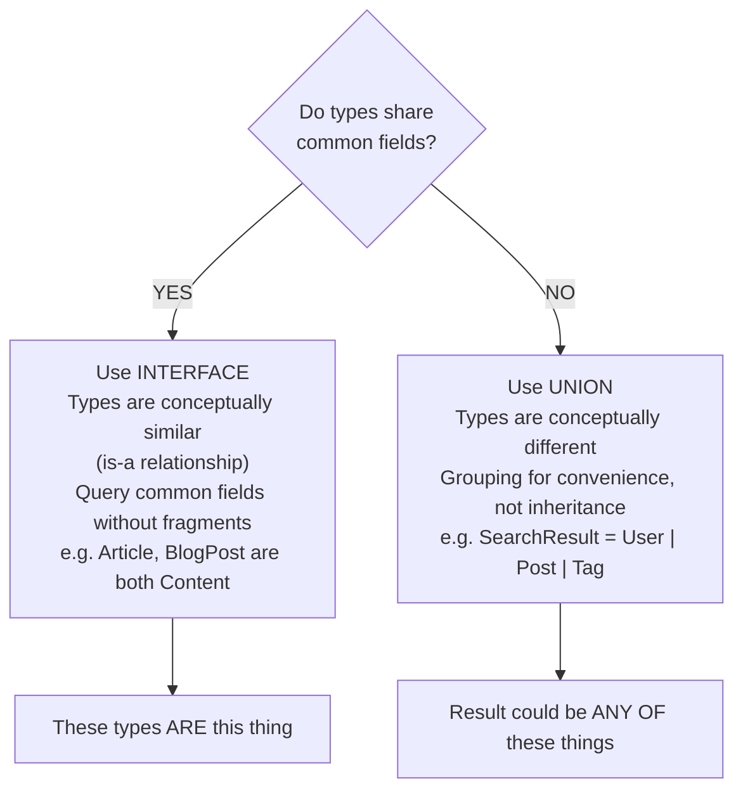
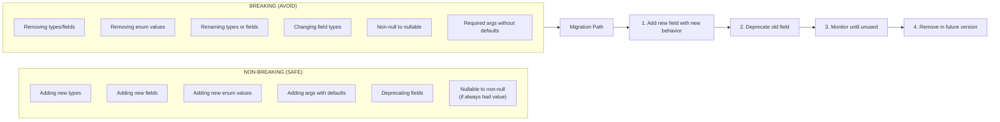

# Schema Design

## TL;DR

Good GraphQL schema design is crucial for API usability, performance, and evolvability. Key principles include designing for the client's use cases, using nullable fields thoughtfully, implementing pagination with connections, and leveraging interfaces/unions for polymorphism. A well-designed schema is self-documenting and enables schema evolution without breaking changes.

---

## Design Principles

### Think in Graphs, Not Endpoints



### Design for Use Cases

```graphql
# BAD: Database-oriented schema
type User {
  id: ID!
  first_name: String!    # Snake case from DB
  last_name: String!
  email_address: String!
  created_at: DateTime!
  updated_at: DateTime!
  is_deleted: Boolean!   # Internal field exposed
}

# GOOD: Client-oriented schema
type User {
  id: ID!
  firstName: String!     # camelCase for clients
  lastName: String!
  
  # Computed field - what clients actually need
  fullName: String!
  
  email: String!
  
  # Formatted for display
  memberSince: String!
  
  # Don't expose internal flags
  # is_deleted stays internal
}

# Resolver provides computed fields
const resolvers = {
  User: {
    fullName: (user) => `${user.first_name} ${user.last_name}`,
    memberSince: (user) => formatDate(user.created_at),
  }
};
```

---

## Nullability

### Non-Null by Default

```graphql
# Every field should be non-null unless there's a reason
type User {
  id: ID!           # Always exists
  name: String!     # Required field
  email: String!    # Required field
  
  # Nullable fields have clear reasons:
  avatar: String              # Optional, user may not have set
  bio: String                 # Optional profile field
  deletedAt: DateTime         # Only set when deleted
  
  # Lists: usually non-null list of non-null items
  posts: [Post!]!             # May be empty [], but never null
  roles: [Role!]!             # Same pattern
  
  # Nullable in list only when semantically meaningful
  previousEmployers: [Company]!   # Some entries might be unknown
}
```

### When to Use Nullable



### Error Propagation

```graphql
type Query {
  user(id: ID!): User        # Nullable - can return null if not found
}

type User {
  id: ID!
  name: String!              # Non-null - failure nullifies parent
  email: String!
  posts: [Post!]!
}

# If name resolver throws:
{
  "data": {
    "user": null              # Entire user is null
  },
  "errors": [{
    "message": "Failed to fetch name",
    "path": ["user", "name"]
  }]
}

# If posts resolver throws (for one post):
{
  "data": {
    "user": {
      "id": "123",
      "name": "Alice",
      "posts": null           # Entire posts array is null
    }
  },
  "errors": [...]
}
```

---

## Pagination

### Cursor-Based Pagination (Relay Connection Spec)

```graphql
# Connection types for pagination
type Query {
  users(
    first: Int
    after: String
    last: Int
    before: String
  ): UserConnection!
}

type UserConnection {
  edges: [UserEdge!]!
  pageInfo: PageInfo!
  totalCount: Int!
}

type UserEdge {
  node: User!
  cursor: String!
}

type PageInfo {
  hasNextPage: Boolean!
  hasPreviousPage: Boolean!
  startCursor: String
  endCursor: String
}

# Query example
query GetUsers {
  users(first: 10, after: "cursor123") {
    edges {
      node {
        id
        name
      }
      cursor
    }
    pageInfo {
      hasNextPage
      endCursor
    }
    totalCount
  }
}
```

### Implementation

```python
import base64
from dataclasses import dataclass
from typing import List, Optional

@dataclass
class PageInfo:
    has_next_page: bool
    has_previous_page: bool
    start_cursor: Optional[str]
    end_cursor: Optional[str]

def encode_cursor(id: str) -> str:
    """Encode ID as opaque cursor"""
    return base64.b64encode(f"cursor:{id}".encode()).decode()

def decode_cursor(cursor: str) -> str:
    """Decode cursor to ID"""
    decoded = base64.b64decode(cursor.encode()).decode()
    return decoded.replace("cursor:", "")

async def resolve_users_connection(
    _,
    info,
    first: int = None,
    after: str = None,
    last: int = None,
    before: str = None
):
    # Build query
    query = {}
    
    if after:
        after_id = decode_cursor(after)
        query["_id"] = {"$gt": after_id}
    
    if before:
        before_id = decode_cursor(before)
        query["_id"] = {"$lt": before_id}
    
    # Determine limit and direction
    if first:
        limit = first + 1  # Fetch one extra to check hasNextPage
        sort_dir = 1
    elif last:
        limit = last + 1
        sort_dir = -1
    else:
        limit = 11  # Default
        sort_dir = 1
    
    # Fetch data
    users = await db.users.find(query).sort("_id", sort_dir).limit(limit).to_list()
    
    # Check for more pages
    has_more = len(users) > (first or last or 10)
    if has_more:
        users = users[:-1]  # Remove extra item
    
    # Reverse if using 'last'
    if last:
        users = list(reversed(users))
    
    # Build edges
    edges = [
        {
            "node": user,
            "cursor": encode_cursor(str(user["_id"]))
        }
        for user in users
    ]
    
    return {
        "edges": edges,
        "pageInfo": {
            "hasNextPage": has_more if first else False,
            "hasPreviousPage": has_more if last else False,
            "startCursor": edges[0]["cursor"] if edges else None,
            "endCursor": edges[-1]["cursor"] if edges else None,
        },
        "totalCount": await db.users.count_documents({})
    }
```

### Offset vs Cursor Pagination

| | Offset-Based (AVOID) | Cursor-Based (RECOMMENDED) |
|---|---|---|
| API | `users(limit: 10, offset: 20)` | `users(first: 10, after: "xyz")` |
| Performance | Expensive for large offsets | Efficient (DB uses index) |
| Consistency | Items skipped/duplicated on change | No skips/duplicates |
| Real-time | Inconsistent | Works with real-time data |
| Implementation | Transparent | Opaque cursors hide implementation |

**When offset is OK:** Small datasets, "Jump to page N" requirement, admin dashboards with stable data

---

## Input Types

### Designing Input Types

```graphql
# Separate input types from output types
type User {
  id: ID!
  name: String!
  email: String!
  role: Role!
  createdAt: DateTime!
}

# Input for creating
input CreateUserInput {
  name: String!
  email: String!
  password: String!         # Only on create
  role: Role = USER         # Default value
}

# Input for updating (all fields optional)
input UpdateUserInput {
  name: String
  email: String
  role: Role
}

# Input for filtering/querying
input UserFilter {
  nameContains: String
  email: String
  role: Role
  createdAfter: DateTime
  createdBefore: DateTime
}

type Mutation {
  createUser(input: CreateUserInput!): User!
  updateUser(id: ID!, input: UpdateUserInput!): User!
}

type Query {
  users(filter: UserFilter, first: Int, after: String): UserConnection!
}
```

### Input Validation

```graphql
# Use custom scalars for validated inputs
scalar Email           # Validated email format
scalar URL             # Validated URL format
scalar PositiveInt     # Must be > 0
scalar NonEmptyString  # Must have content

input CreateUserInput {
  name: NonEmptyString!
  email: Email!
  website: URL
  age: PositiveInt
}

# Or use input unions for complex validation (newer spec)
input CreatePostInput {
  title: String! @constraint(minLength: 1, maxLength: 200)
  content: String! @constraint(minLength: 10)
  tags: [String!]! @constraint(maxItems: 10)
}
```

---

## Interfaces and Unions

### When to Use Interfaces

```graphql
# Interface: types share common fields
interface Node {
  id: ID!
}

interface Timestamped {
  createdAt: DateTime!
  updatedAt: DateTime!
}

interface Content {
  id: ID!
  title: String!
  body: String!
  author: User!
}

# Types implement interfaces
type Article implements Node & Timestamped & Content {
  id: ID!
  createdAt: DateTime!
  updatedAt: DateTime!
  title: String!
  body: String!
  author: User!
  
  # Article-specific fields
  category: Category!
  readingTime: Int!
}

type BlogPost implements Node & Timestamped & Content {
  id: ID!
  createdAt: DateTime!
  updatedAt: DateTime!
  title: String!
  body: String!
  author: User!
  
  # BlogPost-specific fields
  tags: [String!]!
  comments: [Comment!]!
}

# Query can return interface type
type Query {
  node(id: ID!): Node
  content(id: ID!): Content
  feed: [Content!]!
}
```

### When to Use Unions

```graphql
# Union: types with NO shared fields
union SearchResult = User | Post | Comment | Tag

type Query {
  search(query: String!): [SearchResult!]!
}

# Must use inline fragments to query
query Search {
  search(query: "graphql") {
    ... on User {
      id
      name
      avatar
    }
    ... on Post {
      id
      title
      excerpt
    }
    ... on Comment {
      id
      text
    }
    ... on Tag {
      name
      postCount
    }
  }
}

# Another example: notification types
union Notification = 
  | NewFollowerNotification 
  | PostLikedNotification 
  | CommentNotification
  | MentionNotification

type NewFollowerNotification {
  id: ID!
  follower: User!
  createdAt: DateTime!
}

type PostLikedNotification {
  id: ID!
  post: Post!
  likedBy: User!
  createdAt: DateTime!
}
```

### Interface vs Union Decision



---

## Naming Conventions

### Types and Fields

```graphql
# Types: PascalCase
type UserProfile { }
type BlogPost { }
type OrderItem { }

# Fields: camelCase
type User {
  firstName: String!
  lastName: String!
  emailAddress: String!
  createdAt: DateTime!
}

# Enums: SCREAMING_SNAKE_CASE values
enum OrderStatus {
  PENDING
  PROCESSING
  SHIPPED
  DELIVERED
  CANCELLED
}

# Input types: PascalCase with Input suffix
input CreateUserInput { }
input UpdatePostInput { }
input UserFilterInput { }

# Connection types: PascalCase with Connection/Edge suffix
type UserConnection { }
type UserEdge { }
```

### Mutations

```graphql
# Verb + Noun pattern
type Mutation {
  # CRUD operations
  createUser(input: CreateUserInput!): User!
  updateUser(id: ID!, input: UpdateUserInput!): User!
  deleteUser(id: ID!): Boolean!
  
  # Domain actions
  publishPost(id: ID!): Post!
  archivePost(id: ID!): Post!
  followUser(userId: ID!): User!
  unfollowUser(userId: ID!): User!
  
  # Batch operations
  deleteUsers(ids: [ID!]!): Int!
  assignTagsToPosts(postIds: [ID!]!, tagIds: [ID!]!): [Post!]!
}

# Mutation response pattern (recommended)
type Mutation {
  createUser(input: CreateUserInput!): CreateUserPayload!
}

type CreateUserPayload {
  user: User
  errors: [UserError!]!
}

type UserError {
  field: String
  message: String!
  code: ErrorCode!
}
```

---

## Schema Evolution

### Adding Fields (Non-Breaking)

```graphql
# Original schema
type User {
  id: ID!
  name: String!
  email: String!
}

# Add new field - non-breaking change
type User {
  id: ID!
  name: String!
  email: String!
  avatar: String          # New nullable field
  createdAt: DateTime!    # New non-null field (with resolver default)
}
```

### Deprecating Fields

```graphql
type User {
  id: ID!
  name: String!
  
  # Deprecated field - still works but marked for removal
  fullName: String! @deprecated(reason: "Use `name` instead")
  
  # New preferred field
  displayName: String!
  
  # Deprecated with migration path
  email: String! @deprecated(
    reason: "Use `primaryEmail` for main email or `emails` for all"
  )
  primaryEmail: String!
  emails: [Email!]!
}

# Clients see deprecation in introspection
# Tooling (like GraphiQL) shows warnings
```

### Breaking Changes (Avoid)



---

## Documentation

### Self-Documenting Schema

```graphql
"""
A registered user of the platform.
Users can create posts, follow other users, and interact with content.
"""
type User {
  "Unique identifier for the user"
  id: ID!
  
  "Display name shown on the user's profile"
  name: String!
  
  """
  Primary email address for the user.
  Used for authentication and notifications.
  """
  email: String!
  
  """
  URL to the user's avatar image.
  Returns null if user hasn't set an avatar.
  Recommended size: 200x200 pixels.
  """
  avatar: String
  
  """
  Posts authored by this user.
  Ordered by creation date, newest first.
  """
  posts(
    "Maximum number of posts to return"
    first: Int = 10
    
    "Cursor for pagination"
    after: String
  ): PostConnection!
  
  "ISO 8601 timestamp of when the user registered"
  createdAt: DateTime!
}

"""
Represents a blog post created by a user.
Posts can be in draft or published state.
"""
type Post {
  id: ID!
  
  "Title of the post (max 200 characters)"
  title: String!
  
  "Main content in Markdown format"
  content: String!
  
  "Current publication status"
  status: PostStatus!
  
  "The user who authored this post"
  author: User!
}

"""
Publication status of a post.
"""
enum PostStatus {
  "Post is being edited and not publicly visible"
  DRAFT
  
  "Post is published and publicly visible"
  PUBLISHED
  
  "Post was published but has been archived"
  ARCHIVED
}
```

---

## Common Patterns

### Node Interface (Relay Global Object Identification)

```graphql
interface Node {
  id: ID!
}

type Query {
  node(id: ID!): Node
  nodes(ids: [ID!]!): [Node]!
}

# All fetchable types implement Node
type User implements Node {
  id: ID!
  # ...
}

type Post implements Node {
  id: ID!
  # ...
}

# IDs are globally unique (often base64 encoded type:id)
# "User:123" -> "VXNlcjoxMjM="
```

### Viewer Pattern

```graphql
type Query {
  # All user-specific data under viewer
  viewer: Viewer
}

type Viewer {
  id: ID!
  user: User!
  
  # User's data
  notifications(first: Int): NotificationConnection!
  feed(first: Int): PostConnection!
  drafts: [Post!]!
  
  # User's permissions
  canCreatePost: Boolean!
  canModerate: Boolean!
}

# Query
query MyFeed {
  viewer {
    user {
      name
    }
    feed(first: 20) {
      edges {
        node {
          title
        }
      }
    }
  }
}
```

### Action-Specific Return Types

```graphql
type Mutation {
  followUser(userId: ID!): FollowUserPayload!
}

type FollowUserPayload {
  "The user who initiated the follow"
  follower: User!
  
  "The user who was followed"
  followee: User!
  
  "Updated follower count for the followee"
  followeeFollowerCount: Int!
}

# Client gets all relevant updated data in one response
mutation Follow {
  followUser(userId: "456") {
    followee {
      id
      name
    }
    followeeFollowerCount
  }
}
```

---

## Best Practices Checklist

```
Naming:
□ Types in PascalCase
□ Fields in camelCase
□ Enums in SCREAMING_SNAKE_CASE
□ Input types suffixed with Input
□ Mutations follow verb + noun pattern

Nullability:
□ Non-null by default, nullable only when meaningful
□ Lists are [Type!]! (non-null list of non-null items)
□ Consider error propagation behavior

Pagination:
□ Use cursor-based pagination (Relay Connection spec)
□ Include pageInfo and totalCount
□ Provide sensible defaults for first/last

Types:
□ Design for client use cases, not database schema
□ Add computed/derived fields where helpful
□ Use interfaces for shared fields
□ Use unions for heterogeneous results

Evolution:
□ Never remove fields, deprecate first
□ Add new fields instead of changing existing
□ Document deprecation reason and migration path
□ Monitor field usage before removal

Documentation:
□ Add descriptions to all types and fields
□ Document arguments and their defaults
□ Include examples where helpful
□ Keep descriptions up to date
```

---

## References

- [GraphQL Best Practices](https://graphql.org/learn/best-practices/)
- [Relay Connection Specification](https://relay.dev/graphql/connections.htm)
- [Relay Global Object Identification](https://relay.dev/graphql/objectidentification.htm)
- [Principled GraphQL](https://principledgraphql.com/)
- [GraphQL Schema Design (Shopify)](https://github.com/Shopify/graphql-design-tutorial)
- [Production Ready GraphQL](https://productionreadygraphql.com/)
