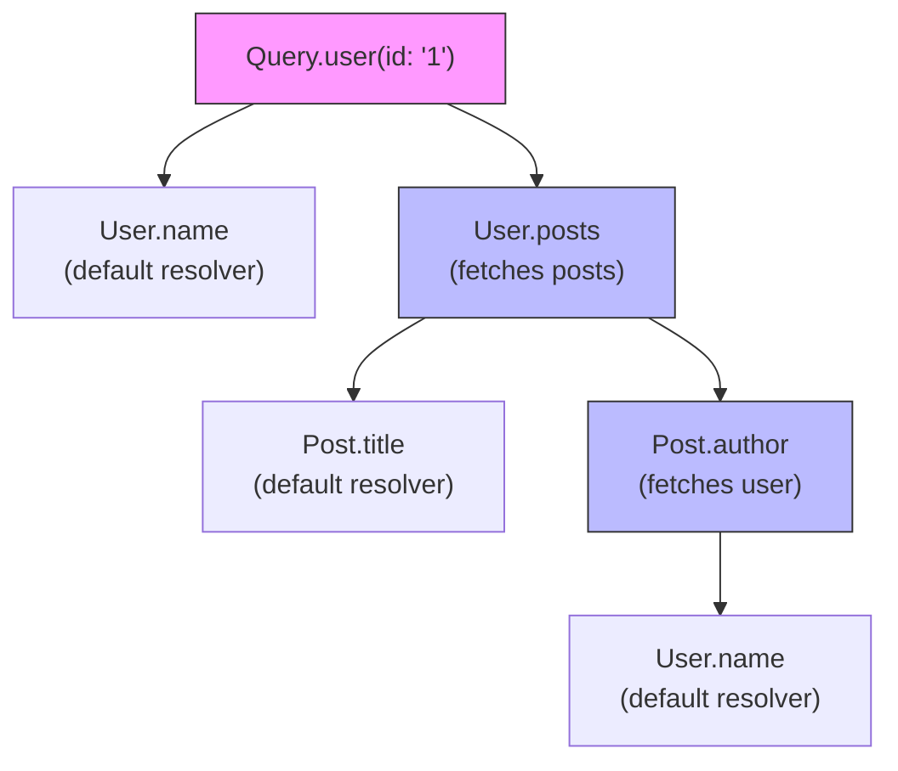
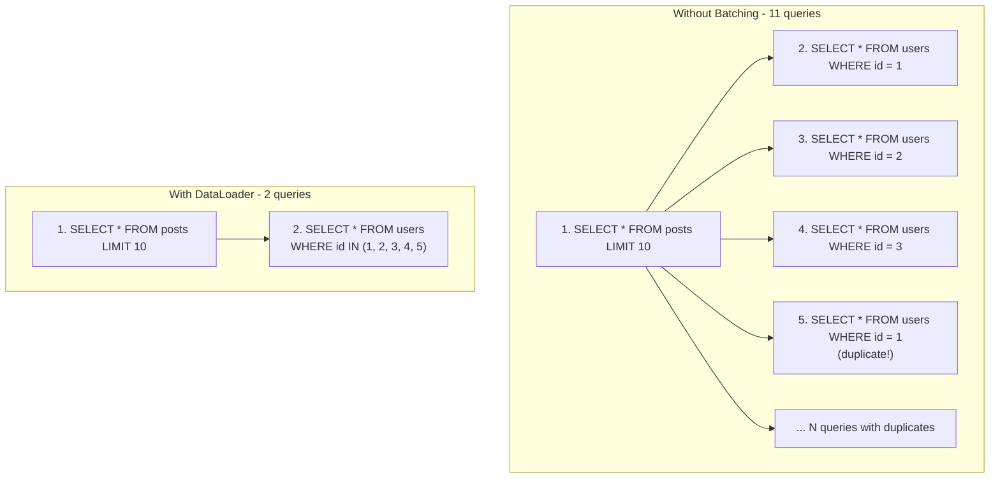
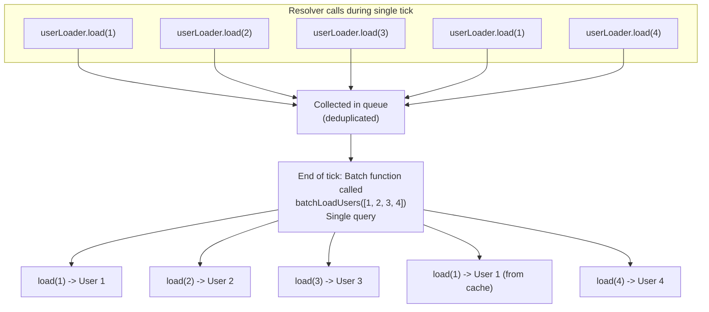

# Resolvers and Data Fetching

## TL;DR

Resolvers are functions that fetch data for GraphQL fields. The key challenge is the N+1 problem, where nested queries cause many database calls. DataLoader solves this by batching and caching requests within a single request. Understanding resolver execution order, context management, and efficient data fetching patterns is essential for performant GraphQL APIs.

---

## Resolver Basics

### How Resolvers Work



**Execution order (depth-first):**
1. `Query.user(id: "1")`
2. `User.name` (uses parent object)
3. `User.posts` (fetches posts)
4. For each post: `Post.title` (uses parent), `Post.author` (fetches user), `User.name` (uses parent)

### Resolver Function Signature

```javascript
// Resolver arguments
const resolvers = {
  Query: {
    user: (parent, args, context, info) => {
      // parent: Result from parent resolver (null for Query)
      // args: Arguments passed to this field
      // context: Shared context (auth, dataloaders, etc.)
      // info: Query AST and schema information
      
      return context.db.users.findById(args.id);
    }
  },
  
  User: {
    // parent is the User object from parent resolver
    posts: (parent, args, context, info) => {
      return context.db.posts.findByAuthorId(parent.id);
    },
    
    // Default resolvers: if not defined, returns parent[fieldName]
    // name: (parent) => parent.name  // implicit
  }
};
```

### Python Example (Ariadne)

```python
from ariadne import QueryType, ObjectType

query = QueryType()
user_type = ObjectType("User")

@query.field("user")
async def resolve_user(_, info, id):
    """
    Args:
        _: Parent (None for Query fields)
        info: ResolveInfo with context, schema, etc.
        id: Field argument
    """
    return await info.context["db"].users.find_one({"_id": id})

@user_type.field("posts")
async def resolve_user_posts(user, info):
    """
    Args:
        user: Parent User object from previous resolver
        info: ResolveInfo
    """
    return await info.context["db"].posts.find(
        {"author_id": user["_id"]}
    ).to_list(100)

@user_type.field("fullName")
async def resolve_full_name(user, info):
    """Computed field from parent data"""
    return f"{user['first_name']} {user['last_name']}"
```

---

## The N+1 Problem

### Understanding the Problem



### Naive Implementation (Problem)

```javascript
// BAD: Causes N+1 queries
const resolvers = {
  Query: {
    posts: async (_, __, context) => {
      return context.db.posts.findAll({ limit: 10 }); // 1 query
    }
  },
  
  Post: {
    author: async (post, _, context) => {
      // Called for EACH post - N additional queries!
      return context.db.users.findById(post.authorId);
    }
  }
};

// Query execution:
// 1. Get 10 posts (1 query)
// 2. For each post, get author (10 queries)
// Total: 11 queries
```

---

## DataLoader

### How DataLoader Works



### JavaScript Implementation

```javascript
const DataLoader = require('dataloader');

// Batch function - receives array of keys, returns array of values
async function batchUsers(userIds) {
  console.log('Batching users:', userIds);
  
  // Single query for all users
  const users = await db.users.findByIds(userIds);
  
  // IMPORTANT: Return values in same order as input keys
  const userMap = new Map(users.map(u => [u.id, u]));
  return userIds.map(id => userMap.get(id) || null);
}

// Create loader
const userLoader = new DataLoader(batchUsers);

// Resolvers using DataLoader
const resolvers = {
  Post: {
    author: async (post, _, context) => {
      // Returns promise immediately, batched at tick end
      return context.loaders.userLoader.load(post.authorId);
    }
  }
};

// Context setup - new loaders per request
function createContext(req) {
  return {
    db: database,
    loaders: {
      userLoader: new DataLoader(batchUsers),
      postLoader: new DataLoader(batchPosts),
    }
  };
}
```

### Python Implementation

```python
from aiodataloader import DataLoader
from typing import List

class UserLoader(DataLoader):
    async def batch_load_fn(self, user_ids: List[str]):
        """
        Batch load function - called once per tick with all requested IDs
        Must return results in same order as input IDs
        """
        print(f"Batching users: {user_ids}")
        
        # Single database query
        users = await db.users.find({"_id": {"$in": user_ids}}).to_list(None)
        
        # Create lookup map
        user_map = {str(u["_id"]): u for u in users}
        
        # Return in same order as input
        return [user_map.get(uid) for uid in user_ids]

class PostLoader(DataLoader):
    async def batch_load_fn(self, post_ids: List[str]):
        posts = await db.posts.find({"_id": {"$in": post_ids}}).to_list(None)
        post_map = {str(p["_id"]): p for p in posts}
        return [post_map.get(pid) for pid in post_ids]

# Create loaders per request
def create_context(request):
    return {
        "user_loader": UserLoader(),
        "post_loader": PostLoader(),
        "db": db,
    }

# Resolver using loader
@post_type.field("author")
async def resolve_author(post, info):
    return await info.context["user_loader"].load(post["author_id"])
```

### DataLoader Patterns

```python
# 1. Loading by foreign key (one-to-one)
class UserLoader(DataLoader):
    async def batch_load_fn(self, user_ids):
        users = await db.users.find({"_id": {"$in": user_ids}}).to_list(None)
        user_map = {u["_id"]: u for u in users}
        return [user_map.get(uid) for uid in user_ids]

# 2. Loading by foreign key (one-to-many)
class PostsByAuthorLoader(DataLoader):
    async def batch_load_fn(self, author_ids):
        # Returns list of lists
        posts = await db.posts.find(
            {"author_id": {"$in": author_ids}}
        ).to_list(None)
        
        # Group by author
        posts_by_author = defaultdict(list)
        for post in posts:
            posts_by_author[post["author_id"]].append(post)
        
        return [posts_by_author.get(aid, []) for aid in author_ids]

# 3. Loading with compound keys
class CommentLoader(DataLoader):
    def __init__(self):
        super().__init__(cache_key_fn=lambda k: f"{k['post_id']}:{k['user_id']}")
    
    async def batch_load_fn(self, keys):
        # keys = [{"post_id": 1, "user_id": 2}, ...]
        comments = await db.comments.find({
            "$or": [
                {"post_id": k["post_id"], "user_id": k["user_id"]}
                for k in keys
            ]
        }).to_list(None)
        
        comment_map = {
            f"{c['post_id']}:{c['user_id']}": c 
            for c in comments
        }
        
        return [
            comment_map.get(f"{k['post_id']}:{k['user_id']}")
            for k in keys
        ]

# Usage
comment = await info.context["comment_loader"].load({
    "post_id": post["_id"],
    "user_id": current_user["_id"]
})
```

---

## Advanced Resolver Patterns

### Field-Level Caching

```python
from functools import lru_cache

# Per-request caching (via DataLoader)
# - Automatic with DataLoader
# - Scoped to single request

# Cross-request caching (for expensive computations)
class ExpensiveComputationLoader(DataLoader):
    def __init__(self, cache):
        super().__init__()
        self.cache = cache  # Redis or similar
    
    async def batch_load_fn(self, keys):
        results = []
        keys_to_compute = []
        
        # Check cache first
        for key in keys:
            cached = await self.cache.get(f"compute:{key}")
            if cached:
                results.append(cached)
            else:
                results.append(None)
                keys_to_compute.append(key)
        
        # Compute missing values
        if keys_to_compute:
            computed = await self.expensive_computation(keys_to_compute)
            
            # Store in cache
            for key, value in zip(keys_to_compute, computed):
                await self.cache.set(f"compute:{key}", value, ex=3600)
            
            # Fill in results
            compute_idx = 0
            for i, result in enumerate(results):
                if result is None:
                    results[i] = computed[compute_idx]
                    compute_idx += 1
        
        return results
```

### Conditional Data Fetching

```python
from graphql import GraphQLResolveInfo

def get_requested_fields(info: GraphQLResolveInfo) -> set:
    """Extract field names from query selection"""
    fields = set()
    for field in info.field_nodes:
        if field.selection_set:
            for selection in field.selection_set.selections:
                fields.add(selection.name.value)
    return fields

@query.field("user")
async def resolve_user(_, info, id):
    requested = get_requested_fields(info)
    
    # Only fetch what's needed
    projection = {}
    if "name" in requested:
        projection["name"] = 1
    if "email" in requested:
        projection["email"] = 1
    if "avatar" in requested:
        projection["avatar"] = 1
    
    # Always include _id for relationships
    projection["_id"] = 1
    
    return await info.context["db"].users.find_one(
        {"_id": id},
        projection=projection
    )

@user_type.field("posts")
async def resolve_posts(user, info, first=10):
    # Check if we need full posts or just count
    requested = get_requested_fields(info)
    
    if requested == {"totalCount"}:
        # Only count requested - skip fetching posts
        count = await info.context["db"].posts.count_documents(
            {"author_id": user["_id"]}
        )
        return {"edges": [], "totalCount": count}
    
    # Fetch actual posts
    posts = await info.context["db"].posts.find(
        {"author_id": user["_id"]}
    ).limit(first).to_list(None)
    
    return {
        "edges": [{"node": p, "cursor": str(p["_id"])} for p in posts],
        "totalCount": await info.context["db"].posts.count_documents(
            {"author_id": user["_id"]}
        )
    }
```

### Parallel Resolution

```python
import asyncio

@query.field("dashboard")
async def resolve_dashboard(_, info):
    user_id = info.context["user"]["_id"]
    
    # Fetch all data in parallel
    user_task = info.context["user_loader"].load(user_id)
    posts_task = info.context["db"].posts.find(
        {"author_id": user_id}
    ).limit(5).to_list(None)
    notifications_task = info.context["db"].notifications.find(
        {"user_id": user_id, "read": False}
    ).limit(10).to_list(None)
    stats_task = fetch_user_stats(user_id)
    
    user, posts, notifications, stats = await asyncio.gather(
        user_task, posts_task, notifications_task, stats_task
    )
    
    return {
        "user": user,
        "recentPosts": posts,
        "unreadNotifications": notifications,
        "stats": stats,
    }
```

---

## Error Handling in Resolvers

### Returning Partial Data

```python
from graphql import GraphQLError

@query.field("posts")
async def resolve_posts(_, info, ids):
    """
    Fetch multiple posts - return partial results if some fail
    """
    results = []
    
    for post_id in ids:
        try:
            post = await info.context["post_loader"].load(post_id)
            results.append(post)
        except Exception as e:
            # Log error but continue with other posts
            logger.error(f"Failed to load post {post_id}: {e}")
            results.append(None)
    
    return results

# Union-based error handling
@mutation.field("createPost")
async def resolve_create_post(_, info, input):
    try:
        # Validation
        if len(input["title"]) < 5:
            return {
                "__typename": "ValidationError",
                "field": "title",
                "message": "Title must be at least 5 characters"
            }
        
        # Create post
        post = await info.context["db"].posts.insert_one({
            "title": input["title"],
            "content": input["content"],
            "author_id": info.context["user"]["_id"],
        })
        
        return {
            "__typename": "Post",
            **post
        }
        
    except DuplicateKeyError:
        return {
            "__typename": "DuplicateError",
            "message": "A post with this title already exists"
        }
```

### Error Formatting

```python
from graphql import GraphQLError

class NotFoundError(GraphQLError):
    def __init__(self, resource, id):
        super().__init__(
            message=f"{resource} with id {id} not found",
            extensions={
                "code": "NOT_FOUND",
                "resource": resource,
                "id": id
            }
        )

class PermissionError(GraphQLError):
    def __init__(self, action, resource):
        super().__init__(
            message=f"Permission denied: cannot {action} {resource}",
            extensions={
                "code": "PERMISSION_DENIED",
                "action": action,
                "resource": resource
            }
        )

@mutation.field("deletePost")
async def resolve_delete_post(_, info, id):
    post = await info.context["post_loader"].load(id)
    
    if not post:
        raise NotFoundError("Post", id)
    
    if post["author_id"] != info.context["user"]["_id"]:
        raise PermissionError("delete", "post")
    
    await info.context["db"].posts.delete_one({"_id": id})
    return True
```

---

## Performance Monitoring

### Resolver Timing

```python
import time
from functools import wraps

def timed_resolver(resolver):
    """Decorator to time resolver execution"""
    @wraps(resolver)
    async def wrapper(obj, info, **kwargs):
        start = time.time()
        try:
            return await resolver(obj, info, **kwargs)
        finally:
            duration = (time.time() - start) * 1000
            field = f"{info.parent_type.name}.{info.field_name}"
            
            if duration > 100:  # Log slow resolvers
                logger.warning(f"Slow resolver: {field} took {duration:.2f}ms")
            
            # Record metrics
            metrics.histogram(
                "graphql_resolver_duration_ms",
                duration,
                tags={"field": field}
            )
    return wrapper

@query.field("users")
@timed_resolver
async def resolve_users(_, info, first=10):
    return await info.context["db"].users.find().limit(first).to_list(None)
```

### Query Complexity Analysis

```python
def analyze_query_complexity(info, max_depth=10, max_complexity=1000):
    """
    Analyze query before execution
    """
    def calculate(selections, depth=0, parent_multiplier=1):
        if depth > max_depth:
            raise GraphQLError(f"Query depth {depth} exceeds maximum {max_depth}")
        
        complexity = 0
        for selection in selections:
            field_name = selection.name.value
            
            # Base cost
            cost = 1
            
            # Multiplier for list fields
            multiplier = 1
            if selection.arguments:
                for arg in selection.arguments:
                    if arg.name.value in ("first", "last", "limit"):
                        multiplier = arg.value.value
            
            complexity += cost * parent_multiplier
            
            # Recurse into selections
            if selection.selection_set:
                complexity += calculate(
                    selection.selection_set.selections,
                    depth + 1,
                    multiplier
                )
        
        return complexity
    
    total = calculate(info.field_nodes[0].selection_set.selections)
    
    if total > max_complexity:
        raise GraphQLError(
            f"Query complexity {total} exceeds maximum {max_complexity}"
        )
    
    return total
```

---

## Best Practices

### DataLoader Guidelines

```
□ Create new DataLoader instances per request
□ Never share DataLoaders across requests
□ Return results in exact order of input keys
□ Handle missing values (return null, not undefined)
□ Use cache_key_fn for complex keys
□ Prime cache when you already have the data
□ Clear cache when data is mutated
```

### Resolver Guidelines

```
□ Keep resolvers focused - single responsibility
□ Use DataLoader for any repeated data fetching
□ Check requested fields to optimize queries
□ Return null for missing optional data
□ Throw errors for missing required data
□ Log and monitor resolver performance
□ Use parallel fetching where possible
```

### Performance Guidelines

```
□ Always use DataLoader for N+1 prone fields
□ Set sensible default limits for list fields
□ Implement query complexity analysis
□ Add resolver timing/tracing
□ Use projections to fetch only needed fields
□ Cache expensive computations
□ Monitor and alert on slow queries
```

---

## References

- [DataLoader Documentation](https://github.com/graphql/dataloader)
- [GraphQL Resolvers Best Practices](https://www.apollographql.com/docs/apollo-server/data/resolvers/)
- [Solving the N+1 Problem](https://shopify.engineering/solving-the-n-1-problem-for-graphql-through-batching)
- [GraphQL Performance (Shopify)](https://shopify.engineering/how-shopify-reduced-storefront-api-response-times-80-graphql)
- [Apollo Server Performance](https://www.apollographql.com/docs/apollo-server/performance/caching/)
