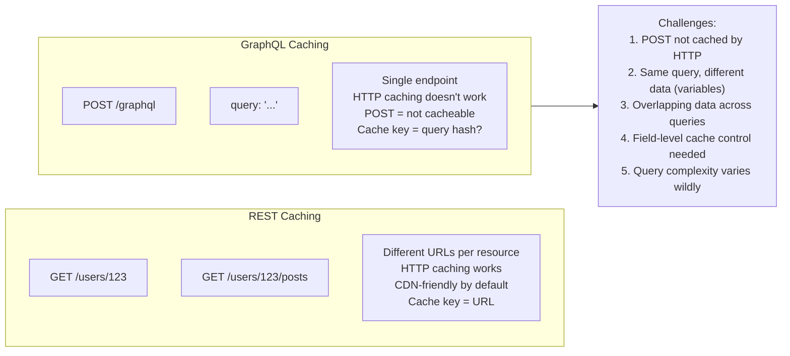
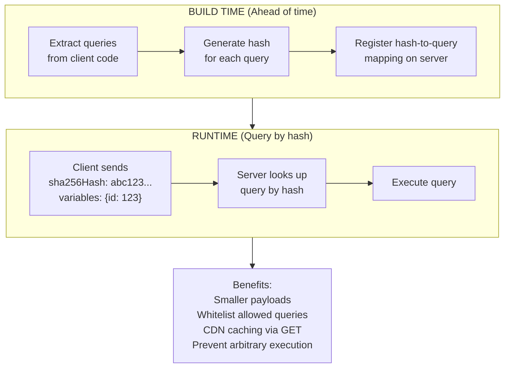
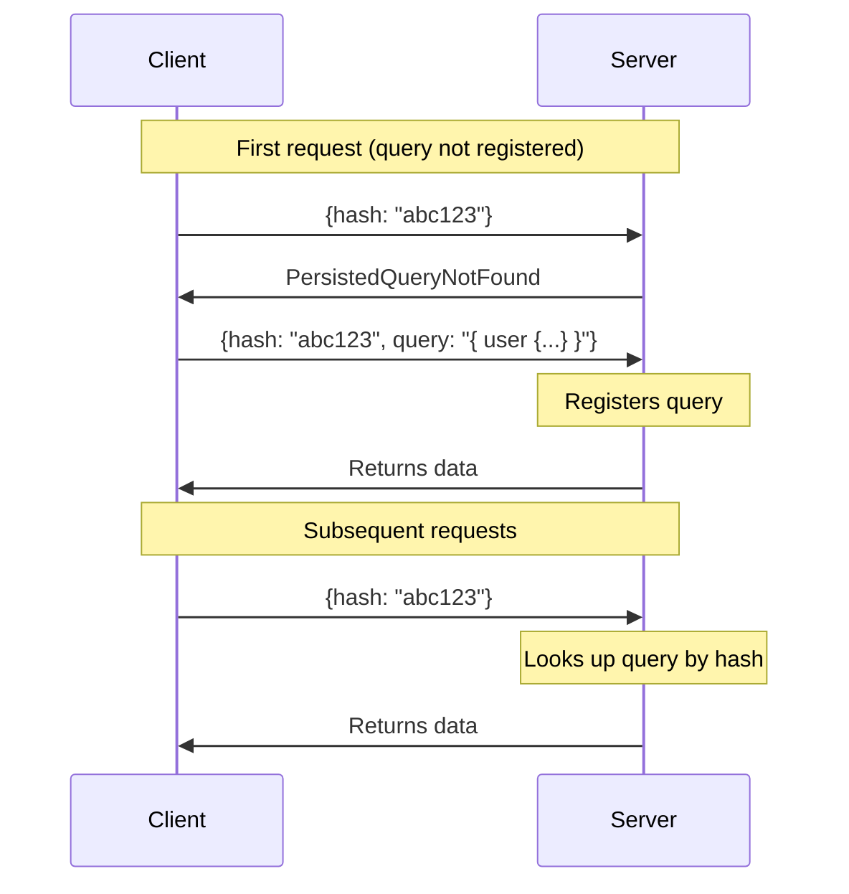
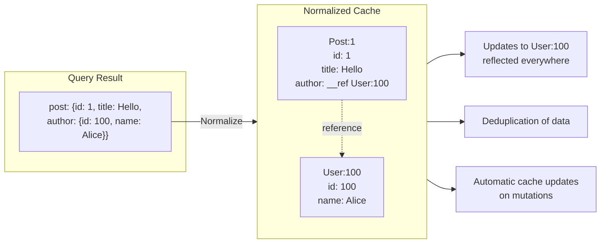

# Caching and Performance

## TL;DR

GraphQL caching is more complex than REST because requests go to a single endpoint with varying queries. Key strategies include response caching (full query results), normalized caching (entity-level), persisted queries (pre-registered queries), and CDN caching. Automatic Persisted Queries (APQ) reduce bandwidth, while cache control directives enable fine-grained TTLs per field.

---

## Caching Challenges

### Why GraphQL Caching is Different



---

## Response Caching

### Full Response Cache

```python
import hashlib
import json
from functools import wraps

class ResponseCache:
    """Cache entire GraphQL responses by query hash"""
    
    def __init__(self, redis_client, default_ttl=300):
        self.redis = redis_client
        self.default_ttl = default_ttl
    
    def cache_key(self, query: str, variables: dict, user_id: str = None) -> str:
        """Generate cache key from query and variables"""
        # Include user_id for personalized queries
        key_data = {
            "query": query,
            "variables": variables,
            "user": user_id
        }
        key_hash = hashlib.sha256(
            json.dumps(key_data, sort_keys=True).encode()
        ).hexdigest()
        return f"graphql:response:{key_hash}"
    
    async def get(self, query: str, variables: dict, user_id: str = None):
        key = self.cache_key(query, variables, user_id)
        cached = await self.redis.get(key)
        if cached:
            return json.loads(cached)
        return None
    
    async def set(
        self, 
        query: str, 
        variables: dict, 
        response: dict, 
        ttl: int = None,
        user_id: str = None
    ):
        key = self.cache_key(query, variables, user_id)
        await self.redis.setex(
            key,
            ttl or self.default_ttl,
            json.dumps(response)
        )

# Middleware for response caching
async def caching_middleware(resolve, obj, info, **kwargs):
    cache = info.context["response_cache"]
    
    # Only cache queries, not mutations
    if info.operation.operation != "query":
        return await resolve(obj, info, **kwargs)
    
    # Check cache
    query_str = info.context["query_string"]
    variables = info.context["variables"]
    user_id = info.context.get("user", {}).get("id")
    
    cached = await cache.get(query_str, variables, user_id)
    if cached:
        info.context["cache_hit"] = True
        return cached
    
    # Execute and cache
    result = await resolve(obj, info, **kwargs)
    
    # Get TTL from cache hints
    ttl = get_min_ttl_from_hints(info)
    await cache.set(query_str, variables, result, ttl, user_id)
    
    return result
```

### Cache Control Directives

```graphql
# Schema with cache hints
type Query {
  # Public data, cache for 1 hour
  posts: [Post!]! @cacheControl(maxAge: 3600)
  
  # User-specific, shorter cache
  me: User @cacheControl(maxAge: 60, scope: PRIVATE)
  
  # Real-time data, no caching
  notifications: [Notification!]! @cacheControl(maxAge: 0)
}

type Post {
  id: ID!
  title: String!
  content: String!
  
  # Author rarely changes
  author: User! @cacheControl(maxAge: 3600)
  
  # Comments change frequently
  comments: [Comment!]! @cacheControl(maxAge: 60)
  
  # View count changes constantly
  viewCount: Int! @cacheControl(maxAge: 0)
}

type User {
  id: ID! @cacheControl(maxAge: 3600)
  name: String! @cacheControl(maxAge: 3600)
  
  # Email is private
  email: String! @cacheControl(scope: PRIVATE)
}
```

### Implementation

```python
from enum import Enum
from dataclasses import dataclass
from typing import Optional

class CacheScope(Enum):
    PUBLIC = "PUBLIC"
    PRIVATE = "PRIVATE"

@dataclass
class CacheHint:
    max_age: int
    scope: CacheScope = CacheScope.PUBLIC

# Store hints during resolution
class CacheHintCollector:
    def __init__(self):
        self.hints = []
    
    def add_hint(self, path: list, hint: CacheHint):
        self.hints.append({"path": path, "hint": hint})
    
    def get_overall_policy(self) -> dict:
        """Calculate overall cache policy from all hints"""
        if not self.hints:
            return {"maxAge": 0, "scope": "PUBLIC"}
        
        min_age = min(h["hint"].max_age for h in self.hints)
        scope = "PRIVATE" if any(
            h["hint"].scope == CacheScope.PRIVATE for h in self.hints
        ) else "PUBLIC"
        
        return {"maxAge": min_age, "scope": scope}

# Directive implementation
def cache_control_directive(resolver, obj, info, max_age=0, scope="PUBLIC"):
    """Process @cacheControl directive"""
    # Record hint
    hint = CacheHint(max_age=max_age, scope=CacheScope[scope])
    info.context["cache_hints"].add_hint(info.path, hint)
    
    return resolver(obj, info)

# Add cache headers to response
def add_cache_headers(response, cache_hints: CacheHintCollector):
    policy = cache_hints.get_overall_policy()
    
    if policy["maxAge"] > 0:
        scope = "private" if policy["scope"] == "PRIVATE" else "public"
        response.headers["Cache-Control"] = f"{scope}, max-age={policy['maxAge']}"
    else:
        response.headers["Cache-Control"] = "no-store"
    
    return response
```

---

## Persisted Queries

### How Persisted Queries Work



### Server Implementation

```python
import hashlib
from typing import Dict, Optional

class PersistedQueryStore:
    """Store for persisted queries"""
    
    def __init__(self, redis_client=None):
        self.redis = redis_client
        self.local_cache: Dict[str, str] = {}
    
    def hash_query(self, query: str) -> str:
        """Generate SHA256 hash of query"""
        return hashlib.sha256(query.encode()).hexdigest()
    
    async def register(self, query: str) -> str:
        """Register a query and return its hash"""
        query_hash = self.hash_query(query)
        
        # Store in Redis for distributed access
        if self.redis:
            await self.redis.set(f"pq:{query_hash}", query)
        
        # Also cache locally
        self.local_cache[query_hash] = query
        
        return query_hash
    
    async def get(self, query_hash: str) -> Optional[str]:
        """Get query by hash"""
        # Check local cache first
        if query_hash in self.local_cache:
            return self.local_cache[query_hash]
        
        # Check Redis
        if self.redis:
            query = await self.redis.get(f"pq:{query_hash}")
            if query:
                self.local_cache[query_hash] = query
                return query
        
        return None

# Request handling with persisted queries
async def handle_graphql_request(request):
    body = await request.json()
    
    query = body.get("query")
    variables = body.get("variables", {})
    extensions = body.get("extensions", {})
    
    # Check for persisted query
    persisted = extensions.get("persistedQuery", {})
    query_hash = persisted.get("sha256Hash")
    
    if query_hash and not query:
        # Lookup query by hash
        query = await persisted_store.get(query_hash)
        
        if not query:
            return {
                "errors": [{
                    "message": "PersistedQueryNotFound",
                    "extensions": {"code": "PERSISTED_QUERY_NOT_FOUND"}
                }]
            }
    
    elif query and query_hash:
        # Verify hash matches (APQ registration)
        expected_hash = persisted_store.hash_query(query)
        if query_hash != expected_hash:
            return {
                "errors": [{
                    "message": "Hash mismatch",
                    "extensions": {"code": "INVALID_HASH"}
                }]
            }
        
        # Register the query
        await persisted_store.register(query)
    
    # Execute query
    return await execute_graphql(query, variables)
```

### Automatic Persisted Queries (APQ)



Benefits: No build step required, automatic registration on first use, only one extra round-trip per unique query, works with dynamically generated queries

---

## CDN Caching

### Making GraphQL CDN-Friendly

```python
# Convert POST to GET for cacheable queries
async def handle_get_request(request):
    """Handle GET requests with persisted queries for CDN caching"""
    
    # Query parameters
    query_hash = request.query_params.get("hash")
    variables = json.loads(request.query_params.get("variables", "{}"))
    
    # Look up query
    query = await persisted_store.get(query_hash)
    if not query:
        return Response(status_code=404)
    
    # Check if cacheable (no mutations, no private data)
    if not is_cacheable_query(query):
        return Response(status_code=400)
    
    # Execute
    result = await execute_graphql(query, variables)
    
    # Add cache headers
    cache_policy = get_cache_policy(result)
    headers = {
        "Cache-Control": f"public, max-age={cache_policy['maxAge']}",
        "Vary": "Accept-Encoding",
    }
    
    return Response(json.dumps(result), headers=headers)

# CDN configuration (Cloudflare/Fastly)
"""
Cache rules:
- Cache GET /graphql?hash=* requests
- Vary by: Accept-Encoding, Authorization (if needed)
- Respect Cache-Control headers
- Purge by tag when data updates
"""
```

### Cache Tags for Invalidation

```python
class CacheTagCollector:
    """Collect cache tags during resolution for CDN invalidation"""
    
    def __init__(self):
        self.tags = set()
    
    def add_tag(self, tag: str):
        self.tags.add(tag)
    
    def add_entity(self, type_name: str, id: str):
        self.tags.add(f"{type_name}:{id}")

# Resolver adds tags
@query.field("post")
async def resolve_post(_, info, id):
    post = await info.context["db"].posts.find_one({"_id": id})
    
    # Add cache tag for this entity
    info.context["cache_tags"].add_entity("Post", id)
    info.context["cache_tags"].add_entity("User", post["author_id"])
    
    return post

# Add tags to response headers
def add_cache_tags(response, tags: CacheTagCollector):
    if tags.tags:
        response.headers["Cache-Tag"] = ",".join(tags.tags)
        # Cloudflare: Surrogate-Key
        response.headers["Surrogate-Key"] = " ".join(tags.tags)
    return response

# Invalidation on mutation
@mutation.field("updatePost")
async def resolve_update_post(_, info, id, input):
    result = await info.context["db"].posts.update_one(
        {"_id": id},
        {"$set": input}
    )
    
    # Purge CDN cache for this entity
    await purge_cdn_cache(tags=[f"Post:{id}"])
    
    return await info.context["post_loader"].load(id)
```

---

## Client-Side Caching

### Normalized Cache (Apollo Client)



### Apollo Client Configuration

```javascript
import { ApolloClient, InMemoryCache } from '@apollo/client';

const cache = new InMemoryCache({
  typePolicies: {
    // Configure cache behavior per type
    User: {
      // Use 'id' field as cache key
      keyFields: ['id'],
      
      fields: {
        // Merge paginated results
        posts: {
          keyArgs: ['filter'],
          merge(existing = [], incoming, { args }) {
            if (!args?.after) {
              return incoming;
            }
            return [...existing, ...incoming];
          },
        },
      },
    },
    
    Post: {
      keyFields: ['id'],
      
      fields: {
        // Cache comments separately with TTL
        comments: {
          read(existing, { readField, cache }) {
            // Check if cache is stale
            const cachedAt = readField('__cachedAt');
            if (cachedAt && Date.now() - cachedAt > 60000) {
              return undefined; // Trigger refetch
            }
            return existing;
          },
        },
      },
    },
    
    Query: {
      fields: {
        // Configure root query caching
        post(_, { args, toReference }) {
          return toReference({
            __typename: 'Post',
            id: args.id,
          });
        },
      },
    },
  },
});

const client = new ApolloClient({
  cache,
  uri: '/graphql',
});
```

### Cache Updates After Mutations

```javascript
// Automatic update (Apollo detects by ID)
const [createPost] = useMutation(CREATE_POST, {
  // Apollo automatically updates cache for Post:newId
});

// Manual cache update
const [deletePost] = useMutation(DELETE_POST, {
  update(cache, { data: { deletePost } }) {
    // Remove from cache
    cache.evict({ id: `Post:${deletePost.id}` });
    cache.gc();
  },
});

// Refetch queries after mutation
const [updatePost] = useMutation(UPDATE_POST, {
  refetchQueries: [
    { query: GET_POSTS },
    'GetUserPosts',  // By operation name
  ],
});

// Optimistic update
const [likePost] = useMutation(LIKE_POST, {
  optimisticResponse: {
    likePost: {
      __typename: 'Post',
      id: postId,
      likeCount: currentLikeCount + 1,
      likedByMe: true,
    },
  },
});
```

---

## Performance Optimization

### Query Cost Analysis

```python
def calculate_query_cost(info, max_cost=10000):
    """
    Calculate query cost for rate limiting
    """
    def calculate_field_cost(field, parent_multiplier=1):
        cost = 1  # Base cost per field
        multiplier = 1
        
        # Check for list arguments
        for arg in field.arguments:
            if arg.name.value in ('first', 'last', 'limit'):
                multiplier = min(arg.value.value, 100)  # Cap at 100
        
        field_cost = cost * parent_multiplier * multiplier
        
        # Recurse into selections
        if field.selection_set:
            for selection in field.selection_set.selections:
                field_cost += calculate_field_cost(
                    selection, 
                    multiplier
                )
        
        return field_cost
    
    total_cost = 0
    for field in info.field_nodes:
        total_cost += calculate_field_cost(field)
    
    if total_cost > max_cost:
        raise GraphQLError(
            f"Query cost {total_cost} exceeds maximum {max_cost}",
            extensions={"code": "QUERY_TOO_EXPENSIVE", "cost": total_cost}
        )
    
    return total_cost
```

### Request Batching

```python
# Server-side batch handling
async def handle_batch_request(request):
    """Handle batched GraphQL requests"""
    body = await request.json()
    
    # Check if batch request
    if isinstance(body, list):
        if len(body) > 10:  # Limit batch size
            return {"error": "Batch size exceeds maximum of 10"}
        
        # Execute all queries in parallel
        results = await asyncio.gather(*[
            execute_single_request(req) for req in body
        ])
        
        return results
    
    return await execute_single_request(body)

# Client-side batching (Apollo)
import { BatchHttpLink } from '@apollo/client/link/batch-http';

const link = new BatchHttpLink({
  uri: '/graphql',
  batchMax: 10,        // Max queries per batch
  batchInterval: 20,   // Wait time in ms
});
```

### Deferred Execution (@defer)

```graphql
# Query with deferred fields
query GetPost($id: ID!) {
  post(id: $id) {
    id
    title
    content
    
    # Defer expensive fields
    ... @defer {
      comments {
        id
        text
        author {
          name
        }
      }
      relatedPosts {
        id
        title
      }
    }
  }
}

# Server streams response:
# 1. Initial: { "data": { "post": { "id": "1", "title": "...", "content": "..." } } }
# 2. Deferred: { "data": { "post": { "comments": [...], "relatedPosts": [...] } }, "path": ["post"] }
```

---

## Monitoring and Observability

### Performance Metrics

```python
import time
from prometheus_client import Histogram, Counter

# Metrics
query_duration = Histogram(
    'graphql_query_duration_seconds',
    'GraphQL query duration',
    ['operation_name', 'operation_type']
)

resolver_duration = Histogram(
    'graphql_resolver_duration_seconds',
    'GraphQL resolver duration',
    ['type_name', 'field_name']
)

cache_hits = Counter(
    'graphql_cache_hits_total',
    'GraphQL cache hits',
    ['cache_type']
)

# Instrumentation middleware
class PerformanceMiddleware:
    async def resolve(self, next, obj, info, **kwargs):
        start = time.time()
        
        try:
            return await next(obj, info, **kwargs)
        finally:
            duration = time.time() - start
            
            resolver_duration.labels(
                type_name=info.parent_type.name,
                field_name=info.field_name
            ).observe(duration)
            
            # Log slow resolvers
            if duration > 0.1:  # 100ms
                logger.warning(
                    f"Slow resolver: {info.parent_type.name}.{info.field_name} "
                    f"took {duration*1000:.2f}ms"
                )
```

### Query Logging

```python
import hashlib

def log_query(info, duration_ms, error=None):
    """Log query for analysis"""
    query_str = info.context.get("query_string", "")
    
    log_entry = {
        "timestamp": datetime.utcnow().isoformat(),
        "query_hash": hashlib.sha256(query_str.encode()).hexdigest()[:12],
        "operation_name": info.operation.name.value if info.operation.name else None,
        "operation_type": info.operation.operation.value,
        "duration_ms": duration_ms,
        "complexity": info.context.get("query_complexity"),
        "cache_hit": info.context.get("cache_hit", False),
        "user_id": info.context.get("user", {}).get("id"),
        "error": str(error) if error else None,
    }
    
    # Send to logging/analytics
    logger.info("graphql_query", extra=log_entry)
    
    # Store for slow query analysis
    if duration_ms > 1000:
        await store_slow_query(query_str, log_entry)
```

---

## Best Practices

```
Response Caching:
□ Use cache control directives for field-level TTLs
□ Calculate overall cache policy from field hints
□ Separate public vs private cached data
□ Invalidate cache on mutations

Persisted Queries:
□ Use APQ for automatic registration
□ Consider static extraction for production
□ Enable GET requests for CDN caching
□ Whitelist queries in high-security environments

Client Caching:
□ Configure normalized cache with proper key fields
□ Define type policies for pagination merging
□ Use optimistic updates for better UX
□ Clean up cache on logout/user switch

Performance:
□ Implement query complexity/cost analysis
□ Set reasonable limits (depth, complexity, batch size)
□ Use @defer for expensive fields
□ Monitor resolver performance
□ Log and analyze slow queries
```

---

## References

- [Apollo Server Caching](https://www.apollographql.com/docs/apollo-server/performance/caching/)
- [Automatic Persisted Queries](https://www.apollographql.com/docs/apollo-server/performance/apq/)
- [Apollo Client Cache](https://www.apollographql.com/docs/react/caching/overview/)
- [GraphQL CDN Caching (Fastly)](https://www.fastly.com/blog/caching-graphql-apis)
- [GraphQL Persisted Documents](https://github.com/apollographql/graphql-persisted-document-loader)
