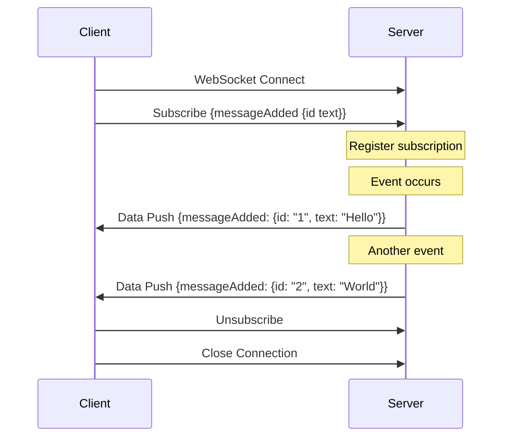
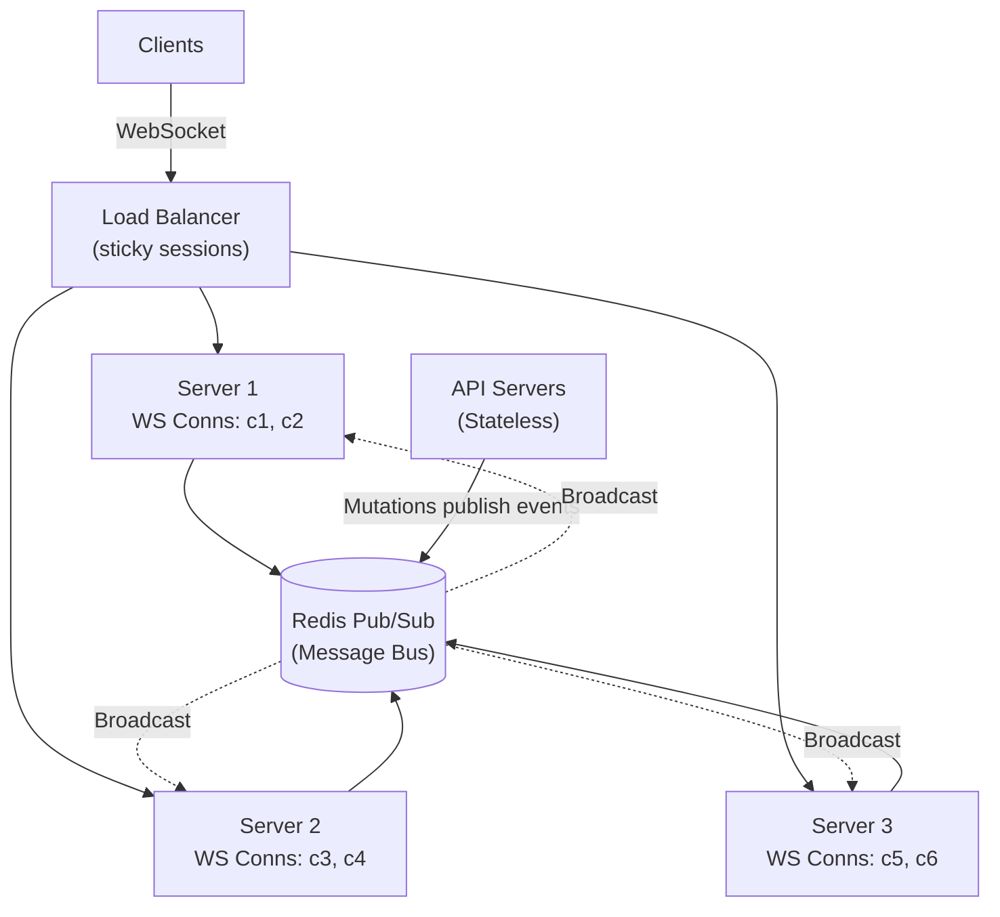

# Subscriptions and Real-Time

## TL;DR

GraphQL subscriptions enable real-time data streaming from server to client over persistent connections (typically WebSocket). Unlike queries and mutations, subscriptions maintain an open connection and push updates when events occur. Key considerations include connection management, scaling with pub/sub systems, authentication, and handling reconnection gracefully.

---

## Subscription Basics

### How Subscriptions Work



### Schema Definition

```graphql
type Subscription {
  # Simple subscription - receive all new messages
  messageAdded: Message!
  
  # Filtered subscription - only messages in specific channel
  messageAdded(channelId: ID!): Message!
  
  # Multiple event types
  postEvent: PostEvent!
  
  # User-specific notifications
  notificationReceived: Notification!
}

# Union for multiple event types
union PostEvent = PostCreated | PostUpdated | PostDeleted

type PostCreated {
  post: Post!
}

type PostUpdated {
  post: Post!
  updatedFields: [String!]!
}

type PostDeleted {
  postId: ID!
}

type Message {
  id: ID!
  text: String!
  author: User!
  channel: Channel!
  createdAt: DateTime!
}

type Notification {
  id: ID!
  type: NotificationType!
  message: String!
  link: String
  read: Boolean!
  createdAt: DateTime!
}
```

---

## Server Implementation

### Python (Ariadne + Starlette)

```python
from ariadne import SubscriptionType, make_executable_schema
from ariadne.asgi import GraphQL
from ariadne.asgi.handlers import GraphQLWSHandler
from starlette.applications import Starlette
import asyncio
from typing import AsyncGenerator

subscription = SubscriptionType()

# In-memory pub/sub for demo (use Redis in production)
class PubSub:
    def __init__(self):
        self.subscribers = {}
    
    async def publish(self, channel: str, message: dict):
        if channel in self.subscribers:
            for queue in self.subscribers[channel]:
                await queue.put(message)
    
    async def subscribe(self, channel: str) -> AsyncGenerator:
        queue = asyncio.Queue()
        
        if channel not in self.subscribers:
            self.subscribers[channel] = []
        self.subscribers[channel].append(queue)
        
        try:
            while True:
                message = await queue.get()
                yield message
        finally:
            self.subscribers[channel].remove(queue)

pubsub = PubSub()

@subscription.source("messageAdded")
async def message_added_source(_, info, channelId: str = None):
    """Generator that yields messages"""
    channel = f"messages:{channelId}" if channelId else "messages:*"
    
    async for message in pubsub.subscribe(channel):
        yield message

@subscription.field("messageAdded")
def message_added_resolver(message, info, channelId: str = None):
    """Transform the message before sending to client"""
    return message

# Publishing from mutations
@mutation.field("sendMessage")
async def send_message(_, info, channelId: str, text: str):
    user = info.context["user"]
    
    message = {
        "id": str(uuid4()),
        "text": text,
        "author": user,
        "channelId": channelId,
        "createdAt": datetime.utcnow().isoformat()
    }
    
    # Save to database
    await info.context["db"].messages.insert_one(message)
    
    # Publish to subscribers
    await pubsub.publish(f"messages:{channelId}", message)
    
    return message

# Create ASGI app with WebSocket support
schema = make_executable_schema(type_defs, [query, mutation, subscription])
app = GraphQL(
    schema,
    websocket_handler=GraphQLWSHandler(),
)
```

### Node.js (Apollo Server)

```javascript
const { ApolloServer } = require('@apollo/server');
const { expressMiddleware } = require('@apollo/server/express4');
const { makeExecutableSchema } = require('@graphql-tools/schema');
const { WebSocketServer } = require('ws');
const { useServer } = require('graphql-ws/lib/use/ws');
const { PubSub } = require('graphql-subscriptions');
const express = require('express');
const { createServer } = require('http');

const pubsub = new PubSub();

const typeDefs = `
  type Query {
    messages(channelId: ID!): [Message!]!
  }
  
  type Mutation {
    sendMessage(channelId: ID!, text: String!): Message!
  }
  
  type Subscription {
    messageAdded(channelId: ID!): Message!
  }
  
  type Message {
    id: ID!
    text: String!
    authorId: ID!
    channelId: ID!
  }
`;

const resolvers = {
  Query: {
    messages: async (_, { channelId }, context) => {
      return context.db.messages.findByChannelId(channelId);
    },
  },
  
  Mutation: {
    sendMessage: async (_, { channelId, text }, context) => {
      const message = await context.db.messages.create({
        channelId,
        text,
        authorId: context.user.id,
      });
      
      // Publish to subscription
      pubsub.publish(`MESSAGE_ADDED_${channelId}`, {
        messageAdded: message,
      });
      
      return message;
    },
  },
  
  Subscription: {
    messageAdded: {
      subscribe: (_, { channelId }) => {
        return pubsub.asyncIterator(`MESSAGE_ADDED_${channelId}`);
      },
    },
  },
};

// Setup server with WebSocket
async function startServer() {
  const app = express();
  const httpServer = createServer(app);
  
  const schema = makeExecutableSchema({ typeDefs, resolvers });
  
  // WebSocket server for subscriptions
  const wsServer = new WebSocketServer({
    server: httpServer,
    path: '/graphql',
  });
  
  const serverCleanup = useServer(
    {
      schema,
      context: async (ctx) => {
        // Authenticate WebSocket connection
        const token = ctx.connectionParams?.authToken;
        const user = await authenticateToken(token);
        return { user, db: database };
      },
    },
    wsServer
  );
  
  // Apollo Server for queries/mutations
  const server = new ApolloServer({
    schema,
    plugins: [
      {
        async serverWillStart() {
          return {
            async drainServer() {
              await serverCleanup.dispose();
            },
          };
        },
      },
    ],
  });
  
  await server.start();
  
  app.use(
    '/graphql',
    express.json(),
    expressMiddleware(server, {
      context: async ({ req }) => ({
        user: await authenticateRequest(req),
        db: database,
      }),
    })
  );
  
  httpServer.listen(4000);
}
```

---

## Scaling Subscriptions

### Redis Pub/Sub

```python
import aioredis
import json
from typing import AsyncGenerator

class RedisPubSub:
    """Distributed pub/sub using Redis"""
    
    def __init__(self, redis_url: str):
        self.redis_url = redis_url
        self.redis = None
    
    async def connect(self):
        self.redis = await aioredis.from_url(self.redis_url)
    
    async def publish(self, channel: str, message: dict):
        """Publish message to Redis channel"""
        await self.redis.publish(channel, json.dumps(message))
    
    async def subscribe(self, channel: str) -> AsyncGenerator:
        """Subscribe to Redis channel"""
        pubsub = self.redis.pubsub()
        await pubsub.subscribe(channel)
        
        try:
            async for message in pubsub.listen():
                if message["type"] == "message":
                    yield json.loads(message["data"])
        finally:
            await pubsub.unsubscribe(channel)

# Pattern subscription for wildcards
async def subscribe_pattern(self, pattern: str) -> AsyncGenerator:
    """Subscribe to channels matching pattern"""
    pubsub = self.redis.pubsub()
    await pubsub.psubscribe(pattern)
    
    try:
        async for message in pubsub.listen():
            if message["type"] == "pmessage":
                yield {
                    "channel": message["channel"].decode(),
                    "data": json.loads(message["data"])
                }
    finally:
        await pubsub.punsubscribe(pattern)

# Usage in subscription resolver
redis_pubsub = RedisPubSub("redis://localhost:6379")

@subscription.source("messageAdded")
async def message_added_source(_, info, channelId: str):
    async for message in redis_pubsub.subscribe(f"chat:{channelId}"):
        yield message
```

### Architecture for Scale



**Flow:** 1. Mutation on any API server publishes to Redis. 2. Redis broadcasts to all subscription servers. 3. Each server pushes to its connected clients.

### Connection Management

```python
from dataclasses import dataclass, field
from typing import Dict, Set
import asyncio

@dataclass
class Connection:
    id: str
    user_id: str
    subscriptions: Set[str] = field(default_factory=set)
    websocket: any = None
    created_at: datetime = field(default_factory=datetime.utcnow)

class ConnectionManager:
    """Manage WebSocket connections and subscriptions"""
    
    def __init__(self):
        self.connections: Dict[str, Connection] = {}
        self.user_connections: Dict[str, Set[str]] = {}  # user_id -> connection_ids
        self.subscription_connections: Dict[str, Set[str]] = {}  # channel -> connection_ids
    
    async def connect(self, connection_id: str, user_id: str, websocket):
        """Register new connection"""
        conn = Connection(
            id=connection_id,
            user_id=user_id,
            websocket=websocket
        )
        self.connections[connection_id] = conn
        
        if user_id not in self.user_connections:
            self.user_connections[user_id] = set()
        self.user_connections[user_id].add(connection_id)
        
        return conn
    
    async def disconnect(self, connection_id: str):
        """Clean up connection"""
        if connection_id not in self.connections:
            return
        
        conn = self.connections[connection_id]
        
        # Remove from user connections
        if conn.user_id in self.user_connections:
            self.user_connections[conn.user_id].discard(connection_id)
        
        # Remove from all subscription channels
        for channel in conn.subscriptions:
            if channel in self.subscription_connections:
                self.subscription_connections[channel].discard(connection_id)
        
        del self.connections[connection_id]
    
    async def subscribe(self, connection_id: str, channel: str):
        """Subscribe connection to channel"""
        if connection_id not in self.connections:
            return
        
        conn = self.connections[connection_id]
        conn.subscriptions.add(channel)
        
        if channel not in self.subscription_connections:
            self.subscription_connections[channel] = set()
        self.subscription_connections[channel].add(connection_id)
    
    async def unsubscribe(self, connection_id: str, channel: str):
        """Unsubscribe connection from channel"""
        if connection_id not in self.connections:
            return
        
        conn = self.connections[connection_id]
        conn.subscriptions.discard(channel)
        
        if channel in self.subscription_connections:
            self.subscription_connections[channel].discard(connection_id)
    
    async def broadcast(self, channel: str, message: dict):
        """Send message to all connections subscribed to channel"""
        if channel not in self.subscription_connections:
            return
        
        connection_ids = list(self.subscription_connections[channel])
        
        async def send_to_connection(conn_id):
            if conn_id in self.connections:
                conn = self.connections[conn_id]
                try:
                    await conn.websocket.send_json(message)
                except Exception as e:
                    # Connection might be dead
                    await self.disconnect(conn_id)
        
        await asyncio.gather(*[
            send_to_connection(conn_id) 
            for conn_id in connection_ids
        ])
    
    async def send_to_user(self, user_id: str, message: dict):
        """Send message to all connections of a user"""
        if user_id not in self.user_connections:
            return
        
        for conn_id in self.user_connections[user_id]:
            if conn_id in self.connections:
                conn = self.connections[conn_id]
                try:
                    await conn.websocket.send_json(message)
                except Exception:
                    await self.disconnect(conn_id)
```

---

## Authentication

### Connection Authentication

```python
from graphql import GraphQLError

async def on_websocket_connect(websocket, connection_params):
    """Authenticate WebSocket connection"""
    auth_token = connection_params.get("authToken")
    
    if not auth_token:
        raise GraphQLError("Missing authentication token")
    
    try:
        user = await verify_jwt_token(auth_token)
        return {"user": user}
    except InvalidTokenError:
        raise GraphQLError("Invalid authentication token")

# In subscription resolver
@subscription.source("notificationReceived")
async def notification_source(_, info):
    user = info.context.get("user")
    
    if not user:
        raise GraphQLError("Authentication required")
    
    # Subscribe to user's notifications channel
    async for notification in pubsub.subscribe(f"notifications:{user['id']}"):
        yield notification
```

### Authorization Checks

```python
@subscription.source("channelMessages")
async def channel_messages_source(_, info, channelId: str):
    user = info.context.get("user")
    
    if not user:
        raise GraphQLError("Authentication required")
    
    # Check if user has access to channel
    has_access = await check_channel_access(user["id"], channelId)
    if not has_access:
        raise GraphQLError("Access denied to this channel")
    
    async for message in pubsub.subscribe(f"channel:{channelId}"):
        # Double-check on each message (in case access was revoked)
        if await check_channel_access(user["id"], channelId):
            yield message
        else:
            # Stop subscription if access revoked
            break
```

---

## Client Implementation

### Apollo Client

```javascript
import { 
  ApolloClient, 
  InMemoryCache, 
  split,
  HttpLink 
} from '@apollo/client';
import { GraphQLWsLink } from '@apollo/client/link/subscriptions';
import { createClient } from 'graphql-ws';
import { getMainDefinition } from '@apollo/client/utilities';

// HTTP link for queries and mutations
const httpLink = new HttpLink({
  uri: '/graphql',
  headers: {
    authorization: `Bearer ${getAuthToken()}`,
  },
});

// WebSocket link for subscriptions
const wsLink = new GraphQLWsLink(
  createClient({
    url: 'ws://localhost:4000/graphql',
    connectionParams: {
      authToken: getAuthToken(),
    },
    // Reconnection handling
    retryAttempts: 5,
    shouldRetry: (error) => true,
    on: {
      connected: () => console.log('WebSocket connected'),
      closed: () => console.log('WebSocket closed'),
      error: (error) => console.error('WebSocket error:', error),
    },
  })
);

// Split based on operation type
const splitLink = split(
  ({ query }) => {
    const definition = getMainDefinition(query);
    return (
      definition.kind === 'OperationDefinition' &&
      definition.operation === 'subscription'
    );
  },
  wsLink,
  httpLink
);

const client = new ApolloClient({
  link: splitLink,
  cache: new InMemoryCache(),
});

// React component using subscription
function ChatRoom({ channelId }) {
  const { data, loading } = useSubscription(MESSAGE_ADDED, {
    variables: { channelId },
    onData: ({ data }) => {
      // Handle new message
      console.log('New message:', data.messageAdded);
    },
  });
  
  return (
    <div>
      {data?.messageAdded && (
        <Message message={data.messageAdded} />
      )}
    </div>
  );
}

// With subscribeToMore for updating query results
function Messages({ channelId }) {
  const { data, subscribeToMore } = useQuery(GET_MESSAGES, {
    variables: { channelId },
  });
  
  useEffect(() => {
    const unsubscribe = subscribeToMore({
      document: MESSAGE_ADDED,
      variables: { channelId },
      updateQuery: (prev, { subscriptionData }) => {
        if (!subscriptionData.data) return prev;
        
        const newMessage = subscriptionData.data.messageAdded;
        return {
          ...prev,
          messages: [newMessage, ...prev.messages],
        };
      },
    });
    
    return () => unsubscribe();
  }, [channelId, subscribeToMore]);
  
  return (
    <ul>
      {data?.messages.map(msg => (
        <li key={msg.id}>{msg.text}</li>
      ))}
    </ul>
  );
}
```

### Reconnection Handling

```javascript
import { createClient } from 'graphql-ws';

const client = createClient({
  url: 'ws://localhost:4000/graphql',
  connectionParams: () => ({
    authToken: getAuthToken(),  // Fresh token on reconnect
  }),
  
  // Retry configuration
  retryAttempts: Infinity,
  retryWait: async (retries) => {
    // Exponential backoff with jitter
    const baseDelay = 1000;
    const maxDelay = 30000;
    const delay = Math.min(
      baseDelay * Math.pow(2, retries) + Math.random() * 1000,
      maxDelay
    );
    await new Promise(resolve => setTimeout(resolve, delay));
  },
  
  // Lazy connection - only connect when subscriptions are made
  lazy: true,
  
  // Keep connection alive
  keepAlive: 10000,  // Ping every 10 seconds
  
  on: {
    connected: (socket) => {
      console.log('Connected to WebSocket');
    },
    closed: (event) => {
      console.log('WebSocket closed:', event.reason);
    },
    error: (error) => {
      console.error('WebSocket error:', error);
    },
    connecting: () => {
      console.log('Connecting to WebSocket...');
    },
  },
});

// Handle subscription with error recovery
function useReconnectingSubscription(subscription, options) {
  const [data, setData] = useState(null);
  const [error, setError] = useState(null);
  
  useEffect(() => {
    let unsubscribe;
    
    const subscribe = () => {
      unsubscribe = client.subscribe(
        { query: subscription, variables: options.variables },
        {
          next: (result) => {
            setData(result.data);
            setError(null);
          },
          error: (err) => {
            setError(err);
            // Reconnect attempt will happen automatically
          },
          complete: () => {
            console.log('Subscription completed');
          },
        }
      );
    };
    
    subscribe();
    
    return () => {
      if (unsubscribe) unsubscribe();
    };
  }, [subscription, JSON.stringify(options.variables)]);
  
  return { data, error };
}
```

---

## Live Queries (Alternative to Subscriptions)

### Concept

| | Subscriptions | Live Queries |
|---|---|---|
| Approach | Client subscribes to events | Client subscribes to query |
| Data flow | Server pushes event data | Server re-runs query on change |
| Cache | Client manages cache | Automatic cache sync |
| **Pros** | Fine-grained control, lower bandwidth, standard spec | Simpler client code, automatic cache sync, always fresh |
| **Cons** | Client manages cache, complex logic, event design overhead | Higher server load, not standard spec, bandwidth intensive |

### Simple Live Query Implementation

```python
from typing import Set, Dict
import asyncio

class LiveQueryStore:
    """Track live query subscriptions and invalidate on data changes"""
    
    def __init__(self):
        # Map: query_hash -> set of connection_ids
        self.subscriptions: Dict[str, Set[str]] = {}
        # Map: entity_key -> set of query_hashes
        self.dependencies: Dict[str, Set[str]] = {}
    
    def register_query(
        self, 
        connection_id: str, 
        query_hash: str, 
        dependencies: Set[str]
    ):
        """Register a live query with its data dependencies"""
        if query_hash not in self.subscriptions:
            self.subscriptions[query_hash] = set()
        self.subscriptions[query_hash].add(connection_id)
        
        # Track which entities this query depends on
        for dep in dependencies:
            if dep not in self.dependencies:
                self.dependencies[dep] = set()
            self.dependencies[dep].add(query_hash)
    
    async def invalidate(self, entity_key: str):
        """Invalidate queries that depend on changed entity"""
        if entity_key not in self.dependencies:
            return
        
        affected_queries = self.dependencies[entity_key]
        
        for query_hash in affected_queries:
            if query_hash in self.subscriptions:
                # Re-run query and push to subscribers
                await self.refresh_query(query_hash)
    
    async def refresh_query(self, query_hash: str):
        """Re-execute query and push results"""
        connections = self.subscriptions.get(query_hash, set())
        
        for conn_id in connections:
            # Re-run the original query
            result = await execute_query(query_hash)
            await send_to_connection(conn_id, result)

# Usage in mutation
@mutation.field("updateMessage")
async def update_message(_, info, id: str, text: str):
    await info.context["db"].messages.update_one(
        {"_id": id},
        {"$set": {"text": text}}
    )
    
    # Invalidate live queries watching this message
    await live_query_store.invalidate(f"Message:{id}")
    
    return await info.context["message_loader"].load(id)
```

---

## Best Practices

### Design Guidelines

```
□ Use subscriptions for discrete events, not state sync
□ Keep subscription payloads small (just the changed data)
□ Include enough context for client to update cache
□ Consider union types for multiple event types
□ Document subscription payload structure clearly
```

### Performance

```
□ Use Redis pub/sub for horizontal scaling
□ Implement connection limits per user
□ Add rate limiting for subscription operations
□ Monitor connection counts and message throughput
□ Implement heartbeat/keepalive for connection health
```

### Reliability

```
□ Handle reconnection gracefully on client
□ Persist critical events during disconnection
□ Implement catch-up mechanism for missed events
□ Add subscription-level error handling
□ Log and monitor subscription failures
```

### Security

```
□ Authenticate WebSocket connections
□ Authorize each subscription channel
□ Re-verify authorization periodically
□ Implement subscription throttling
□ Validate subscription arguments
```

---

## References

- [GraphQL Subscriptions Spec](https://spec.graphql.org/draft/#sec-Subscription)
- [graphql-ws Protocol](https://github.com/enisdenjo/graphql-ws/blob/master/PROTOCOL.md)
- [Apollo Subscriptions](https://www.apollographql.com/docs/react/data/subscriptions/)
- [Scaling GraphQL Subscriptions (Hasura)](https://hasura.io/blog/scaling-graphql-subscriptions/)
- [Live Queries (Relay)](https://relay.dev/docs/guided-tour/updating-data/graphql-subscriptions/)
