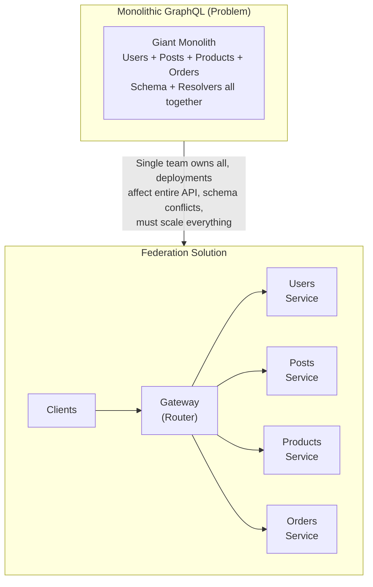
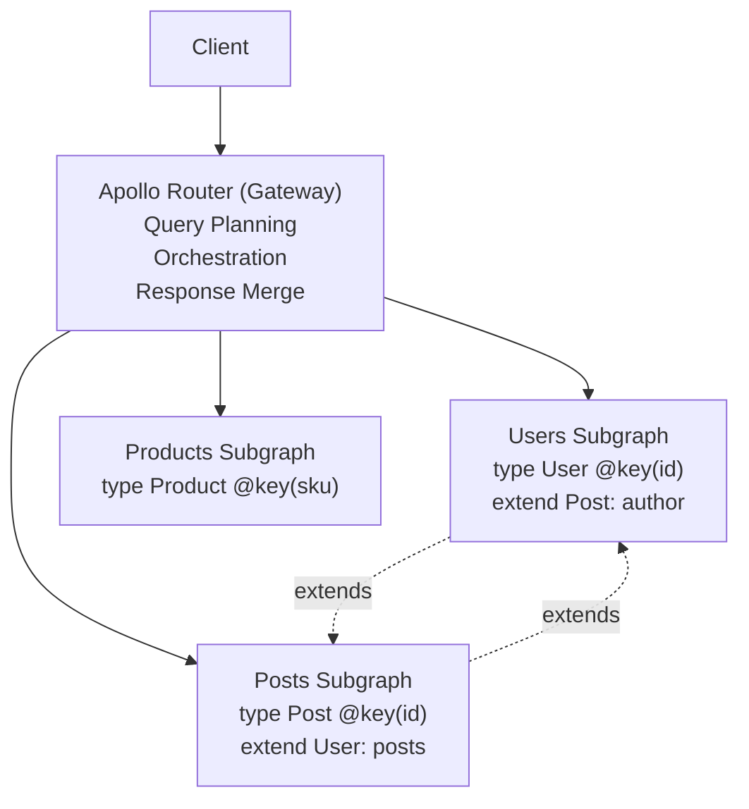
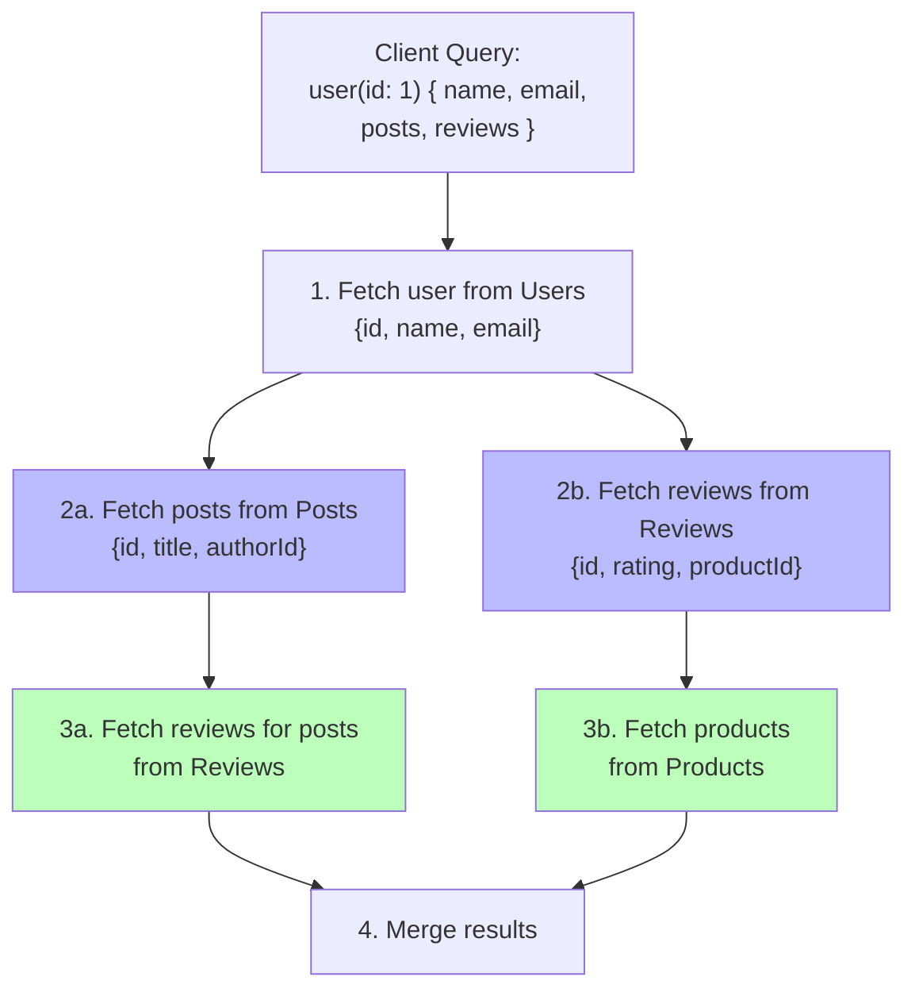
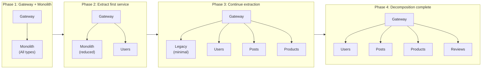

# Federation and Microservices

## TL;DR

GraphQL Federation allows multiple GraphQL services to compose into a single unified graph. Each service owns its portion of the schema and can extend types from other services. Apollo Federation is the most mature implementation, using a gateway (router) to orchestrate queries across services. This enables teams to work independently while providing a seamless API to clients.

---

## The Problem Federation Solves

### Monolithic GraphQL Challenges



---

## Apollo Federation Concepts

### Architecture Overview



Each subgraph: owns its types, can extend other types, deployed independently, different teams/languages

### Key Directives

```graphql
# @key - Defines the entity's primary key for cross-service references
type User @key(fields: "id") {
  id: ID!
  name: String!
  email: String!
}

# Multiple keys supported
type Product @key(fields: "id") @key(fields: "sku") {
  id: ID!
  sku: String!
  name: String!
  price: Float!
}

# @external - Field is defined in another subgraph
type User @key(fields: "id") {
  id: ID!
  # These fields come from Users subgraph
  name: String! @external
}

# @requires - This field needs external fields to resolve
type User @key(fields: "id") {
  id: ID!
  name: String! @external
  
  # Needs name from Users service to compute
  greeting: String! @requires(fields: "name")
}

# @provides - Specifies fields this resolver will return
type Review @key(fields: "id") {
  id: ID!
  body: String!
  
  # This resolver provides author.name
  author: User! @provides(fields: "name")
}

# @shareable - Field can be resolved by multiple subgraphs
type Product @key(fields: "id") {
  id: ID!
  name: String! @shareable
  price: Float!
}

# @inaccessible - Hide field from composed schema
type User @key(fields: "id") {
  id: ID!
  name: String!
  internalId: String! @inaccessible  # Not exposed to clients
}

# @override - Take ownership of a field from another subgraph
type Product @key(fields: "id") {
  id: ID!
  name: String!
  
  # Products service now owns this field
  inventory: Int! @override(from: "inventory")
}
```

---

## Implementing Subgraphs

### Users Subgraph

```javascript
// users-subgraph/schema.graphql
const { gql } = require('apollo-server');
const { buildSubgraphSchema } = require('@apollo/subgraph');

const typeDefs = gql`
  extend schema @link(
    url: "https://specs.apollo.dev/federation/v2.0"
    import: ["@key", "@shareable"]
  )

  type Query {
    me: User
    user(id: ID!): User
    users: [User!]!
  }

  type Mutation {
    createUser(input: CreateUserInput!): User!
    updateUser(id: ID!, input: UpdateUserInput!): User!
  }

  type User @key(fields: "id") {
    id: ID!
    name: String!
    email: String!
    avatar: String
    createdAt: DateTime!
  }

  input CreateUserInput {
    name: String!
    email: String!
  }

  input UpdateUserInput {
    name: String
    email: String
    avatar: String
  }
`;

const resolvers = {
  Query: {
    me: (_, __, context) => context.dataSources.users.getUser(context.userId),
    user: (_, { id }, context) => context.dataSources.users.getUser(id),
    users: (_, __, context) => context.dataSources.users.getAllUsers(),
  },
  
  Mutation: {
    createUser: (_, { input }, context) => 
      context.dataSources.users.createUser(input),
    updateUser: (_, { id, input }, context) => 
      context.dataSources.users.updateUser(id, input),
  },
  
  User: {
    // Reference resolver - called when another subgraph needs User
    __resolveReference: (user, context) => {
      return context.dataSources.users.getUser(user.id);
    },
  },
};

const server = new ApolloServer({
  schema: buildSubgraphSchema({ typeDefs, resolvers }),
});
```

### Posts Subgraph (Extends User)

```javascript
// posts-subgraph/schema.graphql
const typeDefs = gql`
  extend schema @link(
    url: "https://specs.apollo.dev/federation/v2.0"
    import: ["@key", "@external", "@requires"]
  )

  type Query {
    post(id: ID!): Post
    posts(authorId: ID): [Post!]!
    feed(first: Int, after: String): PostConnection!
  }

  type Mutation {
    createPost(input: CreatePostInput!): Post!
    deletePost(id: ID!): Boolean!
  }

  type Post @key(fields: "id") {
    id: ID!
    title: String!
    content: String!
    authorId: ID!
    createdAt: DateTime!
    
    # Reference to User entity (resolved by Users subgraph)
    author: User!
  }

  # Extend User type defined in Users subgraph
  extend type User @key(fields: "id") {
    id: ID! @external
    
    # Add posts field to User
    posts: [Post!]!
  }

  type PostConnection {
    edges: [PostEdge!]!
    pageInfo: PageInfo!
  }

  type PostEdge {
    node: Post!
    cursor: String!
  }

  input CreatePostInput {
    title: String!
    content: String!
  }
`;

const resolvers = {
  Query: {
    post: (_, { id }, context) => 
      context.dataSources.posts.getPost(id),
    posts: (_, { authorId }, context) => 
      authorId 
        ? context.dataSources.posts.getPostsByAuthor(authorId)
        : context.dataSources.posts.getAllPosts(),
  },
  
  Mutation: {
    createPost: (_, { input }, context) => 
      context.dataSources.posts.createPost({
        ...input,
        authorId: context.userId,
      }),
  },
  
  Post: {
    __resolveReference: (post, context) => 
      context.dataSources.posts.getPost(post.id),
    
    // Return reference to User (gateway will resolve)
    author: (post) => ({ __typename: 'User', id: post.authorId }),
  },
  
  // Resolver for extended User type
  User: {
    posts: (user, _, context) => 
      context.dataSources.posts.getPostsByAuthor(user.id),
  },
};
```

### Reviews Subgraph (Extends Product and User)

```javascript
const typeDefs = gql`
  extend schema @link(
    url: "https://specs.apollo.dev/federation/v2.0"
    import: ["@key", "@external", "@provides"]
  )

  type Query {
    reviews(productId: ID!): [Review!]!
  }

  type Mutation {
    createReview(input: CreateReviewInput!): Review!
  }

  type Review @key(fields: "id") {
    id: ID!
    rating: Int!
    body: String!
    createdAt: DateTime!
    
    # References
    author: User!
    product: Product!
  }

  # Extend Product from Products subgraph
  extend type Product @key(fields: "id") {
    id: ID! @external
    
    reviews: [Review!]!
    averageRating: Float
  }

  # Extend User from Users subgraph
  extend type User @key(fields: "id") {
    id: ID! @external
    
    reviews: [Review!]!
  }

  input CreateReviewInput {
    productId: ID!
    rating: Int!
    body: String!
  }
`;

const resolvers = {
  Query: {
    reviews: (_, { productId }, context) =>
      context.dataSources.reviews.getReviewsForProduct(productId),
  },
  
  Mutation: {
    createReview: (_, { input }, context) =>
      context.dataSources.reviews.createReview({
        ...input,
        authorId: context.userId,
      }),
  },
  
  Review: {
    __resolveReference: (review, context) =>
      context.dataSources.reviews.getReview(review.id),
    
    author: (review) => ({ __typename: 'User', id: review.authorId }),
    product: (review) => ({ __typename: 'Product', id: review.productId }),
  },
  
  Product: {
    reviews: (product, _, context) =>
      context.dataSources.reviews.getReviewsForProduct(product.id),
    
    averageRating: async (product, _, context) => {
      const reviews = await context.dataSources.reviews
        .getReviewsForProduct(product.id);
      if (!reviews.length) return null;
      const sum = reviews.reduce((acc, r) => acc + r.rating, 0);
      return sum / reviews.length;
    },
  },
  
  User: {
    reviews: (user, _, context) =>
      context.dataSources.reviews.getReviewsByAuthor(user.id),
  },
};
```

---

## Gateway (Router) Setup

### Apollo Router

```yaml
# router.yaml
supergraph:
  introspection: true
  listen: 0.0.0.0:4000

# Subgraph configuration
override_subgraph_url:
  users: http://users-service:4001/graphql
  posts: http://posts-service:4002/graphql
  reviews: http://reviews-service:4003/graphql
  products: http://products-service:4004/graphql

# Headers propagation
headers:
  all:
    request:
      - propagate:
          named: authorization
      - propagate:
          named: x-request-id

# Caching
cache:
  redis:
    urls:
      - redis://redis:6379

# Rate limiting
limits:
  max_depth: 15
  max_height: 200

# Telemetry
telemetry:
  tracing:
    otlp:
      endpoint: http://jaeger:4317
```

### Supergraph Composition

```bash
# Install rover CLI
npm install -g @apollo/rover

# Compose supergraph from subgraph schemas
rover supergraph compose --config ./supergraph.yaml > supergraph.graphql

# supergraph.yaml
federation_version: =2.3.1
subgraphs:
  users:
    routing_url: http://users-service:4001/graphql
    schema:
      file: ./users/schema.graphql
  posts:
    routing_url: http://posts-service:4002/graphql
    schema:
      file: ./posts/schema.graphql
  reviews:
    routing_url: http://reviews-service:4003/graphql
    schema:
      file: ./reviews/schema.graphql
  products:
    routing_url: http://products-service:4004/graphql
    schema:
      file: ./products/schema.graphql
```

### Managed Federation (Apollo Studio)

```javascript
// Publish schema to Apollo Studio
// Each subgraph publishes independently

// In CI/CD for users-subgraph:
// rover subgraph publish my-graph@production \
//   --name users \
//   --schema ./schema.graphql \
//   --routing-url http://users-service:4001/graphql

// Router fetches composed supergraph from Apollo Studio
// router.yaml
apollo:
  graph_ref: my-graph@production

// Benefits:
// - Schema validation before deploy
// - Schema change history
// - Breaking change detection
// - Composition errors caught early
```

---

## Query Execution

### Query Planning



### Entity Resolution

```javascript
// When gateway needs to resolve User reference from Posts subgraph

// 1. Posts subgraph returns:
{
  "posts": [
    { "id": "1", "title": "Hello", "author": { "__typename": "User", "id": "100" } }
  ]
}

// 2. Gateway sends _entities query to Users subgraph:
query {
  _entities(representations: [
    { "__typename": "User", "id": "100" }
  ]) {
    ... on User {
      id
      name
      email
    }
  }
}

// 3. Users subgraph __resolveReference is called:
User: {
  __resolveReference: (ref, context) => {
    // ref = { __typename: "User", id: "100" }
    return context.dataSources.users.getUser(ref.id);
  }
}

// 4. Gateway merges response:
{
  "posts": [
    { 
      "id": "1", 
      "title": "Hello", 
      "author": { "id": "100", "name": "Alice", "email": "alice@example.com" }
    }
  ]
}
```

---

## Migration Strategy

### Incremental Adoption



### Using @override for Migration

```graphql
# Step 1: Original in Monolith
# monolith/schema.graphql
type Product @key(fields: "id") {
  id: ID!
  name: String!
  price: Float!
  inventory: Int!  # Currently in monolith
}

# Step 2: New Inventory service takes over
# inventory/schema.graphql
type Product @key(fields: "id") {
  id: ID! @external
  
  # Take ownership from monolith
  inventory: Int! @override(from: "monolith")
}

# Step 3: Remove from monolith after migration complete
# monolith/schema.graphql
type Product @key(fields: "id") {
  id: ID!
  name: String!
  price: Float!
  # inventory removed
}
```

---

## Error Handling

### Partial Responses

```javascript
// Gateway handles partial failures gracefully

// Query:
{
  user(id: "1") {
    name           # Users service
    posts {        # Posts service (fails)
      title
    }
    reviews {      # Reviews service
      rating
    }
  }
}

// Response with partial failure:
{
  "data": {
    "user": {
      "name": "Alice",
      "posts": null,        // Failed
      "reviews": [
        { "rating": 5 }
      ]
    }
  },
  "errors": [
    {
      "message": "Could not fetch posts",
      "path": ["user", "posts"],
      "extensions": {
        "code": "SUBGRAPH_ERROR",
        "serviceName": "posts"
      }
    }
  ]
}

// Client can display partial data with error notice
```

### Subgraph Health Checks

```javascript
// Health check endpoint in each subgraph
app.get('/health', async (req, res) => {
  const checks = {
    database: await checkDatabase(),
    cache: await checkCache(),
  };
  
  const healthy = Object.values(checks).every(c => c);
  
  res.status(healthy ? 200 : 503).json({
    status: healthy ? 'healthy' : 'unhealthy',
    checks,
  });
});

// Router health aggregation
// router.yaml
health_check:
  enabled: true
  path: /health
  subgraphs:
    - users
    - posts
    - products
```

---

## Performance Considerations

### Batching Entity Requests

```javascript
// Multiple entity references batched into single request

// Instead of:
// _entities(representations: [{id: "1"}])
// _entities(representations: [{id: "2"}])
// _entities(representations: [{id: "3"}])

// Gateway sends:
// _entities(representations: [{id: "1"}, {id: "2"}, {id: "3"}])

// Subgraph should use DataLoader pattern
User: {
  __resolveReference: async (ref, context) => {
    // Uses DataLoader to batch
    return context.loaders.users.load(ref.id);
  }
}
```

### Query Plan Caching

```yaml
# router.yaml
# Cache query plans for repeated queries
query_planning:
  cache:
    in_memory:
      limit: 1000
    redis:
      urls:
        - redis://redis:6379
      ttl: 3600
```

### Deferred Execution

```graphql
# Use @defer for expensive cross-service fields
query GetUser {
  user(id: "1") {
    name
    email
    
    ... @defer {
      posts {
        title
        # Requires Posts service
      }
      reviews {
        rating
        # Requires Reviews service
      }
    }
  }
}
```

---

## Best Practices

### Schema Design

```
□ One entity per service (ownership clear)
□ Use @key on all entities
□ Prefer extending over sharing types
□ Keep entity references minimal
□ Document service boundaries
□ Version schema changes carefully
```

### Service Design

```
□ Each subgraph independently deployable
□ Use DataLoader in __resolveReference
□ Implement health checks
□ Handle partial failures gracefully
□ Log cross-service request traces
□ Monitor subgraph latencies
```

### Operational

```
□ Use managed federation for schema registry
□ Validate schema changes in CI
□ Monitor composition errors
□ Set up alerts for subgraph failures
□ Implement circuit breakers at gateway
□ Cache query plans and entity resolutions
```

---

## References

- [Apollo Federation Specification](https://www.apollographql.com/docs/federation/)
- [Apollo Router Documentation](https://www.apollographql.com/docs/router/)
- [Federation Subgraph Spec](https://www.apollographql.com/docs/federation/subgraph-spec/)
- [GraphQL Federation at Netflix](https://netflixtechblog.com/how-netflix-scales-its-api-with-graphql-federation-part-1-ae3557c187e2)
- [Migrating to Federation](https://www.apollographql.com/docs/federation/entities-advanced/)
