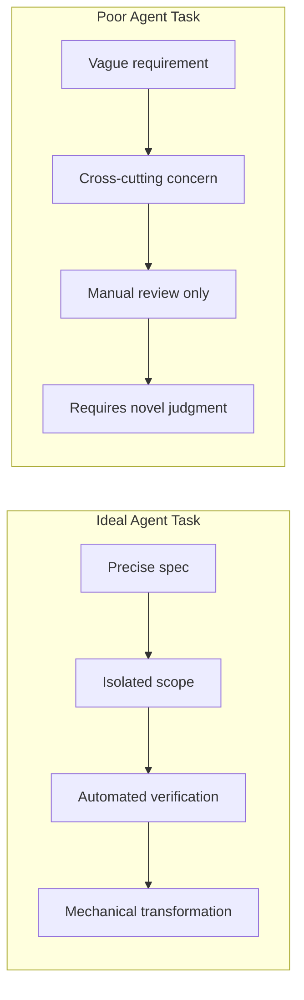
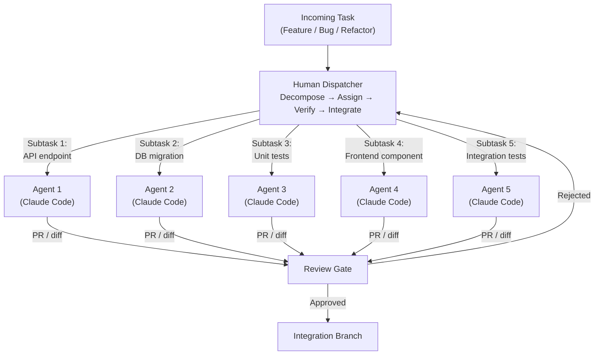
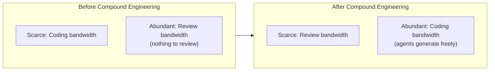
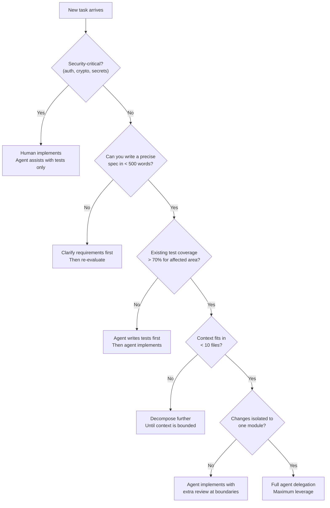
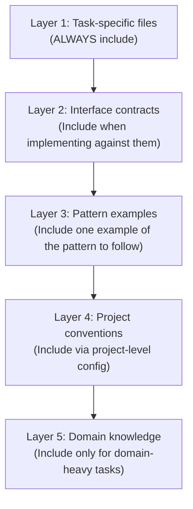

# Compound Engineering Fundamentals

## TL;DR

One staff engineer directing N AI agents in parallel compounds output non-linearly. The throughput ceiling shifts from individual coding speed to task decomposition quality and review bandwidth. This is a system design problem — you are designing a human-in-the-loop distributed system where the human is the scheduler, the agents are workers, and the bottleneck is verification. Treat it like you would any other architecture: identify constraints, optimize for throughput, and instrument for observability.

> **Cross-reference:** For general agent architecture, loops, and tool-use patterns, see [`16-llm-systems/01-agent-fundamentals.md`](../16-llm-systems/01-agent-fundamentals.md).

---

## The Paradigm Shift

### From "Write Code" to "Direct Code Generation"

The role of a senior/staff engineer is no longer "person who writes the most code." It is "person who decomposes problems so precisely that machines can implement them correctly." The leverage point moved:

| Era | Bottleneck | Leverage skill |
|-----|-----------|----------------|
| 1950s – Assembly | Machine instructions | Knowing opcodes |
| 1970s – Compilers | Translating intent to machine code | Language design |
| 2000s – Frameworks | Boilerplate, plumbing | API selection, glue code |
| 2020s – AI agents | Implementation | Task decomposition, review |

### Historical Analogy

Each transition followed the same pattern:

1. **Compiler invention** — Engineers stopped writing assembly. Initial resistance: "You can't trust generated machine code." Within a decade, hand-written assembly became the exception.
2. **Framework invention** — Engineers stopped writing boilerplate. Initial resistance: "Frameworks are too opinionated." Within a decade, hand-rolled HTTP servers became the exception.
3. **AI agents** — Engineers stop writing implementation. Current resistance: "You can't trust generated code." The pattern is identical.

The constant across all three transitions: **the engineer who understands the abstraction layer below can wield the abstraction layer above more effectively.** A staff engineer who deeply understands code can direct AI agents that write code far more effectively than someone who cannot code at all.

There is also a common misunderstanding at each transition: that the previous skill becomes obsolete. Compiler engineers still need to understand assembly for optimization. Framework users still need to understand HTTP for debugging. Compound engineers still need to understand code — deeply — to review, decompose, and integrate effectively. The skill does not become obsolete; it becomes the foundation for leverage at the next layer.

### The 10x Engineer Myth Becomes Real

The "10x engineer" was always somewhat mythical — individual typing speed and syntax knowledge have diminishing returns. But compound engineering changes the math:

```
Traditional:  output = skill × hours × 1 (single thread)
Compound:     output = decomposition_quality × agents × review_throughput
```

A staff engineer with strong decomposition skills running 5 agents in parallel genuinely produces 10-30x the output of a single engineer on suitable tasks [1]. The catch: "suitable tasks" is doing heavy lifting in that sentence.

---

## Productivity Multiplier Model

Not all tasks benefit equally from agent delegation. The multiplier depends on three axes:

1. **Specification clarity** — Can you describe the task unambiguously in a prompt?
2. **Verification cost** — How expensive is it to confirm correctness?
3. **Context requirement** — How much implicit knowledge is needed?

### Multiplier Table

| Task type | Multiplier | Why | Verification method |
|-----------|-----------|-----|---------------------|
| Greenfield feature | 3-5× | Clear spec, isolated scope, few implicit constraints | Tests, manual review |
| Refactoring | 5-10× | Mechanical transformation, well-defined input/output | Existing test suite, diff review |
| Test generation | 8-15× | Pattern-matching strength, specs are the tests themselves | Coverage metrics, mutation testing |
| Bug investigation | 2-3× | Needs deep context, non-obvious causality chains | Root cause confirmation |
| Architecture design | 1-1.5× | Judgment-intensive, trade-off heavy, needs organizational context | Peer review, experience |
| Security-critical code | 0.5-1× | High review cost negates speed gain, adversarial thinking required | Security audit, pen testing |

### Reading the Multipliers

A multiplier below 1× means the total time (generation + review + fix) exceeds manual implementation. Security-critical code often falls here because:

- Review cost for AI-generated crypto/auth code exceeds writing it yourself
- Subtle bugs (timing attacks, padding oracles) are invisible to casual review
- The blast radius of a missed bug is catastrophic

A multiplier above 5× signals tasks where the agent's speed advantage overwhelms review overhead. Test generation is the canonical example: the "spec" is the code under test, the verification is running the tests, and the pattern is highly repetitive.

### Compound Multiplier Formula

When running N agents in parallel on decomposed subtasks:

```
effective_multiplier = base_multiplier × min(N, decomposable_subtasks) × (1 - review_overhead)
```

Where:
- `base_multiplier` is from the table above
- `N` is the number of parallel agents
- `decomposable_subtasks` is how many truly independent pieces exist
- `review_overhead` is the fraction of time spent reviewing (typically 0.15–0.35)

**Example:** Generating tests for 10 independent modules with 5 agents:

```
effective = 10 × min(5, 10) × (1 - 0.20) = 10 × 5 × 0.80 = 40×
```

This is why test generation campaigns are the poster child for compound engineering.

---

## When Compound Engineering Works

Compound engineering delivers maximum value when the following conditions are met. Use this as a pre-flight checklist before spinning up parallel agents.

### Pre-Flight Checklist

```
✅ Clear interfaces     — Module boundaries are well-defined (API contracts, types, schemas)
✅ Good test coverage   — Existing tests act as correctness oracles for agent output
✅ Deterministic specs  — Requirements can be stated without ambiguity
✅ Isolated modules     — Changes don't cascade across the codebase
✅ Strong type system   — Compiler catches category errors in agent output
✅ CI/CD pipeline       — Automated verification on every agent-produced commit
✅ Linting/formatting   — Style consistency enforced mechanically, not by review
✅ Documented patterns  — Existing code examples the agent can reference
```

### Why Each Condition Matters

**Clear interfaces** — Agents operate on context windows. If a task requires understanding the entire codebase, the agent will hallucinate boundaries. Well-defined interfaces let you scope agent context to a single module.

**Good test coverage** — Tests are the cheapest verification mechanism. An agent that produces code passing 200 existing tests is dramatically more trustworthy than one producing code you must manually verify.

**Deterministic specs** — "Make it feel snappier" is not an agent-delegable task. "Reduce p95 latency of /api/search from 800ms to 200ms by adding a Redis cache with 5-minute TTL" is.

**Isolated modules** — If changing module A requires coordinated changes in B, C, and D, you cannot parallelize the work across agents. Isolation is a prerequisite for parallelism — same as in distributed systems.

### Ideal Task Profile



---

## When It Fails

Each failure mode has a distinct root cause. Understanding the root cause prevents the common mistake of blaming "AI limitations" when the real problem is task framing.

### Failure Mode 1: Implicit Conventions

**Symptom:** Agent-generated code is technically correct but violates team conventions.

**Root cause:** Conventions exist in tribal knowledge, not in code. The agent has no access to "we always use the repository pattern here" or "error messages must be customer-facing friendly."

**Example:**
```python
# Team convention (undocumented): all database queries go through the repository layer
# Agent generates:
class OrderService:
    def get_order(self, order_id: str):
        return db.session.query(Order).filter_by(id=order_id).first()  # Direct DB access

# Expected:
class OrderService:
    def __init__(self, order_repo: OrderRepository):
        self.order_repo = order_repo

    def get_order(self, order_id: str):
        return self.order_repo.find_by_id(order_id)
```

**Fix:** Encode conventions in linting rules, architectural decision records (ADRs), or `.cursorrules`/`CLAUDE.md`-style project instructions. If a convention cannot be mechanically enforced, it will be violated by agents.

### Failure Mode 2: Undocumented Invariants

**Symptom:** Agent-generated code breaks invariants that "everyone knows" but nobody wrote down.

**Root cause:** System invariants (e.g., "user.email is always lowercase," "timestamps are always UTC," "account IDs are globally unique across shards") live in engineers' heads.

**Example:**
```go
// Undocumented invariant: account IDs must be prefixed with region code
// Agent generates:
func CreateAccount(name string) Account {
    return Account{
        ID:   uuid.New().String(),  // Missing region prefix
        Name: name,
    }
}

// Expected:
func CreateAccount(name string, region string) Account {
    return Account{
        ID:   fmt.Sprintf("%s-%s", region, uuid.New().String()),
        Name: name,
    }
}
```

**Fix:** Invariants must be enforced at the type level or by validation layers. If an invariant is only enforced by code review, agents will miss it, and eventually humans will too.

### Failure Mode 3: Legacy Entanglement

**Symptom:** Agent-generated code works in isolation but breaks when integrated into the legacy system.

**Root cause:** Legacy systems accumulate implicit dependencies — execution order assumptions, shared mutable state, undocumented side effects. Agents cannot infer these from the code they are shown.

**Fix:** Before delegating work in a legacy codebase, invest in characterization tests. These tests capture actual system behavior (not intended behavior), giving agents a correctness oracle.

### Failure Mode 4: Security-Sensitive Paths

**Symptom:** Agent-generated auth/crypto code has subtle vulnerabilities.

**Root cause:** Security code requires adversarial thinking — reasoning about what an attacker would do. LLMs optimize for the common case, not the adversarial case. Timing attacks, TOCTOU races, and cryptographic misuse are systematically underweighted.

**Fix:** Never delegate security-critical implementations to agents without expert security review. The review cost typically exceeds the generation speed benefit, making the effective multiplier < 1×.

### Failure Mode Summary

| Failure mode | Root cause | Detection | Prevention |
|-------------|-----------|-----------|------------|
| Implicit conventions | Tribal knowledge | Code review catches it late | Codify in linting/project rules |
| Undocumented invariants | Informal contracts | Integration test failures | Type-level enforcement |
| Legacy entanglement | Hidden dependencies | Production incidents | Characterization tests |
| Security-sensitive paths | Non-adversarial optimization | Security audit (if you're lucky) | Keep security code human-written |

---

## The Dispatcher Mental Model

In compound engineering, the human operates as a **dispatcher** in a work-stealing scheduler [1]. You are not writing code — you are running a pipeline.

### The Dispatch Loop

```
1. INTAKE      — Receive feature/task/bug
2. DECOMPOSE   — Break into agent-sized subtasks with clear specs
3. ASSIGN      — Dispatch subtasks to parallel agents with scoped context
4. VERIFY      — Review agent output against specs, tests, and invariants
5. INTEGRATE   — Merge verified outputs, resolve cross-cutting concerns
6. REPEAT      — Feed integration issues back as new subtasks
```

### Dispatcher Architecture



### Decomposition Quality Is the Bottleneck

The entire system's throughput is bounded by decomposition quality. A poor decomposition creates:

- **Agent thrashing** — Tasks with unclear specs cause agents to produce wrong output, requiring multiple iterations
- **Integration hell** — Tasks with hidden dependencies produce output that conflicts at merge time
- **Review explosion** — Poorly scoped tasks produce large diffs that are expensive to review

A good decomposition has these properties:

| Property | Description | Test |
|----------|------------|------|
| **Atomic** | Each subtask produces a single, reviewable unit of work | Can you describe the expected output in one sentence? |
| **Independent** | Subtasks can execute in any order | Does completing subtask A require output from subtask B? |
| **Testable** | Each subtask has a verification mechanism | Can you write a test for it before the agent starts? |
| **Context-bounded** | The agent needs only a few files, not the whole repo | Can you list every file the agent needs to read? |

### Real-World Decomposition Example

**Task:** Add a new "Teams" feature to a SaaS application.

**Bad decomposition (1 agent, monolithic):**
```
"Add a Teams feature with CRUD operations, membership management,
 role-based access control, billing integration, and a React UI."
```

**Good decomposition (5 agents, parallelized):**

| Agent | Subtask | Input context | Output | Verification |
|-------|---------|--------------|--------|--------------|
| 1 | Database schema + migration for teams, memberships | Existing schema files, migration conventions | Migration file | Migration runs forward/backward cleanly |
| 2 | Team CRUD API endpoints | API conventions doc, auth middleware, Agent 1's schema | Route handlers + request/response types | API contract tests pass |
| 3 | Membership service (invite, join, leave, roles) | Agent 1's schema, RBAC patterns file | Service + unit tests | Unit tests pass, RBAC rules verified |
| 4 | React components for team management UI | Design system components, API types from Agent 2 | React components + stories | Storybook renders, snapshot tests pass |
| 5 | Integration tests for full team lifecycle | API endpoints from Agent 2, service from Agent 3 | Test suite | All integration tests green |

Note the dependency ordering: Agents 1 runs first (schema), then 2+3 in parallel, then 4+5 in parallel. The human sequences the waves.

### The Two-Agent Pattern

For long-running projects that span multiple sessions, Anthropic has converged on a proven two-agent pattern that separates project bootstrapping from incremental progress [2].

**Initializer Agent (first session):**

The initializer runs once to establish the project foundation:

- Sets up the project structure (directories, configs, boilerplate)
- Creates the **feature list** — critically, in JSON, not Markdown [2]. JSON is more resistant to model corruption across sessions:
  ```json
  [
    {"feature": "auth", "status": "failing", "tests": ["test_login", "test_logout"]},
    {"feature": "dashboard", "status": "not_started", "tests": ["test_render", "test_data_fetch"]},
    {"feature": "notifications", "status": "not_started", "tests": ["test_send", "test_preferences"]}
  ]
  ```
- Writes `init.sh` — a bootstrap script that subsequent sessions run to restore environment state
- Establishes baseline tests that must pass before any new work begins
- Creates `claude-progress.txt` as the inter-session log file [2]

**Coding Agent (subsequent sessions):**

Each coding session follows a deterministic startup sequence [2]:

1. `pwd` — confirm working directory
2. Read git logs — understand what changed since last session
3. Read `claude-progress.txt` — understand what was accomplished and what failed
4. Select the next feature from the JSON feature list (pick the first `not_started` or `failing` item)
5. Run `init.sh` — restore environment, install deps, verify toolchain
6. Run baseline tests — confirm nothing is broken before starting
7. Implement the selected feature
8. Update the feature list JSON and progress file
9. Commit with a clear message referencing the feature

**Why this works:**

The startup sequence eliminates the "cold start" problem. The agent does not need to re-discover project state — it reads structured artifacts that the previous session left behind. JSON feature lists prevent the drift that occurs when models edit Markdown checklists (checked items get unchecked, ordering shifts, duplicates appear).

**Key anti-pattern: "one-shotting."** Attempting to build an entire application in a single session is the most common failure mode [2]. Complex projects need multiple sessions with compounding progress. The two-agent pattern encodes this reality into the workflow — the initializer sets up for a marathon, not a sprint.

**Session continuity through artifacts:**

```
claude-progress.txt (append-only):
  [2026-03-14 09:00] Session started. Selected feature: auth
  [2026-03-14 09:15] Created auth middleware, login endpoint
  [2026-03-14 09:30] test_login passing, test_logout failing (session expiry bug)
  [2026-03-14 09:45] Session ended. Auth feature status: failing

  [2026-03-15 10:00] Session started. Selected feature: auth (retry)
  [2026-03-15 10:10] Fixed session expiry, both tests passing
  [2026-03-15 10:15] Updated feature list. Selected next: dashboard
```

This pattern scales to projects with 20+ features across dozens of sessions. The progress file becomes the project's ground truth — more reliable than git history alone because it captures intent, not just diffs.

---

## Cognitive Load Shift

Compound engineering does not reduce cognitive load — it shifts it. Understanding this shift is critical for adopting the model without burning out on the wrong activities.

### What Humans Stop Doing

| Activity | Why it's delegated | Residual human role |
|----------|-------------------|---------------------|
| Writing boilerplate | Mechanical, pattern-based | Specify the pattern once |
| Syntax lookup | Agents have full language knowledge | None |
| Writing unit tests | High pattern-matching, specs are code | Define test strategy, review edge cases |
| Implementing well-known algorithms | Textbook solutions, well-documented | Choose the right algorithm |
| Writing CRUD endpoints | Extremely formulaic | Define the resource model |
| CSS/styling from specs | Deterministic translation from design | Review visual output |

### What Humans Start Doing

| Activity | Why it's human-owned | Skill required |
|----------|---------------------|----------------|
| Task decomposition | Requires system-level understanding | Architecture, experience |
| Review and verification | Trust-but-verify on every agent output | Deep code reading |
| Integration orchestration | Cross-cutting concerns span agent boundaries | System thinking |
| Quality gates | Deciding "is this good enough" | Judgment, taste |
| Context curation | Selecting what the agent needs to see | Codebase knowledge |
| Failure mode analysis | Understanding why an agent produced wrong output | Debugging the prompt, not the code |

### The New Scarce Resource



**Review bandwidth** is now the system bottleneck. Implications:

1. **Batch reviews, don't trickle** — Review 5 agent PRs in a focused session, not one at a time between other tasks
2. **Invest in automated verification** — Every test you write is review bandwidth you recover permanently
3. **Create review checklists per task type** — Reduce review cognitive load through structure
4. **Use agents to review agents** — A second agent reviewing the first agent's output catches mechanical errors, freeing human review for judgment calls

### Cognitive Load Budget

A useful mental model: you have a fixed daily cognitive budget. Compound engineering lets you reallocate:

```
Traditional allocation:
  40% — Implementation (typing, syntax, debugging)
  25% — Design (architecture, API design)
  20% — Communication (PRs, docs, meetings)
  15% — Review (others' code)

Compound allocation:
  10% — Implementation (edge cases agents can't handle)
  20% — Design (architecture, decomposition)
  15% — Communication (PRs, docs, meetings)
  40% — Review (agent output, integration)
  15% — Orchestration (task dispatch, context curation)
```

The shift from 40% implementation to 40% review is the defining characteristic of compound engineering.

---

## Organizational Implications

Compound engineering is not just an individual productivity technique. At scale, it changes team structures, hiring profiles, cost models, and career ladders.

### Team Sizing Changes

**Before:** Teams sized by implementation capacity. A "two-pizza team" of 6-8 engineers handles a bounded set of services.

**After:** Teams can be smaller because each engineer has higher throughput. But the constraint shifts:

| Team size driver | Before | After |
|-----------------|--------|-------|
| Implementation throughput | 6-8 engineers | 2-3 engineers + agents |
| Review throughput | Not a bottleneck | Primary constraint |
| System understanding | Distributed across team | Must be concentrated |
| On-call coverage | Requires headcount | Unchanged (humans debug production) |

**Warning:** Shrinking teams aggressively is a trap. On-call, vacation coverage, and knowledge redundancy still require human headcount. Compound engineering primarily reduces the implementation bottleneck, not the operational one.

### Role Evolution

| Role | Traditional | Compound engineering era |
|------|------------|------------------------|
| Junior engineer | Writes simple features, learns patterns | Reviews agent output, learns by reading more code |
| Mid-level engineer | Implements features end-to-end | Orchestrates 2-3 agents, owns a module |
| Senior engineer | Designs systems, mentors | Designs decompositions, sets quality gates |
| Staff engineer | Defines architecture, influences org | Designs the compound engineering workflow itself |
| Engineering manager | Manages people, delivery | Manages human-agent system, API cost budgets |

### Cost Model Shifts

The cost equation changes fundamentally:

```
Traditional cost:
  total_cost = engineer_salary × headcount × time

Compound cost:
  total_cost = (engineer_salary × reduced_headcount × time) + (api_cost × tokens × agents)
```

Key differences:

| Dimension | Salary model | API model |
|-----------|-------------|-----------|
| Scaling | Linear with headcount | Pay-per-token, elastic |
| Idle cost | Full salary even when idle | Zero when not generating |
| Ramp-up time | 3-6 months for new hire | Instant (context in prompt) |
| Knowledge retention | Leaves with the person | Reproducible from docs + prompts |
| Marginal cost of one more task | Opportunity cost (displaces other work) | Direct cost (tokens) |

**Cost monitoring is now an engineering concern.** Track API spend per feature, per agent, per task type. Set budgets. Alert on anomalies. This is the same discipline as cloud cost management — and equally important.

### New Hiring Signals

| Traditional signal | Compound engineering signal |
|-------------------|---------------------------|
| Fast at coding challenges | Fast at reviewing code diffs |
| Deep knowledge of one language | Breadth across languages (agents are polyglot) |
| Can implement complex algorithms | Can decompose complex problems |
| Writes clean code from scratch | Identifies issues in generated code |
| Strong individual contributor | Strong orchestrator and reviewer |
| Years of experience writing code | Years of experience reading code |

This does not mean coding skill is irrelevant — far from it. You cannot review code you do not understand. You cannot decompose systems you have never built. Deep implementation experience is a prerequisite for effective compound engineering, not a replacement target.

### The Compound Loop

From Every.to's methodology comes a principle that elevates compound engineering from a productivity technique to a self-improving system: **each unit of engineering work should make subsequent units easier.** [1]

**The loop:**

```
Plan (80% of effort)
  → Work (20% of effort)
    → Review
      → Compound (feed learning back)
        → Plan (next iteration, now easier)
```

The counterintuitive ratio — 80% planning, 20% execution [1] — reflects the reality that agent execution is cheap but misdirected execution is expensive. A well-decomposed, well-specified task takes 10 minutes of agent time. A poorly specified one takes 10 minutes of agent time plus 45 minutes of human correction. The planning investment pays for itself on the first iteration and compounds on every subsequent one.

**Systematic documentation of learnings:**

Every bug, performance issue, and problem-solving insight encountered during agent-assisted work must be captured and fed back into the agent's context for future work [1]. This is not optional documentation — it is the compounding mechanism itself.

What to capture:

- **Failure patterns:** "Agent consistently forgets to add error handling for database timeouts. Add to CLAUDE.md checklist."
- **Effective prompts:** "Specifying the exact test file path in the prompt reduces iteration count from 3 to 1."
- **Architecture discoveries:** "The payments module has an undocumented dependency on the user session cache. Add to module dependency map."
- **Performance insights:** "Batch inserts over 1000 rows must use chunked transactions. Agent will default to single transaction without explicit instruction."

**Post-project retrospectives:**

After every significant project (not just sprints — individual multi-session projects), extract reusable patterns:

1. Which decomposition strategies worked? Which produced integration conflicts?
2. Which prompt patterns yielded first-try success? Which required iteration?
3. What context was missing that caused agent errors?
4. What new conventions emerged that should be codified?

**CLAUDE.md as living documentation:**

This is why project-level instruction files (`.claude/CLAUDE.md`, `.cursorrules`, etc.) should be treated as living documentation, updated after every project — not written once and forgotten. Each retrospective should produce at least one update to the project instructions. Over months, this file becomes a dense encoding of everything the agent needs to know about your codebase, written in the language of past mistakes. The compound loop turns every failure into a permanent improvement.

---

## Anti-Patterns

### 1. Vibe Coding Without Review

**Description:** Accepting agent output because it "looks right" without line-by-line review or test verification.

**Root cause:** Review fatigue. When agents produce large volumes of code, the temptation to skim-approve is strong.

**Consequence:** Subtle bugs accumulate. Technical debt compounds. Eventually, a production incident traces back to unreviewed agent code, and trust in the entire model collapses.

**Fix:** Enforce review quality gates. If you cannot review a diff carefully, the agent task was too large — decompose further until each output is reviewable in 10-15 minutes.

```
Rule of thumb: If the agent diff is > 300 lines,
the task decomposition was too coarse.
```

### 2. Over-Delegation for Security/Crypto/Auth

**Description:** Delegating authentication flows, cryptographic implementations, or authorization logic to agents.

**Root cause:** Security code looks like regular code. The agent produces something that compiles and passes basic tests. The vulnerabilities are in what the code does NOT do (timing-safe comparison, constant-time operations, proper key derivation).

**Consequence:** Security vulnerabilities that pass code review because they require specialized knowledge to detect.

**Fix:** Maintain a list of security-critical paths that require human implementation:

```
NEVER delegate to agents:
  - Authentication flows (login, MFA, session management)
  - Cryptographic operations (hashing, encryption, signing)
  - Authorization checks (RBAC, ABAC, permission boundaries)
  - Input sanitization for injection prevention
  - Secret/key management
  - Rate limiting and abuse prevention
```

### 3. Context Window Abuse

**Description:** Dumping the entire codebase into the agent's context, hoping it will "figure out" what's relevant.

**Root cause:** Laziness in context curation. It feels easier to include everything than to carefully select relevant files.

**Consequence:** The agent's attention is diluted. It hallucinates connections between unrelated code. Output quality degrades. Token costs explode.

**Fix:** Curate context deliberately:

| Context item | When to include | When to exclude |
|-------------|----------------|-----------------|
| Target file(s) | Always | Never |
| Interface definitions | When implementing against them | When they're obvious from types |
| Test files | When generating code that must be testable | When generating tests themselves |
| Config files | When behavior depends on config | When using defaults |
| Entire modules | Never | Always — select specific files |

### 4. Prompt-and-Forget

**Description:** Dispatching a task to an agent and moving on without verifying the output.

**Root cause:** Treating agents like human team members who can be trusted to self-correct. Unlike humans, agents do not push back on unclear specs, raise edge cases proactively, or refuse to produce code they're unsure about.

**Consequence:** Accumulation of "probably fine" code that nobody has verified. This creates a ticking time bomb of untested, unreviewed changes.

**Fix:** Every agent dispatch must have a corresponding review slot in your schedule. If you don't have time to review the output, don't dispatch the task. A practical rule: for every 30 minutes of agent generation time, block 15 minutes of review time in your calendar.

**Diagnostic:** If you have more than 3 unreviewed agent outputs at any time, you are dispatching faster than you can verify. Slow down.

### 5. Agent-as-Junior-Engineer Misconception

**Description:** Treating the agent as a junior team member who will "learn" your codebase over time and improve.

**Root cause:** Anthropomorphizing the agent. Each agent invocation is stateless (within session limits). The agent does not remember your feedback from yesterday's session.

**Consequence:** Repeated instruction of the same conventions, growing frustration that "it keeps making the same mistakes."

**Fix:** Encode all reusable instructions in project-level configuration files (`.claude/CLAUDE.md`, `.cursorrules`, etc.). These persist across sessions. Think of them as the agent's "onboarding document" that is loaded fresh every time.

```
Project-level instructions are the only persistent
"memory" across agent sessions. Invest in them.
```

---

## Decision Framework

Use this framework to decide whether a given task is suitable for agent delegation.

### Decision Flowchart



### Decision Matrix

For quick reference, score each axis 1-5 and sum:

| Axis | 1 (poor fit) | 3 (moderate fit) | 5 (great fit) |
|------|-------------|------------------|---------------|
| **Task clarity** | Vague, evolving requirements | Some ambiguity, needs clarification | Precise spec, clear acceptance criteria |
| **Test coverage** | No tests, manual QA only | Partial coverage, some gaps | Comprehensive suite, CI enforced |
| **Security sensitivity** | Auth, crypto, PII handling | Touches auth boundaries | No security implications |
| **Context size** | 50+ files needed | 10-20 files needed | 1-5 files needed |
| **Module isolation** | Cross-cutting across 5+ services | Touches 2-3 modules | Single module, clear interface |

**Scoring guide:**

| Total score | Recommendation |
|------------|---------------|
| 20-25 | Full delegation — agent implements, human reviews |
| 14-19 | Partial delegation — agent drafts, human refines |
| 8-13 | Assisted — human implements, agent helps with tests/docs |
| 5-7 | Manual — human implements entirely |

### Task Suitability Quick Reference

| Task | Delegate? | Notes |
|------|-----------|-------|
| New REST endpoint for existing resource | Yes | High pattern-matching, clear conventions |
| Database migration (add column) | Yes | Mechanical, well-defined |
| Refactor function to reduce cyclomatic complexity | Yes | Mechanical transformation |
| Write unit tests for existing module | Yes | Canonical agent task |
| Implement OAuth2 flow | No | Security-critical |
| Debug race condition in production | Partially | Agent can add logging/tracing; human diagnoses |
| Design new microservice boundary | No | Judgment-intensive, organizational context |
| Migrate from REST to GraphQL | Yes (in pieces) | Decompose per-resource, parallelize |
| Write integration tests | Yes | Clear patterns, automated verification |
| Performance optimization | Partially | Agent profiles; human decides strategy |
| Write ADR | No | Requires organizational context and judgment |
| Upgrade dependency major version | Yes | Mechanical, compiler/test guided |

---

## Context Curation Strategy

The quality of agent output is directly proportional to the quality of the context you provide. Context curation is a first-class engineering skill in compound engineering.

### The Context Pyramid



### Context Budget Rule

A useful heuristic: **keep agent context under 10 files and 2000 lines total.** Beyond this threshold, output quality degrades measurably because:

- Attention dilution increases hallucination rates
- The agent starts cross-contaminating patterns from unrelated files
- Token cost scales linearly but quality scales sub-linearly

### Context Curation Checklist

```
For each agent task, select context by answering:

1. What file(s) will the agent modify?           → Always include
2. What interfaces does the new code implement?   → Include type/interface files
3. What existing code should it pattern-match?    → Include ONE example (not five)
4. What tests will verify the output?             → Include test file if it exists
5. What conventions must it follow?               → Rely on project-level config
6. What does it NOT need to know?                 → Explicitly exclude
```

The last question is as important as the others. Actively excluding irrelevant context prevents the agent from finding spurious patterns.

---

## Practical Workflow: Running 5 Agents in Parallel

A concrete example of compound engineering in action.

### Scenario

You receive a task: "Add audit logging to all API endpoints in the Orders service."

### Step 1: Decompose (15 minutes, human)

Identify the subtasks:
1. Define the audit log schema and database migration
2. Create the audit logging middleware
3. Add middleware to all order endpoints
4. Write unit tests for the audit middleware
5. Write integration tests for audit log correctness

### Step 2: Dispatch (5 minutes, human)

Start 5 agent sessions with scoped context:

```
Agent 1: "Create a database migration for an audit_logs table.
          Columns: id, timestamp, user_id, action, resource_type,
          resource_id, request_body, response_status.
          Reference: db/migrations/ for convention."

Agent 2: "Create an Express middleware that logs every request
          to the audit_logs table. Accept: user_id from req.auth,
          action from req.method, resource from req.path.
          Reference: src/middleware/ for patterns."

Agent 3: (blocked on Agent 2) "Apply the audit middleware to all
          routes in src/routes/orders/. Reference: Agent 2's
          middleware file."

Agent 4: "Write unit tests for the audit logging middleware.
          Mock the database. Test: successful log, failed log,
          missing auth. Reference: tests/middleware/ for patterns."

Agent 5: (blocked on Agents 1+2) "Write integration tests that
          hit order endpoints and verify audit_logs table entries.
          Reference: tests/integration/ for patterns."
```

### Step 3: Review (30 minutes, human)

As agents complete, review each output:
- Agent 1: Check schema, index choices, migration rollback
- Agent 2: Check middleware registration, error handling, async behavior
- Agent 3: Check route coverage completeness
- Agent 4: Check edge cases, mock correctness
- Agent 5: Check test isolation, cleanup

### Step 4: Integrate (15 minutes, human)

Merge all agent outputs, resolve any conflicts, run the full test suite.

**Total time:** ~65 minutes for what would traditionally take 4-6 hours.

---

## Measuring Compound Engineering Effectiveness

You cannot improve what you do not measure. Track these metrics:

### Individual Metrics

| Metric | Definition | Target |
|--------|-----------|--------|
| Decomposition hit rate | % of agent tasks that produce usable output on first try | > 80% |
| Review time per diff | Minutes spent reviewing each agent output | < 15 min |
| Iteration count | Number of back-and-forth cycles per task | < 2 |
| Integration failure rate | % of agent outputs that fail at integration | < 10% |

### Team Metrics

| Metric | Definition | Target |
|--------|-----------|--------|
| Agent-assisted velocity | Story points completed with agent assistance per sprint | Trending up |
| Cost per story point | API spend / story points completed | Trending down |
| Defect escape rate | Production bugs from agent-generated code | ≤ human-generated rate |
| Review bottleneck ratio | Time tasks wait for review / total task time | < 30% |

### Leading Indicators of Trouble

- Review time trending up → Agent tasks are too large, decompose further
- Iteration count trending up → Specs are too vague, invest in prompt engineering
- Integration failures trending up → Hidden dependencies between tasks
- API cost per task trending up → Context window abuse, curate context better

---

## The Maturity Model

Compound engineering adoption follows a predictable maturity curve. Knowing where you are helps you focus on the right improvements.

### Maturity Levels

| Level | Name | Characteristics | Typical multiplier |
|-------|------|----------------|-------------------|
| 0 | **Manual** | No agent usage. All code human-written. | 1× (baseline) |
| 1 | **Assisted** | Agent as autocomplete. Single-turn completions. No decomposition. | 1.5-2× |
| 2 | **Delegated** | Agent handles full tasks. Human decomposes and reviews. Single agent. | 3-5× |
| 3 | **Parallel** | Multiple agents on decomposed subtasks. Human orchestrates. | 5-15× |
| 4 | **Systematic** | Workflows encoded in tooling. Metrics tracked. Cost managed. Agents review agents. | 10-30× |

Most teams plateau at Level 2. The jump to Level 3 requires a mental model shift from "agent as assistant" to "agent as worker in a distributed system." The jump to Level 4 requires organizational investment in tooling, metrics, and process.

### Signs You're Ready for the Next Level

- **Level 0 → 1:** You've used an LLM for code generation at least once and seen the value.
- **Level 1 → 2:** You trust the agent enough to let it write entire functions, not just complete lines.
- **Level 2 → 3:** Your review bandwidth is the bottleneck, not agent availability.
- **Level 3 → 4:** You have enough data on multipliers and failure modes to build systematic workflows.

---

## Key Takeaways

1. **Compound engineering is a system design problem.** You are designing a distributed system with a human scheduler, AI workers, and a review-based consensus mechanism. Apply the same rigor you'd apply to any distributed architecture.

2. **Decomposition quality is the bottleneck.** The entire system's throughput is bounded by how well you break tasks into agent-sized pieces. This is the new core skill.

3. **Not all tasks are delegable.** Security-critical code, architecture decisions, and judgment-heavy tasks remain human-owned. Knowing when NOT to delegate is as important as knowing when to delegate.

4. **Review bandwidth is the new scarce resource.** Invest aggressively in automated verification (tests, linting, type checking) to reduce the human review burden.

5. **The effective multiplier varies 0.5-15× by task type.** Measure your actual multipliers. Don't assume uniform gains.

6. **Anti-patterns are systematic, not accidental.** Vibe coding, over-delegation, and context abuse stem from misunderstanding the model. Train against them explicitly.

7. **Organizational implications are real.** Team sizes, hiring profiles, cost models, and career ladders all shift. Plan for this proactively.

8. **Encode everything reusable in project-level config.** The agent has no memory across sessions. Your project instructions file is the only persistent knowledge base.

9. **The engineer who understands the abstraction layer below wields the layer above most effectively.** Deep coding skill is a prerequisite for compound engineering, not a casualty of it.

10. **Measure, measure, measure.** Track decomposition hit rate, review time, iteration count, and cost per task. Compound engineering without instrumentation is just guessing.

---

> **Next:** `18-compound-engineering/02-task-decomposition-patterns.md` — Deep dive into decomposition strategies, dependency graphs, and parallelization patterns for compound engineering workflows.

---

## References

1. [Every.to - Compound Engineering: How Every Codes With Agents](https://every.to/chain-of-thought/compound-engineering-how-every-codes-with-agents), 2026
2. [Anthropic - Effective Harnesses for Long-Running Agents](https://www.anthropic.com/engineering/effective-harnesses-for-long-running-agents), 2026
