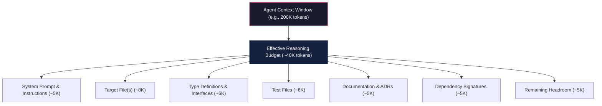
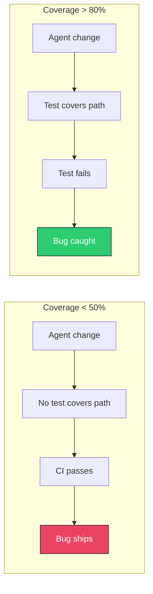
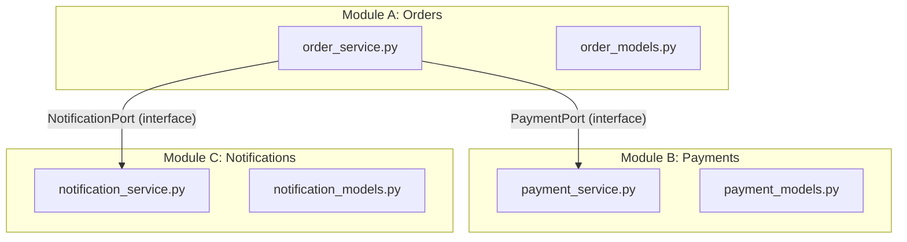
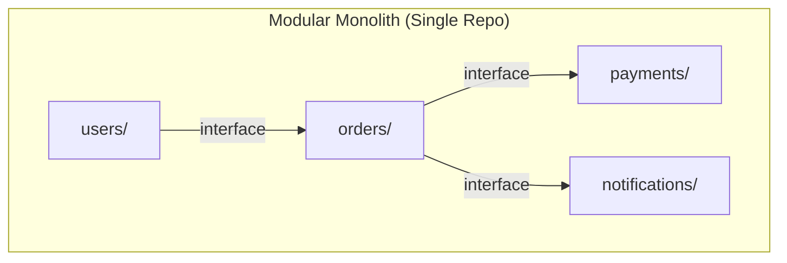
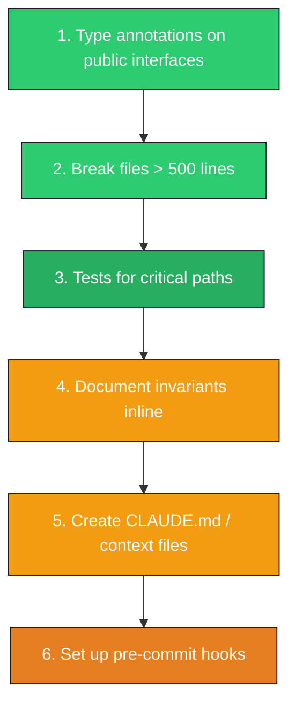

# AI-Native Software Architecture

> Designing software systems optimized for AI agent modification — treating agent-friendliness as an architectural quality attribute alongside performance, security, and maintainability.

---

## TL;DR

Software optimized for AI modification prioritizes small, well-tested, explicitly-documented units over clever, implicit, or tightly-coupled designs. The cost of implicit conventions is measured in wasted agent loops and review failures. Every architectural shortcut that relies on tribal knowledge, magic metaprogramming, or undocumented invariants becomes a tax paid on every single agent interaction — compounding across teams and time.

The core insight: **the same qualities that make code easy for a new engineer to understand on day one make it easy for an AI agent to modify correctly on attempt one.** The difference is that agents hit these friction points thousands of times per day, making the ROI of fixing them dramatically higher.

---

## The New Architectural Constraint

Every AI coding agent operates within a **context window**: a hard upper bound on the amount of text it can reason about in a single pass. This is not a soft limit that degrades gracefully. Beyond it, the agent literally cannot see the code.

> **The total relevant context required to make a correct change must fit within the agent's effective reasoning capacity.**

A 200K-token context window does not mean 200K tokens of useful reasoning. Empirically, agent accuracy degrades well before the window is full. The practical budget is closer to 20-40K tokens of *relevant* context for a single focused change.

### Context Budget Allocation



### Architecture Implications

This constraint inverts some traditional wisdom:

| Traditional Priority | AI-Native Priority |
|---|---|
| DRY at all costs | Locality of context over DRY |
| Abstraction layers | Explicit, shallow call chains |
| Convention over configuration | Configuration over convention |
| Clever, concise code | Obvious, self-describing code |
| Documentation in wiki | Documentation in-repo, inline |

The architecture that wins **minimizes the relevant context an agent needs to load** for any given change — analogous to cache locality in CPU design, except the cache is the context window.

### The Context Locality Principle

For any change `C`, define `R(C)` as the set of files an agent must read to make `C` correctly. The **context locality** of an architecture is:

```
Context Locality = 1 / avg(|R(C)|) for all common changes C
```

Higher is better. A perfectly modular codebase where every change touches exactly one file has maximal context locality. A deeply coupled monolith where every change requires understanding the full dependency graph has minimal context locality.

**Design goal**: for 90% of changes, `|R(C)| <= 5 files` and `total_tokens(R(C)) <= 15K`.

---

## File Size as Interface

File size is the single most actionable proxy for agent-friendliness. This is not aesthetic preference — it is an empirical observation about agent failure modes.

### Why Large Files Break Agents

**Partial file reads.** Files exceeding the comfortable reading threshold force chunked reads. The agent loses the mental model of the first chunk while processing the second, causing coordination failures across distant lines.

**Lost context between edits.** Multiple edits to a large file re-read it each time. A 1500-line file consumes most of the context budget on re-loading, leaving little room for reasoning.

**Split-change errors.** Large files contain multiple responsibilities. An agent modifying "payment logic" in a 2000-line `services.py` may change the wrong function or miss a related change 800 lines away.

**Hallucination amplification.** Agent hallucination rates (inventing function names, misremembering parameter types) increase with file size — more symbols to track, more attention degradation.

### Size Guidelines

| File Size | Agent Impact | Recommendation |
|---|---|---|
| < 200 lines | Optimal. Full context. | Ideal for focused modules. |
| 200-400 lines | Good. Reliable handling. | Target range for most files. |
| 400-500 lines | Acceptable. Minor degradation. | Monitor, refactor if growing. |
| 500-800 lines | Degraded. Partial reads, coordination errors. | Refactor proactively. |
| 800+ lines | Hostile. High failure rate, multiple retries. | Refactor immediately. |

### Refactoring Monolithic Files as AI-Readiness Work

```python
# BEFORE: monolithic services.py (1400 lines)
# AFTER: modular package
# services/
# ├── __init__.py          (re-exports for backward compat)
# ├── user_service.py      (280 lines)
# ├── payment_service.py   (320 lines)
# ├── notification.py      (240 lines)
# └── reporting.py         (290 lines)
```

The `__init__.py` re-export pattern preserves backward compatibility. Now an agent modifying payment logic reads only 320 lines instead of scanning 1400.

Teams consistently report 30-50% reduction in agent retry loops and 40-60% reduction in "wrong location" edits after splitting files above 500 lines.

---

## The Self-Documenting API Principle

AI agents read function signatures the way humans read documentation. The signature *is* the prompt. An untyped, undocumented function forces the agent to read the entire implementation.

### Before: Agent-Hostile Interface

```python
def process(data, opts=None):
    """Process the data."""
    if opts is None:
        opts = {}
    threshold = opts.get("threshold", 0.5)
    mode = opts.get("mode", "fast")
    # ... 200 lines of implementation ...
    if result is None:
        return {"status": "error"}
    return {"status": "ok", "output": result, "metadata": {"took": elapsed}}
```

The agent must read 200 lines of implementation to discover the dict keys, their types, their defaults, and the return shape.

### After: Agent-Friendly Interface

```python
class ProcessingMode(Enum):
    FAST = "fast"
    ACCURATE = "accurate"

@dataclass(frozen=True)
class ProcessingOptions:
    """# INVARIANT: threshold must be in [0.0, 1.0]"""
    threshold: float = 0.5
    mode: ProcessingMode = ProcessingMode.FAST
    max_retries: int = 3

@dataclass(frozen=True)
class ProcessingResult(Generic[T]):
    success: bool
    output: T | None
    elapsed_ms: float
    error_message: str | None = None

def process_dataset(
    records: list[dict[str, float]],
    options: ProcessingOptions = ProcessingOptions(),
) -> ProcessingResult[list[float]]:
    """Process numeric records through the scoring pipeline.

    Args:
        records: Input records, keys are feature names, values are scores. Must be non-empty.
        options: Processing configuration. See ProcessingOptions for defaults.

    Returns:
        ProcessingResult with scored outputs on success, or error message on failure.

    Raises:
        ValueError: If records is empty or contains invalid feature names.
    """
    ...
```

The agent can generate a correct call site *without reading the implementation*.

### Signature Completeness Checklist

- [ ] Type annotations on all parameters and return type
- [ ] Docstring with behavior description (not just "Process the data")
- [ ] Documented preconditions and postconditions
- [ ] Explicit error/exception documentation
- [ ] Inline invariant comments for non-obvious constraints
- [ ] Enum types instead of string literals for mode selection

---

## Test Coverage as Agent Safety Net

Tests are the difference between "the agent made a change" and "the agent made a *correct* change." Without tests, agent output is unverifiable without human line-by-line review.

### Why 80%+ Coverage is the Prerequisite

Below 80%, significant code paths go unchecked by agent modifications. Above it, the remaining 20% tends to be error handling and infrastructure glue — areas where agents make fewer changes.



### The "Test Before Agent" Workflow

1. **Human writes failing tests** that specify the desired behavior
2. **Agent makes the tests pass** by implementing the feature
3. **Human reviews the diff** against the test specification

This works because tests are a precise, executable specification with a clear success criterion. The human review surface is small: "does the implementation match the intent of the tests?"

```python
# Step 1: Human writes this test
def test_transfer_between_accounts():
    ledger = Ledger()
    source = ledger.create_account("source", balance=Decimal("1000.00"))
    target = ledger.create_account("target", balance=Decimal("500.00"))

    tx = ledger.transfer(source, target, amount=Decimal("250.00"))

    assert source.balance == Decimal("750.00")
    assert target.balance == Decimal("750.00")
    assert tx.status == TransactionStatus.COMPLETED

def test_transfer_insufficient_funds():
    ledger = Ledger()
    source = ledger.create_account("source", balance=Decimal("100.00"))
    target = ledger.create_account("target", balance=Decimal("500.00"))

    with pytest.raises(InsufficientFundsError):
        ledger.transfer(source, target, amount=Decimal("200.00"))

    # INVARIANT: balances unchanged on failure
    assert source.balance == Decimal("100.00")
    assert target.balance == Decimal("500.00")

# Step 2: Agent implements Ledger.transfer() to make these pass
# Step 3: Human reviews the implementation
```

### Test Structure for Agent Safety

- **Unit tests as change detectors**: fast, isolated, one test file per module
- **Integration tests as regression guards**: cross-module interaction validation
- **Contract tests for API boundaries**: request/response shape verification

---

## Interface Segregation for Agent Boundaries

When module interfaces are clean and narrow, an agent can work within one module without loading the internals of its dependencies.

### Module Boundaries as Agent Scope



When an agent modifies `payment_service.py`, it needs only that file (~300 lines), `payment_models.py` (~150 lines), and the `PaymentPort` interface (~20 lines). Total: ~470 lines. No need to understand orders or notifications.

### Package-Level APIs as Scope Boundaries

```python
# payments/__init__.py
"""Payment processing module.

Public API:
    - PaymentService: orchestrates payment flows
    - PaymentResult: outcome of a payment attempt
    - PaymentError: base exception for payment failures
"""
from .payment_service import PaymentService
from .payment_models import PaymentResult, PaymentMethod
from .payment_errors import PaymentError

__all__ = ["PaymentService", "PaymentResult", "PaymentMethod", "PaymentError"]
```

### Bounded Context Alignment

This maps directly to DDD bounded contexts (see `01-foundations/`). Each bounded context becomes an agent work boundary. An agent assigned to "add refund retry logic" works entirely within the Payments context — interface contracts with Orders and Notifications are stable.

### Dependency Inversion for Agent Safety

```python
# ports.py — stable interface, rarely changes
class PaymentGateway(ABC):
    """# CONTRACT: charge() is idempotent for the same idempotency_key
    # CONTRACT: refund() must be called with a valid charge_id"""

    @abstractmethod
    def charge(self, amount_cents: int, currency: str,
               idempotency_key: str) -> ChargeResult: ...

    @abstractmethod
    def refund(self, charge_id: str, amount_cents: int) -> RefundResult: ...
```

An agent implementing a new payment gateway reads the port definition and tests — it does not need the existing adapter implementation.

---

## Eliminating Implicit Conventions

Tribal knowledge is the most insidious form of agent-hostile architecture. It is invisible in the code, exists only in human heads, and causes agents to produce plausible-looking but subtly wrong output.

### The Cost of Implicit Knowledge

| Implicit Convention | Agent Failure Mode |
|---|---|
| "We always use UTC for timestamps" | Agent uses local time, timezone bugs |
| "Service names are kebab-case in K8s" | Agent uses snake_case, deployment fails |
| "Database migrations must be reversible" | Agent creates irreversible migration |
| "We never delete, only soft-delete" | Agent adds `DELETE FROM` query |

### ADRs as Machine-Readable Context

```markdown
# ADR-0002: Soft-Delete Over Hard-Delete
## Status: Accepted
## Decision
All entity deletions use soft-delete via `deleted_at` timestamp column.
Never use `DELETE FROM` on user-facing tables.
## Consequences
- All queries must include `WHERE deleted_at IS NULL` (enforced via ORM default scope)
- Restore operations set `deleted_at = NULL`
```

### Inline Constraint Comments

```python
class Account:
    def __init__(self, account_id: str, balance: Decimal):
        # INVARIANT: balance must never go negative
        # INVARIANT: all balance mutations must go through debit()/credit()
        # INVARIANT: account_id is immutable after creation
        self._account_id = account_id
        self._balance = balance
```

The `# INVARIANT`, `# PRECONDITION`, `# POSTCONDITION` markers serve as machine-scannable constraints.

### Schema-Enforced Contracts

Replace implicit "we expect this JSON shape" with explicit schemas:

```yaml
# config/schema.yaml
type: object
required: [database, redis, feature_flags]
properties:
  database:
    type: object
    required: [host, port, name]
    properties:
      host:
        type: string
        description: "Database hostname. Must be a valid FQDN or IP."
      port:
        type: integer
        minimum: 1024
        maximum: 65535
        default: 5432
      name:
        type: string
        pattern: "^[a-z][a-z0-9_]*$"
```

The agent reads the schema and produces conforming output automatically.

### Codified Conventions

| Convention | Enforcement |
|---|---|
| Code formatting | `.prettierrc`, `ruff.toml` |
| Import ordering | `isort` config, ESLint rules |
| File encoding / line endings | `.editorconfig` |
| Commit message format | `commitlint.config.js` |
| API naming conventions | OpenAPI linting (`spectral`) |

The agent reads these config files and follows them automatically. No tribal knowledge required.

---

## Monolith vs Modular for Agent Work

### Modular Monolith: The Agent-Friendly Default



**Advantages**: single repo clone, single build system, single test suite, atomic cross-module changes, refactoring safety across boundaries.

### Microservices: Agent Challenges

- **Cross-repo changes**: adding a field requires coordinated changes in producer and consumer repos
- **Contract drift**: agent changes service A's response shape without updating service B's client
- **Context fragmentation**: agent cannot read both services simultaneously in different repos

### When Microservices Help

- **Independent deployability**: agent changes to one service cannot break another (if contracts hold)
- **Smaller repos**: each repo is small enough for full comprehension
- **Team boundaries**: agent work scoped to one team's service avoids cross-team coordination

### Decision Matrix

| Factor | Modular Monolith | Microservices |
|---|---|---|
| Agent context loading | Single repo, simple | Multi-repo, fragmented |
| Cross-module changes | Atomic, easy | Coordinated, risky |
| Test validation | Single suite | Multiple suites + contract tests |
| **Agent-friendliness** | **High** | **Medium** (with good contracts) |

**Recommendation**: Start with a modular monolith. Extract to microservices when organizational scaling demands it — and when you have mature contract testing and schema-first APIs.

---

## Schema-First Design

Schemas serve dual purpose: runtime data validation *and* precise agent context for API integration. A well-specified schema eliminates incorrect request/response shapes, missing required fields, and wrong data types.

### OpenAPI as Agent Context

```yaml
# api/openapi.yaml
paths:
  /v2/charges:
    post:
      operationId: createCharge
      summary: Create a new payment charge
      description: |
        Idempotent: repeated calls with the same Idempotency-Key return original result.
        # CONSTRAINT: amount_cents must be >= 50 (minimum charge)
        # CONSTRAINT: currency must be a valid ISO 4217 code
      parameters:
        - name: Idempotency-Key
          in: header
          required: true
          schema: { type: string, format: uuid }
      requestBody:
        required: true
        content:
          application/json:
            schema:
              type: object
              required: [amount_cents, currency, payment_method_id, description]
              properties:
                amount_cents:
                  type: integer
                  minimum: 50
                  description: "Charge amount in smallest currency unit"
                currency:
                  type: string
                  pattern: "^[A-Z]{3}$"
                payment_method_id:
                  type: string
                  format: uuid
                description:
                  type: string
                  maxLength: 500
```

Given this spec, an agent produces a correct client without reading the server implementation:

```python
class PaymentClient:
    def create_charge(self, request: CreateChargeRequest) -> ChargeResponse:
        response = self._client.post(
            "/v2/charges",
            json=asdict(request),
            headers={"Idempotency-Key": str(uuid4())},
        )
        response.raise_for_status()
        return ChargeResponse(**response.json())
```

### Protobuf for Strong Typing

For internal service communication, Protobuf schemas provide even stronger guarantees:

```protobuf
// payment/v2/charge.proto
syntax = "proto3";
package payment.v2;

message CreateChargeRequest {
  int64 amount_cents = 1;         // Must be >= 50
  string currency = 2;             // ISO 4217
  string payment_method_id = 3;    // UUID
  string description = 4;          // Max 500 chars
  map<string, string> metadata = 5;
}

enum ChargeStatus {
  CHARGE_STATUS_UNSPECIFIED = 0;
  CHARGE_STATUS_PENDING = 1;
  CHARGE_STATUS_SUCCEEDED = 2;
  CHARGE_STATUS_FAILED = 3;
}
```

Generated code from Protobuf gives agents type-safe stubs. The compiler catches errors that would otherwise surface as runtime failures in production. The agent cannot misuse an API defined in Protobuf — the types enforce correctness at compile time.

---

## Anti-Patterns: Agent-Hostile Architecture

### 1. Magic via Metaprogramming / Reflection

```python
# HOSTILE: dynamically generated methods — agent cannot discover them
class Model(metaclass=ModelMeta):
    fields = ["name", "email"]
    # ModelMeta generates get_name(), set_name() — invisible to agent
```

**Fix**: Use explicit method definitions or type stubs declaring the generated interface:

```python
# FRIENDLY: explicit declarations with type stubs
class Model:
    name: str
    email: str

    def get_name(self) -> str: ...
    def set_name(self, value: str) -> None: ...
    def validate_name(self) -> bool: ...
```

### 2. Implicit Global State

```python
# HOSTILE: function depends on hidden global
_current_tenant = None
def get_orders():
    return db.query(Order).filter(tenant_id=_current_tenant).all()
```

**Fix**: Make dependencies explicit via parameters: `def get_orders(tenant_id: str) -> list[Order]`.

### 3. Undocumented Side Effects

```python
# HOSTILE: save() also sends email, updates cache, publishes event
def save_user(user: User) -> None:
    db.save(user)
    email_service.send_welcome(user.email)
    cache.invalidate(f"user:{user.id}")
    event_bus.publish(UserCreated(user.id))
```

**Fix**: Separate persistence from side effects, document them explicitly:

```python
# FRIENDLY: separated concerns
def save_user(user: User) -> None:
    """Persist user to database. Does NOT trigger notifications or events."""
    db.save(user)

def on_user_created(user: User) -> None:
    """Trigger all side effects for a newly created user.

    Side effects: sends welcome email, invalidates cache, publishes UserCreated event.
    """
    email_service.send_welcome(user.email)
    cache.invalidate(f"user:{user.id}")
    event_bus.publish(UserCreated(user.id))
```

### 4. Deeply Nested Inheritance Hierarchies

```python
# HOSTILE: 5 levels — agent must read all to understand behavior
class BaseEntity: ...              # 200 lines
class AuditableEntity(BaseEntity): ...
class TenantEntity(AuditableEntity): ...
class SoftDeletable(TenantEntity): ...
class Order(SoftDeletable): ...    # ~870 lines total to understand Order.save()
```

**Fix**: Prefer composition over inheritance:

```python
# FRIENDLY: composition makes dependencies explicit
@dataclass
class Order:
    id: str
    tenant_id: str
    items: list[OrderItem]
    audit: AuditLog       # Composition, not inheritance
    deletion: SoftDelete   # Composition, not inheritance

    def save(self, repo: OrderRepository) -> None:
        self.audit.record_update()
        repo.save(self)
```

### 5. Test-Free Hot Paths

Critical business logic with zero coverage means any agent modification is a gamble with no verification.

**Fix**: Add parameterized tests documenting expected behavior before allowing agent modifications:

```python
@pytest.mark.parametrize("sale,tier,quarter,accel,expected", [
    (Decimal("10000"), "gold", 1, False, Decimal("1500")),
    (Decimal("10000"), "gold", 4, True,  Decimal("2250")),
    (Decimal("10000"), "silver", 1, False, Decimal("1000")),
    (Decimal("0"),     "gold", 1, False, Decimal("0")),
])
def test_calculate_commission(sale, tier, quarter, accel, expected):
    assert calculate_commission(sale, tier, quarter, accel) == expected
```

### 6. Configuration-as-Code Without Schema

```python
# HOSTILE: arbitrary dict — agent guesses at valid keys
config = {"retry_count": 3, "timeout": 30, "feature_flags": {"new_checkout": True}}
```

**Fix**: Use typed configuration with validation:

```python
from pydantic import BaseModel, Field

class RetryConfig(BaseModel):
    """# CONSTRAINT: max_retries * backoff_seconds should not exceed timeout"""
    max_retries: int = Field(3, ge=0, le=10, description="Max retry attempts")
    backoff_seconds: float = Field(1.0, gt=0, description="Base backoff duration")

class AppConfig(BaseModel):
    """Top-level application configuration. Loaded from config.yaml."""
    retry: RetryConfig = RetryConfig()
    request_timeout_seconds: int = Field(30, ge=1, le=300)
    feature_flags: dict[str, bool] = Field(
        default_factory=dict,
        description="Feature flag overrides. Keys must match registered flags.",
    )
```

---

## Migration Path: Hardening Existing Codebases

### Prioritized Checklist



### Phase 1: Quick Wins (Days)

**1. Add type annotations to public interfaces.** Start with the most-modified files (`git log` hotspots). Focus on function signatures, not internal variables.

**2. Break files > 500 lines into modules.** Split along responsibility boundaries. Maintain backward compatibility via `__init__.py` re-exports.

### Phase 2: Foundation (Weeks)

**3. Add tests for critical paths.** Identify via: revenue-impacting code, frequently-modified code, code with known bugs. Start with characterization tests capturing current behavior.

**4. Document invariants inline.** Audit core domain models. Add `# INVARIANT`, `# PRECONDITION`, `# POSTCONDITION` comments for non-obvious constraints.

### Phase 3: Infrastructure (Weeks)

**5. Create CLAUDE.md / context files.** At minimum, document:

```markdown
# CLAUDE.md

## Build & Test
- `make test` runs all tests
- `make lint` runs type checking and linting
- `make docker-up` starts local dependencies

## Architecture
- Modular monolith: each top-level directory is a bounded context
- Database: PostgreSQL, migrations in `migrations/`
- All timestamps UTC, stored as timestamptz

## Conventions
- Soft-delete only: never use DELETE FROM on user-facing tables
- Error codes: 4xxx = client error, 5xxx = server error
- Feature flags: registered in `feature_flags.yaml`, never hard-coded
```

**6. Set up pre-commit hooks.** Formatting, type checking, linting, and test execution. Pre-commit hooks are the last defense against agent errors before code reaches review.

```yaml
# .pre-commit-config.yaml
repos:
  - repo: local
    hooks:
      - id: ruff-format
        entry: ruff format --check
        language: system
        types: [python]
      - id: mypy
        entry: mypy --strict
        language: system
        types: [python]
      - id: pytest
        entry: pytest --tb=short -q
        language: system
        pass_filenames: false
```

### Phase 4: Maturity (Ongoing)

**7. Schema-first for new APIs.** Every new endpoint starts with an OpenAPI/Protobuf spec. Implementation follows the spec.

**8. ADRs for key decisions.** 15 minutes of writing; benefit is every future agent interaction being correct.

---

## Measuring AI-Readiness

### Core Metrics

| Metric | Target | How to Measure |
|---|---|---|
| Average file size | < 300 lines | `find . -name "*.py" -exec wc -l {} +` |
| Max file size | < 500 lines | Sort by size, check top files |
| Test coverage | > 80% | `pytest --cov --cov-fail-under=80` |
| Type annotation coverage | > 90% (public APIs) | `mypy --txt-report` or `pyright` |
| Documentation coverage | > 75% (public functions) | `interrogate -v` (Python) |
| Context file freshness | Updated within 30 days | `git log -1 --format='%cr' CLAUDE.md` |

### Agent-Specific Metrics

| Metric | Description | Target |
|---|---|---|
| First-attempt success rate | % of tasks correct on first try | > 70% |
| Average retry loops | Re-attempts before success | < 2 |
| Review rejection rate | % of agent PRs rejected | < 15% |
| Context load per task | Average tokens loaded | < 20K |
| Time-to-correct-output | Wall clock from task start to accepted PR | Trending down |

### Dashboard Example

```
AI-Readiness Score: 73/100

Code Quality Metrics:
  Avg file size:        287 lines  [PASS] (target: <300)
  Max file size:        612 lines  [WARN] (target: <500)
  Test coverage:         84%       [PASS] (target: >80%)
  Type coverage:         78%       [WARN] (target: >90%)
  Doc coverage:          81%       [PASS] (target: >75%)

Agent Performance:
  First-attempt success:  68%      [WARN] (target: >70%)
  Avg retry loops:        1.8      [PASS] (target: <2)
  Review rejection rate:  12%      [PASS] (target: <15%)
  Avg context load:     18.2K tok  [PASS] (target: <20K)

Top Action Items:
  1. Refactor payments/gateway.py (612 lines -> split into adapter modules)
  2. Add type annotations to users/ module (62% coverage)
  3. Update CLAUDE.md (last modified 45 days ago)
```

### Continuous Tracking

Integrate AI-readiness checks into CI:

```yaml
# .github/workflows/ai-readiness.yml
name: AI-Readiness Check
on: [pull_request]
jobs:
  check:
    runs-on: ubuntu-latest
    steps:
      - uses: actions/checkout@v4
      - name: Check max file size
        run: |
          MAX=$(find . -name "*.py" -not -path "*/migrations/*" \
                -exec wc -l {} + | sort -rn | head -1 | awk '{print $1}')
          if [ "$MAX" -gt 500 ]; then
            echo "::warning::Largest file is $MAX lines (target: <500)"
          fi
      - name: Check test coverage
        run: pytest --cov --cov-fail-under=80
```

---

## Key Takeaways

1. **Context windows are the new architectural constraint.** Design for minimal relevant context per change. If an agent needs more than 5 files or 15K tokens, the architecture is working against you.

2. **File size is the highest-leverage metric.** Keep files under 500 lines (ideally 200-400). This single practice reduces hallucination, split-change errors, and retry loops more than any other intervention.

3. **Type annotations are agent prompts.** A fully-typed function signature lets agents generate correct call sites without reading implementations.

4. **Tests are the only reliable agent safety net.** Without 80%+ coverage, agent changes are unverifiable. The "test before agent" workflow is the highest-confidence pattern.

5. **Implicit knowledge is agent-hostile.** Codify constraints via ADRs, inline comments (`# INVARIANT`), schemas, linter configs, and pre-commit hooks.

6. **Modular monoliths are the agent-friendly default.** Single repo, single build, clear module boundaries. Extract to microservices only when organizational scaling demands it.

7. **Schema-first design provides dual value.** OpenAPI and Protobuf specs validate data at runtime and provide agents with precise, machine-readable API documentation.

8. **Anti-patterns compound.** Metaprogramming magic, implicit global state, undocumented side effects, deep inheritance, test-free hot paths, and schema-less configuration each increase agent failure rate independently. Combined, they make agent-assisted development effectively impossible.

9. **Migration is incremental.** Start with type annotations and file splitting (days). Progress through test coverage and documentation (weeks). Mature into schema-first APIs and ADRs (ongoing).

10. **Measure to improve.** Track file size, test coverage, type coverage, and agent-specific metrics. The ROI of AI-readiness work is directly observable in these numbers.

---

> *Cross-references: See `01-foundations/` for DDD bounded context patterns. See `16-llm-systems/08-context-management.md` for context window optimization strategies. See `12-service-mesh/` for microservice communication patterns relevant to cross-service agent work.*
