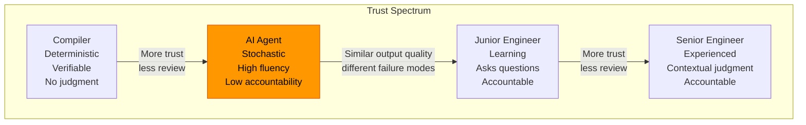
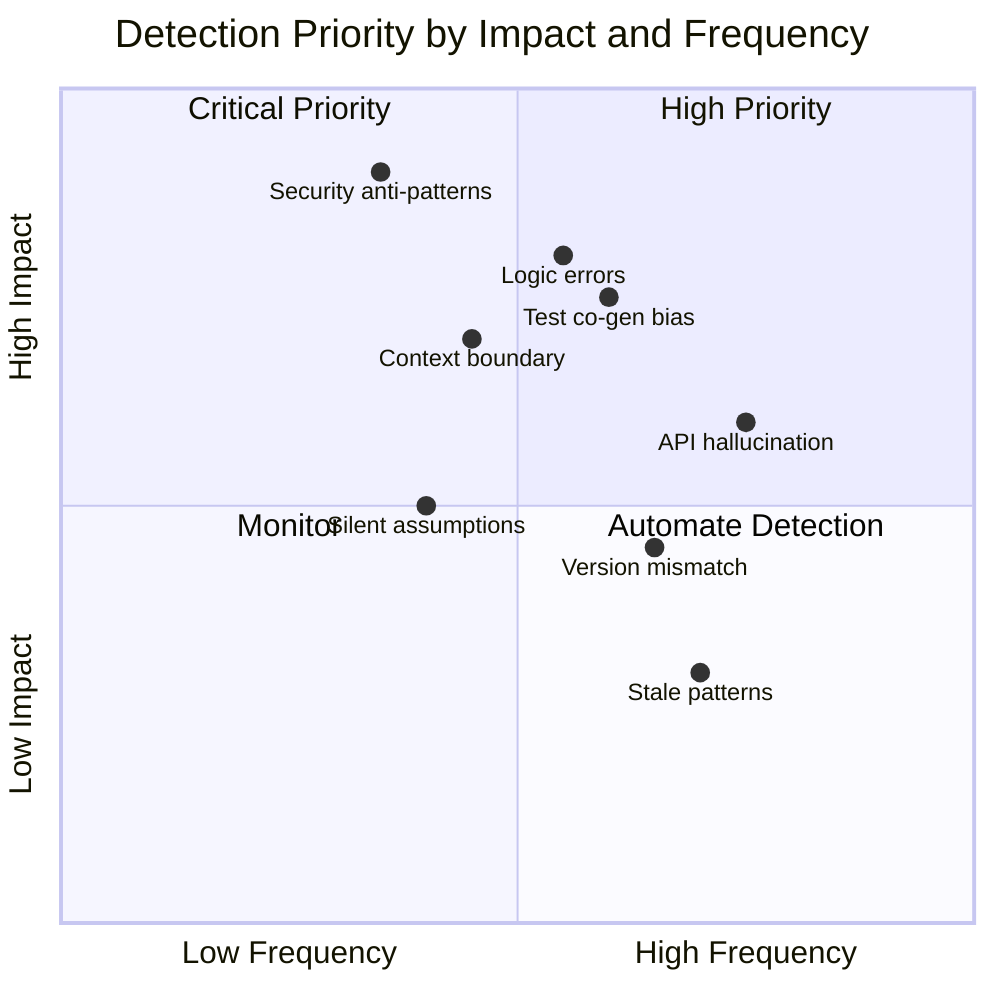
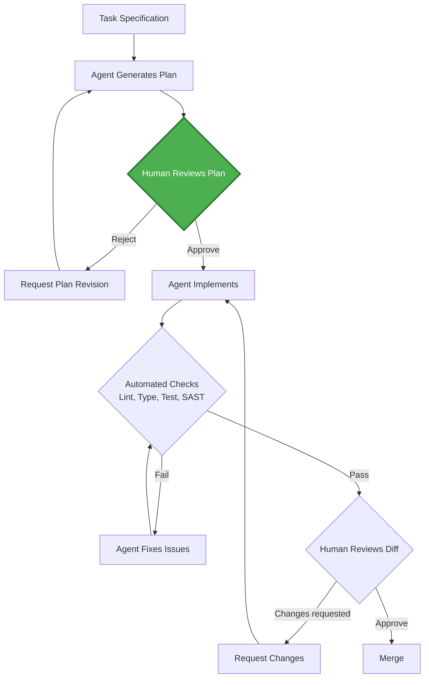
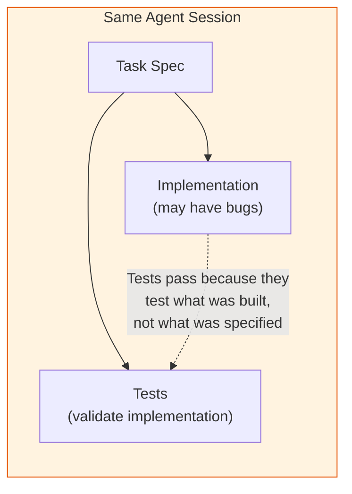
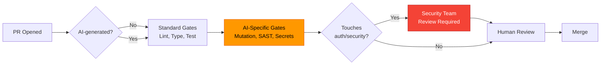
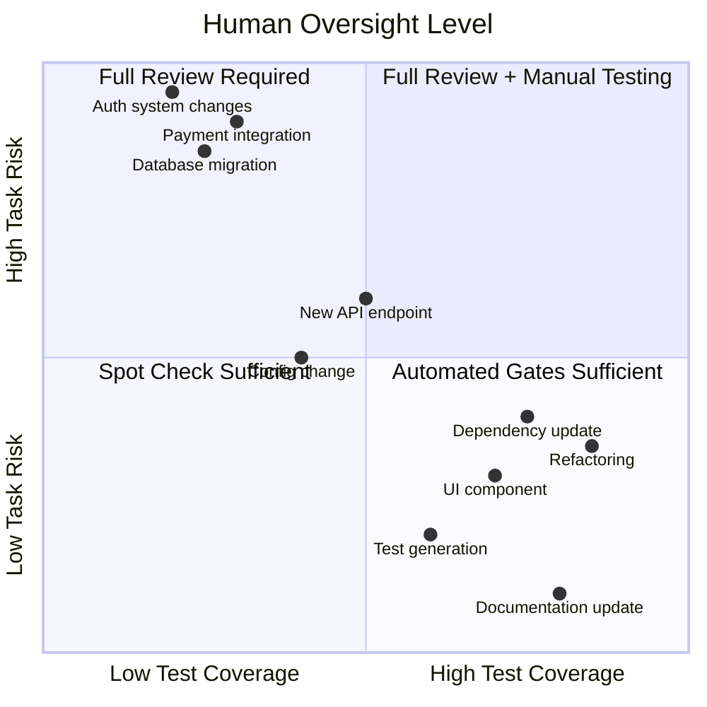

# Quality Engineering with AI Agents

## TL;DR

AI-generated code requires review calibrated to its failure modes, not human failure modes. Agents produce **confidently incorrect** code, make **context-boundary errors** when reasoning spans multiple files, introduce **security anti-patterns** that pass superficial review, and **co-generate tests** that mask the very gaps they should expose. Traditional code review checklists are necessary but insufficient — quality engineering for AI-generated code demands new trust models, specialized review heuristics, and CI gates designed around agent-specific failure signatures.

---

## The Trust Model

### Why Agents Occupy a Novel Trust Tier

Agents are neither junior engineers nor compilers. They exhibit a unique combination of traits that demands a new trust model.



### Trust Properties Comparison

| Property | Compiler | AI Agent | Junior Engineer | Senior Engineer |
|----------|----------|----------|-----------------|-----------------|
| Deterministic | Yes | No | No | No |
| Explains reasoning | No | Plausible but unreliable | Honest but incomplete | Accurate |
| Asks for clarification | Never | Rarely (proceeds with assumptions) | Frequently | When needed |
| Fails visibly | Always | Rarely (fails silently) | Usually | Usually |
| Accountability | N/A | None | Personal | Personal + team |
| Context window | Unlimited (scoped) | Limited (token-bound) | Growing | Deep |
| Confidence calibration | Perfect | Poor (overconfident) | Varies | Well-calibrated |

### The Accountability Gap

```
Human engineer writes buggy code → learns from review, adjusts behavior
AI agent writes buggy code      → repeats identical mistakes next session

Human engineer skips edge case  → "I didn't think of that" (honest)
AI agent skips edge case        → "Here's the comprehensive solution" (confident)
```

This gap means review of AI-generated code must be **more rigorous** than review of junior engineer code, not less — despite the agent's output appearing more polished.

### Calibrated Trust Rules

| Rule | Rationale |
|------|-----------|
| Trust structure, verify logic | Agents excel at boilerplate and scaffolding |
| Never trust error handling | Agents pattern-match happy paths |
| Never trust security boundaries | Agents optimize for functionality over defense |
| Verify all external API usage | Hallucinated methods and wrong signatures are common |
| Treat co-generated tests as untrusted | Tests written alongside code inherit the same blind spots |
| Trust refactors more than new features | Refactors have existing tests as safety nets |

---

## Failure Mode Taxonomy

### Hallucination Categories

| Category | Description | Example | Detection Method | Mitigation |
|----------|-------------|---------|-----------------|------------|
| **API hallucination** | Invents methods that do not exist | `response.json().unwrap_or_default()` on a type without that impl | Compilation / type checking | Lock dependency versions, provide API docs in context |
| **Version mismatch** | Uses syntax or APIs from wrong version | React class components in a hooks-only codebase | Linter rules, version-aware SAST | Pin framework version in system prompt |
| **Confident logic error** | Produces plausible but incorrect logic | Off-by-one in pagination that passes basic tests | Mutation testing, property-based tests | Require edge-case test cases written by humans |
| **Context boundary error** | Misunderstands cross-file contracts | Calls function with wrong argument order from another module | Integration tests, contract tests | Provide interface definitions in context |
| **Security anti-pattern** | Introduces vulnerability while solving functional requirement | SQL string interpolation that "works" | SAST scanners (Semgrep [7], CodeQL [8]) | Security-focused review checklist |
| **Stale pattern** | Uses deprecated approaches | `componentWillMount` in React 18 | Deprecation linters | Keep context current, include migration guides |
| **Test co-generation bias** | Tests validate the bug, not the spec | Test asserts wrong output as correct | Mutation testing, spec review | Separate test authoring from implementation |
| **Silent assumption** | Makes undocumented assumptions about environment | Assumes UTC timezone, assumes Linux paths | Environment-specific CI matrix | Require assumption documentation |

### Detection Priority Matrix



### Root Cause Analysis

Most agent failures trace to three root causes:

```
1. TRAINING DATA BIAS
   Agent learned from Stack Overflow circa 2021
   → Uses patterns that were popular then, not now
   → Mixes conventions from different ecosystems

2. CONTEXT WINDOW LIMITS
   Agent cannot see entire codebase simultaneously
   → Makes assumptions about modules outside its view
   → Duplicates utilities that already exist elsewhere

3. OPTIMIZATION FOR PLAUSIBILITY
   Agent optimizes for "looks correct" over "is correct"
   → Produces syntactically perfect, semantically wrong code
   → Generates tests that confirm the implementation, not the spec
```

---

## Plan-Implement-Review Pipeline

### Why Plan Approval is the Highest-Leverage Review Gate

Reviewing a plan takes 5 minutes. Reviewing an incorrect implementation takes 2 hours [15]. Rejecting a plan costs nothing. Rejecting a PR costs the agent's compute and the reviewer's time.



### Plan Review Checklist

| Check | Question | Why It Matters |
|-------|----------|----------------|
| Scope | Does the plan match the task, no more, no less? | Agents gold-plate and over-engineer |
| File list | Are the files to be modified correct and complete? | Agents miss files they haven't been shown |
| Dependencies | Are new dependencies justified? | Agents add libraries for trivial tasks |
| Approach | Does the approach match team conventions? | Agents use whatever pattern they learned most |
| Edge cases | Are failure modes addressed in the plan? | Agents plan for happy paths |
| Security | Are auth/authz boundaries respected? | Agents skip security by default |
| Testing strategy | Does the plan include test categories? | Agents default to unit tests only |

### Structured Plan Format

```markdown
## Plan: [Task Title]

### Goal
One sentence describing the desired outcome.

### Files to Modify
- `src/auth/handler.ts` — Add rate limiting middleware
- `src/auth/handler.test.ts` — Add rate limit test cases

### Files to Create
- `src/middleware/rate-limit.ts` — Rate limiter implementation

### Approach
1. Step one (with rationale)
2. Step two (with rationale)

### Edge Cases
- What happens when X?
- What happens when Y?

### Out of Scope
- Things explicitly not being done

### Dependencies
- None (or list with justification)
```

### Anti-Pattern: Skipping Plan Review

```
❌ "Just implement the feature, I trust you"
   → Agent over-engineers the solution
   → Agent modifies files outside the intended scope
   → Agent introduces a dependency for a 3-line utility
   → 2 hours of review to untangle

✅ "Write a plan first, then wait for approval"
   → 5-minute plan review catches scope creep
   → Implementation aligns with team conventions
   → Review focuses on correctness, not approach
```

---

## Reviewing AI Diffs at Scale

### What Agents Get Right

| Category | Reliability | Review Depth Needed |
|----------|------------|-------------------|
| File structure and boilerplate | High | Skim |
| Type definitions and interfaces | High | Skim |
| Import organization | High | Skip (linter handles) |
| Documentation strings | Medium-High | Verify accuracy |
| Standard CRUD operations | Medium-High | Verify edge cases |
| Test scaffolding | Medium | Verify assertions |
| Configuration files | Medium | Verify values |

### What Agents Get Wrong

| Category | Failure Rate | Review Depth Needed |
|----------|-------------|-------------------|
| Error handling and recovery | High | Line-by-line |
| Concurrency and race conditions | High | Line-by-line |
| Security boundaries | High | Line-by-line + threat model |
| Cross-module integration | High | Cross-file review |
| Performance under load | Medium-High | Benchmark |
| Edge cases and boundary conditions | Medium-High | Property-based test review |
| Resource cleanup (connections, files) | Medium | Check all code paths |
| Backward compatibility | Medium | Check all callers |

### Review Checklist by PR Type

#### New Feature PR

```markdown
- [ ] Plan was reviewed and approved before implementation
- [ ] Feature flag wraps new functionality
- [ ] Error handling covers all failure modes (not just happy path)
- [ ] Input validation exists at trust boundary
- [ ] No hardcoded credentials, URLs, or environment-specific values
- [ ] Tests cover edge cases, not just golden path
- [ ] Tests were NOT generated by the same agent session (or mutation-tested)
- [ ] No unnecessary new dependencies added
- [ ] API contracts match existing conventions
- [ ] Database migrations are reversible
```

#### Refactoring PR

```markdown
- [ ] Behavior is unchanged (verified by existing tests passing)
- [ ] No new features smuggled into the refactor
- [ ] Performance characteristics preserved
- [ ] All callers updated consistently
- [ ] No orphaned code left behind
- [ ] Import paths updated everywhere
```

#### Bug Fix PR

```markdown
- [ ] Root cause identified and documented
- [ ] Fix addresses root cause, not symptom
- [ ] Regression test added BEFORE fix (proves the bug existed)
- [ ] Fix does not introduce new edge cases
- [ ] Related code paths checked for similar bugs
- [ ] Agent did not "fix" by rewriting the entire module
```

### The 3-Pass Review Strategy

```
Pass 1: STRUCTURAL (2 minutes)
  - Right files modified?
  - Right approach taken?
  - Any unexpected changes?
  → If structural issues found, reject immediately

Pass 2: SEMANTIC (10 minutes)
  - Logic correct for all inputs?
  - Error handling complete?
  - Security boundaries intact?
  → Focus on what agents get wrong (see table above)

Pass 3: INTEGRATION (5 minutes)
  - Does this work with the rest of the system?
  - Any contract violations?
  - Any performance implications?
  → Cross-reference with modules outside the diff
```

---

## Security Auditing

### CWE Categories Agents Commonly Produce

AI agents are trained on vast codebases that include vulnerable code. They reproduce security anti-patterns with the same fluency as correct patterns, often without any indication that the output is dangerous. The following CWE categories [6] are among the most frequently reproduced.

#### CWE-78: OS Command Injection [1]

```python
# ❌ Agent-generated: functional but vulnerable
import subprocess

def convert_image(filename: str, format: str) -> str:
    """Convert image to specified format."""
    output = f"{filename.rsplit('.', 1)[0]}.{format}"
    subprocess.run(f"convert {filename} {output}", shell=True)  # CWE-78
    return output

# ✅ Secure version
import subprocess
from pathlib import Path

ALLOWED_FORMATS = {"png", "jpg", "webp", "gif"}

def convert_image(filename: str, format: str) -> str:
    """Convert image to specified format."""
    if format not in ALLOWED_FORMATS:
        raise ValueError(f"Format must be one of {ALLOWED_FORMATS}")

    input_path = Path(filename)
    if not input_path.exists():
        raise FileNotFoundError(f"Input file not found: {filename}")

    output = str(input_path.with_suffix(f".{format}"))
    subprocess.run(
        ["convert", str(input_path), output],  # No shell=True, list args
        check=True,
        timeout=30,
    )
    return output
```

#### CWE-89: SQL Injection [2]

```python
# ❌ Agent-generated: works for demo, vulnerable in production
def get_user(db, username: str):
    query = f"SELECT * FROM users WHERE username = '{username}'"  # CWE-89
    return db.execute(query).fetchone()

# ✅ Secure version
def get_user(db, username: str):
    query = "SELECT * FROM users WHERE username = ?"
    return db.execute(query, (username,)).fetchone()
```

#### CWE-798: Hardcoded Credentials [3]

```python
# ❌ Agent-generated: "for testing" that ships to production
class DatabaseConfig:
    HOST = "db.internal.company.com"
    PORT = 5432
    USER = "admin"
    PASSWORD = "admin123"  # CWE-798

# ✅ Secure version
import os

class DatabaseConfig:
    HOST = os.environ["DB_HOST"]
    PORT = int(os.environ.get("DB_PORT", "5432"))
    USER = os.environ["DB_USER"]
    PASSWORD = os.environ["DB_PASSWORD"]
```

#### CWE-20: Improper Input Validation [4]

```python
# ❌ Agent-generated: trusts user input
def set_profile_picture(user_id: int, url: str):
    """Download and set user's profile picture."""
    response = requests.get(url)  # CWE-20: no URL validation
    save_image(user_id, response.content)

# ✅ Secure version
from urllib.parse import urlparse

ALLOWED_SCHEMES = {"https"}
ALLOWED_HOSTS = {"cdn.example.com", "images.example.com"}
MAX_SIZE = 5 * 1024 * 1024  # 5 MB

def set_profile_picture(user_id: int, url: str):
    """Download and set user's profile picture."""
    parsed = urlparse(url)
    if parsed.scheme not in ALLOWED_SCHEMES:
        raise ValueError("Only HTTPS URLs are allowed")
    if parsed.hostname not in ALLOWED_HOSTS:
        raise ValueError("URL host not in allowlist")

    response = requests.get(url, timeout=10, stream=True)
    content = response.content
    if len(content) > MAX_SIZE:
        raise ValueError(f"Image exceeds maximum size of {MAX_SIZE} bytes")

    validate_image_content(content)  # Check magic bytes
    save_image(user_id, content)
```

#### CWE-276: Incorrect Default Permissions [5]

```python
# ❌ Agent-generated: overly permissive defaults
def create_config_file(path: str, content: str):
    with open(path, "w") as f:
        f.write(content)
    os.chmod(path, 0o777)  # CWE-276: world-readable/writable

# ✅ Secure version
def create_config_file(path: str, content: str):
    fd = os.open(path, os.O_WRONLY | os.O_CREAT | os.O_TRUNC, 0o600)
    with os.fdopen(fd, "w") as f:
        f.write(content)
```

### Automated SAST as Post-Agent Gate

```yaml
# .github/workflows/agent-security-gate.yml
name: Agent Security Gate
on:
  pull_request:
    types: [opened, synchronize]

jobs:
  sast-scan:
    runs-on: ubuntu-latest
    if: contains(github.event.pull_request.labels.*.name, 'ai-generated')
    steps:
      - uses: actions/checkout@v4

      - name: Run Semgrep  # [7]
        uses: semgrep/semgrep-action@v1
        with:
          config: >-
            p/owasp-top-ten  # [14]
            p/cwe-top-25
            p/security-audit
          publishToken: ${{ secrets.SEMGREP_APP_TOKEN }}

      - name: Run CodeQL  # [8]
        uses: github/codeql-action/analyze@v3
        with:
          languages: ${{ matrix.language }}

      - name: Secret Scanner  # [9]
        uses: trufflesecurity/trufflehog@v3
        with:
          path: .
          extra_args: --only-verified

      - name: Dependency Audit
        run: |
          npm audit --audit-level=high || true
          pip-audit --strict || true
```

### Security Review Decision Table

| Signal | Action |
|--------|--------|
| PR labeled `ai-generated` + touches auth code | Mandatory security team review |
| PR labeled `ai-generated` + adds dependency | Dependency review + license check |
| PR labeled `ai-generated` + modifies infra | Infrastructure team review |
| SAST findings ≥ 1 high severity | Block merge |
| PR labeled `ai-generated` + no SAST run | Block merge |
| PR modifies `.env` or secrets config | Block merge + alert |

---

## The Co-Generation Problem

### The Fundamental Issue

When an agent writes both the implementation and the tests, the tests validate **what the code does**, not **what the code should do** [10]. The tests and the code share the same blind spots.



### Example: The Invisible Off-by-One

```python
# Agent-generated implementation
def paginate(items: list, page: int, per_page: int) -> list:
    """Return items for the given page."""
    start = page * per_page        # Bug: page 1 starts at per_page, not 0
    end = start + per_page
    return items[start:end]

# Agent-generated test (passes! but validates the bug)
def test_paginate():
    items = list(range(20))
    assert paginate(items, 0, 5) == [0, 1, 2, 3, 4]     # "page 0" works
    assert paginate(items, 1, 5) == [5, 6, 7, 8, 9]     # "page 1" works
    assert paginate(items, 3, 5) == [15, 16, 17, 18, 19] # "page 3" works
    # Missing: what does the API contract say? Is page 0-indexed or 1-indexed?
    # Missing: empty page, negative page, page beyond bounds
```

The test passes. The implementation is internally consistent. But if the spec says pages are 1-indexed (as most user-facing APIs are), **both the code and the test are wrong**.

### Detection Strategies

#### 1. Mutation Testing

Mutation testing [11] modifies the source code and checks if tests catch the mutations. Co-generated tests often have low mutation kill rates because they test surface behavior, not invariants.

```bash
# Python: mutmut [12]
mutmut run --paths-to-mutate=src/ --tests-dir=tests/

# JavaScript: Stryker [13]
npx stryker run

# Interpret results
# Mutation score < 70% on agent-generated code → tests are weak
# Surviving mutants reveal specific blind spots
```

#### 2. Human-Written Property Tests

Property-based tests [16] encode **invariants** that must hold for all inputs, not specific input-output pairs.

```python
from hypothesis import given, strategies as st

@given(
    items=st.lists(st.integers()),
    page=st.integers(min_value=1, max_value=100),
    per_page=st.integers(min_value=1, max_value=50),
)
def test_paginate_properties(items, page, per_page):
    result = paginate(items, page, per_page)

    # Property 1: result length ≤ per_page
    assert len(result) <= per_page

    # Property 2: all returned items exist in original list
    for item in result:
        assert item in items

    # Property 3: no overlap between pages
    if page > 1:
        prev_page = paginate(items, page - 1, per_page)
        assert set(map(id, result)).isdisjoint(set(map(id, prev_page)))

    # Property 4: union of all pages equals original list
    all_pages = []
    for p in range(1, (len(items) // per_page) + 2):
        all_pages.extend(paginate(items, p, per_page))
    assert all_pages == items  # This WILL catch the 0-vs-1 indexing bug
```

#### 3. Spec-Derived Test Oracles

Extract test expectations directly from specifications, not from the implementation.

```python
# Oracle derived from API spec, written by human
class PaginationOracle:
    """
    From API spec v2.3:
    - Pages are 1-indexed
    - Page 0 returns 400
    - Page beyond range returns empty list
    - Total count is included in response
    """

    @staticmethod
    def expected_items(total: int, page: int, per_page: int) -> int:
        if page < 1:
            raise ValueError("Page must be ≥ 1")
        start = (page - 1) * per_page
        return max(0, min(per_page, total - start))
```

### Co-Generation Detection Checklist

| Signal | Indicates Co-Generation Bias |
|--------|----------------------------|
| All tests pass on first run | Tests may be validating implementation, not spec |
| No edge case tests | Agent tested happy path only |
| Test values mirror implementation constants | Agent copied its own assumptions |
| No error path tests | Agent didn't consider failures |
| Mutation score < 70% | Tests are shallow |
| No property-based tests | No invariant validation |

---

## Quality Gates in CI/CD

### Agent-Aware CI Pipeline

```yaml
# .github/workflows/ai-code-quality.yml
name: AI Code Quality Gates
on:
  pull_request:
    types: [opened, synchronize]

env:
  AI_LABEL: "ai-generated"

jobs:
  classify-pr:
    runs-on: ubuntu-latest
    outputs:
      is_ai: ${{ steps.check.outputs.is_ai }}
    steps:
      - id: check
        run: |
          if echo "${{ toJson(github.event.pull_request.labels) }}" | \
             jq -e '.[] | select(.name == "ai-generated")' > /dev/null 2>&1; then
            echo "is_ai=true" >> "$GITHUB_OUTPUT"
          else
            echo "is_ai=false" >> "$GITHUB_OUTPUT"
          fi

  standard-checks:
    runs-on: ubuntu-latest
    steps:
      - uses: actions/checkout@v4
      - name: Lint
        run: npm run lint
      - name: Type Check
        run: npm run typecheck
      - name: Unit Tests
        run: npm test -- --coverage
      - name: Coverage Gate
        run: |
          COVERAGE=$(jq '.total.lines.pct' coverage/coverage-summary.json)
          if (( $(echo "$COVERAGE < 80" | bc -l) )); then
            echo "Coverage $COVERAGE% is below 80% threshold"
            exit 1
          fi

  ai-specific-checks:
    needs: classify-pr
    if: needs.classify-pr.outputs.is_ai == 'true'
    runs-on: ubuntu-latest
    steps:
      - uses: actions/checkout@v4

      - name: Mutation Testing
        run: |
          npx stryker run --reporters clear-text,json
          SCORE=$(jq '.schemaVersion' reports/mutation/mutation.json)
          echo "Mutation score: $SCORE%"

      - name: SAST Scan
        uses: semgrep/semgrep-action@v1
        with:
          config: p/owasp-top-ten

      - name: Dependency Audit
        run: npm audit --audit-level=high

      - name: Check for Hardcoded Secrets
        uses: trufflesecurity/trufflehog@v3
        with:
          extra_args: --only-verified

      - name: Verify Test Independence
        run: |
          # Check that tests were not generated in the same commit as source
          CHANGED_SRC=$(git diff --name-only origin/main... -- 'src/**' ':!src/**/*.test.*')
          CHANGED_TESTS=$(git diff --name-only origin/main... -- '**/*.test.*' '**/*.spec.*')

          if [ -n "$CHANGED_SRC" ] && [ -n "$CHANGED_TESTS" ]; then
            echo "::warning::Source and tests modified in same PR — verify test independence"
          fi

  security-review-gate:
    needs: [classify-pr, ai-specific-checks]
    if: |
      needs.classify-pr.outputs.is_ai == 'true' &&
      contains(github.event.pull_request.changed_files, 'auth') ||
      contains(github.event.pull_request.changed_files, 'security')
    runs-on: ubuntu-latest
    steps:
      - name: Require Security Team Review
        uses: actions/github-script@v7
        with:
          script: |
            await github.rest.pulls.requestReviewers({
              owner: context.repo.owner,
              repo: context.repo.repo,
              pull_number: context.issue.number,
              team_reviewers: ['security-team']
            });
```

### Gate Progression



---

## The Human-in-the-Loop Spectrum

### Not All Tasks Need the Same Oversight

The appropriate level of human involvement depends on the risk of the task and the quality of existing test coverage.

### Decision Matrix



### Oversight Levels Defined

| Level | Name | When to Use | Human Time | Examples |
|-------|------|-------------|-----------|----------|
| L0 | **Autonomous** | Trivial, well-tested, reversible | 0 min | Formatting, import sorting |
| L1 | **Spot Check** | Low risk, high coverage, conventional | 2 min | Doc updates, type additions |
| L2 | **Standard Review** | Medium risk, standard patterns | 10 min | New CRUD endpoint, refactor |
| L3 | **Deep Review** | High risk, complex logic | 30 min | Business logic, data pipeline |
| L4 | **Pair Review** | Critical path, security, compliance | 60+ min | Auth, payments, PII handling |

### Selecting the Right Level

```python
def determine_oversight_level(task) -> str:
    """Decision tree for oversight level selection."""

    # L4: Always full review
    if task.touches_auth or task.touches_payments or task.handles_pii:
        return "L4_PAIR_REVIEW"

    # L3: Deep review for complex or poorly tested areas
    if task.risk == "high" or task.test_coverage < 0.5:
        return "L3_DEEP_REVIEW"

    # L2: Standard review for most feature work
    if task.is_new_feature or task.modifies_api_contract:
        return "L2_STANDARD_REVIEW"

    # L1: Spot check for safe, well-covered changes
    if task.test_coverage > 0.8 and task.risk == "low":
        return "L1_SPOT_CHECK"

    # L0: Autonomous for trivial changes
    if task.is_formatting_only or task.is_documentation_only:
        return "L0_AUTONOMOUS"

    return "L2_STANDARD_REVIEW"  # Default to standard
```

### Anti-Pattern: Uniform Oversight

```
❌ Review every AI PR with the same intensity
   → Reviewer fatigue on trivial PRs
   → Insufficient attention on critical PRs
   → Bottleneck on the review queue

✅ Calibrate oversight to risk × coverage
   → Trivial changes flow through automated gates
   → Critical changes get proportional attention
   → Reviewer energy spent where it matters
```

---

## Metrics

### What to Measure

Effective quality engineering for AI-generated code requires tracking metrics that distinguish between human and AI sources to calibrate trust over time.

### Defect Density by Source

| Metric | Formula | Target | Action if Exceeded |
|--------|---------|--------|--------------------|
| Agent defect density | Agent bugs / Agent KLOC | ≤ 2× human baseline | Increase review depth |
| Agent security defect density | Agent security bugs / Agent KLOC | ≤ 1× human baseline | Add SAST rules |
| Co-generation escape rate | Bugs in co-generated test+code / Total co-gen PRs | < 5% | Require mutation testing |
| Context boundary error rate | Cross-module bugs / Multi-file PRs | < 10% | Improve context feeding |

### Review Efficiency

| Metric | Formula | Target |
|--------|---------|--------|
| Review cycle time (AI PRs) | Median time from PR open to merge | < 4 hours |
| Review cycle time (human PRs) | Median time from PR open to merge | < 8 hours |
| Revision rounds (AI PRs) | Average number of review cycles | < 1.5 |
| Revision rounds (human PRs) | Average number of review cycles | < 2.0 |
| Plan rejection rate | Rejected plans / Total plans | 10-30% (too low = rubber stamping) |

### Post-Merge Quality

| Metric | Formula | Target | Signal |
|--------|---------|--------|--------|
| Post-merge revert rate (AI) | Reverted AI PRs / Total AI PRs | < 3% | Implementation quality |
| Post-merge revert rate (human) | Reverted human PRs / Total human PRs | < 2% | Baseline |
| MTTR for AI bugs | Median time to resolve AI-introduced bugs | < 2 hours | Debuggability |
| Escaped defect ratio | Production bugs from AI / Total production bugs | Proportional to AI contribution % | Systemic issues |

### Tracking Dashboard

```sql
-- Example query for tracking AI vs human defect density
SELECT
    source_type,                           -- 'ai_agent' or 'human'
    COUNT(DISTINCT pr.id) AS total_prs,
    SUM(pr.lines_changed) / 1000.0 AS kloc,
    COUNT(DISTINCT bug.id) AS bugs_found,
    COUNT(DISTINCT bug.id) / (SUM(pr.lines_changed) / 1000.0) AS defect_density,
    AVG(pr.review_cycle_hours) AS avg_review_hours,
    SUM(CASE WHEN pr.reverted THEN 1 ELSE 0 END)::float
        / COUNT(DISTINCT pr.id) AS revert_rate
FROM pull_requests pr
LEFT JOIN bugs bug ON bug.source_pr_id = pr.id
WHERE pr.merged_at >= NOW() - INTERVAL '30 days'
GROUP BY source_type;
```

### Metric Interpretation Guide

| Observation | Root Cause | Action |
|-------------|-----------|--------|
| AI defect density > 3× human | Agent lacks domain context | Improve system prompts and context feeding |
| High plan rejection rate (> 50%) | Tasks poorly specified | Improve task specifications |
| Low plan rejection rate (< 5%) | Rubber-stamp reviewing | Add plan review checklist, rotate reviewers |
| Co-gen escape rate increasing | Test quality declining | Mandate mutation testing for co-gen PRs |
| AI revert rate > 5% | Insufficient review depth | Increase oversight level for affected areas |
| AI review cycle time > human | Reviewers struggle with AI diffs | Train reviewers on AI-specific failure modes |

---

## Key Takeaways

1. **Trust is earned, not assumed.** AI agents occupy a novel position between compilers and junior engineers. Their fluency masks their unreliability. Calibrate review intensity to their actual failure modes, not their apparent competence.

2. **Plan review is the highest-leverage gate.** Five minutes reviewing a plan saves hours reviewing a wrong implementation. Always require plan approval before agent implementation.

3. **Co-generated tests are suspect by default.** When the agent writes both code and tests, the tests share the code's blind spots. Use mutation testing and human-written property tests to verify test quality.

4. **Security vulnerabilities are a first-class concern.** Agents reproduce CWE patterns (command injection, SQL injection, hardcoded credentials) as fluently as they produce correct code. SAST scanning is mandatory, not optional.

5. **Oversight should be proportional to risk.** Not every AI PR needs deep review. Use the risk × coverage matrix to allocate human attention where it has the highest impact.

6. **Measure and compare.** Track defect density, revert rate, and review cycle time by source (AI vs human). Use the data to calibrate trust levels and improve the process over time.

7. **Automate the automatable.** Linting, type checking, SAST, secret scanning, and mutation testing can all run in CI. Reserve human reviewers for judgment calls that tools cannot make.

8. **The goal is not to eliminate AI code generation.** The goal is to build a quality engineering practice that makes AI-generated code as reliable as human-generated code — with appropriate verification at every stage.

---

## References

1. [MITRE — CWE-78: Improper Neutralization of Special Elements used in an OS Command](https://cwe.mitre.org/data/definitions/78.html)
2. [MITRE — CWE-89: Improper Neutralization of Special Elements used in an SQL Command](https://cwe.mitre.org/data/definitions/89.html)
3. [MITRE — CWE-798: Use of Hard-coded Credentials](https://cwe.mitre.org/data/definitions/798.html)
4. [MITRE — CWE-20: Improper Input Validation](https://cwe.mitre.org/data/definitions/20.html)
5. [MITRE — CWE-276: Incorrect Default Permissions](https://cwe.mitre.org/data/definitions/276.html)
6. [MITRE — Common Weakness Enumeration (CWE)](https://cwe.mitre.org/)
7. [Semgrep — Static Analysis at Ludicrous Speed](https://semgrep.dev/)
8. [GitHub — CodeQL Code Scanning](https://codeql.github.com/)
9. [TruffleHog — Find and Verify Credentials](https://github.com/trufflesecurity/trufflehog)
10. [Anthropic — Building Effective Agents: Evaluating AI-Generated Code](https://docs.anthropic.com/en/docs/build-with-claude/prompt-engineering)
11. [Wikipedia — Mutation Testing](https://en.wikipedia.org/wiki/Mutation_testing)
12. [mutmut — Python Mutation Testing](https://github.com/boxed/mutmut)
13. [Stryker Mutator — JavaScript/TypeScript Mutation Testing](https://stryker-mutator.io/)
14. [OWASP — Top 10 Web Application Security Risks](https://owasp.org/www-project-top-ten/)
15. [Anthropic — Claude Code: Best Practices for Agentic Coding](https://docs.anthropic.com/en/docs/claude-code/overview)
16. [Hypothesis — Property-Based Testing for Python](https://hypothesis.readthedocs.io/)
