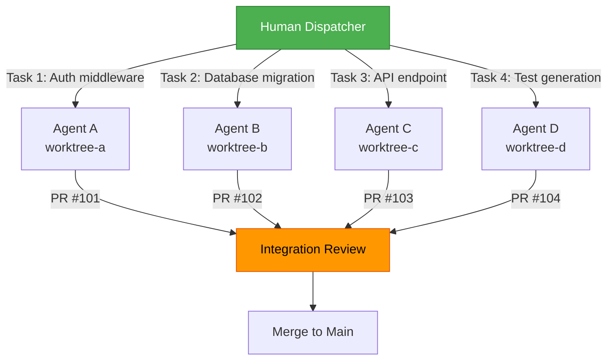
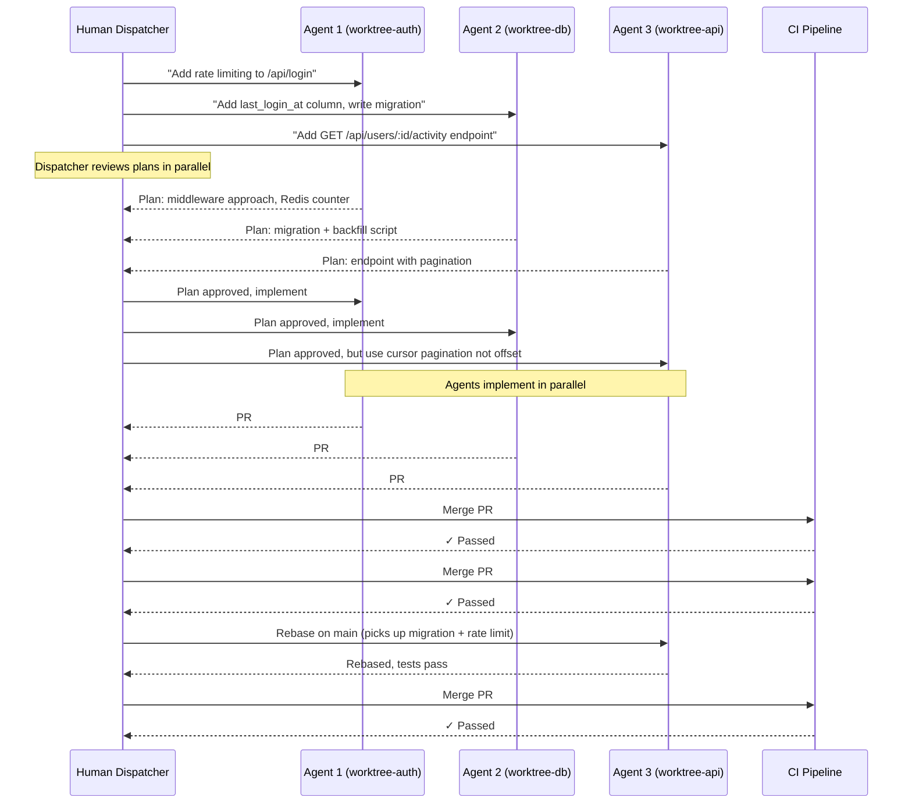
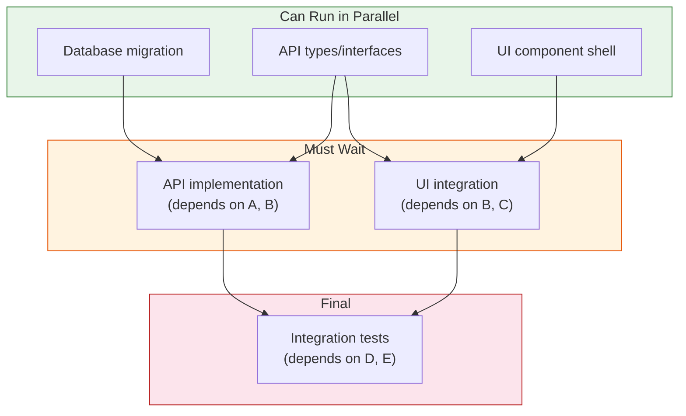
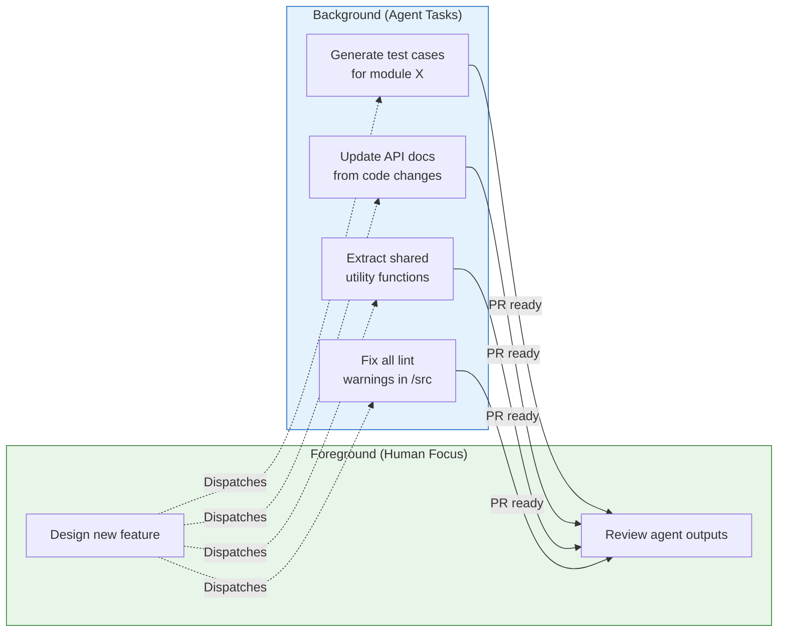
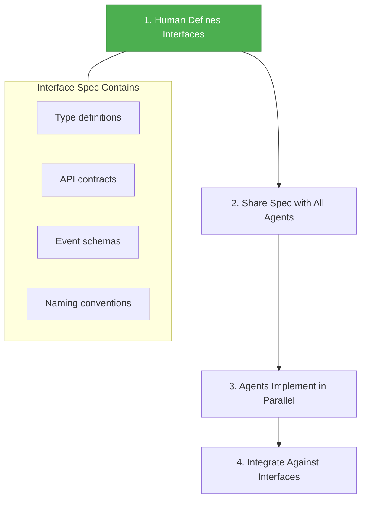
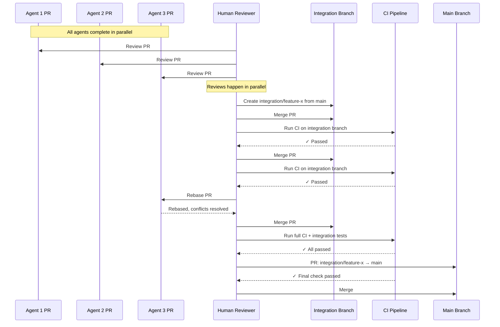
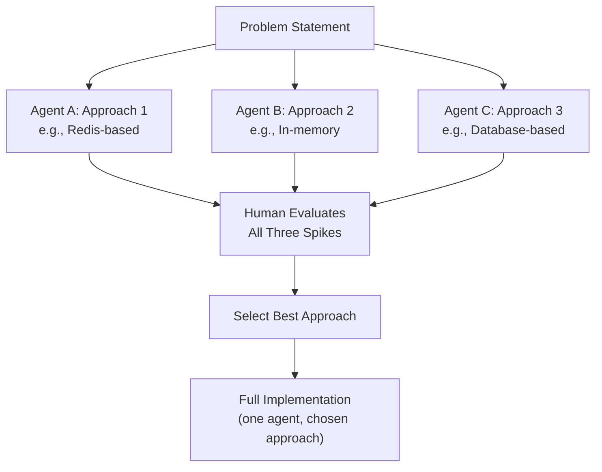
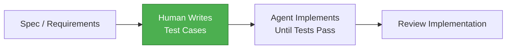
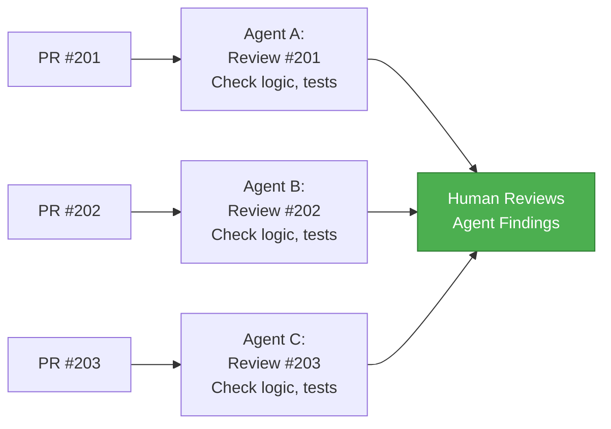
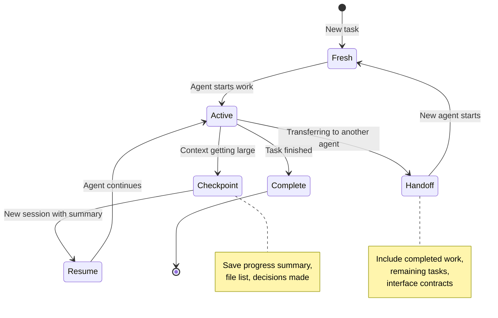

# Compound Development Workflows

## TL;DR

Parallel agent execution requires **explicit decomposition**, **isolation**, and **integration** — the same distributed systems problems applied to development itself. A single engineer dispatching multiple AI agents across worktrees is a coordination problem. The dispatcher pattern, git worktree isolation, and structured integration protocols transform chaotic multi-agent sessions into predictable, scalable workflows. The key insight: **the human is the orchestrator, not the implementer**.

---

## The Dispatcher Pattern

### One Human, N Agents

The dispatcher pattern inverts the traditional development model. Instead of one engineer working serially on tasks, one engineer coordinates multiple agents working in parallel — each in its own isolated context.



### Dispatcher Responsibilities

| Phase | Action | Why |
|-------|--------|-----|
| **Intake** | Receive feature request or bug report | Understand the full scope before splitting |
| **Decompose** | Break into independent, parallelizable units | Minimize inter-task dependencies |
| **Route** | Assign each unit to an agent with appropriate context | Context determines output quality |
| **Gate** | Review plans before implementation begins | Cheapest point to catch misalignment |
| **Monitor** | Check progress, unblock stuck agents | Agents fail silently on ambiguity |
| **Integrate** | Review outputs, resolve conflicts, merge | Only the dispatcher has full-system context |

### Real Session Flow



### Anti-Pattern: Agent-as-Orchestrator

```
❌ Ask one agent to "build the whole feature"
   → Agent works serially (slow)
   → Agent loses context mid-way through large tasks
   → No isolation between components
   → Single point of failure

✅ Human decomposes, agents implement in parallel
   → Parallel execution (fast)
   → Each agent has focused context
   → Failures are isolated
   → Human maintains system-level coherence
```

---

## Work Decomposition for Parallelism

### Decomposition Levels

The granularity of decomposition determines the maximum achievable parallelism and the coordination overhead.

| Level | Granularity | Max Parallelism | Coordination Overhead | Best For |
|-------|-------------|----------------|----------------------|----------|
| **File-level** | Each agent works on different files | High | Low | Independent modules |
| **Module-level** | Each agent owns a module boundary | Medium-High | Medium | Feature development |
| **Feature-flag** | Each agent builds behind a flag | Medium | Low | Incremental delivery |
| **Layer-level** | Frontend / backend / infra split | Medium | Medium-High | Full-stack features |
| **Phase-level** | Design → implement → test | Low | Low | Sequential dependencies |

### Dependency Graph Determines Parallelism



### Decomposition Checklist

Before assigning tasks to parallel agents, verify:

```markdown
- [ ] Each task can be completed without output from another task
- [ ] Each task operates on distinct files (no overlapping edits)
- [ ] Shared interfaces are defined upfront and provided to all agents
- [ ] Each task has a clear acceptance criteria
- [ ] Merge order is determined (which PR lands first?)
- [ ] Integration points are identified (where will outputs connect?)
```

### Decomposition by Example: User Activity Dashboard

| Agent | Scope | Files | Dependencies |
|-------|-------|-------|-------------|
| A | Database layer: migration, model, repository | `src/db/`, `src/models/` | None |
| B | API layer: endpoint, middleware | `src/handlers/`, `src/middleware/` | A (types) |
| C | Frontend: timeline component, activity hook | `src/components/`, `src/hooks/` | B (API contract) |
| D | Testing: integration, component, E2E | `tests/` | A, B, C |

**Shared contract:** `ActivityEvent` interface provided to all agents before start. **Merge order:** A, B, C, D.

### Anti-Pattern: Circular Dependencies

```
❌ Agent A needs Agent B's output, Agent B needs Agent A's output
   → Deadlock: neither can proceed
   → Root cause: insufficient upfront interface design

✅ Extract shared interfaces FIRST, then parallelize
   → Define types and contracts before any agent starts
   → Each agent implements against the interface, not the other agent's code
```

---

## Git Worktree Isolation

### Why Worktrees

Each agent needs its own working directory to avoid file conflicts. Git worktrees [1] provide this without duplicating the repository.

```
# Repository structure with worktrees
project/
├── .git/                    # Shared git database
├── src/                     # Main working tree (main branch)
├── ...
└── (worktrees created outside or inside as needed)

../project-worktrees/
├── worktree-auth/           # Agent A: feature/auth-rate-limit
├── worktree-db/             # Agent B: feature/db-migration
├── worktree-api/            # Agent C: feature/api-activity
└── worktree-tests/          # Agent D: feature/activity-tests
```

### Worktree Commands

```bash
# Setup: Create worktrees for parallel agents
cd /path/to/project

# Create branches from latest main
git fetch origin
git checkout main && git pull

# Create worktrees — each gets its own directory and branch
git worktree add ../project-worktrees/worktree-auth -b feature/auth-rate-limit
git worktree add ../project-worktrees/worktree-db -b feature/db-migration
git worktree add ../project-worktrees/worktree-api -b feature/api-activity
git worktree add ../project-worktrees/worktree-tests -b feature/activity-tests

# List active worktrees
git worktree list
# /path/to/project                    abc1234 [main]
# /path/to/project-worktrees/worktree-auth   def5678 [feature/auth-rate-limit]
# /path/to/project-worktrees/worktree-db     def5678 [feature/db-migration]
# /path/to/project-worktrees/worktree-api    def5678 [feature/api-activity]
# /path/to/project-worktrees/worktree-tests  def5678 [feature/activity-tests]
```

### Agent Assignment

```bash
# Start Agent A in the auth worktree
cd ../project-worktrees/worktree-auth
claude  # Agent A starts with focused context

# Start Agent B in the db worktree (separate terminal)
cd ../project-worktrees/worktree-db
claude  # Agent B starts with focused context

# Start Agent C in the api worktree (separate terminal)
cd ../project-worktrees/worktree-api
claude  # Agent C starts with focused context
```

### Merge Strategies

| Strategy | When to Use | Command |
|----------|-------------|---------|
| **Sequential merge** | Tasks have dependency order | Merge A, rebase B on main, merge B, ... |
| **Integration branch** | All tasks must integrate before main | Create `integration/feature-x`, merge all into it, then PR to main |
| **Feature flag merge** | Tasks are independent, behind flags | Merge all directly to main behind flags |

#### Sequential Merge

```bash
git checkout main
git merge --no-ff feature/db-migration           # no deps, merge first
git checkout feature/api-activity && git rebase main && git checkout main
git merge --no-ff feature/api-activity            # depends on db
git merge --no-ff feature/auth-rate-limit         # independent
git checkout feature/activity-tests && git rebase main && git checkout main
git merge --no-ff feature/activity-tests          # depends on all
```

#### Integration Branch

```bash
git checkout -b integration/user-activity main
git merge --no-ff feature/db-migration
git merge --no-ff feature/auth-rate-limit
git merge --no-ff feature/api-activity
git merge --no-ff feature/activity-tests
npm test
gh pr create --base main --head integration/user-activity \
  --title "feat: user activity dashboard" \
  --body "Integration of parallel agent work"
```

### Cleanup

```bash
git worktree remove ../project-worktrees/worktree-auth
git worktree remove ../project-worktrees/worktree-db
git worktree remove ../project-worktrees/worktree-api
git worktree remove ../project-worktrees/worktree-tests
git worktree prune
git branch -d feature/auth-rate-limit feature/db-migration \
    feature/api-activity feature/activity-tests
```

### Latest Parallel Agent Tooling

The tooling landscape for parallel agent workflows has matured rapidly. Several tools now address the isolation and coordination challenges that previously required manual worktree management.

**Superset IDE** [2] (launched March 2026): An open-source terminal environment purpose-built for running 10+ parallel AI agents simultaneously. Each agent gets its own thread and worktree, with a unified dashboard showing progress, diffs, and cost across all active sessions. The key innovation is the orchestration layer — the dispatcher can see all agent outputs in one view, approve/reject plans, and trigger merges without switching terminals.

**agent-worktree** [3] (GitHub tool): Automates the Git worktree lifecycle for AI coding agents. Instead of manually running `git worktree add`, creating branches, and cleaning up, `agent-worktree` wraps the entire flow: `agent-worktree spawn --task "Add rate limiting" --base main` creates the worktree, branch, and agent session in one command. It also handles cleanup and branch deletion when the agent's PR is merged.

**Codex App** [4] (OpenAI): A cloud-based multi-agent environment where each agent runs in a sandboxed container with its own filesystem, network namespace, and resource limits. The containers are pre-built with common development toolchains. Useful for teams that need stronger isolation than worktrees provide — particularly when agents install dependencies or run build tools that could conflict.

**The core insight:** "Parallelism is not the hard part. Isolation is." [5] — Creating N agents is trivial. Ensuring they do not interfere with each other's files, dependencies, or git state is the real challenge. Worktrees solve file isolation, but the review and merge phase — where parallel work becomes sequential — remains the bottleneck that no tool has fully automated.

**Skills as a cross-tool convention:** The "skills" pattern [6] — drop a folder of reusable agent capabilities into your project, and the agent auto-discovers them — has been adopted across Claude Code [7], Cursor, VS Code (Copilot), GitHub (Actions agents), and Goose. This convergence means skills written for one tool are increasingly portable. A skill that teaches an agent how to run your test suite works regardless of which agent platform invokes it.

### The Isolation Hierarchy

Not all isolation is equal. The right level depends on the task's risk profile, the team's infrastructure, and the cost budget.

| Level | Mechanism | File Isolation | Dependency Isolation | Cost | Use Case |
|-------|-----------|---------------|---------------------|------|----------|
| **Level 0** | Same directory, same branch | None | None | Free | Single agent, sequential work |
| **Level 1** | Same repo, different branches | Partial (uncommitted changes conflict) | None | Free | Low-parallelism, careful coordination |
| **Level 2** | Git worktrees | Full (separate working directories) | Shared (same node_modules, etc.) | Free | Most local parallel workflows |
| **Level 3** | Container sandboxes (Codex App) | Full | Full (each container has own deps) | $0.01-0.10/session | CI/CD agents, untrusted code |
| **Level 4** | Cloud VMs | Complete | Complete | $0.50-5.00/session | Maximum isolation, compliance requirements |

**Level 0** is where most developers start — one agent, one directory. Agents will conflict the moment you try to run two in the same working tree. File locks, partial writes, and git index corruption are common.

**Level 1** seems like it should work, but uncommitted changes in one branch are visible to `git stash` and `git checkout` operations in another. Merge conflicts are likely when branches diverge significantly.

**Level 2 (worktrees)** is the sweet spot for most teams. Each agent gets a fully independent working directory with its own checked-out branch, but all worktrees share the same `.git` database. No repository duplication, no extra disk cost beyond the working files, and full git history available everywhere.

**Level 3 and 4** add dependency and OS-level isolation. These matter when agents install packages, run build tools, or execute untrusted code. A rogue `npm install` in one container cannot corrupt another agent's `node_modules`.

**Decision heuristic:** Use Level 2 (worktrees) for local development workflows. Use Level 3 (containers) for CI/CD agents and when agents install dependencies. Use Level 4 (cloud VMs) only when compliance or security policies require complete separation.

---

## Background Task Patterns

### Fire-and-Review

Some tasks are well-suited to background execution: the agent works independently while the dispatcher focuses elsewhere, returning later to review the output.



### Good Background Tasks

| Task Type | Why It Works in Background | Review Effort |
|-----------|---------------------------|---------------|
| Test generation for existing code | Well-defined scope, existing code as spec | Medium (verify coverage) |
| Documentation updates | Low risk, easily verified | Low (accuracy check) |
| Lint/format fixes | Mechanical, tools verify correctness | Low (skim diff) |
| Type annotation additions | Compiler verifies correctness | Low (type check passes) |
| Dependency updates | CI verifies compatibility | Medium (changelog review) |
| Code migration (syntax upgrades) | Pattern-based, testable | Medium (verify behavior) |

### Poor Background Tasks

| Task Type | Why It Fails |
|-----------|-------------|
| New feature implementation | Needs iterative feedback — agent goes in wrong direction |
| Architecture decisions | Needs human judgment — agent picks "popular" over "appropriate" |
| Security-sensitive changes | Needs expert review during design |
| Cross-module refactors | Needs whole-system understanding |

### Background Task Template

```markdown
## Background Task: [Title]
### Scope: [Exact files/directories]
### Instructions: [Step-by-step]
### Constraints: Do NOT modify files outside scope. No new dependencies.
### Acceptance: All existing tests pass + [task-specific criteria]
### When Done: Create PR with label "background-task"
```

---

## Parallel Agent Coordination

### Shared State Hazards

When multiple agents work in parallel, shared state creates the same hazards as concurrent programming.

| Hazard | Example | Mitigation |
|--------|---------|------------|
| **Write conflict** | Two agents modify the same file | File-level ownership per agent |
| **Schema conflict** | Two agents add migrations with same sequence number | Pre-assign migration numbers |
| **Import conflict** | Two agents add different exports to index.ts | Merge via integration branch |
| **Convention drift** | Agents adopt different naming conventions | Provide style guide in context |
| **Dependency conflict** | Agent A adds lodash, Agent B adds ramda | Pre-approve dependencies |
| **Type conflict** | Two agents define overlapping types | Define shared types upfront |

### Conflict Detection

```bash
# Check all pairs of parallel branches for conflicts before integration
BRANCHES=(feature/auth feature/db feature/api feature/tests)
for i in "${BRANCHES[@]}"; do
    for j in "${BRANCHES[@]}"; do
        if [ "$i" != "$j" ]; then
            git checkout "$i" 2>/dev/null
            if ! git merge --no-commit --no-ff "$j" 2>/dev/null; then
                echo "CONFLICT: $i ↔ $j"
            fi
            git merge --abort 2>/dev/null
        fi
    done
done
```

### Spec-First Coordination Pattern

The most effective coordination strategy: define all interfaces before any agent starts implementing.



### Shared Interface Example

```typescript
// shared-types.ts — created by human BEFORE agents start, read-only for all agents
export interface ActivityEvent {
  id: string;
  userId: string;
  type: 'login' | 'logout' | 'create' | 'update' | 'delete';
  resource: string;
  timestamp: Date;
  metadata: Record<string, unknown>;
}

export interface PaginatedResponse<T> {
  items: T[];
  cursor: string | null;
  hasMore: boolean;
}

export enum ErrorCode {
  NOT_FOUND = 'NOT_FOUND',
  INVALID_INPUT = 'INVALID_INPUT',
  UNAUTHORIZED = 'UNAUTHORIZED',
  RATE_LIMITED = 'RATE_LIMITED',
}
```

---

## The Integration Protocol

### Staged Review and Merge



### Integration Checklist

```markdown
## Pre-Integration
- [ ] All individual PRs reviewed and approved
- [ ] No dependency conflicts between branches
- [ ] Shared types/interfaces match across all branches
- [ ] Migration sequence numbers don't conflict

## During Integration
- [ ] Merge in dependency order (db → api → frontend → tests)
- [ ] Run CI after each merge
- [ ] Resolve conflicts with full context (not just git's suggestion)

## Post-Integration
- [ ] Full test suite passes
- [ ] Integration/E2E tests pass
- [ ] No regressions in existing functionality
- [ ] Performance benchmarks within acceptable range
```

### Conflict Resolution Decision Table

| Conflict Type | Resolution Strategy | Who Resolves |
|---------------|-------------------|--------------|
| Import ordering | Accept either, run formatter | Automated |
| Package lock file | Regenerate from scratch | Automated |
| Same file, different sections | Manual merge | Human |
| Same function, different logic | Choose based on spec | Human |
| Type definition mismatch | Align to shared spec | Human |
| Test file overlap | Combine test suites | Human or Agent |
| Configuration overlap | Merge settings, test | Human |

---

## Workflow Patterns Catalog

### Pattern 1: Spike-and-Converge

**When:** Uncertain about approach, need to explore options.



**Time cost:** 3× agent compute for spike phase, but saves days of wrong-direction implementation.

**Decision criteria for spike evaluation:**

| Criterion | Weight | How to Evaluate |
|-----------|--------|----------------|
| Correctness | 30% | Does it handle all edge cases? |
| Simplicity | 25% | Lines of code, dependency count |
| Performance | 20% | Benchmark results |
| Maintainability | 15% | Readability, test coverage |
| Operational cost | 10% | Infrastructure requirements |

### Pattern 2: Test-First Delegation

**When:** Well-specified behavior, need reliable implementation.



**Why it works:** Tests written by humans encode the spec. The agent's job is reduced to making tests pass — a well-defined, verifiable objective. This eliminates the co-generation problem entirely.

```bash
# Human writes tests first
# tests/auth/rate-limit.test.ts

# Then dispatches to agent with clear instruction:
# "Implement src/middleware/rate-limit.ts to make all tests in
#  tests/auth/rate-limit.test.ts pass. Do not modify the test file."
```

### Pattern 3: Refactor Pipeline

**When:** Large-scale refactoring across many files.

```
PHASE 1: Analysis (1 agent)
  → Identify all usage sites
  → Generate dependency graph
  → Propose refactor plan

PHASE 2: Execution (N agents, parallel)
  → Agent A: Refactor module X
  → Agent B: Refactor module Y
  → Agent C: Refactor module Z
  → Each agent has the shared interface contract

PHASE 3: Verification (1 agent)
  → Run full test suite
  → Check for orphaned imports
  → Verify no behavior changes
```

### Pattern 4: Documentation Sweep

**When:** Docs have drifted from code, need bulk updates.

```
ASSIGNMENT: One agent per documentation area
  → Agent A: API reference docs (reads routes, generates OpenAPI)
  → Agent B: Architecture docs (reads code, updates diagrams)
  → Agent C: README and quickstart (reads setup, verifies steps)
  → Agent D: Inline code comments (reads complex functions, adds JSDoc)

CONSTRAINT: Agents read code, write docs. Never modify source code.
```

### Pattern 5: Review-in-Parallel

**When:** Multiple PRs queued, need faster review throughput.



**Agent review prompt:** Check for logic errors (edge cases, error handling), security issues, test coverage gaps, API contract violations, and performance concerns. Output as BLOCKING / WARNING / NOTE.

### Pattern 6: Security-Concurrent

**When:** Implementing features that touch security boundaries.

```
PARALLEL EXECUTION:
  Agent A: Implement the feature (functional)
  Agent B: Write security test cases (adversarial)
  Agent C: Run threat model analysis (analytical)

INTEGRATION:
  1. Agent B's security tests must pass against Agent A's implementation
  2. Agent C's threat model findings must be addressed
  3. Human reviews the combined output with security focus
```

### Pattern Summary

| Pattern | Parallelism | Risk Level | Best For |
|---------|------------|-----------|----------|
| Spike-and-Converge | Exploration | Low (throwaway) | Architecture decisions |
| Test-First Delegation | Low (sequential) | Low (tests are oracle) | Well-specified features |
| Refactor Pipeline | High (execution phase) | Medium | Large-scale changes |
| Documentation Sweep | High | Low | Bulk doc updates |
| Review-in-Parallel | High | Low | PR queue backlog |
| Security-Concurrent | Medium | Medium-High | Security-sensitive features |

---

## Cost Management

### API Spend as Engineering Concern

AI agent usage has a direct cost component [8]. Unlike human engineers (fixed salary), agent costs scale with usage and must be budgeted like cloud infrastructure.

### Token Budget by Task Type

| Task Type | Estimated Tokens | Model Recommendation | Cost Estimate |
|-----------|-----------------|---------------------|---------------|
| Plan generation | 2K-5K output | Sonnet | $0.02-0.05 |
| Code implementation (small) | 5K-15K output | Sonnet | $0.05-0.15 |
| Code implementation (large) | 15K-50K output | Sonnet | $0.15-0.50 |
| Code review | 3K-10K output | Sonnet | $0.03-0.10 |
| Test generation | 10K-30K output | Sonnet | $0.10-0.30 |
| Architecture spike | 5K-20K output | Opus | $0.30-1.20 |
| Complex debugging | 10K-40K output | Opus | $0.60-2.40 |
| Documentation | 5K-15K output | Sonnet | $0.05-0.15 |
| Lint/format fixes | 2K-8K output | Haiku | $0.002-0.008 |
| Type annotations | 3K-10K output | Haiku | $0.003-0.010 |

### Model Selection Rules

| Signal | Model | Rationale |
|--------|-------|-----------|
| Architecture reasoning, complex debugging, security review | Opus | Requires deep judgment |
| Feature implementation, code review, test generation | Sonnet | Default for most work |
| Formatting, linting, type annotations, simple refactors | Haiku | Mechanical, low-judgment |

### Cost Tracking

Track token usage per task in an append-only log (e.g., `.claude/cost-log.jsonl`). Aggregate weekly to identify expensive task categories and model mismatches.

### Anti-Pattern: Using Opus for Everything

```
❌ Use Opus for all tasks
   → $50/day for work that could cost $5/day
   → No quality improvement for mechanical tasks
   → Budget exhausted before sprint ends

✅ Match model to task complexity
   → Opus for architecture and debugging ($2-5/task)
   → Sonnet for implementation ($0.10-0.50/task)
   → Haiku for mechanical work ($0.01/task)
   → 10× cost reduction with equivalent quality
```

---

## Session Management

### The Context Window Problem

Agent sessions have finite context windows. Long sessions degrade in quality as the context fills with stale information. Effective session management preserves continuity across context boundaries.

### Resume Patterns

| Pattern | When to Use | What to Include |
|---------|-------------|-----------------|
| **Checkpoint summary** | Mid-task pause | Completed items, in-progress items, next steps, key decisions, files modified |
| **Context summarization** | New session resume | Project context, what exists, what needs doing, conventions |
| **Handoff prompt** | Agent-to-agent transfer | Prior agent output, remaining task, interface contract, constraints |

#### Checkpoint Summary Template

```markdown
## Session Checkpoint — 2026-03-15 14:30

### Completed
- [x] Created database migration for activity_events table
- [x] Implemented ActivityEvent model with types

### In Progress
- [ ] API endpoint (handler skeleton exists)

### Next Steps
1. Complete request validation in handler
2. Add cursor-based pagination

### Key Decisions
- Cursor pagination (not offset) — reviewer feedback
- Timestamp-based cursor using created_at
```

#### Handoff Prompt Template

```markdown
## Handoff: Agent A → Agent B

### Agent A's Output
- PR #102 (merged): Database migration + model + repository

### Agent B's Task
Implement GET /api/users/:id/activity endpoint.

### Constraints
- Do NOT modify any files Agent A created
- Follow existing handler patterns in src/handlers/
- Use cursor-based pagination
```

### Session Lifecycle



### Anti-Pattern: Infinite Sessions

```
❌ Keep one agent session running for hours
   → Context window fills with irrelevant history
   → Agent starts contradicting its earlier decisions
   → Quality degrades progressively
   → Errors compound (agent forgets constraints)

✅ Checkpoint every 30-45 minutes of active work
   → Fresh context for each phase
   → Summary preserves decisions without noise
   → Consistent quality throughout the task
   → Clear audit trail of progress
```

---

## Real-World Example

### End-to-End: Converting a Codebase to Use Mermaid Diagrams

**Scenario:** A documentation repository has 47 ASCII diagrams across 4 directories that need Mermaid conversion. Each diagram is independent — ideal for parallel agents.

```bash
# Step 1: Decompose (Human, 10 min)
grep -rl "┌\|├\|└\|│\|───" docs/ | wc -l  # 47 files
# Group A: docs/architecture/ (12), Group B: docs/api/ (10)
# Group C: docs/guides/ (13),      Group D: docs/reference/ (12)

# Step 2: Create worktrees (Human, 2 min)
git fetch origin && git checkout main && git pull
git worktree add ../wt/arch -b refactor/mermaid-architecture
git worktree add ../wt/api -b refactor/mermaid-api
git worktree add ../wt/guides -b refactor/mermaid-guides
git worktree add ../wt/ref -b refactor/mermaid-reference

# Step 3: Dispatch agents — one per worktree (Human, 5 min)
# Each agent gets: file list, conversion instructions, constraints

# Step 4: Integrate (Human, 20 min)
git checkout -b refactor/mermaid-all main
git merge --no-ff refactor/mermaid-architecture
git merge --no-ff refactor/mermaid-api
git merge --no-ff refactor/mermaid-guides
git merge --no-ff refactor/mermaid-reference
npm run docs:build  # verify rendering

# Step 5: Cleanup
git worktree remove ../wt/arch ../wt/api ../wt/guides ../wt/ref
git worktree prune
```

### Results

| Metric | Serial (1 agent) | Parallel (4 agents) |
|--------|-------------------|---------------------|
| Wall clock time | ~2 hours | ~35 minutes |
| Human time | ~30 min (review) | ~40 min (dispatch + review) |
| Agent compute cost | ~$2.00 | ~$2.00 (same total work) |
| Merge conflicts | 0 | 0 (file-level isolation) |
| Conversion errors | ~3 | ~3 (same error rate) |

**Key insight:** Parallel execution reduces wall clock time by ~70% with only marginally more human coordination time. The total compute cost is identical — parallelism is free when tasks are independent.

---

## Key Takeaways

1. **The human is the orchestrator, not the implementer.** The dispatcher pattern inverts the development model: one human coordinates N agents. The human's job is decomposition, routing, gating, and integration — the highest-leverage activities.

2. **Decomposition quality determines parallelism.** Independent tasks can run fully in parallel. Dependent tasks must be sequenced. Investing time in clean decomposition pays dividends in execution speed.

3. **Git worktrees provide free isolation.** Each agent gets its own working directory and branch without duplicating the repository. This eliminates file-level conflicts during parallel execution.

4. **Define interfaces before dispatching agents.** The spec-first coordination pattern — defining shared types and contracts before any agent starts — prevents the most common integration failures.

5. **Match the model to the task.** Use Opus for architecture and complex reasoning, Sonnet for implementation, Haiku for mechanical work. This reduces costs by up to 10× with no quality loss.

6. **Session management is a first-class concern.** Checkpoint summaries, context compression, and handoff prompts maintain quality across context window boundaries. Avoid infinite sessions.

7. **Background tasks are fire-and-review.** Test generation, documentation updates, lint fixes, and type annotations are excellent background tasks. New features and architecture decisions are not.

8. **Integration is where parallel work becomes sequential.** Use integration branches, merge in dependency order, and run CI after each merge. The integration protocol is the critical path.

9. **Cost management is engineering management.** Track token usage by task type. Budget agent spend like cloud infrastructure. The cheapest token is the one you don't send.

10. **Parallel execution time savings are real.** Independent tasks achieve near-linear speedup with parallel agents. The total compute cost is unchanged — you pay the same tokens, just faster.

---

## References

1. [Git — git-worktree Documentation](https://git-scm.com/docs/git-worktree)
2. [Superset IDE — Open-Source Parallel Agent Terminal](https://supersetide.com/)
3. [agent-worktree — Git Worktree Automation for AI Agents](https://github.com/nichochar/agent-worktree)
4. [OpenAI — Codex](https://openai.com/index/introducing-codex/)
5. [Nx Blog — Using Git Worktrees for Parallel Agent Development](https://nx.dev/blog/using-git-worktrees-for-parallel-agent-development)
6. [Anthropic — Claude Code Custom Slash Commands](https://docs.anthropic.com/en/docs/claude-code/slash-commands)
7. [Anthropic — Claude Code Overview](https://docs.anthropic.com/en/docs/claude-code/overview)
8. [Anthropic — API Pricing](https://www.anthropic.com/pricing)
