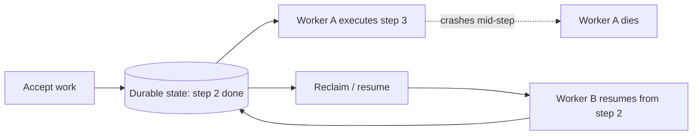

# Workflow System Fundamentals

## TL;DR

A workflow or job system exists to **reliably execute multi-step work across process and machine failures**. The hard part is not running the work — any program can call three functions in sequence. The hard part is surviving the crash *in the middle*, when one of those functions has already committed a side effect and the process holding the next step has died. The defining move of the entire field is **externalizing execution state** so progress survives the worker that was making it. Everything else in this section — background jobs, distributed cron, DAG orchestration, durable execution engines — is a point on a single axis of how strong a durability guarantee you are willing to pay for. And because crashes and networks make exactly-once *delivery* impossible, every reliable system in this family converges on the same trick: at-least-once execution plus [idempotency](../01-foundations/08-idempotency.md) to produce exactly-once *effects*.

---

## The Problem: Memory Is Not Durable

Consider the simplest version of multi-step work: an order checkout that charges a card, decrements inventory, and sends a confirmation email. Written as a function, it is three lines. Run it ten thousand times and a few of them will be interrupted — the process is redeployed mid-execution, the host is preempted, the JVM pauses for a four-second garbage collection and the load balancer kills the connection, the kernel OOM-kills the worker. Whatever step was in flight is now gone, and the world is left in a partial state: card charged, inventory not decremented, no email sent, and no record that any of this happened.

The root cause is that the execution state — *which steps have run, which have not, and what their results were* — lived only in the process's memory and call stack. When the process died, that state died with it. There is nothing to resume from because there is nothing that recorded where we were. This is the single observation the whole field is built on: **a multi-step operation that lives only in a process's memory is lost when the process dies.**

The fix is to take the thing that was implicit in the call stack — "I am between step two and step three" — and make it an explicit, durable record in storage that outlives any individual worker. Once progress is written down somewhere that survives the crash, a *different* process can pick up the work and continue it. The program stops being a function call and becomes a state machine whose current position is persisted. That externalization is what separates a workflow system from a script, and it is the dividing line every pattern in this section sits on the durable side of.

The record in the middle is the whole point: because progress lives outside any worker, the death of Worker A is survivable rather than catastrophic. A fresh worker reads the durable state and continues. Take that record away and the diagram collapses back into a lost call stack.

The reason you do this work off the request path at all is a separate but reinforcing pressure. A synchronous request handler is bounded by a client timeout — typically a few seconds — and is sized for the steady-state request rate. Long-running work (a video transcode, a nightly report, a saga that waits on a human approval) does not fit in that window. Traffic spikes that would overwhelm synchronous capacity can be absorbed as queue depth and drained at a sustainable rate. And retries that would be unsafe to perform while a user waits become routine once the work is owned by a system designed to retry. Moving work off the request path buys latency isolation, load smoothing, and a place to put retry logic — but it does so by introducing the exact durability problem above, which is why the two ideas always travel together.

---

## The Spectrum: One Axis of Increasing Durability

The systems in this section look different on the surface — a Sidekiq worker pool, a Kubernetes CronJob, an Airflow DAG, a Temporal workflow — but they are best understood as a single spectrum of *how much execution state is externalized and how strong the survival guarantee is*. Each rung up the ladder adds durability and recoverability, and pays for it with latency, operational weight, and conceptual complexity.

| Mechanism | What it externalizes | Survives | Gives up | Typical latency floor |
|---|---|---|---|---|
| Fire-and-forget background job | Nothing durable; an in-memory goroutine/thread | Nothing — lost on crash | All durability | microseconds |
| Queue-backed worker pool | The *task* (a message) | The dispatch, not mid-task progress | Mid-task state; ordering | milliseconds |
| Scheduled / cron job | The *schedule* | When to run, not what happened | Per-run progress; dedup is your problem | seconds |
| DAG orchestration | The *dependency graph and per-node status* | Which nodes finished | Fine-grained intra-node state; sub-second latency | seconds to minutes |
| Durable execution engine | The *entire execution history* | Every step, timer, and result | Simplicity, throughput, cost | tens of milliseconds |

**Fire-and-forget** — spawning a background thread to do work after responding — externalizes nothing. It is the cheapest option and the least durable: if the process dies, the work is simply gone, with no record that it was ever owed. This is acceptable only when losing the work is acceptable (a best-effort cache warm, a non-critical metric emit).

**Queue-backed worker pools** externalize the *task itself* as a durable message in a broker like RabbitMQ, Amazon SQS, or a Redis-backed queue such as Sidekiq or Celery. The broker remembers that work is owed even if every worker restarts. What it does *not* remember is progress *within* a task: if a job is three steps in when the worker dies, the redelivered message starts the whole job over. This is the workhorse of the industry and the subject of [background jobs and worker pools](./02-background-jobs-worker-pools.md).

**Scheduled / cron jobs** externalize *when* work should run. A distributed scheduler guarantees the trigger fires even if the machine that "owned" the schedule is gone, but it says nothing about what happens once a run starts — that is back to the queue/worker problem, plus the new problem of making sure a daily job fires once and not zero or three times. See [distributed cron and scheduling](./03-distributed-cron-scheduling.md).

**DAG orchestration** externalizes the *dependency structure and the status of each node*. Airflow, Dagster, and Argo Workflows persist "task A succeeded, task B is running, task C is blocked on A and B," so a scheduler restart re-derives what is runnable rather than restarting the graph. This is the right model for batch and data pipelines where the unit of recovery is a whole task and minute-scale latency is fine. See [DAG orchestration](./05-dag-orchestration.md).

**Durable execution engines** — Temporal, AWS Step Functions, Azure Durable Functions, Cadence, Restate — sit at the top. They externalize the *entire execution history*: every step invocation, every result, every timer, every signal, as an append-only event log. A workflow can be evicted from memory entirely while it waits thirty days for a callback, then be reconstructed on a fresh worker by replaying its history. This buys the strongest guarantee — code that looks sequential but survives any crash at any line — at the cost of determinism constraints, replay overhead, and a heavier mental model. See [durable execution and workflow engines](./04-durable-execution-workflow-engines.md).

The engineering implication is that you do not "choose a framework"; you choose a point on this axis by deciding how bad it is to lose a piece of work or run it twice. The rest of this document is about making that choice deliberately.

---

## The Exactly-Once Illusion

The most common request a designer brings to a job system is "make sure this runs exactly once." It is the one guarantee the system fundamentally cannot give at the delivery layer, and understanding *why* is the conceptual key to the whole section.

The impossibility is a consequence of failure plus networks. Suppose a worker finishes a task and must report "done" to the broker so the task is not redelivered. The acknowledgment can be lost in the network, or the worker can crash in the instant between completing the side effect and sending the ack. The broker, seeing no acknowledgment, has only two choices. If it redelivers, the task may run twice (at-least-once). If it does not, the task may never complete because the work was actually lost before the side effect ran (at-most-once). There is no third option, because the broker cannot distinguish "worker finished but the ack was lost" from "worker died before finishing." This is the [delivery guarantees](../05-messaging/04-delivery-guarantees.md) problem, and Kleppmann's *Designing Data-Intensive Applications* frames it bluntly: exactly-once *delivery* across an unreliable network is not achievable.

What *is* achievable is exactly-once *effects*. The trick, which this entire section returns to, is to accept at-least-once delivery — the safe choice, because losing work is usually worse than repeating it — and then make repetition harmless. A side effect is made idempotent so that performing it twice has the same result as performing it once: charge the card with an idempotency key the payment provider deduplicates on (Stripe's `Idempotency-Key` header is the canonical example), insert with `ON CONFLICT DO NOTHING`, send the email through a dedup table keyed on a message ID. The system delivers at-least-once; the effect happens exactly-once; and the gap between them is closed by application-level idempotency rather than by an impossible delivery guarantee.

This is why [retry, idempotency, and compensation](./06-retry-idempotency-compensation.md) is the load-bearing pattern of the section and why [idempotency](../01-foundations/08-idempotency.md) is a foundational concept the whole family depends on. A workflow engine can give you exactly-once *state transitions* in its own history — it records "step 3 completed" once — but it cannot reach into Stripe or your SMTP provider and make their effects exactly-once for you. The boundary where the engine's guarantee ends and yours begins is the external side effect, and that boundary is where double-execution bugs live.

---

## The Core Reliability Properties

Strip away the frameworks and every system in this section is trying to provide some subset of four properties. Naming them precisely makes it possible to say what a given tool does and does not guarantee.

**Durability of progress** is the property that once work is accepted, the record of it owed and how far it has advanced survives any single process or machine failure. This is the foundational property — the one that distinguishes a job system from a background thread. Its strength varies by rung on the spectrum: a queue durably remembers the task; a durable execution engine durably remembers every step.

**Idempotency** is the property that re-executing a step, because durability forced a retry, does not corrupt state or duplicate effects. Durability and at-least-once delivery *create* re-execution; idempotency is what makes re-execution safe. The two are inseparable — durability without idempotency just means you reliably charge the customer twice.

**Visibility and observability** is the property that an operator can answer "where is this unit of work right now, and why is it stuck?" In a synchronous system the answer is in a stack trace; in an asynchronous system the work is scattered across queues, timers, and workers, and the only way to answer the question is if the system externalized enough state to reconstruct it. A workflow you cannot inspect is a workflow you cannot repair. This is the subject of [workflow observability and replay](./09-workflow-observability-replay.md).

**Recoverability after failure** is the property that the system can return to a correct state after a crash — by resuming in-flight work, retrying failed steps, or compensating for partial completion. Recoverability is what durability is *for*: storing progress is pointless unless something can act on it after the failure. The mechanisms — [leases, heartbeats, and recovery](./08-leases-heartbeats-recovery.md) to detect and reclaim work abandoned by dead workers, and [sagas](../05-messaging/09-saga-pattern.md) to compensate for steps that cannot be rolled back — are how the system turns a durable record into an actual return to correctness.

---

## A Taxonomy: Which Mechanism Fits This Work?

Given a concrete piece of work, the choice of mechanism is driven by four questions, and the most important of them is the last.

**Duration.** How long does the work run? Sub-second work that simply needs to be off the request path is a background job. Work that runs for minutes to hours wants a DAG node or a durable activity with checkpointing. Work that spans *wall-clock* time — waiting days for a shipment, a human approval, or a billing cycle — needs a durable execution engine, because nothing else lets a paused process survive without holding a live worker hostage for the duration.

**Dependency structure.** Is this one independent task, or a graph? A single self-contained unit (resize this image, send this email) is a background job. A fan-out/fan-in graph with explicit ordering — extract, then transform thirty partitions in parallel, then load — is a DAG. A dynamic, data-dependent control flow with loops and conditionals that are awkward to express as a static graph is a durable workflow, where the control flow is just code.

**Scheduling.** Is the work triggered by an event, or by the clock? Event-triggered work (a user action, an upstream completion) flows through queues and workflows. Time-triggered work (every night at 02:00, every five minutes) needs a distributed cron layer to fire the trigger reliably — which then usually starts a job or workflow to do the actual work.

**Blast radius of getting it wrong** — the decisive question. How bad is a *dropped* execution, and how bad is a *double* execution? If both are cheap (a best-effort cache refresh), fire-and-forget is fine. If a dropped execution is unacceptable but a double is harmless because the work is naturally idempotent (recompute a derived value), a plain [message queue](../05-messaging/01-message-queues.md) with at-least-once delivery suffices. If a double execution is *expensive or dangerous* — double-charging a card, shipping two orders, paying a payroll run twice — you need either rigorous idempotency keys at every side effect or a durable engine that tracks completion per step, and you need it regardless of how simple the happy path looks. The cost of a mistaken execution, not the complexity of the logic, is what pulls you up the durability spectrum.

A useful default progression: start with a background job, move to a DAG when the work becomes a dependency graph, and move to a durable execution engine only when the work spans real time *or* when the cost of partial failure justifies tracking every step. Each step up is a real increase in operational burden; do not pay for a guarantee the work does not need, but do not under-buy when a double-execution writes a check your business cannot cash.

---

## Failure Modes

The reason this field exists is a small, recurring set of failures. Each is a direct consequence of asynchrony and externalized state, and naming them is most of designing against them.

**Lost work** is the silent failure: a task is accepted but never runs, because it was held only in memory when a process died, or because an enqueue was lost between a database commit and a broker write. It is the most dangerous failure precisely because nothing errors — there is simply an order that never ships and no log line saying so. The defense is durable acceptance (write the intent to a store the same transaction that does the user-facing work, then dispatch from it — the [outbox pattern](../05-messaging/07-outbox-pattern.md)) and reconciliation that periodically scans for accepted-but-unfinished work.

**Double execution** is the loud-by-its-effects failure: at-least-once delivery, a lost acknowledgment, or two workers grabbing the same task both lead to a side effect happening twice. The defense is idempotency at the side-effect boundary and fencing tokens so a stale worker's late write is rejected.

**Stuck or zombie work** is the worker that took a task, stopped making progress — a deadlock, an infinite retry, a network black hole — but never died cleanly, so its lease never expires and the task is neither done nor reclaimable. The defense is [leases with heartbeats](./08-leases-heartbeats-recovery.md): a worker must periodically prove it is alive, and a lease that stops being renewed is reclaimed and the work redispatched.

**Partial completion** is the multi-step operation interrupted between side effects: card charged, inventory not decremented. Because the steps touch different systems, no single transaction can cover them. The defense is to make the workflow resumable so it can complete the remaining steps, or to [compensate](./06-retry-idempotency-compensation.md) — issue a refund — for the steps that cannot be rolled forward.

**Lost state** is the failure where the *record of progress itself* is corrupted or unreadable: a history log that cannot be replayed because the code changed non-deterministically, a schema migration that orphaned in-flight tasks, a snapshot that expired. It is the worst failure because it removes the ability to recover from any of the others. The defense is treating the execution history as the source of truth, versioning the code that interprets it, and never mutating history in place.

---

## Decision Framework

When designing or reviewing a piece of asynchronous work, a few questions separate a system that survives failure from one that merely works in the demo.

Is the work's acceptance *durable* — written to storage that survives a crash before you tell the client "accepted"? If not, you have fire-and-forget, and you must be certain losing the work is acceptable. Most teams discover too late that it was not.

For every external side effect, is there an *idempotency strategy* — a key, a dedup table, a conditional write — that makes a second execution harmless? If not, at-least-once delivery will eventually double-execute it, because retries are not optional in a system that must not lose work.

Can an operator *find and inspect* a single unit of work and see where it is stuck? If the only way to debug a stuck order is to grep across three services' logs, the system did not externalize enough state, and every incident will be an archaeology project.

When a worker dies mid-task, what *reclaims* the work — a lease timeout, a reconciliation scan, a heartbeat? If the answer is "a human notices," the system is not recoverable; it is monitorable at best.

Does the chosen mechanism match the *blast radius* of failure rather than the complexity of the logic? A three-line function that double-charges a card needs more durability machinery than a thousand-line batch job that is naturally idempotent. The cost of getting it wrong sets the requirement.

A design that answers these well is durable, idempotent, observable, and recoverable. A design that does not is a partial-state generator waiting for its first bad afternoon.

---

## Key Takeaways

1. A workflow or job system exists to reliably execute multi-step work across process and machine failures; the hard part is surviving the crash in the middle, not running the work.
2. The defining move of the field is externalizing execution state — turning the implicit "where am I" of a call stack into a durable record so progress survives the worker.
3. The systems in this section form one axis of increasing durability: fire-and-forget → queue-backed worker pools → scheduled cron → DAG orchestration → durable execution engines, each buying survival with latency and complexity.
4. Exactly-once *delivery* is impossible across an unreliable network; real systems use at-least-once delivery plus idempotency to achieve exactly-once *effects*.
5. The boundary where an engine's exactly-once state transitions end and your responsibility begins is the external side effect — and that boundary is where double-execution bugs live.
6. The four reliability properties are durability of progress, idempotency, visibility/observability, and recoverability; durability without idempotency just means reliably executing twice.
7. You move work off the request path to buy latency isolation, load smoothing, and a safe place for retries — and you inherit the durability problem in exchange.
8. Choose a mechanism by duration, dependency structure, scheduling, and above all the blast radius of a dropped or doubled execution — cost of failure, not logic complexity, sets the requirement.
9. The recurring failure modes are lost work, double execution, stuck/zombie work, partial completion, and lost state; each follows directly from asynchrony plus externalized state.
10. Treat the execution history as the source of truth, version the code that interprets it, and never mutate it in place — losing the record of progress removes the ability to recover from everything else.

---

## Related Patterns

- [Background Jobs and Worker Pools](./02-background-jobs-worker-pools.md)
- [Distributed Cron and Scheduling](./03-distributed-cron-scheduling.md)
- [Durable Execution and Workflow Engines](./04-durable-execution-workflow-engines.md)
- [DAG Orchestration](./05-dag-orchestration.md)
- [Retry, Idempotency, and Compensation](./06-retry-idempotency-compensation.md)
- [Leases, Heartbeats, and Recovery](./08-leases-heartbeats-recovery.md)
- [Workflow Observability and Replay](./09-workflow-observability-replay.md)
- [Message Queues](../05-messaging/01-message-queues.md)
- [Delivery Guarantees](../05-messaging/04-delivery-guarantees.md)
- [Saga Pattern](../05-messaging/09-saga-pattern.md)
- [Outbox Pattern](../05-messaging/07-outbox-pattern.md)
- [Idempotency](../01-foundations/08-idempotency.md)
- [Distributed Locks](../01-foundations/09-distributed-locks.md)

---

## References

1. [Designing Data-Intensive Applications](https://dataintensive.net/) — Martin Kleppmann, 2017 (Ch. 8–9 and 11 on faults, consistency, and exactly-once semantics)
2. [Temporal Documentation: Workflows and Determinism](https://docs.temporal.io/workflows) — Temporal Technologies
3. [AWS Step Functions Developer Guide](https://docs.aws.amazon.com/step-functions/latest/dg/welcome.html) — Amazon Web Services
4. [Azure Durable Functions Overview](https://learn.microsoft.com/en-us/azure/azure-functions/durable/durable-functions-overview) — Microsoft
5. [Apache Airflow: Concepts](https://airflow.apache.org/docs/apache-airflow/stable/core-concepts/index.html) — Apache Software Foundation
6. [Cadence: A Scalable, Fault-Tolerant Workflow System](https://www.uber.com/blog/cadence-multi-tenant-orchestration/) — Uber Engineering, 2020
7. [Stripe API: Idempotent Requests](https://docs.stripe.com/api/idempotent_requests) — Stripe
8. [Big(ger) Sets: Durable Execution and the End of the Crash-Loop](https://restate.dev/blog/durable-execution-and-the-end-of-failure-handling/) — Restate
9. [Exactly-Once Semantics Are Possible: Here's How Kafka Does It](https://www.confluent.io/blog/exactly-once-semantics-are-possible-heres-how-apache-kafka-does-it/) — Confluent, 2017
10. [Sidekiq Best Practices: Make Jobs Idempotent and Transactional](https://github.com/sidekiq/sidekiq/wiki/Best-Practices) — Sidekiq Wiki
