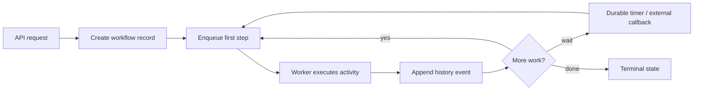
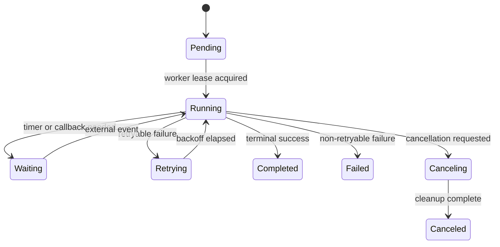
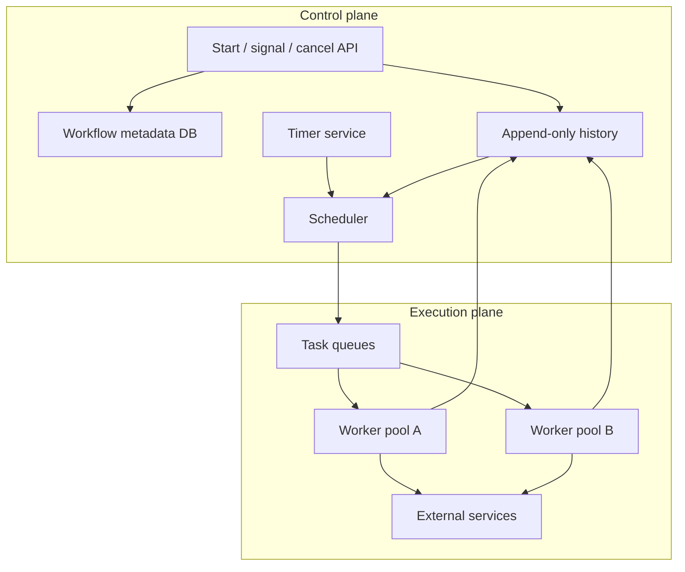

# Workflow System Fundamentals

Workflow systems coordinate work that is too slow, failure-prone, stateful, or cross-service to keep inside a single request. A good workflow system makes progress durable: every state transition is recorded, every retry is bounded, and every external side effect is tied to an idempotency strategy. The core design problem is not "run code later"; it is "advance a business process despite crashes, duplicate delivery, partial failure, and changing code."

## The Problem

Request/response systems are a bad fit for long-running work:

- The client timeout is shorter than the business process.
- One logical operation touches many services.
- A step may need to wait for time, inventory, payment settlement, human approval, or a third-party callback.
- Failures happen after some side effects already committed.
- Operators need to answer "where is this order/import/model training run now?"

You can solve the first version with a queue. You need a workflow system when the queue message becomes a process with state.



## Workflow vs Queue vs DAG

| Pattern | Best for | State owner | Typical failure mode |
|---|---|---|---|
| Message queue | Independent background tasks | Consumer code plus queue offset | Duplicate execution, poison messages |
| Workflow engine | Stateful business processes | Durable workflow history | Non-deterministic replay, bad compensation |
| DAG orchestrator | Data or batch dependency graphs | Scheduler metadata DB | Backfill storms, stuck dependencies |
| Distributed cron | Time-triggered jobs | Schedule store and lease owner | Missed ticks, duplicate ticks |

These overlap. A workflow engine often uses queues internally; a DAG system is a workflow engine specialized for dependency graphs; distributed cron often starts workflows.

## Core Model

A workflow has four persistent objects:

| Object | Purpose |
|---|---|
| Workflow definition | The versioned code or declarative graph that describes allowed transitions |
| Workflow instance | A single run, such as `order-123-refund` or `daily-report-2026-06-15` |
| History | Append-only events: started, step scheduled, step completed, timer fired, failed |
| Work item | A leaseable task a worker can execute now |

The important design choice is that **history is the source of truth**. A queue item may disappear, a worker may die, and an API process may restart. The history remains the durable proof of what happened.

## State Machine



Terminal states must be explicit. "No queue messages left" is not a reliable terminal condition because messages can be delayed, lost by a bug, or waiting in another partition.

## Guarantees

Most workflow systems can provide:

- Durable start: once the start call commits, the workflow can be recovered.
- At-least-once activity execution: an activity may run more than once after worker crash or timeout.
- Exactly-once state transition: the workflow history should record each logical transition once.
- Durable timers: waiting does not require a live process.
- Recoverable progress: a scheduler can rebuild runnable work from history.

They usually cannot provide exactly-once external side effects. Use [idempotency](../01-foundations/08-idempotency.md), fencing, dedupe tables, and compensating actions.

## Reference Architecture



Separate the control plane from execution. The control plane decides what should run; workers do the side-effecting work. This separation lets you scale workers independently, drain worker pools during deploys, and recover runnable tasks from metadata.

## Design Questions

1. What is the unit of idempotency: workflow, step, side effect, or request?
2. Which state transitions must be strongly consistent?
3. How long can a workflow run?
4. Can old workflow definitions continue after new code deploys?
5. What happens when a worker dies after doing the external side effect but before recording completion?
6. What is the maximum fan-out per workflow instance?
7. Who owns cancellation semantics?
8. How will operators inspect, replay, and repair a stuck instance?

## Storage Model

Minimal relational schema:

```sql
CREATE TABLE workflow_instances (
  id TEXT PRIMARY KEY,
  type TEXT NOT NULL,
  status TEXT NOT NULL,
  version INT NOT NULL,
  created_at TIMESTAMPTZ NOT NULL,
  updated_at TIMESTAMPTZ NOT NULL
);

CREATE TABLE workflow_events (
  workflow_id TEXT NOT NULL,
  sequence BIGINT NOT NULL,
  event_type TEXT NOT NULL,
  payload JSONB NOT NULL,
  created_at TIMESTAMPTZ NOT NULL,
  PRIMARY KEY (workflow_id, sequence)
);

CREATE TABLE workflow_tasks (
  id TEXT PRIMARY KEY,
  workflow_id TEXT NOT NULL,
  task_type TEXT NOT NULL,
  status TEXT NOT NULL,
  run_after TIMESTAMPTZ NOT NULL,
  lease_owner TEXT,
  lease_until TIMESTAMPTZ
);
```

The `workflow_events` primary key gives each transition a total order per workflow. That order is what makes replay and debugging possible.

## Failure Modes

| Failure | Symptom | Mitigation |
|---|---|---|
| Worker crash after side effect | Step repeats and charges/sends twice | Idempotency keys at the external service boundary |
| Lost task enqueue | Workflow stuck despite valid next step | Reconciliation scans history and regenerates tasks |
| Timer service outage | Delayed execution | Store timers durably; scan overdue timers |
| Hot workflow fan-out | Scheduler overload | Fan-out limits, child workflows, batching |
| Non-deterministic workflow code | Replay diverges | Versioned code paths, deterministic APIs |
| Unbounded history | Slow replay and large rows | Continue-as-new, snapshots, history compaction |

## Operational Metrics

- Workflow start rate and completion rate.
- Running, waiting, failed, and stuck instance counts.
- Scheduler lag: now minus oldest runnable task.
- Timer lag: now minus oldest overdue timer.
- Activity retry rate by type and error class.
- Queue depth and age by task queue.
- Worker lease expirations.
- History append latency and conflict rate.
- Manual repair count.

## When to Use

Use a workflow system when:

- A process spans multiple services or commits.
- Work must survive process restarts and deploys.
- Waiting is part of the business logic.
- Operators need a durable audit trail.
- Compensation is more realistic than a global transaction.

## When Not to Use

Avoid a workflow engine when:

- The task is short, stateless, and naturally idempotent.
- A plain [message queue](../05-messaging/01-message-queues.md) with retries is enough.
- You cannot define ownership for stuck workflow repair.
- The team will hide arbitrary application logic inside workflows without versioning discipline.

## Related Patterns

- [Message Queues](../05-messaging/01-message-queues.md)
- [Delivery Guarantees](../05-messaging/04-delivery-guarantees.md)
- [Saga Pattern](../05-messaging/09-saga-pattern.md)
- [Idempotency](../01-foundations/08-idempotency.md)
- [Distributed Locks](../01-foundations/09-distributed-locks.md)
