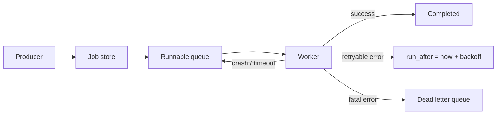
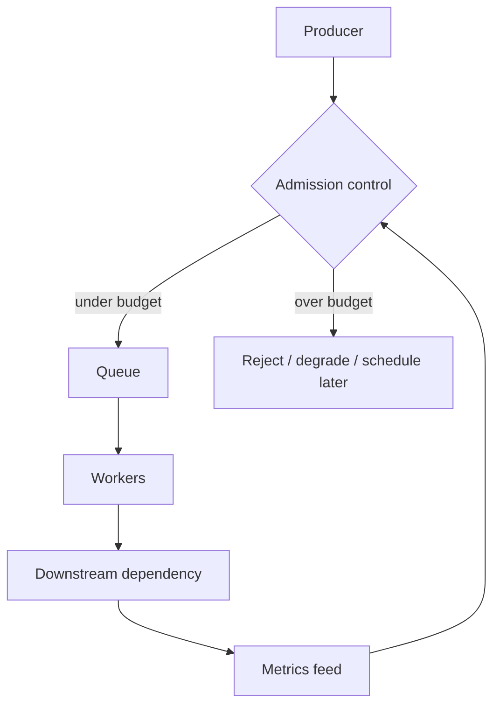

# Background Jobs and Worker Pools

Background job systems execute work outside the request path: emails, exports, image processing, billing reconciliation, cache warming, webhook delivery, and cleanup. The hard parts are not enqueueing and consuming. The hard parts are duplicate execution, capacity isolation, graceful shutdown, poison jobs, unbounded retries, and proving that old work is still making progress.

## Mental Model

A job is a durable intent to perform work. A worker lease is a temporary right to attempt it.



The queue is not the source of truth unless it can represent all job states, retries, attempts, and leases durably. Many production systems use both: a database for truth and a queue for wakeups.

## Job Lifecycle

| State | Meaning |
|---|---|
| Pending | Created but not runnable yet |
| Runnable | Eligible for a worker |
| Leased | A worker owns the attempt until `lease_until` |
| Succeeded | Terminal success |
| Retryable failed | Failed but will run again after backoff |
| Dead | Terminal failure after policy exhaustion |
| Canceled | Terminal cancellation before completion |

Do not model every failure as a boolean. You need attempt count, next run time, error class, and last heartbeat for useful operations.

## Worker Lease Pattern

```sql
UPDATE jobs
SET lease_owner = :worker_id,
    lease_until = now() + interval '5 minutes',
    attempts = attempts + 1
WHERE id = (
  SELECT id
  FROM jobs
  WHERE status = 'runnable'
    AND run_after <= now()
    AND (lease_until IS NULL OR lease_until < now())
  ORDER BY priority DESC, run_after ASC
  FOR UPDATE SKIP LOCKED
  LIMIT 1
)
RETURNING *;
```

The lease gives recovery a clean rule: if the worker does not finish or heartbeat before expiration, another worker may retry. The activity itself must still be idempotent because the old worker might be slow rather than dead.

## Queue Design

| Design | Strength | Risk |
|---|---|---|
| Broker-only queue | Simple and high throughput | Harder to inspect and repair complex state |
| Database-backed jobs | Strong inspectability and transactions | Polling and locking can bottleneck |
| DB truth plus broker wakeup | Durable state plus responsive workers | More moving parts and reconciliation |
| Partitioned queues | High scale and isolation | Rebalancing and hot partition complexity |

## Worker Pool Sizing

Worker capacity should be set by bottleneck, not by queue depth alone.

| Bottleneck | Scaling signal | Protection |
|---|---|---|
| CPU-bound jobs | CPU saturation and run duration | Worker autoscaling |
| DB-bound jobs | DB connections, lock waits, query latency | Concurrency caps per job type |
| Third-party API | 429s, timeout rate, vendor quotas | Token bucket per integration |
| Memory-heavy jobs | RSS, OOM kills, spill rate | Job class isolation |

Queue depth without age is misleading. A queue with 1M tiny jobs may be healthy; a queue with 10 old payment jobs may be an incident.

## Graceful Shutdown

Workers need a deploy contract:

1. Stop accepting new leases.
2. Finish current jobs within a drain window.
3. Heartbeat long jobs while draining.
4. Release or let expire unfinished leases.
5. Persist enough progress for resumed execution.

If deploys kill workers abruptly, every deploy becomes a duplicate-execution test.

## Retry Policy

Retries should be explicit by error class.

| Error | Retry? | Policy |
|---|---|---|
| Network timeout | Yes | Exponential backoff with jitter |
| Database deadlock | Yes | Short bounded retry |
| 429 rate limit | Yes | Backoff from `Retry-After` or quota state |
| Validation error | No | Mark dead with clear reason |
| Missing dependency | Maybe | Retry only if dependency can appear later |

Use [idempotency](../01-foundations/08-idempotency.md) for all side effects. Retries without idempotency are data corruption with a delay.

## Poison Jobs

A poison job always fails and consumes worker capacity forever unless isolated.

Mitigations:

- Maximum attempts.
- Dead letter queue with reason and payload.
- Per-error-class retry budgets.
- Circuit breaker for failing downstreams.
- Quarantine queues for suspicious job types.
- Manual replay tooling after code or data repair.

## Backpressure

Producer admission is part of the job system. If producers can enqueue infinite work, the queue becomes a latency debt ledger.



Use [backpressure](../06-scaling/07-backpressure.md) from workers and downstreams to shape producer behavior.

## Operational Metrics

- Queue depth by job type, tenant, and priority.
- Oldest runnable job age.
- Job duration histogram by type.
- Attempts per success.
- Retry rate and dead letter rate.
- Lease expiration count.
- Worker utilization and active leases.
- Downstream latency and throttling.
- Time to drain during deploy.

## Failure Modes

| Failure | Cause | Fix |
|---|---|---|
| Duplicate side effects | Lease expires while old worker still runs | Idempotency key and fencing token |
| Queue starvation | High-priority jobs never stop | Aging, quotas, fair scheduling |
| Retry storm | Dependency outage triggers synchronized retries | Jitter, circuit breaker, global retry budget |
| Hidden stuck jobs | Only queue depth is monitored | Alert on oldest age and terminal state ratios |
| Worker pool collapse | One job class exhausts memory or DB connections | Isolate pools and set per-type concurrency |

## Related Patterns

- [Message Queues](../05-messaging/01-message-queues.md)
- [Dead Letter Queues](../05-messaging/08-dead-letter-queues.md)
- [Backpressure](../06-scaling/07-backpressure.md)
- [Circuit Breakers](../06-scaling/06-circuit-breakers.md)
