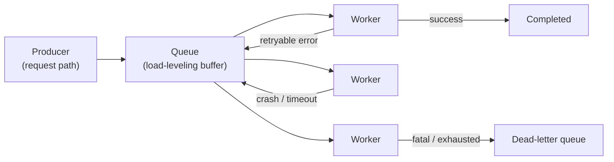

# Background Jobs and Worker Pools

## TL;DR

A background job system is a queue-backed producer/consumer architecture: the request path (the producer) enqueues a durable description of work, a queue buffers it, and a pool of workers (the consumers) executes it asynchronously. The point is to take slow, spiky, retryable, or long-running work *off* the synchronous request path so user-facing latency stays bounded and load gets smoothed across time. The queue is the load-leveling buffer that absorbs bursts; the worker pool is the concurrency-control mechanism that bounds how much work runs at once and protects downstream systems. The defining reliability property is that delivery is *at-least-once* in practice, which means every job must be idempotent — and the operational discipline is mostly about poison messages, dead-letter quarantine, queue-depth-driven autoscaling, and proving that old work is still making progress.

---

## Why Offload Work to the Background at All

The synchronous request path has a hard constraint that a background system does not: a user is waiting. A request that holds a connection open for thirty seconds while it resizes an image, calls three third-party APIs, and writes a PDF is burning a worker thread, a database connection, and the user's patience, and it fails entirely if any one of those steps times out. The insight behind background jobs is that most of that work does not *need* to happen before the response. The user needs to know their upload was accepted; they do not need to wait for the thumbnail to render. So the request path does the minimum required to make a durable promise — "we have your work, it will be done" — and hands the rest to a system designed to do it reliably, out of band.

Four properties make work a candidate for the background. **Slowness**: anything whose latency would blow the request budget — video transcoding, report generation, bulk email. **Spikiness**: work that arrives in bursts, like the flood of webhook deliveries after a popular event, where the queue absorbs the spike and workers drain it at a steady rate the downstream can tolerate. **Retryability**: work that calls flaky dependencies and may need several attempts, which is intolerable to make a user wait through. **Long-running or scheduled**: nightly billing reconciliation, cache warming, cleanup sweeps that have no request to attach to at all. The common thread is that the work is *important but not interactive*, and decoupling it from the request lets each side scale and fail independently.

The trade the system makes is latency for reliability and smoothness. A background job is almost always *slower* end-to-end than doing the work inline — it waits in a queue, it may be retried — but it is far more *reliable*, because the queue is durable, the work survives a worker crash, and a burst that would have melted the synchronous tier instead just lengthens the queue. You are trading immediate completion for bounded request latency and a buffer against overload.

---

## The Producer / Queue / Consumer Architecture

The architecture has three roles, and the whole design follows from keeping them decoupled. **Producers** are usually the request path: they validate the work, persist a durable job description, and return immediately. **The queue** is the durable buffer that holds runnable jobs and decouples producer rate from consumer rate. **Consumers** are the worker pool that pulls jobs and executes them. The producer never calls the worker directly; it only writes to the queue. This indirection is the entire value proposition — it is what lets producers and consumers scale, deploy, and fail on independent schedules.

A job is best understood as *a durable intent to perform work*, and a worker's claim on it as *a temporary lease* rather than ownership. That distinction is the key to recovery: if a worker dies mid-job, its lease expires and the job becomes runnable again, because the job's truth lives in the queue, not in the dead worker's memory. The queue is the load-leveling buffer in the precise sense described in [Message Queues](../05-messaging/01-message-queues.md): producers can briefly exceed consumer capacity without anything breaking, because the excess accumulates as queue depth instead of as dropped work or timed-out requests. Queue depth is not a problem to be eliminated; it is the shock absorber doing its job. The problem is only depth that *grows without bound* or *ages without draining*.

A practical decision the architecture forces is where the source of truth lives. A broker-only design (the queue *is* the store, as with Amazon SQS or RabbitMQ) is simple and high-throughput but harder to inspect and repair when job state gets complex. A database-backed design (jobs are rows, as in Sidekiq's competitor `delayed_job` or `que`) gives strong inspectability and transactional enqueue but can bottleneck on polling and locking. Many mature systems use both: a database for durable truth and a broker for low-latency wakeups. The rule is that whichever component is authoritative must be able to represent *all* job states — pending, in-flight, retrying, dead — durably, or recovery will lose work.

---

## Job Lifecycle: More Than Success or Failure

The most common modeling mistake is treating a job as a boolean that either succeeded or failed. A useful job system tracks a richer lifecycle, because operations depend on the states *between* enqueue and completion.

| State | Meaning |
|---|---|
| Pending | Created but not yet eligible to run (scheduled for later, or awaiting a dependency) |
| Runnable | Eligible; waiting for a free worker |
| In-flight (leased) | A worker holds the lease and is executing; invisible to other workers until the lease expires |
| Succeeded | Terminal success |
| Retrying | Failed with a retryable error; will run again after backoff |
| Dead | Terminal failure after the retry policy is exhausted; quarantined in the DLQ |
| Canceled | Terminal cancellation before completion |

The fields that make these states operable are *attempt count*, *next run time*, *error class*, and *last heartbeat*. Without attempt count you cannot enforce a retry ceiling; without next-run-time you cannot back off; without error class you cannot decide whether a failure is even retryable; without a heartbeat you cannot tell a slow job from a dead one. A job system that records only "failed: true" has thrown away exactly the information its operators will need at 3 a.m.

---

## Delivery Semantics: At-Least-Once and the Visibility Timeout

The single most important fact about background job systems is that, in practice, delivery is **at-least-once**, not exactly-once. The reason is unavoidable. A worker pulls a job, executes it, and must then acknowledge completion. If the worker crashes *after* doing the work but *before* the acknowledgment lands, the system has no way to know the work was done — so it will hand the job to another worker, and the work runs twice. The only way to avoid this would be to make "do the work" and "acknowledge" a single atomic operation across the worker and an external downstream, which distributed systems cannot guarantee. Exactly-once *delivery* is a myth; the achievable goal is exactly-once *effect*, and that is achieved by making jobs idempotent rather than by making delivery perfect.

The mechanism that implements at-least-once in queue systems is the **visibility timeout** (Amazon SQS's term; equivalently the *in-flight* or *lease* window). When a worker receives a message, the queue does not delete it — it hides it for a configured duration, the visibility timeout. The worker is expected to finish and explicitly delete (acknowledge) the message within that window. If it does, the message is gone for good. If the worker crashes, hangs, or simply takes too long, the timeout elapses, the message becomes visible again, and another worker picks it up. SQS defaults this timeout to 30 seconds and allows up to 12 hours; for long jobs the worker must *extend* the visibility window (heartbeat) as it works, or risk having the job re-delivered to a second worker while the first is still running.

This is precisely why idempotency is non-negotiable, and why the [retry, idempotency, and compensation](./06-retry-idempotency-compensation.md) discipline is a hard dependency of any job system. A lease expiring does *not* prove the original worker is dead — it may just be slow, paused by a long GC, or stuck on a network call. So at the moment a second worker picks up the job, two workers may be executing it concurrently. If the work is "charge the customer's card," running it twice is a duplicate charge. The defense is an idempotency key carried with the job, checked against a durable record of completed effects, so the second execution is a no-op. Retries without idempotency are not a safety net; they are data corruption on a timer.

---

## The Worker Pool as a Concurrency-Control Mechanism

It is tempting to view the worker pool merely as "the things that do the work," but its more important role is *bounding concurrency*. The pool size is the maximum number of jobs that can run simultaneously, and that bound is what protects every system downstream of the workers. A pool of 50 workers means a shared database sees at most 50 concurrent job connections, a third-party API sees at most 50 concurrent calls. The pool is, in effect, a built-in backpressure and rate-limiting layer for the work it executes.

This makes pool sizing a balancing act with a failure mode on each side. **Too few workers** and the queue backs up: jobs sit runnable for minutes or hours, latency-sensitive work (a password-reset email) waits behind bulk work (a million-row export), and the system falls behind faster than it drains. **Too many workers** and the pool overwhelms its downstreams: 500 workers all hammering a database that can serve 100 concurrent queries will drive lock contention, connection exhaustion, and a cascading slowdown that makes *every* job slower — the workers spend their time waiting on a downstream they themselves saturated. The right size is set by the *bottleneck resource*, not by the queue depth. If jobs are CPU-bound, size to cores and watch run duration; if they are database-bound, size to the connection pool and lock-wait latency; if they call a rate-limited third-party API, size to the vendor's quota and put a token bucket in front of it; if they are memory-heavy, size to RSS and isolate them so one job class cannot OOM the others.

The deeper principle is *isolation*. A single worker pool that runs every job type couples them: one runaway job class — one that leaks memory, or hammers a slow dependency — can starve every other job of workers. Mature systems run separate pools (or separate queues with dedicated concurrency caps) per job class, so a backlog in "video transcoding" cannot delay "send login email." This is the same fault-isolation logic that motivates [priority, fairness, and backpressure](./07-priority-fairness-backpressure.md) within a job system: without it, the slowest, greediest job type sets the latency for all of them.

---

## Poison Messages and the Dead-Letter Queue

A **poison message** (or poison job) is one that fails *every* time it is attempted — a malformed payload, a reference to a deleted record, a bug triggered by one specific input. Under at-least-once delivery with retries, a poison job is uniquely destructive: it never succeeds, so it is never acknowledged, so it is re-delivered, retried, and fails again, forever. Worse, it consumes a worker slot on every attempt, and if it sits at the head of an ordered queue it can block every job behind it. A single poison job, left unmanaged, can degrade an entire pool.

The standard remedy is the **dead-letter queue** (DLQ): a separate queue where a job is quarantined after it exceeds a maximum number of failed attempts. In SQS this is configured with a *redrive policy* and a `maxReceiveCount` — after a message has been received that many times without being deleted, the queue automatically moves it to the designated DLQ. The DLQ does three things at once: it *stops the bleeding* by removing the poison job from the main flow so healthy jobs drain normally; it *preserves the evidence* by keeping the full payload and failure context for inspection; and it *creates a control point* where operators (or automated tooling) can examine the failures, fix the underlying code or data, and replay the jobs back onto the main queue. The DLQ turns a job that would have poisoned the pool forever into a bounded, inspectable backlog that a human can triage. The operational rule is simple: every job queue should have a DLQ, every DLQ should be *monitored* (a growing DLQ is an incident signal, not a place jobs go to be forgotten), and replay tooling should exist *before* it is needed. The [dead-letter queue](../05-messaging/08-dead-letter-queues.md) pattern is the messaging-layer foundation this builds on.

Retries themselves must be classified by error, not applied blindly. A network timeout or a database deadlock is *transient* and deserves exponential backoff with jitter (jitter matters — synchronized retries after a dependency recovers create a thundering herd). A `429 Too Many Requests` should back off according to the vendor's `Retry-After`. But a validation error or a malformed payload is *deterministic*: retrying it three times only wastes capacity and delays the inevitable trip to the DLQ, so it should fail fast with a clear reason. Conflating retryable and non-retryable failures is its own bug — it turns a clear, immediate "this input is bad" into an intermittent mystery that burns workers on its way to the DLQ anyway.

---

## Job Design Rules

Because the delivery model is at-least-once and workers are disposable, job *design* — not just job infrastructure — determines whether a system is reliable. A handful of rules separate a robust job from a fragile one.

**Keep jobs small and single-purpose.** A job that does ten things has ten ways to fail and, on retry, redoes the nine that already succeeded. Decompose long sequences into small jobs that each do one unit of work and enqueue the next, so a failure retries only the failed unit. Small jobs also drain faster and parallelize better across the pool.

**Pass references, not payloads.** Enqueue an `order_id`, not the entire order object; a pointer to an uploaded file in object storage, not the file's bytes. Large payloads bloat the queue, hit broker message-size limits (SQS caps a message at 256 KB), and embed a stale snapshot of data that may have changed by the time the worker runs. The worker should fetch the current state from the system of record when it executes.

**Make every job idempotent.** Assume the job will run more than once and design so that a second execution is harmless — guard side effects with an idempotency key checked against a durable record, use conditional writes, design operations to converge to the same state regardless of how many times they run. This is the property that turns at-least-once delivery from a liability into a non-issue.

**Set timeouts on everything.** A job with no timeout that hangs on a network call holds its worker slot and its lease indefinitely; enough hung jobs and the pool is fully occupied doing nothing. Every job needs a wall-clock timeout shorter than its lease, and every external call inside it needs its own timeout, so a stuck dependency fails the job cleanly instead of silently consuming capacity.

---

## Throughput, Latency, and Autoscaling on Queue Depth

The right signal for scaling a worker pool is **queue depth** — and specifically the *age of the oldest runnable job* — not CPU utilization. This is one of the most common autoscaling mistakes. CPU-based autoscaling fails for I/O-bound jobs: a pool of workers blocked on a slow third-party API shows low CPU even as the queue grows to thousands of jobs, so a CPU-driven autoscaler scales *down* exactly when it should scale up. Queue depth, by contrast, directly measures the gap between arrival rate and service rate, which is precisely what more workers can close. AWS supports this directly: the SQS `ApproximateNumberOfMessagesVisible` metric (or the *backlog per instance* derived from it) is the recommended CloudWatch target for scaling a consuming fleet, and Kubernetes event-driven autoscalers like KEDA scale worker deployments on queue length out of the box.

Depth alone is still misleading without *age*. A queue holding one million tiny, fast jobs may be perfectly healthy and draining in seconds; a queue holding ten payment jobs that have been runnable for twenty minutes is an active incident. The headline metric for "is this system keeping its promise?" is therefore the oldest-job age, because it is the closest proxy for the latency a producer's work will actually experience. The other essential signals are job duration histograms by type, attempts-per-success, retry rate, DLQ arrival rate, lease-expiration count, and downstream latency — together they distinguish "we need more workers" from "a downstream is sick and more workers will only make it sicker."

That last distinction is the **thundering-herd / stampede** risk, and it is why scaling workers is not always the answer. When many jobs share a downstream — one database, one API — adding workers multiplies the concurrent load on that shared resource. If the downstream is the bottleneck, more workers do not increase throughput; they increase contention and *reduce* it, while turning a slow dependency into an overloaded one. The same risk appears after an outage: when a dependency recovers, every backed-up job retries at once and stampedes it back into failure. The defenses are the ones from the [backpressure](../06-scaling/07-backpressure.md) and [circuit breaker](../06-scaling/06-circuit-breakers.md) patterns — cap per-downstream concurrency independent of pool size, put a token bucket in front of shared APIs, add jitter to retry schedules, and trip a circuit breaker so the pool stops hammering a downstream that is already down. Producer-side admission control belongs here too: if producers can enqueue infinite work, the queue becomes a latency-debt ledger that grows faster than any pool can drain, and the right answer is to reject or degrade at enqueue time rather than to accept work the system cannot complete.

---

## Short Jobs, Long Jobs, and Knowing When to Graduate

Background job systems are tuned for work that is *short to medium* in duration — seconds to a few minutes — and that is roughly stateless between retries. The further a workload drifts from that profile, the worse the fit, and recognizing the boundary is a real design decision.

A job that runs for hours strains every mechanism described above. Its lease must be continuously extended via heartbeats, or it will be re-delivered to a second worker mid-execution. A crash at minute 90 of a 120-minute job throws away all 90 minutes, because the unit of retry is the whole job. A deploy that drains workers must either wait for it or kill it, and killing it means starting over. These are not bugs in the job system; they are signs the workload has outgrown it. The job model has no concept of *durable progress within a single execution* — it can retry a job, but it cannot resume one.

When work is genuinely long-running, multi-step, and needs to survive process restarts *mid-flight* — a multi-day onboarding flow, a saga that coordinates several services with compensation, an order pipeline that waits days for a shipment callback — it belongs in a **durable workflow engine** rather than a background job, as covered in [durable execution and workflow engines](./04-durable-execution-workflow-engines.md). Engines like Temporal, AWS Step Functions, and Cadence persist the execution state of the workflow itself, so progress survives crashes and the workflow resumes from exactly where it stopped rather than from the beginning. The rule of thumb: if the work fits in one short, idempotent, retry-from-scratch execution, a background job is the simpler and better tool; if it needs durable state, long waits, or step-level recovery across a long span, reach for a workflow engine. Using a workflow engine for what a background job could do is over-engineering; using a background job for what needs a workflow engine is a guarantee of lost progress.

---

## Failure Modes

The characteristic failures of background job systems recur across organizations, and naming them is half of preventing them.

**Lost jobs** happen when the enqueue is not durable — work accepted into an in-memory queue that a crash erases, or enqueued in a transaction that later rolls back. The defense is durable, transactional enqueue (the [outbox pattern](../05-messaging/07-outbox-pattern.md) makes "commit the row" and "enqueue the job" atomic) so an accepted job is never silently dropped.

**Duplicate execution** is the inevitable consequence of at-least-once delivery: a lease expires while the original worker is merely slow, and two workers run the same job. The defense is idempotency keys and fencing tokens, not the hope that leases never expire early.

**Poison-message backlog** is a stream of always-failing jobs that retry forever, consume worker slots, and can block ordered queues. The defense is a maximum attempt count plus a monitored DLQ, so poison jobs are quarantined rather than circulated.

**Worker starvation** occurs when one job class — a high-priority flood, or a class that exhausts memory or database connections — consumes the pool and leaves nothing for the rest. The defense is per-class isolation, concurrency caps, fair scheduling, and aging so low-priority work is not starved indefinitely.

**Runaway retries** are a retry storm: a downstream outage makes every job fail, and synchronized retries hammer the recovering dependency back into failure. The defense is exponential backoff with jitter, a circuit breaker, and a global retry budget that caps total retry load regardless of how many jobs are failing.

**Hidden stuck jobs** are the quietest failure: the dashboard shows a healthy queue depth while a handful of critical jobs have been stuck for an hour, because only depth is monitored and not age. The defense is to alert on oldest-job age and on terminal-state ratios, not on count alone.

---

## Decision Framework

When designing or reviewing a background job system, a small set of questions separates a robust design from a fragile one.

Does this work actually need to leave the request path? If it is fast, must complete before the response, and is not retryable, doing it inline is simpler and there is no reason to add a queue.

Is every job idempotent? If a second execution would cause a duplicate charge, a double email, or a corrupted record, the system is one expired lease away from an incident — make the effect idempotent before anything else.

Is the pool sized to the bottleneck downstream, and isolated by job class? If a single pool runs everything and is sized by guesswork, one greedy job class will eventually starve the others and one busy downstream will be overwhelmed.

Is there a DLQ, is it monitored, and does replay tooling exist? If poison jobs have nowhere to go, they will circulate forever; if the DLQ is unmonitored, failures accumulate invisibly until something downstream breaks.

Does autoscaling key on queue depth and oldest-job age rather than CPU? If it keys on CPU, an I/O-bound backlog will scale the pool the wrong way.

Does this work fit in one short, restart-from-scratch execution? If it needs durable mid-flight progress, long waits, or step-level recovery, it has outgrown background jobs and belongs in a [durable workflow engine](./04-durable-execution-workflow-engines.md) — and forcing it into a job queue will cost you progress on every crash.

A design that answers these well is decoupled, smooth under load, and recoverable. A design that does not is a queue-shaped way to lose, duplicate, or stall the very work it was built to protect.

---

## Key Takeaways

1. Background jobs exist to take slow, spiky, retryable, or long-running work off the synchronous request path, trading end-to-end latency for bounded request latency and load smoothing.
2. The queue is the load-leveling buffer between producers and consumers; queue depth is the shock absorber doing its job, and only *unbounded* or *aging* depth is a problem.
3. The worker pool is a concurrency-control mechanism: pool size bounds concurrent work, providing backpressure that protects downstreams — too few workers backlog, too many overload.
4. Delivery is at-least-once in practice, implemented by visibility timeouts / leases; a crash after work but before ack causes re-delivery, so jobs *must* be idempotent.
5. A poison job fails forever and consumes capacity; a monitored dead-letter queue quarantines it, preserves the evidence, and creates a control point for fix-and-replay.
6. Design jobs to be small, single-purpose, idempotent, reference-not-payload, and timeout-bounded — job design determines reliability as much as infrastructure does.
7. Autoscale workers on queue depth and oldest-job age, not CPU, because I/O-bound backlogs hide from CPU-based scaling.
8. Adding workers against a shared downstream risks a thundering herd; cap per-downstream concurrency and use circuit breakers and jittered backoff to avoid stampeding a recovering dependency.
9. Classify failures: retry transient errors with jittered backoff, fail deterministic errors fast, and let attempt ceilings route the rest to the DLQ.
10. If work needs durable mid-flight progress, long waits, or step-level recovery, graduate it to a durable workflow engine instead of a background job.

---

## Related Patterns

- [Message Queues](../05-messaging/01-message-queues.md) — the load-leveling buffer beneath any job system
- [Delivery Guarantees](../05-messaging/04-delivery-guarantees.md) — why at-least-once is the practical norm
- [Dead-Letter Queues](../05-messaging/08-dead-letter-queues.md) — quarantining poison messages
- [Outbox Pattern](../05-messaging/07-outbox-pattern.md) — durable, transactional enqueue
- [Retry, Idempotency, and Compensation](./06-retry-idempotency-compensation.md) — making at-least-once safe
- [Priority, Fairness, and Backpressure](./07-priority-fairness-backpressure.md) — isolation and fair scheduling across job classes
- [Durable Execution and Workflow Engines](./04-durable-execution-workflow-engines.md) — where long, stateful work belongs
- [Leases, Heartbeats, and Recovery](./08-leases-heartbeats-recovery.md) — the lease lifecycle in detail
- [Backpressure](../06-scaling/07-backpressure.md) and [Circuit Breakers](../06-scaling/06-circuit-breakers.md) — protecting shared downstreams
- [Auto-Scaling](../06-scaling/08-auto-scaling.md) — scaling worker fleets on queue depth
- [Idempotency](../01-foundations/08-idempotency.md) — the foundational property for safe retries

---

## References

1. [Amazon SQS Visibility Timeout](https://docs.aws.amazon.com/AWSSimpleQueueService/latest/SQSDeveloperGuide/sqs-visibility-timeout.html) — AWS Documentation
2. [Amazon SQS Dead-Letter Queues](https://docs.aws.amazon.com/AWSSimpleQueueService/latest/SQSDeveloperGuide/sqs-dead-letter-queues.html) — AWS Documentation
3. [Scaling Based on Amazon SQS](https://docs.aws.amazon.com/autoscaling/ec2/userguide/as-using-sqs-queue.html) — AWS Auto Scaling backlog-per-instance guidance
4. [Sidekiq Best Practices](https://github.com/sidekiq/sidekiq/wiki/Best-Practices) — small, idempotent jobs; pass references not payloads
5. [Celery: Tasks Best Practices](https://docs.celeryq.dev/en/stable/userguide/tasks.html) — idempotency, retries, and acknowledgment semantics
6. [RabbitMQ: Reliability Guide](https://www.rabbitmq.com/docs/reliability) — acknowledgments, redelivery, and at-least-once delivery
7. [KEDA: Kubernetes Event-Driven Autoscaling](https://keda.sh/docs/latest/scalers/aws-sqs-queue/) — scaling workers on queue length
8. [Resque: Background Jobs at GitHub](https://github.blog/2009-11-03-introducing-resque/) — GitHub, 2009; the Redis-backed worker-pool model
9. [Temporal: Application Use Cases](https://docs.temporal.io/) — when work graduates to durable execution
