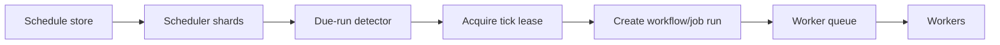

# Distributed Cron and Scheduling

Distributed cron turns time into work across a cluster. It sounds simple until clocks skew, deploys restart schedulers, daylight saving time changes local schedules, jobs run longer than their interval, and two regions both think they own the same tick. A production scheduler needs durable schedules, leases, missed-run policy, jitter, backpressure, and clear semantics for duplicate ticks.

## The Problem

Classic cron assumes one machine:

- Local disk stores the crontab.
- Local clock defines time.
- Local process starts work.
- Local logs are enough for audit.

Distributed systems break those assumptions. A schedule may have millions of tenants, region-specific time zones, failover, and SLA-backed execution windows.

## Scheduling Model



The scheduler should create a durable run record before work begins. The run record is the audit trail and dedupe key for the tick.

## Schedule vs Run

| Object | Example | Mutability |
|---|---|---|
| Schedule | "Every day at 09:00 Asia/Tokyo" | Mutable by users or config |
| Run | "schedule A for 2026-06-15T00:00Z" | Immutable identity, mutable status |

Never use "current time rounded to minute" alone as the identity. Use `(schedule_id, scheduled_time)` so duplicate schedulers converge on the same run.

## Lease-Based Tick Claiming

```sql
INSERT INTO scheduled_runs (schedule_id, scheduled_at, status, created_at)
VALUES (:schedule_id, :scheduled_at, 'created', now())
ON CONFLICT (schedule_id, scheduled_at) DO NOTHING;
```

This turns duplicate detection into a database constraint. A scheduler crash after creating the run is recoverable because a reconciler can enqueue all created-but-not-started runs.

## Time Semantics

| Requirement | Design |
|---|---|
| UTC interval jobs | Store interval and next UTC fire time |
| Local business time | Store IANA time zone, not numeric offset |
| DST spring forward | Define skip or shift policy |
| DST fall back | Define once or twice policy |
| End-of-month | Define clamp or skip policy |
| SLA window | Store latest acceptable start time |

Time policy must be user-visible. Hidden defaults become billing and compliance bugs.

## Missed Runs

When the scheduler is down, it must decide what to do with missed ticks.

| Policy | Use when |
|---|---|
| Skip | Freshness matters more than completeness, such as cache refresh |
| Catch up all | Every period is legally or financially required |
| Catch up latest only | State is overwritten, such as sync snapshot |
| Bounded catch-up | Old work is useful only within a time window |

Backfills should not share unlimited capacity with live ticks. Use a separate queue or priority class.

## Jitter

If every tenant schedules at midnight, midnight becomes a self-inflicted incident.

Use deterministic jitter:

```text
offset_seconds = hash(schedule_id) % jitter_window_seconds
actual_fire_time = nominal_fire_time + offset_seconds
```

Deterministic jitter preserves predictability while spreading load.

## Sharding the Scheduler

| Strategy | Strength | Risk |
|---|---|---|
| Hash schedules by ID | Simple and balanced | Hot tenants still hot |
| Shard by time bucket | Efficient due scans | Hot buckets at common times |
| Shard by tenant | Isolation and quota control | Uneven tenant sizes |
| DB range scan with leases | Easy recovery | DB can become scheduler bottleneck |

For large systems, shard schedule ownership and run creation separately. Schedule scans are read-heavy; run creation is write-heavy.

## Multi-Region Scheduling

Active-active scheduling needs a single owner per schedule or a conflict-proof run identity.

Options:

- Home-region per schedule.
- Global database unique constraint.
- Region-specific schedules with explicit failover.
- Active-passive scheduler with warm standby.

If a job has external side effects, cross-region duplicate ticks are worse than late ticks. Prefer stable ownership and explicit failover.

## Operational Metrics

- Schedule scan lag.
- Oldest due schedule not evaluated.
- Run creation latency.
- Duplicate run conflict count.
- Missed run count by policy.
- Catch-up backlog.
- Scheduler shard ownership churn.
- Tick-to-worker-start latency.

## Failure Modes

| Failure | Symptom | Mitigation |
|---|---|---|
| Clock skew | Early or late ticks | Use NTP discipline; compare against database/server time |
| Scheduler split brain | Duplicate runs | Unique run key and idempotent start |
| Catch-up storm | Workers saturated after outage | Bounded catch-up and separate queues |
| DST ambiguity | Double billing or missed reports | Explicit timezone policy |
| Long-running overlap | Same job runs concurrently | Per-schedule concurrency policy |

## Related Patterns

- [Distributed Time](../01-foundations/05-distributed-time.md)
- [Leader Election](../02-distributed-databases/09-leader-election.md)
- [Distributed Locks](../01-foundations/09-distributed-locks.md)
- [Auto-Scaling](../06-scaling/08-auto-scaling.md)
