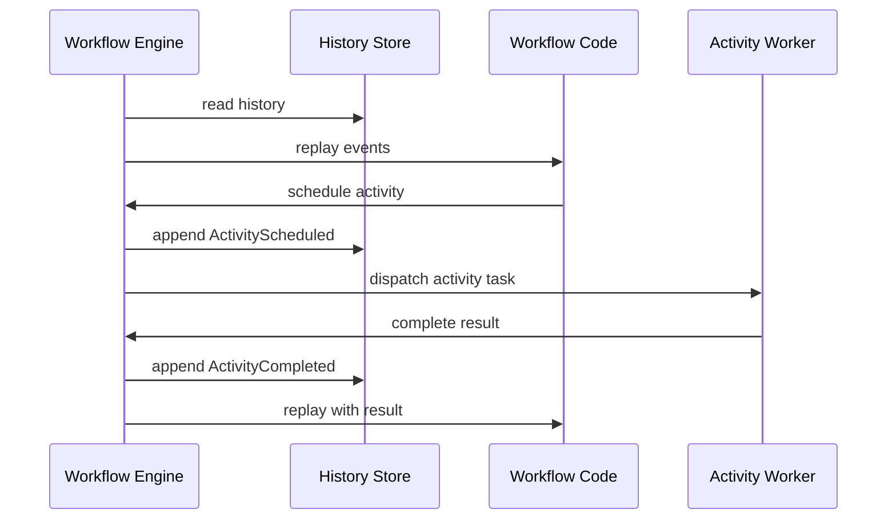
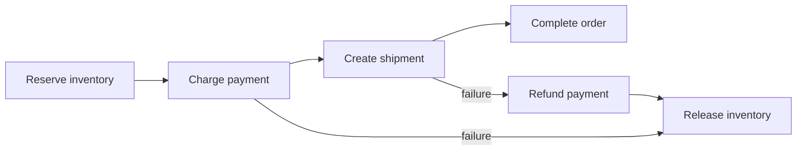

# Durable Execution and Workflow Engines

Durable execution systems run workflow code as if it were a normal program while recording enough history to recover after crashes. The engine persists decisions, timers, activity completions, and signals; on restart, it replays history to reconstruct state. This model powers long-running order flows, payment workflows, provisioning, incident automation, and human approval processes.

## Core Idea

The workflow function is a deterministic state machine. Activities perform non-deterministic side effects.



Replay is what makes the process durable. It is also what makes determinism non-negotiable.

## Workflow Code vs Activity Code

| Code type | Can call network? | Can read wall clock? | Retry owner | Determinism requirement |
|---|---|---|---|---|
| Workflow code | No | Through engine API only | Engine | Strict |
| Activity code | Yes | Yes | Activity policy | Idempotent |

Workflow code decides. Activity code does.

## Event History

Typical events:

- WorkflowStarted
- ActivityScheduled
- ActivityStarted
- ActivityCompleted
- ActivityFailed
- TimerStarted
- TimerFired
- SignalReceived
- ChildWorkflowStarted
- WorkflowCompleted

The history is an append-only log for one workflow instance. It gives deterministic replay, auditability, and recovery.

## Durable Timers

Sleeping inside a process is not durable. A durable timer is a persisted event:

```text
TimerStarted(id=payment-settlement, fire_at=2026-06-16T00:00:00Z)
...
TimerFired(id=payment-settlement)
```

No worker needs to stay alive while the workflow waits.

## Versioning

Long-running workflows may outlive deploys. If replay executes new code against old history, behavior can diverge.

Safe strategies:

- Version markers in workflow history.
- Continue-as-new to move long histories onto new code.
- Keep old workflow workers until old runs drain.
- Avoid non-deterministic iteration over maps or unordered sets.
- Route workflow types by version.

## Side Effects

External side effects should live in activities with idempotency keys:

```text
idempotency_key = workflow_id + ":" + activity_id + ":" + attempt_independent_operation
```

Do not include attempt number in the idempotency key for a logical side effect. Attempts are retries of the same intent.

## Saga Integration

Durable workflow engines are a natural implementation of [sagas](../05-messaging/09-saga-pattern.md):



The engine records which forward steps succeeded, so compensation can run exactly for those steps.

## Scaling Considerations

| Pressure | Design response |
|---|---|
| Many waiting workflows | Store timers efficiently; do not keep workers hot |
| Huge histories | Snapshot or continue-as-new |
| Hot workflow instances | Limit signals and child fan-out |
| Activity throughput | Separate task queues per activity class |
| Worker deploys | Drain and version workers |
| Multi-tenant load | Namespace quotas and per-tenant task queues |

## Failure Modes

| Failure | Cause | Mitigation |
|---|---|---|
| Non-deterministic replay | Workflow code reads random/time/network | Deterministic workflow APIs and replay tests |
| Activity completes but result lost | Worker crashes after side effect | Idempotency key and activity retry |
| History too large | Long loops or chatty signals | Continue-as-new and aggregate events |
| Version break | New code cannot replay old history | Version markers and compatibility tests |
| Stuck workflow | Waiting for signal that never arrives | Timers, escalation, and operator repair |

## Operational Metrics

- Workflow task replay latency.
- History size by workflow type.
- Activity schedule-to-start latency.
- Activity success/retry/failure counts.
- Timer backlog.
- Signal rate.
- Non-determinism failures.
- Continue-as-new count.

## When to Use

Use durable execution when the process is long-running, stateful, and business-critical. If all you need is "run this function later," a background job queue is easier.

## Related Patterns

- [Event Sourcing](../05-messaging/05-event-sourcing.md)
- [Saga Pattern](../05-messaging/09-saga-pattern.md)
- [Outbox Pattern](../05-messaging/07-outbox-pattern.md)
- [Failure Modes](../01-foundations/06-failure-modes.md)
