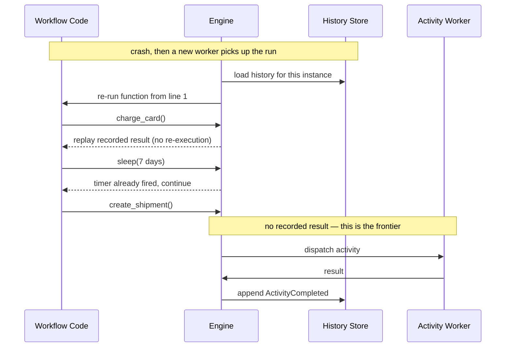

# Durable Execution and Workflow Engines

## TL;DR

Durable execution is the most powerful point on this section's durability axis: it makes an ordinary long-running, multi-step function survive process death *as if the crash never happened*. A normal function's state — its local variables, its position in the code, which steps have already completed — lives in volatile memory and evaporates when the process dies. A durable execution engine persists the result of every step into an append-only history and, on recovery, *replays that history* to reconstruct execution, so the program resumes exactly where it left off, possibly on a different machine, hours or days later. This is event sourcing applied to control flow. The price of the magic is a single hard constraint: the workflow code must be **deterministic**, because it is replayed, and any nondeterminism corrupts the replay. Temporal, Uber Cadence, AWS Step Functions, Azure Durable Functions, and Netflix Conductor all sit on this idea. What you buy is built-in retries, timeouts, durable multi-day sleeps, and crash-proof state recovery without hand-rolling a state machine in a database.

---

## The Problem: Program State Is Volatile

Consider a function that fulfills an order: reserve inventory, charge the card, wait for a warehouse to confirm shipment, then email the customer. Written as ordinary code it is trivial — five statements and a loop. But ordinary code carries a fatal assumption: that the process stays alive from the first statement to the last. The "state" of that function is the call stack, the local variables, and the instruction pointer, and all three live in RAM. If the process is killed after the card is charged but before shipment is recorded — a deploy, an OOM kill, a node failure, a spot reclamation — that state is simply gone. The card is charged, but nothing in the system knows the workflow had reached that point. There is no resumption; there is only a half-finished side effect and an operator trying to reconstruct what happened from logs.

The conventional fix is to externalize the state into a database: a row per order with a `status` column, a polling worker that reads orders in each state and advances them, retry counters, timeout columns, and a scheduler to wake up sleeping orders. This works, but it is the same hand-rolled state machine reinvented in every company, and it inverts the program. The natural sequential logic — "charge, then wait, then ship" — is shredded into disconnected event handlers keyed on status values, and the real control flow now lives implicitly in the transition table of a database. Every new step means a new status, a new query, a new piece of the scheduler. The business logic becomes nearly unreadable, and the bugs live in the seams between handlers.

Durable execution engines exist to give you back the straight-line program while making its state as durable as the database row. You write the order flow as a single function that charges, then *sleeps*, then ships; the engine guarantees that function will run to completion exactly once, surviving any number of crashes along the way.

---

## The Mechanism: Event-Sourced History and Replay

The engine achieves durability not by snapshotting memory but by recording history. Every time the workflow function does something observable — schedules an activity, starts a timer, receives a signal, completes — the engine appends an event to a per-instance, append-only log: `WorkflowStarted`, `ActivityScheduled`, `ActivityCompleted`, `TimerStarted`, `TimerFired`, `SignalReceived`, `WorkflowCompleted`. This log is the durable source of truth for one workflow instance, and it is exactly the [event sourcing](../05-messaging/05-event-sourcing.md) pattern applied to a program's control flow rather than to a domain aggregate.

Recovery is where the design becomes surprising. When a worker picks up a workflow after a crash, it does **not** restore a memory image. Instead it *re-runs the workflow function from the very first line*. As the function executes, every command it issues is checked against the recorded history. If the history already contains the result of a step — say the card charge completed — the engine does not re-execute that step; it feeds back the recorded result and lets the function continue. The replay races forward through everything that already happened, reconstructing all the local variables and the exact position in the code purely from the sequence of recorded results, until it reaches the first command that has *no* recorded outcome yet. That is the true frontier of progress, and only there does the workflow do new work.

The consequence is profound: a process can die at any point and a fresh process, on a different machine, reconstructs the entire logical state of the program by replaying a list of facts. The stack and the variables were never durable; the *history of decisions* was, and that turns out to be enough to rebuild everything else.

---

## Determinism Is the Hard Constraint

Replay only reconstructs the right state if the workflow function, fed the same history, makes the same decisions it made the first time. That is the entire game, and it imposes a constraint that beginners always trip over: **workflow code must be deterministic.** Given an identical sequence of recorded inputs, it must execute an identical sequence of commands. Anything that can return a different value on replay than it did on the original run will desynchronize the function from its history and corrupt the reconstruction.

This rules out a surprising amount of ordinary code. Reading the wall clock directly is forbidden, because `now()` returns a different value during replay than during the original run, so a branch like `if now() > deadline` could take a different path and the function would issue commands the history does not expect. Random numbers are forbidden for the same reason. Iterating over a hash map or set whose order is unspecified is forbidden, because the order may differ between runs. Reading a mutable global, a config value, or an environment variable inside workflow code is forbidden, because it may have changed between the original execution and the replay. Even spawning threads with nondeterministic scheduling breaks the model.

The reason a nondeterministic workflow is so dangerous is that the failure is silent and delayed. The workflow runs correctly for days, then a worker restarts and replays the history. If on replay the code reads a clock and takes a *different* branch, it will try to schedule, say, a refund where the history records a shipment — a "nondeterminism error." Best case, the engine detects the mismatch between the new command and the recorded event and refuses to proceed, freezing the workflow; worst case, in a weaker model, it executes against an inconsistent state. Either way a workflow that ran fine in testing breaks the first time it has to recover, which is precisely when you need it most.

The discipline the engines impose is that *all* nondeterminism must be funneled through the engine's own APIs, which record their results into history so replay reproduces them identically. You do not call `time.now()`; you call the engine's `Now()`, whose value is captured in an event and replayed. You do not call `rand()`; you call the engine's deterministic side-effect API. You do not sleep on a thread; you start a durable timer. The rule of thumb, articulated clearly in Temporal's and Cadence's documentation, is that workflow code expresses *orchestration logic only* — branching, looping, waiting, coordinating — and pushes every interaction with the messy outside world into activities.

---

## Activities: Where Side Effects Live

Real work — calling a payment gateway, writing to a database, sending email, invoking another service — is nondeterministic by nature and cannot live in workflow code. Engines isolate it into **activities** (Step Functions calls them tasks, Durable Functions calls them activity functions). An activity is a plain function with no determinism requirement: it can read the clock, hit the network, and do anything ordinary code does. The workflow's job is to *decide which activities to run and in what order*; the activity's job is to *do the thing*. This is the clean division the model rests on — workflow code decides, activity code acts.

The crucial property is the delivery semantic. The engine schedules an activity, records `ActivityScheduled`, dispatches it to an activity worker, and waits for the result, which it records as `ActivityCompleted`. But "dispatch, run, record the result" is not atomic across a crash. If the activity worker completes the payment side effect and then dies before reporting back, the engine never sees the completion, times the activity out, and retries it — running the payment a second time. Therefore activities are **at-least-once**, and the workflow author must make them **idempotent**, typically by attaching a stable idempotency key (derived from the workflow ID and the activity ID, *not* the attempt number, so all retries of the same logical operation collapse to one effect). This is the same retry-and-idempotency contract that governs every durable job system, covered in depth in [Retries, Idempotency, and Compensation](./06-retry-idempotency-compensation.md). The engine gives you automatic, policy-driven retries with backoff for free; it cannot give you idempotency for free, because only the activity's own domain knows what "the same operation" means.

---

## Durable Timers: Sleeping for Thirty Days

The clearest demonstration of what durable execution buys you is the long sleep. A workflow can write `sleep(30 days)` and mean it literally: thirty days later, possibly after dozens of deploys and node replacements, the workflow wakes and continues. Ordinary code cannot do this — a thread sleeping for thirty days is thirty days of a held process that any restart destroys, and a `cron` job that pokes a database is exactly the hand-rolled state machine we were trying to escape.

The engine implements the wait as a persisted fact, not a held resource. The workflow's `sleep` becomes a `TimerStarted(fire_at=...)` event in history, and the worker is then free to evict the workflow from memory entirely. No process, thread, or memory is consumed during the wait. When the fire time arrives, the engine schedules a workflow task, a worker replays the history up to the timer, sees `TimerFired`, and continues. This makes durable timers a first-class primitive for genuinely long-lived business processes: a 7-day free-trial expiry, a 30-day payment-settlement window, a 90-day subscription renewal, a human-approval step that may take a week. AWS Step Functions Standard workflows can run for up to a year; Temporal and Cadence workflows can run effectively indefinitely. The wait costs storage, not compute, which is why a single cluster can hold millions of sleeping workflows at once.

---

## A Named Landscape

The pattern has a clear lineage. **AWS Simple Workflow Service** (2012) was an early commercial durable-execution engine. **Uber Cadence**, open-sourced in 2017, generalized the idea into a code-first event-sourced workflow engine; its original authors, Maxim Fateev and Samar Abbas, later forked it into **Temporal** (founded 2019), now the most widely adopted general-purpose durable execution platform, available self-hosted and as Temporal Cloud. **AWS Step Functions** (launched December 2016) takes a different surface: workflows are defined as a JSON state machine (the Amazon States Language) rather than as imperative code, trading the natural programming model for a managed, declarative one. **Azure Durable Functions** (GA 2018) brings durable execution to the serverless world with an orchestrator-function programming model and the same determinism constraints. **Netflix Conductor** (open-sourced 2016) is a JSON-DSL orchestrator closer in spirit to a [DAG orchestrator](./05-dag-orchestration.md) than to code-shaped replay. The dividing line across this landscape is whether you write workflows as *real code that gets replayed* (Cadence, Temporal, Durable Functions) or as a *declarative state machine the engine interprets* (Step Functions, Conductor) — the former is more expressive and more dangerous, because the determinism burden falls on your code.

---

## Versioning: Changing Code Under a Running Workflow

The replay model creates a problem that no stateless service has: a single workflow instance may be *running for weeks* while you deploy new versions of its code. Because recovery replays the *current* code against *old* history, a code change that alters the sequence of commands — inserting a new activity before an existing one, reordering two steps, changing a branch — will, on the next replay of an in-flight instance, produce commands that do not match the recorded history. That is a nondeterminism error caused not by a clock but by you. This **versioning problem** is the chronic operational tax of durable execution, and it has no fully automatic solution.

The engines provide explicit tools. Temporal and Cadence offer a versioning API (`GetVersion` / patched markers) that lets a single workflow function branch on "was this instance started before or after the change?", recording the version into history so replay stays consistent; old instances take the old path, new ones take the new path, and the marker pins each. The complementary technique is **continue-as-new**: a long-running or looping workflow periodically completes its current run and atomically starts a fresh instance with carried-over state, which both bounds history growth and provides a clean seam at which new code takes over. The operational discipline is to keep old workers draining old instances until they finish, route workflow types by version, and treat any change to in-flight workflow code with the same care as a database migration — because that is effectively what it is.

---

## Sagas: Durable Execution's Natural Application

Durable execution is the most ergonomic way to implement the [saga pattern](../05-messaging/09-saga-pattern.md) — a multi-step distributed transaction with compensating actions for rollback. Because the engine records exactly which forward steps completed, it knows precisely which compensations to run when a later step fails: reserve inventory, charge payment, create shipment, and on failure run only the compensations for the steps that actually succeeded, in reverse. The whole saga is one readable function with a try/compensate structure, and the durability of the history guarantees that even a crash mid-rollback resumes correctly. This is why "durable execution engine" and "saga orchestrator" are, in practice, often the same system.

---

## Durable Execution vs DAG Orchestration

It is easy to confuse this pattern with [DAG orchestration](./05-dag-orchestration.md), because both run multi-step workflows, but they target different shapes of problem. A DAG orchestrator (Airflow, Dagster, Conductor) models work as a *graph of tasks* — typically scheduled, batch, data-shaped jobs where the structure is known up front, fan-out and dependencies are the main concern, and runs are minutes-to-hours of throughput-oriented processing. Durable execution models work as *general code* — often request-driven, long-lived business processes (order fulfillment, subscription lifecycles, provisioning, saga orchestration) where the control flow includes loops, conditionals, dynamic branching, waiting on external signals, and durable sleeps that may span weeks. The DAG's structure is a static graph; the durable workflow's structure is whatever the imperative code does, including branches the graph model cannot express naturally.

The practical heuristic: if the work is a *pipeline of data transformations on a schedule*, reach for a DAG orchestrator. If the work is a *long-lived stateful business process driven by events and time*, reach for durable execution. Many organizations run both — Airflow for nightly analytics, Temporal for order workflows — because they are answers to different questions, not competing answers to the same one.

---

## Failure Modes

The model's failures are specific and worth naming, because most of them surface only at recovery time.

**The nondeterministic workflow** is the signature failure. Workflow code reads a clock, calls `rand()`, iterates a map in unspecified order, or reads mutable config, and runs perfectly until the first replay takes a different branch than the original execution. The mismatch between the new command and the recorded history freezes (or, in weaker models, corrupts) the instance. The defense is strict determinism plus *replay tests* that re-run recorded histories of real workflows against new code in CI, catching the divergence before it reaches production.

**The non-idempotent activity double-executing** follows directly from at-least-once delivery. An activity completes its side effect, the worker crashes before reporting, the engine retries, and the payment is charged twice. The defense is a stable idempotency key per logical operation and an effect store the activity checks before acting.

**Unbounded history growth** afflicts long-running or tightly looping workflows. Every iteration appends events, and a workflow that loops forever or fans out heavily accumulates a history that grows until it crosses the engine's limit — Temporal terminates a workflow whose history exceeds roughly 50,000 events or 50 MB, and Step Functions Standard caps history at 25,000 events. The defense is continue-as-new to reset history at safe boundaries and to aggregate chatty signals rather than recording each one.

**Workflow-versioning incompatibility** is the deploy-time failure: new code cannot replay old in-flight histories. The defense is versioning markers, draining old workers, and replay-compatibility tests against a corpus of real histories.

**The poison workflow** is the instance that deterministically fails on every replay — a code bug or a permanently bad input — and that the engine retries forever, burning a worker slot and paging on the same alert. The defense is bounded workflow-task retries, a quarantine path, and operator tooling to reset, terminate, or patch a stuck instance. A related stuck state is a workflow blocked forever on a signal that never arrives; the defense is to pair every wait with a durable timeout and an escalation path.

---

## Decision Framework

Choosing whether to reach for durable execution at all is the first and most important decision, because the determinism constraint and versioning tax are real costs you should only pay when the problem warrants them.

Reach for **durable execution** when the process is long-running (minutes to months), stateful, multi-step, business-critical, and must survive crashes exactly as written — order fulfillment, payment and saga orchestration, provisioning, human-approval flows, anything that sleeps for days and must wake reliably. You are buying crash-proof state, built-in retries and timeouts, durable timers, and a readable sequential program in exchange for the determinism discipline and versioning overhead.

Reach for a **DAG orchestrator** when the work is a scheduled or triggered *pipeline of data tasks* with a known graph structure, batch throughput, and dependency fan-out rather than long-lived per-entity state. See [DAG Orchestration](./05-dag-orchestration.md).

Reach for a **plain background job queue** when all you need is "run this function later, perhaps with retries," and there is no long-lived multi-step state to coordinate. A queue and a worker pool ([Background Jobs and Worker Pools](./02-background-jobs-worker-pools.md)) are dramatically simpler, and reaching for durable execution here is over-engineering.

Reach for a **hand-rolled state machine in your own database** only when the process is short, the states are few and stable, your team already operates that database well, and the operational cost of running a workflow engine is not justified. Be honest, though: the moment you find yourself adding retry counters, timeout columns, a polling scheduler, and a wake-up cron, you are rebuilding a durable execution engine badly, and adopting a real one will usually cost less over the system's life.

---

## Key Takeaways

1. Durable execution makes an ordinary long-running function survive process death as if it never happened, by persisting the result of every step and replaying history to reconstruct state on recovery.
2. The mechanism is event sourcing applied to control flow: an append-only history of step inputs and results, replayed to rebuild local variables and code position rather than restoring a memory image.
3. Determinism is the non-negotiable constraint — replayed workflow code must make identical decisions given identical history, so direct clock reads, randomness, unordered iteration, and mutable config are forbidden in workflow code.
4. A nondeterministic workflow fails silently until recovery, then corrupts replay; funnel all nondeterminism through engine APIs (durable timers, side-effect/activity calls) whose results are recorded and replayed.
5. Side effects live in activities, which run at-least-once and therefore must be idempotent; the engine gives you retries for free but cannot give you idempotency for free.
6. Durable timers let a workflow reliably sleep for days or months because the wait is a persisted fact, not a held process — a capability ordinary code cannot match.
7. What you buy is built-in retries, timeouts, crash recovery, and long-running orchestration without hand-rolling a state machine in a database.
8. Versioning is the chronic tax: a workflow running for weeks while you deploy new code can break replay, so use version markers, continue-as-new, and replay-compatibility tests.
9. Use durable execution for long-lived, stateful, code-shaped business processes; use a DAG orchestrator for scheduled data pipelines and a plain job queue for fire-and-forget work.
10. The recurring failures — nondeterministic replay, double-executing activities, unbounded history, version incompatibility, poison workflows — all surface at recovery time, so test recovery explicitly.

---

## Related Patterns

- [Event Sourcing](../05-messaging/05-event-sourcing.md) — the storage model durable execution applies to control flow
- [Saga Pattern](../05-messaging/09-saga-pattern.md) — the canonical application of durable workflows
- [Outbox Pattern](../05-messaging/07-outbox-pattern.md) — atomic side effects at activity boundaries
- [DAG Orchestration](./05-dag-orchestration.md) — graph-shaped batch alternative to code-shaped workflows
- [Retries, Idempotency, and Compensation](./06-retry-idempotency-compensation.md) — the activity reliability contract
- [Workflow Observability and Replay](./09-workflow-observability-replay.md) — debugging and replaying histories
- [Background Jobs and Worker Pools](./02-background-jobs-worker-pools.md) — the simpler alternative for fire-and-forget work
- [Idempotency](../01-foundations/08-idempotency.md) and [Failure Modes](../01-foundations/06-failure-modes.md) — foundations the model depends on

---

## References

1. [Temporal Documentation — Workflows and Deterministic Constraints](https://docs.temporal.io/workflows) — the determinism rules and replay model
2. [Cadence: The Only Workflow Platform You'll Ever Need](https://www.uber.com/blog/cadence/) — Uber Engineering, 2017
3. [AWS Step Functions Developer Guide](https://docs.aws.amazon.com/step-functions/latest/dg/welcome.html) — declarative state-machine durable execution (launched 2016)
4. [Azure Durable Functions Documentation](https://learn.microsoft.com/en-us/azure/azure-functions/durable/durable-functions-overview) — orchestrator-function model and code constraints
5. [Netflix Conductor](https://github.com/Netflix/conductor) — JSON-DSL workflow orchestrator, open-sourced 2016
6. [Temporal: Event History and the Continue-As-New Pattern](https://docs.temporal.io/workflow-execution/event) — history limits and history-size management
7. [Pat Helland, "Life Beyond Distributed Transactions"](https://queue.acm.org/detail.cfm?id=3025012) — the entity-and-activity foundations behind sagas
8. [Martin Fowler, "Event Sourcing"](https://martinfowler.com/eaaDev/EventSourcing.html) — the storage pattern generalized to control flow
