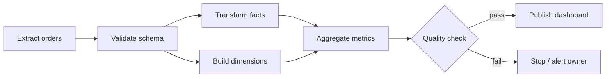

# DAG Orchestration

## TL;DR

DAG orchestration is the dependency-graph batch execution system: it takes a graph of "this must run after that" and turns it into scheduled, retryable, backfillable runs, specialized for data and ML pipelines. The graph is acyclic on purpose — dependencies define *readiness*, and a cycle makes "is this task runnable yet?" unanswerable, so repetition is modeled as separate runs over time intervals rather than as loops in the graph. The scheduler is the brain that decides readiness; workers only execute the tasks they are leased, which is the same control-plane/data-plane split that governs any serious [execution engine](../16-ml-systems/05-training-pipelines.md). The two properties that separate a correct orchestrator from a fragile cron replacement are *honest data intervals* (the logical window a run covers, which is not the wall-clock time it runs) and *idempotent, atomically-published partitions* (a re-run overwrites cleanly and a failed task never leaves a half-written output). Get those wrong and you ship subtly corrupt data that every downstream gate certifies as correct.

---

## What a DAG Orchestrator Actually Is

The reason DAG orchestration exists as a distinct pattern — rather than a pile of cron jobs calling each other — is that batch and data work has *structure*, and that structure is a partial order. Extract must finish before transform; transform before aggregation; aggregation before the dashboard refresh; and a dozen independent branches can run in parallel as long as their own upstreams are done. Cron expresses "run this at 02:00." It cannot express "run this *after* the other three things succeeded, but only for the data window they just produced." The orchestrator's job is to take a declared graph of dependencies and a schedule, and from those two inputs continuously answer one question for every task: *is it runnable right now?*



Apache Airflow (built at Airbnb in 2014, open-sourced 2015, an Apache project since 2016) made this model mainstream and gave the vocabulary most teams still use: a DAG is a versioned graph; a *DAG run* is one execution of that graph, usually pinned to a data interval; a *task* is a node; a *task instance* (or attempt) is one try of one task in one run. Luigi (Spotify, 2012) framed the same idea around target outputs and dependency resolution. Later systems — Dagster (2018, asset-and-type-centric), Prefect (2018, Pythonic flows), and Argo Workflows (2018, Kubernetes-native) — re-cut the same substance along different axes, but they all do the same core thing: convert a dependency graph plus a schedule into a stream of leased, retryable, observable task executions.

---

## Why Acyclic, and Why That Matters

Acyclicity is not a stylistic preference; it is what makes readiness decidable. The scheduler determines that a task can run by checking that all of its upstream dependencies have already succeeded. That check terminates only if the dependency relation has no cycles — in a cyclic graph, task A waits for B, which waits for A, and "have all upstreams succeeded?" has no answer. The acyclic constraint is the precondition for the entire scheduling algorithm to make sense.

This raises the obvious objection: real pipelines *do* repeat. You run the same transform every hour, every day, forever. The orchestrator's answer is to push repetition out of the graph and into *time*. The graph stays acyclic and describes one logical pass over the data; the schedule generates a new, independent DAG run for each interval. "Run hourly" does not add an edge from the last task back to the first — it instantiates a fresh run of the same acyclic graph for the 09:00–10:00 window, then another for 10:00–11:00. Loops live in the schedule's time dimension, never in the dependency graph. This separation is what lets you reason about a single run in isolation while still running the workload continuously, and it is precisely what makes *backfills* — replaying many historical intervals of the same graph — a natural operation rather than a special case.

---

## The Scheduler Is the Brain

The defining architectural decision in a DAG orchestrator is the strict separation between the component that *decides* what runs and the components that *do* the running. The scheduler is the control plane: it reads durable metadata about every run and task, evaluates readiness, and emits tasks for execution. Workers are the data plane: they pick up the tasks they are handed, do the heavy lifting — query the warehouse, transform a partition, train a model — and report success or failure. This is the same control-plane/data-plane split that the [training-pipelines execution engine](../16-ml-systems/05-training-pipelines.md) relies on, and it exists for the same reason: the two halves have opposite reliability requirements. The control plane must be durable and consistent because losing the record of what ran is catastrophic; the data plane must be elastic and disposable because workers die routinely and that must be a non-event.

The scheduler's readiness predicate is the heart of the system. A task becomes runnable only when *all* of these hold: every upstream task in this run has succeeded; the run's logical time has been reached (you cannot process the 10:00 hour at 09:30); concurrency limits — global, per-DAG, and per-pool — leave room for it; the run has not been canceled or paused; and any external conditions it waits on are satisfied. That last clause is what *sensors* model: a task that blocks until a source file lands, a partition appears, or an upstream dataset is marked fresh.

The non-negotiable principle is that **workers must never decide dependency readiness.** A worker that inspects the graph and chooses what to run next has quietly become a second, uncoordinated scheduler, and two schedulers with a shared task pool will double-run work, skip tasks, or deadlock. Workers execute *leased* tasks and nothing else. The lease — a time-bounded claim with a heartbeat, covered in [Leases, Heartbeats, and Recovery](./08-leases-heartbeats-recovery.md) — is what lets the scheduler hand a task to exactly one worker and reclaim it safely if that worker dies. Centralizing the readiness decision in one durable, authoritative scheduler is what makes the whole system's behavior reconstructable after any component fails.

---

## Data Intervals Are a Correctness Concern, Not a Label

The single most underappreciated source of subtle data-pipeline bugs is the conflation of two timestamps that look interchangeable and are not: the *logical data interval* a run covers, and the *wall-clock time* at which the run executes. A daily run labeled `2026-06-15` is not "the job that ran on June 15." It is the job responsible for the data window `2026-06-15T00:00Z` to `2026-06-16T00:00Z`, and — crucially — it can only execute *after* that window has closed, which is at the earliest the very start of June 16, and in practice later once late-arriving data has settled. The interval is an input to correctness, on equal footing with the data itself.

The classic bug is treating the run date as the execution date. A task computes "yesterday" as `today() - 1` using the wall clock instead of deriving its window from the run's data interval. It works in normal operation and then silently produces wrong answers the moment anything is off-schedule: a delayed run computes the wrong day; a backfill of last month reads *this* month's data because `today()` is anchored to the machine clock, not the interval being replayed. The discipline that prevents this is to make the interval boundaries explicit everywhere — passed into the task as parameters, embedded in the input query's `WHERE` clause, and stamped into the output path (`.../dt=2026-06-15/`). A task that reads its window from its run context is replayable for any historical interval; a task that reads the wall clock is not.

The second interval hazard is *late-arriving data*. An hourly run for the 09:00–10:00 window that fires at exactly 10:00 will read whatever has landed so far, which may be incomplete because events for 09:58 are still in flight through the ingestion path. Reading an interval before it has settled produces an undercount that looks like a real number. The defenses are to delay execution past the interval's close by a settling margin, to gate the run on a sensor that confirms the source is complete, and — where the source can be corrected after the fact — to make the run idempotent so a later re-run over the same interval cleanly replaces the early, incomplete result. This is the same boundary problem that watermarks address in [stream processing](../13-data-pipelines/02-stream-processing.md); batch orchestration just resolves it with explicit settling delays and completeness sensors instead of watermarks.

---

## Idempotent, Atomically-Published Outputs

Because tasks are retried — by design, on every transient failure — a task that is run twice over the same interval must produce the same result as running it once. This is the [idempotency](./06-retry-idempotency-compensation.md) requirement, and in a data context it has a sharp, concrete form: a re-run must *overwrite its partition cleanly*, and a failed run must leave *no partial output behind*. The two halves are usually solved together with the same mechanism.

The foundational invariant is that a partition is either fully published or absent — never half-written. A task that streams rows directly into its final output location and then crashes at 70% leaves a corrupt partition that the next run may either fail on confusingly or, far worse, mistake for a completed output and skip. The fix is *write-to-temp, then atomically publish*: the task writes its output to a staging location keyed by attempt, validates it, and only on success makes it visible with a single atomic operation — an object-store manifest swap, a directory rename, or a table-format commit.

```text
# stage under an attempt-scoped temp path, then publish atomically
s3://warehouse/orders_daily/dt=2026-06-15/_tmp/attempt=abc/part-*.parquet
# on success, atomic swap → visible partition
s3://warehouse/orders_daily/dt=2026-06-15/part-*.parquet
```

Open table formats make this atomic publish a first-class operation rather than a rename trick: Apache Iceberg, Delta Lake, and Apache Hudi (see [Lakehouse and Open Table Formats](../13-data-pipelines/05-lakehouse-table-formats.md)) expose a transactional commit so a partition overwrite either fully takes effect or does not, and readers never observe an in-progress write. Either way the rule is the same — the commit is the only point at which output becomes visible, and everything before it is disposable work the system is willing to redo. An orchestrator whose tasks do not publish atomically cannot honestly offer retries, because every retry risks corrupting the very partition it is trying to repair.

---

## Backfills Are Production Load, Not Maintenance Trivia

Backfilling — re-running a graph across a long range of historical intervals after a logic change, a late data correction, or a new pipeline going live — is routinely treated as an afterthought, and that is how teams take down their warehouse. A backfill of one year of daily partitions is 365 DAG runs; if each normally runs comfortably overnight in isolation, launching all 365 at once can multiply warehouse load by two orders of magnitude and starve the live, scheduled pipelines that share the same compute. A backfill is one of the heaviest production workloads a data platform runs, and it deserves the same capacity planning as any other.

Treating backfills as first-class means giving them their own controls rather than reusing the normal-operation path. They need a *separate queue or pool* so historical replay cannot crowd out today's scheduled runs. They need *concurrency caps* — bounding how many intervals run at once, per DAG and per downstream dataset — so the replay drains at a sustainable rate instead of a thundering herd. They need a *budget* on warehouse spend or slot-hours, because a backfill is the easiest way to turn a one-line change into a five-figure bill. They benefit from a *dry run* that expands the dependency set and reports what would execute before anything does. And they must be *pausable and resumable*, because a backfill that has completed 200 of 365 intervals and hits a problem should resume from interval 201, not restart from zero — which is only possible because each interval is an independent, idempotent run. Airflow's `clear`/backfill machinery, Dagster's backfill UI with per-partition status, and Prefect's parameterized flow runs all exist to make this controllable rather than a manual fan-out.

---

## Dynamic DAGs and Scheduler-Metadata Explosion

A powerful and dangerous capability is generating tasks dynamically from runtime state: one task per customer, one task per input file, one task per shard discovered at run time. It is the natural way to express partitioned work, and it is also the fastest way to bring a scheduler to its knees. The scheduler tracks state for *every* task instance in durable metadata — queued, running, retrying, succeeded — and a "one task per customer" pattern across a few million customers means a few million rows of state to persist, schedule, and render per run. The scheduler's bookkeeping, not the actual work, becomes the bottleneck; the database backing it thrashes, the UI times out, and scheduling latency balloons for every other pipeline sharing the instance.

The cure is to keep the *unit of scheduling* coarse even when the *unit of work* is fine. Instead of one task per customer, emit one task per shard of a few thousand customers and let the worker iterate inside the shard — the scheduler tracks hundreds of tasks, the worker handles the millions of items. Instead of one task per file, run a manifest task that lists the files and hands batches to workers, so the graph's size is bounded by shard count rather than file count. And when the graph genuinely must expand at run time, *persist the expanded graph for that run* so retries, observability, and reasoning operate on a fixed, recorded structure rather than re-deriving a different graph on every evaluation. Dagster's dynamic outputs and Airflow's dynamic task mapping both deliberately materialize the expansion into recorded mapped instances for exactly this reason: a graph that changes shape every time the scheduler looks at it is a graph you cannot retry or audit.

---

## Failure Semantics

The orchestrator's value is concentrated in how it behaves when things fail, because in a long batch graph something always does. The semantics differ by *what* failed, and conflating them is its own class of bug.

When an **upstream task fails**, its downstream tasks must not run — they would consume missing or partial inputs. The standard behavior is to leave them blocked (so a retry of the upstream can unblock them) or to mark them skipped, never to run them on incomplete data. When a **data-quality check fails** — a row-count anomaly, a null-rate spike, a failed expectation — the orchestrator must stop the *publish* path specifically: the computed-but-unvalidated output stays in staging and is never atomically published, and the dataset owner is paged. This is why the quality gate belongs *before* the atomic publish in the graph, not after: a check that runs after publication is a check that fires once the bad data is already visible downstream. When a **worker dies** mid-task, its lease expires, the scheduler observes the missed heartbeat, and the task is retried on another worker — a non-event precisely because outputs are atomic and tasks are idempotent, so the dead worker's partial work is discarded rather than published. When the **scheduler itself dies**, recovery is reconstruction from durable metadata: a restarted scheduler reads the persisted state of every run and re-derives the runnable set, rather than trusting any in-memory progress. That this reconstruction is possible is the entire payoff of centralizing readiness in one durable control plane, and the mechanics — lease expiry, heartbeat timeouts, idempotent replay — are covered in [Leases, Heartbeats, and Recovery](./08-leases-heartbeats-recovery.md).

The retry policy itself is a classification problem, the same one [retries and idempotency](./06-retry-idempotency-compensation.md) describe in general. A transient failure — a network timeout, a preempted pod, a throttled warehouse query — should retry with exponential backoff. A deterministic failure — a schema mismatch, a logic exception, a malformed config — must fail fast and alert, because retrying a deterministic failure three times only wastes time and hides the real defect. An orchestrator that retries everything uniformly turns a clear, fixable bug into an intermittent mystery.

---

## Observability Needs a Graph View and a Data View

Operating a DAG orchestrator requires two distinct lenses, and teams that build only the first stay blind to the failures that hurt most. The *graph view* is the one everyone builds: which tasks are running, queued, or failed; the critical path through the run and which task is pacing it; queue-wait time versus execution time (a task spending most of its life queued is a capacity problem, not a slow task); attempt counts and where retries cluster. This view answers "is the pipeline running and where is it stuck."

The *data view* is the one that catches silent corruption, and it is the harder one to build because it requires the orchestrator to understand the data, not just the tasks. It tracks dataset freshness — when each output partition was last successfully published, against an SLA — so a pipeline that "succeeds" while quietly producing stale data is caught. It tracks output row counts and quality-check results per interval, so a run that completes but emits a tenth of the usual rows raises an alarm. It tracks late-data and re-run counts, surfacing intervals that had to be reprocessed. And it tracks backfill progress per interval, because a backfill's health is measured in partitions completed, not in a single job's exit code. The deeper point is that *a green DAG is not the same as correct data*: the graph view certifies that tasks ran, while only the data view certifies that they produced the right thing. [Workflow Observability and Replay](./09-workflow-observability-replay.md) covers how both views are reconstructed from the orchestrator's event history, and replay — re-running a past interval from recorded state — is what turns "this number looks wrong" into a debuggable, reproducible investigation.

---

## Decision Framework

The most common design mistake around orchestration is choosing the wrong *kind* of execution system, because three patterns look superficially similar and solve different problems. The decision keys on the *shape* of the work.

Reach for **DAG orchestration** when the work is *graph-shaped batch work over data*: many tasks with explicit dependencies, scheduled by time, processing intervals of data, where retries, backfills, and idempotent partitions are central. ETL/ELT pipelines, analytics rollups, and [ML training pipelines](../16-ml-systems/05-training-pipelines.md) are the canonical fit. The defining traits are a partial order of tasks and a data interval per run.

Reach for a **durable execution / workflow engine** ([Durable Execution and Workflow Engines](./04-durable-execution-workflow-engines.md) — Temporal, Cadence, AWS Step Functions) when the work is *code-shaped, long-running process orchestration*: a single business process — an order saga, a multi-step onboarding, a payment flow with compensations — that must survive restarts, wait for human approvals or external events for days, and resume from exactly where it left off. The defining trait is a stateful process expressed as durable code, not a batch over a data interval. DAG orchestrators schedule *graphs*; durable engines resume *executions*.

Reach for **plain background jobs and worker pools** ([Background Jobs and Worker Pools](./02-background-jobs-worker-pools.md)) when the work is *request-time, fire-and-forget tasks* with little or no inter-task dependency structure: send the email, resize the image, process the webhook. If there is no meaningful dependency graph and no data interval, a DAG orchestrator is heavyweight overkill and a queue with workers is the right tool.

The clarifying questions are simple. Is there a *dependency graph* and a *data interval per run*? That is DAG orchestration. Is there a *long-running, stateful process* expressed as code that must survive failures and waits? That is durable execution. Is it *independent request-time tasks* with no graph? That is background jobs. Many production systems use all three, and forcing one tool to do another's job — modeling a saga as a DAG, or a nightly rollup as a durable workflow — is where operational pain comes from.

---

## Failure Modes

The characteristic ways DAG orchestrators fail recur across organizations, and naming them is most of preventing them.

**The wall-clock interval bug** is the silent data-corruption classic: a task derives its window from `today()` instead of its run's data interval, so delayed runs and backfills read the wrong data while every job still reports success. The defense is to pass interval boundaries explicitly and forbid wall-clock date math in tasks.

**The half-written partition** is the failure that retries cannot fix because they make it worse: a task writes directly to its final output, crashes mid-write, and leaves a corrupt partition that the next run either trips on or mistakes for complete. The defense is write-to-temp plus atomic publish, so output is binary — present or absent.

**The backfill stampede** is the self-inflicted outage: launching hundreds of historical intervals at once saturates the warehouse and starves live pipelines. The defense is separate queues, concurrency caps, budgets, and resumable backfills.

**The scheduler-metadata explosion** is the dynamic-DAG trap: a one-task-per-item pattern generates millions of task instances and the scheduler's bookkeeping, not the work, becomes the bottleneck. The defense is to shard work into coarse tasks and persist the expanded graph.

**The green-but-wrong pipeline** is the observability gap: every task succeeds, the DAG is green, and the data is stale or undercounted because nothing checked freshness or row counts. The defense is a data view alongside the graph view, with quality gates positioned before the atomic publish.

---

## Key Takeaways

1. DAG orchestration is the dependency-graph batch execution system: it converts a graph of "after that, run this" plus a schedule into scheduled, retryable, backfillable runs.
2. The graph is acyclic so readiness is decidable; repetition lives in the time dimension as separate runs per interval, never as cycles in the graph.
3. The scheduler is the brain that decides readiness; workers only execute leased tasks — centralizing the readiness decision is what makes recovery and consistency possible.
4. Data intervals are a correctness concern: a run's logical window is not its wall-clock execution time, and confusing the two is the most common silent data-pipeline bug.
5. Outputs must be idempotent and atomically published — write to temp, then swap — so retries overwrite cleanly and failures never leave a half-written partition.
6. Backfills are heavy production load, not maintenance trivia; they need separate queues, concurrency caps, budgets, dry runs, and pause/resume.
7. Dynamic DAGs can explode scheduler metadata; keep the unit of scheduling coarse, shard the work, and persist the expanded graph per run.
8. Failure semantics differ by cause: upstream failure blocks downstream, a quality-check failure stops the publish path, a dead worker's task is retried via lease expiry, and a dead scheduler reconstructs its runnable set from durable metadata.
9. Observability needs both a graph view (critical path, queue wait, retries) and a data view (freshness, row counts, late data, backfill progress) — a green DAG is not the same as correct data.
10. Choose DAG orchestration for graph-shaped batch work, a durable workflow engine for code-shaped long-running processes, and background jobs for request-time fire-and-forget tasks.

---

## Related Patterns

- [Batch Processing](../13-data-pipelines/01-batch-processing.md)
- [Stream Processing](../13-data-pipelines/02-stream-processing.md)
- [Training Pipelines](../16-ml-systems/05-training-pipelines.md)
- [Lakehouse and Open Table Formats](../13-data-pipelines/05-lakehouse-table-formats.md)
- [Durable Execution and Workflow Engines](./04-durable-execution-workflow-engines.md)
- [Retry, Idempotency, and Compensation](./06-retry-idempotency-compensation.md)
- [Background Jobs and Worker Pools](./02-background-jobs-worker-pools.md)
- [Leases, Heartbeats, and Recovery](./08-leases-heartbeats-recovery.md)
- [Workflow Observability and Replay](./09-workflow-observability-replay.md)

---

## References

1. [Apache Airflow Documentation — Concepts: DAGs, Tasks, and Data Intervals](https://airflow.apache.org/docs/apache-airflow/stable/core-concepts/index.html)
2. [Airflow: a workflow management platform](https://medium.com/airbnb-engineering/airflow-a-workflow-management-platform-46318b977fd8) — Maxime Beauchemin, Airbnb Engineering, 2015
3. [Luigi Documentation](https://luigi.readthedocs.io/) — Spotify
4. [Dagster Documentation — Software-Defined Assets and Partitions](https://docs.dagster.io/)
5. [Prefect Documentation — Flows, Tasks, and Deployments](https://docs.prefect.io/)
6. [Argo Workflows — Kubernetes-Native Workflow Engine](https://argo-workflows.readthedocs.io/)
7. [Apache Iceberg — Table Spec and Atomic Commits](https://iceberg.apache.org/spec/)
8. [Delta Lake: High-Performance ACID Table Storage over Cloud Object Stores](https://www.vldb.org/pvldb/vol13/p3411-armbrust.pdf) — Armbrust et al., VLDB 2020
9. [The Functional Data Engineering paradigm](https://maximebeauchemin.medium.com/functional-data-engineering-a-modern-paradigm-for-batch-data-processing-2327ec32c42a) — Maxime Beauchemin, 2018
