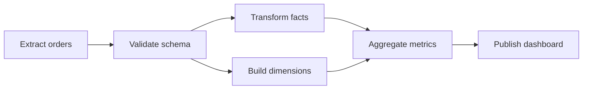

# DAG Orchestration

DAG orchestration coordinates work with explicit dependencies: extract data, transform it, train a model, publish metrics, refresh search indexes, or run analytics backfills. A DAG system turns dependency structure into runnable tasks while tracking data intervals, retries, backfills, and partial completion. It is a workflow engine specialized for graph-shaped batch and data work.

## DAG Model



A DAG should be acyclic because cycles make readiness ambiguous. Repeated work is represented by separate runs over intervals, not by graph cycles.

## Terms

| Term | Meaning |
|---|---|
| DAG definition | Versioned graph of tasks and dependencies |
| DAG run | One execution of the graph, often for a data interval |
| Task | A node in the graph |
| Task attempt | One try of a task |
| Sensor | A task waiting for external state |
| Backfill | Running historical intervals |

## Scheduler Responsibilities

The scheduler decides when a task is runnable:

```text
task is runnable when:
  all upstream tasks succeeded
  task run_after <= now
  task concurrency limits allow it
  DAG run is not canceled
  required external conditions are met
```

Workers should not decide dependency readiness. They should execute leased tasks.

## Data Intervals

For data systems, the interval is part of correctness.

| Run label | Data interval | Common bug |
|---|---|---|
| `2026-06-15` daily run | `2026-06-15T00:00Z` to `2026-06-16T00:00Z` | Treating run date as execution date |
| Hourly run at 10:00 | 09:00 to 10:00 | Reading incomplete late data |
| Backfill for May | Many daily intervals | Overloading live warehouse capacity |

Make interval boundaries explicit in task inputs and output paths.

## Idempotent Outputs

DAG tasks should write outputs deterministically:

```text
s3://warehouse/orders_daily/dt=2026-06-15/_tmp/run_id=abc
s3://warehouse/orders_daily/dt=2026-06-15/part-000.parquet
```

Write to a temporary location, validate, then atomically publish or swap metadata. This avoids half-written partitions after task failure.

## Backfills

Backfills are production load, not maintenance trivia.

Controls:

- Separate backfill queue.
- Concurrency caps by DAG and dataset.
- Warehouse budget limits.
- Read-only dry run for dependency expansion.
- Backfill pause/resume.
- Output overwrite policy.

## Dynamic DAGs

Dynamic task generation is useful for partitioned work, but it can overwhelm the scheduler.

| Pattern | Risk | Control |
|---|---|---|
| One task per customer | Millions of tasks | Batch customers into shards |
| One task per file | Scheduler metadata explosion | Manifest task plus worker-side batching |
| Runtime graph expansion | Hard to reason about retries | Persist expanded graph per run |

## Failure Semantics

| Failure | Desired behavior |
|---|---|
| Upstream task fails | Downstream tasks remain blocked or skipped |
| Task times out | Retry if idempotent; otherwise fail fast |
| Data quality check fails | Stop publish path and alert owner |
| Worker dies | Attempt is retried after lease expiration |
| Scheduler dies | Reconstruct runnable tasks from metadata |

## Observability

DAG observability needs both graph and data views:

- Critical path duration.
- Task duration by attempt.
- Queue wait vs execution time.
- Failed dependency count.
- Late data count.
- Backfill progress by interval.
- Dataset freshness.
- Output row counts and quality checks.

## When to Use

Use DAG orchestration for batch workflows, data pipelines, ML training pipelines, and dependency-heavy jobs. For request-time orchestration, use a workflow engine or service orchestration pattern instead.

## Related Patterns

- [Batch Processing](../13-data-pipelines/01-batch-processing.md)
- [Stream Processing](../13-data-pipelines/02-stream-processing.md)
- [Training Pipelines](../16-ml-systems/05-training-pipelines.md)
- [Lakehouse and Open Table Formats](../13-data-pipelines/05-lakehouse-table-formats.md)
