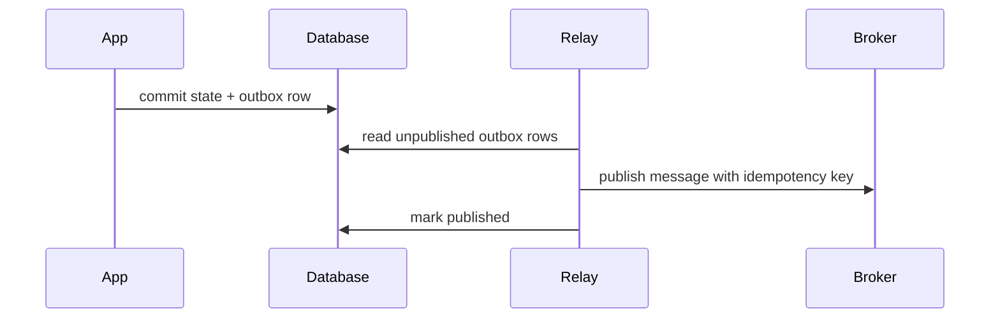

# Retry, Idempotency, and Compensation

Workflow and job systems live in the uncomfortable space between "try again" and "do not do it twice." Retrying is necessary because networks, workers, and dependencies fail. Retrying is dangerous because external side effects may already have happened. The design center is idempotency for repeated attempts and compensation for committed steps that must be logically undone.

## Retry Is a Contract

A retry policy must define:

- Which errors are retryable.
- Maximum attempts or maximum elapsed time.
- Backoff function and jitter.
- Whether attempts are allowed after cancellation.
- What happens after retry exhaustion.
- Which idempotency key protects the side effect.

Without this, every worker implements a different failure policy.

## Backoff

```text
delay = min(max_delay, base_delay * 2 ** attempts)
delay = random_between(delay * 0.5, delay * 1.5)
```

Jitter avoids synchronized retry storms after a dependency outage.

## Idempotency Keys

Use a stable key for one logical operation:

| Operation | Good key |
|---|---|
| Charge customer | `payment:{order_id}:{payment_attempt_id}` |
| Send order email | `email:order-confirmation:{order_id}` |
| Create shipment | `shipment:{order_id}:{warehouse_id}` |
| Publish daily report | `report:{report_id}:{data_interval}` |

The key should survive retries. If each attempt gets a new key, idempotency is disabled.

## Dedupe Store

```sql
CREATE TABLE idempotency_records (
  key TEXT PRIMARY KEY,
  status TEXT NOT NULL,
  response JSONB,
  created_at TIMESTAMPTZ NOT NULL,
  expires_at TIMESTAMPTZ
);
```

The dedupe store must be checked and written atomically around the side effect boundary, or delegated to the downstream service.

## Compensation

Compensation is not rollback. It is a new business action that counteracts a previous committed action.


A compensation can fail too. It needs its own retries, idempotency, alerts, and audit trail.

## Retry Matrix

| Error class | Retry? | Compensation? | Notes |
|---|---|---|---|
| Timeout before response | Yes | Unknown | Query idempotency record if possible |
| 5xx downstream error | Yes | Usually no | Use bounded retry and circuit breaker |
| 4xx validation error | No | No | Mark failed with operator-visible reason |
| Partial multi-step failure | Maybe | Yes | Compensate completed steps |
| Human rejection | No | Business-specific | Transition to rejected terminal state |

## Outbox for Side Effects

For database commit plus message publish, use the [outbox pattern](../05-messaging/07-outbox-pattern.md):



This prevents "state committed but event lost."

## Retry Budgets

Infinite retries hide incidents and create cost explosions. Use retry budgets:

- Per workflow instance.
- Per activity type.
- Per tenant.
- Per downstream dependency.
- Per time window.

When the budget is exhausted, fail visibly or move to a repair queue.

## Failure Modes

| Failure | Cause | Mitigation |
|---|---|---|
| Duplicate payment | New key per retry | Stable idempotency key |
| Silent retry loop | No max attempts | Retry budget and DLQ |
| Retry storm | Dependency outage | Circuit breaker and jitter |
| Broken compensation | Compensation not tested | Game days and compensation runbooks |
| Ambiguous timeout | Side effect may have happened | Query-by-idempotency-key API |

## Operational Metrics

- Retry attempts by error class.
- Retry exhaustion count.
- Compensation started/succeeded/failed.
- Idempotency conflict count.
- Dedupe store latency.
- DLQ age.
- Ambiguous outcome count.

## Related Patterns

- [Idempotency](../01-foundations/08-idempotency.md)
- [Outbox Pattern](../05-messaging/07-outbox-pattern.md)
- [Saga Pattern](../05-messaging/09-saga-pattern.md)
- [Retries, Timeouts, and Hedging](../06-scaling/10-retries-timeouts-hedging.md)
