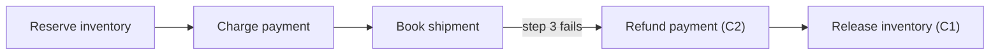

# Retry, Idempotency, and Compensation

## TL;DR

A distributed system cannot guarantee exactly-once delivery, so the only robust execution strategy is **at-least-once delivery made safe by idempotency**, with **compensation** for effects that can be neither retried away nor rolled back. These three ideas are not separate features; they are three layers of one failure-recovery story. Retries recover from transient failures but inevitably cause duplicate attempts; idempotency makes those duplicates harmless; and compensation handles the multi-step operations where a real rollback is impossible and the only way "back" is a new, semantically-undoing action. This page is the reliability core of the whole section: it explains the semantics that make every other job and workflow pattern correct under failure.

---

## The Central Thesis: Exactly-Once Is an Illusion

Almost every reliability bug in a workflow system traces back to a single false hope — that a message, a job, or an RPC will run *exactly once*. It will not. The famous "two generals" result and its practical descendants show that across an unreliable network you can have at-most-once delivery (send and never retry, accepting lost work) or at-least-once delivery (retry until acknowledged, accepting duplicates), but not exactly-once *delivery*. Every durable queue you would actually deploy — AWS SQS standard queues, most Kafka consumer setups, every "we'll redeliver if you don't ack" broker — gives you at-least-once. That is a deliberate choice: losing work silently is almost always worse than doing it twice, so production systems err toward redelivery.

The consequence is unavoidable. If the infrastructure redelivers, then your handler *will* run more than once for some messages, and the question is not whether duplicates happen but whether they are safe. The achievable goal is not exactly-once delivery; it is **effectively-once *effect***: at-least-once delivery plus idempotent processing, so that from the caller's and the data's point of view the operation happened once. This is the same equation the foundations page states — `at-least-once delivery + idempotent processing ≈ exactly-once` — and it is worth internalizing before touching any retry knob. Retries, idempotency, and compensation are the three mechanisms that turn that approximation into a guarantee you can reason about. See [Idempotency](../01-foundations/08-idempotency.md) and [Delivery Guarantees](../05-messaging/04-delivery-guarantees.md) for the delivery side; this page is about the *execution* side, where the duplicates land.

---

## Layer One: Retries, and Why They Are Dangerous

You retry because most failures in a distributed system are transient. A network blip drops a packet, a downstream service throttles you under load, a worker is preempted mid-task, a database fails over for fifteen seconds. None of these mean the operation is impossible; they mean it failed *right now*. A retry a moment later usually succeeds, and retrying is far cheaper than escalating every transient hiccup to a human. This is why retry logic is the first reliability mechanism every job system grows.

The danger is that naive retries do not just recover load — they *multiply* it, at the worst possible moment. The pathology has a name: the **retry storm** (or thundering herd). A dependency degrades, every caller's request times out, every caller immediately retries, and the dependency — already struggling — is now hit with double or triple its normal traffic precisely when it has the least capacity to absorb it. The retries push it from degraded to dead, and the outage that a backoff would have ridden out becomes a self-inflicted cascade.

The second pathology is **retry amplification across layers**. Real requests traverse a stack: a client calls an API gateway, which calls a service, which calls a database. If *each* layer retries three times on failure, a single user request can become 3 × 3 × 3 = 27 attempts at the bottom of the stack. Each layer thinks it is being resilient; together they are a load-amplification machine. The discipline here is to **retry at one layer, not every layer** — typically as close to the failure as possible — and to make timeouts shrink as you go down the stack so an inner retry cannot outlive the outer caller's patience.

The disciplines that make retries safe rather than self-destructive are well established:

- **Exponential backoff with jitter.** Doubling the delay after each attempt (`base × 2^attempt`, capped at a maximum) gives a struggling dependency room to recover. But backoff *alone* is not enough: if a thousand callers all failed at the same instant, they will all back off by the same amount and retry in the same synchronized wave — the storm just repeats on a slower clock. Adding randomized **jitter** spreads the retries across the interval and de-correlates the callers. AWS's "Exponential Backoff And Jitter" (Architecture Blog, 2015) showed that *full jitter* — picking a delay uniformly at random between zero and the backoff ceiling — dramatically reduced contention and completion time versus plain backoff. The lesson is blunt: backoff without jitter is a half-measure that reschedules the herd rather than dispersing it.
- **Bounded attempts and retry budgets.** Unbounded retries do not improve reliability; they hide incidents and create cost explosions, quietly hammering a dead dependency forever while the real problem goes unalarmed. Cap attempts and elapsed time, and enforce **retry budgets** that limit retries as a *fraction* of total traffic (Google's SRE practice caps retries at roughly 10% of requests). A budget converts "retry on every failure" into "retry until the system as a whole is spending too much energy retrying," at which point the right move is to fail loudly and shed load. Pair this with [circuit breakers](../06-scaling/06-circuit-breakers.md) and [backpressure](../06-scaling/07-backpressure.md): when a dependency is clearly down, a tripped breaker stops retries at the source instead of letting each caller discover the outage individually.
- **Classify the failure before retrying.** This is the most-skipped discipline and the highest-leverage one. Failures split into **transient/retriable** (timeouts, throttling, 503s, leader elections, preemptions) and **deterministic/permanent** (a 400 validation error, a malformed payload, a logic bug, a missing required field). Retrying a transient failure is correct. Retrying a *deterministic* failure is pure waste — the second attempt fails identically to the first, burning capacity and latency while obscuring the real defect behind an "intermittent" symptom. The retry policy is, at heart, a *classification* problem, and getting the classification wrong turns a clear bug into a flaky mystery.

A retry policy is therefore a contract, not an afterthought. It must answer: which errors are retriable, the maximum attempts or elapsed time, the backoff-and-jitter function, whether attempts are allowed after cancellation, what happens at exhaustion (dead-letter queue, repair queue, page a human), and — critically — *which idempotency key protects the side effect*. Without an explicit contract, every worker invents its own failure policy and the system's behavior under stress becomes unknowable.

---

## The Ambiguity Problem: Why Idempotency Is Mandatory

There is one failure that forces the whole design, and it is the **ambiguous timeout**. You call a payment service; the call times out. Did the charge go through? You genuinely do not know. The request may have been lost on the way out (no charge), or it may have succeeded and the *response* was lost on the way back (charge made, but you never heard). From the caller's side these two cases are indistinguishable, yet they demand opposite actions: retry in the first case, do *not* retry in the second.

This ambiguity is not an edge case you can engineer away — it is a fundamental property of communicating over an unreliable channel. And it is precisely why idempotency is **mandatory, not optional**, in any system that retries. If you cannot tell whether the first attempt's side effect happened, the only safe move is to retry in a way that is harmless if it already did. Idempotency converts "I don't know if it worked, and I'm afraid to retry" into "I'll just retry; if it already worked, the retry is a no-op." It is the mechanism that makes the ambiguous timeout survivable. The complementary tool is a **query-by-idempotency-key API** ("what is the status of operation `X`?"), which lets a caller resolve the ambiguity directly instead of guessing.

---

## Layer Two: Idempotency, the Property That Makes Retries Safe

Idempotency is the property that applying an operation more than once has the same effect as applying it once. It is the load-bearing mechanism of the whole reliability story: retries *create* duplicates, and idempotency makes those duplicates harmless. The foundations page treats the mechanics in depth — [Idempotency](../01-foundations/08-idempotency.md) — so here the focus is on how it applies specifically to jobs and workflows.

The cleanest path is **natural idempotency**: structure the operation so that repeating it is inherently safe. A `PUT` that sets a resource to a known state is naturally idempotent; a naive `INSERT` is not. `SET balance = 100` is idempotent; `balance = balance + 50` is not — run it twice and you've added 100. Designing effects as state-assignments (`SET status = 'shipped'`) or as upserts keyed on a business identifier (`INSERT ... ON CONFLICT DO NOTHING`) means a retry simply re-establishes the same state, no bookkeeping required. When natural idempotency is available, prefer it; it is the cheapest and most robust form.

When the effect is not naturally idempotent — charging a card, sending an email, creating a shipment — you reach for an **idempotency key**: a stable token that names one *logical* operation, carried on every attempt of that operation. The downstream service (or your own **dedup store**) records the key on first execution and recognizes it on retry, returning the original result instead of re-executing. Stripe's idempotency keys are the canonical implementation: a client generates a key, sends it on the charge request, and Stripe guarantees that retries with the same key never double-charge, replaying the first response instead. The single most common idempotency bug in job systems is generating a **new key per retry attempt** — that disables deduplication entirely, because each "duplicate" looks like a brand-new operation. The key must be derived from the *logical work* (the order, the payment intent, the report interval), not the attempt.

| Logical operation | Stable idempotency key |
|---|---|
| Charge customer | `payment:{order_id}:{payment_intent_id}` |
| Send order-confirmation email | `email:order-confirmation:{order_id}` |
| Create shipment | `shipment:{order_id}:{warehouse_id}` |
| Publish daily report | `report:{report_id}:{data_interval_start}` |

Two distinctions matter when applying this to workflows. The first is **idempotent delivery versus idempotent effect**: deduplicating the *message* (the broker delivers it once) is different from making the *effect* idempotent (the handler's action is safe to repeat). Message-level dedup windows are bounded in time and scope and cannot be your only defense; the effect itself must tolerate repetition, because a redelivery outside the dedup window will eventually slip through. The second is the **atomicity boundary**: the dedup-store write and the side effect must commit together, or you reintroduce the very gap you closed. If you perform the side effect and *then* record the key, a crash in between lets the next attempt repeat the effect; if you record the key and *then* perform the side effect, a crash leaves a key marked "done" for work that never happened. Inside a single database, wrap both in one transaction. Across a service boundary — where the effect lives in another system — you cannot share a transaction, so you lean on the downstream service's own idempotency (pass it your key) or on the [outbox pattern](../05-messaging/07-outbox-pattern.md) to bridge the gap.

The outbox deserves a specific mention because the "commit local state *and* publish an event" problem is endemic to workflow steps. Writing to the database and publishing to a broker are two systems with no shared transaction, so a crash between them produces either a committed state with no event (lost downstream work) or an event with no committed state (a phantom). The outbox makes the event part of the *same* database transaction as the state change — the relay later reads committed outbox rows and publishes them at-least-once with an idempotency key — so the only failure mode left is a *duplicate* publish, which the consumer's idempotency already handles. The problem is reduced from "atomic across two systems" (impossible without distributed transactions) to "idempotent on the consumer" (routine).

---

## Layer Three: Compensation and Sagas, When You Cannot Undo

Idempotent retries handle a *single* step that may run twice. They do not handle a *multi-step* operation that fails partway through, where some steps have already committed irreversible effects. You reserved inventory, charged the customer, and then the shipment booking failed. You cannot retry your way out of this — the shipment is genuinely unavailable — and you cannot roll back, because the charge and the reservation are committed in separate systems that share no transaction. A classic two-phase commit (2PC) across these services is not an option in practice: it requires a coordinator holding locks across independent systems for the duration, which destroys availability and does not even exist for most third-party APIs.

The answer is **compensation**: instead of rolling back, you execute new business actions that *semantically undo* the completed steps. This is the **Saga** pattern, introduced by Garcia-Molina and Salem (SIGMOD 1987) originally to avoid holding database locks across long-lived transactions, and now the standard model for multi-service business workflows. A saga is a sequence of local transactions T₁…Tₙ, each with a corresponding compensating action C₁…Cₙ. If the saga fails at step *k*, the system runs Cₖ₋₁…C₁ in reverse to undo the committed work. Compensation is **not rollback**: the original effect *did happen* and remains in the audit trail. You don't erase the charge; you issue a *refund*. You don't un-reserve inventory; you *release* the reservation. The system passes through visible intermediate states — a saga sacrifices isolation (other transactions can see the half-done work) in exchange for the availability that locking-free, cross-service operations require.

The canonical example is a **travel booking**: reserve a flight, then a hotel, then a car. Suppose the car reservation fails. There is no global transaction to abort; the flight and hotel are already booked in two separate vendor systems. The saga compensates backward — cancel the hotel, cancel the flight — leaving the customer un-charged and the system consistent, even though three independent systems were touched.

Several properties of sagas matter for correct design. **Backward recovery versus forward recovery**: backward recovery compensates completed steps and aborts the whole operation (the travel example); forward recovery instead keeps *retrying* the failed step until it succeeds, appropriate when the operation must ultimately complete and the failure is transient (a payment capture that will eventually go through). Real systems mix both — retry the step a bounded number of times (forward), and compensate only when retries are exhausted (backward). **Orchestrated versus choreographed**: an *orchestrated* saga has a central coordinator (a [durable workflow engine](./04-durable-execution-workflow-engines.md) like Temporal, AWS Step Functions, or Netflix Conductor) that explicitly invokes each step and each compensation — easy to reason about and to observe, at the cost of a central component; a *choreographed* saga has each service react to events and emit the next event with no central brain — more decoupled, but the overall flow is implicit and notoriously hard to debug. For anything beyond a couple of steps, orchestration's explicitness usually wins. See [Saga Pattern](../05-messaging/09-saga-pattern.md) for the messaging-side treatment.

The non-negotiable rule is that **compensations are themselves operations that can fail and be retried, so they must be idempotent.** The refund call can time out exactly like the charge call did. If your recovery logic retries a non-idempotent compensation, you can refund twice. Worse, a **lost compensation** — a compensating action that fails and is never retried — leaves the saga permanently half-undone: the customer charged but never shipped, the inventory reserved but never sold. Compensation logic needs its own retries, its own idempotency keys, its own alerting, and its own audit trail, and it deserves the same rigor as the forward path — often *more*, because it runs in the rare failure case that is least exercised and least tested.

---

## Failure Modes

The characteristic failures of this layer recur across every organization, and naming them is most of preventing them.

**The non-idempotent double effect.** A retry (or a redelivery) runs a non-idempotent operation twice: a customer charged twice, two shipments created, a counter incremented past reality. The root cause is almost always a missing or unstable idempotency key — frequently a *new* key minted per attempt. The defense is a stable, logical-operation key plus a dedup store checked atomically with the effect.

**The retry storm.** A dependency degrades, every caller retries in lockstep, and the synchronized load finishes off the dependency. The cause is backoff without jitter, or no backoff at all, or retries at every layer. The defense is full-jitter exponential backoff, single-layer retry, retry budgets, and circuit breakers that stop retries when a dependency is clearly down.

**The poison job.** A message that deterministically fails — a malformed payload, a bug triggered by specific data — is retried forever because the retry policy never classified it as permanent. It consumes a worker, blocks the queue head, and generates endless error noise. The defense is failure classification (don't retry deterministic errors), bounded attempts, and a **dead-letter queue** that quarantines the poison message after N failures so the rest of the queue drains. See [Dead-Letter Queues](../05-messaging/08-dead-letter-queues.md) and [Background Jobs and Worker Pools](./02-background-jobs-worker-pools.md).

**The partially-applied saga.** A multi-step operation fails midway and is left in an inconsistent intermediate state — steps 1 and 2 committed, step 3 failed, and compensation either never ran or ran incompletely. The defense is durable saga state (an orchestrator that remembers exactly which steps committed), idempotent compensations, and a reconciliation process that detects and repairs stuck sagas.

**The lost compensation.** A compensating action fails and is silently dropped, leaving committed effects un-undone — the most insidious failure because the forward path *succeeded* and nothing obviously broke; the money is just gone. The defense is treating compensations as first-class durable work with their own retries, alerting, and a repair queue for compensations that exhaust retries.

| Failure | Root cause | Mitigation |
|---|---|---|
| Duplicate payment | New/unstable key per retry | Stable logical idempotency key + dedup store |
| Retry storm | No jitter; multi-layer retry | Full-jitter backoff, single-layer, circuit breaker |
| Poison job retried forever | No failure classification | Bounded attempts + DLQ + permanent-error detection |
| Partially-applied saga | No durable saga state | Orchestrator + idempotent compensations + reconciliation |
| Lost compensation | Compensation treated as fire-and-forget | Durable compensation work, retries, repair queue |
| Ambiguous outcome | Side effect status unknowable | Query-by-idempotency-key API |

---

## Decision Framework

When designing a step that has an external effect, the first and most important question is **how reversible is the effect, and is it internal or an external side effect?** The answer routes you to one of three strategies.

**Idempotent retry** is the right tool when the effect is *internal and naturally repeatable* — a row write, a state transition, an upsert into your own database — or when the downstream service exposes idempotency keys so you can make an external call safely repeatable. Here a single step can simply be retried until it succeeds, with backoff and a stable key, and duplicates are harmless. This is the default; reach for it first and structure effects to make it applicable.

**Saga compensation** is the right tool when an operation spans *multiple steps across multiple systems*, some of which commit *irreversible-but-undoable* effects (a charge that can be refunded, a reservation that can be released), and a true transaction across them is impossible. Retrying the failed step doesn't restore consistency because earlier steps already committed; you need explicit compensating actions, an orchestrator to track which steps ran, and idempotent compensations for the recovery path.

**Accept-and-reconcile** is the right tool when the effect is *external and genuinely irreversible* — an email already sent, a physical package already shipped, a third-party notification already delivered — where neither a retry nor a compensation can take it back. Here you minimize the blast radius of duplicates (best-effort idempotency, dedup windows, careful exactly-once-ish guards) and accept that some inconsistency will leak, then run an asynchronous **reconciliation** process that detects discrepancies after the fact and resolves them — a follow-up "correction" email, a credit, a manual review queue. Eventual consistency with reconciliation is often the only honest answer for irreversible external effects, and pretending otherwise (claiming exactly-once for an email) is how teams ship reliability theater.

The framework, compressed: *if you can repeat it, make it idempotent and retry. If you can undo it with a business action, build a saga. If you can do neither, contain the duplicates and reconcile.* Reversibility and the internal/external boundary are the two axes that decide which one you are in.

---

## Key Takeaways

1. Exactly-once delivery is impossible across an unreliable network; the achievable goal is **effectively-once effect** = at-least-once delivery + idempotent processing.
2. Retries, idempotency, and compensation are three layers of one failure-recovery story, not three independent features.
3. Retry only transient failures; retrying a deterministic failure is pure waste that hides the real bug.
4. Backoff without jitter reschedules the herd rather than dispersing it — use full-jitter exponential backoff (AWS, 2015), bounded attempts, and retry budgets, and retry at one layer, not every layer.
5. The ambiguous timeout — not knowing whether a side effect happened — is *why* idempotency is mandatory, not optional.
6. Prefer natural idempotency (SET/upsert/PUT) over key-based dedup; when you need keys, derive them from the logical operation and keep them stable across attempts.
7. The dedup-store write and the side effect must be atomic; across services, lean on downstream idempotency keys or the outbox pattern.
8. Sagas (Garcia-Molina & Salem, 1987) replace impossible cross-service rollback with compensating actions that semantically undo committed steps; prefer orchestration for anything non-trivial.
9. Compensations can fail and be retried, so they must be idempotent and durable — a lost compensation leaves the system permanently half-undone.
10. Choose by reversibility: idempotent-retry for repeatable effects, saga-compensation for undoable multi-step effects, accept-and-reconcile for irreversible external side effects.

---

## Related Patterns

- [Idempotency](../01-foundations/08-idempotency.md) — the mechanics of keys, dedup stores, and effectively-once
- [Delivery Guarantees](../05-messaging/04-delivery-guarantees.md) — at-most/at-least/exactly-once semantics
- [Outbox Pattern](../05-messaging/07-outbox-pattern.md) — atomic state change plus event publish
- [Saga Pattern](../05-messaging/09-saga-pattern.md) — messaging-side treatment of compensation
- [Dead-Letter Queues](../05-messaging/08-dead-letter-queues.md) — quarantining poison jobs
- [Retries, Timeouts, and Hedging](../06-scaling/10-retries-timeouts-hedging.md) — retry mechanics at the RPC layer
- [Circuit Breakers](../06-scaling/06-circuit-breakers.md) and [Backpressure](../06-scaling/07-backpressure.md) — stopping retry storms
- [Durable Execution Workflow Engines](./04-durable-execution-workflow-engines.md) — orchestrators that drive sagas and retries
- [Background Jobs and Worker Pools](./02-background-jobs-worker-pools.md) — where retries and DLQs live

---

## References

1. [Exponential Backoff And Jitter](https://aws.amazon.com/blogs/architecture/exponential-backoff-and-jitter/) — AWS Architecture Blog, 2015
2. [Sagas](https://www.cs.cornell.edu/andru/cs711/2002fa/reading/sagas.pdf) — Garcia-Molina & Salem, ACM SIGMOD, 1987
3. [Designing robust and predictable APIs with idempotency](https://stripe.com/blog/idempotency) — Stripe Engineering
4. [Amazon SQS at-least-once delivery](https://docs.aws.amazon.com/AWSSimpleQueueService/latest/SQSDeveloperGuide/standard-queues.html) — AWS Documentation
5. [Site Reliability Engineering, Ch. 22: Addressing Cascading Failures](https://sre.google/sre-book/addressing-cascading-failures/) — Beyer et al., Google, 2016
6. [Pattern: Saga](https://microservices.io/patterns/data/saga.html) — Chris Richardson, microservices.io
7. [Life beyond Distributed Transactions](https://queue.acm.org/detail.cfm?id=3025012) — Pat Helland, ACM Queue, 2016
8. [Temporal: Workflow Execution and Compensation](https://docs.temporal.io/encyclopedia/detecting-application-failures) — Temporal Documentation
