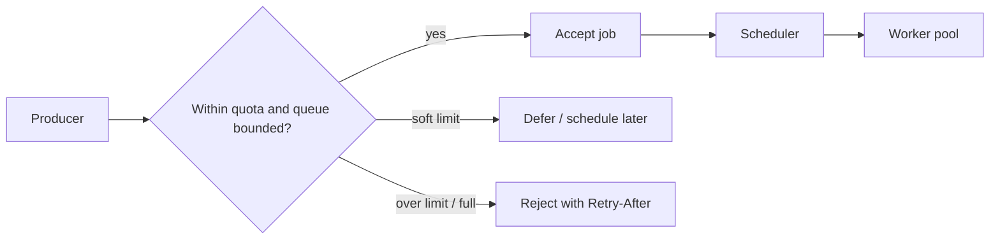

# Priority, Fairness, and Backpressure

## TL;DR

A shared job system is a contended resource, and contended resources fail in predictable ways: one noisy tenant or one flood of low-value work starves everyone else, and a system that accepts work faster than it can finish it grows an unbounded backlog until it collapses. Priority, fairness, and backpressure are the three mechanisms that keep a shared worker pool healthy. **Priority** decides what jumps the queue, at the risk of starving low-priority work and inverting through held resources. **Fairness** — weighted fair queueing, fair-share scheduling, per-tenant quotas — guarantees every tenant a proportional slice so no single producer monopolizes capacity. **Backpressure** makes the system push back when it cannot keep up, through bounded queues, load shedding, and signals that slow producers down, rather than absorbing work it can never complete. The whole problem is the quality-of-service problem of a multi-tenant cluster, identical in structure to scheduling a shared GPU fleet — only the resource being contended is execution slots instead of accelerators.

---

## The Shared Queue Is a Contended Resource

The moment a job queue stops serving one application and starts serving many tenants and many priorities, scheduling policy stops being an implementation detail and becomes a product feature. A single FIFO queue feeding a single worker pool is perfectly adequate until two things become true at once: the work is heterogeneous in value, and the producers are independent. When both hold, the queue becomes a contended resource, and a contended resource without a governing policy degrades in ways that are entirely predictable and almost always discovered in production.

The reason is structural. Workers are finite; jobs are not equal. Some jobs are on the critical path of a user-visible request — a password reset email, a checkout confirmation — and a minute of delay is a defect. Others are batch maintenance that no human is waiting on. Some tenants pay for stronger guarantees; some downstream dependencies enforce strict rate limits; some items are retries that should wait behind fresh work rather than crowd it out. A scheduler that treats all of these identically is making a policy decision by omission, and the default policy — first come, first served — happens to be the one that lets bulk work bury urgent work and lets one tenant's flood drown the rest.

Priority, fairness, and backpressure are not three independent features; they are three answers to three distinct failure questions about the same contended resource. *What should run next when the queue is non-empty?* is priority. *How do we stop one producer from consuming the whole resource?* is fairness. *What do we do when work arrives faster than we can finish it?* is backpressure. A mature shared job system needs all three, because each one, deployed alone, fails in a way the other two would have caught.

---

## Priority Scheduling and Its Two Hazards

The most intuitive policy is strict priority: maintain ordered lanes, and always drain the highest non-empty lane before touching a lower one. High-value work jumps ahead of low-value work, latency-sensitive jobs are insulated from bulk backlogs, and the implementation is trivial. Strict priority is the right starting point precisely because it is simple and its intent is obvious. It also carries two hazards that have sunk real systems, and both must be designed against rather than discovered.

The first hazard is **starvation**. Under strict priority, a lower lane runs only when every higher lane is empty. If a high-priority producer never stops — a tenant that enqueues a steady stream of urgent jobs, a retry storm that keeps refilling the top lane — the low-priority lanes wait forever. The work is not lost; it is indefinitely deferred, which is operationally the same thing. The standard defense is **aging** (also called priority escalation): a job's effective priority rises the longer it waits, so a low-priority job that has sat for an hour eventually outranks fresh high-priority arrivals and is guaranteed to run. Aging converts an unbounded wait into a bounded one. A minimal, well-behaved aging rule boosts priority in discrete steps capped at a ceiling, so urgent work still wins under normal load but nothing waits past its deadline:

```text
effective_priority = base_priority + min(max_boost, floor(wait_seconds / aging_interval) * boost_step)
```

The second hazard is **priority inversion**, and it is subtler because it does not look like a scheduling bug at all. Inversion happens when a low-priority job holds a resource that a high-priority job needs — a lock, a connection from a small pool, an exclusive lease — and a medium-priority job that needs neither preempts the low-priority holder. The high-priority job is now blocked behind a low-priority one that cannot make progress because something irrelevant keeps jumping ahead of it. The canonical case study is NASA's **Mars Pathfinder (1997)**: the lander began experiencing total system resets on the Martian surface because a high-priority bus-management task blocked on a mutex held by a low-priority meteorological task, while medium-priority tasks ran in between and prevented the low-priority task from releasing the mutex; a watchdog timer interpreted the stall as a hang and reset the spacecraft. The fix, uploaded to Mars, was *priority inheritance* — temporarily lifting the holder's priority to that of the highest waiter so it runs, releases, and unblocks. The lesson for a job system is that strict priority over the queue is not enough; any shared dependency a job acquires while running can re-introduce inversion, and the mitigation is to size and isolate those dependencies (dedicated concurrency pools per dependency) so a low-priority job cannot pin a resource a high-priority job is waiting on.

A third, quieter danger is having **too many priority levels**. Each additional level is a promise that the system can meaningfully distinguish that gradation under load, and most cannot. Operators cannot reason about a twelve-level scheme, every team lobbies for the top tier, and the levels collapse into "important" and "everything else" anyway. Three to five levels — roughly *interactive*, *standard*, *bulk*, and a *best-effort* floor — is almost always enough, and fewer levels with clear semantics beat many levels nobody trusts.

---

## Head-of-Line Blocking

Even with priority and aging, a single queue has a structural weakness: **head-of-line blocking**. If the item at the front of a queue is slow, stuck, or part of one giant tenant's backlog, everything behind it waits, regardless of how cheap or urgent those trailing items are. The term comes from networking — a packet at the head of a switch buffer blocking the line behind it — and the dynamics are identical in a job system. One tenant enqueues fifty thousand items; a single FIFO queue now serves that tenant's pile-up before anyone else's first job, and every other tenant experiences an outage caused by a workload they have nothing to do with.

The fix is to stop sharing one line. **Multiple queues** — per-tenant queues, per-priority lanes, or sharded queues keyed on tenant or job type — let the scheduler interleave across queues so one queue's backlog cannot stall the others. The scheduler then round-robins or weight-selects among non-empty queues, and a tenant with fifty thousand items competes for its *share* of worker time rather than seizing the front of the only line. This is the same insight that drives sharded request routing and shuffle sharding: physical separation of work streams bounds the blast radius of any single stream's misbehavior. The cost is more queues to manage and a scheduler that must choose among them, which is exactly the choice that fairness governs.

---

## Fairness: From Strict Priority to Weighted Shares

Priority answers "what is most important?" Fairness answers a different question: "given that no tenant's work is worthless, how do we divide finite capacity proportionally?" The distinction matters because strict priority and fairness pull in opposite directions. Strict priority says *drain the top lane completely first*; fairness says *never let any lane go entirely unserved, even while higher-value work exists*. A shared multi-tenant system needs both: priority within a tenant's allotment, fairness across tenants.

The foundational algorithm is **Weighted Fair Queueing (WFQ)**, introduced by Demers, Keshav, and Shenker in 1989 as a packet-scheduling discipline and since adapted to nearly every shared scheduler. WFQ assigns each queue a weight and serves them so that, over any interval, each receives throughput proportional to its weight — a tenant with weight 3 gets three times the worker-seconds of a tenant with weight 1, but the weight-1 tenant is *never* starved to zero. Because real jobs vary wildly in cost (a fifty-millisecond email versus a ten-minute video transcode), practical schedulers prefer **Deficit Round Robin** (Shreedhar and Varghese, 1995), which charges each queue by the actual cost of the work it dequeues rather than by job count, so a tenant submitting a few expensive jobs cannot consume more than its share by hiding cost behind a low item count. **Earliest Deadline First** is the right discipline when jobs carry real deadlines, but it thrashes badly when deadline estimates are wrong, so it belongs only where deadlines are trustworthy.

Layered on top of weighted scheduling are **per-tenant quotas**: hard or soft caps on the rate or concurrency a tenant may consume, regardless of how empty the system is. Quotas impose a ceiling where weights impose a ratio; together they guarantee both that a tenant gets at least its share (weight) and that it cannot exceed its allotment and starve a burst from someone else (quota). Fairness, critically, does not mean equal throughput — a paying tenant legitimately gets more than a free one. It means no tenant can consume unbounded shared capacity without an explicit policy decision granting it.

This is precisely the **multi-tenant cluster** problem described for shared GPU fleets in [training pipelines](../16-ml-systems/05-training-pipelines.md): a GPU cluster serving a fraud team, a recommendations team, and a swarm of experimenters uses fair-share scheduling with per-team weights, quotas on GPU-hours, and preemption of low-priority experiments by high-priority production runs. A job queue serving many tenants is the same problem with a different contended resource — execution slots instead of accelerators — and the same mechanisms apply unchanged. **Google's Borg** (Verma et al., 2015) makes this concrete at scale: production-priority and batch-priority bands share one fleet, batch work runs in the slack left by production work, and high-priority tasks *preempt* low-priority ones to reclaim capacity — safe only because the preempted batch work is checkpointable and re-runnable. Preemption is the cluster-scheduling analog of aging in reverse: instead of promoting starved work, it demotes and evicts low-value work to make room for high-value work that just arrived.

---

## Backpressure: Pushing Back Before Collapse

Priority and fairness decide how to allocate a busy system. Backpressure addresses a different and more dangerous regime: what happens when work arrives faster than the workers can finish it. The intuition that a queue "absorbs" bursts is correct only for transient bursts. For a sustained imbalance, a queue does not absorb load — it *defers* it, and the deferral grows without bound.

The governing law is **Little's Law** (John Little, 1961): in any stable queuing system, the average number of items in the system equals the average arrival rate times the average time each item spends in the system (`L = λ × W`). Rearranged, the average wait is queue length divided by service rate. The decisive consequence is the stability condition: if the arrival rate λ exceeds the service rate μ, there is *no* steady state — queue length grows linearly forever, wait time grows with it, and the only thing that stops the growth is the system running out of memory or the queue hitting a bound. A queue is not a solution to λ > μ; it is a way to convert an overload into a latency debt that compounds until something breaks. The single most important number to monitor on a job queue is therefore not its length but its *trend*: a steadily rising backlog is the unambiguous signature of λ > μ, and no amount of priority reshuffling fixes it, because reordering a growing queue changes who waits, not whether the system is overloaded.

Backpressure is the set of mechanisms that enforce λ ≤ μ rather than pretending it holds. The first is the **bounded queue**: a queue with a hard capacity that refuses new work when full. An unbounded queue is an unbounded liability; bounding it converts silent latency growth into an explicit, observable rejection at the moment overload begins. The second is **load shedding** — when the queue is full or the system is unhealthy, reject or drop low-value work so that high-value work still completes. For user-facing operations, rejecting a request immediately with a `Retry-After` is almost always better than accepting a job that will complete hours late; a fast, honest "no" preserves the system, while a slow "yes" destroys it. The third is **producer-side signaling**: propagating the pressure back to whoever is enqueueing so they slow down, whether through a **token bucket** that meters admission, a `429`/`Retry-After` response, or a blocking enqueue that stalls the producer when the queue is full. The essential design rule is that *backpressure must affect enqueueing, not just dequeuing*. A system that only throttles its workers while accepting everything at the front door is still accepting work it cannot finish; the backlog simply moves from the worker to the queue, and Little's Law catches up regardless. These mechanisms are developed in depth under [backpressure](../06-scaling/07-backpressure.md), [rate limiting](../06-scaling/05-rate-limiting.md), and the broader [load-shedding and retry](../06-scaling/10-retries-timeouts-hedging.md) patterns; in a job system they are applied at the admission boundary.



Backpressure also has a defensive subtlety unique to job systems: **retry amplification**. When a downstream dependency slows, failed jobs are retried, and naive retries multiply the load on the already-struggling dependency at exactly the wrong moment, turning a brownout into an outage. Retries must therefore be treated as lower-priority work that waits behind fresh jobs, must back off exponentially, and must be capped — otherwise the retry path becomes a self-sustaining flood that the backpressure mechanisms were meant to prevent.

---

## Isolation and Bulkheading

Fairness divides a shared pool proportionally; isolation goes further and refuses to share at all where the blast radius justifies the cost. The **bulkhead** pattern — named for the watertight compartments that keep a hull breach from flooding an entire ship — separates workloads into independent pools or queues so a runaway workload is contained within its compartment. A tenant whose jobs deadlock, a job type that exhausts database connections, an integration that triggers a retry storm: each is bounded to its own pool and cannot consume the capacity the rest of the system depends on.

The trade-off is utilization versus containment. Perfect isolation — a dedicated pool per tenant — wastes capacity, because each pool must be sized for that tenant's peak while sitting idle the rest of the time, and the idle slack cannot be lent to a busy neighbor. Full sharing maximizes utilization but couples every tenant's fate to every other's. The pragmatic middle ground is to isolate by *risk class* rather than by tenant: a shared pool for the many small, well-behaved tenants governed by fairness and quotas, plus dedicated pools for the few workloads whose failure modes are severe enough to justify reserved capacity — the largest tenants, the jobs that hold scarce external resources, the work that must never be starved by anyone. This mirrors Borg's separation of production and batch pools and the GPU cluster's separation of production from experimental workloads: isolate where the blast radius is unacceptable, share where fairness suffices.

---

## Tuning: Levels, Weights, and Bounds

The three mechanisms are only as good as the numbers chosen for them, and the tuning is where most shared job systems get into trouble.

**Priority levels** should be few and semantically distinct — interactive, standard, bulk, best-effort — because every level the system cannot meaningfully schedule under load is a level that erodes trust in the whole scheme. Resist the pressure to add a level for every stakeholder; the right answer to "my work is special" is usually a quota or a weight, not a new tier.

**Weights** encode the proportional shares tenants are entitled to and should map to something real — contract tier, paid capacity, business criticality — not to whoever complained most recently. Weights are ratios, so their absolute values do not matter; what matters is that they sum to a defensible allocation and that the lowest weight still guarantees a non-zero share.

**Queue bounds** are the hardest and most consequential number, because they encode where the system chooses to fail. Little's Law gives the discipline: a bound should be set so that, at the maximum tolerable wait time W and the known service rate μ, the queue's worst-case length stays under the bound (`bound ≈ μ × W_max`). A bound much larger than this is not generous — it is a guarantee that, under overload, jobs sit in the queue far longer than they are useful before anyone notices. A correctly sized bound makes the queue reject work at roughly the moment that accepting it would violate the latency SLO, which is exactly when rejection is the right answer.

A useful instrumentation set follows directly from these mechanisms: queue age and depth per priority and per tenant, share of worker-seconds consumed per tenant (to verify weights are being honored), admission rejections and deferrals, starvation counts, priority-inversion incidents, downstream-pressure throttles, and the backlog *trend* that signals λ > μ before the queue overflows.

---

## Failure Modes

The characteristic failures of shared job systems recur across organizations, and naming them is most of preventing them.

**Starvation** is low-priority work that never runs because a higher lane never drains. The symptom is old jobs that are technically queued but functionally abandoned; the defense is aging and guaranteed minimum shares so every lane is served eventually.

**Priority inversion** is a high-priority job blocked behind a low-priority one that holds a shared resource — the Mars Pathfinder failure. The symptom is unexplained stalls of important work while the system looks busy elsewhere; the defense is priority inheritance on locks and dedicated concurrency pools for scarce dependencies so a low-priority job cannot pin what a high-priority job needs.

**Head-of-line blocking** is one slow or oversized item at the front of a shared queue stalling everything behind it. The symptom is a tenant-specific or job-type-specific backlog causing a system-wide slowdown; the defense is per-tenant or sharded queues that interleave instead of one line that serializes.

**Unbounded queue growth** is the overload failure: λ exceeds μ, the backlog grows linearly, latency compounds, and the system eventually collapses or runs out of memory. The symptom is a steadily rising queue depth that no reordering fixes; the defense is bounded queues, load shedding, and producer-side backpressure that enforces λ ≤ μ at the door.

**The noisy neighbor** is one tenant's flood consuming capacity the rest depend on, whether from a bug, a backfill, or a bad actor. The symptom is correlated latency for unrelated tenants; the defense is per-tenant quotas, weighted fairness, and isolation of high-risk workloads into their own pools.

**Retry amplification** is failed work multiplying load on an already-struggling dependency. The symptom is a brownout escalating into an outage as retries pile on; the defense is lower-priority retry lanes, exponential backoff, and retry caps.

---

## Decision Framework

The right scheduling architecture is keyed on three variables: the number of independent tenants, the degree of SLA differentiation among workloads, and the acceptable blast radius when one workload misbehaves.

If there is effectively **one tenant and uniform work** — an internal system where all jobs are equally valuable and producers are cooperative — a **single bounded FIFO queue** is correct. Adding priority lanes or fairness here is complexity with no payoff; the only non-negotiable is that the queue be *bounded*, because even a single producer can overload a worker pool.

If there is one tenant but **clearly differentiated work** — latency-sensitive jobs alongside bulk batch work — use **priority lanes with aging**. A small number of strict-priority lanes insulates urgent work from backlogs, and aging guarantees the bulk lanes are not starved. This is the right step up the moment some jobs are user-facing and others are not.

If there are **multiple independent tenants sharing one pool**, the FIFO and simple-priority models both fail to the noisy neighbor, and you need **per-tenant fair queueing**: weighted fair shares or deficit round robin across per-tenant queues, plus quotas, plus aging within each tenant's lanes. This is the point at which scheduling becomes a genuine quality-of-service system, and it is where most shared platforms should land.

If a tenant's misbehavior or a workload's failure mode carries an **unacceptable blast radius** — a few large customers whose floods would drown everyone, or jobs holding scarce external resources — escalate to **multi-tenant isolation**: dedicated pools or queues for the high-risk workloads, bulkheaded from the shared fair-queued pool that serves the long tail. The cost is lower utilization; the benefit is that no single workload can take down the platform. Reserve full isolation for the cases where the blast radius, not merely the unfairness, is what you cannot tolerate.

Across all four levels, backpressure is not optional and not a level you graduate into — every shared queue must be bounded and must push back at admission, because every one of them is subject to Little's Law.

---

## Key Takeaways

1. A shared job queue is a contended resource; without a governing policy it fails predictably to starvation, head-of-line blocking, noisy neighbors, and unbounded growth.
2. Priority, fairness, and backpressure answer three distinct questions — what runs next, how capacity is divided, and what happens under overload — and a mature system needs all three.
3. Strict priority starves low-priority work; aging (priority escalation) converts an unbounded wait into a bounded one without sacrificing urgency under normal load.
4. Priority inversion — a low-priority job holding a resource a high-priority job needs — sank Mars Pathfinder in 1997; defend against it with priority inheritance and isolated concurrency pools for scarce dependencies.
5. One slow or oversized item blocks everything behind it in a single queue; per-tenant or sharded queues let the scheduler interleave and bound the blast radius.
6. Fairness means proportional shares, not equal throughput; weighted fair queueing and deficit round robin guarantee every tenant a slice while quotas cap any one tenant — the same fair-share problem as a shared GPU cluster, applied to execution slots.
7. Little's Law makes overload unambiguous: when arrival rate exceeds service rate there is no steady state, and a rising backlog trend — not queue length — is the signal.
8. Backpressure must act at admission, not just at the worker; bound the queue, shed low-value load, and signal producers to slow down, because a system that accepts work it cannot finish only relocates the failure.
9. Use few priority levels, map weights to something real, and size queue bounds from `μ × W_max` so the queue rejects work exactly when accepting it would break the SLO.
10. Choose the architecture by tenant count, SLA differentiation, and blast radius: single FIFO, then priority lanes, then per-tenant fair queueing, then full isolation — but bound and backpressure every one of them.

---

## References

1. [Analysis and Simulation of a Fair Queueing Algorithm](https://dl.acm.org/doi/10.1145/75247.75248) — Demers, Keshav & Shenker, 1989 (Weighted Fair Queueing)
2. [Efficient Fair Queueing Using Deficit Round Robin](https://dl.acm.org/doi/10.1145/217391.217453) — Shreedhar & Varghese, 1995
3. [What Really Happened on Mars Pathfinder](https://www.cs.unc.edu/~anderson/teach/comp790/papers/mars_pathfinder_long_version.html) — Mike Jones / Glenn Reeves account, 1997 (priority inversion and inheritance)
4. [Large-scale cluster management at Google with Borg](https://research.google/pubs/pub43438/) — Verma et al., 2015 (priority bands, preemption, shared pools)
5. [A Proof for the Queuing Formula: L = λW](https://www.jstor.org/stable/167570) — John D. C. Little, 1961
6. [Stop Rate Limiting! Capacity Management Done Right](https://www.youtube.com/watch?v=m64SWl9bfvk) — Jon Moore, 2017 (backpressure and admission control)
7. [Using load shedding to avoid overload](https://aws.amazon.com/builders-library/using-load-shedding-to-avoid-overload/) — Amazon Builders' Library
8. [Workload isolation using shuffle-sharding](https://aws.amazon.com/builders-library/workload-isolation-using-shuffle-sharding/) — Amazon Builders' Library (blast-radius containment)

---

## Related Patterns

- [Background Jobs and Worker Pools](./02-background-jobs-worker-pools.md)
- [Retry, Idempotency, and Compensation](./06-retry-idempotency-compensation.md)
- [Leases, Heartbeats, and Recovery](./08-leases-heartbeats-recovery.md)
- [Rate Limiting](../06-scaling/05-rate-limiting.md)
- [Backpressure](../06-scaling/07-backpressure.md)
- [Multi-Tenancy Patterns](../06-scaling/12-multi-tenancy.md)
- [Cell-Based Architecture and Shuffle Sharding](../06-scaling/11-cell-based-architecture.md)
- [Message Queues](../05-messaging/01-message-queues.md)
- [Multi-Tenant Training Clusters](../16-ml-systems/05-training-pipelines.md)
