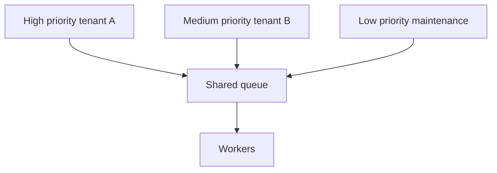
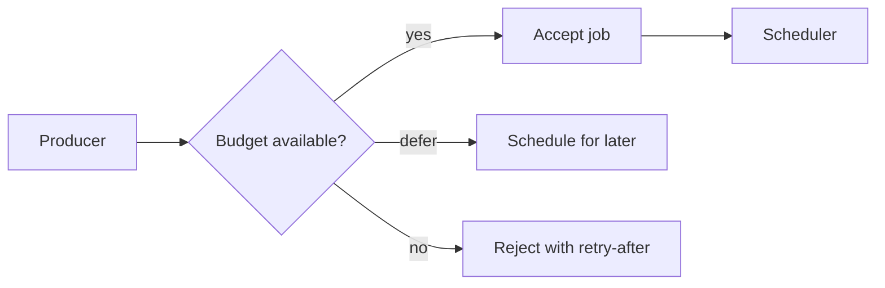

# Priority Queues, Fairness, and Backpressure

Once a job system becomes shared infrastructure, scheduling policy becomes a product feature. Without fairness, one tenant or job class can starve everyone else. Without backpressure, producers turn temporary dependency slowdowns into huge latency debt. Priority is useful, but priority without quotas becomes a denial-of-service mechanism.

## The Scheduling Problem

Workers are finite. Jobs are not equal:

- Some jobs are user-visible.
- Some jobs are batch maintenance.
- Some tenants pay for stronger guarantees.
- Some downstreams have strict quotas.
- Some retries should wait behind fresh work.

The scheduler decides who gets scarce execution slots.

## Priority Is Not Enough



If tenant A never stops enqueueing high-priority jobs, everyone else starves. Priority must be combined with fairness or admission control.

## Common Policies

| Policy | How it works | Risk |
|---|---|---|
| FIFO | Oldest job first | Urgent work waits behind bulk work |
| Strict priority | Highest priority first | Starvation |
| Weighted fair queueing | Each class gets a share | More scheduler complexity |
| Deficit round robin | Classes spend credits by job cost | Requires cost estimates |
| Earliest deadline first | Closest deadline first | Bad estimates cause thrashing |

## Tenant Fairness

Use per-tenant budgets:

```text
effective_score =
  priority_weight
  + age_boost
  - tenant_over_budget_penalty
  - downstream_pressure_penalty
```

Fairness does not mean equal throughput. It means no tenant can consume unbounded shared capacity without policy approval.

## Aging

Aging raises priority as a job waits:

```text
age_boost = min(max_boost, floor(wait_seconds / aging_interval) * boost_step)
```

This prevents low-priority jobs from waiting forever while preserving preference for urgent work.

## Backpressure Signals

| Signal | Producer response |
|---|---|
| Queue age exceeds SLO | Slow or reject new background work |
| Downstream 429 rate increases | Reduce concurrency for that integration |
| DB latency spikes | Pause DB-heavy job types |
| Worker error rate spikes | Stop retry amplification |
| Tenant exceeds quota | Defer or reject tenant jobs |

Backpressure should affect enqueueing, not just workers. Otherwise the system accepts work it cannot finish.

## Admission Control



For user-facing operations, rejecting early is often better than accepting a job that completes hours late.

## Cost-Aware Scheduling

A one-minute video transcode and a 50ms email job should not spend the same scheduling token.

Track estimated cost:

- CPU seconds.
- Memory footprint.
- DB queries.
- External API calls.
- GPU seconds.
- Expected runtime.

Use actual execution metrics to correct estimates over time.

## Failure Modes

| Failure | Symptom | Mitigation |
|---|---|---|
| Starvation | Old low-priority jobs never run | Aging and minimum shares |
| Priority inversion | Low-priority job holds scarce dependency | Dependency-specific concurrency pools |
| Retry amplification | Failed jobs dominate workers | Retry queue with lower priority |
| Noisy tenant | One tenant fills queue | Per-tenant quotas |
| Scheduler hot loop | Repeatedly scans unrunnable jobs | Partition by runnable time and class |

## Operational Metrics

- Queue age by priority and tenant.
- Share of worker time by tenant.
- Jobs rejected/deferred by admission control.
- Starvation count.
- Priority inversion incidents.
- Downstream-pressure throttles.
- Scheduler decision latency.

## Related Patterns

- [Rate Limiting](../06-scaling/05-rate-limiting.md)
- [Backpressure](../06-scaling/07-backpressure.md)
- [Multi-Tenancy Patterns](../06-scaling/12-multi-tenancy.md)
- [Cell-Based Architecture and Shuffle Sharding](../06-scaling/11-cell-based-architecture.md)
