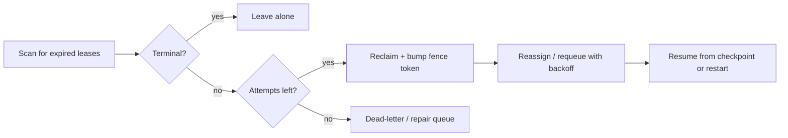

# Leases, Heartbeats, and Recovery

## TL;DR

A worker holding a task can die at any instant, and it can die *silently* — no exception, no close packet, no notification. The job system still has to notice and hand the task to someone else, because work that is never reclaimed is work that is silently lost. The whole difficulty is that you cannot distinguish a crashed worker from a slow one or a network-partitioned one; all three look identical from the outside, which is a perfectly empty channel. So you can never *know* a worker is dead — you can only observe that it has stopped *proving* it is alive. Leases turn the unanswerable question "is this worker alive?" into the answerable question "is this lease still valid?", heartbeats are how a worker keeps renewing that proof, and recovery is what happens when the proof lapses. But timeouts alone are not safe: a paused worker can wake up after its lease expired and keep running, so correctness ultimately rests on *fencing tokens* and idempotency, not on the clock.

---

## The Problem Is Failure Detection, Not Locking

It is tempting to frame ownership of a task as a locking problem — grab a lock, do the work, release it. That framing is wrong in a way that causes outages, because a lock has no answer for the case that matters most: the holder dies while holding it. A plain mutual-exclusion lock held by a crashed process is held forever. The task it guarded becomes permanently stuck, invisible, and unrecoverable, because nothing in the lock's definition says when it is safe for someone else to take over.

The real problem underneath ownership is *failure detection*. Before any reassignment can be safe, the system must decide that the previous owner is gone. And here distributed systems run into a hard wall that is worth stating plainly: **in an asynchronous network you cannot reliably distinguish a crashed node from a slow node from a partitioned node.** A worker that crashed and a worker whose packets are delayed by ten seconds produce the exact same observable signal — silence. This is the same impossibility that underlies the FLP result (Fischer, Lynch, Paterson, 1985) and the reason perfect failure detectors do not exist in practice. You are always making an *inference* from absence of evidence, never a measurement.

Every mechanism in this document exists to make a *safe* decision under that permanent uncertainty. The design goal is not to detect death correctly — that is impossible — but to bound the damage when the detection is wrong. Concretely there are two ways to be wrong. You can declare a live worker dead (a false positive), reassign its task, and end up with two workers running it. Or you can wait too long to declare a dead worker dead (a false negative), and the task sits idle, blocking a pipeline or a customer. A lease system is a tunable trade between these two errors, and fencing is what makes the false-positive case survivable.

---

## Leases: Converting Liveness Into a Deadline

A **lease** is a time-bounded grant of ownership. The idea is old and precise: Gray and Cheriton introduced it in "Leases: An Efficient Fault-Tolerant Mechanism for Distributed File Cache Consistency" (1989) as a way to grant a right that *expires on its own* if the holder disappears. A worker that claims a task does not own it forever; it owns it until a deadline — say, thirty seconds from now. To keep ownership past the deadline, the worker must renew the lease before it lapses. If the worker crashes, it stops renewing, the deadline passes, and the task becomes reclaimable with no action required from the dead worker and no distributed agreement about whether it is "really" dead.

This is the conceptual move that makes leases powerful. "Is the worker alive?" is unanswerable, because it depends on observing a remote process across an unreliable network. "Has the lease deadline passed?" is answerable, because it is a comparison against a local clock. The lease *converts a question about a remote node into a question about local time.* The grantor no longer needs to reach the worker, ping it, or get a confirmation; it just waits until the stored expiry timestamp is in the past and treats the task as free. Self-expiry is the property a raw lock lacks, and it is the entire reason leases — not locks — are the right primitive for job ownership.

The cost of this design is the lease-duration trade-off, which has no free setting. A **short lease** detects failure fast: if a worker dies, its task is reclaimable within seconds. But a short lease must be renewed often, which multiplies heartbeat traffic against the job store, and — more dangerously — it risks *premature expiry under load*. If the system is busy and a renewal is delayed by a garbage-collection pause or a slow store query, a perfectly healthy worker can have its lease expire out from under it. A **long lease** is cheap to maintain and forgiving of transient delays, but it wastes time after a *real* crash: a task whose owner died one second into a five-minute lease sits dead for the rest of that lease before anyone notices. The right lease duration is derived from the observed tail of renewal latency — the P99 or P999 time between successful heartbeats — plus a safety margin, *not* from the average job runtime, because it is the worst-case renewal delay, not the typical one, that causes false expiry.

| | Short lease (e.g. 5–15 s) | Long lease (e.g. 1–5 min) |
|---|---|---|
| Failure detection | Fast — task reclaimable in seconds | Slow — dead task idle until expiry |
| Renewal traffic | High | Low |
| Premature expiry risk | High under load/GC | Low |
| Best when | Double-execution is cheap, latency matters | Renewals are expensive or jittery |

---

## Heartbeats: The Renewal Signal and Its False Positives

A **heartbeat** is the periodic signal a worker sends to renew its lease — to keep proving it is alive and making progress. Operationally the worker writes a fresh expiry timestamp (and often a progress marker) to the job store every few seconds, well inside the lease window, so that even if one or two heartbeats are dropped the lease survives. The reclamation side is a scanner: a controller periodically looks for leases whose expiry is now in the past and treats the underlying tasks as orphaned and reassignable. Missed heartbeats are not directly observed by anyone — what is observed is an expiry timestamp that was never advanced.

The hazard built into heartbeats is the **false positive**: the worker is alive but *looked* dead for a moment. The classic cause is a stop-the-world garbage-collection pause. A JVM, Go, or .NET runtime under memory pressure can freeze every application thread for hundreds of milliseconds to several seconds while it collects; during that freeze the worker sends no heartbeats and answers no calls, even though it will resume normally an instant later. Kleppmann's well-known walkthrough in "How to do distributed locking" (2016) uses exactly this scenario: a process pauses for longer than its lease, its lease expires, the system reassigns the task — and then the process *wakes up* with no idea that time has passed and that it no longer owns anything. Network blips, hypervisor live-migration stalls, and overloaded thread pools produce the same illusion of death. Because these false positives are inevitable, a heartbeat system that *only* renews liveness is fragile; the moment a false positive occurs, two workers believe they own the same task.

A useful refinement is to make heartbeats carry *progress*, not just "I am alive." A worker that reports the count of records processed or the last checkpoint key it committed gives the system two things at once: a liveness signal and a resume point. It also lets the system distinguish a healthy-but-slow worker from a genuinely wedged one — a process stuck in an infinite loop may keep heartbeating liveness forever while making no progress, and a progress-aware monitor can catch that zombie where a pure liveness check cannot.

```json
{
  "processed_records": 250000,
  "last_checkpoint_key": "logs/2026/06/15/part-00042.gz",
  "lease_until": "2026-06-15T10:30:30Z"
}
```

---

## The Zombie: Why Timeouts Alone Are Not Safe

The central hazard of the whole pattern is the **zombie worker**, and it deserves to be stated as a sequence because the danger is in the ordering. A worker claims a task and gets a thirty-second lease. It runs for a while, then suffers a forty-second stop-the-world GC pause. At second thirty, with the worker frozen, its lease expires. The recovery scanner sees an expired lease, declares the task orphaned, and reassigns it to a second worker, which starts executing. At second forty, the first worker *wakes up*. From its own perspective nothing happened — its program counter simply advanced — and it believes it still holds the lease and still owns the task. Now two workers are running the same task concurrently. This is a split-brain on a single unit of work, and it is the failure that leases, by themselves, *cannot* prevent.

The reason a timeout cannot fix this is fundamental: the lease expired on the *grantor's* clock, but the holder never observed the expiry, because it was frozen. The holder's belief about its ownership is stale, and no amount of shortening or lengthening the lease changes the fact that a sufficiently long pause will outlast any finite lease. You can make zombies rarer by tuning durations, but you cannot make them impossible. Worse, clock skew compounds the problem: if the holder's clock runs slower than the grantor's, the lease can expire on the grantor *before* the holder thinks it has, so the holder keeps working in good faith past the moment the system already reassigned its task. Leases assume the holder and grantor agree closely enough on the passage of time; clock skew and pauses break that assumption silently. (See `../01-foundations/05-distributed-time.md` on why physical clocks are an unreliable basis for safety.)

The conclusion is uncomfortable but important: **a lease bounds how long a zombie can go undetected, but it does not stop a zombie from acting.** If the only thing standing between a zombie and a duplicated side effect is a timer, you will eventually get the duplicate. Something downstream must reject the zombie's work *after* the fact.

---

## Fencing Tokens: Making the Zombie's Writes Harmless

The rigorous fix is the **fencing token**, the mechanism Kleppmann (2016) prescribes precisely because timeouts are insufficient. Each time the lease is granted, the grantor attaches a number that increases monotonically — token 41, then 42, then 43, never repeating, never going backward. The worker must include its token on every write it makes to a downstream resource. The downstream resource remembers the highest token it has ever accepted and *refuses any write carrying a lower one.* This single rule neutralizes the zombie. When the task was reassigned during the GC pause, the new worker received token 43; it wrote to the storage layer, which recorded 43 as the high-water mark. The revived zombie still carries token 42. Its write arrives, the resource sees 42 < 43, and rejects it. The zombie still *believes* it owns the task — but its belief is now inert, because the only place its belief could cause damage refuses to listen to it.

```sql
UPDATE resource
   SET value = :new_value,
       fence = :token
 WHERE id = :id
   AND fence < :token;          -- zero rows updated ⇒ caller is stale, must abort
```

What makes fencing correct where timeouts are not is that it does not require the zombie to *know* it has been superseded. Detection happens at the point of effect, not at the source, so it works even when the source is frozen, partitioned, or running on a wrong clock. The monotonic token is exactly the same idea that consensus systems expose as a version: ZooKeeper's `zxid`, etcd's mod-revision, a Raft term, or a database row version can all serve as fence values, since they are already monotonic by construction. The catch — and it is a real one — is that fencing only protects resources that *understand* the token. A downstream that ignores the fence (a legacy API, a side effect like sending an email, a third party that has no version check) cannot be fenced, and for those you need the complementary defense: make the operation idempotent so that a duplicate is harmless even when it cannot be rejected. Fencing rejects the duplicate at the boundary; idempotency absorbs it past the boundary. Most robust systems use both, and `./06-retry-idempotency-compensation.md` covers the idempotency side in depth.

---

## The Recovery Flow: Detect, Reclaim, Reassign, Resume

Recovery is best implemented as an explicit controller rather than as ad-hoc behavior scattered across workers, because the policy for stuck states should be visible, centralized, and testable. The flow has five stages, and each one is a decision under the uncertainty described above.

**Detect** is lease expiry: a scanner finds tasks whose stored expiry timestamp is in the past. This is an *inference* of death, not a confirmation, which is why the later stages must remain safe even if the inference is wrong. **Reclaim** transitions the task out of the dead owner's hands, ideally with a compare-and-set that also bumps the fencing token, so the act of reclaiming simultaneously invalidates the old owner. **Reassign** hands the task to a healthy worker — or back into the runnable queue — typically with backoff and an attempt counter so that a task that keeps killing its workers eventually lands in a dead-letter queue instead of looping forever. **Resume** decides whether the new worker restarts the task from scratch or continues from the last checkpoint the dead worker reported; progress-carrying heartbeats are what make resume-from-checkpoint possible, and for long tasks the difference between restart and resume is the difference between minutes and hours. **Ensure no double effect** is the cross-cutting requirement that ties back to fencing and idempotency: because the reclaimed task may be running concurrently in a zombie, every externally visible action must be one that a stale duplicate cannot corrupt.



This recovery machinery is not unique to task execution — it is the same machinery underneath the patterns next to it. Distributed cron leader election (`./03-distributed-cron-scheduling.md`) is a lease on the right to *be the scheduler*: the leader heartbeats to hold leadership, and if it dies its lease expires and a follower takes over, with a term number acting as the fencing token to stop a deposed leader from still firing jobs. Worker pools (`./02-background-jobs-worker-pools.md`) lease individual jobs so that a crashed worker's in-flight jobs are reclaimed rather than lost. In both, the lease is the safe-handoff primitive and fencing is what keeps the handoff from producing two active owners. Leader election in general (`../02-distributed-databases/09-leader-election.md`) is the consensus-backed version of the same idea.

---

## How Real Systems Implement This

The dominant production implementations all reduce to "a stored expiry that a session keeps refreshing," differing mainly in *who* owns the clock and how strong the consistency guarantee is.

**ZooKeeper** exposes the pattern through *ephemeral nodes* tied to a client *session*. The client maintains the session with periodic heartbeats; if it stops heartbeating for longer than the negotiated session timeout, ZooKeeper deletes the client's ephemeral nodes automatically. An ephemeral node *is* a lease — its existence is the proof of liveness, and its deletion is the reclamation. The accompanying `zxid` (a monotonic transaction id) is a ready-made fencing token. **etcd** offers the same shape with explicit lease objects and TTLs: a key is attached to a lease, the lease must be kept alive, and when it lapses the key vanishes; etcd's mod-revision serves as the monotonic fence. **Chubby**, Google's lock service described by Burrows in "The Chubby Lock Service for Loosely-Coupled Distributed Systems" (OSDI 2006), pioneered the production form of all of this — coarse-grained advisory locks held as leases over a Paxos-replicated store, with sequencers (Chubby's name for fencing tokens) issued precisely so that a lock holder delayed by a pause cannot perform a stale write. Chubby's designers were explicit that timeouts alone were unsafe and that sequence numbers were required for correctness, which is the same lesson Kleppmann restated a decade later.

**Kubernetes** uses leases pervasively and visibly. Node liveness is a heartbeat: the kubelet updates a `Lease` object in the `kube-node-lease` namespace roughly every ten seconds, and the node controller marks a node `NotReady` if the lease goes stale past a grace period — at which point the node's pods become eligible for eviction and rescheduling. This is failure-detect-and-reassign at the cluster level, built on the same lease primitive. Kubernetes controllers also use `Lease` objects for leader election so that exactly one controller-manager instance is active at a time. Finally, the humblest and most common implementation is the **database-row lease**: a `tasks` row with `owner`, `lease_expires_at`, and `fence` columns, claimed with a conditional `UPDATE ... WHERE lease_expires_at < now()`, renewed by pushing `lease_expires_at` forward, and reclaimed by any worker whose conditional update succeeds. It needs no extra infrastructure, and for most job systems it is entirely sufficient — provided the fence column is actually checked downstream.

---

## Failure Modes

The characteristic failures of lease-and-heartbeat systems recur everywhere, and naming them is most of avoiding them.

**Zombie double-execution** is the defining failure: a worker pauses past its lease, the task is reassigned, the worker wakes and keeps running, and two executions race. Tuning lease duration only changes its frequency. The actual defense is fencing tokens for resources that can check them and idempotency for those that cannot — never the timeout alone.

**Premature lease expiry under load** is the false positive at scale: when the system is busiest, GC pauses lengthen and store queries slow, renewals miss their window, and *healthy* workers lose tasks they were actively running. This causes a vicious cycle — reassignment adds load, which causes more expiry. The defense is to size the lease from tail renewal latency under peak load, not from averages, and to renew well inside the window.

**Heartbeat false positives from GC pauses** are the single-worker version of the same problem: a multi-second stop-the-world collection makes a fine worker look dead. The defense is a lease comfortably longer than the worst observed pause, runtime tuning to bound pause times, and progress-based heartbeats so a wedged worker is caught while a merely-paused one is forgiven.

**Clock-skew lease violations** occur when the holder's and grantor's clocks disagree enough that the lease expires on one before the other, so the holder works past a deadline the system already acted on. The defense is to keep clocks disciplined with NTP, to never base safety on tight clock agreement, and to layer fencing so that even a clock-fooled holder's stale write is rejected.

**Lost work from no reclamation** is the quiet opposite failure: a worker dies, but nothing ever scans for its expired lease, so its task sits in `running` forever — never retried, never alerted, never completed. This is the failure of treating leases as a claim mechanism without building the recovery controller. The defense is a reconciliation job that actively hunts for impossible states (a `running` task with an expired or absent lease, a workflow waiting on a timer that was never stored, a parent canceled while children run) and repairs or escalates them.

---

## Decision Framework

The right amount of machinery is keyed almost entirely on one question: **how expensive is a double execution of this task?** That cost dictates which of three regimes you should be in.

If a duplicate is genuinely harmless — the work is naturally idempotent, like recomputing a derived value, writing the same object to the same key, or sending a request the receiver deduplicates — then you may not need leases at all. Run the queue at-least-once, accept that tasks occasionally run twice, and lean entirely on idempotency. This is the cheapest design and is correct surprisingly often; reaching for leases here adds cost and failure surface for no benefit.

If a duplicate is *costly but recoverable* — charging a card, sending a shipment, posting to a ledger, calling a partner API — you need **leases plus fencing**. Leases give fast, automatic failure detection and reassignment; fencing tokens make the inevitable zombie's writes harmless at the resources that matter; idempotency keys cover the resources that cannot be fenced. This is the workhorse design for most job and workflow systems, and it is what the rest of this document describes.

If a duplicate is *catastrophic and irreversible* — anything where two simultaneous owners would corrupt invariants that cannot be repaired after the fact — then a lease is not enough and you should put ownership behind real **consensus**. Let a Raft or Paxos group, or a service built on one (etcd, ZooKeeper, Chubby), be the single source of truth about who owns the task, so that at most one owner can ever be elected and the monotonic term it carries is enforced on every write. This is the most expensive option in latency and operational complexity, justified only when the cost of being wrong exceeds the cost of the coordination.

The throughline across all three is that you are never buying certainty about death — that is unpurchasable. You are buying a bound on the damage when your inference about death turns out to be wrong, and you should buy exactly as much of that bound as the cost of double execution demands.

---

## Operational Metrics

A lease system is observable through a small set of signals, and watching them is how you catch a misconfigured lease before it causes an incident: active lease count, lease-acquisition latency, heartbeat success rate, lease-expiration rate (a rising rate often means premature expiry, not real deaths), recovery-requeue count, fencing-rejection count (every rejection is a zombie that was successfully neutralized — a nonzero value is normal and reassuring), orphaned-task count, and time from worker death to requeue (the practical measure of your failure-detection latency).

---

## Key Takeaways

1. The core problem is failure detection, not locking: you cannot distinguish a crashed worker from a slow or partitioned one, so you can only observe that a worker has *stopped proving it is alive*, never that it is dead.
2. A lease is a time-bounded grant of ownership (Gray & Cheriton, 1989) that self-expires, converting the unanswerable "is the worker alive?" into the answerable "has the deadline passed?" — which is why leases, not plain locks, are the right primitive for task ownership.
3. Lease duration is a trade-off with no free setting: short leases detect failure fast but risk premature expiry under load; long leases are forgiving but waste time after a real crash. Size from tail renewal latency, not average runtime.
4. Heartbeats renew the lease, but their unavoidable false positives — a GC pause that looks like death — are what create zombies, so prefer progress-carrying heartbeats over pure liveness.
5. The zombie is the central hazard: a worker paused past its lease wakes believing it still owns a task that was already reassigned, and *no timeout can prevent this* because a long-enough pause outlasts any finite lease.
6. Fencing tokens (Kleppmann, 2016; Chubby's sequencers, 2006) are the rigorous fix: a monotonic token on every write lets downstreams reject a stale owner's writes after the fact, which works even when the zombie is frozen or on a wrong clock.
7. Idempotency is the complementary defense for resources that cannot check a fence; robust systems use fencing at the boundary and idempotency past it.
8. Lease expiry depends on clocks, so clock skew and pauses can violate the assumption that holder and grantor agree on time — never base correctness on the timer alone.
9. Recovery is an explicit controller — detect, reclaim, reassign, resume, ensure no double effect — and the same lease-and-fence machinery underlies cron leader election and worker-pool job ownership.
10. Pick your regime by the cost of double execution: at-least-once plus idempotency when duplicates are harmless, leases plus fencing when they are costly-but-recoverable, and consensus-backed ownership when they are catastrophic.

---

## Related Patterns

- [Retry, Idempotency, and Compensation](./06-retry-idempotency-compensation.md)
- [Distributed Cron Scheduling](./03-distributed-cron-scheduling.md)
- [Background Jobs and Worker Pools](./02-background-jobs-worker-pools.md)
- [Distributed Locks](../01-foundations/09-distributed-locks.md)
- [Failure Modes](../01-foundations/06-failure-modes.md)
- [Distributed Time](../01-foundations/05-distributed-time.md)
- [Leader Election](../02-distributed-databases/09-leader-election.md)
- [Delivery Guarantees](../05-messaging/04-delivery-guarantees.md)

---

## References

1. [Leases: An Efficient Fault-Tolerant Mechanism for Distributed File Cache Consistency](https://web.stanford.edu/class/cs240/readings/89-leases.pdf) — Gray & Cheriton, SOSP 1989
2. [How to do distributed locking](https://martin.kleppmann.com/2016/02/08/how-to-do-distributed-locking.html) — Martin Kleppmann, 2016 (fencing tokens)
3. [The Chubby Lock Service for Loosely-Coupled Distributed Systems](https://research.google/pubs/pub27897/) — Burrows, OSDI 2006
4. [Impossibility of Distributed Consensus with One Faulty Process](https://groups.csail.mit.edu/tds/papers/Lynch/jacm85.pdf) — Fischer, Lynch & Paterson, 1985 (FLP)
5. [ZooKeeper: Wait-free Coordination for Internet-scale Systems](https://www.usenix.org/legacy/event/atc10/tech/full_papers/Hunt.pdf) — Hunt et al., 2010 (sessions, ephemeral nodes)
6. [etcd Lease API and KV concurrency](https://etcd.io/docs/latest/learning/api/#lease-api) — etcd documentation
7. [Kubernetes Lease objects and node heartbeats](https://kubernetes.io/docs/concepts/architecture/nodes/#heartbeats) — Kubernetes documentation
8. [Designing Data-Intensive Applications, Ch. 8 (The Truth Is Defined by the Majority)](https://dataintensive.net/) — Kleppmann, 2017
