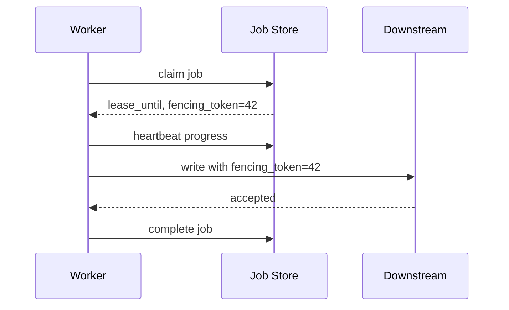
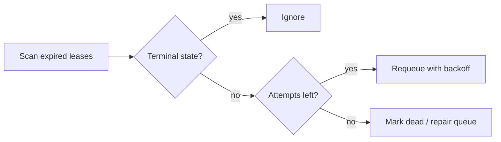

# Leases, Heartbeats, and Recovery

Workflow and job systems use leases to decide who is currently allowed to execute work. A lease is a time-bounded claim, not proof that every other worker stopped. Heartbeats extend that claim while work is still progressing. Recovery begins when a lease expires, but correctness still depends on idempotency and fencing because expired workers may continue running.

## Lease vs Lock

| Mechanism | Meaning |
|---|---|
| Lock | Exclusive ownership until release, often dangerous if owner dies |
| Lease | Exclusive ownership until a deadline |
| Heartbeat | Owner proves it is still alive and extends the lease |
| Fencing token | Monotonic token used by downstreams to reject stale owners |

Leases are safer than indefinite locks because they recover automatically. They are not magic exactly-once execution.

## Basic Lease Flow



If another worker later gets token 43, the downstream should reject stale writes with token 42.

## Lease Duration

| Lease too short | Lease too long |
|---|---|
| Duplicate attempts during normal GC pauses or slow calls | Slow recovery after worker death |
| Higher downstream duplicate pressure | Stuck jobs stay invisible longer |
| More heartbeat traffic | Fewer false expirations |

Set lease duration from observed P99 heartbeat delay plus a safety margin, not from average job runtime.

## Heartbeat Payloads

Heartbeats can store progress:

```json
{
  "processed_records": 250000,
  "last_object_key": "logs/2026/06/15/part-00042.gz",
  "updated_at": "2026-06-15T10:30:00Z"
}
```

Progress lets a retry resume instead of starting from zero, but only if the task is designed around checkpoint boundaries.

## Recovery Controller



Recovery should be a controller, not an ad hoc worker behavior. Controllers make stuck-state policy visible and testable.

## Orphan Detection

An orphan is work that is neither terminal nor runnable.

Examples:

- Job has no lease but status is `running`.
- Workflow waits for a timer that was never stored.
- Activity completed but completion event was not appended.
- Parent workflow canceled but child jobs continue.

Run reconciliation jobs that scan for impossible states and repair or alert.

## Fencing

Fencing protects shared resources from stale workers:

```sql
UPDATE resources
SET value = :new_value,
    fencing_token = :token
WHERE id = :id
  AND fencing_token < :token;
```

If the update affects zero rows, the worker is stale and must stop.

## Failure Modes

| Failure | Cause | Mitigation |
|---|---|---|
| Split execution | Lease expires while original worker continues | Fencing and idempotent side effects |
| Lost heartbeat | Network blip | Lease margin and retry heartbeat |
| Zombie worker | Process stuck but still heartbeating | Progress-based heartbeats, not just liveness |
| Stuck running state | Worker died before releasing | Expired-lease scanner |
| Double completion | Two workers race to complete | Compare-and-set terminal transition |

## Operational Metrics

- Active leases.
- Lease acquisition latency.
- Heartbeat success rate.
- Lease expiration count.
- Recovery requeue count.
- Fencing rejection count.
- Orphaned job count.
- Time from worker death to requeue.

## Related Patterns

- [Distributed Locks](../01-foundations/09-distributed-locks.md)
- [Failure Modes](../01-foundations/06-failure-modes.md)
- [Leader Election](../02-distributed-databases/09-leader-election.md)
- [Delivery Guarantees](../05-messaging/04-delivery-guarantees.md)
