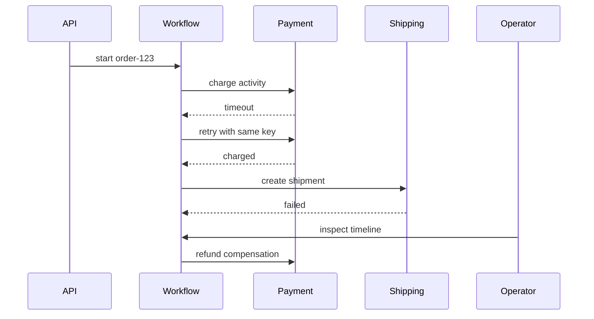

# Workflow Observability and Replay

Workflow observability answers a different question than service observability. A service trace asks "what happened during this request?" A workflow trace asks "where is this business process, what has it already committed, why is it waiting, and what can safely happen next?" For long-running systems, observability, replay, and repair tooling are part of correctness.

## Observability Layers

| Layer | Question |
|---|---|
| Workflow instance | What state is this process in? |
| Activity attempt | Which side effect is running or retrying? |
| Queue | Is runnable work waiting too long? |
| Scheduler | Are due tasks being discovered? |
| Dependency | Is a downstream causing retries or backpressure? |
| Operator action | Who repaired, canceled, or replayed a workflow? |

## Workflow Timeline



Operators need this view without reading logs from five services.

## Structured Events

Each workflow event should include:

- Workflow ID and type.
- Run ID.
- Sequence number.
- Event type.
- Activity ID, if applicable.
- Attempt number.
- Idempotency key, if applicable.
- Tenant or namespace.
- Correlation/trace ID.
- Payload reference or redacted payload.
- Timestamp from a trusted clock.

Avoid storing secrets or large payloads directly in history.

## Replay

Replay has two meanings:

| Replay type | Purpose | Risk |
|---|---|---|
| Deterministic code replay | Rebuild workflow state from history | Non-deterministic code breaks replay |
| Operational replay | Re-run failed work or side effects | Duplicate side effects if idempotency is weak |

Operational replay must be permissioned and audited. A "replay" button without guardrails is an incident generator.

## Repair Tools

Production workflow systems need safe repair primitives:

- Retry failed activity.
- Skip optional activity.
- Inject external signal.
- Cancel workflow.
- Continue as new.
- Mark compensation complete after manual action.
- Move stuck job to repair queue.

Each action should append an audit event. Direct database edits should be a last resort.

## Debugging Stuck Workflows

A stuck workflow usually has one of these causes:

| Cause | Evidence |
|---|---|
| Waiting for signal | Last event is waiting state; no signal received |
| Timer not firing | Timer is overdue |
| No workers | Queue age grows; no leases acquired |
| Downstream outage | Retry attempts and dependency errors |
| Bad deploy | Non-determinism or activity error spike after version change |
| Lost wakeup | History says runnable but no queue task exists |

The repair path differs for each, so dashboards must expose the last meaningful event.

## Metrics

Track both RED-style service metrics and workflow-specific metrics:

- Start-to-complete duration by workflow type.
- Time in each state.
- Oldest non-terminal workflow age.
- Waiting workflows by reason.
- Activity retry histogram.
- Compensation failure count.
- Manual repair count.
- Replay failure count.
- Queue age by task type.
- Scheduler lag.

## Tracing

Long-running workflows need trace stitching. A single trace may not stay open for days. Store correlation IDs in workflow history and link activity traces back to the workflow timeline.

```text
workflow_id=order-123
run_id=run-456
activity_id=charge-payment
trace_id=00-...
idempotency_key=payment:order-123:attempt-1
```

## Alerting

Good alerts are state-aware:

| Alert | Better than |
|---|---|
| Oldest runnable task age > SLO | Queue depth > N |
| Timer lag > threshold | Scheduler CPU high |
| Compensation failures > 0 | Generic workflow failures |
| Stuck in state for too long | Workflow not completed |
| DLQ oldest age > threshold | DLQ count > N |

Alert on user or business impact, not just internal counters.

## Privacy and Retention

Workflow histories can contain sensitive data and business decisions. Apply retention and redaction:

- Store payload references instead of full payloads.
- Encrypt sensitive fields.
- Redact secrets before event append.
- Define retention by workflow type.
- Keep audit events longer than verbose activity payloads.

## Related Patterns

- [Distributed Tracing](../11-observability/01-distributed-tracing.md)
- [Logging](../11-observability/03-logging.md)
- [Incident Management and Postmortems](../11-observability/07-incident-management.md)
- [Disaster Recovery](../15-deployment/05-disaster-recovery.md)
