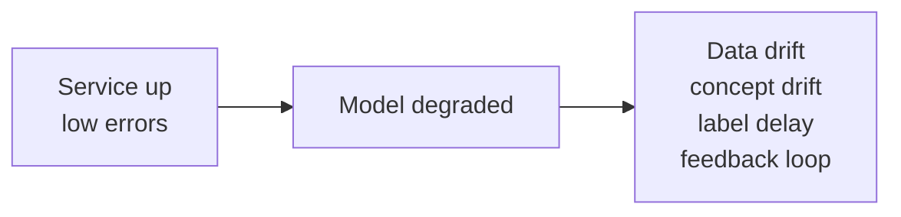
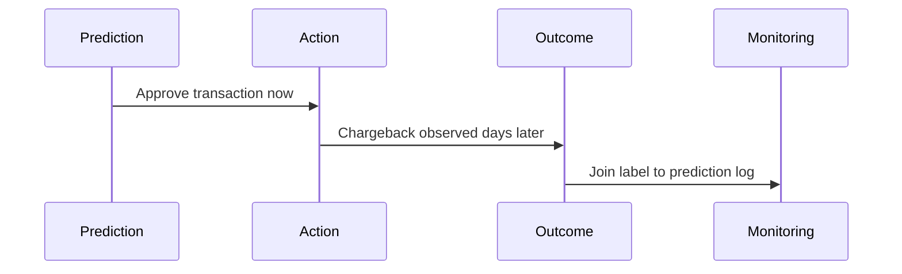
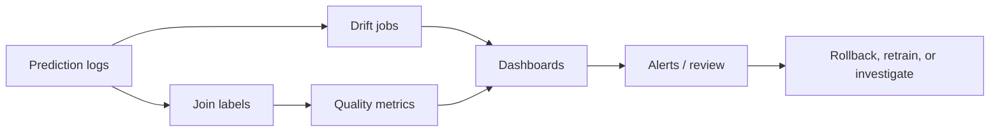

# Model Monitoring

## TL;DR

Model monitoring detects whether a model is still useful, not just whether the prediction service is up. Monitor four layers: data quality, feature and prediction drift, model quality, and business impact. The hardest part is label delay: the real outcome may arrive hours, days, or months after the prediction.

---

## Why Service Monitoring Is Not Enough

HTTP 200 responses can hide bad predictions. A model can return quickly and consistently while harming conversion, missing fraud, or ranking low-quality content.

---

## Monitoring Layers

| Layer | Question | Example signals |
|---|---|---|
| Data quality | Is the input valid? | Null rate, schema changes, range checks |
| Feature freshness | Is the input current? | Last update age, lookup miss rate |
| Drift | Is production different from training? | Distribution distance, category shifts |
| Prediction behavior | Is the model behaving differently? | Score distribution, confidence, class mix |
| Quality | Is the model correct? | Precision, recall, calibration, loss |
| Business impact | Is the system outcome healthy? | Revenue, fraud loss, retention, complaints |

---

## Drift Types

### Data Drift

The input distribution changes.

Example: a loan model trained on one geography starts receiving traffic from another region.

### Concept Drift

The relationship between input and label changes.

Example: fraud patterns change after attackers adapt to the current model.

### Prediction Drift

The distribution of model outputs changes.

Example: a recommender starts assigning extremely high scores to a narrow item category.

### Label Drift

The target distribution changes.

Example: the base rate of spam changes during an attack campaign.

---

## Label Delay

Some systems get labels quickly, such as click/no-click. Others wait weeks, such as fraud chargebacks or loan defaults. Monitoring must separate fast proxy metrics from delayed ground truth.

---

## Prediction Logging

A prediction log should include:

- Request ID and timestamp.
- Entity IDs.
- Model name and version.
- Feature vector or feature references.
- Prediction and confidence.
- Routing path: champion, canary, shadow, fallback.
- Latency and error metadata.
- Experiment assignment.
- Later joined label and outcome timestamp.

Do not log raw sensitive data unless policy allows it. Prefer references, hashed IDs, or approved feature values.

---

## Alerting Strategy

Not every drift alert should page someone. Use severity based on user impact and confidence.

| Alert | Page? | Response |
|---|---|---|
| Serving error rate high | Yes | Restore availability |
| Feature freshness SLO missed for critical model | Yes | Fail over or disable model |
| Prediction distribution shifts sharply | Usually no | Investigate during business hours unless tied to impact |
| Delayed quality metric drops below guardrail | Sometimes | Roll back or reduce traffic |
| Business KPI regression in canary | Yes for critical flows | Stop rollout |

---

## Monitoring Pipeline

Monitoring should produce action, not just charts. Every alert needs an owner and a playbook.

---

## Common Failure Modes

### Proxy Metric Trap

The proxy metric improves while the real user or business outcome degrades.

Mitigation: track guardrails, run experiments, and avoid promoting models on a single metric.

### Hidden Slice Regression

Overall quality is stable, but one segment degrades.

Mitigation: monitor important slices: geography, device, language, tenant, risk bucket, new users, and protected classes where legally appropriate.

### Monitoring Training Data Instead of Production Data

The dashboard shows clean offline validation data, not live request distribution.

Mitigation: monitor production prediction logs and compare them with training baselines.

### Alert Fatigue

Drift metrics are noisy and constantly fire.

Mitigation: tune thresholds by actionability, use burn-rate style alerts for severe degradation, and route low-confidence alerts to review queues.

---

## Operational Metrics

| Category | Metrics |
|---|---|
| Data quality | Missing rate, invalid enum rate, range violation rate |
| Freshness | Feature age, ingestion lag, materialization lag |
| Drift | PSI, KL divergence, Wasserstein distance, category distribution delta |
| Prediction | Score histogram, class ratio, calibration buckets |
| Quality | Precision, recall, AUC, loss, false positive rate, false negative rate |
| Slices | Quality by segment, traffic share by segment |
| Operations | Alert volume, time to detect, time to rollback, retrain frequency |

---

## Key Takeaways

1. A healthy service can serve bad predictions.
2. Monitor production input and prediction distributions, not just offline validation.
3. Label delay determines how quickly quality can be measured.
4. Slice monitoring catches regressions hidden by aggregate metrics.
5. Monitoring must connect to rollback, retraining, or investigation workflows.

---

## References

1. [Hidden Technical Debt in Machine Learning Systems](https://proceedings.neurips.cc/paper_files/paper/2015/file/86df7dcfd896fcaf2674f757a2463eba-Paper.pdf)
2. [Data Validation for Machine Learning](https://mlsys.org/Conferences/2019/doc/2019/167.pdf)
3. [TFX: A TensorFlow-Based Production-Scale Machine Learning Platform](https://dl.acm.org/doi/10.1145/3097983.3098021)
4. [Evidently Documentation](https://docs.evidentlyai.com/)
