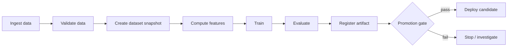
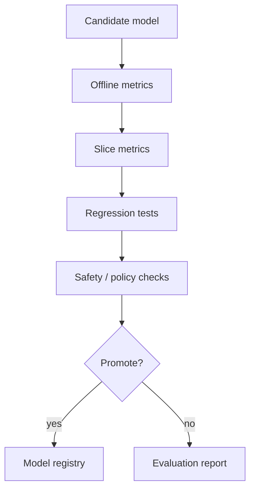

# Training Pipelines

## TL;DR

Training pipelines turn raw data into reproducible model artifacts. A production pipeline must version inputs, validate data, build point-in-time datasets, train, evaluate, register artifacts, and gate promotion. Reproducibility is the central reliability requirement: a team should be able to explain what data, code, features, parameters, and environment produced a model.

---

## Pipeline Shape



Each edge should carry metadata: dataset version, code version, feature definitions, parameters, artifact hash, and evaluation report.

A training pipeline is a [batch data pipeline](../13-data-pipelines/01-batch-processing.md) with a model at the end: it wants the same [workflow orchestration](../16-llm-systems/02-orchestration-patterns.md) discipline, [idempotent](../01-foundations/08-idempotency.md) re-runnable steps, and snapshot-based reproducibility that any derived-data system needs.

---

## Reproducibility Contract

A model version should answer:

- Which code commit trained it?
- Which dataset snapshot and label window were used?
- Which feature definitions and backfills were used?
- Which hyperparameters were used?
- Which container image or environment ran training?
- Which metrics and slices passed evaluation?
- Which human or automation approved promotion?

If the team cannot answer these, rollback and incident analysis become guesswork.

---

## Data Validation

Validate before training, not after a bad model reaches production.

| Check | Example |
|---|---|
| Schema | Required column missing |
| Type | String appears where numeric feature is expected |
| Range | Age is negative, probability above 1 |
| Distribution | Mean transaction amount changed 5x |
| Completeness | 40% of labels missing |
| Uniqueness | Duplicate entity-event pairs |
| Freshness | Latest partition is older than expected |

Validation rules should be versioned with the pipeline and reviewed when source semantics change.

---

## Dataset Versioning

Training data is usually too large to commit to Git, but the pipeline can version references:

```yaml
dataset:
  source: warehouse.ml.fraud_training_examples
  snapshot_date: 2026-06-10
  entity_time_column: decision_at
  label_window: 30d
  feature_view_versions:
    - account_risk:v12
    - device_velocity:v7
code:
  commit: 441c720
environment:
  image: registry.example.com/ml-train:2026-06-01
```

The goal is deterministic reconstruction, not storing everything in the model registry.

---

## Evaluation Gates



A promotion gate should include:

- Primary quality metric.
- Guardrail metrics.
- Slice-level checks.
- Calibration checks when probabilities matter.
- Latency or model-size checks for serving.
- Feature compatibility checks.
- Human approval for high-risk decisions.

---

## Retraining Patterns

| Pattern | Use when | Risk |
|---|---|---|
| Manual retraining | Low-change model or high-risk domain | Slow response to drift |
| Scheduled retraining | Predictable data arrival | Retrains when not needed |
| Triggered retraining | Drift or quality metric crosses threshold | Noisy triggers |
| Continuous training | Fast-changing domain with strong automation | Bad data can quickly propagate |

Most teams should start with scheduled or manually approved retraining, then automate only after validation and monitoring are mature.

---

## Distributed Training

Distributed training adds coordination, storage, and hardware scheduling complexity.

Use it when:

- Single-machine training exceeds acceptable duration.
- Model size or dataset size requires multiple accelerators.
- Iteration speed is blocking model quality work.

Avoid it when:

- Data pipeline is the bottleneck.
- Hyperparameter search is more valuable than one huge run.
- Reproducibility and debugging are already weak.

---

## Failure Modes

### Non-Reproducible Model

A model performs well, but nobody can rebuild it.

Mitigation: make lineage metadata mandatory before registry promotion.

### Bad Backfill

A backfill changes historical feature values and silently alters future training datasets.

Mitigation: version feature definitions, record backfill ranges, and rerun validation after backfills.

### Evaluation Leakage

Training and evaluation sets are not properly separated by time, user, or entity.

Mitigation: split based on the real prediction setting and review leakage-prone joins.

### Automation Amplifies Bad Data

Continuous retraining quickly promotes a model trained on broken or adversarial data.

Mitigation: validation gates, canary rollout, human approval for severe distribution shifts, and rollback.

---

## Operational Metrics

| Layer | Metrics |
|---|---|
| Pipeline | Success rate, duration, queue time, retry count |
| Data | Freshness, validation failures, rejected rows |
| Training | Cost, GPU utilization, convergence, reproducibility failures |
| Evaluation | Metric deltas, slice regressions, calibration |
| Registry | Promotion rate, rollback rate, stale model age |
| Delivery | Time from data availability to deployable model |

---

## Key Takeaways

1. Training pipelines are production systems, not notebooks with schedulers.
2. Reproducibility is the foundation of ML reliability.
3. Data validation prevents bad models before training completes.
4. Promotion gates should combine quality, safety, latency, and compatibility.
5. Automate retraining only after validation and rollback paths are mature.

---

## References

1. [TFX: A TensorFlow-Based Production-Scale Machine Learning Platform](https://dl.acm.org/doi/10.1145/3097983.3098021)
2. [Data Validation for Machine Learning](https://mlsys.org/Conferences/2019/doc/2019/167.pdf)
3. [MLflow Tracking](https://mlflow.org/docs/latest/ml/tracking/)
4. [Hidden Technical Debt in Machine Learning Systems](https://proceedings.neurips.cc/paper_files/paper/2015/file/86df7dcfd896fcaf2674f757a2463eba-Paper.pdf)
