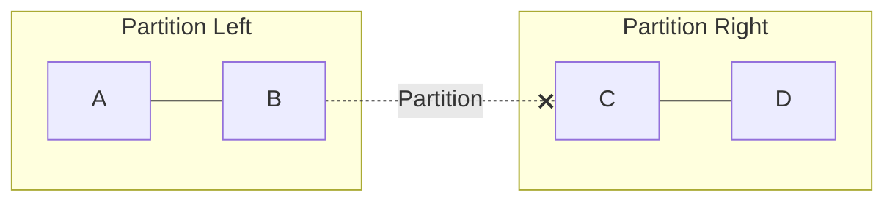
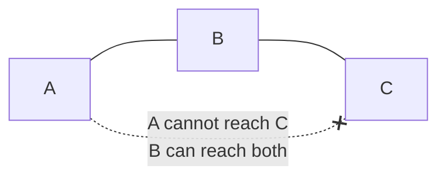
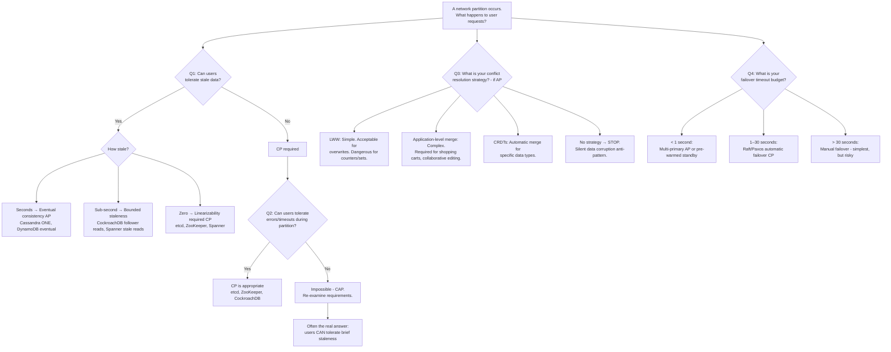

# CAP定理

> この記事は英語版から翻訳されました。最新版は[英語版](/01-foundations/03-cap-theorem)をご覧ください。

## 要約（TL;DR）

CAP定理は、分散システムが同時に保証できるのは整合性（Consistency）、可用性（Availability）、分断耐性（Partition tolerance）の3つのうち最大2つまでであると述べています。しかし、この表現は誤解を招きます。ネットワーク分断は選択肢ではなく、分散システムにおける事実です。真のエンジニアリング上の問題は、分断が**発生している間**にシステムがどう振る舞うか（CとAのどちらを優先するか）と、**正常時**にどのようなトレードオフを行うか（PACELC：レイテンシ vs 整合性）です。すべてのシステムはスペクトラム上に位置しており、バケットに入るものではありません。

---

## 3つの性質

### 整合性（C）

すべての読み取りは、最新の書き込み結果またはエラーを返します。CAPの正式な定義では、これは**線形化可能性（linearizability）** ── 最も強い単一オブジェクトの整合性モデルです。

- **操作の全順序**: すべての操作は、その呼び出しから応答までの間のある時点で原子的に実行されたかのように見えます。
- **リアルタイム順序付け**: 書き込みWが読み取りRの開始前に完了した場合（実時間で）、RはWまたはそれ以降の書き込みを見なければなりません。
- **単一コピーの幻想**: データが複製されていても、システムは1つのコピーしか存在しないかのように振る舞います。

以下と混同しないでください：
- **ACID整合性**: アプリケーション不変条件（外部キー、制約）の保持。
- **逐次整合性（Sequential Consistency）**: 全順序は存在するが、リアルタイムを尊重する必要はない。より弱い保証です。

実用上の意味：線形化可能なシステムは、すべての書き込みで調整を行う必要があります。クロスAZレプリケーションを持つ3ノードのRaftクラスタでは、多数派への少なくとも1回のラウンドトリップ（リージョンレイアウトに応じて約2〜10 ms）が必要です。

### 可用性（A）

障害のないノードが受け取ったすべてのリクエストは、エラーでない応答を返さなければなりません。

ここでは正確さが重要です：
- **時間制限なし**: 正式な定義はレイテンシを指定していません。30秒後の応答でも「可用」とみなされます。
- **障害のないノードのみ**: クラッシュしたノードは除外されます。この性質は、すべての*生存*ノードが応答しなければならないということです。
- **内容の保証なし**: 応答は古いデータを含む可能性があります。単にエラーでなければよいのです。

これは「ファイブナイン稼働率」よりも強い保証です。CAP可用性とは、生存ノードへの**すべてのリクエスト**が成功することを意味し、99.999%ではありません。

### 分断耐性（P）

ノード間の任意のメッセージ損失や遅延にもかかわらず、システムが動作し続けることです。

分断とは、ノードの一部が別の一部と通信できない状態を意味します。システムは、この通信障害にもかかわらず、選択した整合性および/または可用性の保証を提供し続けなければなりません。



重要なニュアンス：分断耐性は「有効にする」機能ではありません。ネットワークに問題が発生したときにシステムの保証が維持されるかどうかを表します。分断を防ぐことはできないため、Pは選択ではなく要件です。

---

## 形式的証明の概要

### Gilbert & Lynch (2002) ── 不可能性の結果

Brewer (2000) による元の予想は、GilbertとLynchによって「Brewer's Conjecture and the Feasibility of Consistent, Available, Partition-Tolerant Web Services」で形式化され、証明されました。

**構成（簡略化）：**

最も単純な分散システムを考えます：初期値v0を持つ単一レジスタxを共有する2つのノードN1とN2。

1. ネットワーク分断がN1とN2を分離します ── メッセージは通過できません。
2. クライアントがwrite(x, v1)をN1に送信します。N1はこれを受け入れなければなりません（可用性はすべての生存ノードからのエラーでない応答を要求します）。
3. クライアントがread(x)をN2に送信します。N2は応答しなければなりません（可用性）。しかしN2はv1について知るためにN1に連絡できません（分断）。N2はv0しか返せません。
4. 読み取りがv0を返し、整合性に違反します（線形化可能性は書き込みが完了した以上v1を見ることを要求します）。

**不可能性**：整合性を満たすためには、N2は(a) N1に連絡する（分断中は不可能）か、(b) 応答を拒否する（可用性に違反）かのどちらかしかありません。第3の選択肢はありません。

**重要な洞察**：これは構成の問題でも実装の制限でもありません。非同期システムにおける1つの障害プロセスでのコンセンサスの不可能性（FLP不可能性、1985）と同様に、根本的な不可能性の結果です。いかなるエンジニアリングでもこれを回避することはできません ── トレードオフのみです。

**Nノードへの拡張**：2ノードの証明は自明に一般化されます。N > 1ノードを持つ任意の分散システムでは、分断が少なくとも1つのノードを孤立させる可能性があります。そのノードは同じジレンマに直面します：古い可能性のあるデータで応答する（Cを犠牲にする）か、応答を拒否する（Aを犠牲にする）か。ノード数は根本的な不可能性を変えません。

**FLP不可能性との関係**：FLP（Fischer, Lynch, Paterson, 1985）は、1つの障害プロセスがある非同期システムでは決定的なコンセンサスが不可能であることを証明しました。CAPとFLPは関連していますが異なります：FLPはコンセンサスが保証できないと述べ、CAPは分断中に整合性と可用性が共存できないと述べています。どちらも分散システムが達成できることの限界を示す不可能性の結果です。

**証明が述べて*いない*こと：**
- 常にCまたはAを犠牲にしなければならないとは述べていません。分断中のみです。
- レイテンシについては何も述べていません。分断がないことを保証できるなら（単一ノード、または同期ネットワーク ── どちらも大規模では非現実的）、「CA」システムは可能です。
- 単一ノードシステムには適用されません。CAPは分散状態に関するものです。
- 分断の種類を区別しません。1秒のマイクロ分断と1時間のネットワーク障害は同じ理論的制約を課します。

---

## 「2つ選べ」が誤解を招く理由

### 分断は選択肢ではない

3つの重なる円のベン図（CA、CP、AP）は、CAPの最も一般的で、最も誤解を招く視覚化です。それは3つのうち2つを静的な設計決定として選ぶことを暗示しています。

実際には：
- **ネットワーク分断は発生します** ── 複数のマシン上の複数のプロセスにまたがるあらゆるシステムにおいて。スイッチが故障し、NICがパケットを落とし、GCの一時停止がTCPタイムアウトを引き起こして相手側からは分断のように見えます。
- **「CA」を選ぶことはできません** ── 分散システムではネットワークを制御できないからです。単一ノードのPostgreSQLは自明に「CA」ですが、分散ではありません。
- Googleの内部調査では、クラスタあたり年間約5回のネットワーク分断イベントが報告されています。Cloudflareの2020年のバックボーン分断は、27分間にわたって複数のリージョンに影響を与えました。

### 本当の選択は分断ごと、操作ごと

分断が発生した場合、各操作はバイナリの選択に直面します：

**CP ── 整合性 + 分断耐性：**
- 最新であることを確認できないリクエストを拒否します。
- 少数派側のクライアントにエラーまたはタイムアウトを返します。
- 例：ZooKeeperの少数派分断は`ConnectionLossException`を返します。
- UXへの影響：ユーザーはエラーを目にします。書き込みは失敗します。読み取りも失敗する可能性があります。

**AP ── 可用性 + 分断耐性：**
- すべてのリクエストに応答し、古さや乖離の可能性を受け入れます。
- 分断の両側で書き込みを受け入れます（コンフリクトが発生します）。
- 例：Cassandraは到達可能な任意のノードから読み取りと書き込みを提供し続けます。
- UXへの影響：ユーザーはデータを見ますが、古い可能性があります。コンフリクトは後で解決する必要があります。

### 実践におけるスペクトラム

ほとんどの本番システムは純粋なCPでもAPでもありません。操作ごとまたはテーブルごとの粒度を提供しています：

- **Cassandra**: `ONE`読み取りはAP、`QUORUM`読み取りはCPに近づき、`ALL`読み取りはCP（ただし可用性を犠牲にします）。
- **MongoDB**: プライマリからの読み取りはCP、セカンダリからの読み取りはAP（古い可能性あり）。
- **DynamoDB**: 結果整合性読み取りはAP、強整合性読み取りはCP。
- **CockroachDB**: 常にCP（線形化可能）ですが、レイテンシのコストを支払います。

CAPが選択を強制するのは分断**中**のみです。ネットワークが正常なとき、整合性と可用性を同時に持つことができます。

---

## 本番環境における「分断」の実際の意味

### 分断の分類

すべての分断が同じではありません。教科書的な「ネットワークケーブル切断」は最も単純なケースです。本番環境の分断ははるかに微妙です。

**完全分断**: 2つのノードグループ間の完全な通信障害。きれいな分割。両側とも相手に到達できないことを認識します。最も検出しやすく、実際には最もまれです。

**部分分断**: ノードAはBに到達でき、BはCに到達できるが、AはCに到達できない。クラスタメンバーシップの非対称的なビューを作成します。クォーラム計算がノード間で一致しない可能性があるため、特に危険です。



**非対称分断**: ノードAはBに送信できるが、BからAへの応答は失われる。AはBが生存していると思います（送信が成功）。BはAが生存していると思います（受信が成功）。しかしBの応答はAに届きません。双方向通信に依存するハートビートプロトコルはこれを検出します。一方向のヘルスチェックでは検出できない場合があります。

**遅い分断（グレーフェイルア）**: メッセージは失われませんが、タイムアウト閾値を超えて遅延します。15秒のGCの一時停止により、クラスタの残りが一時停止したノードを死亡と宣言します。GCが完了すると、ノードはまだリーダーであると信じています。これはあらゆる実用的な意味で分断です。グレーフェイルアは監視システムがノードを「稼働中」と認識する（一時停止の間にヘルスチェックに応答する）一方で、クラスタは「死亡」と認識する（ハートビートの期限を逃した）ため、最も検出が困難です。

**ネットワーク分断 vs プロセス分断**: 生存しているがメッセージを処理していないプロセス（GCで停止、ディスクI/Oでブロック、ノイジーネイバーによるCPU不足）は、機能的にクラスタから分断されています。「ネットワーク障害」と「プロセス障害」の区別は、他のノードの観点からは意味がありません ── どちらも沈黙のように見えます。これが → [06 — 障害モード](./06-failure-modes.md) でクラッシュ障害とオミッション障害を同じスペクトラムの一部として扱う理由です。分断固有の対処戦略については → [07 — ネットワーク分断](./07-network-partitions.md) を参照してください。

### 本番環境での実際の原因

| 原因 | メカニズム | 検出の難易度 |
|------|-----------|-------------|
| スイッチ/ルーター障害 | ラック間の完全分断 | 容易 ── 完全な損失 |
| GCの一時停止（Java/Go） | ノードが数秒間無応答 | 困難 ── ノード自身は正常だと思っている |
| TCP再送バックオフ | 遅い分断、指数関数的遅延 | 中程度 ── 徐々に劣化 |
| AWS AZ接続障害 | BGP再収束、1〜5分 | 中程度 ── 部分的、しばしば非対称 |
| NICファームウェアバグ | パケット破損 → ドロップ | 困難 ── 間欠的、部分的 |
| DNS解決障害 | ノードがピアを誤ったIPに解決 | 困難 ── 微妙、アプリケーションレベル |
| TLS証明書期限切れ | 相互TLS接続が拒否される | 診断は容易、予測は困難 |
| iptables / セキュリティグループ | オペレーターミス、ファイアウォールルール | 困難 ── ネットワーク障害のように見える |
| MTU不一致（ジャンボフレーム） | 大きなパケットがドロップ、小さいものは通過 | 非常に困難 ── 一部のトラフィックのみ失敗 |

### ケーススタディ：Azure DNS障害（2021年4月）

**何が起きたか**: DNS設定の更新により、AzureのオーソリタティブDNSサーバーが特定のネットワークから到達不能になりました。これは非対称分断でした ── AzureサービスはDNSに内部的にアクセスできましたが、外部クライアントはAzureホストのドメインを解決できませんでした。

**影響**: Azure DNS上にホストされたカスタムドメインを使用するすべてのサービスが到達不能になりました。一部のユーザーにとってはAzure Portal自体も含まれます。所要時間：約1時間。

**CAP定理の教訓**: DNSは本番環境で最も目に見えるAPシステムです。そのTTLベースのキャッシュ（結果整合性）は機能です ── キャッシュされたレコードは分断中も機能し続けました。長いTTL（数時間）のサービスは、短いTTL（数分）のものよりも影響が少なかったです。DNSのAP設計は、CPのDNSシステムが引き起こしたであろう影響（すべての場所で即座に完全な解決失敗）と比較して、爆発半径を制限しました。

### ケーススタディ：AWS US-East-1 EBS障害（2011年4月）

**何が起きたか**: ルーティンスケーリング中のネットワーク設定変更が、単一のアベイラビリティゾーン内で分断を引き起こしました。影響を受けたAZのEBSノードは、レプリケーションピアと通信できなくなりました。

**カスケードシーケンス**:
1. 部分分断がEBSノードのサブセットをミラーから孤立させました。
2. 孤立したEBSノードがリミラーリングを開始しました ── レプリケーションファクターを回復するためのCPリカバリメカニズムです。
3. すべての孤立したノードが同時に新しいミラーを検索し、リミラーリングストームを引き起こしました。
4. ストームがAZ内の利用可能なすべてのEBS容量を消費しました。
5. EBSボリュームが「アタッチ中」状態で停止しました。EBSバックのルートボリュームを持つEC2インスタンスは起動できませんでした。
6. RDS（EBSに依存）が利用不能になりました。Elastic Beanstalk（RDSに依存）も障害が発生しました。
7. 一部のボリュームでは復旧に48時間以上かかりました。一部のデータは永久に失われました。

**CAP定理の教訓**: EBSシステムはCPとして設計されていました ── 古いデータを提供するよりも可用性を失うことを選びました。部分分断中、CPリカバリメカニズム（リミラーリング）自体がすべてのリソースを消費し、AP設計がもたらしたであろうものよりも広範な可用性障害を引き起こしました。CPは本質的に「安全」ではありません ── ある障害モードを別の障害モードと交換するものです。

---

## PACELC 詳解

### 分断時の振る舞いを超えて

CAPは例外的なイベント（分断）時の振る舞いを説明します。しかし、システムは稼働時間の99.9%以上を正常に運用しています。Daniel Abadiは完全なトレードオフを捉えるためにPACELC（2012）を提案しました：

```
If (P)artition → choose (A)vailability or (C)onsistency
Else            → choose (L)atency or (C)onsistency

Written: P + A/C + E + L/C → e.g., PA/EL, PC/EC
```

「Else」節こそが、日々のエンジニアリングトレードオフが生きる場所です。通常運用時、より強い整合性はより多くの調整を必要とし、それはレイテンシのコストとなります。これはエンジニアが毎日設定するトレードオフであり、年に一度の分断イベントではありません。

### レイテンシ vs 整合性：具体的な数値

**Cassandra (v4.x):**

| 整合性レベル | 典型的なレイテンシ（クロスAZ） | 接触ノード数 | 分断時の振る舞い |
|-------------|-------------------------------|-------------|-----------------|
| `ONE` | 約1〜2 ms | 1 | AP ── 任意の生存ノードから提供 |
| `LOCAL_QUORUM` | 約5〜10 ms | ローカルDC内の多数派 | DC内で部分的にCP |
| `QUORUM` | 約10〜30 ms | 全DC横断の多数派 | クラスタ全体でCP |
| `ALL` | 約50〜200 ms | すべてのレプリカ | CP ── 任意のノード障害 = 利用不能 |
| `EACH_QUORUM` | 約15〜40 ms | 各DCの多数派 | DCごとにCP |

エンジニアリング上の意味：Cassandraで`ONE`から`QUORUM`に移行すると、5〜15倍のレイテンシコストがかかります。p99 < 10 msで50,000読み取り/秒を処理するサービスの場合、`QUORUM`に切り替えるとレイテンシバジェットを超える可能性があります。これが実践におけるELトレードオフです。

**DynamoDB:**

| 読み取りタイプ | レイテンシ | コスト（RCU） | 整合性 |
|-------------|----------|-------------|--------|
| 結果整合性 | 約1〜5 ms | 4 KBあたり0.5 RCU | AP ── 古いデータを読む可能性あり |
| 強整合性 | 約5〜15 ms | 4 KBあたり1.0 RCU | CP ── 線形化可能 |
| トランザクション（TransactGetItems） | 約10〜25 ms | 4 KBあたり2.0 RCU | CP ── 直列化可能 |

強い読み取りは結果整合性の読み取りの2倍のRCUがかかります。DynamoDBのスケール（数百万読み取り/秒）では、これは読み取りコストを倍増させます。多くのチームは一覧/閲覧パスに結果整合性の読み取りを使用し、チェックアウト/決済のみに強い読み取りを使用しています。

**Google Spanner:**
- PACELC分類：**PC/EC** ── 常に整合的、常にレイテンシのコストを支払います。
- すべての読み書きトランザクションはTrueTimeの不確実性待機を必要とします：約7 ms。
- 特定のタイムスタンプでの読み取り専用トランザクションは、調整なしで任意のレプリカから提供できます（スナップショット読み取り）。
- クロスリージョン書き込み：リージョン間の距離に応じて約50〜150 ms（TrueTime待機 + Paxosラウンドトリップ）。
- Spannerは結果整合性モードを提供しません。整合性は譲れません。レイテンシのコストを支払うか、Spannerを使わないかです。
- 出典：Corbett et al., "Spanner: Google's Globally-Distributed Database," OSDI 2012.

### 実システムのPACELC分類

| システム | バージョン | P: AまたはC | E: LまたはC | 備考 |
|---------|----------|------------|------------|------|
| Cassandra | 4.x | PA | EL（ONEの場合） | クエリごとに調整可能。QUORUMはECに寄る |
| DynamoDB | — | PA | EL（結果整合性） | 強い読み取りはECに移行。2倍のコスト |
| MongoDB | 6.x+ | PA（デフォルト） | EC | w:majority, readConcern:majority = EC |
| CockroachDB | 23.x | PC | EC | 常に直列化可能、レンジごとのRaft |
| Spanner | — | PC | EC | TrueTimeベース、約7 msのフロア |
| YugabyteDB | 2.x | PC | EC | Raft、CockroachDBと類似モデル |
| PostgreSQL（単一） | — | CA（自明） | EC | 分散ではない。CAPは意味を持たない |
| Redis Cluster | 7.x | PA | EL | 設計上の非同期レプリケーション |
| etcd | 3.5+ | PC | EC | Raftクォーラム、線形化可能な読み取り |
| ZooKeeper | 3.8+ | PC | EC | ZABプロトコル、線形化可能 |
| Kafka | 3.x+ | PA（デフォルト） | EL | min.insync.replicas + acksで構成可能 |
| TiDB | 7.x | PC | EC | リージョンごとのRaft、Spannerモデルに類似 |

### PACELC決定マトリクス

```mermaid
quadrantChart
    title PACELC Decision Matrix
    x-axis "PA (Available during Partition)" --> "PC (Consistent during Partition)"
    y-axis "EC (Consistent when healthy)" --> "EL (Low latency when healthy)"
    Cassandra: [0.25, 0.75]
    DynamoDB: [0.25, 0.65]
    Redis: [0.25, 0.85]
    MongoDB w:maj: [0.25, 0.35]
    Spanner: [0.75, 0.35]
    CockroachDB: [0.75, 0.25]
    etcd: [0.75, 0.15]
    ZooKeeper: [0.75, 0.10]
```

- **PA/EL** = 最大のパフォーマンス、最も弱い保証。最適な用途：キャッシュ層、セッションストア、ソーシャルフィード。
- **PC/EC** = 最大の安全性、最も高いレイテンシ。最適な用途：金融台帳、コーディネーションサービス、信頼の源泉。
- **PA/EC** = 分断中は可用、正常時は整合的（一般的な中間点）。最適な用途：ほとんどのアプリケーションデータベース（MongoDB、DynamoDB強い読み取り）。
- **PC/EL** = まれ。通常時は高速だが分断中は整合的であることは困難。理論的には可能ですが、実用的には矛盾します。

### システムのPACELCを評価する方法

以下の質問を順番に行ってください：

1. **デプロイメントで分断はどのくらいの頻度で発生しますか？** 単一リージョン、単一AZであれば非常にまれです。マルチリージョンであれば最低でも四半期ごとです。Pの選択は分断の頻度に比例して重要になります。

2. **レイテンシバジェットは何ですか？** SLAが読み取りのp99 < 10 msを要求する場合、Spannerのようなpc/ECシステム（約7 msのフロア + ネットワーク）は適合しない可能性があります。Cassandra ONEのようなPA/ELシステム（約1〜2 ms）は適合します。

3. **整合性の要件は何ですか？** 「正しく聞こえるもの」ではなく、「古い読み取りの実際のビジネスへの影響は何か？」です。ユーザーが2秒前の商品価格を見た場合、それは許容できますか？ほとんどのECサイトでは：はい。リアルタイム取引では：いいえ。

4. **運用予算は何ですか？** PA/ELシステムはコンフリクト解決のエンジニアリングを必要とします。PC/ECシステムはレイテンシ最適化のエンジニアリングを必要とします。どちらもエンジニアリング時間がかかります ── 異なる場所でです。

---

## 整合性モデルのスペクトラム（概要）

CAPの「整合性」は特に**線形化可能性**を意味しますが、整合性の景色ははるかに豊かです：

| モデル | 保証 | システム例 |
|-------|------|-----------|
| **線形化可能性** | リアルタイム順序、単一コピーの幻想 | Spanner、etcd |
| **逐次整合性** | 全順序だがリアルタイムではない | ZooKeeperの書き込み |
| **因果整合性** | happens-before関係を尊重 | MongoDB（因果セッション） |
| **Read-your-writes** | クライアントが自身の書き込みを見る | DynamoDB（セッション） |
| **単調読み取り** | 新しいデータの後に古いデータを見ない | Cassandra（単調） |
| **結果整合性** | すべてのレプリカが最終的に収束 | Cassandra ONE、DNS |

多くのシステムは操作ごとに**調整可能な整合性**を提供します：Cassandraの整合性レベル、DynamoDBの強い読み取り vs 結果整合性の読み取り、MongoDBのread/write concern。選択はシステム全体ではなく、クエリごとです。

整合性モデルの完全なスペクトラム（形式的定義、セッション保証、CRDT、調整可能な整合性パターンを含む）については：
**→ [04 — 整合性モデル](./04-consistency-models.md) を参照**

---

## 実システムの分断分析

### ZooKeeper / etcd（CP ── Raft/ZABクォーラム）

**通常運用**: リーダーがすべての書き込みを処理し、フォロワーがZAB（ZooKeeper）またはRaft（etcd）を通じてレプリケーションします。読み取りは任意のノード（逐次整合性）またはリーダーのみ（線形化可能、ZKでは`sync`、etcdでは`--consistency=l`）から提供できます。

**分断中（少数派側）**:
1. 少数派側がリーダーとの接触を失います（またはリーダーのいない側です）。
2. 少数派側のフォロワーはクォーラムを形成できず、すべての書き込みを拒否します。
3. ZooKeeperでは：少数派ノードに接続しているクライアントはセッションタイムアウト後に`ConnectionLossException`を受け取ります（デフォルト40秒、構成可能）。
4. etcdでは：線形化可能な場合は`context deadline exceeded`を返します。直列化可能な場合は古い読み取りが成功する可能性があります。
5. データの乖離はありません ── 少数派側は単にサービスを停止します。

**復旧のタイムライン**:
- 分断が回復 → フォロワーが再参加し、リーダーからの未受信ログエントリをリプレイします。
- 典型的なキャッチアップ：短い分断では秒単位、ログが大幅に乖離した場合は分単位。
- etcd：フォロワーが大幅に遅れている場合、リーダーがスナップショットを送信します（大きなデータセットでは数分かかることがあります）。
- ZooKeeper：`SNAP`メッセージによる類似のスナップショットメカニズム。

**運用上のリスク**: 分断がリーダーを少数派側に孤立させた場合、多数派が新しいリーダーを選出します。旧リーダーのコミットされていない提案は失われます。これは正しい動作です（コミットされていない = クライアントに確認されていない）が、「リーダーが変更された」アラートを見るオペレーターを驚かせる可能性があります。

### Cassandra（AP ── 調整可能な整合性）

**通常運用**: コーディネーターがリクエストを受信し、整合性レベルに基づいてレプリカに転送し、必要な確認応答を待ちます。

**分断中**:
1. コーディネーターが一部のレプリカに到達できません。
2. 整合性レベルが`ONE`で、少なくとも1つのレプリカに到達可能な場合 ── リクエストは成功します。AP動作です。
3. 整合性レベルが`QUORUM`で、クォーラムに到達不能な場合 ── リクエストは`UnavailableException`で失敗します。その整合性レベルでのCP動作です。
4. 到達不能なレプリカへの書き込みは、コーディネーター上に**ヒンテッドハンドオフ**として保存されます（デフォルト：ヒントは3時間保存、`max_hint_window`で構成可能）。

**復旧シーケンス**:
1. **ヒンテッドハンドオフの配信**: 分断されたノードが復帰すると、コーディネーターが保存されたヒントをリプレイします。短い分断では高速です。
2. **リードリペア**: その後の読み取りで、コーディネーターがレプリカ間の不整合を検出し、最新バージョンをプッシュします。確率的 ── 読み取り時にのみ発生します。
3. **アンチエントロピーリペア**（`nodetool repair`）：レプリカ間のMerkleツリー比較。フルテーブルスキャンです。定期的に実行する必要があります（推奨：`gc_grace_seconds`以内、デフォルト10日）。gc_grace_seconds以内にリペアを実行しないと、削除されたデータが復活する可能性があります（ゾンビトゥームストーン）。

**運用上のリスク**: `gc_grace_seconds`はCassandraの最も危険な構成です。ノードがgc_grace_seconds（デフォルト10日）より長く分断され、リペアが実行されていない場合、トゥームストーンは健全なレプリカでガベージコレクションされる一方、分断されたノードはまだ削除前のデータを保持しています。分断が回復すると、古いデータが「復活」します。これはバグではなく、分散削除を持つAP設計の根本的な結果です。

### DynamoDB（APデフォルト、CP利用可能）

**通常運用**: DynamoDBはマネージドサービスです。AWSがリージョン内の3つのAZ間でレプリケーションを処理します。書き込みは3つのレプリカのうち2つが確認した後に確認されます（標準書き込みの場合）。

**分断中（AWSインフラストラクチャ内）**:
1. 結果整合性の読み取り：到達可能な任意のレプリカから提供されます。内部レプリケーション遅延中に古いデータを返す可能性があります（通常 < 1秒、ただし分断中はスパイクする可能性があります）。
2. 強整合性の読み取り：リーダーレプリカから読み取る必要があります。リーダーが分断された側にある場合、強い読み取りは失敗します。
3. グローバルテーブル（マルチリージョン）：DynamoDB管理のタイムスタンプによるLast-Writer-Wins（LWW）を使用します。異なるリージョンの同じキーへの同時書き込み → 最後のタイムスタンプが勝ちます。

**コンフリクト解決**:
- 単一リージョン：DynamoDBが内部的に処理します。強い読み取りが古い読み取りを防ぎます。
- グローバルテーブル：実時間タイムスタンプベースのLWW。現在の実装にはベクタークロックはありません（元のDynamo論文とは異なります）。アプリケーションレベルのコンフリクト解決には条件付き書き込み（`ConditionExpression`）またはDynamoDB Streams + Lambdaによるカスタムマージロジックが必要です。

**運用上のリスク**: グローバルテーブルのLWWは「負けた」書き込みを暗黙的に破棄します。カウンタの場合、これはインクリメントの損失を意味します。セットの場合、追加の損失を意味します。マージセマンティクスを必要とするアプリケーションは、DynamoDBの組み込み解決に頼らず、Streamsを通じてそれを実装する必要があります。

### CockroachDB（CP ── レンジごとのRaft）

**通常運用**: データはレンジ（各約512 MB）に分割されます。各レンジは、ノード間（通常AZ間）にリーダーとフォロワーを持つRaftグループです。線形化可能性のため、すべての読み取りと書き込みはRaftを通過します。

**分断中**:
1. リーダーが多数派側にあるレンジは正常に動作し続けます。
2. リーダーが少数派側にあるレンジ：多数派が新しいリーダーを選出します。旧リーダーのコミットされていない書き込みは失敗します。
3. 分断にまたがってどちらの側にも多数派がないレンジ：分断が回復するまで完全に利用不能です。
4. クライアントへの影響は、クエリがどのレンジに触れるかによります ── 異なるテーブル（あるいは異なる行）が異なる影響を受ける可能性があります。

**レンジごとのレイテンシコスト**:
- すべての書き込み：多数派への1回のRaftラウンドトリップ（クロスAZ：約2〜10 ms）。
- 複数のレンジにまたがるトランザクション：2フェーズコミットがもう1回のラウンドトリップを追加します（合計約4〜20 ms）。
- フォロワーリード（v21.1+）：制限付きの古さでフォロワーから読み取りを提供でき、整合性をレイテンシとトレードオフします。

**運用上の考慮事項**: CockroachDBのレンジレベルのRaftは、分断がクラスタ全体の障害を引き起こさないことを意味します。クォーラムを失ったレンジのみが利用不能になります。データが適切に分散されている場合、クラスタの大部分は動作し続けます。これは、1つの分断がデータセット全体に影響するetcdのような単一Raftシステムに比べて大きな利点です。

### Redis Cluster（AP ── 設計上のデータ損失）

**通常運用**: Redis Clusterは非同期レプリケーションを使用します。プライマリが書き込みを受信し、クライアントに確認し、その後非同期的にレプリカに送信します。これはパフォーマンスのための意図的な設計選択です。

**分断中**:
1. プライマリが少数派側に孤立した場合、多数派がレプリカをプライマリに昇格させます。
2. 旧プライマリが受け入れたがまだレプリケーションされていない書き込みは**永久に失われます**。
3. `cluster-node-timeout`（デフォルト：15秒）が経過すると、フェイルオーバーが発生します。
4. 旧プライマリは、分断が回復すると、もはやプライマリではないことを発見し、乖離したデータを破棄します。

**スプリットブレインのシナリオ**:
```
Before partition:
  Primary-A (has writes w1, w2, w3)
  Replica-B (has w1, w2 — w3 not yet replicated)

Partition occurs. Majority side promotes Replica-B to Primary-B.

Primary-A (minority): continues accepting writes w4, w5 (if min-replicas-to-write=0)
Primary-B (majority): accepts new writes w6, w7

Partition heals:
  Primary-A discovers Primary-B exists → A demotes itself
  w3, w4, w5 are LOST permanently
```

**緩和策**: `min-replicas-to-write`（旧称`min-slaves-to-write`）と`min-replicas-max-lag`でウィンドウを削減できます。`min-replicas-to-write=1`に設定すると、`min-replicas-max-lag`秒以内にレプリカが確認していない場合、プライマリが書き込みを拒否します。これはRedisをCPの方向にシフトさせますが、可用性のコストがあり、真のCPではありません ── 非同期レプリケーションとラグチェックの間のウィンドウはまだ存在します。

**データ損失リスクがあるにもかかわらずRedis Clusterを使用する場合**: Redis Clusterは、データが再構成可能な場合（キャッシュ、派生データ、レートリミッター）や、パフォーマンスの利点（サブミリ秒の読み取り）が分断時のデータ損失を上回る場合に適しています。失うことのできないデータの唯一の信頼の源泉としては不適切です。Redis性能でより強い保証が必要な場合は、AOF永続化 + SentinelのRedis（まだAPですが、クラッシュ時の損失を削減）またはRAFTモードのKeyDB（実験的なCP動作）を検討してください。

**データ損失ウィンドウの定量化**: デフォルト設定では、フェイルオーバー中の最大データ損失は分断の瞬間のレプリケーション遅延によって制限されます。100,000書き込み/秒を処理するプライマリで、典型的な非同期レプリケーション遅延が約1 msの場合、損失ウィンドウは約100書き込みです。`min-replicas-max-lag=10`の場合、最悪のケースで約1,000,000書き込みに増加します。実際のレプリケーション遅延を測定するには、`master_repl_offset`から`slave_repl_offset`を引いた値を監視してください。

---

## エンジニアリング意思決定フレームワーク

### 決定ツリー



### データ分類ガイド

CPまたはAPを選択する前に、システム内のすべてのデータエンティティを分類してください：

| データエンティティ | 古さの許容度 | コンフリクトの影響 | 推奨 | 根拠 |
|------------------|------------|------------------|------|------|
| ユーザー認証トークン | 0（ゼロ） | セキュリティ侵害 | CP | 取り消されたトークンが受け入れられてはならない |
| 商品カタログ価格 | 秒単位 | 顧客が古い価格を見る | AP | 短時間の古さは許容可能。最終的に更新される |
| 在庫数（高在庫） | 秒単位 | 過剰販売の可能性低い | AP | バッファが不整合を吸収する |
| 在庫数（低在庫、< 10） | 0（ゼロ） | 過剰販売の可能性高い | CP | 低在庫 → コンフリクト確率が高い |
| ショッピングカートの内容 | 分単位 | アイテムの損失 | AP + マージ | ユーザーが再追加可能。マージがアイテムを保持 |
| 決済トランザクション | 0（ゼロ） | 二重課金 / 収益損失 | CP + 冪等性 | 意味的にexactly-onceでなければならない |
| ソーシャルメディアフィード | 分単位 | ユーザーが古い投稿を見る | AP | 古さは通常のUX |
| リーダー選出 / 分散ロック | 0（ゼロ） | スプリットブレイン | CP | 正確性が単一リーダーに依存する |
| DNSレコード | 時間単位（TTL） | 古いIPが提供される | AP | 設計上のTTLベースの古さ |
| リアルタイム入札価格 | ミリ秒 | 古い価格で入札 | どちらでもない ── ローカル計算 | レイテンシバジェットが分散コンセンサスに対して厳しすぎる |

注意：一部のエンティティは動的にカテゴリ間を遷移します。1,000ユニットの在庫はAPにできます。同じ在庫が3ユニットになるとCPにすべきです。状態に基づいて整合性レベルをシフトするようにシステムを設計してください。

### アンチパターン：分断UXをモデル化せずにCPを選択する

チームは「整合性が重要そうに聞こえる」ためにCPを選択しますが、分断中にユーザーに何が起こるかをモデル化していません：

- **CPデータベースによるECサイトのチェックアウト**: 分断発生 → チェックアウトが500を返す → ユーザーが再試行 → 分断回復 → ユーザーが再度送信 → 二重課金。
- **より良い方法**: 冪等性キーを持つAP。ユーザーはページを見て、1回送信します。冪等性キーが二重処理を防ぎます。結果整合性は数秒以内に解決されます。

問題は抽象的な「エラー vs 古いデータ」ではありません。**どちらの障害モードがより大きなビジネス損害を引き起こすか**です。ほとんどのユーザー向けフローでは、500エラーは5秒の古さよりも悪いです。

### アンチパターン：コンフリクト解決なしでAPを選択する

チームはコンフリクト解決を実装せずに「可用性が重要そうに聞こえる」ためにAPを選択します：

- **AP（LWW）による在庫カウンタ**: 2つのノードがともに在庫を1から0にデクリメントします。LWWは1つの書き込みを保持し、もう1つを破棄します。実際の在庫：-1（過剰販売）。どちらの書き込みも正しく「勝って」いません。
- **AP（マージなし）によるユーザープロファイル**: ユーザーがスマートフォンでメールアドレスを更新し、分断中にノートPCで住所を更新します。LWWは1つを保持し、もう1つを失います。ユーザーのメールまたは住所が暗黙的に元に戻ります。

コンフリクト戦略のないAPは「結果整合性」ではありません。「結果的に破損」です。すべてのAP設計は次の質問に答えなければなりません：**2つの矛盾する書き込みが存在する場合、どのようにマージしますか？**

### アンチパターン：CAPを一度きりのアーキテクチャ決定として扱う

CAP動作は、システムの進化に伴って見直すべきです：

- **スケールがトレードオフを変える**: 1つのAZ内の3ノードクラスタは、3つのリージョンにまたがる30ノードクラスタとは非常に異なる分断確率を持ちます。小規模ではCPが手頃だったものが、大規模ではレイテンシ的に禁止的になる可能性があります。
- **トラフィックパターンのシフト**: 読み取り重視のシステム（100:1の読み取り/書き込み）は、書き込み重視のシステム（1:1）とは異なるCPコストを持ちます。CPシステムに書き込み重視の機能を追加すると、レイテンシバジェットを超える可能性があります。
- **規制の変更**: GDPRの削除権は、削除が確実に伝播することを要求します。信頼性の低いアンチエントロピーを持つAPシステムは、削除の規制タイムラインに違反する可能性があります。

プロダクション準備レビューの一環として、整合性要件の四半期レビューを予定してください。

### 適切なフェイルオーバータイムアウトの選択

フェイルオーバータイムアウトは、CAP決定における隠れた変数です。短いタイムアウト = より速い復旧ですが、より多くの誤検出（正常なノードが死亡と宣言される）。長いタイムアウト = より少ない誤検出ですが、実際の障害時により長い停止。

| システム | デフォルトタイムアウト | 推奨範囲 | 誤検出のリスク |
|---------|---------------------|---------|--------------|
| ZooKeeperセッション | 40秒 | 10〜60秒 | GCの一時停止 > タイムアウト |
| etcd選出 | 約1〜1.5秒 | 1〜10秒 | ネットワークジッター |
| Cassandra phiフェイルア検出器 | 約8秒（phi=8） | phi 5〜12 | クロスDCレイテンシスパイク |
| Redis Cluster node-timeout | 15秒 | 5〜30秒 | クラウドネットワークの可変性 |
| Kafkaコントローラフェイルオーバー | 約30秒 | 10〜60秒 | ZooKeeperセッションタイムアウト |
| CockroachDB Raft選出 | 約3秒 | 1〜10秒 | クロックスキュー + ネットワーク |

**経験則**: フェイルオーバータイムアウトは、観測された最悪ケースのGCの一時停止またはネットワークレイテンシスパイクの少なくとも2倍に設定してください。キャリブレーション時にはp50ではなくp99.9レイテンシを監視してください。

---

## 整合性の検証

### Jepsen：仕組み

[Jepsen](https://jepsen.io)（Kyle Kingsbury）は、分散システムの整合性の主張をテストするための業界標準の方法論です。業界全体のベンダーの動作を変えてきました。

**方法論**:
1. 5ノードにシステムをデプロイします（通常LXCコンテナを使用）。
2. 並行クライアント操作を実行します：読み取り、書き込み、compare-and-swap、トランザクション。
3. 障害を注入します：ネットワーク分断（iptables）、プロセスキル（SIGKILL、SIGSTOP）、クロックスキュー（faketime）、ディスク破損。
4. すべての操作の呼び出しと完了時間を記録します。
5. KnossosまたはElleなどのチェッカーを使用して、履歴を整合性モデル（線形化可能性、直列化可能性など）に対して検証します。

### 主要なJepsenの発見

| システム | テストバージョン | 主張された保証 | Jepsenの発見 | 問題 |
|---------|---------------|--------------|-------------|------|
| MongoDB | 3.4.0–3.6.4 | 線形化可能な読み取り | 違反を発見 | ネットワーク分断で`readConcern: linearizable`の古い読み取り |
| Redis（Sentinel） | 各種 | N/A（AP） | データ損失を確認 | 予想通り ── 非同期レプリケーション。損失ウィンドウを定量化 |
| CockroachDB | 2.0.x | 直列化可能 | 直列化可能性の違反 | その後のバージョンで修正 |
| etcd | 3.4.3 | 線形化可能 | おおむね正しい | watch APIの順序に関する一部の問題 |
| Cassandra | 2.x | 調整可能 | LWTの違反 | 軽量トランザクションに線形化可能性のバグ |
| RabbitMQ | 3.8.x | at-least-once | メッセージ損失 | 分断 + リーダーフェイルオーバーで確認 |
| PostgreSQL | 12.x | 直列化可能 | 正しい | 直列化可能スナップショット分離は宣伝通りに動作 |
| YugabyteDB | 2.2+ | 直列化可能 | 違反を発見 | クロックスキュー処理の問題 |
| TiDB | 各種 | スナップショット分離 | おおむね正しい | リージョンリーダー転送に関する一部のエッジケース |

### Hermitageテストスイート

[Hermitage](https://github.com/ept/hermitage)（Martin Kleppmann）は、特定のトランザクションインターリーブを実行してデータベースの分離レベルをテストします：

- テスト対象：dirty write、dirty read、fuzzy read、phantom read、lost update、read skew、write skew。
- 主要な発見：多くのデータベースが「repeatable read」を主張していますが、実際にはスナップショット分離を実装しています（一部の点でより弱く、他の点でより強い）。
- PostgreSQLの「repeatable read」は実際にはスナップショット分離です。MySQLの「repeatable read」はPostgreSQLのものとは異なるアノマリー動作を持ちます。

### 独自の整合性テストの実行

整合性をテストするためにJepsenのフルインフラストラクチャは必要ありません。実用的なアプローチ：

1. **線形化可能性のスモークテスト**: キーKに既知の値を書き込み、別のノードからすぐにKを読み取ります。100,000回繰り返します。古い読み取りをカウントします。線形化可能性を主張する整合性レベルで1回でも古い読み取りがあれば、それは違反です。

2. **分断注入**: `tc netem`（Linuxトラフィック制御）または`iptables`を使用して、特定のノード間の分断をシミュレートします。観察する項目：
   - 両側で書き込みが成功するか？（スプリットブレインテスト）
   - 分断回復後に読み取りが古いデータを返すか？（アンチエントロピーテスト）
   - 整合性が回復するまでどのくらいかかるか？（収束時間）

3. **クロックスキュー注入**: `faketime`または`chrony`の`makestep`を使用して、1つのノードのクロックを1秒、10秒、1分スキューさせます。LWWが不正確な結果を生成するかどうかを観察します。

4. **書き込み中のkill -9**: トランザクション中にデータベースプロセスに`SIGKILL`を送信します。確認する項目：トランザクションはコミットされているか？データは整合的か？これはクラッシュリカバリをテストし、整合性保証と相互作用します。

これらのテストは学術的なものではありません。分散データベースを選定する際の評価の一部であるべきです。「ベンダーが整合的だと言っている」だけでは十分ではありません ── Jepsenは複数の主要システムでその主張を反証してきました。

### システム選定のためのJepsenレポートの読み方

Jepsenレポートを読む際は、以下に注目してください：

- **ワークロード**: どの操作がテストされたか？ `register`（単一キーの読み書き）、`append`（リスト追加）、`bank`（口座間の送金）。アプリケーションがテストされていないパターンを使用している可能性があります。
- **ネメシス**: どの障害モードが注入されたか？ 一部のテストは`kill`/`pause`のみを使用し、ネットワーク分断は使用しません。`kill`での合格結果は分断での安全性を保証しません。
- **チェックされた整合性モデル**: 線形化可能性、直列化可能性、スナップショット分離、またはそれより弱いもの？ システムは逐次整合性チェックに合格しても、線形化可能性で不合格になる可能性があります。
- **バージョン**: Jepsenの結果はバージョン固有です。v2.0の脆弱性はv2.1で修正されているか、v3.0で再発している可能性があります。テストされたバージョンと自分のデプロイメントバージョンを常に確認してください。

---

## 本番環境の障害モード（分断固有）

### スプリットブレインによる書き込み増幅

プライマリ/プライマリのスプリットブレインが発生した場合（両側が書き込みを受け入れる）、損害は時間とともに拡大します：

```
Duration of split-brain: T
Write rate per side: W writes/sec
Conflicting writes: ~2WT (worst case)
Resolution cost: O(2WT) comparisons + merge logic

Example: T=300s (5 min partition), W=1000 writes/sec
  → 600,000 potentially conflicting writes to resolve
```

これがスプリットブレインの検出とフェンシング（STONITH ── Shoot The Other Node In The Head）が重要な理由です。検出されないスプリットブレインの1秒ごとに解決コストが増大します。

### ファントムCP：Kafka min.insync.replicas=1

`acks=all`と`min.insync.replicas=1`のKafkaはCPに見えますが、そうではありません：

- `acks=all`は「すべての**同期中**レプリカが確認するのを待つ」を意味します。
- `min.insync.replicas=1`は「リーダーのみが同期中とカウントされる」を意味します。
- 組み合わせ：プロデューサーはリーダーのみを待ちます。リーダーが確認後、レプリケーション前にクラッシュすると、メッセージは失われます。
- これは余分な構成ステップを伴う`acks=1`です。CPを装ったAPです。

**Kafkaの正しいCP構成**:
```
# Producer
acks=all

# Broker
min.insync.replicas=2   # At least leader + 1 follower
default.replication.factor=3  # 3 replicas per partition

# Result: writes require 2/3 replicas. Losing 1 broker = still available.
# Losing 2 brokers = writes rejected (CP behavior).
```

### クォーラムの誤設定：W=1, R=1

クォーラムベースのシステム（Cassandra、Riak）では、クォーラム交差の公式は：

```
W + R > N  →  reads and writes overlap, guaranteeing consistency
```

ここでN = レプリケーションファクター、W = 書き込み確認、R = 読み取り確認です。

N=3、W=1、R=1の場合：書き込みは1ノード後に成功し、読み取りは1ノードから行います。W+R=2であり、N=3より大きくありません。クォーラムの交差がありません。読み取りが最新の書き込みを逃したノードに当たる可能性があります。これはAPです ── 意図的であれば問題ありませんが、チームがCPを持っていると思っている場合は危険です。

N=3の一般的な安全な構成：
- W=2, R=2：両方のパスでクォーラム（W+R=4 > 3）。標準的なCP。
- W=3, R=1：すべてに書き込み、任意から読み取り。書き込みレイテンシは高い、読み取りレイテンシは低い。
- W=1, R=3：高速な書き込み、すべてから読み取り。書き込みレイテンシは低い、読み取りレイテンシは高い。
- W=1, R=1：整合性保証なし。純粋なAP。古さが許容可能な場合のみ使用してください。

### クロックスキューの相互作用：SpannerがTrueTimeを使用する理由

Last-Writer-Wins（LWW）のコンフリクト解決はタイムスタンプに依存します。クロックが一致しない場合、「最後」は曖昧になります：

- NTPのクロック精度：適切に構成されたデータセンターで通常約1〜10 ms。100 ms以上へのスパイクが文書化されています。
- ノードAのクロックがノードBより50 ms進んでいる場合、Bの書き込みが真に後であっても、Aの書き込みが常に「勝ちます」。
- これは理論的ではありません：Dynamo論文（DeCandia et al., 2007）は、本番環境でのクロックスキューによるLWWの問題を文書化しています。

SpannerのTrueTimeは、すべてのデータセンターにGPS +原子時計ハードウェアを配置してこれを解決します：
- TrueTimeはポイントではなく、区間`[earliest, latest]`を返します。
- 典型的な不確実性：約1〜7 ms（主にGPS同期間のローカルオシレータドリフトによる）。
- トランザクションはコミット前に不確実性の区間を待ち（`commit-wait`）、後のトランザクションが前のタイムスタンプを持つことがないことを保証します。
- これは根本的に解決不可能な問題（分散クロック同期）をエンジニアリングの問題（より良いハードウェアで不確実性の区間を小さくする）に変換します。

他のシステムのクロック処理：
- CockroachDB：NTPを使用します。`--max-offset`構成が必要です（デフォルト500 ms）。クロックスキューがmax-offsetを超えると、ノードは自己終了します。commit-waitは使用せず、不確実性がアノマリーを引き起こす可能性がある場合にトランザクションを再試行する「リードリフレッシュ」メカニズムを使用します。
- YugabyteDB：CockroachDBと類似。構成可能な最大クロックスキューを持つNTPベースです。
- Cassandra：LWWタイムスタンプにNTPに依存します。クロックスキューは直接的に不正確なコンフリクト解決を引き起こします。組み込みの保護はありません。

---

## 重要なポイント

1. **CAPは分断に関するものであり、通常運用ではありません。** システムは99.9%以上の時間を正常に過ごします。PACELCは、アーキテクチャ決定を実際に駆動する日々のレイテンシと整合性のトレードオフを捉えています。

2. **分断はきれいなネットワーク切断ではありません。** GCの一時停止、非対称ルーティング、部分的な接続性、グレーフェイルアが一般的な分断モードです。完全な分割だけでなく、部分的で非対称的な分断に対して設計してください。

3. **「2つ選べ」は間違いです。** 分断中のみ、操作ごとにCPまたはAPの動作を選びます。ほとんどのシステムは調整可能です。`QUORUM`のCassandraは`ONE`のCassandraと同じシステムではありません。

4. **CPは「安全」を意味しません。** CPは分断中のエラーを意味します。エラーは再試行を引き起こし、冪等性のない再試行は重複操作を引き起こします。冪等性のないCPは、コンフリクト解決のあるAPよりも危険です。

5. **コンフリクト解決のないAPはデータ破損です。** すべてのAP設計は次の質問に答えなければなりません：「分断が回復した後に2つの矛盾する書き込みが存在する場合、どちらが勝ち、その理由は何か？」答えが「考えていません」なら、考えるまでCPを選んでください。

6. **信頼せず、検証してください。** Jepsenは、明示的に線形化可能性を主張するシステムで線形化可能性の違反を発見しています。実際のデプロイメント構成に対してJepsenまたは類似のテストを実行してください。

7. **PACELCの「Else」こそがお金のかかるところです。** クロスAZクォーラムレイテンシの日々のコスト（Cassandraで`QUORUM`：約10 ms vs `ONE`：約1 ms）はすべてのリクエストに影響します。分断の動作は四半期に一度です。一般的なケースに対して設計し、例外的なケースに対して計画してください。

8. **ハイブリッドが答えです。** 同じアプリケーション内の異なるデータは、異なる整合性要件を持ちます。ショッピングカート → AP。決済台帳 → CP。ユーザーセッション → AP。リーダー選出 → CP。1つのシステム、複数の整合性戦略です。

9. **クロックスキューはLWWを壊します。** APシステムがLast-Writer-Winsを使用する場合、NTPのクロック精度がコンフリクト解決の正確性を直接決定します。Spannerはハードウェアでこれを解決しました。私たちのほとんどはそれを回避するように設計する必要があります。

10. **データベースの性質ではなく、ユーザー体験をモデル化してください。** 「30秒の分断中にユーザーは何を見るか？」は「データベースはCPかAPか？」よりも重要です。30秒間500エラーを返すCPデータベースは、30秒古い価格を表示するAPデータベースよりも多くの収益損失を引き起こす可能性があります。

---

## さらなる読み物

- Gilbert & Lynch, "Brewer's Conjecture and the Feasibility of Consistent, Available, Partition-Tolerant Web Services" (2002) ── 形式的証明。
- Brewer, "CAP Twelve Years Later: How the 'Rules' Have Changed" (2012) ── 「2つ選べ」の誤解を正すBrewer自身の回顧。
- Abadi, "Consistency Tradeoffs in Modern Distributed Database System Design" (2012) ── PACELCの導入。
- Corbett et al., "Spanner: Google's Globally-Distributed Database" (OSDI 2012) ── TrueTimeと外部整合性。
- DeCandia et al., "Dynamo: Amazon's Highly Available Key-value Store" (SOSP 2007) ── ベクタークロックを使用した基礎的なAP設計。
- Kleppmann, "Please Stop Calling Databases CP or AP" (2015) ── バイナリラベルが不十分である理由。
- Kingsbury, [jepsen.io](https://jepsen.io) ── 数十の分散システムの整合性テストレポート。
