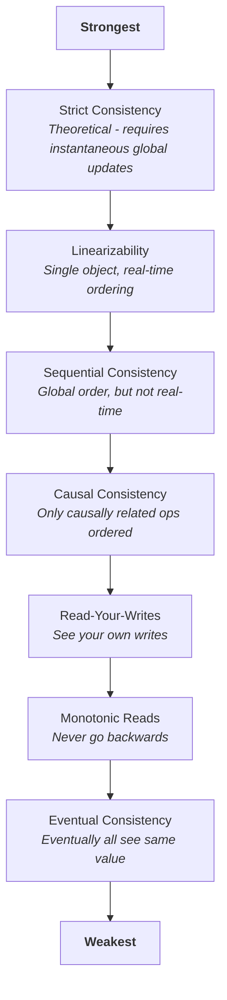
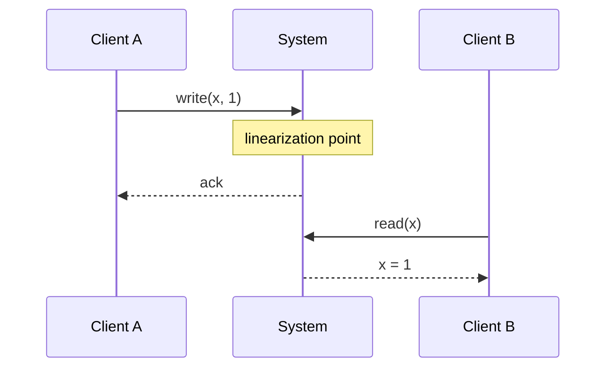
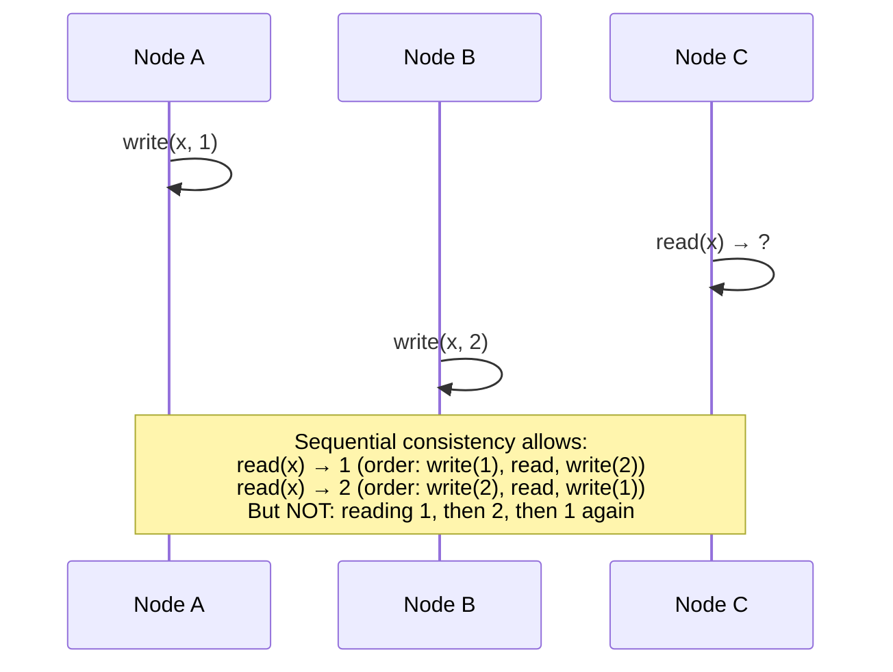
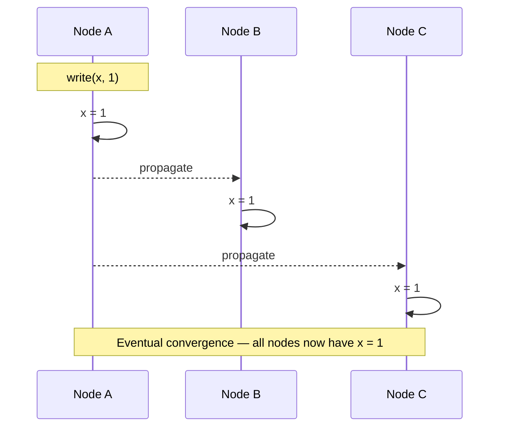

# 整合性モデル

> この記事は英語版から翻訳されました。最新版は[英語版](/01-foundations/04-consistency-models)をご覧ください。

## TL;DR

整合性モデルは、分散システムが操作の順序と可視性についてどのような保証を提供するかを定義します。強い整合性モデル（線形化可能性）は推論しやすいですがコストが高くなります。弱い整合性モデル（結果整合性）はパフォーマンスに優れますが、アプリケーション設計に注意が必要です。

---

## 整合性モデルが重要な理由

単一ノードのシステムでは、操作は明確な順序で実行されます。分散システムでは以下のような課題があります：
- 各ノードは任意の時点でデータの異なるビューを持っています
- ネットワーク遅延により操作が順序通りに到着しないことがあります
- 障害により一部のノードが更新を見逃すことがあります

整合性モデルはシステムとアプリケーション間の契約です：
- **システムの約束**: 「依拠できる順序保証はこのようなものです」
- **アプリケーションの要件**: 「正確性のためにはこのような順序が必要です」

---

## 整合性のスペクトラム



---

## 線形化可能性

### 定義

すべての操作は、開始から終了までの間のある時点で原子的に効果を発揮するように見えます。すべての操作はリアルタイムを尊重するグローバルな順序を持ちます。



### 特性

1. **最新性**: 読み取りは最新の書き込みを返します
2. **リアルタイム順序付け**: 操作Aが操作Bの開始前に完了した場合、AはBの前に現れます
3. **単一コピーの幻想**: システムが1つのコピーしかないかのように振る舞います

### 実装アプローチ

**同期レプリケーションを用いた単一リーダー：**
```
Client → Leader → [sync write to followers] → ack to client
```

**合意プロトコル（Raft, Paxos）：**
```
Client → Leader → [majority agreement] → commit → ack
```

**Compare-and-Swapレジスタ：**
```
CAS(expected, new) → atomic read-modify-write
```

### 線形化可能性のコスト

| 側面 | 影響 |
|------|------|
| レイテンシ | 調整を待つ必要があります |
| 可用性 | パーティション中は応答できません |
| スループット | 単一のシリアライゼーションポイント |

### 必要な場面

- 分散ロック
- リーダー選出
- 一意性制約の強制
- 金融取引

---

## 逐次整合性

### 定義

すべての操作は何らかの逐次的な順序で実行されるように見え、各プロセッサの操作はプログラム順序で現れます。ただし、この順序はリアルタイムと一致する必要はありません。



### 線形化可能性との違い

線形化可能性: リアルタイム順序が重要です
逐次整合性: プロセスごとのプログラム順序のみが重要です

```
Real time:
  Process 1: write(x,1) completes at t=10
  Process 2: read(x) starts at t=15

Linearizable: read must return 1
Sequential: read might return old value if "read" is ordered before "write"
```

### ユースケース

- 全順序ブロードキャスト
- マルチスレッドプログラミングモデル
- レプリケートされた状態機械

---

## 因果整合性

### 定義

因果関係のある操作は、すべてのノードで同じ順序で現れます。並行（無関係な）操作は異なる順序で現れることがあります。

### 因果関係の定義

操作Aが操作Bに因果的に先行するのは以下の場合です：
1. 同一プロセス: プログラム順序でAがBの前に発生
2. 読み取り元: Aが書き込みで、BがAの値を返す読み取り
3. 推移性: AがCに先行し、CがBに先行する場合、AはBに先行します

```
Causal chain:
  User 1: write("Hello")          [message 1]
          ↓ reads
  User 2: write("Reply to Hello") [message 2]

All nodes must see message 1 before message 2
```

### 並行操作

```
User A: write("Post A")
User B: write("Post B")   ← concurrent, no causal relation

Node 1 might show: Post A, Post B
Node 2 might show: Post B, Post A
Both are valid under causal consistency
```

### 実装：ベクタークロック

```
Vector clock: [A:3, B:2, C:1]

Each node maintains clock for every node
On local event: increment own counter
On send: attach vector clock
On receive: merge (max each component), then increment own
```

**ベクタークロックの比較：**
```
V1 = [2, 3, 1]
V2 = [2, 2, 2]

V1 < V2?  No (3 > 2)
V2 < V1?  No (2 > 1)
Concurrent? Yes (neither dominates)
```

### 因果+整合性

因果整合性に収束性を加えたものです：並行書き込みはすべての場所で同じ値に解決されます。

解決戦略：
- Last-Writer-Wins（LWW）
- 複数値（すべての並行値を返す）
- アプリケーション固有のマージ

---

## セッション保証

「十分な」場合が多い、より弱い整合性モデルです。

### 自分の書き込みの読み取り（Read Your Writes）

書き込み後、自分の書き込みが見えます。

```
✓ Correct:
  write(x, 1)
  read(x) → 1

✗ Violation:
  write(x, 1)
  read(x) → old_value  (stale replica)
```

**実装方法：**
- スティッキーセッション（常に同じノード）
- 書き込みタイムスタンプを含め、レプリカが遅れている場合は待機
- 書き込み後はリーダーから読み取り

### 単調読み取り（Monotonic Reads）

一度ある値を見たら、それより古い値を見ることはありません。

```
✓ Correct:
  read(x) → 5
  read(x) → 5 or higher

✗ Violation:
  read(x) → 5
  read(x) → 3  (went backwards)
```

**実装方法：**
- クライアントごとのハイウォーターマーク追跡
- スティッキーセッション
- バージョンベクター

### 単調書き込み（Monotonic Writes）

プロセスによる書き込みは、すべてのノードで順序通りに見えます。

```
✓ Correct:
  write(x, 1)
  write(x, 2)
  All nodes eventually have: 1 → 2

✗ Violation:
  Node A sees: 2, then 1 (wrong order)
```

### 読み取りに続く書き込み（Writes Follow Reads）

値を読み取った後に書き込む場合、書き込みは読み取りの後に順序付けられます。

```
Process reads x = 5, then writes y = 10

All nodes see: write(x, 5) happens before write(y, 10)
```

---

## 結果整合性

### 定義

新しい更新がなければ、最終的にすべてのレプリカが同じ値に収束します。



### 結果整合性が保証しないこと

- 「最終的に」がどのくらいかかるか
- 収束前にどの値が読み取られるか
- 並行書き込みのどちらが「勝つ」か

### 競合解決

並行書き込みが存在する場合：

**Last-Writer-Wins（LWW）：**
```
write(x, 1) at t=10
write(x, 2) at t=15
Result: x = 2 (higher timestamp wins)

Problem: Clock skew can discard writes
```

**複数値（Siblings）：**
```
write(x, 1) at Node A
write(x, 2) at Node B (concurrent)
Result: x = {1, 2} (application must resolve)
```

**CRDT（Conflict-free Replicated Data Types）：**
```
G-Counter: only increment, merge = max per node
LWW-Register: last-writer-wins with logical clock
OR-Set: add wins over concurrent remove
```

---

## チューナブル整合性

多くのシステムでは操作ごとの整合性レベルの選択が可能です。

### クォーラムパラメータ

```
N = total replicas
W = write quorum (replicas that must ack write)
R = read quorum (replicas to read from)
```

**保証：**
```
W + R > N  → Strong consistency (overlap guarantees seeing latest)
W + R ≤ N  → Eventual consistency (might miss latest)
```

**一般的な構成：**

| 構成 | W | R | 整合性 | ユースケース |
|------|---|---|--------|------------|
| 強整合性 | N | 1 | 強 | 書き込みは遅いが読み取りは速い |
| 強整合性 | ⌈N/2⌉+1 | ⌈N/2⌉+1 | 強 | バランス型 |
| 結果整合性 | 1 | 1 | 結果整合性 | 最大パフォーマンス |
| 書き込み重視 | 1 | N | 結果整合性+ | 書き込み損失を許容 |

### 例：Cassandra

```cql
-- Strong consistency
SELECT * FROM users WHERE id = 123
USING CONSISTENCY QUORUM;

-- Eventual consistency (faster)
SELECT * FROM users WHERE id = 123
USING CONSISTENCY ONE;
```

---

## 実際の整合性

### モデルの選択

| 要件 | 最低限必要なモデル |
|------|-------------------|
| 分散ロック | 線形化可能 |
| 正確なカウントのカウンター | 線形化可能 |
| ユーザーが自分の投稿を見る | 自分の書き込みの読み取り |
| チャットメッセージの順序付け | 因果整合性 |
| ソーシャルフィード | 結果整合性 |
| ショッピングカート | 結果整合性 + CRDT |
| 設定管理 | 線形化可能 |

### 整合性レベルの混在

ほとんどのアプリケーションは複数のレベルを使用します：

```
User profile updates: Eventual (staleness OK)
Password changes: Read-your-writes (must see new password)
Account balance: Linearizable (must be accurate)
```

### 整合性のテスト

**Jepsen** - ブラックボックス整合性テスト：
1. クラスタに対して操作を実行します
2. 操作の履歴を記録します
3. 履歴が整合性モデルに合致するか検証します

**線形化可能性チェッカー：**
```
History:
  [invoke write(1)]
  [invoke read]
  [ok write(1)]
  [ok read → 0]  ← Violation! Read should see 1

Check: Is there a linearization? No.
```

---

## 実装コスト分析

各整合性モデルの具体的なコストを理解することで、過剰設計や設計不足を防ぎます。

### 操作ごとの調整ラウンド数

| モデル | 調整 | 詳細 |
|--------|------|------|
| 線形化可能 | リーダーへの1 RTT + 過半数のACK | 書き込み: クライアント→リーダー→過半数→ACK。読み取り: リーダーリースまたはread-index RPC。 |
| 逐次整合性 | 全順序ブロードキャスト以上の追加なし | 全順序は既に確立済み。ログ適用後は読み取りごとの調整は不要。 |
| 因果整合性 | メッセージにピギーバックされたベクタークロック | 追加のラウンドトリップなし — メタデータはアプリケーションメッセージとともに送信されます。 |
| 結果整合性 | 0 | ファイア・アンド・フォーゲットの非同期レプリケーション。書き込みパスでの調整なし。 |

### レイテンシへの影響

線形化可能な操作は、すべてのリクエストでレプリカ間の調整コストを支払います：

```
Latency breakdown (single-region, 3-AZ deployment):
  Linearizable write:  local disk (~1ms) + cross-AZ RTT (~5-15ms) + majority ack
  Linearizable read:   lease-based ~0ms extra, or read-index +1 RTT (~5-15ms)
  Causal write:        local disk (~1ms) + vector clock merge (<0.1ms)
  Eventual write:      local disk (~1ms)

Cross-region (US-East → EU-West, ~80ms RTT):
  Linearizable write:  +80-160ms (consensus across regions)
  Causal write:        +0ms (async replication, metadata only)
  Eventual write:      +0ms
```

### 帯域幅オーバーヘッド

| モデル | メッセージごとのオーバーヘッド | 備考 |
|--------|------------------------------|------|
| 線形化可能 | 合意メタデータ（約50-100バイト） | Raftログエントリヘッダー、term、index |
| 逐次整合性 | ログシーケンス番号（約8バイト） | 全順序ブロードキャストシーケンス |
| 因果整合性 | ベクタークロック（8バイト × Nノード） | クラスタサイズに応じて増大。50ノード超ではインターバルツリークロックを使用 |
| 結果整合性 | バージョン/タイムスタンプ（約8-16バイト） | LWWタイムスタンプまたはバージョンベクター |

**主要なトレードオフ**: 3-AZデプロイメントにおける線形化可能な整合性は、書き込みごとにp50レイテンシを5-15ms追加します。10k書き込み/秒のサービスでは、毎秒約10万回の追加ネットワークラウンドトリップが発生し、計測可能なインフラコストとなります。因果整合性は、ほぼゼロのオーバーヘッドで、大半のユーザー向け機能に十分な順序保証を提供します。

---

## 実システムの整合性保証

マーケティングの主張ではなく、システムが実際に提供する保証を理解することで、本番環境での予期せぬ問題を防ぎます。以下は2025年後半時点での操作ごとの保証です。

| システム | バージョン | デフォルトの整合性 | 利用可能な最強の整合性 | メカニズム | 最強の整合性のコスト |
|----------|-----------|-------------------|----------------------|-----------|---------------------|
| Google Spanner | 2024+ | 線形化可能（外部整合性） | 線形化可能 | TrueTime + Paxosグループ間2PC | 常時有効。クロック不確実性のため約7msのコミット待機 |
| CockroachDB | v23.2+ | 直列化可能 | 直列化可能（AS OF SYSTEM TIMEで厳密な直列化可能） | レンジごとのRaft、HLCタイムスタンプ | デフォルト。フォロワー読み取りはレイテンシとの引き換えで陳腐化を許容 |
| DynamoDB | 2024 | 結果整合性 | 強い整合性の読み取り | ストレージノードからのリーダーベース読み取り | 2倍のRCUコスト、高レイテンシ、単一リージョンのみ |
| Cassandra | 4.x / 5.0 | チューナブル（デフォルトONE） | 線形化可能（SERIAL） | SERIAL向けPaxos（LWT）、QUORUM向けクォーラムオーバーラップ | SERIAL: ONEの4倍のレイテンシ、QUORUM: ONEの2倍 |
| MongoDB | 7.x+ | 因果整合性（因果セッション内） | 線形化可能 | majorityリードコンサーン + majorityライトコンサーン。線形化可能読み取りはno-op Raft書き込み経由 | 線形化可能読み取りは読み取りごとに1 Raft RTT追加 |
| PostgreSQL | 16+ | 線形化可能（単一ノードでは自明） | 直列化可能（SSI） | 単一ノード上の述語ロック。非同期レプリカは結果整合性 | SSIは約5-10%のオーバーヘッド追加。ストリーミングレプリカはms-秒単位の遅延 |
| etcd | v3.5+ | 線形化可能 | 線形化可能 | Raft合意、リーダーベース読み取り | デフォルト。直列化可能読み取りはリーダーをバイパス（陳腐化OK） |
| Redis (Cluster) | 7.x | 結果整合性（非同期レプリケーション） | 結果整合性（強い整合性オプションなし） | 非同期プライマリ→レプリカ | 強い整合性なし。WAITコマンドはウィンドウを縮小するが排除はしない |
| TiDB | v7.x+ | スナップショット分離 | スナップショット分離（直列化可能ではない） | Percolatorスタイル2PC + Raft | 書き込み-書き込み競合を検出。ただし読み取り-書き込み異常の保護なし |

**よくある落とし穴**: DynamoDBの強い整合性読み取りは単一リージョン内でのみ動作します。Global Tablesはリージョン間で結果整合性を使用し、リージョン間の強い読み取りオプションはありません。

**PostgreSQLに関する注意**: 単一ノードのPostgreSQLはコピーが1つしかないため、自明に線形化可能です。ストリーミングレプリカを追加した瞬間、それらのレプリカに対する読み取りは結果整合性になります（遅延は`max_standby_streaming_delay`と負荷に依存します）。

---

## CRDTリファレンス

CRDT（Conflict-free Replicated Data Types）は、調整なしで数学的に収束が保証されたデータ型です。各型はマージ関数を定義しており、可換性、結合性、冪等性を満たします。これにより、レプリカは任意の順序で状態を交換しても収束します。

### G-Counter（増加専用カウンター）

各ノードは自身のカウンターを保持します。グローバルカウントは合計値です。マージはノードごとの最大値を取ります。

```
State:  { node_id → count }

increment(node_id):
    state[node_id] += 1

value():
    return sum(state.values())

merge(local, remote):
    for each node_id in union(local.keys(), remote.keys()):
        result[node_id] = max(local.get(node_id, 0),
                              remote.get(node_id, 0))
    return result

Example:
  Node A: {A:3, B:0} → value = 3
  Node B: {A:1, B:2} → value = 3
  merge:  {A:3, B:2} → value = 5
```

### PN-Counter（正負カウンター）

2つのG-Counterを使用します：増分用（`P`）と減分用（`N`）です。値 = `P.value() - N.value()` です。

```
State:  { P: G-Counter, N: G-Counter }

increment(node_id):  P.increment(node_id)
decrement(node_id):  N.increment(node_id)
value():             P.value() - N.value()

merge(local, remote):
    result.P = G-Counter.merge(local.P, remote.P)
    result.N = G-Counter.merge(local.N, remote.N)
    return result
```

### OR-Set（Observed-Remove Set）

追加は並行する削除に対して優先されます。各追加操作には一意の識別子がタグ付けされます。削除は削除者が観測したタグのみを削除します。

```
State:  { element → set_of_unique_tags }

add(element):
    tag = generate_unique_tag()  // e.g., (node_id, lamport_ts)
    state[element].add(tag)

remove(element):
    state[element] = {}  // remove only locally observed tags

lookup(element):
    return len(state[element]) > 0

merge(local, remote):
    for each element:
        result[element] = union(local[element], remote[element])
                          - (local_removed ∩ remote_removed)
    // In practice: keep all tags from both sides,
    // only discard tags that BOTH sides have removed
    return result
```

**一意のタグが重要な理由**: タグがなければ、同じ要素に対する並行な追加と削除は曖昧になります。タグにより、マージ関数は「この追加は削除の後に発生した」と「この追加は既に削除された」を区別できます。

### LWW-Register（Last-Writer-Wins レジスタ）

最もシンプルな収束レジスタです。各書き込みにはタイムスタンプが付随し、最も高いタイムスタンプが勝ちます。

```
State:  { value, timestamp }

write(new_value, ts):
    if ts > state.timestamp:
        state = { value: new_value, timestamp: ts }

read():
    return state.value

merge(local, remote):
    if remote.timestamp > local.timestamp:
        return remote
    return local
    // On tie: break by node_id or discard (implementation-specific)
```

**注意**: LWWは並行書き込みを暗黙的に破棄します。これは「最後のステータス更新」のようなユースケースでは許容されますが、すべての書き込みを保持する必要がある場合は危険です（代わりにOR-Setまたはシーケンス型CRDTを使用してください）。

---

## 整合性検証（Jepsen）

[Jepsen](https://jepsen.io)は、分散システムのブラックボックス整合性テストの業界標準フレームワークです。並行ワークロードを実行しながら障害（ネットワークパーティション、クロックスキュー、プロセスクラッシュ、ディスク破損）を注入し、記録された操作履歴がシステムが主張する整合性モデルに違反していないかを検証します。

### 発見された主要な違反事例

| システム | バージョン | 主張された保証 | 実際に発見された違反 | 年 |
|----------|-----------|---------------|---------------------|-----|
| MongoDB | 2.6 | 線形化可能（w:majority, r:majority） | ネットワークパーティション下でのステイル読み取り。過半数にACKされた書き込みが過半数読み取りで不可視 | 2015 |
| Cassandra | 2.0.x | QUORUM読み取り = 強い整合性 | ノード再起動後のステイル読み取り。commitlogリプレイの順序問題 | 2013 |
| etcd | 3.1 | 線形化可能な読み取り | リーダー移行中のステイル読み取り。新リーダーが保留中のログエントリを適用する前に読み取りを提供 | 2020 |
| Redis Sentinel | 3.x-5.x | CP（ユーザーの主張） | スプリットブレインによるデータ損失。非同期レプリケーションにより、フェイルオーバー時にACK済み書き込みが消失 | 2013-2020 |
| TiDB | 2.1 | スナップショット分離 | 高競合下での更新損失。タイムスタンプオラクルのギャップが可視性の異常を引き起こす | 2019 |
| RabbitMQ | 3.x | キューミラーリング = メッセージ損失なし | `ha-mode: all`でのネットワークパーティション中にメッセージ消失。確認済みパブリッシュが未レプリケート | 2014 |

### Jepsenによる検出方法

```
1. Start cluster (Docker/LXC containers)
2. Run concurrent client operations (reads, writes, CAS)
3. Inject faults:
   - iptables partitions between specific node pairs
   - SIGSTOP/SIGKILL random nodes
   - Clock skew via ntpd manipulation
4. Record full operation history:
   [invoke :write 1] [ok :write 1] [invoke :read] [ok :read nil] ← violation?
5. Feed history to model checker:
   - Linearizability: Knossos or Elle checker
   - Serializability: Elle (Adya-style dependency graph analysis)
   - Causal: verify partial-order constraints
6. Output: either "valid" or counterexample with specific operations
```

### Hermitage：単一ノード分離テスト

単一ノードデータベースの場合、[Hermitage](https://github.com/ept/hermitage)テストスイートがSQL標準に対してトランザクション分離レベルを検証します。以下の特定の異常をテストします：

| 異常 | Read Uncommitted | Read Committed | Repeatable Read | Serializable |
|------|-----------------|----------------|-----------------|--------------|
| ダーティライト | 防止 | 防止 | 防止 | 防止 |
| ダーティリード | 発生可能 | 防止 | 防止 | 防止 |
| ノンリピータブルリード | 発生可能 | 発生可能 | 防止 | 防止 |
| ファントムリード | 発生可能 | 発生可能 | 発生可能* | 防止 |
| ライトスキュー | 発生可能 | 発生可能 | 発生可能* | 防止 |

*多くのデータベース（MySQL/InnoDB、PostgreSQL）はMVCC/ギャップロックによりRepeatable Readでファントムを防止しており、SQL標準の最低要件を超えています。

**実用的なアドバイス**: デフォルト設定ではなく、実際のデプロイメント構成に対してJepsenを実行してください。多くの違反は、特定のレプリケーション設定、障害モード、またはバージョンの組み合わせでのみ発生します。`W=ALL, R=ALL`でJepsenに合格するシステムでも、`W=QUORUM, R=QUORUM`では失敗する可能性があります。

---

## 重要なポイント

1. **強ければ良いとは限らない** - 必要な分だけコストを払いましょう
2. **線形化可能性はコストが高い** - 調整が必要で、可用性に影響します
3. **因果整合性で十分な場合が多い** - 直感的な順序を保持します
4. **結果整合性には競合処理が必要** - CRDTまたはアプリケーションロジックで対応します
5. **セッション保証が役立つ** - 自分の書き込みの読み取りだけで良いUXには十分な場合が多いです
6. **操作ごとにチューニングする** - データの種類によって要件は異なります
7. **仮定をテストする** - Jepsenなどのツールで検証しましょう
