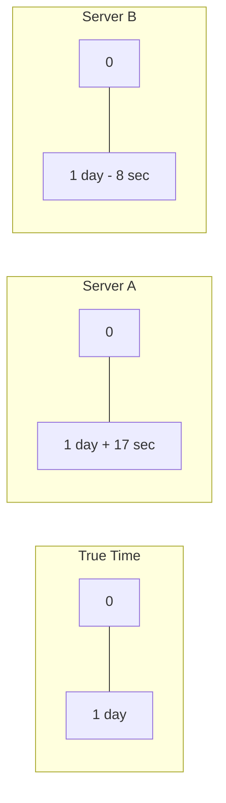
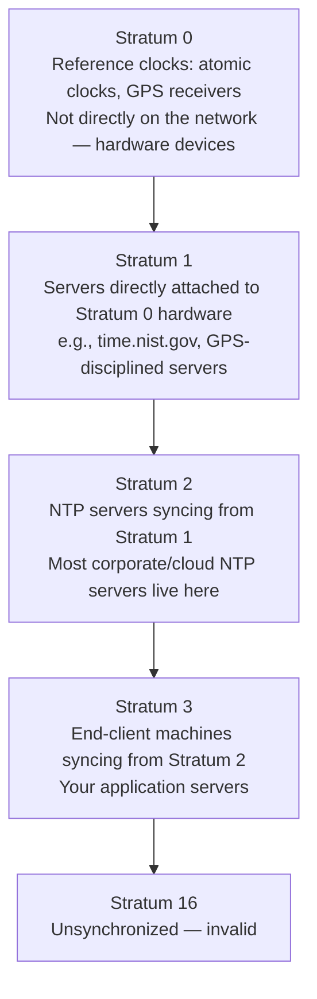
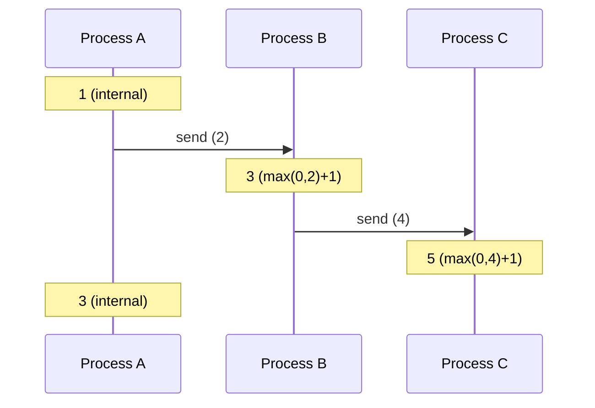
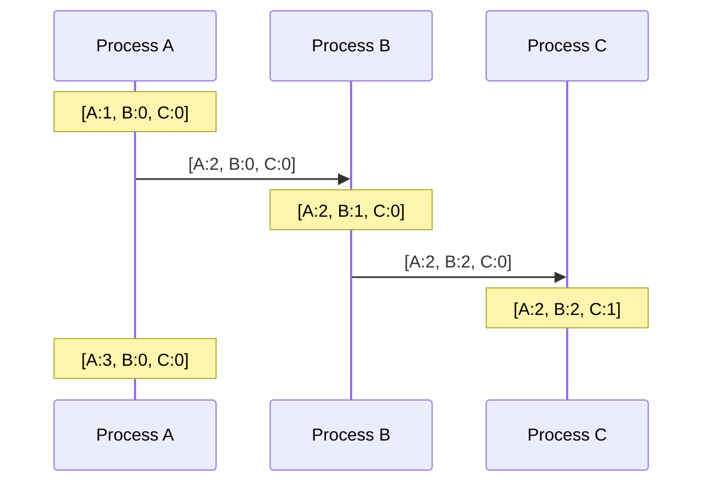
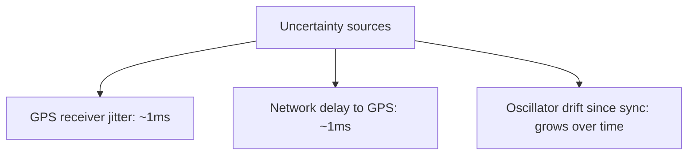
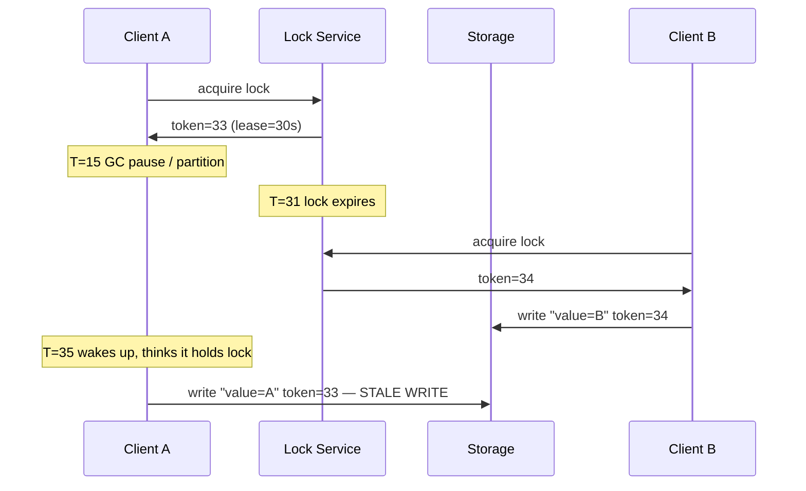
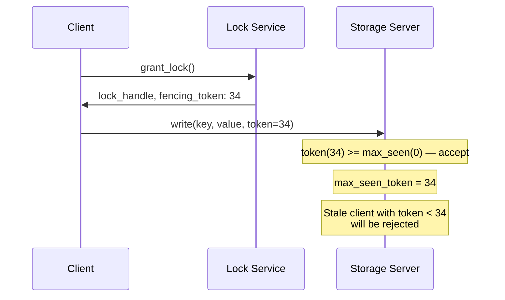

# 分散時間

> この記事は英語版から翻訳されました。最新版は[英語版](/01-foundations/05-distributed-time)をご覧ください。

## TL;DR

分散システムにはグローバルクロックが存在しません。物理クロックはドリフトし、順序保証を提供できません。因果関係の追跡には論理クロック（Lamport、Vector）を使用し、因果関係と壁時計時刻の両方が必要な場合にはハイブリッドクロック（HLC）を使用します。物理時間は人間向け、論理時間はマシン向けです。

---

## 物理時間の問題

### クロックドリフト

すべてのコンピュータには水晶振動子が搭載されています。安価ですが不正確です：
- 一般的なドリフト：10-200 ppm（百万分率）
- 100 ppm = 1日あたり8.6秒
- 1週間後：約1分のずれ



### NTP同期

Network Time Protocol（NTP）はクロックを同期しますが、完全ではありません：
- LAN精度：通常1-10 ms
- WAN精度：10-100 ms
- ネットワーク障害時にスパイク発生

```
NTP correction:
  Before: Server clock 500ms ahead
  After:  Clock slewed/stepped back

  t=1000ms  t=1001ms  t=1002ms  t=1001ms  t=1002ms
                                    ↑
                             Time went backwards!
```

### うるう秒

UTCは時折うるう秒を追加します。クロックは以下のように動作する可能性があります：
- 前方にジャンプ（1秒の欠落）
- 1秒の繰り返し（同じタイムスタンプが2回）
- 数時間かけて「スミア」する（Googleのアプローチ）

---

## NTP詳解

### ストラタム階層

NTPはストラタムと呼ばれる階層型の信頼モデルを使用します：



ホップごとに不確実性が増加します。Stratum 2サーバーの精度は約1-10ms、Stratum 3クライアントはネットワーク経路に応じて通常1-50msです。

### スルー補正 vs ステップ補正

NTPがオフセットを検出した場合、2つの補正戦略があります：

| 戦略 | 動作 | 使用条件 |
|------|------|----------|
| **スルー** | クロックレートを最大±500 ppmで徐々に調整 | オフセット < 128ms（ntpdのデフォルト） |
| **ステップ** | クロックを正しい時刻に即座にジャンプ | オフセット > 128ms |

スルーはより安全で、タイムスタンプの不連続がありませんが、低速です。500 ppmで100msのオフセットを補正するには約200秒かかります。ステップはより高速ですが、タイムスタンプが繰り返されたりギャップが生じる時間の不連続を引き起こします。

```
Slew correction (offset = 50ms ahead):
  Clock rate slowed from 1.0 to 0.9995 for ~100 seconds
  Applications see time slow down slightly, never jump

Step correction (offset = 500ms ahead):
  Clock jumps:  10:00:05.500 → 10:00:05.000
  Applications see time go BACKWARDS by 500ms
```

### chrony vs ntpd

| 機能 | ntpd | chrony |
|------|------|--------|
| 収束速度 | 数分から数時間 | 数秒から数分 |
| VM/コンテナ対応 | 不良（安定したクロックを前提） | 良好（TSCの不安定性に対応） |
| 断続的接続 | 不良 | 良好（再起動間のドリフトを保存） |
| 最新ディストリビューションのデフォルト | RHEL ≤6、古いDebian | RHEL ≥7、Fedora、Ubuntu |

**本番環境での推奨：** chronyを使用してください。起動後やネットワーク障害後の収束が10-100倍速く、頻繁に起動・停止するコンテナやVMにとって重要です。

### `chronyc tracking`の読み方

```shell
$ chronyc tracking
Reference ID    : A9FEA97B (169.254.169.123)    # NTP server IP
Stratum         : 3                                # Our stratum level
Ref time (UTC)  : Sat Mar 14 10:23:45 2026        # Last sync time
System time     : 0.000000345 seconds fast          # Current offset from NTP
Last offset     : +0.000000213 seconds              # Offset at last correction
RMS offset      : 0.000000892 seconds              # Moving avg of recent offsets
Frequency       : 3.451 ppm slow                   # Crystal drift rate
```

主要フィールド：**System time**は現在のエラーです。**RMS offset**は一般的な精度です。**Frequency**は水晶の自然なドリフト率を示し、chronyは同期間隔の間これを補正します。

### クラウドプロバイダーのNTP

| プロバイダー | NTPエンドポイント | スミアリング | 一般的な精度 |
|-------------|-----------------|-------------|-------------|
| **AWS** | `169.254.169.123`（リンクローカル） | うるう秒スミア対応 | 0.1-1ms |
| **GCP** | `metadata.google.internal` | うるう秒スミア対応（24時間線形） | <1ms |
| **Azure** | `time.windows.com` | デフォルトではスミア非対応 | 5-50ms |

AWSはNitroハイパーバイザーを経由してリンクローカルアドレスで専用NTPサービスを提供しており、ネットワークホップがありません。GCPは原子時計を備えた独自のStratum-1フリートを運用しています（Spannerインフラに類似）。Azureは遅れを取っています。本格的な時間要件には、chronyを外部のStratum-1ソースに設定するか、独自のGPS同期NTPサーバーをデプロイしてください。

**警告：** うるう秒スミア対応と非対応のNTPソースを混在させると、うるう秒イベント時に微妙なエラーが発生します。スミアリングウィンドウ中に最大0.5秒のドリフトが生じる可能性があります。

---

## 実際のクロック障害事例

### Linuxうるう秒バグ（2012年）

2012年6月30日、うるう秒の挿入がLinuxカーネルの`hrtimer`サブシステムのバグを引き起こしました。`CLOCK_REALTIME`の調整がfutex（高速ユーザー空間ミューテックス）の実装と相互作用し、スレッドがスリープではなく100% CPUでスピンしました。

**影響：**
- Reddit、Mozilla、Yelp、FourSquare、StumbleUponがダウン
- Qantas航空がチェックインシステムの障害によりフライトを地上待機
- JavaとMySQLのプロセスが特に影響を受けた（futexの多用）

**根本原因：** カーネルの`ntp_leap()`が`clock_was_set()`を呼び出し、タイマーキャッシュが無効化されました。futexのウェイターが起床し、時間が進んでいないことを確認して再度待機に入り、ビジースピンループが発生しました。

**修正：** `date -s "$(date)"`（クロックの強制リセット）が即時の回避策でした。カーネルパッチは3.4以降で適用されました。

**教訓：** うるう秒は理論的な懸念ではありません。システムがLinux上で動作している場合、うるう秒スミアリングまたはカーネルパッチが必要です。

### Cloudflare RRDNSの障害（2017年）

2017年1月1日、CloudflareのカスタムDNSサーバー（RRDNS、Go言語で記述）がうるう秒中にクラッシュしました。

**根本原因：** コードは2つの`CLOCK_REALTIME`の読み取り間の時間差を計算していました。うるう秒中に、後の読み取りがより早いタイムスタンプを返し、負の期間が生成されました。この負の値が正の期間を期待する関数に渡され、パニックが発生しました。

```go
// Simplified version of the bug
elapsed := time.Now().Sub(startTime)  // Negative during leap second!
// Used elapsed to compute weighted random selection — panicked on negative
```

**教訓：** 経過時間の計算には常にモノトニッククロックを使用してください。GoはGo 1.9でこれを言語レベルで修正しました。`time.Now()`は壁時計とモノトニック両方の読み取りを保存するようになりました。

### GPSウィークロールオーバー（2019年）

GPSは現在の週を10ビットフィールドでエンコードしており、1024週（約19.7年）ごとにロールオーバーします。2019年4月6日に2回目のGPSウィークロールオーバーが発生しました（1回目は1999年）。

**影響：**
- 古いGPS受信機が1999年の日付を報告するか、無効なタイムスタンプを表示
- 航空、海事、通信のタイミング機器に影響
- 一部の基地局の同期が劣化し、通話の切断が発生

**教訓：** 時間インフラには隠れた前提があります。システムがGPS同期クロックに依存している場合、ファームウェアがロールオーバーを処理できることを確認してください。次の10ビットロールオーバーは2038年11月20日で、Unix Y2K38オーバーフローとほぼ同時期です。

---

## クラウド環境でのクロックスキュー

クラウドVMは、ベアメタルサーバーにはない固有のクロック課題を導入します：ライブマイグレーション、共有ハイパーバイザースケジューリング、可変TSC（Time Stamp Counter）の信頼性、およびCPUスチール時間です。

### プロバイダー別の特性

| プロバイダー | 定常状態 | ライブマイグレーション中 | CPUスチール中 |
|-------------|---------|----------------------|-------------|
| **AWS EC2** | 0.1-3ms | 10-50msのスパイク、chronyで5秒未満で回復 | スチール>5%の場合1-10ms |
| **GCP** | <1ms | <5ms（マイグレーションが高速） | 専用VMではまれ |
| **Azure** | 5-50ms（デフォルトNTP） | 50-200msのスパイクが観測 | バースタブルティアで頻発 |

ライブマイグレーションが最大のリスクです：VMが一時停止し、新しいハードウェアに移動して再開します。TSCがジャンプし、NTPが再収束する必要があります。ntpdでは数分かかりますが、chronyでは数秒です。

### クロックスキューの監視

Prometheus `node_exporter`を使用してNTPの健全性を追跡します：

```promql
# Current offset from NTP server
node_timex_offset_seconds

# Estimated error bound
node_timex_maxerror_seconds

# Clock synchronized (1 = yes)
node_timex_sync_status
```

**本番環境のアラート閾値：**

| スコープ | 警告 | ページ |
|---------|------|-------|
| データセンター内 | 5分間持続で>1ms | 1分間持続で>10ms |
| リージョン間 | 5分間持続で>10ms | 1分間持続で>50ms |
| NTP同期喪失 | 1分間`sync_status == 0` | 5分間`sync_status == 0` |

**重要なプラクティス：** すべてのリクエストトレースにローカルNTPオフセットを記録してください。数週間後に順序の異常をデバッグする際、各ノードのクロックがその時点でどれだけずれていたかを知る必要があります。

---

## 順序付けが重要な理由

### タイムスタンプ順序の問題

```
Server A (clock fast):   write(x, "A") at 10:00:05.000
Server B (clock slow):   write(x, "B") at 10:00:03.000

Actual wall-clock order: B happened first
Timestamp order:         A appears first

If using Last-Writer-Wins: wrong value wins!
```

### 因果関係の違反

```
Message ordering failure:

Alice → Bob: "Want to grab lunch?" [t=10:00:01.000]
Bob → Alice: "Sure, where?"        [t=10:00:00.500 - clock behind!]

Displayed to Alice:
  Bob: "Sure, where?"
  Alice: "Want to grab lunch?"

  ↑ Nonsensical order
```

---

## Lamportクロック

### 定義

イベントの半順序を提供する論理クロックです。

**ルール：**
1. 各プロセスがカウンタを保持
2. ローカルイベント時：カウンタをインクリメント
3. 送信時：カウンタを添付し、インクリメント
4. 受信時：counter = max(local, received) + 1

### 例



### Lamportクロックの性質

**提供するもの：**
- A → B（AがBに因果的に先行する）ならば、L(A) < L(B)

**提供しないもの：**
- L(A) < L(B)であっても、A → Bとは結論できない
- 並行（コンカレント）の可能性がある

```
L(A) = 5, L(B) = 7

Possible interpretations:
1. A caused B (A → B)
2. A and B are concurrent, happened to get these values
3. B happened before A in real time, but didn't cause it
```

### Lamportクロックによる全順序

プロセスIDでタイブレーク：

```
Event ordering: (timestamp, process_id)

Event at A: (5, A)
Event at B: (5, B)

Order: (5, A) < (5, B)  (assuming A < B alphabetically)
```

これは一貫した全順序を提供しますが、並行イベントに対しては恣意的です。

---

## ベクタークロック

### 定義

プロセスごとに1つのカウンタのベクトルです。因果関係を正確に追跡します。

**ルール：**
1. 各プロセスがN個のカウンタのベクトルを保持（N = プロセス数）
2. ローカルイベント時：自身の位置をインクリメント
3. 送信時：ベクトル全体を添付し、自身の位置をインクリメント
4. 受信時：ベクトルをマージ（コンポーネントごとのmax）、その後自身をインクリメント

### 例



### ベクタークロックの比較

```
V1 ≤ V2  iff  ∀i: V1[i] ≤ V2[i]
V1 < V2  iff  V1 ≤ V2 and V1 ≠ V2
V1 || V2 iff  ¬(V1 ≤ V2) and ¬(V2 ≤ V1)  (concurrent)
```

**例：**
```
[2, 3, 1] < [2, 4, 1]  ✓  (causally before)
[2, 3, 1] < [3, 3, 1]  ✓  (causally before)
[2, 3, 1] || [2, 2, 2]    (concurrent: 3>2 but 1<2)
[2, 3, 1] || [1, 4, 1]    (concurrent: 2>1 but 3<4)
```

### ベクタークロックの性質

**提供するもの：**
- V(A) < V(B) ならば A → B（因果的に先行）
- V(A) || V(B) ならば AとBは並行

**制限事項：**
- イベントごとにO(N)の空間
- プロセス数が多い場合に問題
- 全プロセスを事前に知る必要がある

---

## ベクタークロックの最適化

### バージョンベクトル（ドット付き）

Dynamoスタイルのシステムで使用されます。イベントごとではなく、レプリカごとに追跡します。

```
Object version: {A:3, B:2}

Client reads from A, writes to B:
  New version: {A:3, B:3}

Concurrent write at A:
  Version: {A:4, B:2}

Conflict detected: {A:4, B:2} || {A:3, B:3}
```

### インターバルツリークロック

プロセスが参加・離脱する動的システム向け：
- フォーク時にクロックを分割
- 参加時にマージ
- より複雑だがO(log N)の一般的サイズ

### Bloomクロック

確率的：因果関係のあるイベントに対して「並行」と判定する可能性はありますが、真の並行性を見逃すことはありません。

---

## ハイブリッド論理クロック（HLC）

### 動機

以下を実現したい：
1. 因果関係の追跡（論理クロックのように）
2. 壁時計時刻との相関（人間/デバッグ向け）
3. 物理時間からの限定的な乖離

### 設計

HLC = (physical_time, logical_counter)

```
HLC: (pt, l)
  pt = physical time component (wall clock)
  l  = logical component (counter)
```

**ルール：**
```
On local/send event:
  pt' = max(pt, physical_clock())
  if pt' == pt:
    l' = l + 1
  else:
    l' = 0

On receive(remote_pt, remote_l):
  pt' = max(pt, remote_pt, physical_clock())
  if pt' == pt == remote_pt:
    l' = max(l, remote_l) + 1
  elif pt' == pt:
    l' = l + 1
  elif pt' == remote_pt:
    l' = remote_l + 1
  else:
    l' = 0
```

### 例

```
Physical clocks: A=100, B=100, C=98 (C is behind)

Event at A: (100, 0)
Send A→B:   B receives, sees (100, 0)
            B's clock is 100, so: (100, 1)
Send B→C:   C receives (100, 1)
            C's clock is 98 (behind!)
            pt' = max(98, 100) = 100
            Result: (100, 2)
```

### HLCの性質

- 単調性：常に前進
- 有界性：lは最大クロックスキュー × メッセージレートで制限
- 因果性：A → Bならば、HLC(A) < HLC(B)
- 実時間に近い：ptが物理時間を追跡

---

## TrueTime（Google Spanner）

### アプローチ

クロックが正確であるふりをする代わりに、不確実性を公開します。

```
TrueTime API:
  TT.now() → [earliest, latest]

Example:
  TT.now() = [10:00:05.003, 10:00:05.009]

  Meaning: actual time is somewhere in that interval
```

### インフラストラクチャ

- データセンター内のGPS受信機と原子時計
- 不確実性は通常1-7ms
- GPS障害後、不確実性が増大



### コミット待機

シリアライザブルトランザクション向け：

```
Transaction T1:
  1. Acquire locks
  2. Get commit timestamp s = TT.now().latest
  3. Wait until TT.now().earliest > s  ("commit wait")
  4. Release locks

Transaction T2 starting after T1 completes:
  Gets timestamp > s guaranteed

Result: Real-time ordering of transactions
```

### トレードオフ

コミット待機 = レイテンシコスト：
- 書き込みに約7msが追加
- グローバルなシリアライザビリティのために価値がある

---

## 実践における時間

### クロックタイプ別のユースケース

| ユースケース | クロックタイプ | 理由 |
|-------------|--------------|------|
| ログのタイムスタンプ | 物理（NTP） | 人間の可読性 |
| イベントの順序付け | Lamport | シンプルで全順序に十分 |
| コンフリクト検出 | Vector | 並行書き込みの検出 |
| データベーストランザクション | HLC | 因果関係 + 時間の相関 |
| グローバルトランザクション | TrueTime | リアルタイム順序保証 |
| キャッシュTTL | 物理 | 近似で十分 |
| リース有効期限 | 物理 + マージン | 安全バッファの追加 |

### 一般的なパターン

**リースの安全マージン：**
```
Lease holder: refresh every 30s, lease valid 60s
Other nodes: assume lease valid until 60s + clock_skew
```

**タイムスタンプ生成：**
```
// Ensure monotonicity despite clock adjustments
last_timestamp = 0

function get_timestamp():
  now = physical_clock()
  if now <= last_timestamp:
    now = last_timestamp + 1
  last_timestamp = now
  return now
```

**時間付き分散ユニークID：**
```
// Snowflake-style ID
ID = [timestamp_ms (41 bits)][machine_id (10 bits)][sequence (12 bits)]

// 4096 IDs per millisecond per machine
// Ordered by time (mostly)
```

---

## クロック問題への対処

### クロック問題の検出

```
On message receive:
  sender_time = message.timestamp
  receiver_time = local_clock()

  if receiver_time < sender_time - threshold:
    // Receiver clock behind
    log_warning("Clock skew detected")

  if sender_time < last_message_from_sender:
    // Sender clock went backward
    log_error("Clock regression detected")
```

### CLOCK_MONOTONIC vs CLOCK_REALTIME

オペレーティングシステムは複数のクロックソースを公開しています。誤った選択は実際のバグを引き起こします（上記のCloudflare 2017年の事例を参照）。

| クロック | 調整可能？ | ユースケース |
|---------|-----------|-------------|
| `CLOCK_REALTIME` | はい — NTPステップ、管理者変更、うるう秒 | 人間向けの壁時計タイムスタンプ |
| `CLOCK_MONOTONIC` | いいえ — 常に前進、NTPスルーイングのみ | タイムアウト、経過時間、インターバル |
| `CLOCK_MONOTONIC_RAW` | いいえ — NTP調整なし | ベンチマーク、ハードウェアタイミング |
| `CLOCK_BOOTTIME` | いいえ — サスペンド時間を含む | スリープ/ウェイクをまたぐリース有効期限 |

**ルール：** 経過時間の計測とタイムアウトには`CLOCK_MONOTONIC`を使用してください。`CLOCK_REALTIME`は人間にとって意味のあるタイムスタンプが必要な場合にのみ使用してください。

**言語マッピング：**

| 言語 | REALTIME | MONOTONIC |
|------|----------|-----------|
| **Go** | `time.Now().Unix()` | `time.Since(start)` は内部的にモノトニックを使用（Go ≥1.9） |
| **Java** | `System.currentTimeMillis()` | `System.nanoTime()` |
| **Python** | `time.time()` | `time.monotonic()` |
| **Rust** | `SystemTime::now()` | `Instant::now()` |
| **C** | `clock_gettime(CLOCK_REALTIME, ...)` | `clock_gettime(CLOCK_MONOTONIC, ...)` |

Go 1.9は転換点でした。`time.Now()`は壁時計とモノトニック両方の読み取りを保存します。2つの`time.Time`値間の減算は自動的にモノトニックコンポーネントを使用するため、`time.Since(start)`はNTPステップをまたいでも安全です。1.9以前は、`time.Now().Sub()`を使用するすべてのGoプログラムでCloudflare RRDNSバグが発生する可能性がありました。

### 防御的設計

1. **等価性を信頼しない：** `if time_a == time_b`は危険
2. **範囲を使用する：** 「T1とT2の間に発生」
3. **シーケンス番号を含める：** 同じタイムスタンプ内での順序付け
4. **内部イベントには論理時間を優先**
5. **物理時間は人間向けインターフェースに限定**

---

## フェンシングトークンパターン

### 問題：古いリーダー

分散ロックには時間に依存する根本的な障害モードがあります：



保護がなければ、クライアントAの古い書き込みがクライアントBの有効な書き込みを暗黙のうちに上書きします。ロックは安全性を提供せず、安全性の幻想のみを提供しました。

### 解決策：単調フェンシングトークン

ロックが付与されるたびに、ロックサービスは単調増加する**フェンシングトークン**を発行します。ストレージ層がトークンの順序を強制します：



### ZooKeeperによる実装

ZooKeeperは2つのメカニズムを通じて自然なフェンシングトークンを提供します：

1. **`zxid`（トランザクションID）：** グローバルに順序付けられ、すべてのZK書き込みでインクリメントされます。ロック作成呼び出しで返される`zxid`を使用します。
2. **シーケンシャルエフェメラルノード：** `/locks/resource-000000034`を作成すると、`34`が自然なトークンになります。

```python
# Pseudocode: fenced lock usage
class FencedLock:
    def __init__(self, zk_client, resource_path):
        self.zk = zk_client
        self.path = resource_path

    def acquire(self):
        node = self.zk.create(
            f"{self.path}/lock-",
            ephemeral=True, sequence=True
        )
        self.token = int(node.split("-")[-1])  # Sequential number as token
        # ... standard lock recipe: watch predecessor, wait ...
        return self.token

    def write_with_fence(self, storage_client, key, value):
        # Token travels with every write — storage validates it
        storage_client.write(key, value, fencing_token=self.token)
```

```python
# Storage side
class FencedStorage:
    def __init__(self):
        self.max_token = {}  # per-key max token

    def write(self, key, value, fencing_token):
        if fencing_token < self.max_token.get(key, 0):
            raise StaleTokenError(
                f"token {fencing_token} < max {self.max_token[key]}"
            )
        self.max_token[key] = fencing_token
        self._persist(key, value)
```

### ストレージにフェンシングを追加できない場合

ストレージ層がフェンシングトークンの検証をサポートしていない場合（例：管理対象外のマネージドデータベース）、代替手段として以下があります：
- **条件付き書き込み：** バージョン列を使用 — `UPDATE ... SET val=?, version=? WHERE version=?`
- **CAS操作：** etcd/Consulはリビジョン番号でのcompare-and-swapをサポート
- **順序付きべき等性キー：** 詳細なパターンは`08-idempotency.md`を参照

重要な洞察：**非同期システムにおいて、ロックだけでは相互排他を保証できません。** フェンシングトークンか、ロックを書き込みパスに紐づける合意プロトコルが必要です。

---

## 重要なポイント

1. **物理クロックはドリフトする** - 順序付けに依存してはいけない
2. **NTPは有用だが完全ではない** - ミリ秒精度が一般的
3. **Lamportクロックは全順序を提供する** - シンプルで低オーバーヘッド
4. **ベクタークロックは並行性を検出する** - ただしスケール時にコストが高い
5. **HLCは両方の利点を組み合わせる** - 因果関係 + 壁時計相関
6. **TrueTimeは不確実性を公開する** - グローバルトランザクションを可能にする
7. **要件に基づいて選択する** - より多くの保証 = より多くのコスト
8. **防御的に設計する** - クロックは誤動作すると想定する
