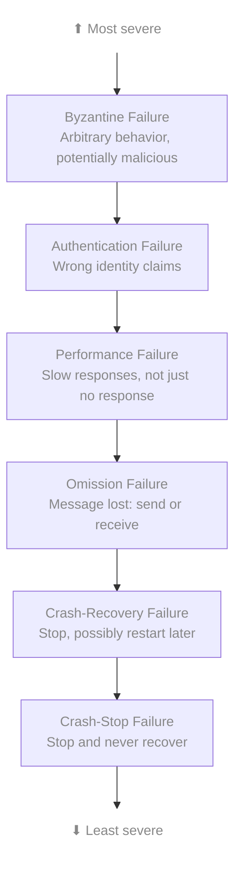
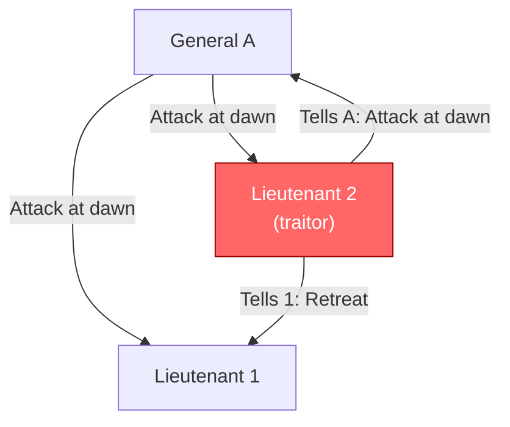
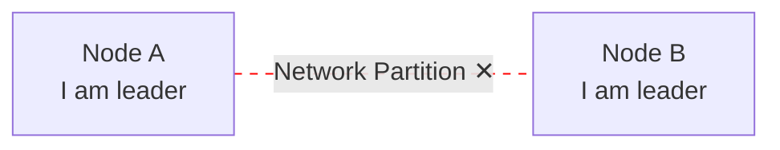
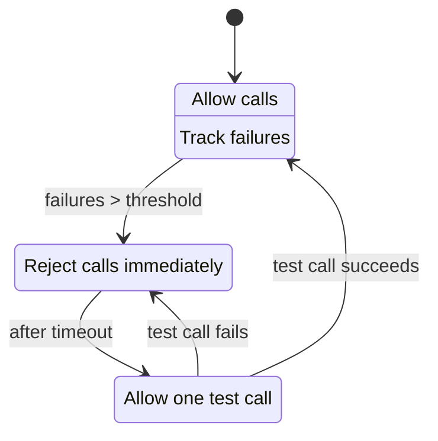
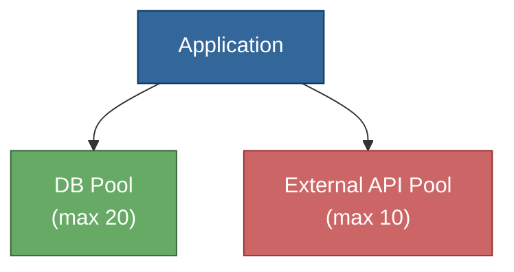

# 障害モード

> **翻訳についての注記:** 本ドキュメントは英語原文 `01-foundations/06-failure-modes.md` を日本語に翻訳したものです。コードブロックおよびMermaidダイアグラムは原文のまま維持しています。

## TL;DR

分散システムは複雑な方法で障害を起こします。障害モードを理解することで、耐障害性の高いシステムを設計できます。重要な知見は、あらゆるものが障害を起こしうること、しかも微妙な形で起こりうるということです。完全な障害だけでなく、部分的な障害に備えて設計してください。ビザンチン障害（悪意のある/任意の動作）は最も対処が困難ですが、ほとんどのシステムでは最も稀でもあります。

---

## 障害モデルの階層



各レベルには、それより下位のレベルのすべての動作が含まれます。

---

## クラッシュ障害

### クラッシュストップ（フェイルストップ）

ノードが永久に停止します。クリーンな障害であり、他のノードは最終的にそれを検出します。

```
Normal:     Request → Node → Response
Crashed:    Request → Node → ✕ (no response ever)
```

**特徴：**
- 最も単純な障害モデルです
- タイムアウトによって検出されます
- 多くのシステムにおいて安全な仮定です

**対処法：**
- 検出のためのハートビート
- 冗長性（レプリカ）
- バックアップへのフェイルオーバー

### クラッシュリカバリ（フェイルリカバリ）

ノードがクラッシュしますが、再起動する可能性があります。揮発性の状態は失われる可能性があります。

```
Timeline:
  Node: [running]──[crash]──[down]──[restart]──[running]
                      │               │
                Lost: RAM, in-flight requests
                Kept: Disk state (if persisted)
```

**課題：**
- どの状態が永続化されたか
- 再起動したノードなのか、新しいノードなのか
- クラスタにどう再参加するか

**パターン：**
```
// Write-ahead logging for recovery
log.append(operation)
log.fsync()  // ensure durable
execute(operation)

// On restart:
for op in log:
  if not applied(op):
    execute(op)
```

---

## 欠落障害

### 送信欠落

ノードが送信すべきメッセージの送信に失敗します。

```
Node A: send(msg) → [lost in A's network stack] → ✕
```

**原因：**
- バッファオーバーフロー
- ネットワークインターフェースの障害
- カーネルのバグ

### 受信欠落

ノードが自身宛てに送信されたメッセージの受信に失敗します。

```
Sender → [network] → [Node B's buffer full] → ✕
```

**原因：**
- 受信バッファのオーバーフロー
- 処理が遅すぎる
- ファイアウォールルール

### ネットワーク欠落

メッセージが転送中に失われます。

```
Sender → [network drops packet] → Receiver never sees it
```

**原因：**
- ルーターの輻輳
- ケーブルの損傷
- ネットワーク分断

### 欠落の検出

低速な応答と区別することはできません。

```
send(request)
wait(timeout)
// Did message get lost? Or just slow?
// Is node down? Or network broken?
```

**解決策：リトライ + 冪等性**

---

## タイミング障害（パフォーマンス障害）

### 定義

ノードは応答しますが、遅すぎます。

```
Expected: Request → [50ms] → Response
Actual:   Request → [5000ms] → Response

The response is correct, but too late
```

### 種類

**処理の遅延：**
- GCポーズ
- CPUの競合
- ディスクI/O待ち

**ネットワークの遅延：**
- 輻輳
- ルーティングの問題
- 物理的距離

**クロック障害：**
- 時刻のジャンプ
- 遅い/速いクロック
- うるう秒の問題

### 「グレー障害」問題

システムが部分的に動作している状態です。完全な障害よりも検出が困難です。

```
Node A health:
  CPU: 100% (overloaded)
  Memory: OK
  Network: 50% packet loss
  Disk: Slow (failing drive)

Health check: ping → "OK" (but node is barely functioning)
```

**検出に必要なもの：**
- エンドツーエンドのヘルスチェック（実際の操作）
- レイテンシのパーセンタイル監視（平均だけでなくp99）
- 異常検知

---

## ビザンチン障害

### 定義

ノードが任意の動作をします。悪意のある動作を含みます。

**例：**
- 異なるノードに矛盾するメッセージを送信する
- 持っていないデータを持っていると主張する
- 意図的にデータを破損させる
- 自身の状態について嘘をつく

```
Byzantine node B:
  To Node A: "Value is X"
  To Node C: "Value is Y"
  To Node D: "Value is Z"
```

### ビザンチン将軍問題



f人の裏切り者がいる場合、合意に達するには3f+1個のノードが必要です。

### BFT耐性の要件

| 障害タイプ | 必要ノード数 | 許容障害数 |
|-----------|------------|----------|
| クラッシュストップ | 2f + 1 | f |
| ビザンチン | 3f + 1 | f |

**なぜビザンチンには3f + 1が必要なのか：**
- f個のノードが障害を起こしている可能性がある
- f個のノードが遅い/到達不能な可能性がある
- f + 1個の正常なノードが合意する必要がある

### BFTが必要な場面

**通常は不要：**
- 内部データセンターのシステム（ノードを信頼できる）
- 単一組織のデプロイメント

**必要な場合がある：**
- パブリックブロックチェーン
- 複数組織にまたがるシステム
- 高セキュリティ環境
- サイレントに障害を起こす可能性のあるハードウェア

---

## 部分障害

### 根本的な課題

分散システムでは、一部のノードが障害を起こす一方で、他のノードは動作し続けます。

```
Cluster state:
  Node A: [OK]
  Node B: [CRASHED]
  Node C: [OK]
  Node D: [SLOW]
  Node E: [NETWORK PARTITION]

What is the system state?
Can we continue operating?
```

### スプリットブレイン

システムの2つの部分が、それぞれ自分が権限を持っていると信じている状態です。



**結果：**
- 両方が書き込みを受け付ける
- データの乖離
- 回復時のコンフリクト

**解決策：**
- クォーラムベースのリーダー選出
- フェンシングトークン
- 外部アービター

### カスケード障害

1つの障害がさらなる障害を引き起こします。

```
1. Node A fails
2. Traffic redistributed to B, C, D
3. B overloaded → fails
4. Traffic to C, D
5. C overloaded → fails
6. D overloaded → fails
7. Total system failure

One failure → Total outage
```

**予防策：**
- サーキットブレーカー
- 負荷制御（ロードシェディング）
- バックプレッシャー
- バルクヘッド（隔離）

---

## 障害検出

### ハートビートベース

```
while running:
  send_heartbeat_to(coordinator)
  sleep(interval)

Coordinator:
  if time_since_last_heartbeat > timeout:
    mark_node_as_failed()
```

**トレードオフ：**
- 短いタイムアウト → 高速な検出、誤検知が増加
- 長いタイムアウト → 誤検知が減少、検出が遅延

### Phi累積障害検出器

生死の二値判定ではなく、障害の確率を計算します。

```
phi = -log10(probability_node_is_alive)

phi = 1  → 10% chance of failure
phi = 2  → 1% chance of failure
phi = 8  → 0.000001% chance of failure

Trigger action when phi > threshold
```

**利点：**
- ネットワーク状況に適応します
- 固定タイムアウトが不要です
- 二値ではなく信頼度レベルを提供します

### ゴシップベースの検出

ノード同士が互いの観察結果を共有します。

```
Node A → Node B: "I think C might be down"
Node B → Node D: "A and I both think C is down"
Node D → Node A: "Consensus: C is down"

Multiple observers reduce false positives
```

---

## 障害に備えた設計

### あらゆるものが障害を起こすと想定する

```
Failure checklist for any component:
  □ What if it crashes?
  □ What if it's slow?
  □ What if it returns wrong data?
  □ What if it's unreachable?
  □ What if it comes back after we thought it was dead?
```

### 障害ドメイン

障害を隔離して影響範囲を限定します。

```
Physical:
  Datacenter → Rack → Server → Process

Logical:
  Region → Availability Zone → Service → Instance
```

**設計原則：** レプリカを異なる障害ドメインに配置します

```
Poor:  All replicas on same rack (rack failure = total failure)
Good:  Replicas across racks (rack failure = partial degradation)
Best:  Replicas across AZs (AZ failure = still available)
```

### グレースフルデグラデーション

機能を縮小しつつ運用を継続します。

```
Full service:
  - Real-time recommendations
  - Personalized results
  - Full history

Degraded service (recommendation engine down):
  - Popular items instead
  - Generic results
  - "Temporarily limited"
```

### 影響範囲の縮小

単一障害の影響を限定します。

**手法：**
- セルベースアーキテクチャ（顧客グループの隔離）
- フィーチャーフラグ（壊れた機能の無効化）
- ロールバック機能
- カナリアデプロイメント

---

## 障害処理パターン

### エクスポネンシャルバックオフ付きリトライ

```
for attempt in range(max_retries):
  try:
    return call_service()
  except TransientError:
    wait(base_delay * (2 ** attempt) + random_jitter)
raise PermanentFailure()
```

### サーキットブレーカー



### バルクヘッド

リソースを隔離してカスケードを防止します。



外部APIがハングした場合、そのプールのみが枯渇します。データベースへのアクセスは引き続き動作します。

### タイムアウト

すべての外部呼び出しにはタイムアウトが必要です。

```
// Bad: No timeout
response = http.get(url)  // Might hang forever

// Good: Explicit timeout
response = http.get(url, timeout=5s)

// Better: Deadline propagation
deadline = now() + 10s
response = http.get(url, deadline=deadline)
// Remaining time for next calls: deadline - now()
```

---

## 障害のテスト

### カオスエンジニアリング

耐障害性をテストするために、意図的に障害を注入します。

**Netflixのカオスモンキーの原則：**
1. 本番環境で障害を注入する
2. 小さく始めて範囲を拡大する
3. システムの動作を観察する
4. 発見された弱点を修正する

**カオスの種類：**
- ランダムなインスタンスの停止
- レイテンシの注入
- ネットワークの分断
- リソースの枯渇
- 依存先からのエラー返却

### ゲームデイ

障害をシミュレーションする計画的な演習です。

```
Scenario: Primary database fails
Steps:
  1. Notify team (or not, for realism)
  2. Fail over primary DB
  3. Observe: Detection time, recovery time, data loss
  4. Document findings
```

### 形式的検証

障害シナリオのモデルチェックを行います。

```
// TLA+ style specification
Invariant: At most one leader at any time
Invariant: Committed writes are never lost
Invariant: Replicas eventually converge

Model checker explores all failure combinations
```

---

## 重要なポイント

1. **部分障害を想定する** - 単なるアップ/ダウンではなく、その間のあらゆるグラデーションがあります
2. **ビザンチン障害は稀だが存在する** - ほとんどのシステムではクラッシュストップを想定できます
3. **グレー障害は巧妙である** - 部分的に動作している方が完全に壊れているより厄介です
4. **カスケード障害は危険である** - 1つの障害がすべてをダウンさせる可能性があります
5. **障害検出は確率的である** - 確実ではなく、確信度が高いだけです
6. **障害に備えて設計する** - 冗長性、隔離、グレースフルデグラデーション
7. **定期的に障害をテストする** - カオスエンジニアリング、ゲームデイ
8. **すべての呼び出しは失敗しうる** - タイムアウト、リトライ、サーキットブレーカーをあらゆる場所に
