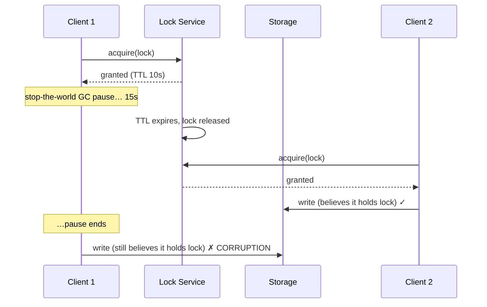

# 分散ロックとリース

> **翻訳についての注記:** 本ドキュメントは英語原文 `01-foundations/09-distributed-locks.md` を日本語に翻訳したものです。コードブロックおよびMermaidダイアグラムは原文のまま維持しています。

## TL;DR

分散ロックはマシンをまたぐ相互排他です — そしてローカルのミューテックスより本質的に弱いものです。ネットワークはメッセージを遅延させ、停止したプロセスは自分が停止していたことを知らないからです。まず、そのロックが**効率**のためのもの(重複作業の回避。まれな二重実行は許容できる)か、**正しさ**のためのもの(二重実行はデータを破壊する)かを判断してください。効率ロックはRedisの `SET NX` + TTLで十分です。正しさには、コンセンサスに裏付けられたストア(ZooKeeper、etcd)に**加えて、保護対象リソース側で検証されるフェンシングトークン**が必要です — ロックサービス単体では決して十分になりません。ロック保持者は、自分が古くなったことを知らないまま古くなりうるからです。さらに良いのは、冪等性、compare-and-swap、シングルライターのパーティショニングによってロック自体を設計から消すことです。

---

## なぜ分散ロックは難しいのか

ローカルミューテックスはOSが提供する保証に依存しています: 保持者は解放せずにロックを失うことはなく、保持者が死ねばプロセス全体が一緒に死にます。分散システムはどちらも提供しません。典型的な失敗:



クライアント1は悪意もバグもありません — 単に「ロックを保持している」と「5秒前までロックを保持していた」を区別できないだけです。プロセス停止(GC、VMマイグレーション、ページフォルト、SIGSTOP)、クロックのずれ、ネットワーク遅延のすべてがこのシナリオを生みます。保持者がロックを失ったことを*自分で知る*ことに依存する設計はすべて壊れています。保持者は最後にそれを知るのです。

### 効率 vs 正しさ

| | 効率ロック | 正しさロック |
|---|---|---|
| 目的 | 高コストな重複作業の回避 | 不変条件の破壊防止 |
| 二重実行のコスト | 無駄な計算、重複メール | データ破壊、二重決済 |
| 許容できる実装 | 単一Redisノード + TTL | コンセンサスストア + フェンシングトークン |
| より良い代替策 | 多くの場合: 重複を許容する | 多くの場合: 冪等性かシングルライター |

本番システムのロックの大半は、正しさロックの衣装を着た効率ロックです。仕組みを選ぶ前に、正直に分類してください。

---

## リース: 期限切れするロック

TTL付きのロックが**リース**です。分散環境では期限切れは必須です — それがなければ、クラッシュした保持者がシステムを永久にデッドロックさせます — が、期限切れこそが上記の「古い保持者」問題を生み出します。リースにはルールがあります:

- **早めに更新し、遅めに失効させる。** TTLの1/3で更新する。TTLはハッピーパスではなく、更新の失敗数回(ハートビートの欠落)を生き延びられるサイズにする。
- **リースだけでなく作業にも予算を。** 保持者は副作用を伴う各ステップの前に残りリース時間を確認し、不足していれば中断しなければなりません。10秒のリースは60秒のジョブを認可しません。
- **失効判断に自分のクロックを信用しない。** リースの終了を決めるのはロックサービスのクロックであり、保持者の見え方は参考情報です。保持者とサービス間のクロックスキューは安全マージンを侵食します([分散時刻](./05-distributed-time.md)参照)。

```python
class LeaseGuard:
    """Wrap side-effecting work in lease-time checks."""

    def __init__(self, lease, safety_margin_s: float = 2.0):
        self.lease = lease
        self.margin = safety_margin_s

    def checkpoint(self):
        # Called before every side-effecting step.
        remaining = self.lease.expires_at - time.monotonic()
        if remaining < self.margin:
            raise LeaseExpiring(
                f"only {remaining:.1f}s left on lease; aborting before side effects"
            )
```

これは危険な窓を狭めます。閉じることはできません — それができるのはフェンシングだけです。

---

## フェンシングトークン: みんなが省略する部分

古い保持者への対策は、**保護対象リソース側**に拒否させることです。ロックサービスは付与のたびに単調増加するトークンを発行し、リソースは見た中で最大のトークンを記憶して、それより小さいものを拒否します:

```mermaid
sequenceDiagram
    participant C1 as Client 1
    participant L as Lock Service
    participant S as Storage (checks tokens)
    participant C2 as Client 2

    C1->>L: acquire
    L-->>C1: granted, token=33
    Note over C1: long pause; lease expires
    C2->>L: acquire
    L-->>C2: granted, token=34
    C2->>S: write(token=34) ✓ (34 ≥ 34)
    C1->>S: write(token=33) ✗ rejected (33 < 34)
```

```sql
-- Resource-side fencing in SQL: one statement, no races
UPDATE jobs
SET state = 'done', result = :result, fence = :token
WHERE id = :job_id AND fence < :token;
-- 0 rows updated → you were fenced out; abort.
```

設計を変える2つの帰結:

1. **リソースが参加しなければならない。** 保護対象リソースがトークンを比較できない場合(サードパーティAPI、プリンタ、メール送信)、フェンシングは不可能であり、分散ロックはそこでの正しさを保証できません。代わりにその境界で冪等性キーが必要です([冪等性](./08-idempotency.md)参照)。
2. **トークンの発行元はフェイルオーバーをまたいで単調でなければならない** — つまりロックサービス自体にコンセンサスが必要です。ZooKeeperの `zxid`/シーケンスノードとetcdの `revision` はこれを無償で提供します。自身のフェイルオーバー後に同じエポックを二度付与しうるロックサービスは、何もフェンスしていません。

---

## 実装

### etcd

etcdは2つのプリミティブからロックを構成します: **リース**(ハートビートで維持されるTTL付きセッション)と**リビジョン**(クラスタ全体の単調カウンタ — これがフェンシングトークンです)。

```python
import etcd3

client = etcd3.client()

lease = client.lease(ttl=10)                      # session
status, _ = client.transaction(
    compare=[client.transactions.create("/locks/reindex") == 0],
    success=[client.transactions.put("/locks/reindex", my_id, lease)],
    failure=[],
)
if status:
    meta = client.get("/locks/reindex")[1]
    fencing_token = meta.mod_revision               # monotonic across failovers
    run_protected_work(fencing_token)               # pass token to the resource
```

### ZooKeeper

古典的なレシピ: ロックパスの下に**ephemeral sequential**ノードを作成し、最小のシーケンス番号がロックを保持し、他は自分の直前のノードをwatchします(ハード効果の回避)。セッション機構がリースを兼ね、シーケンス番号がフェンシングトークンを兼ねます。手作りせずCuratorの `InterProcessMutex` を使ってください — エッジケース(接続喪失 vs セッション喪失)は微妙です。これはChubbyが切り拓いた設計です([Chubby](../09-whitepapers/08-chubby.md)参照) — 「粗粒度で長期保持のロックこそ、ロックサービスが本当に得意なワークロードである」という観察も含めて。

### Redis: `SET NX` とRedlock

```
SET lock:reindex <random_token> NX PX 30000
```

解放はLuaスクリプトでランダム値を確認してから行い(自分のものなら削除)、素の `DEL` は決して使わないこと。単一Redisノードでは、これは完全に良質な**効率**ロックです: 高速・シンプル、ただしフェイルオーバーで安全性を失います(ロックを複製する前に昇格したレプリカは二重に付与します)。

**Redlock** — N台の独立したRedisノードの過半数でロックを取得する方式 — はこれを安全にするために提案されました。Kleppmannの分析は、それでも現実のシステムが破るタイミング仮定(有界なクロックドリフト、有界な停止)に依存し、フェンシングトークンを発行しないと論じています。反論はその違反の現実性を争っています。実務的な結論: この論争が問題になるのは正しさロックが必要な場合だけです — そしてその場合はフェンシング付きのコンセンサスストアを使い、論争を回避してください。効率ロックなら、単一ノードのRedisで最初から十分でした。

### ロックサービスとしてのデータベース

見落とされがちですが、参加者全員がすでに強整合なデータベースを共有しているなら、それを使ってください。Postgresのアドバイザリロック(`pg_advisory_lock`)はセッションスコープの相互排他を提供します。素朴な行に対する `SELECT ... FOR UPDATE` や、バージョン列のcompare-and-swapは、新しいインフラをゼロ追加でフェンシング相当のセマンティクスを与えます。最良のロックサービスは、しばしばすでに運用しているものです。

---

## ロックを設計から消す

すべての分散ロックは直列化ポイントです — スケーラビリティの天井であり、可用性の負債です。最強のパターンは、ロックを必要としないことです:

| ロックする代わりに… | 使うもの |
|---|---|
| 「ジョブXは1ワーカーだけが処理」 | 冪等な処理 + 完了に対するユニーク制約([冪等性](./08-idempotency.md)) |
| 「read–modify–writeをアトミックに」 | compare-and-swap / 条件付き書き込み(バージョン列、etcd txn、DynamoDB condition) |
| 「エンティティごとに1ライター」 | パーティション所有: あるキーへの書き込みを1ワーカーへルーティング([パーティショニング戦略](../02-distributed-databases/05-partitioning-strategies.md)) |
| 「スケジューラは1ノードだけが実行」 | フェンシング付きリーダー選出([リーダー選出](../02-distributed-databases/09-leader-election.md)) — 同じ機構を長期保持・可観測にしたもの |
| 「cronを二重実行しない」 | 安全に二重実行する: ジョブを冪等かつno-opが安価になるよう作る |

パーティションによるシングルライターは強調に値します: ロックの問題をルーティングの問題に変換し、水平にスケールし、より分かりやすく壊れます。Kafkaコンシューマグループ、アクターシステム、シャード所有プロトコルはすべてこのパターンです。

---

## 本番でのガイダンス

- **TTLサイズ:** 実測した最悪ケースの停止(GCログ、ハートビート間隔のp99.9)を更新が生き延びられる長さに、かつ実際のクラッシュ後のフェイルオーバーが復旧SLOを満たす短さに。10–30秒が一般的なレンジで、1秒未満のリースは偽の失効を招きます。
- 人気のロックが解放されたときのthundering herdを避けるため、**取得リトライにジッター**を([リトライ・タイムアウト・ヘッジング](../06-scaling/10-retries-timeouts-hedging.md))。
- **計測する:** ロック待ち時間、保持時間、更新失敗、フェンシング拒否。フェンシング拒否率の上昇は「古い保持者」アラームです。p99保持時間がTTLに近いロックは、嘘をつき始める寸前のリースです。
- **ロックサービスは1つに。** あるチームはRedis、別のチームはetcd、第三のチームはDB行 — では障害モードが掛け算になります。すでに運用しているコンセンサスストアに集約してください(多くの場合、Kubernetesのetcdは*正しい答えではありません* — 共有された爆発半径です。自前で運用するか、データベースを使ってください)。
- **停止をテストする。** ステージングでロック保持者にSIGSTOPを注入し、フェンシングがゾンビの書き込みを拒否することを確認する。拒否を実証できないなら、それは正しさロックではなく、願望です。

---

## トレードオフ

| 方式 | 安全性 | 活性 | 運用コスト | 用途 |
|---|---|---|---|---|
| Redis `SET NX` + TTL | 効率のみ | 優秀 | 低 | 高コスト作業の重複排除 |
| Redlock | 係争中 | 良 | 中(Nノード) | 適切な層であることは稀 |
| etcd lease + revision | 正しさ(フェンシング併用) | 良 | 中 | コーディネーション、シャード所有 |
| ZooKeeper ephemeral-seq | 正しさ(フェンシング併用) | 良 | 中〜高 | 同上; JVMエコシステム |
| DBアドバイザリ/行ロック | DB内では正しさ | DBに従属 | 追加ゼロ | 参加者がすでにDBを共有 |
| ロックなし(CAS/冪等/シングルライター) | 最良 | 最良 | 設計の手間 | 可能な限り常に |

---

## 参考文献

- [How to do distributed locking](https://martin.kleppmann.com/2016/02/08/how-to-do-distributed-locking.html) — Kleppmann; フェンシングトークンの議論
- [Is Redlock safe?](http://antirez.com/news/101) — antirezの反論; 両論を読むこと
- [The Chubby lock service](https://research.google/pubs/pub27897/) — Google; サービスとしての粗粒度ロック
- [etcd concurrency API](https://etcd.io/docs/latest/dev-guide/api_concurrency_reference_v3/) / [ZooKeeper recipes](https://zookeeper.apache.org/doc/current/recipes.html)
- [Apache Curator](https://curator.apache.org/) — 本番品質のZooKeeperロックレシピ
- *Designing Data-Intensive Applications*, ch. 8–9 — プロセス停止、フェンシング、コンセンサス
