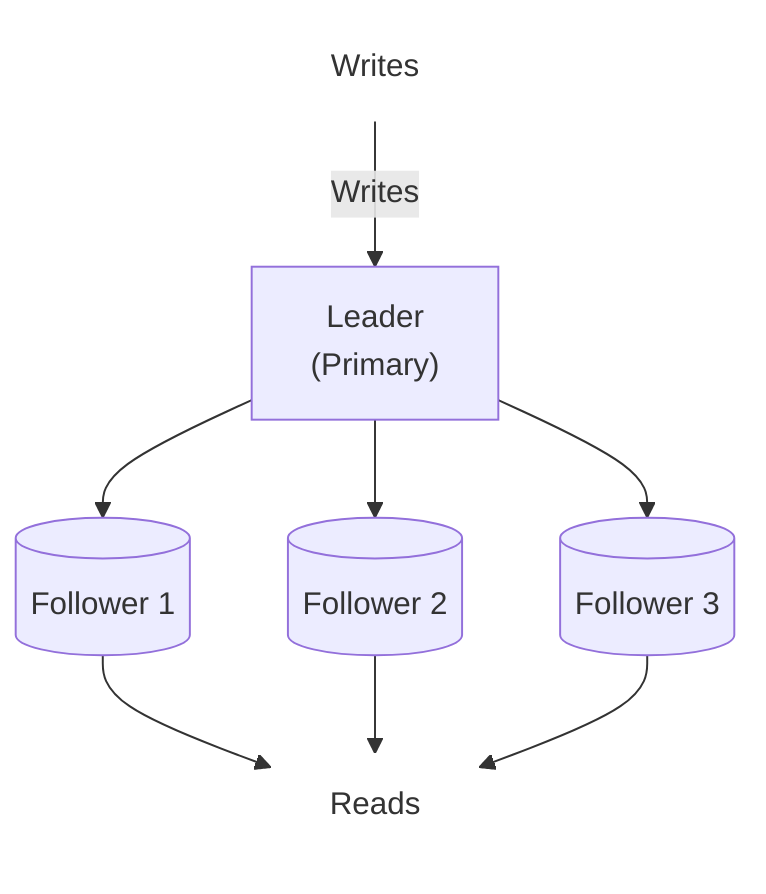
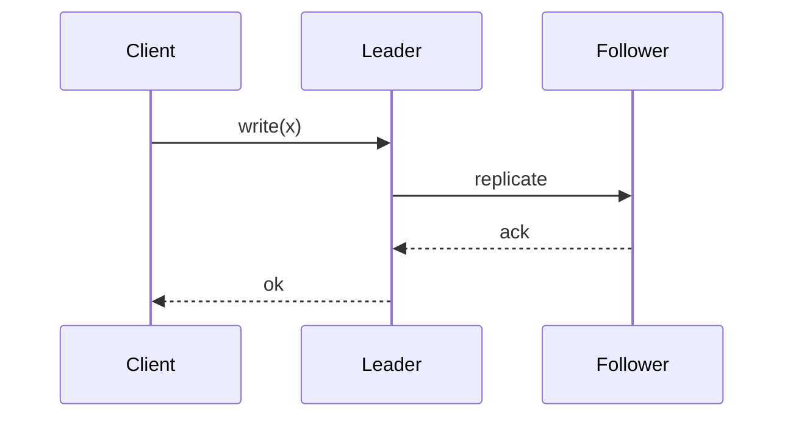
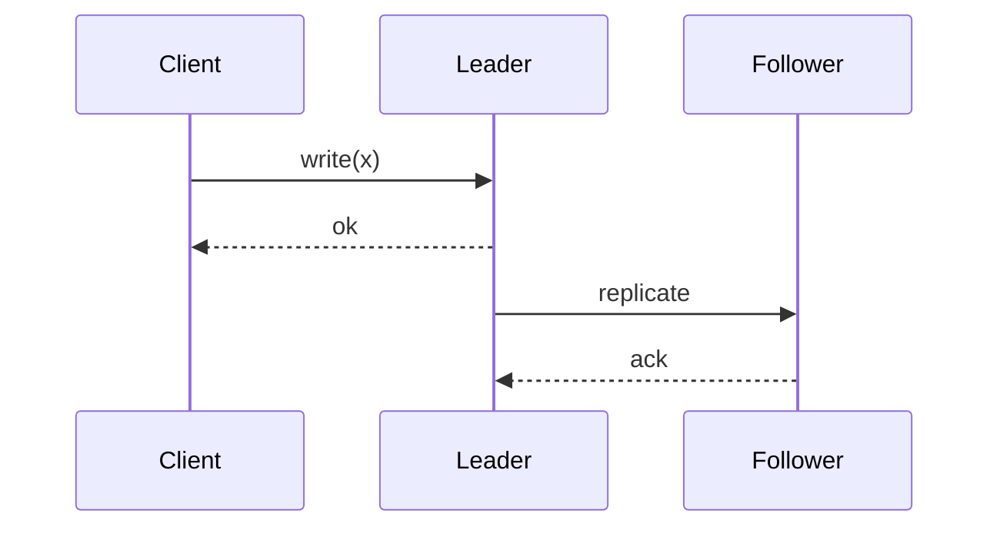
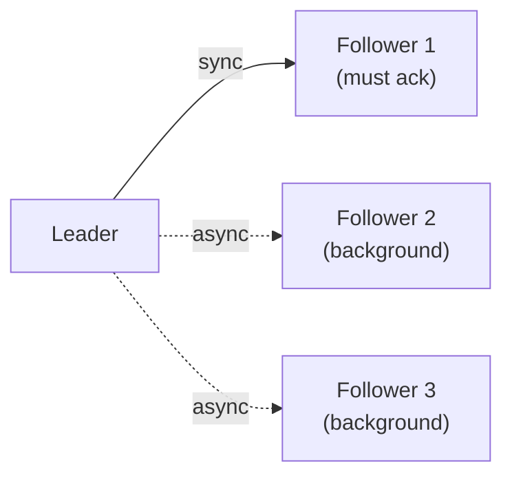
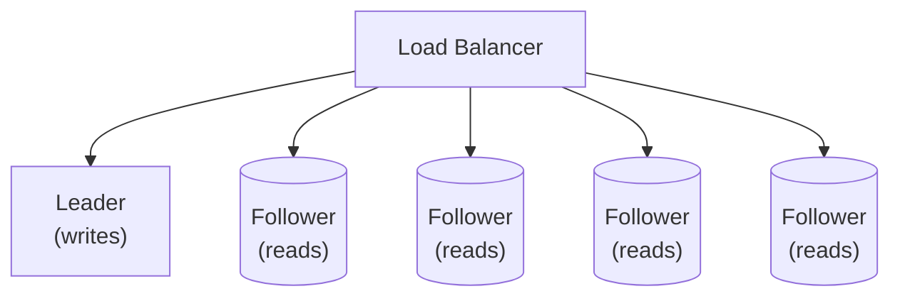
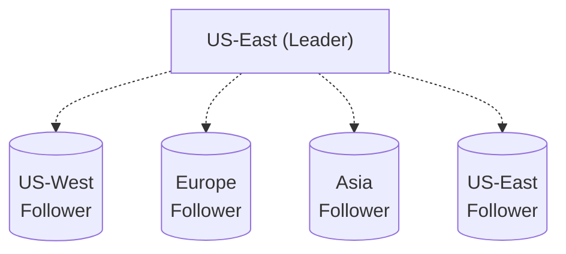
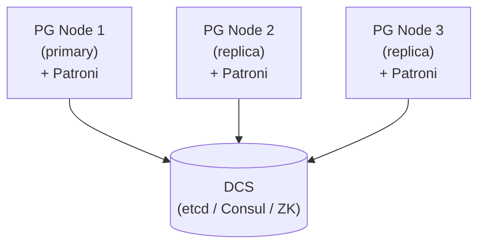
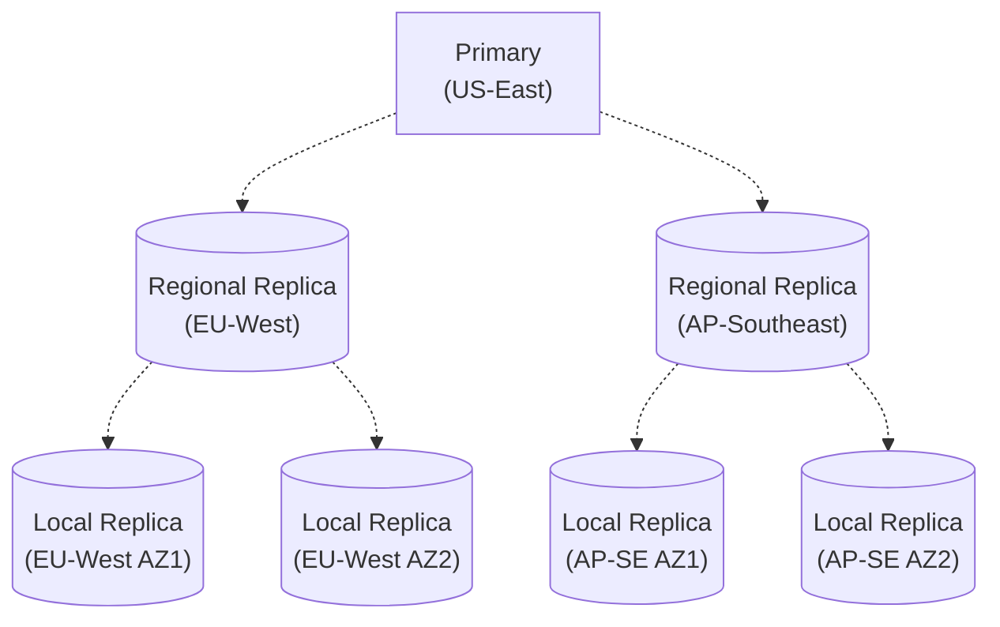

# シングルリーダーレプリケーション

> この記事は英語版から翻訳されました。最新版は[英語版](/02-distributed-databases/01-single-leader-replication.md)をご覧ください。

## TL;DR

シングルリーダー（マスター・スレーブ）レプリケーションは、すべての書き込みを1つのノード（リーダー）を通じてルーティングし、フォロワーにレプリケーションします。シンプルな一貫性保証を提供し、最も一般的なレプリケーションモデルです。トレードオフ：リーダーがボトルネックであり単一障害点となります。フェイルオーバーは複雑です。耐久性には同期レプリケーション、パフォーマンスには非同期レプリケーションを使用します。

---

## 仕組み

### 基本アーキテクチャ



### 書き込みパス

```
1. Client sends write to leader
2. Leader writes to local storage
3. Leader sends replication log to followers
4. Followers apply changes
5. (Optional) Leader waits for acknowledgment
6. Leader responds to client
```

### レプリケーションログ

リーダーはすべての変更のログを保持します：

```
Log entry:
  - Log Sequence Number (LSN): 12345
  - Operation: INSERT
  - Table: users
  - Data: {id: 1, name: "Alice"}
  - Timestamp: 2024-01-15T10:30:00Z

Followers:
  1. Fetch entries after their last known LSN
  2. Apply entries in order
  3. Update their LSN position
```

---

## 同期レプリケーション vs 非同期レプリケーション

### 同期レプリケーション

リーダーは書き込みを確認する前に、フォロワーの確認応答を待ちます。



**保証：**
- 確認応答前にデータが少なくとも2つのノードに存在します
- フォロワーは常に最新の状態です

**トレードオフ：**
- 書き込みレイテンシにレプリケーション時間が含まれます
- フォロワーの障害が書き込みをブロックします
- 通常は1つの同期フォロワーのみ（セミ同期）

### 非同期レプリケーション

リーダーは即座に確認し、バックグラウンドでレプリケーションします。



**トレードオフ：**
- 高速な書き込み（待機なし）
- リーダー障害時にデータ損失の可能性があります
- フォロワーが遅延する可能性があります

### セミ同期

1つのフォロワーが同期、他は非同期です。



**使用例：** MySQL semi-sync、PostgreSQL sync_commit

---

## レプリケーションラグ

### ラグとは

リーダーの状態とフォロワーの状態の間の時間または操作の差です。

```
Timeline:
  Leader:   [op1][op2][op3][op4][op5]
  Follower: [op1][op2][op3]
                        │
                  3 ops behind (lag)
```

### ラグの測定

```sql
-- PostgreSQL
SELECT
  client_addr,
  pg_wal_lsn_diff(pg_current_wal_lsn(), replay_lsn) as lag_bytes,
  replay_lag
FROM pg_stat_replication;

-- MySQL
SHOW SLAVE STATUS\G
-- Look at: Seconds_Behind_Master
```

### ラグの原因

| 原因 | 影響 | 対策 |
|------|------|------|
| ネットワークレイテンシ | ログ配信の遅延 | 高速なネットワーク |
| フォロワーCPU | 適用の遅延 | より良いハードウェア |
| 大規模トランザクション | 大きなログエントリ | 小さなバッチ |
| 長時間実行クエリ | 適用のブロック | クエリタイムアウト |
| フォロワーディスクI/O | 書き込みボトルネック | 高速なストレージ |

### ラグによる一貫性の問題

**Read-your-writes違反：**
```
Client writes to leader
Client reads from lagged follower
  → Doesn't see own write
```

**モノトニックリード違反：**
```
Client reads from follower A (up-to-date)
Client reads from follower B (lagged)
  → Time appears to go backward
```

**対策：**
- 自分自身のデータはリーダーから読み取ります
- スティッキーセッション（同じフォロワー）
- バージョン/タイムスタンプを含め、遅延している場合は待機します

---

## ノード障害の処理

### フォロワー障害

フォロワーがクラッシュして再起動します。

```
Recovery:
1. Check last applied LSN in local storage
2. Request log entries from leader starting at LSN
3. Apply entries sequentially
4. Resume normal replication
```

### リーダー障害（フェイルオーバー）

リーダーがクラッシュした場合、フォロワーを昇格させる必要があります。

```
Steps:
1. Detect leader failure (timeout)
2. Choose new leader (most up-to-date follower)
3. Reconfigure followers to replicate from new leader
4. Redirect clients to new leader
5. (If old leader recovers) Demote to follower
```

### フェイルオーバーの課題

**障害の検出：**
```
Is leader dead or just slow?

Too aggressive: false positive, unnecessary failover
Too conservative: extended downtime

Typical: 10-30 second timeout
```

**新しいリーダーの選択：**
```
Options:
1. Most up-to-date follower (least data loss)
2. Pre-designated standby
3. Consensus among followers (Raft-style)
```

**書き込みの消失：**
```
Leader had commits not yet replicated:
  - Lost when new leader takes over
  - May cause conflicts if old leader recovers

Prevention:
  - Sync replication (at least 1 copy)
  - Don't ack until replicated
```

**スプリットブレイン：**
```
Old leader comes back, doesn't know it's demoted:
  Two nodes accept writes!

Prevention:
  - Fencing tokens
  - STONITH (kill old leader)
  - Epoch numbers
```

---

## 読み取りスケーリング

### フォロワーからの読み取り

読み取り負荷をフォロワーに分散します。



### 読み取りスケーリングの計算

```
Before scaling:
  Leader: 10,000 reads/sec, 1,000 writes/sec
  Bottleneck: Leader saturated

After adding 4 followers:
  Leader: 1,000 writes/sec (writes only)
  Followers: 2,500 reads/sec each
  Total reads: 10,000 reads/sec

Reads scale linearly with followers
Writes still limited to single leader
```

### 地理分散

フォロワーを異なるリージョンに配置します。



ユーザーは最も近いフォロワーから読み取ります。書き込みはリーダーに送られます（遠方のユーザーにとってはレイテンシが高くなります）。

---

## ステートメントベース vs 行ベースレプリケーション

### ステートメントベース

SQL文をレプリケーションします。

```
Leader executes: INSERT INTO users VALUES (1, 'Alice')
Sends to followers: "INSERT INTO users VALUES (1, 'Alice')"
Followers execute same statement
```

**問題点：**
- 非決定的関数：`NOW()`、`RAND()`、`UUID()`
- トリガー、ストアドプロシージャが異なる動作をする可能性があります
- 順序依存のステートメント

### 行ベース（論理）

実際の行変更をレプリケーションします。

```
Leader executes: INSERT INTO users VALUES (1, 'Alice')
Sends to followers: {table: users, type: INSERT, row: {id:1, name:'Alice'}}
Followers apply row change
```

**利点：**
- 決定的
- あらゆるステートメントで動作します
- CDC（Change Data Capture）を有効にします

**トレードオフ：**
- バルク更新では大きなログになります
- 人間が読みにくくなります

### 混合モード

安全な場合はステートメントベース、それ以外は行ベースを使用します。

```
Simple INSERT → Statement-based (compact)
Statement with NOW() → Row-based (deterministic)
```

---

## 実装例

### PostgreSQLストリーミングレプリケーション

```sql
-- Primary postgresql.conf
wal_level = replica
max_wal_senders = 10
synchronous_commit = on  -- or 'remote_apply'
synchronous_standby_names = 'follower1'

-- Replica recovery.conf (or standby.signal in PG12+)
primary_conninfo = 'host=primary port=5432 user=replicator'
recovery_target_timeline = 'latest'
```

### MySQLレプリケーション

```sql
-- Leader
server-id = 1
log_bin = mysql-bin
binlog_format = ROW

-- Follower
server-id = 2
relay_log = relay-bin
read_only = ON

CHANGE MASTER TO
  MASTER_HOST = 'leader',
  MASTER_USER = 'replicator',
  MASTER_AUTO_POSITION = 1;
START SLAVE;
```

---

## モニタリング

### 主要メトリクス

| メトリクス | 表示内容 | アラート閾値 |
|-----------|---------|-------------|
| レプリケーションラグ | フォロワーのリーダーからの遅延 | > 30秒 |
| ログ位置差分 | 遅延バイト数 | > 100 MB |
| フォロワーの状態 | 接続済み/切断 | ストリーミングしていない |
| 適用レート | ログエントリ/秒 | 低下中 |
| ディスク使用量 | ログ蓄積量 | > 80% |

### ヘルスチェック

```python
def check_replication_health():
  leader_lsn = query_leader("SELECT pg_current_wal_lsn()")

  for follower in followers:
    follower_lsn = query_follower("SELECT pg_last_wal_replay_lsn()")
    lag = leader_lsn - follower_lsn

    if lag > threshold:
      alert(f"Follower {follower} lagging: {lag} bytes")

    if not follower.is_streaming:
      alert(f"Follower {follower} not connected")
```

---

## シングルリーダーを使用すべきケース

### 適しているケース

- 読み取りが多く書き込みが少ない（読み取り重視のワークロード）
- 強い一貫性が必要な場合
- シンプルな運用モデルが望ましい場合
- 地理的な読み取り分散
- 従来のOLTPアプリケーション

### 適していないケース

- 書き込み重視のワークロード（リーダーがボトルネック）
- マルチリージョンでの書き込み（リーダーへのレイテンシ）
- ゼロダウンタイム要件（フェイルオーバーウィンドウ）
- 複数拠点からの競合する書き込み

---

## PostgreSQLストリーミングレプリケーションの内部構造

### WAL SenderとReceiver

プライマリは接続されたレプリカごとに1つの**WAL sender**プロセスを生成します。各WAL senderはWrite-Ahead Logから読み取り、PostgreSQLのレプリケーションプロトコル（`replication`モードのlibpq接続）を介してレコードをストリーミングします。レプリカ側では、**WAL receiver**プロセスがストリームを受信し、レプリカのローカルWALファイルにレコードを書き込み、スタートアッププロセスに渡してデータファイルへのリプレイを行います。

```mermaid
graph LR
    subgraph Primary
        WS["WAL Sender<br/>(per replica)"]
        WAL[("WAL<br/>Segments")]
        WAL -->|reads| WS
    end
    subgraph Replica
        WR["WAL Receiver"]
        LocalWAL[("Local WAL<br/>+ Startup Replay")]
        WR -->|writes to| LocalWAL
    end
    WS -->|replication protocol<br/>(streaming walsender)| WR
```

これはプッシュベースのモデルです。プライマリはWALを生成時にプッシュします。レプリカはポーリングしません。レプリカが遅延した場合、WAL senderは保持されたWALセグメントからキャッチアップします。

### 物理レプリケーションスロット vs 論理レプリケーションスロット

**物理レプリケーションスロット**はWALのバイト単位のコピーを配信します。レプリカはそれを同一に適用し、プライマリの正確なバイナリクローンを生成します。これはホットスタンバイレプリカの標準的なメカニズムです。

**論理レプリケーションスロット**は出力プラグイン（例：`pgoutput`）を使用してWALを論理的な変更イベント（INSERT、UPDATE、DELETE）にデコードします。これにより以下が可能になります：
- 選択的なテーブルレプリケーション（全テーブルか無しかではない）
- サブスクライバーとパブリッシャーで独立したスキーマ進化
- クロスバージョンレプリケーション（例：PG 14 → PG 16のアップグレード）
- CDCパイプラインへの供給（Debeziumなど）

物理スロットはよりシンプルでオーバーヘッドが低くなります。論理スロットはより柔軟ですが、デコードのためにCPUコストが高くなります。

### レプリケーションスロットのモニタリング

```sql
SELECT slot_name, slot_type, active,
       restart_lsn, confirmed_flush_lsn,
       pg_wal_lsn_diff(pg_current_wal_lsn(), restart_lsn) AS retained_bytes
FROM pg_replication_slots;
```

主要フィールド：
- `active`：コンシューマーが接続しているかどうか。非アクティブなスロットは危険ゾーンです。
- `restart_lsn`：スロットがプライマリに保持を強制する最も古いWAL位置です。
- `confirmed_flush_lsn`：（論理スロット）コンシューマーが処理を確認した位置です。
- `retained_bytes`：保持されているWALの量です。これが際限なく増加する場合、問題があります。

### スロット肥大化の障害モード

コンシューマーが切断された場合（レプリカダウン、Debeziumのクラッシュ、ネットワークパーティション）、スロットは**WALのリサイクルを防止**します。プライマリはディスクがいっぱいになるまでWALセグメントを無制限に蓄積し、その時点でプライマリ自体がクラッシュし、すべてのクライアントの書き込みが停止します。

以下でモニタリングします：
```sql
SELECT slot_name,
       pg_size_pretty(pg_wal_lsn_diff(pg_current_wal_lsn(), restart_lsn)) AS retained_wal
FROM pg_replication_slots
WHERE NOT active;
```

`retained_wal`が閾値（例：10 GB）を超えた場合にアラートを出します。対処法：`pg_drop_replication_slot('slot_name')`で孤立したスロットを削除し、コンシューマーを再プロビジョニングします。

### `wal_keep_size` vs レプリケーションスロット

- `wal_keep_size`（旧`wal_keep_segments`）：**ヒント**です。少なくともこの量のWALを保持しますが、フォロワーがそれ以上遅延している場合、キャッチアップに失敗し、フルベースバックアップが必要になります。
- レプリケーションスロット：**保証**です。スロットの`restart_lsn`を超えてWALがリサイクルされることはないため、フォロワーは常にキャッチアップできます。ただし、この保証によりディスクがいっぱいになる可能性があります。

ベストプラクティス：信頼性のためにレプリケーションスロットを使用しますが、モニタリングと非アクティブなコンシューマーの自動スロットクリーンアップを組み合わせます。

---

## フェイルオーバーの自動化

### Patroni

**Patroni**はPostgreSQLのHAにおける事実上の標準です。そのアーキテクチャは以下のとおりです：



各Patroniエージェントは、TTL（通常30秒）付きでDCSに**リーダーロック**を保持します。プライマリは期限前にロックを更新しなければリーダーシップを失います。

### 計画的スイッチオーバー vs 計画外フェイルオーバー

**`patronictl switchover`**（計画的）：
1. オペレーターがターゲットレプリカを選択します
2. Patroniがプライマリをチェックポイントし、ターゲットがキャッチアップするのを待ちます
3. 旧プライマリを降格します（PGをシャットダウンまたは読み取り専用にします）
4. ターゲットレプリカを昇格します
5. 他のレプリカが新しいプライマリに従うよう再構成します
6. データ損失はほぼゼロ、通常合計5秒未満

**`patronictl failover`** / 自動フェイルオーバー（計画外）：
1. プライマリがDCSリーダーロックの更新に失敗します（検出時間 = TTL）
2. レプリカ上のPatroniエージェントがロックの取得を競います
3. 勝者はレプリケーションラグが最も少ないレプリカです
4. 勝者が自身を昇格し、他のレプリカが追従します
5. 典型的な合計時間：10〜30秒（検出 + 昇格 + ルーティング）

### 代替ツール

| ツール | データベース | DCS必要 | フェンシング |
|--------|-----------|---------|------------|
| Patroni | PostgreSQL | はい（etcd/Consul/ZK） | Watchdog + DCSリース |
| repmgr | PostgreSQL | いいえ | SSHベース（信頼性が低い） |
| Orchestrator | MySQL | いいえ（独自のraftまたはDBバックエンドを使用） | フックベース |
| ProxySQL | MySQL | いいえ | ルーティング層のみ（フェンシングなし） |
| Group Replication | MySQL | いいえ（組み込みPaxos） | コンセンサスベース |

**repmgr**はセットアップが簡単ですが、DCS統合がありません。旧プライマリのフェンシングにSSHに依存しており、ネットワークが分断された場合（まさにフェンシングが最も必要な時）に失敗します。

### 主要メトリクス

```
failover_time = detection_time + promotion_time + routing_update_time
```

Patroniの場合：通常10〜30秒です。検出フェーズ（DCSリースの期限切れ）が支配的です。昇格自体は高速です（5秒未満）。ルーティング更新はプロキシ層（HAProxy、PgBouncer、DNS TTL）に依存します。

---

## スプリットブレイン防止の詳細

### タイムアウトベースの検出が失敗する理由

タイムアウトはプライマリが応答を停止した時に発火します。しかし「応答しない」≠「停止」です：
- JVM/CLR GCポーズ（10秒以上のストップ・ザ・ワールド）
- ディスクI/Oストール（RAIDリビルド、SANの問題）
- ネットワークパーティション（プライマリは正常だがアクセス不能）
- CPU飽和（プライマリは稼働中だが遅い）

すべてのケースで、プライマリはまだ稼働しており書き込みを受け入れている可能性があります。レプリカが自身を昇格させた場合、**2つのプライマリ**が存在します — スプリットブレインです。

### フェンシングトークン

ロックサービス（ZooKeeper、etcd）は各ロック取得時に**単調増加するトークン**を発行します。ストレージ層へのすべての書き込みにはトークンを含める必要があります。ストレージは、見た中で最も高いトークンより低いトークンの書き込みを拒否します。

```
Lock service issues token 33 → Old primary writes with token 33
Old primary loses lock
Lock service issues token 34 → New primary writes with token 34
Old primary tries to write with token 33 → REJECTED (33 < 34)
```

これにはストレージ層がプロトコルに参加する必要があります。すべてのシステムがサポートしているわけではありませんが、理論的に正しいソリューションです（Martin KleppmannのRedlock批評を参照）。

### STONITH（Shoot The Other Node In The Head）

物理フェンシング：IPMI/BMCコマンドを送信して旧プライマリのハードウェアを**電源オフ**にします。ノードがオフであれば書き込みを受け入れることはできません。粗暴ですが効果的です。

使用例：Pacemaker/Corosyncクラスタ、BMCアクセスのあるエンタープライズHAセットアップ。クラウド環境では利用できません（代わりにクラウドネイティブフェンシングを使用します — 例：AWSの`stop-instances` API）。

### PatroniのWatchdog

Patroniはカーネルの**watchdog**（`/dev/watchdog`）を登録できます。Patroniは定期的にwatchdogにpingします。Patroniがクラッシュまたはハングした場合（DCSロックを更新できない場合）、watchdogは数秒以内に**ノード全体を再起動**します。これにより、PGプロセスはまだ稼働しているがPatroniが管理していないゾンビプライマリのシナリオを防ぎます。

設定：Patroni設定で`watchdog.mode: required`を設定します。watchdogタイムアウトはDCS TTLより短くする必要があります。

### PostgreSQLのタイムラインメカニズム

フェイルオーバー後、新しいプライマリは**新しいタイムライン**を開始します（タイムラインIDが増加します）。レプリカは昇格したプライマリに追従するために`recovery_target_timeline = 'latest'`で設定する必要があります。レプリカが古いタイムラインに留まっている場合、分岐してpg_rewindまたは新しいベースバックアップが必要になります。

---

## レプリケーションラグの詳細

### PostgreSQL `pg_stat_replication`のラグフィールド

```sql
SELECT client_addr, application_name,
       write_lag, flush_lag, replay_lag
FROM pg_stat_replication;
```

これら3つのフィールドはバイトオフセットではなく**時間間隔**を表します：

| フィールド | 測定内容 | 意味 |
|-----------|---------|------|
| `write_lag` | プライマリがWALを送信 → レプリカのOSがディスクバッファへの書き込みを確認 | ネットワーク + カーネルバッファ遅延 |
| `flush_lag` | プライマリがWALを送信 → レプリカがWALをディスクにfsync | ネットワーク + ディスク耐久性遅延 |
| `replay_lag` | プライマリがWALを送信 → レプリカがWALをデータファイルに適用 | 適用を含む完全なエンドツーエンド遅延 |

### アラート対象

- **`replay_lag`**（クエリの一貫性向け）：レプリカから読み取る場合、これが読み取りの古さを示します。
- **`flush_lag`**（耐久性向け）：今プライマリが停止した場合、`flush_lag`前までのWALはレプリカのディスクに安全に存在します。`flush_lag`と`write_lag`の間はレプリカのOSバッファにあり、レプリカもクラッシュした場合に失われる可能性があります。

### 推奨閾値

| 閾値 | アクション | 根拠 |
|------|----------|------|
| `replay_lag` > 100ms | 警告 | 読み取りクエリが古いデータを返す可能性があります |
| `replay_lag` > 1s | ページ | このレプリカへのフェイルオーバーは1秒のデータを失います |
| `replay_lag` > 10s | 重大 | レプリカが遅延しています。適用のボトルネックを調査してください |
| `flush_lag` > 5s | ページ | 耐久性保証が低下しています |

### MySQLとの比較

MySQLの`Seconds_Behind_Master`はより粗い単一のメトリクスです。SQLスレッドがリレーログイベントを適用する際の、イベントに埋め込まれたタイムスタンプと現在時刻の差を測定します。制限事項：
- 粒度が1秒（PostgreSQLのフィールドはサブミリ秒）
- write/flush/replayフェーズを区別しません
- I/Oスレッドが切断されていても0を報告する場合があります（誤解を招く）
- プライマリとレプリカ間のクロックスキューの影響を受けます

---

## カスケードレプリケーション

### トポロジー



### ユースケース

プライマリのWAL senderに過負荷をかけないクロスリージョンレプリケーションです。プライマリへの6つの直接接続の代わりに、2つのリージョン接続があります。リージョンレプリカがローカルにファンアウトします。

### 設定

PostgreSQLでは、カスケードレプリカの`primary_conninfo`をプライマリではなくリージョンレプリカを指すように設定します：

```ini
# Local replica in EU-West AZ1
primary_conninfo = 'host=eu-west-regional port=5432 user=replicator'
```

リージョンレプリカにはプライマリと同様に`wal_level = replica`と`max_wal_senders`を設定する必要があります。

### トレードオフ

- **ラグが蓄積します**：プライマリ → リージョン = 50ms、リージョン → ローカル = 50ms → 合計 = 約100ms
- **単一障害点**：リージョンレプリカが障害を起こすと、すべての下流レプリカがレプリケーションを失います
- **対策**：各下流レプリカはプライマリに直接接続するよう**再構成可能**であるべきです。Patroniはこれを自動的に処理します。Patroniなしの場合、オペレーターランブックまたは自動化が必要です。

---

## セミ同期のサイレントダウングレード

### 問題

MySQLのセミ同期レプリケーションには`rpl_semi_sync_master_timeout`パラメータ（デフォルト：**10秒**）があります。このタイムアウト内にレプリカが確認応答しない場合、MySQLは**暗黙的に非同期レプリケーションにフォールバック**します。警告をログに記録しますが、書き込みの受け入れを続けます。

これは以下を意味します：
1. 耐久性を期待してセミ同期を設定しました
2. レプリカがダウンしたか、低速になりました
3. 10秒後、MySQLは**クライアントエラーなしに**非同期に切り替わりました
4. データ損失ウィンドウが開きました — 書き込みはプライマリにのみ存在します
5. プライマリがクラッシュした場合、それらの書き込みは失われます

### 検出

MySQLのステータス変数を監視します：
```sql
SHOW STATUS LIKE 'Rpl_semi_sync_master_status';
-- ON = semi-sync active
-- OFF = silently fell back to async
```

これがOFFに切り替わったら即座にアラートを出します。また`Rpl_semi_sync_master_no_tx`（非同期にフォールバックしたコミット数）も監視します。

### 対策オプション

| 戦略 | 動作 | リスク |
|------|------|-------|
| タイムアウトを非常に高く設定（例：`3600000` ms） | レプリカが復帰するまで書き込みがブロック | レプリカ障害時の書き込みダウンタイム延長 |
| ダウングレードを受け入れる | セミ同期は「ベストエフォート」 | サイレントなデータ損失ウィンドウ |
| Group Replication（MySQL）を使用 | 真のコンセンサス（Paxosベース） | 書き込みレイテンシ増加、運用の複雑さ増加 |
| 同期レプリカを追加 | タイムアウトが発火しにくくなる | インフラコストの増加 |

### PostgreSQLとの比較

PostgreSQLはこれを**デフォルトでより安全に**処理します。`synchronous_commit = on`と`synchronous_standby_names`が設定されている場合：
- すべての名前付き同期レプリカがダウンした場合、**書き込みがブロック**されます — 暗黙的に非同期にフォールバックしません
- プライマリは同期レプリカが復帰するまで無期限に待機します
- これにより暗黙的なデータ損失は防止されますが、書き込み可用性の問題が発生する可能性があります

`synchronous_standby_names = 'ANY 1 (replica1, replica2, replica3)'`と設定することで、3つのレプリカのうちいずれか1つが確認応答すれば書き込みが成功します。これにより耐久性と可用性のバランスが取れます。

MySQLのような動作を選択する（非同期フォールバックを受け入れる）には、`synchronous_commit = local`を設定します — ただし、これはサイレントなダウングレードではなく明示的な選択です。

---

## 主要なポイント

1. **すべての書き込みはリーダーを経由** - シンプルな一貫性、単一障害点
2. **同期レプリケーションは安全性のため** - レイテンシと可用性のコストあり
3. **非同期はパフォーマンスのため** - 潜在的なデータ損失を受け入れます
4. **レプリケーションラグは不可避** - それを処理できるよう読み取りを設計します
5. **フェイルオーバーは複雑** - スプリットブレイン、データ損失、クライアントリダイレクト
6. **フォロワーで読み取りをスケール** - 書き込みはスケールしません
7. **行ベースレプリケーションがより安全** - 決定的、CDCを有効にします
8. **ラグを継続的にモニタリング** - 問題の早期警告
