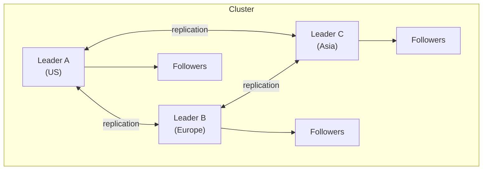
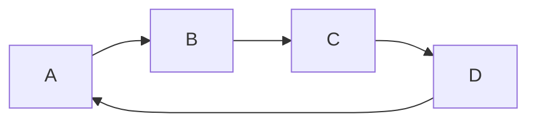
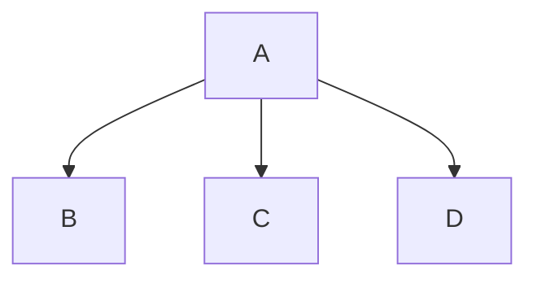
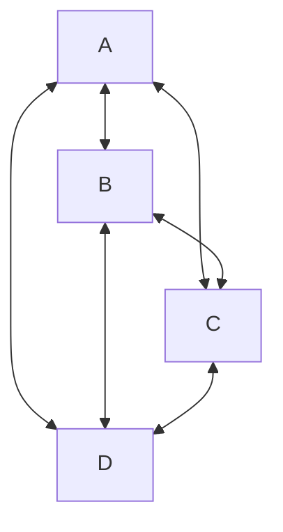
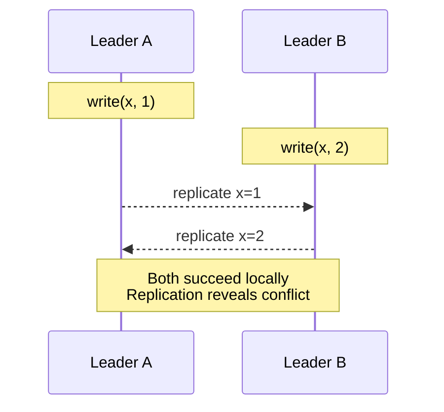

# マルチリーダーレプリケーション

> この記事は英語版から翻訳されました。最新版は[英語版](/02-distributed-databases/02-multi-leader-replication.md)をご覧ください。

## TL;DR

マルチリーダー（マスター・マスター）レプリケーションは、複数のノードでの書き込みを可能にし、各ノードが他のノードにレプリケーションします。任意のロケーションからの低レイテンシ書き込みを実現し、データセンター障害に耐えることができます。その代償として、書き込みの競合が発生する可能性があり、解決する必要があります。マルチリージョンでの書き込みや高い書き込み可用性が必要な場合に使用し、強い一貫性が必要な場合は避けてください。

---

## 仕組み

### アーキテクチャ



クライアントは最も近いリーダーに書き込みます。

### 書き込みフロー

```
1. Client in Europe writes to Leader B
2. Leader B accepts write, responds to client
3. Leader B asynchronously replicates to A and C
4. Leaders A and C apply the change

Write succeeds without waiting for cross-datacenter round-trip
```

### レプリケーショントポロジー

**循環型：**


各ノードが次のノードにレプリケーションします。障害でリングが途切れます。

**スター型（ハブアンドスポーク）：**


中央ハブが調整します。ハブの障害は致命的です。

**全対全（All-to-All）：**


最も回復力がありますが、競合がより複雑になります。

---

## ユースケース

### マルチデータセンター運用

```
US Datacenter:
  - Users write locally
  - <10ms write latency
  - Survives Europe/Asia outage

Europe Datacenter:
  - Users write locally
  - <10ms write latency
  - Survives US/Asia outage

Cross-DC replication: 100-200ms (async)
```

### 共同編集

```
User A (laptop): types "Hello"
User B (phone): types "World" (same document, same position)

Both succeed locally
Conflict resolution determines final state
```

### オフラインクライアント

```
Mobile app (disconnected):
  Write changes locally (local leader)
  Queue for sync

When connected:
  Sync with server
  Resolve conflicts

Each device is essentially a leader
```

---

## 競合の処理

### 競合が発生するケース



### 競合の種類

**書き込み-書き込み競合：**
同じフィールドが異なる値に更新されます。
```
Leader A: user.email = "a@example.com"
Leader B: user.email = "b@example.com"
```

**削除-更新競合：**
一方が削除し、もう一方が更新します。
```
Leader A: DELETE user WHERE id=1
Leader B: UPDATE user SET name='Bob' WHERE id=1
```

**ユニーク制約違反：**
両方が同じユニーク値でレコードを作成します。
```
Leader A: INSERT (id=auto, email='x@y.com')
Leader B: INSERT (id=auto, email='x@y.com')
```

### 競合の回避

関連する書き込みを同じリーダーにルーティングして競合を防止します。

```
Strategy: All writes for a user go to their "home" datacenter

User 123 → always Leader A
User 456 → always Leader B

Conflicts impossible for per-user data
Cross-user operations may still conflict
```

---

## 競合解決戦略

### Last-Writer-Wins（LWW）

最も高いタイムスタンプが勝ちます。他の書き込みは破棄されます。

```
Write at A: {value: 1, timestamp: 100}
Write at B: {value: 2, timestamp: 105}

Resolution: value = 2 (higher timestamp)

Problem: Write at A is silently lost
Problem: Clock skew can choose "wrong" winner
```

### 値のマージ

競合する値を結合します。

```
Shopping cart at A: [item1, item2]
Shopping cart at B: [item1, item3]

Merge: [item1, item2, item3]
```

### カスタム解決

アプリケーション固有のロジックです。

```
// For document editing
func resolve_conflict(version_a, version_b):
  merged = three_way_merge(base, version_a, version_b)
  if has_semantic_conflict(merged):
    return create_conflict_marker(version_a, version_b)
  return merged
```

### アプリケーションレベルの解決

すべてのバージョンを保存し、ユーザーに決定させます。

```
Read returns: {
  versions: [
    {value: "Alice", timestamp: 100, origin: "A"},
    {value: "Bob", timestamp: 105, origin: "B"}
  ],
  conflict: true
}

UI: "Multiple versions found. Which is correct?"
```

### CRDT

CRDT（Conflict-free Replicated Data Types、競合フリーレプリケーションデータ型）は、数学的に収束が保証されています。

```
G-Counter (grow-only counter):
  Node A: {A: 5, B: 3}
  Node B: {A: 4, B: 7}

  Merge: {A: max(5,4), B: max(3,7)} = {A: 5, B: 7}
  Total: 12

  Always converges, never conflicts
```

---

## 因果関係の処理

### 問題

因果関係を追跡しないと、操作が間違った順序で適用される可能性があります。

```
User 1 at Leader A:
  1. INSERT message(id=1, text="Hello")
  2. INSERT message(id=2, text="World", reply_to=1)

Replication to Leader B might arrive:
  Message 2 arrives before Message 1
  reply_to=1 references non-existent message
```

### バージョンベクター

リーダー間の因果関係を追跡します。

```
Version vector: {A: 3, B: 5, C: 2}

Meaning:
  - Seen 3 operations from A
  - Seen 5 operations from B
  - Seen 2 operations from C

Comparing:
  {A:3, B:5} vs {A:4, B:4}
  Neither dominates → concurrent, potential conflict
```

### 因果関係の検出

```
Write at A: attached vector {A:10, B:5, C:7}
Write at B: attached vector {A:10, B:6, C:7}

A's write precedes B's?
  Check if A's vector ≤ B's vector
  {A:10, B:5, C:7} ≤ {A:10, B:6, C:7}?
  Yes: A ≤ B in all components

Apply A's write before B's
```

---

## レプリケーションラグと順序

### 因果関係の異常

```
Leader A: User posts message (seq 1)
Leader B: User edits profile (seq 1)

Without ordering:
  Follower might see edit before message
  Or message before edit

With logical clocks:
  Total order preserved across leaders
```

### 競合しない操作

並行しても競合しない操作もあります：

```
Concurrent but safe:
  Leader A: UPDATE users SET last_login = now() WHERE id = 1
  Leader B: UPDATE users SET email_count = email_count + 1 WHERE id = 1

Different columns → merge both changes
```

---

## 実装における考慮事項

### 主キーの生成

自動インクリメントIDでの競合を回避します。

```
Strategy 1: Range allocation
  Leader A: IDs 1-1000000
  Leader B: IDs 1000001-2000000

Strategy 2: Composite keys
  ID = (leader_id, sequence_number)

Strategy 3: UUIDs
  Globally unique, no coordination needed
```

### ユニーク制約

リーダー間でユニークなメールアドレスをどう確保するか？

```
Option 1: Check before write (racy)
  Check locally → might conflict with other leader

Option 2: Conflict detection
  Accept write, detect duplicate on sync
  Application handles de-duplication

Option 3: Deterministic routing
  All writes for email domain → specific leader
```

### 外部キー制約

クロスリーダーのFK強制は困難です。

```
Leader A: INSERT order (user_id = 123)
Leader B: DELETE user WHERE id = 123 (concurrent)

Results:
  Order references non-existent user

Solutions:
  - Soft deletes
  - Application-level referential integrity
  - Accept inconsistency, repair later
```

---

## 実際のシステム

### CouchDB

```
// Writes go to any node
PUT /db/doc123
{
  "_id": "doc123",
  "_rev": "1-abc123",
  "name": "Alice"
}

// Conflict detection on sync
GET /db/doc123?conflicts=true
{
  "_id": "doc123",
  "_rev": "2-def456",
  "_conflicts": ["2-xyz789"],
  "name": "Alice Smith"
}

// Application resolves by deleting losing revisions
```

### MySQL Group Replication

```sql
-- Enable multi-primary mode
SET GLOBAL group_replication_single_primary_mode = OFF;

-- All members accept writes
-- Certification-based conflict detection
-- Conflicting transactions rolled back on one node
```

### Galera Cluster

```
wsrep_provider = /usr/lib/galera/libgalera_smm.so
wsrep_cluster_address = gcomm://node1,node2,node3

-- Synchronous replication with certification
-- Conflicts detected before commit
-- "Optimistic locking" - most transactions succeed
```

---

## マルチリーダーのモニタリング

### 主要メトリクス

| メトリクス | 説明 | アラート閾値 |
|-----------|------|-------------|
| レプリケーションラグ | 他のリーダーからの遅延時間 | > 1分 |
| 競合レート | 競合/秒 | 増加傾向 |
| 競合解決時間 | 解決にかかる時間 | > 1秒平均 |
| クロスDCレイテンシ | レプリケーションRTT | > 500ms |
| キュー深度 | 保留中のレプリケーション操作 | 増加中 |

### ヘルスチェック

```python
def check_multi_leader_health():
  for leader in leaders:
    for other in leaders:
      if leader == other:
        continue

      # Check replication is flowing
      lag = get_replication_lag(leader, other)
      if lag > threshold:
        alert(f"{leader} → {other} lag: {lag}")

      # Check connectivity
      if not can_connect(leader, other):
        alert(f"{leader} cannot reach {other}")
```

---

## マルチリーダーを使用すべきケース

### 適しているケース

- ローカル書き込みを伴うマルチデータセンターデプロイメント
- オフラインファーストアプリケーション
- 共同編集
- 高い書き込み可用性が必要な場合
- 結果整合性を許容できる場合

### 適していないケース

- 強い一貫性が必要な場合
- データセンター間の複雑なトランザクション
- 低い競合許容度
- シンプルな単一リージョンデプロイメント
- 競合解決を処理できないアプリケーション

---

## 競合検出のタイミング

競合を検出するタイミングの選択が、マルチリーダーシステムの基本的な性質を決定します。2つのアプローチがあり、選択は実質的に決まっています。

### 同期検出

書き込み時に他のリーダーと調整して競合を検出します。

```
Client → Leader A: write(x, 1)
Leader A → Leader B: "I'm about to write x, any conflicts?"
Leader B → Leader A: "No conflict" (or "Conflict — reject")
Leader A → Client: "Write accepted"

Round-trip cost: cross-datacenter latency added to every write
```

このアプローチは、シングルリーダーレプリケーションと同じクロスリーダー通信を必要とします。Leader Bにアクセスできない場合、Leader Aはブロックする（可用性を失う）か、チェックなしで進行する（保証を失う）必要があります。余分な手順を踏んだシングルリーダーレプリケーションを再発明したことになります。

### 非同期検出

書き込みを即座に受け入れ、レプリケーションが他のリーダーに書き込みを配信した時に競合を検出します。

```
Client → Leader A: write(x, 1)       ← returns immediately
Leader A → Leader B: replicate(x, 1) ← happens later
Leader B: detects conflict with local write(x, 2)
Leader B: applies resolution strategy
```

これが標準的なアプローチです。書き込みはローカルリーダーにのみ触れるため高速です。競合は後から — クロスリージョンの設定では数秒から数分後に — 表面化し、事後に解決されます。

### 根本的なトレードオフ

```
Synchronous:  Strong consistency + high write latency + reduced availability
Asynchronous: Eventual consistency + low write latency  + high availability
```

ほとんどのマルチリーダーシステムは非同期検出を選択します。なぜなら、レイテンシこそがマルチリーダーを選択した理由だからです。すべての書き込みでデータセンター間のラウンドトリップを許容できるのであれば、シングルリーダーレプリケーションを使用して競合の問題全体を回避できます。マルチリーダー設定で同期競合検出を選択するのは矛盾です — マルチリーダーの複雑さのコストを支払いながら、レイテンシの利点を得られません。

例外：Galera Clusterのようなシステムは「事実上同期」の認証ベースレプリケーションを使用し、競合チェックはコミット時に最小限の調整で行われます。これは単一リージョン内では機能しますが、クロスリージョンレイテンシでは破綻します。

---

## 実際のシステム実装

本番システムがマルチリーダーレプリケーションをどのように実装しているかを理解すると、理論と実践のギャップが明らかになります。ほとんどのシステムは大幅な妥協を行っています。

### CockroachDB

CockroachDBは**真のマルチリーダーではありません**。レンジ（キーのサブセット）ごとにRaftコンセンサスを使用し、書き込みを受け入れるレンジごとに単一のリースホルダーがあります。クライアントの観点からはマルチリーダーに見える場合がありますが（任意のノードが書き込みリクエストを受け入れ可能）、ノードはその書き込みを関連するレンジのリースホルダーにプロキシします。これはパーティションごとのシングルリーダーであり、マルチリーダーではありません。

```
Client → Node 3 → (proxy) → Node 1 (leaseholder for range) → Raft consensus → commit
```

この区別は重要です。CockroachDBはマルチリーダーの競合を回避しているからこそ、直列化可能な分離レベルを提供できます。

### MySQL Group Replication（マルチプライマリモード）

真のマルチリーダーです。すべてのメンバーが書き込みを受け入れます。競合検出は**認証ベースレプリケーション**を使用します。各トランザクションは書き込みセット（変更した行のセット）を持ちます。コミット時に、グループ通信層が並行トランザクションが重複する行を変更したかどうかをチェックします。そうであれば、後のトランザクションがロールバックされます。

```
Transaction T1 on Node A: write set = {row 5, row 12}
Transaction T2 on Node B: write set = {row 12, row 30}
Overlap on row 12 → T2 is rolled back, client must retry
```

これは同期競合検出であり、MySQL Group Replicationを低レイテンシネットワーク環境（同一リージョン）に制限します。

### PostgreSQL BDR（Bi-Directional Replication）

カラムレベルの競合検出を備えた非同期マルチリーダーレプリケーションです。2つのリーダーが同じ行の異なるカラムを更新した場合、BDRは競合としてフラグを立てずにマージします。自動解決のためのCRDTベースのデータ型をサポートしています。CRDTの詳細は`01-foundations/04-consistency-models.md`を参照してください。

```
Leader A: UPDATE user SET name='Alice' WHERE id=1
Leader B: UPDATE user SET email='a@new.com' WHERE id=1

Column-level detection → no conflict → merge both changes
Row-level detection → conflict → requires resolution
```

### Google Docs（Operational Transformation）

技術的にはマルチリーダーです。開いているすべてのクライアントがローカルで即座に編集を受け入れるリーダーです。競合解決にはOperational Transformation（OT）を使用し、並行操作を任意の順序で適用して同じドキュメント状態に収束するように変換します。

```
User A inserts "X" at position 5
User B inserts "Y" at position 3 (concurrent)

OT transforms A's operation: insert "X" at position 6 (shifted by B's insert)
Both converge to same document
```

OTは文字レベルの操作には機能しますが、任意のデータベース書き込みには一般化されません。

### DynamoDB Global Tables

Last-Writer-Wins解決を使用するマルチリージョンマルチリーダーです。各項目にはバージョン属性とタイムスタンプがあります。異なるリージョンでの同じ項目への並行書き込みは、より高いタイムスタンプの書き込みが勝ちます。DynamoDBは競合をアプリケーションに公開しません — 負けた書き込みは暗黙的に破棄されます。

```
Region us-east-1: PutItem(pk="user#1", name="Alice", ts=100)
Region eu-west-1: PutItem(pk="user#1", name="Bob",   ts=102)

Resolution: name="Bob" (ts 102 > 100)
Alice's write is lost — no notification, no record
```

これはセッションデータ、キャッシュ、最終ログインタイムスタンプには許容されます。金融記録、在庫数、または暗黙的なデータ損失がビジネスに影響を与えるものには許容されません。

---

## マルチリーダーのアンチパターン

これらはマルチリーダーデプロイメントで本番障害を引き起こす繰り返しのミスです。シングルリーダー設定では無害に見えますが、複数のリーダーが並行書き込みを受け入れると危険になります。

### 自動インクリメント主キー

```
Leader A: INSERT user → id = 101
Leader B: INSERT user → id = 101

Replication: two different users with id = 101
Foreign keys, application caches, API responses — all corrupted
```

**修正：** UUID、Snowflake ID（Twitterスタイルの時間ソート可能な分散ID）、またはリーダーごとに事前割り当てされたID範囲を使用します。UUIDは最もシンプルですが128ビットを使用し、B-treeインデックスを断片化させます。Snowflake IDは調整なしでソート可能性を提供します。

### リーダー間の外部キー制約

```
Leader A: DELETE FROM users WHERE id = 123
Leader B: INSERT INTO orders (user_id) VALUES (123)  ← concurrent

After replication:
  Leader A has an order referencing a deleted user
  Leader B has a deleted user with no dangling orders (order was inserted before delete arrived)
  State diverges between leaders
```

**修正：** ソフトデリート（`deleted_at`タイムスタンプ）を使用して、FK目的で行が常に存在するようにします。またはFK制約を完全に削除し、非同期修復ジョブを使用してアプリケーションレベルで参照整合性を強制します。

### ユニーク制約

```
Leader A: INSERT INTO users (email) VALUES ('alice@example.com')  ← succeeds locally
Leader B: INSERT INTO users (email) VALUES ('alice@example.com')  ← succeeds locally

After replication: two rows with same email on both leaders
Unique index is violated — most databases reject the replicated row
  leaving the two leaders permanently diverged
```

**修正：** ユニーク制約のあるエンティティへのすべての書き込みを、単一の指定リーダーにルーティングします（それらのテーブルについて実質的にシングルリーダーにフォールバック）。または、決定的な競合解決を使用します（例：より低いUUIDの行を保持）。

### トリガーとストアドプロシージャ

書き込み時に発火するトリガーは、実行時のローカル状態に応じて各リーダーで異なる副作用を生じる可能性があります。通知メールを送信するトリガーは、レプリケーションが書き込みを適用する際に各リーダーで1回ずつ、計2回送信されます。

**修正：** トリガーを冪等かつ決定的に設計します。さらに良いのは、副作用のロジックをデータベースから取り出し、重複排除を行うアプリケーションレベルのイベントハンドラーに移動することです。

### スキーマ変更（DDL）

```
Leader A: ALTER TABLE users ADD COLUMN phone VARCHAR(20)
Leader B: ALTER TABLE users ADD COLUMN phone INTEGER

Both succeed locally. Replication of data rows now fails
because column types don't match.
```

**修正：** DDL変更を単一の制御プレーンを通じて調整します。すべてのリーダーに定義された順序でスキーママイグレーションを適用します。`pt-online-schema-change`や`gh-ost`などのツールが役立ちますが、リーダー間でオーケストレーションする必要があります。

---

## マルチリーダーの健全性モニタリング

標準的なデータベースモニタリングはマルチリーダーには必要ですが十分ではありません。レプリケーション関係自体をモニタリングし、両方向でモニタリングする必要があります。

### 方向ごとのレプリケーションラグ

シングルリーダーでは、ラグは一方向です：リーダー → フォロワー。マルチリーダーでは、すべてのリーダーペアが双方向のレプリケーションを持ち、ラグは方向によって異なる場合があります。

```
A → B lag: 200ms  (normal — cross-Atlantic)
B → A lag: 45s    (problem — B's outbound replication is stalled)

Monitor each direction independently. Alert thresholds should
account for expected cross-region latency.
```

### 競合レートの追跡

テーブルと競合タイプごとに分けて、秒あたりの競合を追跡します。競合レートの急激な上昇は、通常インフラの問題ではなくアプリケーションのバグ（例：正しいリーダーへの書き込みルーティングを停止した新しいコードパス）を示します。

```
Baseline: 2 conflicts/sec (acceptable for this workload)
Alert:    50 conflicts/sec sustained for 5 minutes
Action:   check recent deployments, examine conflict details
```

### 乖離検出

競合解決を行っても、レプリケーションまたは解決ロジックのバグにより、リーダーが暗黙的に乖離する可能性があります。定期的なフルテーブルチェックサムを実行して、リーダーが同一のデータを保持していることを確認します。

```
MySQL:   pt-table-checksum — computes per-chunk CRC32 across replicas
Postgres: pg_comparator — detects row-level differences between instances

Schedule: nightly for large tables, hourly for critical small tables
```

### キュー深度とスプリットブレイン指標

リーダーごとの保留中のレプリケーションイベントを監視します。増加するキューはレプリケーションが消費に追いつけていないことを意味します — 最終的にキューがいっぱいになり、レプリケーションが停止するかイベントがドロップされます。

スプリットブレイン検出：両方のリーダーが同じキー空間に対して書き込みを受け入れているが、それらの間のレプリケーションがアラート閾値以上ダウンしている場合、解決が困難な競合が蓄積されています。両方のリーダーで同時に`replication_link_down AND write_rate > 0`をアラートします。

---

## 主要なポイント

1. **どこでも書き込み可能** - 低レイテンシですが、競合の可能性があります
2. **競合は不可避** - 解決戦略が必要です
3. **LWWはシンプルだが損失あり** - マージやCRDTを検討します
4. **トポロジーは重要** - 全対全が最も回復力があります
5. **因果関係の追跡は複雑** - バージョンベクターが役立ちます
6. **可能な限り競合を回避** - 関連する書き込みを一箇所にルーティングします
7. **ユニーク制約は困難** - アプリケーションレベルの処理が必要なことが多いです
8. **マルチリージョンに最適** - 主要なユースケースは地理分散です
