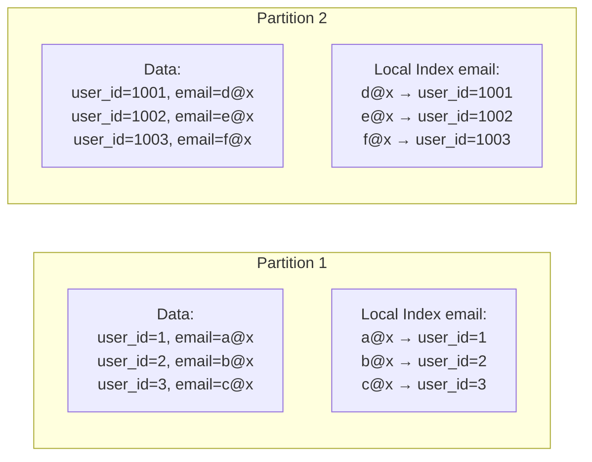
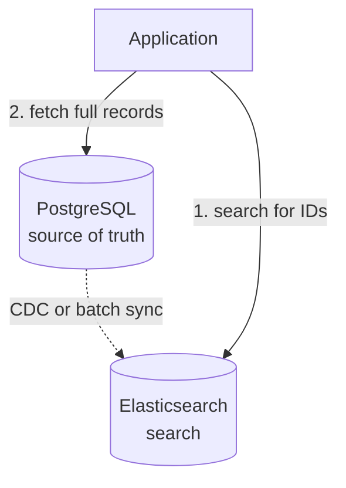
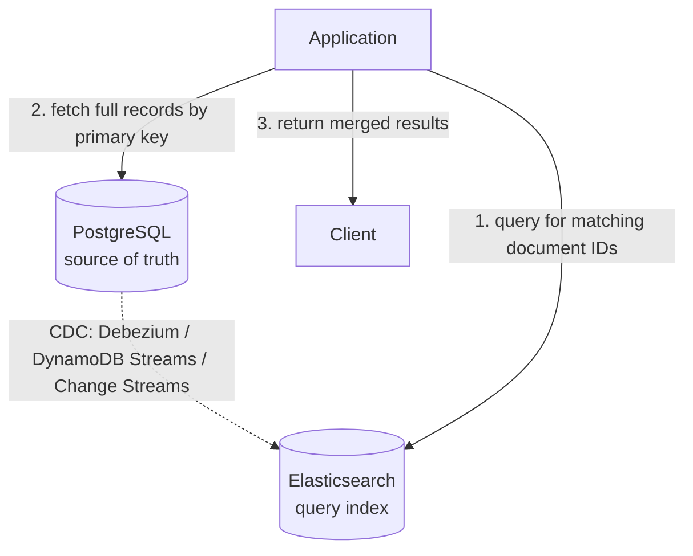

# 分散データベースにおけるセカンダリインデックス

> **注:** この記事は英語版 `02-distributed-databases/06-secondary-indexes.md` の日本語翻訳です。

## TL;DR

プライマリキーはパーティションの位置を決定します。セカンダリインデックスは、パーティションキー以外の列に対するクエリを可能にしますが、複雑さが増します。2つのアプローチがあります：ローカルインデックス（書き込みが速い、読み取りはスキャッター）とグローバルインデックス（読み取りが速い、書き込みが遅い）です。読み取り/書き込み比率とクエリパターンに基づいて選択してください。セカンダリインデックスは分散システムではコストが高いため、控えめに使用しましょう。

---

## 問題

### プライマリキーによるパーティション

```
Users table, partitioned by user_id:

Partition 1: user_id 1-1000
Partition 2: user_id 1001-2000
Partition 3: user_id 2001-3000

Query: SELECT * FROM users WHERE user_id = 1500
  → Goes to Partition 2 only ✓
```

### パーティション以外の列によるクエリ

```
Query: SELECT * FROM users WHERE email = 'alice@example.com'

Problem: email is not the partition key
  - Which partition has this email?
  - Must check ALL partitions (scatter-gather)

Without secondary index: O(N) partitions scanned
With secondary index: O(1) or O(few) partitions
```

---

## ローカルセカンダリインデックス

### コンセプト

各パーティションがローカルデータ用の独自のインデックスを保持します。



### 書き込みパス

```
INSERT user (id=1500, email='new@example.com')

1. Route to Partition 2 (based on id=1500)
2. Insert data row
3. Update local email index on Partition 2

Single partition operation ✓
```

### 読み取りパス

```
SELECT * FROM users WHERE email = 'alice@example.com'

1. Don't know which partition has this email
2. Query ALL partitions' local indexes
3. Aggregate results

Scatter-gather to all partitions ✗
```

### トレードオフ

| 観点 | ローカルインデックス |
|------|-------------------|
| 書き込み性能 | 高速（単一パーティション） |
| 読み取り性能 | 低速（全パーティション） |
| 一貫性 | 強い（同一パーティション） |
| インデックスメンテナンス | シンプル |
| ホットスポットリスク | なし（分散） |

### ユースケース

- 書き込みが多いワークロード
- クエリにパーティションキーが含まれることが多い場合
- 分析クエリ（スキャッターギャザーを想定）
- 低カーディナリティの列（パーティションごとの一致数が少ない）

---

## グローバルセカンダリインデックス

### コンセプト

インデックスがデータとは別にパーティショニングされます。

```mermaid
graph LR
    subgraph Data Partitions
        P1[("Partition 1<br/>user_id 1-1000")]
        P2[("Partition 2<br/>user_id 1001-2000")]
        P3[("Partition 3<br/>user_id 2001-3000")]
    end
    subgraph Index Partitions — by email hash
        IP1["Index Partition 1 (a-m)<br/>alice@x → user_id=5<br/>bob@x → user_id=1500<br/>carol@x → user_id=2500"]
        IP2["Index Partition 2 (n-z)<br/>ned@x → user_id=42<br/>zoe@x → user_id=999"]
    end
```

### 書き込みパス

```
INSERT user (id=1500, email='bob@example.com')

1. Write data to Partition 2 (based on id)
2. Write to Index Partition 1 (based on email hash)

Two partitions involved
May need distributed transaction or async update
```

### 読み取りパス

```
SELECT * FROM users WHERE email = 'bob@example.com'

1. Hash 'bob@example.com' → Index Partition 1
2. Lookup in Index Partition 1 → user_id=1500
3. Fetch from Data Partition 2

Two partitions, but targeted (not scatter) ✓
```

### トレードオフ

| 観点 | グローバルインデックス |
|------|---------------------|
| 書き込み性能 | 低速（複数パーティション） |
| 読み取り性能 | 高速（対象を絞った検索） |
| 一貫性 | 非同期 = 結果整合、同期 = 低速 |
| インデックスメンテナンス | 複雑（分散更新） |
| ホットスポットリスク | あり（人気のインデックス値） |

### 一貫性オプション

**同期更新：**
```
Transaction:
  1. Write data
  2. Write index
  3. Commit both

Guarantees: Read-your-writes
Cost: 2PC overhead, higher latency
```

**非同期更新：**
```
1. Write data (committed)
2. Queue index update
3. Apply index update (eventually)

Guarantees: Eventually consistent
Cost: May read stale index
```

---

## グローバルインデックスのパーティショニング

### インデックス値によるパーティション（Term-Partitioned）

```
Index partitioned by the indexed column value:

email starting with a-m → Index Partition 1
email starting with n-z → Index Partition 2

Query: WHERE email = 'alice@x'
  → Only Index Partition 1

Good for: Single-value lookups
Bad for: Range queries across partition boundaries
```

### ドキュメントIDによるパーティション

```
Index entries for same document → same partition

user_id 1-1000: all indexes in Index Partition 1
user_id 1001-2000: all indexes in Index Partition 2

Write: Single partition for all indexes
Read: May need multiple index partitions

Similar to local index but separated
```

---

## 実装例

### DynamoDB グローバルセカンダリインデックス

```
Table: Users
  Primary Key: user_id (partition key)
  Attributes: email, name, city

GSI: email-index
  Partition Key: email
  Projection: ALL  (copies all attributes)

Query:
  aws dynamodb query \
    --table-name Users \
    --index-name email-index \
    --key-condition-expression "email = :e" \
    --expression-attribute-values '{":e":{"S":"alice@x"}}'
```

**GSIの特徴：**
- 結果整合性の読み取り
- テーブルとは別のプロビジョンドキャパシティ
- テーブルへの書き込みが非同期でGSIに伝播

### Cassandra マテリアライズドビュー

```sql
CREATE TABLE users (
    user_id uuid PRIMARY KEY,
    email text,
    name text
);

-- Materialized view for email lookups
CREATE MATERIALIZED VIEW users_by_email AS
    SELECT * FROM users
    WHERE email IS NOT NULL
    PRIMARY KEY (email, user_id);

-- Query by email
SELECT * FROM users_by_email WHERE email = 'alice@example.com';
```

**MVの特徴：**
- 同期更新
- ベーステーブルの書き込みがMVの更新を待つ
- 強い一貫性

### Elasticsearch

```json
// Index with multiple searchable fields
PUT /users
{
  "mappings": {
    "properties": {
      "user_id": { "type": "keyword" },
      "email": { "type": "keyword" },
      "name": { "type": "text" },
      "tags": { "type": "keyword" }
    }
  }
}

// Query by any field
GET /users/_search
{
  "query": {
    "term": { "email": "alice@example.com" }
  }
}
```

**ESの特徴：**
- すべてのフィールドに対する転置インデックス
- ほぼリアルタイムのインデキシング
- 分散検索でのスキャッターギャザー

---

## スキャッターギャザーの最適化

### 並列クエリ

```
Query all partitions simultaneously:

Coordinator:
  for partition in partitions:
    async_query(partition)

  results = await_all()
  return merge(results)

Latency = max(partition latencies) + merge time
```

### ショートサーキット評価

```
Query: SELECT * FROM users WHERE email = 'x' LIMIT 1

Scatter to all partitions
First partition to return match → return immediately
Cancel other queries

Optimization for existence checks
```

### ブルームフィルター

```
Each partition maintains Bloom filter for indexed values

Query: WHERE email = 'alice@example.com'

1. Check Bloom filter on each partition (local operation)
2. Only query partitions where Bloom filter says "maybe"
3. Skip partitions where Bloom filter says "definitely not"

Reduces scatter-gather to likely partitions
```

---

## カバリングインデックス

### 必要な列をすべて含める

```
Index includes:
  - Indexed column (email)
  - Primary key (user_id)
  - Additional columns (name, city)

Query: SELECT name, city FROM users WHERE email = 'alice@x'

1. Lookup in index
2. Return directly from index (no data fetch needed)

Avoids second lookup to data partition
```

### インデックスオンリースキャン

```sql
-- PostgreSQL example
CREATE INDEX idx_users_email_name ON users(email) INCLUDE (name);

EXPLAIN SELECT name FROM users WHERE email = 'alice@x';
-- Index Only Scan using idx_users_email_name
```

### トレードオフ

```
+ Faster reads (no secondary fetch)
- Larger index (stores more data)
- More writes (update index on any included column change)
```

---

## セカンダリインデックスの代替手段

### 非正規化

```
Instead of index on orders.customer_email:

Store customer_email directly in orders table:
  orders: {order_id, customer_id, customer_email, ...}

Query by email → query orders directly

Trade-off:
  + No index maintenance
  - Data duplication
  - Update anomalies
```

### マテリアライズドビュー

```
Pre-compute query results as a new table:

CREATE TABLE orders_by_customer_email AS
  SELECT * FROM orders
  JOIN customers ON orders.customer_id = customers.id;

Refresh periodically or on change

Trade-off:
  + Fast reads
  - Storage overhead
  - Staleness or refresh cost
```

### 外部検索システム



トレードオフ：
- (+) 専用の検索機能
- (+) 複雑なクエリのサポート
- (-) 運用の複雑さ
- (-) 結果整合性

---

## アプローチの選択

### 判断マトリクス

| シナリオ | 推奨 |
|----------|------|
| 書き込み多、時々読み取り | ローカルインデックス |
| 読み取り多、書き込み少 | グローバルインデックス |
| 全文検索 | 外部検索システム |
| 分析クエリ | ローカルインデックス + スキャッターギャザー |
| 単一値の検索 | グローバルインデックス |
| パーティションキー付きのポイントクエリ | セカンダリインデックス不要 |

### 確認すべき質問

1. **読み取り/書き込みの比率は？**
   - 読み取りが多い → グローバルインデックス
   - 書き込みが多い → ローカルインデックス

2. **結果整合性は許容可能か？**
   - はい → 非同期グローバルインデックス
   - いいえ → 同期グローバルインデックスまたはローカル

3. **クエリにパーティションキーが含まれるか？**
   - はい → ローカルインデックスで十分な場合がある
   - いいえ → グローバルインデックスまたはスキャッターギャザー

4. **インデックスの選択性は？**
   - 低カーディナリティ → ローカルインデックスで十分
   - 高カーディナリティ → グローバルインデックスが有利

---

## ローカル vs グローバルインデックスのトレードオフ

### 並列比較

| 次元 | ローカルインデックス | グローバルインデックス |
|------|-------------------|---------------------|
| 書き込みコスト | 1パーティション（安価） | 2以上のパーティション（高価） |
| 読み取りコスト（パーティションキーなし） | 全パーティション（スキャッターギャザー） | 1インデックスパーティション + 1データパーティション |
| 読み取りコスト（パーティションキーあり） | 1パーティション | 1インデックスパーティション + 1データパーティション |
| 一貫性 | 強い（同一パーティション） | 同期 = 強い、非同期 = 結果整合 |
| 障害の影響 | 1パーティションに限定 | インデックスパーティション障害 → 古い読み取り |
| インデックス遅延 | なし | 非同期：ミリ秒から秒 |

### グローバルインデックスの書き込み増幅

グローバルにインデックス化されたテーブルへの書き込みは、少なくとも異なるパーティション上の2つの書き込みを生成します：

```
User insert (user_id=42, email='alice@x'):

  Write 1: Data partition (partition key = user_id)   → Partition A
  Write 2: Index partition (partition key = email)     → Partition B

If Partition B is unreachable:
  - Data write succeeds on Partition A
  - Index write fails or is queued
  - Index becomes stale until Partition B recovers
  - Reads via the index may miss user_id=42
```

これが根本的な緊張関係です：**グローバルインデックスを強い一貫性と高い可用性の両方を持たせることはできません**。3つのうち2つを選択します（一貫性、可用性、パーティション耐性 - CAPはインデックス自体にも適用されます）。

### DynamoDBの非同期モデル

DynamoDB GSIは非同期アプローチに従います：

- データの書き込みはベーステーブルに即座にコミットされます
- インデックスの更新は非同期で伝播されます（通常1秒未満）
- GSIの読み取りは**常に**結果整合性です — GSIに対する強い一貫性の読み取りオプションはありません
- GSIの書き込みスループットが不十分な場合、更新がキューに溜まりインデックスの遅延が増大します
- GSIの`OnlineIndexPercentageProgress`と`ThrottleCount`の監視が重要です

### ローカルがグローバルに勝つ場合

- **書き込みが多いワークロード（>80%書き込み）：** クロスパーティション調整の回避が支配的
- **クエリに通常パーティションキーが含まれる：** スキャッターギャザーが自然に回避される
- **低レイテンシの書き込みSLA（<5ms p99）：** クロスパーティションのラウンドトリップを許容できない
- **パーティション数が少ない（<20）：** スキャッターギャザーのコストが制限され許容可能

### グローバルがローカルに勝つ場合

- **読み取りが多いワークロード（>80%読み取り）：** 単一パーティションのインデックス検索は書き込みオーバーヘッドに見合う
- **クエリにパーティションキーがほとんど含まれない：** すべての読み取りでスキャッターギャザーは大規模では許容できない
- **パーティション数が多い（100+）：** スキャッターギャザーのレイテンシはパーティション数に比例して増大する
- **結果整合性が許容可能：** 非同期グローバルインデックスが両方の長所を提供する

---

## 分散データベースにおけるセカンダリインデックス

### Cassandra

Cassandraは複数のセカンダリインデックス戦略を提供し、それぞれ異なるトレードオフがあります：

- **マテリアライズドビュー：** サーバー管理のセカンダリテーブルです。ベーステーブルへの書き込みが同期的にMVを更新します。強い一貫性を提供しますが、書き込みレイテンシが増加します。Cassandraのドキュメントでは低カーディナリティのユースケースに限定することを推奨しています。
- **SAI（Storage-Attached Indexes）：** 廃止されたSASIの後継です。各ノードが自身のデータをインデックスします（ローカルインデックス）。等値、範囲、`CONTAINS`クエリをサポートします。Cassandra 5.0以降ではSASIよりも推奨されています。
- **手動非正規化：** アプリケーション層で複数のテーブルに書き込みます。最も制御が利きますが、最も複雑です。同じパーティション上のテーブル間のアトミック性には`BATCH`ステートメント（ログ付き）を使用します。

### CockroachDB

CockroachDBは分散トランザクションを通じてセカンダリインデックスをグローバルに一貫性のあるものとして扱います：

- すべてのインデックス書き込みがデータ書き込みと同じトランザクションに参加します
- Raftコンセンサスプロトコルを使用してレンジ間でインデックスエントリをレプリケーションします
- インデックスレンジがリモートノードにある場合、書き込みごとに約5-15msのレイテンシが追加されます
- `CREATE INDEX`はオンラインスキーマ変更です — バックフィル中に読み取りや書き込みをブロックしません
- カバリングインデックス用の`STORING`句（PostgreSQLの`INCLUDE`に相当）をサポートします

### MongoDB

MongoDBのセカンダリインデックスは**各シャードにローカル**です：

- シャードキーを含むクエリは単一のシャードにルーティングされます（ターゲットクエリ）
- シャードキー**なし**のセカンダリインデックスに対するクエリはすべてのシャードにスキャッターします（説明プランの`SHARD_MERGE`ステージ）
- シャードキー以外のフィールドに対するユニークインデックスは、プレフィックスとしてシャードキーを含む必要があります — 真のグローバルユニーク性はサポートされていません
- `mongos`ルーターがスキャッターギャザーを調整し、結果をマージします

### DynamoDB（GSIとLSI）

- **GSI（グローバルセカンダリインデックス）：** 異なるパーティションキーを持つデータの結果整合性のコピーです。いつでも追加・削除できます。独自のプロビジョンドスループット（またはオンデマンドキャパシティ）を持ちます。テーブルごとに最大20のGSIです。
- **LSI（ローカルセカンダリインデックス）：** ベーステーブルと同じパーティションキーで、異なるソートキーです。テーブル作成時に作成する必要があります — 後から追加できません。ベーステーブルとスループットを共有します。強い一貫性の読み取りをサポートします。テーブルごとに最大5つのLSIです。10GBのパーティションサイズ制限があります。

### セカンダリインデックスとしてのElasticsearch

複雑なクエリに対する一般的なパターンは、プライマリデータベースと並行してElasticsearchを維持することです：



一貫性：結果整合性（CDCの遅延は通常1秒未満）。
障害モード：検索が劣化するが、プライマリDBは影響を受けません。

これにより、書き込み最適化パス（OLTPデータベース）と読み取り最適化パス（検索エンジン）を分離します。各システムが得意なことを行います。

---

## インデックスメンテナンスコスト

### 書き込み増幅

各セカンダリインデックスは、データ変更ごとに少なくとも1つの書き込み操作を追加します：

```
Table with 5 secondary indexes:

INSERT → 1 data write + 5 index writes = 6 writes total
UPDATE (1 indexed col) → 1 data write + 1 index delete + 1 index insert = 3 writes
DELETE → 1 data write + 5 index deletes = 6 writes

Write amplification factor = total writes / data writes
  Insert: 6×
  Delete: 6×
  Update: 2–6× depending on which columns change
```

分散データベースでは、これらの書き込みが異なるパーティション（グローバルインデックス）や異なるSSTable/ページ（ローカルインデックス）にヒットする可能性があります。増幅はI/Oだけでなく、ネットワークのラウンドトリップやトランザクション調整のコストでもあります。

### ストレージオーバーヘッド

インデックスサイズはキー列とインデックスがカバリングかどうかに依存します：

- **最小インデックス：** インデックス列 + プライマリキーポインタ。通常、インデックスごとにテーブルサイズの10-30%です。
- **カバリングインデックス：** インデックス列 + インクルードされた列。多くの列が含まれる場合、テーブルサイズの100%に近づく可能性があります。
- **複合インデックス：** 複数列のキーはより幅広です。3列の複合インデックスは、エントリごとに3つの値すべてを保存します。

テーブルサイズに対するインデックスサイズを監視してください。インデックスの合計がテーブルサイズを超えている場合、インデックス戦略を再考してください。

### ロック競合（B-treeデータベース）

B-treeベースのシステム（PostgreSQL、MySQL InnoDB、CockroachDB）では：

- インデックスページの分割がインデックスツリーの範囲を一時的にロックする可能性があります
- 単調増加インデックス（例：タイムスタンプ）への高並行性の挿入は右端の競合を引き起こします
- `pg_stat_user_indexes`は監視用に`idx_scan`、`idx_tup_read`、`idx_tup_fetch`を公開します
- インデックスの膨張（インデックスページ内のデッドタプル）はスペースを無駄にしスキャンを遅くします — `REINDEX`を実行するか`pg_repack`を使用してください

> B-treeの分割メカニクスとページ構造の詳細については、`03-storage-engines/01-b-trees.md`を参照してください。

### 未使用インデックスの検出と削除

```sql
-- PostgreSQL: find indexes with zero scans since last stats reset
SELECT
    schemaname, tablename, indexname,
    idx_scan,
    pg_size_pretty(pg_relation_size(indexrelid)) AS index_size
FROM pg_stat_user_indexes
WHERE idx_scan = 0
ORDER BY pg_relation_size(indexrelid) DESC;

-- If idx_scan = 0 over a 30-day observation window → safe to drop
-- Always validate against slow query logs before dropping
```

経験則：**30日間でゼロスキャンのインデックスは削除候補です。** 書き込みコストとストレージの消費は純粋なオーバーヘッドです。

### コスト削減のための部分インデックス

実際にクエリする行だけをインデックスします：

```sql
-- Instead of indexing all orders:
CREATE INDEX idx_orders_status ON orders(status);

-- Index only active orders (dramatically smaller):
CREATE INDEX idx_orders_active ON orders(created_at)
    WHERE status = 'active';

-- If 95% of queries target active orders and only 5% of rows are active,
-- the partial index is ~20× smaller and ~20× cheaper to maintain.
```

部分インデックスはPostgreSQL、CockroachDB、MongoDB（パーシャル/スパースインデックスとして）でサポートされています。DynamoDBとCassandraはネイティブに部分インデックスをサポートしていません — 代わりにスパースGSIパターンまたはアプリケーション層でのフィルタリングを使用してください。

---

## 転置インデックスパターン

### ユースケース

属性値でレコードを検索する場合で、その属性がプライマリキーではない場合：

- city = "Tokyo" のすべてのユーザーを検索
- status = "pending" のすべての注文を検索
- tag = "electronics" のすべての商品を検索

### 実装

転置インデックスは**属性値をレコードIDのリスト**にマッピングします：

```
Forward index (normal):
  user_1 → {city: "Tokyo", age: 30}
  user_2 → {city: "Osaka", age: 25}
  user_3 → {city: "Tokyo", age: 35}

Inverted index (on city):
  "Tokyo" → [user_1, user_3]
  "Osaka" → [user_2]
```

これは専用のマッピングテーブル、データベースのセカンダリインデックス、または検索エンジン（Elasticsearch、Apache Solr）として実装できます。

### Term-Partitioned転置インデックス

転置インデックスをターム（属性値）で分割します：

```
Partition 1 (terms A-M):       Partition 2 (terms N-Z):
  "active"  → [order_3, ...]     "pending" → [order_1, order_5]
  "Chicago" → [user_7, ...]      "Tokyo"   → [user_1, user_3]

Query: status = "pending"
  → Route to Partition 2 only
  → Single partition read ✓
```

単一タームの検索には効率的です。ホットターム（例：status = "active"が行の80%をカバー）はパーティションのホットスポットを引き起こす可能性があります。

### Document-Partitioned転置インデックス

ドキュメント（レコード）で分割し、各パーティションがローカルドキュメントの完全な転置インデックスを持ちます：

```
Partition 1 (users 1-1000):     Partition 2 (users 1001-2000):
  "Tokyo"  → [user_1, user_3]    "Tokyo"  → [user_1500]
  "Osaka"  → [user_2]            "Osaka"  → [user_1200]

Query: city = "Tokyo"
  → Must query ALL partitions (scatter-gather)
  → Merge results: [user_1, user_3, user_1500]
```

これはローカルセカンダリインデックスと等価です。書き込みは高速（単一パーティション）ですが、読み取りにはスキャッターギャザーが必要です。

> 転置インデックスのデータ構造、ポスティングリスト、検索エンジンの内部構造の完全な説明については、`14-search-systems/01-inverted-indexes.md`を参照してください。

---

## 重要なポイント

1. **ローカルインデックスは書き込みに優しい** - ただし読み取りにはスキャッターギャザーが必要です
2. **グローバルインデックスは読み取りに優しい** - ただし書き込みが複雑になります
3. **非同期グローバルインデックス** - 高速な書き込み、結果整合性
4. **同期グローバルインデックス** - 強い一貫性、書き込みが遅い
5. **カバリングインデックスは検索を削減する** - より大きなインデックスのコストがかかります
6. **ブルームフィルターはスキャッターを最適化する** - 一致しないパーティションをスキップします
7. **代替手段を検討する** - 非正規化、マテリアライズドビュー、外部検索
8. **インデックスはコストが高い** - 控えめに使用し、パフォーマンスを測定しましょう
