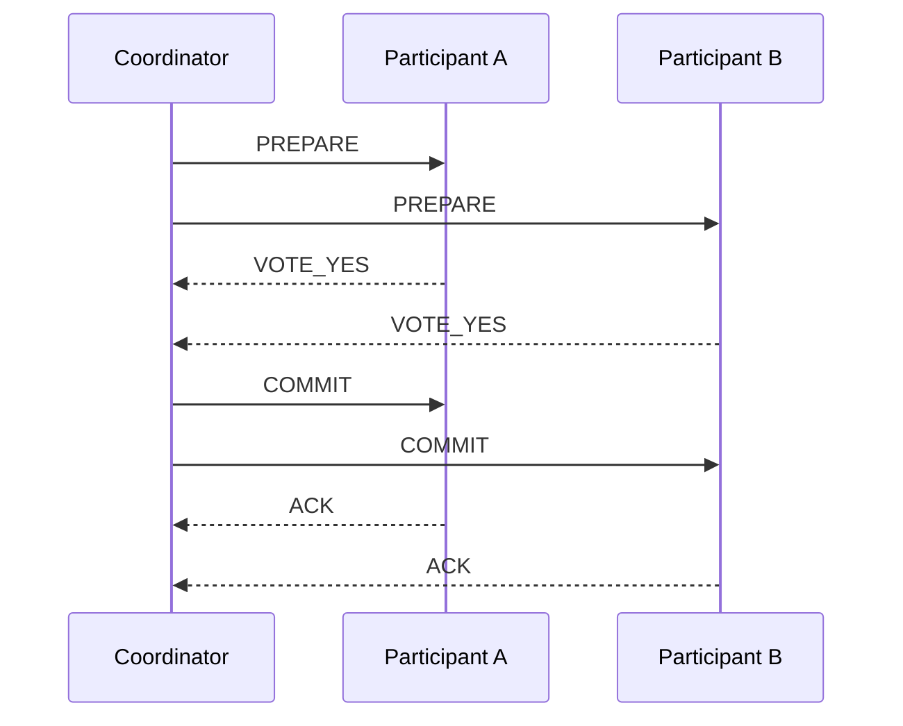
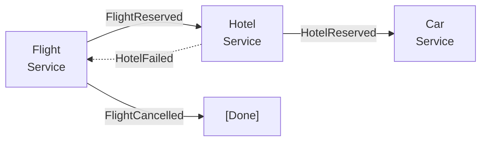
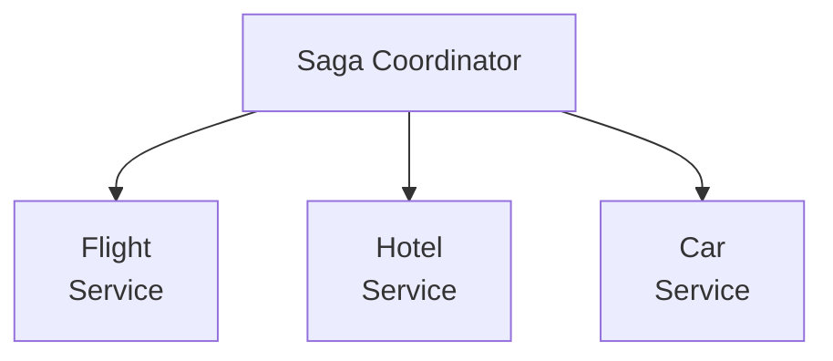

# 分散トランザクション

> **注:** この記事は英語版 `02-distributed-databases/07-distributed-transactions.md` の日本語翻訳です。

## TL;DR

分散トランザクションは、複数のノードまたはサービスにまたがるアトミックな操作を調整します。二相コミット（2PC）は古典的なアプローチですが、コーディネーターの障害時にブロックします。三相コミットはブロッキングを軽減しますが、レイテンシが増加します。Sagaは補償アクションを使用して長時間実行トランザクションを処理します。現代のシステムでは、分散トランザクションを完全に回避し、代わりに冪等性を備えた結果整合性を使用することが多いです。

---

## なぜ分散トランザクションは難しいのか

### 問題

```
Transfer $100 from Account A (Node 1) to Account B (Node 2)

Step 1: Debit A (-$100)   ← Node 1
Step 2: Credit B (+$100)  ← Node 2

What if:
  - Node 2 crashes after Step 1?
  - Network fails between steps?
  - Either node says "no"?

Money disappears or duplicates!
```

### 分散システムにおけるACID

```
Atomicity:  All nodes commit or all abort
Consistency: All nodes maintain invariants
Isolation:  Concurrent transactions don't interfere
Durability: Committed data survives failures

Challenge: Achieving these across network boundaries
```

---

## 二相コミット（2PC）

### プロトコル

```
Phase 1: Prepare (Voting)
  Coordinator → All participants: "Can you commit?"
  Participants: Acquire locks, prepare to commit
  Participants → Coordinator: "Yes" or "No"

Phase 2: Commit (Decision)
  If all voted "Yes":
    Coordinator → All participants: "Commit"
    Participants: Make changes permanent
  Else:
    Coordinator → All participants: "Abort"
    Participants: Roll back
```

### シーケンス図



### ステートマシン

```
Participant states:
  INITIAL → PREPARED → COMMITTED
                    ↘ ABORTED

Coordinator states:
  INITIAL → WAITING → COMMITTED/ABORTED

Key rule: Once PREPARED, must wait for coordinator decision
```

### ブロッキング問題

```
Scenario: Coordinator crashes after sending PREPARE

Participant A: PREPARED, waiting for decision...
Participant B: PREPARED, waiting for decision...

Both are blocked:
  - Can't commit (don't know if others voted yes)
  - Can't abort (coordinator might have decided commit)
  - Resources locked indefinitely

Solution: Wait for coordinator recovery (or timeout and abort)
```

### 2PCの実装

```python
class Coordinator:
    def execute_transaction(self, participants, operations):
        # Phase 1: Prepare
        votes = []
        for p in participants:
            try:
                vote = p.prepare(operations[p])
                votes.append(vote)
                self.log.write(f"VOTE:{p}:{vote}")
            except Timeout:
                self.log.write(f"VOTE:{p}:TIMEOUT")
                votes.append("NO")

        # Decision
        if all(v == "YES" for v in votes):
            decision = "COMMIT"
        else:
            decision = "ABORT"

        self.log.write(f"DECISION:{decision}")
        self.log.fsync()  # Durable decision!

        # Phase 2: Execute decision
        for p in participants:
            p.execute_decision(decision)

class Participant:
    def prepare(self, operation):
        self.acquire_locks(operation)
        self.log.write(f"PREPARED:{operation}")
        self.log.fsync()
        return "YES"

    def execute_decision(self, decision):
        if decision == "COMMIT":
            self.apply_changes()
            self.release_locks()
        else:
            self.rollback()
            self.release_locks()
```

---

## 三相コミット（3PC）

### 動機

ブロッキングを減らすために「プレコミット」フェーズを追加します。

```
Phase 1: CanCommit (Voting)
  Coordinator → Participants: "Can you commit?"
  Participants → Coordinator: "Yes" or "No"

Phase 2: PreCommit
  If all Yes: Coordinator → Participants: "PreCommit"
  Participants acknowledge, prepare to commit

Phase 3: DoCommit
  Coordinator → Participants: "DoCommit"
  Participants commit
```

### ノンブロッキング特性

```
Key insight: Participant in PreCommit state knows:
  - All participants voted Yes
  - Safe to commit after timeout (no need to wait for coordinator)

If coordinator crashes during PreCommit:
  Participants can elect new coordinator
  New coordinator can complete the commit
```

### 制限

```
Problem: Network partition can still cause inconsistency

Partition:
  Coordinator + Participant A: Decide to abort
  Participant B: In PreCommit, times out, commits

Result: A aborted, B committed → Inconsistency

3PC helps with coordinator crashes, not partitions
```

---

## Sagaパターン

### コンセプト

長時間実行トランザクションをローカルトランザクションのシーケンスとして実行します。各ローカルトランザクションには補償トランザクションがあります。

```
Saga: Book a trip
  T1: Reserve flight    →  C1: Cancel flight reservation
  T2: Reserve hotel     →  C2: Cancel hotel reservation
  T3: Reserve car       →  C3: Cancel car reservation
  T4: Charge credit card → C4: Refund credit card

If T3 fails:
  Run C2, C1 (reverse order)
  Trip booking failed, all reservations released
```

### コレオグラフィ（イベント駆動）

```
Each service listens for events and reacts:

Flight Service:
  On "TripRequested" → Reserve flight, emit "FlightReserved"
  On "HotelFailed" → Cancel flight, emit "FlightCancelled"

Hotel Service:
  On "FlightReserved" → Reserve hotel, emit "HotelReserved"
  On failure → emit "HotelFailed"

No central coordinator
Services react to events
```



### オーケストレーション（中央コーディネーター）

```
Saga Coordinator:
  1. Call Flight Service → Reserve flight
  2. Call Hotel Service → Reserve hotel
  3. If fail → Call Flight Service → Cancel
  4. Call Car Service → Reserve car
  5. If fail → Call Hotel → Cancel, Call Flight → Cancel
  6. Success → Done

Central coordinator knows the saga state
Easier to understand and debug
Single point of failure
```



### 補償トランザクション

```python
class BookTripSaga:
    def execute(self, trip_request):
        try:
            flight = self.flight_service.reserve(trip_request.flight)
            try:
                hotel = self.hotel_service.reserve(trip_request.hotel)
                try:
                    car = self.car_service.reserve(trip_request.car)
                    try:
                        self.payment_service.charge(trip_request.payment)
                    except PaymentError:
                        self.car_service.cancel(car)
                        raise
                except CarError:
                    self.hotel_service.cancel(hotel)
                    raise
            except HotelError:
                self.flight_service.cancel(flight)
                raise
        except FlightError:
            raise SagaFailed("Could not book trip")
```

### Sagaの保証

```
NOT ACID:
  - No isolation (intermediate states visible)
  - No atomicity (compensation is best-effort)

ACD (Atomicity through saga, Consistency, Durability):
  - Eventually consistent
  - Compensation may fail (need retries, manual intervention)
```

---

## トランザクショナルアウトボックス

### 問題

データベースの更新とメッセージ送信をアトミックに行うにはどうすればよいですか？

```
Naive approach:
  1. Update database
  2. Send message to queue

Failure mode:
  Database updated, message send fails
  OR
  Message sent, database update fails
```

### 解決策

同じトランザクション内でアウトボックステーブルにメッセージを書き込みます。

```sql
BEGIN TRANSACTION;
  -- Business update
  UPDATE accounts SET balance = balance - 100 WHERE id = 1;

  -- Outbox entry
  INSERT INTO outbox (id, payload, created_at)
  VALUES (uuid(), '{"event":"Debited","amount":100}', NOW());
COMMIT;
```

別のプロセスがアウトボックスをポーリングしてメッセージを発行します：

```python
def publish_outbox():
    while True:
        events = db.query("SELECT * FROM outbox ORDER BY created_at LIMIT 100")
        for event in events:
            try:
                message_queue.publish(event.payload)
                db.execute("DELETE FROM outbox WHERE id = ?", event.id)
            except PublishError:
                pass  # Retry next iteration
        sleep(100ms)
```

### CDC（変更データキャプチャ）の代替

```
Database transaction log → CDC → Message queue

Example: Debezium
  Reads MySQL binlog
  Publishes to Kafka

No polling, lower latency
Guaranteed ordering
```

---

## XAトランザクション

### 標準インターフェース

```
XA: eXtended Architecture (X/Open standard)

Coordinator: Transaction Manager
Participants: Resource Managers (databases, queues)

Interface:
  xa_start()    - Begin transaction
  xa_end()      - End transaction branch
  xa_prepare()  - Prepare to commit
  xa_commit()   - Commit
  xa_rollback() - Rollback
```

### Javaの例（JTA）

```java
// Get XA resources
UserTransaction tx = (UserTransaction) ctx.lookup("java:comp/UserTransaction");

try {
    tx.begin();

    // Operation on database 1
    Connection conn1 = dataSource1.getConnection();
    conn1.prepareStatement("UPDATE accounts SET balance = balance - 100 WHERE id = 1")
         .executeUpdate();

    // Operation on database 2
    Connection conn2 = dataSource2.getConnection();
    conn2.prepareStatement("UPDATE accounts SET balance = balance + 100 WHERE id = 2")
         .executeUpdate();

    tx.commit();  // 2PC happens here
} catch (Exception e) {
    tx.rollback();
}
```

### 制限

```
- Performance overhead (prepare phase, logging)
- Blocking (resources locked during 2PC)
- Homogeneous participants (all must support XA)
- Not widely supported in modern systems
```

---

## 分散トランザクションの回避

### 回避のための設計

```
1. Single database per service
   No cross-database transactions needed

2. Eventual consistency with idempotency
   Accept that operations complete asynchronously

3. Aggregate boundaries
   All related data in one partition

4. Command Query Responsibility Segregation (CQRS)
   Separate read and write models
```

### 冪等操作

```
Instead of distributed transaction:

1. Assign unique ID to operation
2. Store ID with each change
3. On retry, check if ID already processed

No coordination needed
Each service handles idempotency locally
```

### リザベーションパターン

```
Instead of: Debit A, Credit B (distributed)

Use:
  1. Create pending transfer record
  2. Reserve funds from A (mark as held)
  3. Credit B
  4. Complete transfer (release hold from A)

Each step is local
Failures leave system in recoverable state
```

---

## 比較

| アプローチ | 一貫性 | レイテンシ | 複雑さ | ユースケース |
|-----------|--------|-----------|--------|------------|
| 2PC | 強い | 高い | 中 | データベース |
| 3PC | 強い | より高い | 高い | クリティカルシステム |
| Saga | 結果整合 | 低い | 高い | マイクロサービス |
| アウトボックス | 結果整合 | 低い | 中 | イベント駆動 |
| 回避 | 結果整合 | 最も低い | 低い | ほとんどのシステム |

---

## 2PCの障害シナリオ

### 障害シナリオ

```
Scenario 1: Coordinator crash after PREPARE, before COMMIT
  - Participants voted YES, holding row locks, wrote PREPARED to WAL
  - Coordinator is DOWN — decision log empty or incomplete
  - Participants are "in-doubt": can't commit (others may have voted NO),
    can't abort (coordinator may have decided COMMIT)
  - Locked rows unavailable until coordinator recovers and replays log

Scenario 2: Participant crash after PREPARE
  - Coordinator waits for vote with timeout → timeout expires → ABORT
  - Sends ABORT to other participants → they release locks
  - On recovery: crashed participant checks WAL. No PREPARED? Implicit abort.
    Has PREPARED? Asks coordinator for decision.

Scenario 3: Network partition during COMMIT phase
  - A receives COMMIT → commits. B's packet dropped → B still PREPARED.
  - Coordinator retries COMMIT to B on reconnection.
  - B holds locks until decision arrives. If coordinator also crashes →
    manual intervention required.

The blocking problem:
  Single coordinator failure halts ALL participants. No participant can
  decide unilaterally after voting YES. This is why 2PC is avoided across
  service boundaries. Within a single DB cluster (cross-shard), it's
  tolerable because coordinator and participants share fate.
```

### XAのイン・ダウト・リカバリ（MySQLの例）

```sql
-- After crash, check for in-doubt XA transactions:
mysql> XA RECOVER;
-- Returns formatID, gtrid_length, bqual_length, data for stuck txns

-- Manually resolve:
mysql> XA COMMIT 'xid1';   -- or XA ROLLBACK 'xid1';

-- Monitor: XA RECOVER returning rows means locks are held.
-- In-doubt transactions block other InnoDB writes on those rows.
```

---

## Sagaパターンの深掘り

### コレオグラフィ vs オーケストレーションのトレードオフ

```
Choreography (event-driven):
  + No single point of failure, loosely coupled
  + Easy to add steps (subscribe to existing events)
  - Hard to see full flow (logic spread across services)
  - Circular dependency risk, difficult to debug
  - Hard to answer: "what state is this saga in?"

Orchestration (central coordinator):
  + Full flow visible in one place, easy to test
  + Clear ownership of saga state
  - Coordinator is coupling point, must be HA
  - Risk of becoming a "god service"

Rule of thumb: Choreography for ≤3 steps. Orchestration for >3 steps.
```

### 補償設計ルール

```
1. MUST be idempotent: cancel_payment(id=123) called 3x → same as 1x
2. MUST be retryable: network timeout → retry without side effects
3. MUST handle already-completed states:
   cancel_payment where never charged → no-op success
   cancel_payment where already refunded → no-op success
4. SHOULD be commutative: if T3 and C2 run concurrently, final state correct
```

### セマンティックロールバック：元に戻せない場合

```
Some actions can't be reversed: email sent, item shipped, external API called.

Compensating strategies:
  - Correction email, return shipment order, API cancel endpoint
  - Write off cost if below threshold

These are "semantic" compensations — business logic, not data rollback.
Design sagas so irreversible steps come LAST.
```

### Saga実行コーディネーター（SEC）

```
Persistent state machine per saga instance:
  saga_id: "trip-001", state: COMPENSATING
  steps: [ flight: COMPLETED+compensated, hotel: COMPLETED, car: FAILED ]

On crash recovery:
  1. Load in-progress sagas from durable storage
  2. COMPENSATING → resume from last incomplete compensation step
  3. EXECUTING → retry current step or begin compensation

Storage: relational DB or embedded KV store — must survive restart.
```

### 分離の問題

```
Sagas do NOT provide transaction isolation.

Example: Saga 1 debits A (1000 → 900), hasn't credited B yet.
  Saga 2 reads A.balance = 900 (intermediate state).
  Saga 1 compensates → A back to 1000. Saga 2 made decisions on stale data.

Mitigations:
  - Semantic locks: mark records as "in-saga" so others wait or skip
  - Commutative operations: correct results regardless of execution order
  - Versioned values: optimistic concurrency with version checks
  - Reread: verify assumptions before final step
```

---

## Calvinと決定論的トランザクション

### コアとなる洞察

```
Traditional: execute first → coordinate commit (2PC)
Calvin:      coordinate order first → execute deterministically (no 2PC)

If all replicas agree on transaction order AND execution is deterministic →
  same final state, no 2PC needed, aborts are also deterministic.
```

### Calvinの仕組み

```
1. Sequencing: all transactions go through a total-order sequencer
   (Raft/Paxos). Output: ordered log of transaction intents.

2. Scheduling: each replica reads the ordered log, analyzes read/write
   sets, runs non-conflicting transactions concurrently.

3. Execution: each replica executes in the agreed order. Deterministic
   execution → same inputs, same outputs → no commit coordination.

Result: strong consistency without 2PC overhead per transaction.
```

### 実世界での使用

```
FaunaDB (now Fauna): Calvin-inspired, pre-declares read/write sets via
  FQL, achieves serializable isolation across regions.

SLOG (2019, Thomson & Abadi): extends Calvin — local transactions skip
  global sequencing, only cross-region txns need global order.
```

### トレードオフ

```
Works well: OLTP with predictable access patterns, transactions that
  can declare read/write sets upfront, short-lived workloads.

Does NOT work: interactive/ad-hoc transactions, transactions where
  reads determine writes, long-running analytical queries.

Key limitation: transactions must be "pre-declared." The system needs
  to know which keys will be read/written BEFORE execution begins.
  Rules out SQL like: UPDATE t SET x = x+1 WHERE y > 10 (read set
  depends on current data).
```

---

## 本番環境の判断フレームワーク

### いつ何を使うか

```
2PC/XA: single DB cluster (cross-shard), financial atomicity,
  co-located nodes, both participants are databases you control

Sagas: cross-service operations, long-running processes (minutes to days),
  compensation is well-defined, eventual consistency acceptable

Calvin: building new storage engines, OLTP with predictable access
  patterns, need cross-region ACID without per-transaction 2PC

Avoid both — redesign: co-locate related data on same shard/service,
  redraw aggregate boundaries, use idempotent ops + eventual consistency
```

### 比較マトリクス

| プロパティ | 2PC | 3PC | Saga | Calvin |
|-----------|-----|-----|------|--------|
| 一貫性 | 強い | 強い | 結果整合 | 強い |
| 分離性 | 完全 | 完全 | なし | 完全 |
| レイテンシ | 2 RTT | 3 RTT | 1 RTT/ステップ | 1 RTT seq |
| 可用性 | コーディネーター | コーディネーター | 高い | 高い |
|  | 障害でブロック | 障害でアンブロック |  |  |
| パーティション | ブロック | 不整合 | 補償 | seq ブロック |
| 複雑さ | 中 | 高い | 高い | 高い |
| 最適 | 同DC内DB | クリティカル（稀） | サービス | 新規OLTP |

RTT = 参加者間のラウンドトリップ時間

### 判断フローチャート

```
Need atomicity across services?
  No  → eventual consistency + idempotency
  Yes → Can you redesign to avoid it?
    Yes → co-locate data, redraw boundaries
    No  → All participants in same DB cluster?
      Yes → 2PC (built into your DB)
      No  → Can you define compensating actions?
        Yes → Sagas
        No  → design problem — reconsider service boundaries
```

---

## 重要なポイント

1. **2PCはアトミック性を保証する** - ただし障害時にブロックします
2. **3PCはブロッキングを軽減する** - ただしパーティションには対応しません
3. **Sagaは結果整合** - 補償が失敗する可能性があります
4. **アウトボックスパターンは信頼性が高い** - データベース + イベントをアトミックに
5. **XAはヘビーウェイト** - 必要な場合のみ使用してください
6. **最善のアプローチは回避** - 結果整合性で設計しましょう
7. **冪等性が鍵** - リトライを安全にします
8. **各ステップはリカバリ可能であるべき** - 補償またはリトライの方法を把握しておきましょう
