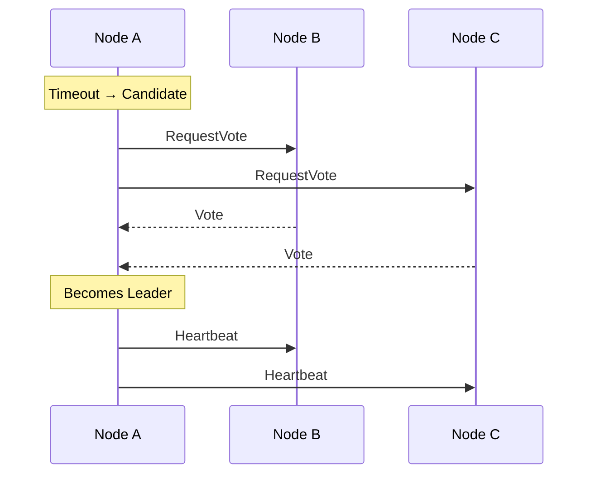
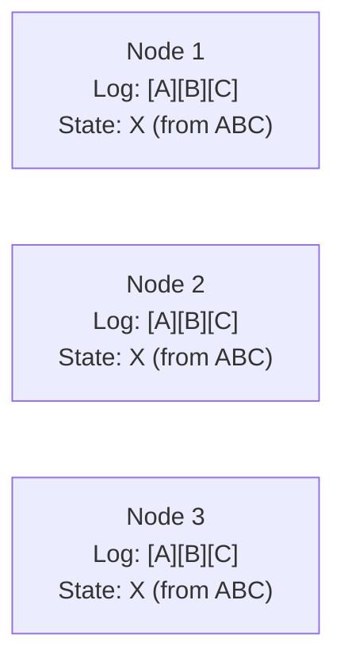
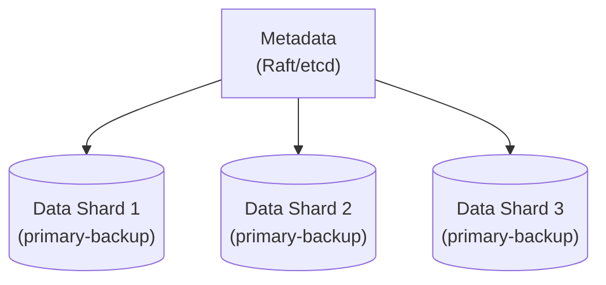

# コンセンサスアルゴリズム

> **注:** この記事は英語版 `02-distributed-databases/08-consensus-algorithms.md` の日本語翻訳です。

## TL;DR

コンセンサスは、障害が発生してもl分散ノードが1つの値に合意できるようにします。Paxosは理論的にエレガントですが実装が困難です。Raftは理解しやすさを重視して設計されており、広く使用されています。どちらもf個の障害に対して2f+1個のノードで耐障害性を確保します。コンセンサスはコストが高いため、すべてのデータ操作ではなく、調整のためだけに使用してください。

---

## コンセンサス問題

### 定義

ノードのグループを1つの値で合意させます。

```
Nodes: A, B, C, D, E
Proposals: A proposes "X", B proposes "Y"

Requirements:
  1. Agreement: All nodes decide the same value
  2. Validity: Decided value was proposed by some node
  3. Termination: All correct nodes eventually decide
```

### なぜ難しいのか

```
Scenario: 5 nodes, A proposes "X"

Time 1: A sends proposal to all
Time 2: B, C receive proposal, agree
Time 3: A crashes
Time 4: D, E haven't received proposal

What should D, E decide?
  - They don't know about "X"
  - Can't contact A (crashed)
  - Might receive conflicting proposal from B
```

### FLP不可能性

```
Fischer, Lynch, Paterson (1985):

In an asynchronous system with even ONE faulty node,
no consensus protocol can guarantee termination.

Implication:
  - Can't distinguish slow node from crashed node
  - Must use timeouts (gives up pure asynchrony)
  - All practical systems use partial synchrony
```

---

## Paxos

### Basic Paxos

単一の値について合意します。

**ロール：**
```
Proposers: Propose values
Acceptors: Accept/reject proposals
Learners:  Learn decided values

(Same node can play multiple roles)
```

**フェーズ1：Prepare**
```
Proposer:
  1. Choose proposal number n (unique, increasing)
  2. Send Prepare(n) to majority of acceptors

Acceptor on receiving Prepare(n):
  If n > highest_seen:
    highest_seen = n
    Promise: won't accept proposals < n
    Reply with any previously accepted value
```

**フェーズ2：Accept**
```
Proposer (if majority promised):
  If any acceptor replied with accepted value:
    Use that value (can't choose own value)
  Else:
    Use own proposed value
  Send Accept(n, value) to majority

Acceptor on receiving Accept(n, value):
  If n >= highest_seen:
    Accept proposal
    Reply with acceptance
```

**決定：**
```
When proposer receives majority acceptances:
  Value is decided
  Notify learners
```

### Paxosの例

```
Proposers P1, P2; Acceptors A, B, C

P1: Prepare(1) → A, B, C
  A: Promise(1), no prior value
  B: Promise(1), no prior value
  C: Promise(1), no prior value

P1: Accept(1, "X") → A, B, C
  A: Accepted(1, "X")
  B: Accepted(1, "X")
  C: (delayed, hasn't responded)

P1 has majority → "X" is decided

Meanwhile, P2: Prepare(2) → A, B, C
  A: Promise(2), previously accepted (1, "X")
  B: Promise(2), previously accepted (1, "X")

P2 must propose "X", not own value!
```

### Multi-Paxos

連続した複数の決定のために最適化します。

```
Basic Paxos: 2 round-trips per decision (expensive)

Multi-Paxos:
  1. Elect stable leader (one Prepare phase)
  2. Leader issues Accept for many values
  3. Re-elect only if leader fails

Amortizes Prepare phase across many decisions
```

### Paxosの課題

```
1. Complex state machine
   - Many edge cases
   - Hard to implement correctly

2. Livelock possible
   - P1 prepares, P2 prepares with higher number
   - P1 retries higher, P2 retries higher
   - No progress

3. No distinguished leader by default
   - Multi-Paxos needs leader election on top
```

---

## Raft

### 設計目標

```
"Understandability first"

Key simplifications:
  1. Strong leader: all writes through leader
  2. Clear separation of concerns
  3. Reduced state space
```

### Raftのロール

```
Leader:   Handles all client requests, replicates log
Follower: Passively replicate leader's log
Candidate: Trying to become leader

State transitions:
  Follower → Candidate (election timeout)
  Candidate → Leader (wins election)
  Candidate → Follower (discovers current leader)
  Leader → Follower (discovers higher term)
```

### ターム

```
Term: Logical clock, monotonically increasing

Term 1: Leader A
Term 2: Leader B (A failed, B elected)
Term 3: Leader B (re-elected)
Term 4: Leader C (B failed)

Each term has at most one leader
Terms used to detect stale leaders
```

### リーダー選出

```
1. Follower times out (no heartbeat from leader)
2. Increments term, becomes Candidate
3. Votes for self, sends RequestVote to all
4. Others reply with vote (if not already voted in term)
5. Candidate with majority becomes Leader
6. Leader sends heartbeats to maintain authority
```



### ログレプリケーション

```
Client → Leader: Write "X"
Leader:
  1. Append "X" to local log
  2. Send AppendEntries to followers
  3. Wait for majority acknowledgment
  4. Commit entry
  5. Apply to state machine
  6. Respond to client
```

```
Leader log:     [1:A][2:B][3:C][4:D]
                              ↑
                          committed

Follower 1 log: [1:A][2:B][3:C][4:D]  ← up to date
Follower 2 log: [1:A][2:B][3:C]       ← lagging
Follower 3 log: [1:A][2:B]            ← more lagging

Commit when entry in log of majority (Leader + F1 + F2 = 3/5)
```

### ログマッチング

```
Property: If two logs contain entry with same index and term,
          all preceding entries are identical.

Enforcement:
  - Leader includes previous entry (index, term) in AppendEntries
  - Follower rejects if doesn't match
  - Leader decrements and retries until match found
  - Follower overwrites conflicting entries
```

### Raft vs Paxos

| 観点 | Paxos | Raft |
|------|-------|------|
| 理解しやすさ | 複雑 | シンプル |
| リーダー | オプション（Multi-Paxos） | 必須 |
| ログのギャップ | 許可 | 不許可 |
| メンバーシップ変更 | 複雑 | ジョイントコンセンサス |
| 業界での採用 | 低い | 高い |

---

## 実用的なコンセンサスシステム

### etcd（Raft）

```
Distributed key-value store

Client → Leader → Replicate → Majority ack → Commit

Usage: Kubernetes configuration, service discovery

Operations:
  Put(key, value)
  Get(key)
  Watch(prefix)  // Stream changes
  Transaction    // Atomic compare-and-swap
```

### ZooKeeper（ZAB）

```
ZooKeeper Atomic Broadcast

Similar to Raft:
  - Leader-based
  - Log replication
  - Majority commit

Differences:
  - Designed before Raft
  - Different recovery protocol
  - Hierarchical namespace (like filesystem)
```

### Consul（Raft）

```
Service mesh and configuration

Raft for:
  - Catalog (service registry)
  - KV store
  - Session management

Each datacenter has Raft cluster
Cross-DC uses gossip + WAN Raft (optional)
```

---

## パフォーマンスの考慮事項

### レイテンシ

```
Consensus write latency:
  1. Client → Leader (network)
  2. Leader → Followers (network, parallel)
  3. Disk write at majority nodes
  4. Leader → Client (network)

Minimum: 2 × network RTT + disk flush

Optimization: Pipeline writes, batch entries
```

### スループット

```
Bottlenecks:
  1. Network bandwidth (replication)
  2. Leader CPU (processing all writes)
  3. Disk I/O (fsync on commit)

Scaling:
  - Can't add nodes (more replication overhead)
  - Batch entries
  - Pipeline replication
  - Use consensus for metadata, not all data
```

### リーダーボトルネック

```
All writes through leader = single point of throughput

Solutions:
  1. Partition data, separate Raft groups per partition
  2. Use consensus for coordination only
  3. Offload reads to followers (stale reads acceptable)
```

---

## メンバーシップ変更

### 問題

```
Old config: A, B, C (majority = 2)
New config: A, B, C, D, E (majority = 3)

Danger: During transition, two majorities might exist

Old majority: A, B
New majority: C, D, E

Could elect two leaders!
```

### ジョイントコンセンサス（Raft）

```
1. Leader creates joint config: C_old + C_new
2. Replicates joint config
3. Once committed, both majorities needed
4. Leader creates C_new config
5. Replicates C_new
6. Once committed, old members can leave

Safety: Never two independent majorities
```

### 単一サーバー変更

```
Simpler: Add/remove one server at a time

Adding D to {A, B, C}:
  1. D syncs log from leader
  2. Once caught up, add to config
  3. Now {A, B, C, D}

One at a time guarantees overlap between old and new quorums
```

---

## 一般的なパターン

### レプリケーテッドステートマシン



```
Same log → Same state
All nodes apply same operations in same order
All arrive at same state
```

### 線形化可能な読み取り

```
Option 1: Read through leader
  - Leader confirms still leader (heartbeat)
  - Then responds

Option 2: ReadIndex
  - Record commit index
  - Wait for commit index to be applied
  - Then respond

Option 3: Lease-based
  - Leader has time-based lease
  - Responds if within lease
  - No network round-trip if lease valid
```

### スナップショット

```
Problem: Log grows forever

Solution: Periodic snapshots
  1. Serialize state machine to disk
  2. Truncate log up to snapshot point
  3. New followers can bootstrap from snapshot

Snapshot = State at log index N
Resume replication from index N+1
```

---

## コンセンサスを使用すべき場面

### 適したユースケース

```
✓ Configuration management (who is the leader)
✓ Distributed locks
✓ Coordination (barriers, leader election)
✓ Metadata storage
✓ Sequence number generation
```

### 避けるべきケース

```
✗ All user data (too expensive)
✗ High-throughput writes (leader bottleneck)
✗ Latency-sensitive reads (can use caching instead)
✗ Data that can tolerate eventual consistency
```

### アーキテクチャパターン



```
Consensus for: Who owns which shard, leader election
Data: Simpler replication (cheaper)
```

---

## Raft内部の詳細

### 選出タイムアウトのランダム化

```
Default range: 150–300ms (per the Raft paper)

Why this range?
  - Lower bound must be >> network RTT + disk fsync
  - Upper bound caps worst-case failover time

Too narrow (150–160ms): simultaneous timeouts → split votes → no progress
Too wide (150–5000ms): safe, but 5s worst-case failover is unacceptable

Production tuning (etcd recommendation):
  election_timeout >= 10 × round_trip_time
  election_timeout >= 10 × disk_fsync_latency
```

### ログコンパクションとスナップショッティング

```
Problem: Raft log grows unbounded → memory and disk pressure

Compaction flow:
  1. State machine serializes state to snapshot file
  2. Tag with last_included_index and last_included_term
  3. Discard log entries up to that index
  4. On restart: load snapshot, replay remaining log

InstallSnapshot RPC (leader → far-behind follower):
  - Leader sends snapshot in chunks → follower replaces entire state
  - Follower discards log entries ≤ snapshot index
  - Resumes normal AppendEntries from snapshot index + 1
  - Triggered when follower too far behind or just joined

Gotcha: snapshot creation can block state machine
  - Use copy-on-write (RocksDB checkpoint) or fork-based snapshots
```

### Pre-Voteプロトコル（Raft 9.6節）

```
Problem: Server partitioned from leader, increments term repeatedly
  - When partition heals, its high term forces current leader to step down
  - Unnecessary election disrupts healthy cluster

Pre-vote solution:
  1. Candidate sends PreVote (does NOT increment term yet)
  2. Other nodes reply: "Would you vote for me IF I started an election?"
  3. Only if pre-vote majority succeeds → candidate increments term, runs real election
  4. Partitioned server fails pre-vote → never disrupts the cluster

Adopted by: etcd (default since v3.4), TiKV, CockroachDB
```

### 実践におけるメンバーシップ変更

```
Joint consensus (Raft paper): commit C_old,new (both quorums needed),
  then commit C_new. Correct but complex to implement.

Single-server changes (widely adopted):
  - Add/remove one node at a time → old and new quorums always overlap
  - Used by: etcd, CockroachDB, Consul

Learner nodes (non-voting replicas):
  - Receive AppendEntries but do NOT vote
  - Let new node catch up before counting toward quorum
  - Without learners: {A,B,C} → {A,B,C,D}, D empty log
    If B fails, quorum needs 3/4, but D can't ack → stuck
  - With learners: D catches up first, then promoted to voter
  - Supported by: etcd (--learner flag), TiKV
```

---

## Paxos vs Raft：本当の違い

### 論文が実際に規定していること

```
Paxos (Lamport, 1998/2001):
  - Single-decree: fully specified
  - Multi-decree: under-specified — no leader election, no log compaction,
    no membership changes. Each impl fills gaps differently.

Raft (Ongaro & Ousterhout, 2014):
  - One paper covers everything: election, replication, safety,
    membership changes, compaction. Implementable from the paper alone.
```

### リーダー完全性の特性

```
Raft's key insight: "A leader always has all committed entries in its log"
  - Logs never flow follower → leader
  - Conflict resolution trivial: leader's log wins

Paxos lacks this: any node can propose → must reconcile gaps,
  acceptors may have entries the proposer doesn't
```

### 実践でのパフォーマンス

```
Throughput: Raft ≈ Multi-Paxos (both bottleneck on disk fsync + network)
The real difference is implementability:
  - Google needed 2+ years for Paxos in Chubby
  - etcd shipped production Raft in months
  - Fewer bugs = fewer consensus violations in production
```

### どちらを使うべきか

```
             │ Raft            │ Multi-Paxos      │ EPaxos
─────────────┼─────────────────┼──────────────────┼──────────────────
Leader       │ Required        │ Required         │ No (leaderless)
Geo-friendly │ Poor            │ Poor             │ Good
Complexity   │ Low             │ High             │ Very High
Used by      │ etcd, Consul,   │ Spanner, Chubby  │ Research only
             │ CockroachDB     │                  │
Best for     │ Most new systems│ Google-scale     │ Multi-region
```

---

## 本番環境のコンセンサス設定

### etcdチューニング

```
Key flags:
  --heartbeat-interval    100ms  (default)
  --election-timeout     1000ms  (default)

Critical rule: disk_fsync_latency < election_timeout / 10
  fsync 80ms → election timeout ≥ 800ms
  Why? Slow fsync delays heartbeat → followers start elections

Disk: SSD required, dedicated WAL disk, monitor wal_fsync_duration_seconds
```

### ZooKeeperチューニング

```
tickTime:   2000ms  (base time unit, heartbeat = 1 tick)
initLimit:  10      (ticks for follower to sync with leader on startup)
syncLimit:  5       (ticks for follower to fall behind before being dropped)

Session timeout: client-negotiated, bounded by [2×tickTime, 20×tickTime]
  - Too low: transient network blip kills sessions, ephemeral nodes vanish
  - Too high: dead client's locks held too long

ZAB vs Raft:
  - ZAB uses TCP ordering guarantee to simplify replication
  - Recovery protocol differs: ZAB syncs full history, Raft uses log matching
```

### クラスターサイジング

```
Nodes │ Quorum │ Failures tolerated │ Notes
──────┼────────┼────────────────────┼─────────────────────────
  3   │   2    │        1           │ Minimum production setup
  5   │   3    │        2           │ Standard for most systems
  7   │   4    │        3           │ Rare; higher write latency
  9   │   5    │        4           │ Almost never justified

Why not more?
  - Every write must reach majority → more nodes = higher latency
  - Diminishing returns: 3→5 doubles fault tolerance, 5→7 adds only 1
  - Cross-region: each additional region adds RTT to commit latency
```

### クロスリージョンコンセンサス

```
Fundamental constraint:
  Commit latency ≥ max RTT to reach quorum across regions

Approaches:
  1. Spanner (TrueTime): atomic clocks → bounded uncertainty (~7ms),
     read-only txns skip consensus, writes still pay cross-region RTT
  2. CockroachDB (Leaseholder): leaseholder serves reads locally,
     writes need Raft quorum, lease migrates toward traffic
  3. Raft with witnesses: full replicas in 2 regions, lightweight
     witness in 3rd (votes but stores no data → cheaper)
```

### 監視すべきメトリクス

```
Critical metrics (etcd/Raft-based systems):
  1. Committed index lag (leader - follower) → follower falling behind
  2. Proposal apply duration → state machine bottleneck
  3. Snapshot send duration → follower was very far behind
  4. Leader changes counter → frequent = instability
  5. Proposal failures → normal during elections, abnormal otherwise
  6. wal_fsync_duration_seconds → disk health indicator
```

---

## コンセンサスの障害モード

### スプリットボートループ

```
Scenario: 5-node cluster, leader crashes
  T=0:     Leader dies
  T=150ms: B and C timeout simultaneously, both become candidates
  T=152ms: B gets vote from D, C gets vote from E → 2 each, no majority
  T=300ms: Both timeout, increment term, retry → cycle repeats

Root cause: election timeouts too close together
Fix: widen randomization range, ensure ≥ 10× RTT spread
In practice: resolves within 1-3 rounds (sustained loops near-impossible)
```

### 遅いフォロワーの影響

```
Myth: "Slow followers don't affect commits — leader only needs majority"

Reality: tail latency shifts when a fast follower degrades

  5-node cluster, follower latencies: 1ms, 2ms, 50ms, 200ms
  Commit waits for 2nd fastest → 2ms (good)

  If one fast follower degrades:  1ms, 80ms, 50ms, 200ms
  Commit waits for 2nd fastest → 50ms (slow follower now in quorum)

Takeaway: monitor per-follower replication latency, not just average
```

### ディスクI/Oストール

```
Scenario: fsync on follower takes > election timeout
  1. Disk stalls (GC pause, I/O contention, EBS hiccup)
  2. Follower can't ack → election timer fires → starts election
  3. If its log is current, it wins → old leader steps down
  4. Workload shifts to new leader → its disk might stall too
  Result: election storm, cascading leader changes

Prevention:
  - Dedicated SSD for consensus WAL (never share with app I/O)
  - Election timeout >> worst-case fsync (measure p999, not p50)
  - Pre-vote prevents stalled node from disrupting cluster
```

### 非対称ネットワークパーティション

```
Topology: A ↔ B OK, A ↔ C OK, B ↔ C BROKEN

If A is leader:
  - Reaches both B and C → quorum intact, commits proceed normally

If B is leader:
  - B + A = majority → commits succeed
  - C can't reach leader → stale reads, eventually times out
  - C starts elections, increments terms → disruptive without pre-vote

Key insight: asymmetric partitions are hardest to reason about
  - Test with Jepsen, Toxiproxy, or tc netem
  - Pre-vote prevents term inflation from partially isolated nodes
```

### リーダースラッシング

```
Symptoms: leader changes every few seconds, write latency spikes (~1-2s
  per election), sawtooth pattern in leader_changes counter

Common causes:
  1. Aggressive timeout + bursty load → leader misses heartbeat window
  2. Resource contention → GC pause > election timeout
  3. Clock skew → lease-based reads break (leader/follower disagree)

Fixes:
  - Increase election timeout (trade availability for stability)
  - Isolate consensus process from application (dedicated CPU/disk)
  - Priority-based election: prefer nodes with better hardware
  - Check quorum: leader steps down if can't reach majority
```

---

## 重要なポイント

1. **コンセンサスは合意を解決する** - 1つの値、全ノードが合意します
2. **FLP不可能性は保証を制限する** - 実践ではタイムアウトが必要です
3. **Paxosは正しいが複雑** - マルチデクリーの仕様が不十分です
4. **Raftは明快さを優先する** - リーダー完全性がすべてをシンプルにします
5. **過半数が必要（2f+1ノード）** - 5ノードが本番環境のスイートスポットです
6. **コンセンサスはコストが高い** - 調整のために使用し、すべてのデータには使用しないでください
7. **リーダーはボトルネック** - スケールのためにデータをパーティショニングしましょう
8. **スナップショットはログの増大を防ぐ** - 長期稼働システムに不可欠です
9. **Pre-Voteは混乱を防ぐ** - パーティションされたノードが不要な選出を引き起こすのを防ぎます
10. **ディスクI/Oはサイレントキラー** - fsyncレイテンシは選出タイムアウトを大幅に下回る必要があります
