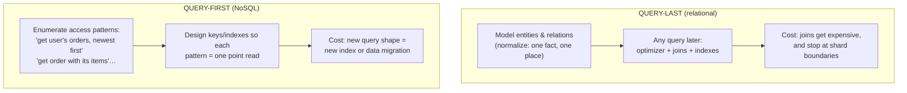
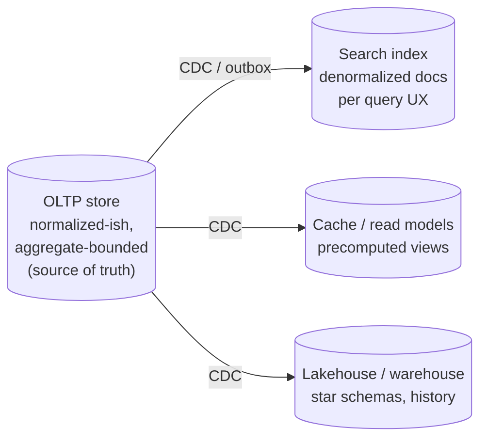

# アクセスパターンのためのデータモデリング

> **翻訳についての注記:** 本ドキュメントは英語原文 `02-distributed-databases/10-data-modeling.md` を日本語に翻訳したものです。コードブロックおよびMermaidダイアグラムは原文のまま維持しています。

## TL;DR

データモデリングは、どんなエンジン選定よりも先に、あなたのスケーリングの天井を決めます。2つの哲学があります: **クエリ後置**(リレーショナル — ドメインを正規化し、オプティマイザに何でもジョインさせる。永遠に柔軟だが、ジョインはシャードを越えない)と**クエリ先行**(NoSQL — すべてのアクセスパターンを先に列挙し、各パターンがポイントルックアップになるようキーとインデックスを形作る。残酷に速く、残酷に硬い)。現代の規律は両方を意図的に使います: 測定された理由ができるまで正規化する。非正規化するときは、コピーを維持しなければならない*書き込み時ジョイン*を引き受ける([CDC](../13-data-pipelines/04-change-data-capture.md)/[アウトボックス](../05-messaging/07-outbox-pattern.md))。パーティションキーは**分散とアクセス局所性を同時に**満たすよう選ぶ — キーこそシャーディング戦略だからです。不変条件が1つのパーティションのトランザクション内に収まるよう集約を区切る。そしてスケールでは、モデルは*1つ*ではない — ワークロードごとに1つのモデル(OLTP、検索、分析)をパイプラインで同期するのです。

---

## 2つの哲学



選択は**いつ支払うか**です。リレーショナルなモデリングは読み取り時(ジョイン)に支払い、予期しなかった質問をする権利を買います — 強力なプライマリ+レプリカに収まるデータで進化するプロダクトの正しいデフォルトです(その範囲は大半の人の想像より広い — [Figmaの旅路](../08-case-studies/11-figma.md)参照)。クエリ先行のモデリングは設計時と書き込み時に支払い、どんな規模でもO(1)の読み取りを買います — パーティション化された後の正しい姿勢です。**分散ジョインこそ、アーキテクチャが回避するために存在するもの**だからです([パーティショニング戦略](./05-partitioning-strategies.md))。

過ちは哲学を偶然に混ぜることです: DynamoDB/Cassandraのテーブルを正規化SQLのようにモデリングして、アプリケーションでN+1のファンアウト読み取りで「ジョイン」する。あるいは持ってもいない「スケールのため」に初日からPostgresを非正規化し、無のために更新異常を相続する。

## 正規化と、非正規化を「稼ぐ」こと

正規化を一文で: **すべての事実が正確に1か所に住む**。だから更新は1回の書き込みで、不整合は構造的に不可能です。非正規化するとき売り渡すのはその性質です — だから意図して売ること:

| 非正規化するのは | 理由 |
|---|---|
| 毎リクエスト、高QPSでN個のテーブルをジョインする読み取り | 書き込み時に一度ジョインを事前計算するほうが、読み取りごとの再計算に勝つ |
| ジョインがシャード/サービス境界を越える | クロスパーティションのジョインはscatter-gather。コピーが読み取りをローカルに保つ |
| 読み書き比が極端(100:1以上) | 維持された1つのコピーが100の安い読み取りに仕える |
| コピーが*導出可能で再構築可能* | 真実の源から再生成できるコピーはキャッシュ。できないコピーは負債 |

そして実行するときは、新しい義務に名前を付けること: すべてのコピーには**維持経路**(同一トランザクションでの書き込み、または新鮮さSLO付きの[アウトボックス/CDC](../05-messaging/07-outbox-pattern.md)経由の非同期)、**古さの予算**(「フォロワー数は5秒遅れてよい」)、そしてバグがコピーを歪めたときの**照合/再構築ジョブ**が必要です — 必ず歪むからです。カウンタは古典です: 投稿に `like_count` を持つのは非正規化であり、加算はリトライ下で冪等でなければならず([冪等性](../01-foundations/08-idempotency.md))、定期的にソーステーブルから再導出します。

## パラダイム横断の関係モデリング

**ドキュメント — 埋め込み vs 参照:** *1対少・所有・一緒に読む*データは埋め込む(注文の中の注文明細)。*非有界か共有*のデータは参照する(注文は顧客を参照し、決して埋め込まない — 非有界の配列は、サイズ上限と書き換え増幅に当たるまで成長するドキュメントです)。より深いルール: **ドキュメント/集約はトランザクション境界です** — 原子的に強制すべきすべての不変条件(「注文合計=明細の和」)が1つのドキュメント/パーティションに収まるようモデリングし、外側は設計により結果整合です([Saga](../05-messaging/09-saga-pattern.md)がそこから引き継ぎます)。

**ワイドカラム / DynamoDBシングルテーブル:** 複合主キーがゲームのすべてです — パーティションキーがグループし、ソートキーが順序づけ、「ジョイン」は**関連アイテムを同じアイテムコレクションに隣接して保存する**ことで事前計算されます:

```
Access patterns first:
  AP1: get customer profile          AP2: get customer's orders, newest first
  AP3: get order + its items         AP4: get order by id (no customer)

Table (single-table design):
  PK                SK                     attributes
  CUST#alice        PROFILE                {name, tier…}
  CUST#alice        ORDER#2026-06-01#o917  {status, total…}     ← AP2: Query PK, SK desc
  ORDER#o917        META                   {status, total…}
  ORDER#o917        ITEM#1                 {sku, qty…}           ← AP3: Query PK=ORDER#o917
  ORDER#o917        ITEM#2                 {sku, qty…}
GSI1 (for AP4 and order-by-status views):
  GSI1PK=STATUS#open  GSI1SK=2026-06-01#o917
```

アクセスパターンごとに `Query` 1回。ジョインなし、ファンアウトなし — そして全くの硬直: 新しいパターン(「SKU別の注文」)は新しいGSI(オンラインのバックフィル)か再設計を意味します。このトレードこそ、[DynamoDBが予測可能なレイテンシを約束できる](../09-whitepapers/14-dynamodb-2022.md)理由です: モデルが、スケールしない操作を禁じているのです。

**時系列:** 1つのキーを永遠に成長させないこと。パーティションが有界に保たれるよう時間窓で**バケット化**します(`PK = device#2026-06-13`、`SK = timestamp`)。バケットはエンジンの快適サイズに収まるよう選ぶ(Cassandraの経験則: 約100MB以下/数百万セル以下)。古いバケットはTTLか[レイクハウス](../13-data-pipelines/05-lakehouse-table-formats.md)へ階層化。「Cassandraが倒れた」物語の大半は、非有界パーティションの物語です。

## キーはシャーディング戦略である

パーティションキーは3つを同時に選びます — 3つとも取るか、1つを後悔するか:

1. **分散** — 高カーディナリティ、均等な書き込み分布。単調なキー(タイムスタンプ、連番ID)は全書き込みを1パーティションへ漏斗します: ハッシュ/複合キーか、[時間順だがランダムなID](../06-scaling/03-database-sharding.md)を。
2. **アクセス局所性** — 常時走るクエリは*1つの*パーティションに当たるべき。先頭キーとしての `tenant_id` はすべてのテナントクエリをローカルにし、分離境界を兼ねます([マルチテナンシー](../06-scaling/12-multi-tenancy.md))。
3. **偏り耐性** — クジラテナント1つ、バズった投稿1つが、カーディナリティに関係なくホットパーティションになります。緩和策: **書き込みシャーディング**(`post123#0…post123#9` の接尾辞を付け、読み取りでファンイン)、ホットテナントの専用パーティションへの分離、セレブ読み取りのキャッシュ([Twitterの問題](../08-case-studies/01-twitter.md))。

稼働中テーブルのキー変更はフルの[マイグレーション](../15-deployment/03-database-migrations.md)(二重書き込み、バックフィル、カットオーバー)です — クエリ先行設計があれほど思考を前倒しする正直な理由がこれです: キーは `ALTER` できない唯一のものなのです。

## ワークロードごとに1つのモデル

ある規模を過ぎると、「うちのデータモデルは?」への答えは複数形になり、それこそが設計です:



OLTPの形は正しい書き込みに最適化し、検索インデックスは太った非正規化ドキュメントを欲しがり([検索システム](../14-search-systems/02-full-text-search.md))、分析は完全な履歴を持つファクトとディメンションを欲しがります([レイクハウス](../13-data-pipelines/05-lakehouse-table-formats.md))。1つのスキーマに3役をさせようとするのが、システムが何にでも下手になる経路です。ポリグロットなモデリングを安全にする規律はひとつのルールです: **書き手が所有する真実の源は1つ。他のすべての形は、パイプラインが維持する導出された再構築可能な射影** — 手で更新せず、権威にもしない([CDC](../13-data-pipelines/04-change-data-capture.md))。

最後に、**進化**のためにモデリングすること: ホットパスでは追加的変更のみ(新しいnullableフィールド。読み手は未知を許容する — [APIとprotobufと同じ頑健性ルール](../12-service-mesh/04-api-design-patterns.md))、長寿命ドキュメントには明示的なスキーマバージョンフィールド、破壊的な変更には[expand/contract](../15-deployment/03-database-migrations.md)。進化できないモデルは、再プラットフォームすることになるモデルです。

## アンチパターン

- **主モデルとしてのEntity-Attribute-Value** — 型・制約・インデックスを手放すSQL内の「柔軟なスキーマ」。形が本当に動的なら、抽出フィールドにインデックスを張ったJSONB列か、ドキュメントストアを。
- **神のJSONブロブ** — アプリケーションが形を「知っている」非構造の1列: オプティマイザに不可視、クエリ不能、すべてのコンシューマがパースを再実装し(そして食い違い)ます。
- **NoSQL上のリレーショナル習慣** — アプリケーションのファンアウトでジョインされるDynamoDB内の正規化「テーブル」: 硬直のすべてを得て、ポイントリードの見返りはゼロ。
- **早すぎる非正規化** — Postgresが0.4msで実行していたジョインのために、手で維持されるコピーとカウンタ。
- **非有界のすべて** — 利用とともに永遠に成長する配列、アイテムコレクション、パーティション。すべての非有界構造は、あなたが選ばなかった日付を持つ未来のインシデントです。
- **組織図のモデリング** — アクセスパターンやドメイン集約ではなく、社内のチーム境界を鏡映するテーブル。真実はクエリが教えてくれます。

---

## 参考文献

- *Designing Data-Intensive Applications*, ch. 2 — データモデルとクエリ言語。リレーショナル/ドキュメント/グラフのトレード全体
- *The DynamoDB Book* (Alex DeBrie) — 正しく教えられたシングルテーブル設計; [AWS: NoSQL design for DynamoDB](https://docs.aws.amazon.com/amazondynamodb/latest/developerguide/bp-general-nosql-design.html)
- [Rick Houlihan — Advanced design patterns for DynamoDB (re:Invent)](https://www.youtube.com/watch?v=HaEPXoXVf2k) — アクセスパターン先行の正典トーク
- [Cassandra data modeling documentation](https://cassandra.apache.org/doc/latest/cassandra/developing/data-modeling/intro.html) — バケット化、パーティションサイズ
- [MongoDB schema design: embedding vs referencing](https://www.mongodb.com/docs/manual/data-modeling/) — 1対少/1対多/1対無数のヒューリスティクス
- [パーティショニング戦略](./05-partitioning-strategies.md)、[データベースマイグレーション](../15-deployment/03-database-migrations.md)、[CDC](../13-data-pipelines/04-change-data-capture.md) — 対になる機構
