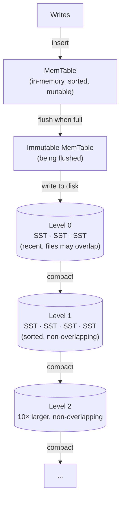
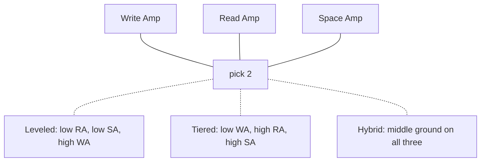

# LSM木

> この記事は英語版から翻訳されました。最新版は[英語版](/03-storage-engines/02-lsm-trees.md)をご覧ください。コードブロック・数式・図は原文のまま維持しています。

## TL;DR

Log-Structured Merge木はひとつの問いへの答えです: ストレージエンジンがランダム書き込みを一切行わなかったらどうなるか？ すべての書き込みはソート済みのインメモリバッファに着地し、イミュータブルなソート済みファイル（SSTable）のシーケンシャルなフラッシュとしてのみディスクに到達します。バックグラウンドの*コンパクション*がそれらのファイルをマージし、読み取りと空間を制御下に保ちます。代償は、キーがもはや1か所に住んでいないことです — 読み取りは多数のラン（run）を参照しなければならず（読み取り増幅）、コンパクションはデータを何度も書き直し（書き込み増幅）、古いバージョンはマージされるまで居座ります（空間増幅）。3つの増幅はトライアングルを形成します: どのコンパクション戦略も3つ全部では勝てません。leveled/tiered/FIFOが存在する理由であり、LSMのチューニングが設定作業ではなくワークロードエンジニアリングである理由です。LSMはRocksDB（そしてそれを通じてCockroachDB、TiKV、YugabyteDB）、Cassandra/ScyllaDB、HBase — 実質すべての書き込み重視の分散ストア — を支えています。本章では構造を組み立て、トライアングルを定量化し、本番の実務領域 — RocksDBチューニング、トゥームストーンの病理、書き込みストール、監視 — を扱います。

---

## 書き込み問題

[B木](./01-b-trees.md)はデータをin-placeで更新します。ランダムなキーへの小さな書き込みが続くワークロードでは、更新ごとにページサイズのread-modify-writeがインデックス全体に散らばることを意味します:

```
B-tree, 100-byte insert with a random key, 8 KB pages:
  1. read the target leaf page      (random read — a miss once the
                                     tree exceeds the buffer pool)
  2. modify 100 bytes in memory
  3. WAL the change                 (sequential — cheap)
  4. eventually write the page back (random 8 KB write)

Per-insert device cost at steady state: ~1 random read + ~1 random write
  HDD  (~100-200 IOPS):    → low hundreds of inserts/sec. Catastrophic.
  NVMe (~10⁵-10⁶ IOPS):    → fine, until it isn't (below)
```

LSMはランダムI/Oを完全に取り除きます:

```
LSM, same insert:
  1. append to WAL                  (sequential)
  2. insert into in-memory memtable (no disk)
  ...later, amortized:
  3. flush a FULL memtable (64-256 MB) as one sequential file write
  4. compaction rewrites data in large sequential merges

Every byte the device sees is part of a large sequential write.
A single NVMe drive sustains 1-3 GB/s sequential — the ingest ceiling
becomes compaction bandwidth, not IOPS.
```

HDDからSSDへの移行後も生き残る注意点が2つ。第一に、SSDは依然として大きなシーケンシャル書き込みを強く好みます: FTLがそれらを消去ブロック単位にまとめ、デバイス内部のガベージコレクションとその書き込みの崖（write cliff）を最小化します（デバイスレベルの書き込み増幅はエンジンの書き込み増幅と複利で効きます）。第二に、イミュータブルなファイル出力こそが残りのアーキテクチャを無料で成立させるものです — チェックサム付きで、圧縮可能で、キャッシュに優しく、丸ごと複製やアップロードができるファイル（[SSTableとコンパクション](./03-sstables-compaction.md)、[オブジェクトストレージ](./08-object-storage.md)）。

---

## 構造と書き込みパス



**memtable**はソート済みのインメモリ構造で、ほぼ常に**スキップリスト**です（RocksDB、Cassandra、Pebble）。平衡木でない理由は並行性の形をしています: スキップリストはロックフリーの並行挿入をシンプルなエポックベースのメモリ回収と共にサポートし、フラットなノード構造のおかげでフラッシュ時のソート済みイテレーションが安価です。書き込みはO(log n)のメモリ操作で、その前のWAL追記が書き込みパス上の唯一のディスク接触です。

**フラッシュサイクル:** memtableがサイズ上限（`write_buffer_size`、通常64〜256MB）に達すると、アトミックに新しいものと交換されて*イミュータブルmemtable*になります。バックグラウンドスレッドがそれをLevel-0 SSTableとしてディスクにストリームし、対応するWALセグメントを切り詰めます。移行中の読み取りは両方のmemtableを参照します — 停止はありません。ノブ `max_write_buffer_number` はイミュータブルmemtableが何個まで積み上がれるかを制限します。フラッシュが追いつけなければ、エンジンはまずスロットルし、次に**書き込みをストール**させます — LSMの代名詞的な障害モードで、監視の節で扱います。

```
Write path, end to end:
  1. append to WAL                          → durability
  2. insert into memtable                   → visibility
  3. ack the client                         (total: 1 sequential append
                                             + 1 in-memory insert)
  4. [async] memtable full → immutable → flushed as L0 SSTable
  5. [async] compaction merges L0 → L1 → ... in the background

The client-visible latency contains no random I/O and no compaction —
those are background costs, paid later. This deferral is both the
LSM's superpower and its operational trap: ingest can outrun
compaction for hours, and the debt comes due as read degradation
and, eventually, write stalls.
```

**Level 0は特別です。** 各L0ファイルは完全なmemtableスナップショットなので、L0ファイル同士はキーレンジが重なります — 読み取りは全部を確認しなければなりません。より深いレベルはどれも、重ならないファイル群に分割された1本のソート済みランなので、読み取りはレベルあたり最大1ファイルで済みます。したがってL0を小さく保つことがコンパクションの最優先の仕事です。

---

## 読み取りパス

```
Get(key) — newest to oldest, first hit wins:
  1. memtable
  2. immutable memtable(s)
  3. every L0 file, newest first        ← all may contain the key
  4. one candidate file per level L1+   (binary search on file ranges)

Runs to consult ≈ #L0 files + #levels ≈ 10 in a healthy tree.
Without filters, a MISS costs ~10 file probes (index + data block each).
With a bloom filter per SSTable at 1% FPR, expected wasted reads ≈ 0.1.
```

ブルームフィルタこそがLSMのポイント読み取りを競争力あるものにしています — フィルタの数学、キャッシュラインを意識したレイアウト、レベルごとの偽陽性率配分（Monkey）、静的な代替（ribbon、binary fuse）は[ブルームフィルタ](./05-bloom-filters.md)で詳しく扱っています。

フィルタが直せないもの: **レンジスキャン**（レンジの質問に答えられるフィルタはないため、全ランをマージイテレートする必要がある）、そして**ホットキーのバージョン山積み** — コンパクションの合間に数千回更新されたキーは多数のランに存在し、読み取りは依然として最新版を見つけなければなりません。つまり読み取り増幅は、B木の読み取りにはない形でワークロード依存です: よくコンパクションされたLSMはB木のように読め、コンパクション飢餓のLSMはラン上の線形スキャンのように読めます。

---

## コンパクション: 繰り延べた請求書の支払い

コンパクションはソート済みランをマージし、各キーの最新バージョンだけを残し、（最終的には）トゥームストーンを落とします。これが存在するのは、なければすべての繰り延べコストが複利で効いてくるからです: L0が無制限に成長し（読み取り増幅↑）、古いバージョンが蓄積し（空間増幅↑）、何も回収されません。

戦略空間は2つの極の間のスペクトラムです:

```
Size-tiered (STCS): collect ~4 runs of similar size, merge into one
  run in the next tier. Each key is rewritten ~once per tier.
  → LOW write amp, HIGH read amp (many runs), HIGH space amp
    (duplicates of a key may exist once per tier; worst case ~2×+)

Leveled (LCS): maintain one sorted run per level, levels sized
  L(i+1) = 10 × L(i). Compacting a file merges it with the ~10
  overlapping files below — each key is rewritten ~10× per level.
  → HIGH write amp (~10 per level), LOW read amp (1 file/level),
    LOW space amp (~1.1×)

FIFO: no merging at all; delete oldest files past a size/TTL bound.
  → for data whose value expires (metrics, logs)
```

メカニクス — ファイルフォーマット、マージイテレータ、トゥームストーンGCルール、スケジューリング、trivial move、サブコンパクション — は[SSTableとコンパクション](./03-sstables-compaction.md)にあります。戦略の比較と選択の指針は、それを動機づける増幅の数学の後、本章の後半に登場します。

---

## 削除とトゥームストーン

イミュータブルファイルの設計では、古いファイルに触れてキーを消すことはできません。削除とは、古いバージョンを覆い隠すトゥームストーンマーカーの*書き込み*です:

```
delete(k)  →  write (k, TOMBSTONE, seq)

Read:  sees tombstone first (it's newest) → "not found"
Compaction: tombstone erases older versions of k it meets...
  ...but the tombstone itself can only be dropped when it reaches
  the bottom level (or provably overlaps no older data) — otherwise
  a yet-unmerged older version would "resurrect".
  Plus (Cassandra): not before gc_grace_seconds, so the tombstone
  has time to replicate to nodes that missed the delete — dropping
  it early resurrects data cluster-wide via repair.
```

設計時に織り込むべき帰結:

- **削除は空間を解放する前に消費します。** 大量削除は、コンパクションがトゥームストーンを最下層まで運ぶまでデータセットを*大きく*します。キャパシティレビューの前夜にテーブル1本分の行を削除するのは古典的な自爆です。
- **キューのアンチパターン。** LSMテーブルをFIFOキューとして使う（挿入、読み取り、削除）と、先頭にトゥームストーンが蓄積します。「次を読む」たびに、生きている行を見つける前に数百万のトゥームストーン化エントリをスキャンすることになります。Cassandraはまさにこれに対して `TombstoneOverwhelmingException` を発します。キューは[メッセージキュー](../05-messaging/01-message-queues.md)に置くべきで、最低でも丸ごと落とせる時間バケット化テーブル（FIFO/TWCSパターン）にすべきです。
- **レンジトゥームストーン**（プレフィックス/パーティション全体を1マーカーで削除）はキーごとのトゥームストーンよりはるかに安く書けますが、コンパクションが解決するまで読み取りがレンジマーカーを運ぶことになります — 節度を持って使うこと。
- **TTLデータ**: ファイル丸ごとが期限切れになる自然満期の戦略（FIFO/TWCS）を選びましょう — ファイル削除による削除は、コンパクション作業ゼロ・トゥームストーンゼロです。

---

## 増幅のトライアングル

```
Write Amplification (WA) = bytes written to device / bytes written by app
Read Amplification (RA)  = device reads per logical read
Space Amplification (SA) = bytes on device / logical data size
```



### Leveled WAの導出

```
WA(leveled) ≈ 1 (WAL) + 1 (flush) + size_ratio × (#levels - 1)
                                     ↑ each level rewrite merges the
                                       moving file with ~size_ratio
                                       overlapping files below

Example (RocksDB defaults, size_ratio = 10):
  1 TB dataset → levels: 256 MB → 2.5 GB → 25 GB → 250 GB → 1 TB (5 levels)
  WA ≈ 2 + 10 × 4 ≈ 40× worst case; 10-30× measured in practice
  (measured is lower: trivial moves, keys that die young in upper
   levels, and skew all reduce rewrites)

Consequence: sustained ingest of 100 MB/s at WA 20 = 2 GB/s of
compaction writes. THIS is the number to check against device
bandwidth — not the application write rate.
```

### Tiered WAの導出

```
WA(tiered) ≈ 1 + 1 + (#tiers)      — each key rewritten ~once per tier
Example (Cassandra STCS, ~4 tiers): WA ≈ 4-10×

The saving comes from merging same-size runs instead of pushing into
a fully-sorted level; the cost is carrying T overlapping runs per tier
(read amp) and up to a full duplicate of the dataset mid-merge (space).
Worst-case STCS space: a single giant compaction needs input + output
live simultaneously — budget 50%+ disk headroom.
```

### RocksDBでのWA計測

```
  rocksdb.compact.write.bytes   — bytes written by compaction
  rocksdb.flush.write.bytes     — bytes written by flush
  rocksdb.bytes.written         — bytes written by application

  WA = (compact.write.bytes + flush.write.bytes) / bytes.written

Or read the LOG file's "Cumulative compaction" section.
Concrete healthy reference (leveled, ratio 10, 6 levels):
  WA ≈ 20×  |  SA ≈ 1.1×  |  RA ≈ 1 disk read per point lookup (with bloom)
```

研究の最前線はこのトライアングルを形式化しています: **Monkey**（SIGMOD '17）はレベル横断のフィルタメモリ配分を最適化し、**Dostoevsky**（SIGMOD '18）はleveledとtieredが連続体の両端点であることを示し（「lazy leveling」）、レベルごとにマージポリシーを選びます。RocksDBのuniversal compactionとScyllaDBのICSは、同じ連続体上の実運用における歩みです。

---

## 本番向けRocksDB設定

### MemTableと書き込みバッファ

```
write_buffer_size = 128MB
  Size of a single memtable.
  Larger  → fewer flushes, better write throughput
  Smaller → faster recovery from WAL, lower memory
  Default: 64MB. For write-heavy on NVMe: 128–256MB.

max_write_buffer_number = 4
  Max memtables (active + immutable) before write stall.
  Default: 2. Set 3–4 for bursty write workloads.
  Memory budget: write_buffer_size × max_write_buffer_number per CF.

min_write_buffer_number_to_merge = 2
  Merge multiple memtables during flush to reduce L0 file count.
  Useful when write_buffer_size is small.
```

### L0コンパクショントリガーとバックプレッシャー

```
level0_file_num_compaction_trigger = 4
  Compaction kicks in when L0 file count reaches this.
  Lower  → more frequent compaction, lower read amp
  Higher → batches more files per compaction, better write throughput

level0_slowdown_writes_trigger = 20
  RocksDB begins throttling writes (artificial delay).
  Provides back-pressure signal before stall.

level0_stop_writes_trigger = 36
  Hard stall — writes block completely.
  If you hit this, compaction cannot keep up.
  Increase max_background_compactions or reduce write rate.
```

### コンパクションの並列度

```
max_background_compactions = 4
  Number of concurrent compaction threads.
  Match to available I/O bandwidth, not CPU cores.
  NVMe SSD: 4–8, SATA SSD: 2–4, HDD: 1–2.

max_background_flushes = 2
  Separate from compaction threads.
  Usually 1–2 is sufficient.
```

### レベルごとの圧縮

```
compression_per_level = [kNoCompression, kNoCompression, kLZ4, kLZ4, kLZ4, kZSTD, kZSTD]

Rationale:
  L0–L1: No compression. Data is short-lived, compacted quickly.
          Saves CPU on the hottest write path.
  L2–L4: LZ4. Fast compression (500 MB/s), moderate ratio (~2×).
          Good balance for mid-tier data.
  L5–L6: ZSTD. Best compression ratio (~3–4×), slower.
          Bottom levels hold ~90% of data; max savings where it matters.
```

### 注釈付き本番設定（100GBデータセット、NVMe SSD）

```
# options.h / rocksdb::Options
write_buffer_size               = 134217728    # 128 MB
max_write_buffer_number         = 4
min_write_buffer_number_to_merge = 2

level0_file_num_compaction_trigger = 4
level0_slowdown_writes_trigger     = 20
level0_stop_writes_trigger         = 36

max_bytes_for_level_base       = 536870912     # 512 MB (L1 target size)
max_bytes_for_level_multiplier = 10            # Each level 10× larger

max_background_compactions     = 4
max_background_flushes         = 2

# Block-based table options
block_size                     = 16384         # 16 KB blocks
block_cache_size               = 8589934592    # 8 GB (~1/3 of 24 GB RAM)
cache_index_and_filter_blocks  = true          # Pin index/bloom in cache

# Bloom filter: 10 bits per key, ~1% FPR
filter_policy                  = bloomfilter:10:false

# Compression: none → LZ4 → ZSTD
compression_per_level          = [none, none, lz4, lz4, lz4, zstd, zstd]
```

---

## コンパクション戦略の比較

### 戦略マトリクス

| 戦略 | 書き込み増幅 | 読み取り増幅 | 空間増幅 | 適するケース |
|----------|-----------|----------|-----------|----------|
| Leveled（RocksDBデフォルト） | 高（10–30×） | 低（1読み取り+bloom） | 低（1.1×） | ポイントルックアップ、読み取り重視OLTP |
| Size-Tiered（Cassandraデフォルト） | 低（4–10×） | 高（全ティアをスキャン） | 高（最大2×） | 書き込み重視、時系列インジェスト |
| FIFO | なし | N/A（フルスキャン） | なし（有界） | TTLベースのメトリクス、短命データ |
| Universal（RocksDB） | 中（8–20×） | 中 | 中（1.2–1.5×） | 混合ワークロード、適応的 |

### 意思決定フレームワーク

```
Start with leveled compaction (the safe default).

Switch to size-tiered or universal when:
  ✗ Write stalls appear in logs ("Stalling writes because...")
  ✗ Compaction pending bytes grow monotonically
  ✗ p99 write latency spikes during compaction

Switch to FIFO when:
  ✓ Data has a natural TTL (metrics, events, logs)
  ✓ Old data has no read value
  ✓ You want zero compaction CPU overhead

Switch to leveled when:
  ✓ Read latency SLAs are tight
  ✓ Point lookups dominate the workload
  ✓ Space efficiency matters (cloud storage cost)
```

### ハイブリッドアプローチ

```
Cassandra: TimeWindowCompactionStrategy (TWCS)
  Uses size-tiered within each time window.
  Drops entire windows on TTL expiry.
  Best of both worlds for time-series.

RocksDB Universal Compaction:
  Dynamically chooses between size-tiered and leveled behavior.
  Controlled by:
    max_size_amplification_percent (default 200)
    size_ratio (default 1)
  Falls back to full sort when space amp exceeds threshold.

ScyllaDB Incremental Compaction Strategy (ICS):
  Breaks large compactions into smaller steps.
  Caps compaction-induced latency spikes to ~10ms.
  Requires more temporary space but delivers smoother p99.
```

---

## 本番システムにおけるLSM木

### 組み込みエンジンとしてのRocksDB

```
RocksDB is the storage engine beneath most modern distributed databases:

CockroachDB:
  Migrated from RocksDB to Pebble (a Go reimplementation of the same
  design) for MVCC key-value storage. Leveled compaction; heavy use
  of prefix bloom filters.

TiDB (TiKV):
  Rust-based storage node embedding RocksDB.
  Separates default CF, write CF, and lock CF for isolation.
  Two RocksDB instances: one for Raft log, one for state machine.

YugabyteDB (DocDB):
  Custom RocksDB fork with MVCC-aware compaction.
  Removes stale MVCC versions during compaction (intent cleanup).
```

### LevelDBの系譜

```
LevelDB (Google, 2011):
  Original reference implementation by Jeff Dean and Sanjay Ghemawat,
  distilling the Bigtable tablet design.
  Used by Bitcoin Core for UTXO set, Chrome for IndexedDB.
  Single-threaded compaction, no column families.
  Still useful for embedded, single-writer use cases.

RocksDB (Facebook, 2012):
  Fork of LevelDB, optimized for server workloads.
  Multi-threaded compaction, rate limiter, statistics, transactions.
  De facto standard for embedded LSM in infrastructure.
```

### CassandraとScyllaDB

```
Cassandra:
  Each table (column family) has its own LSM tree.
  Default: STCS. Switch to LCS for read-heavy tables.
  TWCS for time-series. Compaction strategy is per-table config.
  Anti-compaction: splits SSTables during repair to isolate token ranges.

ScyllaDB:
  C++ rewrite of Cassandra (10× throughput per node in benchmarks).
  Incremental Compaction Strategy (ICS) reduces worst-case latency.
  Shard-per-core architecture: each LSM tree is pinned to a CPU core.
  No JVM GC pauses — critical for p99 latency guarantees.
```

### WiredTiger（MongoDB）

```
MongoDB's default storage engine since 3.2.
Hybrid architecture:
  - B-tree for user collections (primary + secondary indexes)
  - LSM-like journaling for the oplog (sequential write-optimized)
  - Hazard pointers and skip lists for in-memory structures

WiredTiger supports both B-tree and LSM table types,
but MongoDB exclusively uses B-tree for collections.
The oplog benefits from LSM characteristics: append-heavy,
sequential writes, range-scan reads for replication.
```

### 鍵となる観察

```
LSM trees dominate distributed database storage engines because:
  1. Sequential writes align with SSD write patterns (avoid write cliff)
  2. Immutable SSTables simplify replication and snapshot isolation
  3. Compaction can run on dedicated I/O budget without blocking writes
  4. Range partitioning maps naturally to separate LSM instances per shard
```

---

## LSMの健全性の監視

### 重要メトリクス

```
1. Compaction Pending Bytes
   What:  Sum of bytes waiting to be compacted.
   Alert: If monotonically growing, compaction cannot keep up.
   Fix:   Increase max_background_compactions, reduce write rate,
          or switch to a lower-WA compaction strategy.

2. L0 File Count
   What:  Number of SSTables in Level 0.
   Alert: Approaching level0_slowdown_writes_trigger (default 20).
   Fix:   Increase flush throughput or lower compaction trigger.
   Query: rocksdb.num-files-at-level0

3. Write Stall Duration
   What:  Cumulative time writes were stalled or slowed.
   Alert: Any non-zero value in production.
   Query: rocksdb.stall.micros
   Fix:   Widen the gap between trigger and stop thresholds,
          or add compaction threads.
```

### レイテンシとI/Oの指標

```
4. Read Latency P99
   Sudden spikes indicate:
     - Too many L0 files (high read amp)
     - Bloom filter misses (check filter effectiveness ratio)
     - Block cache thrashing (cache too small for working set)
   Query: application-level histogram or rocksdb.read.block.get.micros

5. Disk I/O Utilization
   Compaction is I/O-intensive and can starve foreground reads.
   Use RocksDB rate_limiter to cap compaction I/O:
     rate_limiter = NewGenericRateLimiter(100 * 1024 * 1024)  # 100 MB/s
   Monitor: iostat %util, await for the data volume.

6. Bloom Filter Effectiveness
   Query: rocksdb.bloom.filter.useful / rocksdb.bloom.filter.full.positive
   If useful rate < 90%, filters are not saving enough reads.
   Consider increasing bits_per_key from 10 to 14–16.
```

### RocksDB LOGファイルの分析

```
The LOG file (in the DB directory) contains compaction summaries:

  ** Compaction Stats [default] **
  Level  Files  Size  Score  Read(GB)  Rn(GB)  Rnp1(GB)  Write(GB)  ...
  L0     3/0    192M  0.8    0.0       0.0     0.0        0.2
  L1     4/0    512M  1.0    0.7       0.2     0.5        0.5
  ...

Key columns:
  Score > 1.0    → level needs compaction (over target size)
  Rn + Rnp1      → input to compaction (read amp signal)
  Write > Read   → expanding data (new writes dominate)

Stall warnings appear as:
  "Stalling writes because we have 20 level-0 files"
  "Stopping writes because we have 36 level-0 files"

Parse these with a log shipper and alert on occurrence count.
```

---

## B木 vs LSM: 本当の判断基準

| 観点 | B木 | LSM木 |
|--------|--------|----------|
| 書き込みパス | ランダムなページRMW、即時 | シーケンシャル追記、遅延マージ |
| 書き込み増幅 | 償却2–10×、ページサイズのスパイク | 10–30×（leveled）、バックグラウンドで支払い |
| ポイント読み取り | 高さ分のページアクセス、ほぼキャッシュ済み | memtable + 約1ディスク読み取り（bloomあり） |
| レンジスキャン | 優秀（兄弟連結リーフ） | 良好（ラン横断のk-wayマージ） |
| 空間増幅 | 1.3–2×（fill factor、ブロート） | 1.1×（leveled）〜2×（tiered） |
| レイテンシプロファイル | 安定 | コンパクション負債が溜まるまで安定 → ストール |
| ホット行の更新 | ほぼ無料（同じページ） | 全バージョンが全レベルを通して書き直される |
| 並行性のコスト | ラッチングの複雑さ | イミュータブルファイル: スナップショット読み取りが自明 |

```
Choose LSM when:
  ✓ Ingest rate is the defining requirement (events, time-series, logs)
  ✓ Keys are write-once or write-rarely (unique IDs, append streams)
  ✓ Sequential-write economics matter (SSD endurance, cloud disks)
  ✓ You want immutable files for replication/backup/tiering

Choose B-tree when:
  ✓ Read latency predictability is the defining requirement
  ✓ Hot rows are updated repeatedly (update locality)
  ✓ Rich transactional workloads (the RDBMS ecosystem is B-tree-shaped)
  ✗ Don't choose LSM to "make writes fast" if your write rate is
    modest — you'll pay the read and operational tax for nothing.
```

---

## 重要なポイント

1. **LSM = ランダムに書かない**: WAL + memtable + シーケンシャルフラッシュ。ランダムI/Oのコストはすべてバックグラウンドのシーケンシャルマージ作業に変換される。
2. **トライアングルが理論のすべて** — 書き込み増幅、読み取り増幅、空間増幅。leveledとtieredはその両極であり、あらゆる「新しい」戦略はその間の一点である。
3. **本当のインジェスト上限はコンパクション帯域**: アプリの持続書き込み × WA が、読み取り分の余裕を残してデバイスのシーケンシャル帯域に収まらなければならない。
4. **L0は圧力計** — そこのファイル数が読み取り増幅を駆動し、スローダウン → ストールの梯子を発動する。アラートを張ること。
5. **削除は書き込みであり**、トゥームストーンにはライフサイクルがある。大量削除はまずデータセットを太らせる。FIFO/時間ウィンドウ戦略は、コンパクションが高価に削除するものを無料で削除する。
6. **ブルームフィルタは荷重を支える部材**であり最適化ではない — なければすべてのポイント読み取りがラン数分を支払う（[ブルームフィルタ](./05-bloom-filters.md)）。
7. **イミュータブルSSTableは静かな勝利**: 自明なスナップショット、チェックサム付きレプリケーション単位、レベルごとの圧縮、クラウド階層化。
8. **計測に対してチューニングする** — コンパクションカウンタからのWA、stall micros、L0数、pending compaction bytes。デフォルト値は他人のワークロードをエンコードしたものである。

---

## 参考文献

- O'Neil, P., Cheng, E., Gawlick, D., & O'Neil, E. (1996). *The Log-Structured Merge-Tree*. Acta Informatica.
- Chang, F., et al. (2006). *Bigtable: A Distributed Storage System for Structured Data*. OSDI.（LevelDBが蒸留した設計。[Bigtableホワイトペーパーの章](../09-whitepapers/03-bigtable.md)参照。）
- Dong, S., et al. (2017). *Optimizing Space Amplification in RocksDB*. CIDR.
- Dayan, N., Athanassoulis, M., & Idreos, S. (2017). *Monkey: Optimal Navigable Key-Value Store*. SIGMOD.
- Dayan, N., & Idreos, S. (2018). *Dostoevsky: Better Space-Time Trade-Offs for LSM-Tree Based Key-Value Stores*. SIGMOD.
- Luo, C., & Carey, M. (2020). *LSM-based Storage Techniques: A Survey*. VLDB Journal.
- RocksDB Wiki: *Compaction*, *Write Stalls*, *Tuning Guide*; ScyllaDB docs: *Incremental Compaction Strategy*.
