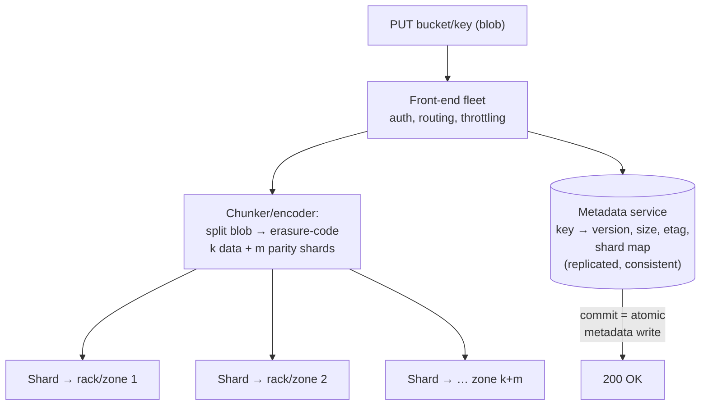

# オブジェクトストレージの内部構造

> **翻訳についての注記:** 本ドキュメントは英語原文 `03-storage-engines/08-object-storage.md` を日本語に翻訳したものです。コードブロックおよびMermaidダイアグラムは原文のまま維持しています。

## TL;DR

オブジェクトストレージ(S3、GCS、Azure Blob、MinIO)は、レイテンシよりも耐久性とスループットに最適化された、フラットな名前空間のキー→ブロブストアです: オブジェクトは不変で(置き換えられ、その場で編集されない)、一度書かれて何度も読まれます。内部は性格の異なる2システムの接合です: キーからチャンク位置への対応を強い整合性で保つ**メタデータ/インデックスサービス** — 本当に難しい分散システムの部分 — と、独立した障害ドメインへチャンクを**イレイジャーコーディング**でストライプする**データプレーン**。レプリケーションの3倍ではなく約1.5倍のストレージオーバーヘッドで「イレブンナイン」の耐久性を達成します。モダンなオブジェクトストアは強整合(read-after-write)で**条件付き書き込み**をサポートし、それが静かに、レイクハウスのテーブルフォーマット、S3上のWALを持つデータベース、リーダーレスな協調の基盤になりました。あるがままに設計してください: 高スループット、数十msのファーストバイト、プレフィックス単位のリクエスト上限、renameなし、appendなし — そしてライフサイクルポリシーに冷たいバイトを価格の階段の下へ運ばせること。

---

## オブジェクトストレージとは何か(何でないか)

| | ブロックストレージ | ファイルシステム | オブジェクトストレージ |
|---|---|---|---|
| 単位 | 固定ブロック | ディレクトリ内のファイル | フラットな名前空間のキー下のオブジェクト |
| 変更 | その場の書き込み | その場+追記 | **オブジェクト全体の置き換えのみ** |
| 名前空間操作 | — | rename・move(安価) | **renameなし** — コピー+削除 |
| レイテンシ | µs–ms | ms | ファーストバイト約10–100ms |
| スループット | デバイス律速 | サーバー律速 | 実質無制限(並列) |
| 規模 | ボリューム | サーバー/NAS | エクサバイト、数兆オブジェクト |
| 適所 | データベース、ブートディスク | 共有POSIXワークロード | ブロブ、バックアップ、レイク、メディア、ログ |

オブジェクトストレージの「ディレクトリ」はキープレフィックスのUI上の虚構です — だからアトミックなrenameは存在せず、ディレクトリのアトミックなrenameを*仮定して*コミットを実装した上物(初期のHadoop-on-S3時代が顕著)はいずれ壊れました。定着した修正は、コミットをメタデータのポインタへ移すこと — まさに[テーブルフォーマット](../13-data-pipelines/05-lakehouse-table-formats.md)がやっていることです。

---

## アーキテクチャ: メタデータプレーン + データプレーン

**メタデータサービスが難所です。** `GET key` と `LIST prefix` に毎秒数百万リクエストの規模で強整合に答え、ゾーン喪失を生き延び、数兆エントリのインデックスを保持しなければなりません — シャーディングされレプリケートされたデータベースの問題です([パーティショニング](../02-distributed-databases/05-partitioning-strategies.md)、[コンセンサス](../02-distributed-databases/08-consensus-algorithms.md))。すべてのアップロードの*コミットポイント*はメタデータ書き込みです: インデックスが「ある」と言ったときにオブジェクトは「存在」します。データのシャードが十数台に散っていても、キー単位の操作がアトミックなのはこのためです。S3はかつてこの継ぎ目を結果整合として露出していました。2020年以降は**強いread-after-write整合性**を提供し、業界も追随しました — 自分のPUTを読め、上書きの可視性はキー単位で線形化可能です。

**データプレーンは機構的には単純ですが巨大です:** 障害ドメインをまたぐ配置、絶え間ないバックグラウンド修復、整合性スクラブ(全シャードのチェックサム検査。ビット腐敗は*いつか*ではなく*必ず*です)。

### イレイジャーコーディング: 1ドルあたりの耐久性

レプリケーションは単純で高価です: 3コピー = 3倍のコスト、2喪失に耐える。**Reed–Solomonイレイジャーコーディング**はオブジェクトを*k*個のデータシャードに分割し、*m*個のパリティシャードを計算します。*k+m個のうち任意のk個*でオブジェクトを再構築できます:

| 方式 | オーバーヘッド | 耐えられる喪失 | 再構築コスト |
|---|---|---|---|
| 3×レプリケーション | 3.0× | 2 | レプリカを1つコピー |
| RS(6, 3) | 1.5× | 3 | 6シャードを読んでデコード |
| RS(10, 4) | 1.4× | 4 | 10シャードを読んでデコード |
| RS(12+, wide) | →1.2× | より多く、ゾーン横断 | 修復I/O増、テールレイテンシ増 |

k+mのシャードをラックとゾーンに分散させると耐久性の数学は複利になります: 有名な99.999999999%(イレブンナイン)の年間耐久性は、修復が置き換えるより*速く*シャードを失う確率です — つまり**ディスク故障率ではなく修復帯域こそが本当の耐久性のノブ**です。イレイジャーコーディングが払う代償: 再構築の読み出しはネットワークを増幅し(1つの修復にkシャードを読む)、劣化読み出し(1シャードが遅い)はテールレイテンシを膨らませます — 実務では局所性を考慮した変種(AzureのLocal Reconstruction Codes等)とシャード読み出しのヘッジング([リトライとヘッジング](../06-scaling/10-retries-timeouts-hedging.md))で緩和します。ホットで小さいオブジェクトはしばしば素のレプリケーションで持ち、ECは大半のバイトを担当します — Facebookのf4はまさにこの分割(ホットな「Haystack」層と温かいEC層)で動いていました。

### マルチパートアップロード・バージョニング・ライフサイクル

- **マルチパートアップロード**はクライアントに露出したEC親和的なチャンキングです: パートは並列にアップロードされ(それぞれ独立にリトライ可能 — 各パートは冪等)、*complete*呼び出しが単一のアトミックなメタデータコミットを実行します。数百MBを超える唯一の正気な道でもあります。
- **バージョニング**は上書き/削除を新バージョンの追記に変えます(削除 = トゥームストーンマーカー)。undo機構であると同時に、**オブジェクトロック/イミュータビリティ**と組み合わせればランサムウェア対策です([ディザスタリカバリ](../15-deployment/05-disaster-recovery.md))。
- **ストレージクラス+ライフサイクルルール**はオブジェクトをコストの階段(ホット → 低頻度 → アーカイブ)に沿って自動で移動させます — コードではなく年齢とアクセスパターンで駆動される、ストレージエンジン版の[階層キャッシング](../04-caching/05-multi-tier-caching.md)です。

---

## 設計の前提となる性能モデル

- **スループットはストリーム単速ではなく並列度でスケールします。** 1本のGETはせいぜい50–100 MB/s。100本の並列レンジGETはNICを飽和させます。リーダーは**レンジ指定の並列**リクエストを発行すべきです(Parquetリーダーが列チャンクを取得する方法そのものです)。
- **プレフィックス単位のリクエスト上限があります**(S3でプレフィックスあたり毎秒3,500書き込み/5,500読み出しのオーダー)。パーティションはキープレフィックスで時間とともに自動分割されますが、新品のバケットを1プレフィックスで叩けばまずスロットルされます — 高RPSのワークロードは設計でキーをプレフィックスに分散させます(手動のハッシュプレフィックスの小細工はもう不要ですが、*分布*自体は存在しなければなりません)。
- **ファーストバイトは数十msです。** オブジェクトストレージはキャッシュでもポイントリード用データベースでもありません。ホットで小さいオブジェクトには[CDN](../06-scaling/04-cdn-architecture.md)やキャッシュ層を前置するか、耐久性のトレードが許される場面でexpress/one-zone型の低レイテンシクラスを使います。
- **リクエストは金がかかります** — 数十億の小オブジェクトを書くパイプラインはバイトよりPUT代を払います。小さいレコードは大きいオブジェクトへまとめること([テーブルフォーマット](../13-data-pipelines/05-lakehouse-table-formats.md)がコンパクションで管理するのと同じスモールファイル問題です)。
- **appendなし・renameなし**が上に乗るすべてのプロトコルを形づくります: ログは不変なセグメントオブジェクトの列として書かれ、「アトミックな公開」はカタログ内のポインタ交換か、一度だけ書かれるキーです。

### 条件付き書き込み: 静かな超能力

`PUT ... If-None-Match: *`(なければ作成)とETagのcompare-and-swapは、オブジェクトストアを協調の基盤に変えました: 勝者総取りのcreateはリース/ロックのプリミティブに、マニフェストポインタのCASはトランザクションのコミットになります — Iceberg型のカタログ、S3上のWAL、「Kafka-on-S3」系システム(Warpstream型、そしてS3自身のappend対応expressティア)が、データパスに独立したコンセンサスサービスを置かずに原子性を実装する方法です。パターンは: **バイトは不変オブジェクトに、真実はCAS可能な1つの小さなポインタに**([分散ロック](../01-foundations/09-distributed-locks.md) — 同じフェンシングの論理、別の基盤)。

---

## 上にうまく築く

- **不変ファースト(immutable-first)のデータレイアウト:** write-onceなセグメント+マニフェスト。大きなブロブのread-modify-writeはしない。更新 = 新オブジェクト+ポインタ切替。
- **エンドツーエンドのETag/チェックサム検証** — アップロードとダウンロードで整合性チェックサムを要求・検証する。マルチパート組み立てをまたぐ静かな破損は、稀で、現実です。
- **署名付きURL**は大きなバイトをクライアント↔ストレージ間で直接動かし、あなたのサービスをメタデータパスに留めます — 入手可能な最も安価な帯域アーキテクチャです。
- **イベント通知**(object-created → キュー)はバケットをパイプラインのソースにします([メッセージキュー](../05-messaging/01-message-queues.md))が、配信はat-least-onceです: コンシューマはキー+etagで重複排除します([冪等性](../01-foundations/08-idempotency.md))。
- **egressが税金です** — バイトをコンピュートへ運ぶのではなく、コンピュートをデータのリージョンへ([FinOps](../11-observability/06-finops-cost-engineering.md))。
- セルフホスト(MinIO、Ceph RGW)は同じAPIを*あなたの*障害ドメインで買うことです — ハイパースケーラーが不可視にしてくれていた修復帯域とスクラブ運用の予算を確保すること。

---

## 参考文献

- [Building and operating a pretty big storage system (S3)](https://www.allthingsdistributed.com/2023/07/building-and-operating-a-pretty-big-storage-system.html) — Andy Warfield; 現代のS3内部の記述
- [f4: Facebook's Warm BLOB Storage System](https://www.usenix.org/conference/osdi14/technical-sessions/presentation/muralidhar) — OSDI '14; ホットなレプリケーション vs 温かいイレイジャーコーディング
- [Windows Azure Storage: A Highly Available Cloud Storage Service with Strong Consistency](https://dl.acm.org/doi/10.1145/2043556.2043571) — SOSP '11; 層化されたstream/partition設計
- [Erasure Coding in Windows Azure Storage (LRC)](https://www.usenix.org/conference/atc12/technical-sessions/presentation/huang) — Local Reconstruction Codes
- [Amazon S3 strong consistency](https://aws.amazon.com/s3/consistency/) / [S3 performance guidelines](https://docs.aws.amazon.com/AmazonS3/latest/userguide/optimizing-performance.html)
- [MinIO erasure coding docs](https://min.io/docs/minio/linux/operations/concepts/erasure-coding.html) — 同じ数学の読みやすいオープンソース実装
